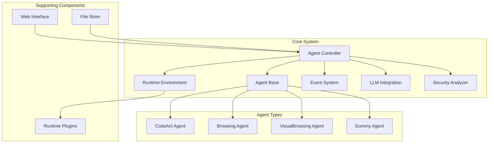
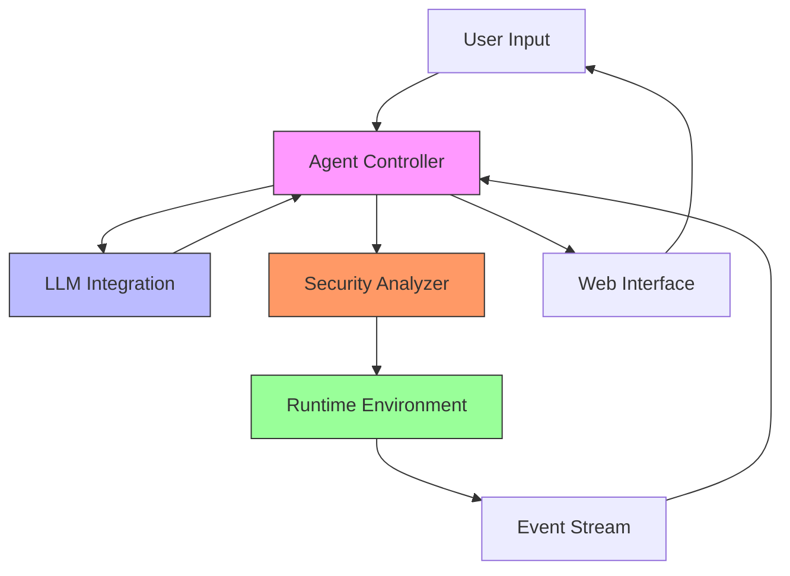
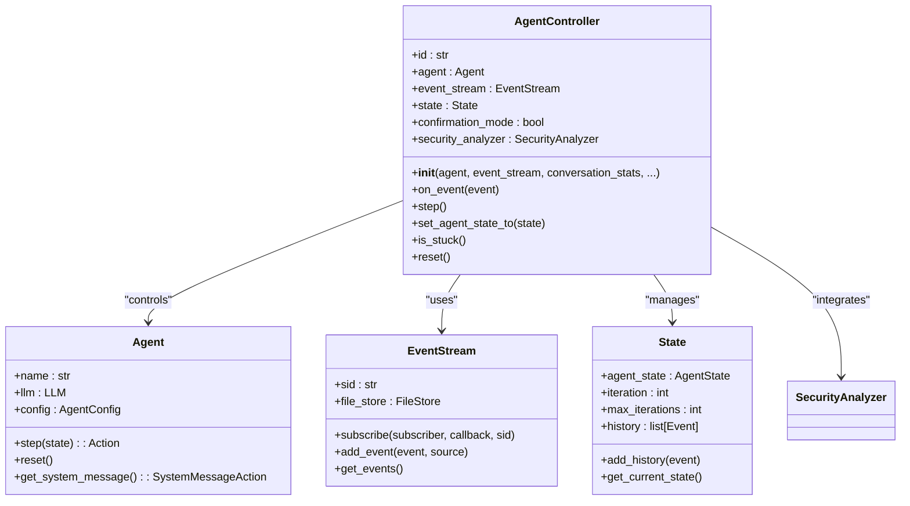
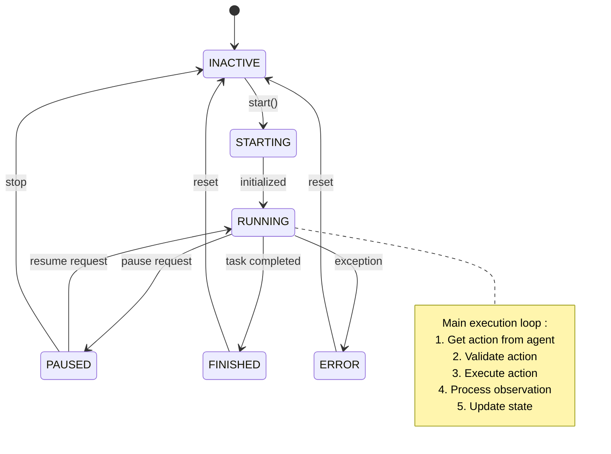
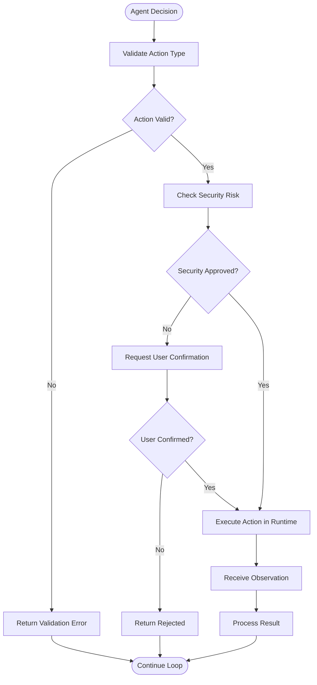
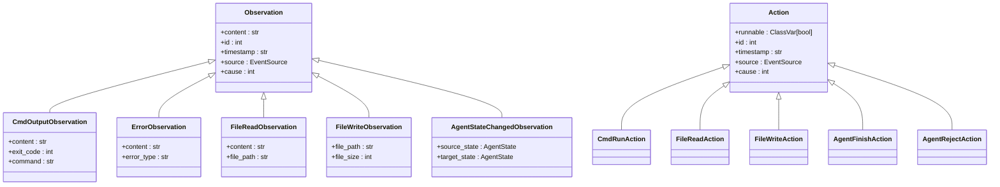
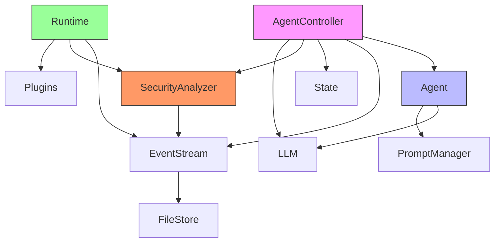

# AI Agent System

<cite>
**Referenced Files in This Document**   
- [agent.py](file://openhands/controller/agent.py)
- [agent_controller.py](file://openhands/controller/agent_controller.py)
- [base.py](file://openhands/runtime/base.py)
- [event.py](file://openhands/events/event.py)
- [action.py](file://openhands/events/action/action.py)
- [observation.py](file://openhands/events/observation/observation.py)
- [loop.py](file://openhands/core/loop.py)
- [security_analyzer.py](file://openhands/security/analyzer.py)
- [llm.py](file://openhands/llm/llm_registry.py)
</cite>

## Table of Contents
1. [Introduction](#introduction)
2. [Project Structure](#project-structure)
3. [Core Components](#core-components)
4. [Architecture Overview](#architecture-overview)
5. [Detailed Component Analysis](#detailed-component-analysis)
6. [Dependency Analysis](#dependency-analysis)
7. [Performance Considerations](#performance-considerations)
8. [Troubleshooting Guide](#troubleshooting-guide)
9. [Conclusion](#conclusion)

## Introduction
The OpenHands AI Agent System is a sophisticated platform designed to enable AI agents to perform software development tasks with human-like capabilities. The system architecture is built around a controller-agent pattern with event-driven communication, state management, and security analysis. Agents can modify code, execute commands, browse the web, and interact with APIs, providing a comprehensive solution for automated software development.

## Project Structure
The OpenHands repository is organized into several key directories that support the agent system:

- **openhands/**: Core agent system components including controller, events, runtime, and LLM integration
- **openhands/agenthub/**: Collection of specialized agent implementations (CodeAct, Browsing, VisualBrowsing, etc.)
- **openhands/controller/**: Agent controller and state management components
- **openhands/events/**: Event system with actions and observations
- **openhands/runtime/**: Runtime environments for agent execution
- **openhands/llm/**: LLM integration and routing
- **openhands/security/**: Security analyzers and risk assessment
- **frontend/**: Web interface for agent interaction
- **enterprise/**: Enterprise-specific features and integrations

This structure supports a modular architecture where agents can be extended and customized for specific use cases while maintaining a consistent core framework.

**Diagram sources**
- [agent.py](file://openhands/controller/agent.py)
- [agent_controller.py](file://openhands/controller/agent_controller.py)
- [base.py](file://openhands/runtime/base.py)

**Section sources**
- [README.md](file://README.md#L1-L185)

## Core Components
The AI Agent System consists of several core components that work together to enable autonomous agent behavior:

- **Agent Controller**: Orchestrates agent execution, manages state, and handles event processing
- **Agent Base Class**: Abstract base class defining the agent interface and lifecycle
- **Runtime Environment**: Sandbox for executing agent actions with isolation and security
- **Event System**: Communication mechanism between components using actions and observations
- **LLM Integration**: Interface to large language models for decision making and planning
- **Security Analyzer**: Risk assessment system for agent actions
- **Memory Management**: Context preservation and recall system

These components form a cohesive system where the agent controller coordinates the agent's interaction with the runtime environment through a stream of events, while ensuring security and maintaining context.

**Section sources**
- [agent.py](file://openhands/controller/agent.py#L1-L184)
- [agent_controller.py](file://openhands/controller/agent_controller.py#L1-L200)
- [base.py](file://openhands/runtime/base.py#L1-L800)

## Architecture Overview
The AI Agent System follows an event-driven architecture with a state machine for the agent loop. The system is designed around several key architectural patterns:

- **Event-Driven Architecture**: Components communicate through a shared event stream
- **State Machine**: Agent execution follows a defined state progression
- **Plugin System**: Extensible architecture for different agent types and capabilities
- **Security-First Design**: Risk assessment integrated at multiple levels
- **Modular Components**: Clear separation of concerns between system components

The agent controller manages the agent's lifecycle, coordinating between the LLM for planning, the runtime for execution, and the security analyzer for risk assessment. The event system serves as the central nervous system, carrying actions from the agent to the runtime and observations back to the agent.

**Diagram sources**
- [agent_controller.py](file://openhands/controller/agent_controller.py)
- [llm.py](file://openhands/llm/llm_registry.py)
- [base.py](file://openhands/runtime/base.py)

## Detailed Component Analysis

### Agent Controller Analysis
The AgentController is the central orchestration component that manages the agent's lifecycle and coordinates interactions between components. It subscribes to the event stream to receive actions from the agent and dispatches them to the appropriate handlers.

**Diagram sources**
- [agent_controller.py](file://openhands/controller/agent_controller.py#L99-L200)
- [agent.py](file://openhands/controller/agent.py#L25-L184)

#### Agent Loop State Machine
The agent execution follows a state machine pattern with well-defined states and transitions. The controller manages the agent's state throughout its lifecycle.

**Diagram sources**
- [agent_controller.py](file://openhands/controller/agent_controller.py)
- [loop.py](file://openhands/core/loop.py)

### Action Execution System
The action execution system is responsible for carrying out the agent's decisions in the runtime environment. Actions are dispatched from the controller to the runtime, which executes them and returns observations.

**Diagram sources**
- [agent_controller.py](file://openhands/controller/agent_controller.py)
- [base.py](file://openhands/runtime/base.py)
- [action.py](file://openhands/events/action/action.py)

### Observation System
The observation system captures the results of action execution and provides feedback to the agent. Observations are structured data that describe the outcome of actions in the environment.

**Diagram sources**
- [observation.py](file://openhands/events/observation/observation.py)
- [action.py](file://openhands/events/action/action.py)

## Dependency Analysis
The AI Agent System has a well-defined dependency structure that enables modularity and extensibility. The core dependencies include:

The system follows a dependency inversion principle where high-level modules depend on abstractions rather than concrete implementations. This allows for easy substitution of components like different runtime environments or security analyzers.

**Diagram sources**
- [agent_controller.py](file://openhands/controller/agent_controller.py)
- [base.py](file://openhands/runtime/base.py)
- [event.py](file://openhands/events/event.py)

## Performance Considerations
The AI Agent System is designed with performance and scalability in mind:

- **Event Stream Optimization**: Events are serialized and stored efficiently to minimize overhead
- **Runtime Isolation**: Each agent runs in a separate sandbox to prevent resource contention
- **LLM Caching**: Response caching reduces redundant LLM calls
- **Asynchronous Processing**: Non-blocking operations improve responsiveness
- **Memory Management**: Context window condenser optimizes memory usage

The system can be deployed in various configurations to meet different performance requirements, from local development to cloud-scale deployments.

## Troubleshooting Guide
Common issues and their solutions:

- **Agent Stuck in Loop**: Check the stuck detector configuration and increase the threshold if needed
- **Runtime Disconnection**: Verify network connectivity and restart the runtime
- **LLM Timeout**: Check API key validity and network connection to the LLM provider
- **Security Analysis Failure**: Verify security analyzer configuration and permissions
- **Event Stream Corruption**: Clear the event stream and restart the agent

Monitoring tools and logs are available to diagnose issues, with detailed error messages provided for debugging.

**Section sources**
- [exceptions.py](file://openhands/core/exceptions.py)
- [agent_controller.py](file://openhands/controller/agent_controller.py)

## Conclusion
The OpenHands AI Agent System provides a robust and extensible platform for AI-powered software development. Its modular architecture, event-driven design, and comprehensive security model make it suitable for a wide range of applications. The system's clear separation of concerns and well-defined interfaces enable easy customization and extension, while maintaining reliability and performance.