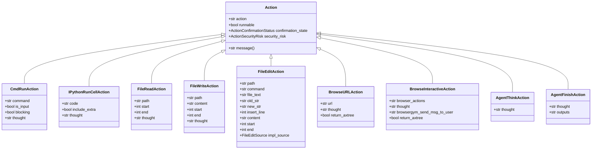
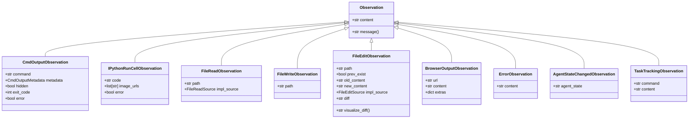
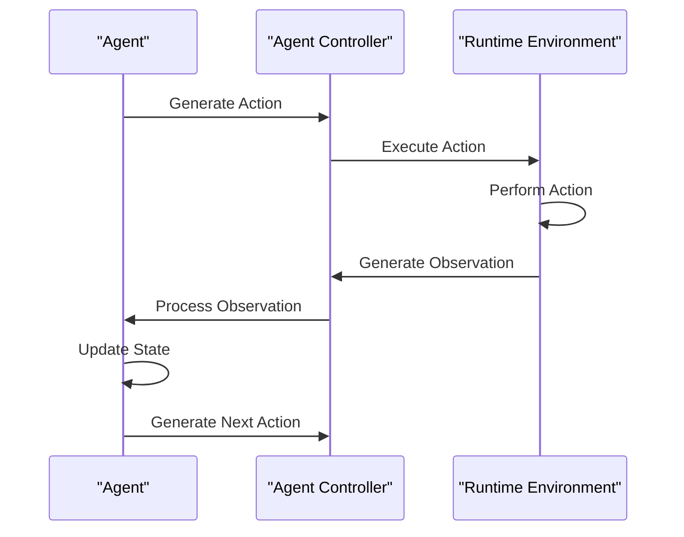
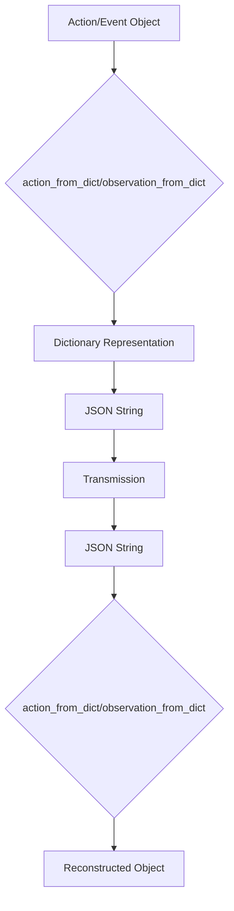
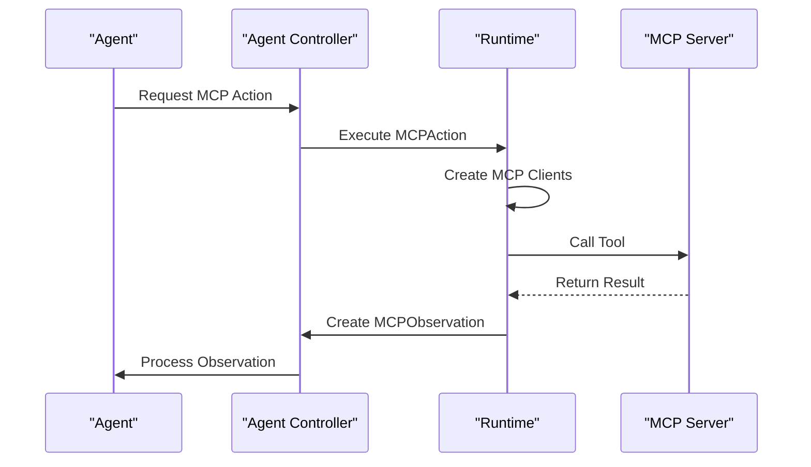
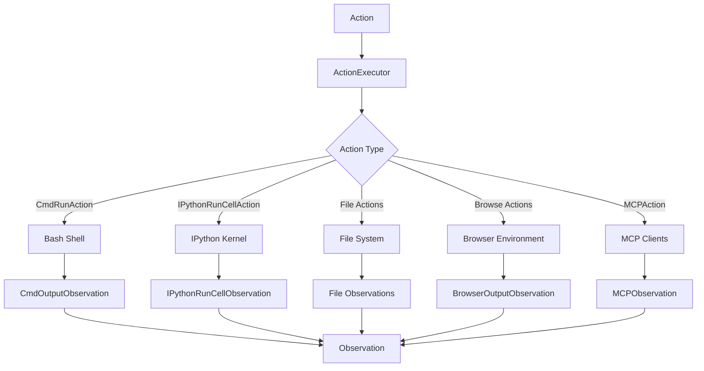
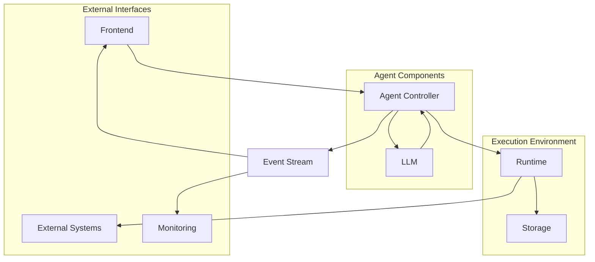
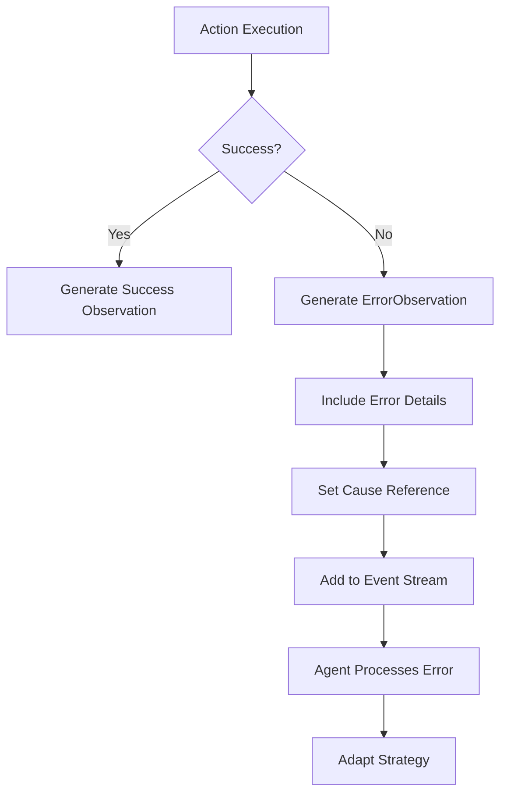
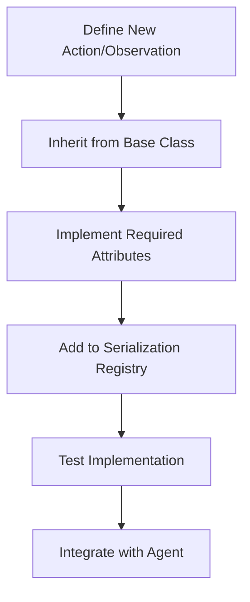

# Action & Observation System

<cite>
**Referenced Files in This Document**   
- [action.py](file://openhands/events/action/action.py)
- [observation.py](file://openhands/events/observation/observation.py)
- [serialization/action.py](file://openhands/events/serialization/action.py)
- [serialization/observation.py](file://openhands/events/serialization/observation.py)
- [commands.py](file://openhands/events/action/commands.py)
- [files.py](file://openhands/events/action/files.py)
- [browse.py](file://openhands/events/action/browse.py)
- [commands.py](file://openhands/events/observation/commands.py)
- [files.py](file://openhands/events/observation/files.py)
- [files.py](file://openhands/runtime/utils/files.py)
- [agent.py](file://openhands/controller/agent.py)
- [action_executor_server.py](file://openhands/runtime/action_executor_server.py)
- [tool.py](file://openhands/mcp/tool.py)
</cite>

## Table of Contents
1. [Introduction](#introduction)
2. [Action Types](#action-types)
3. [Observation Types](#observation-types)
4. [Action-Observation Cycle](#action-observation-cycle)
5. [Serialization System](#serialization-system)
6. [Tool System](#tool-system)
7. [Runtime Execution](#runtime-execution)
8. [Component Relationships](#component-relationships)
9. [Error Handling and Edge Cases](#error-handling-and-edge-cases)
10. [Extending the System](#extending-the-system)

## Introduction

The Action & Observation System forms the core of agent functionality in OpenHands, enabling agents to interact with their environment through a structured cycle of actions and observations. This system provides a robust framework for agents to execute tasks, receive feedback, and adapt their behavior accordingly. The architecture is designed to be extensible, supporting various action types including Bash commands, file operations, web browsing, and more.

The system follows a clear pattern where agents generate actions based on their current state and observations, which are then executed in the runtime environment. The results of these actions are captured as observations and fed back to the agent, creating a continuous loop of interaction. This document details the implementation of this system, covering the domain models, inheritance hierarchy, serialization mechanisms, and integration points with other components.

**Section sources**
- [action.py](file://openhands/events/action/action.py#L21-L24)
- [observation.py](file://openhands/events/observation/observation.py#L6-L16)

## Action Types

The Action & Observation System supports a comprehensive set of action types, each designed for specific interaction patterns with the environment. These actions are implemented as dataclasses that inherit from the base Action class, forming a clear inheritance hierarchy.

### Core Action Hierarchy

**Diagram sources**
- [action.py](file://openhands/events/action/action.py#L21-L24)
- [commands.py](file://openhands/events/action/commands.py#L13-L65)
- [files.py](file://openhands/events/action/files.py#L10-L139)
- [browse.py](file://openhands/events/action/browse.py#L8-L49)

### Action Domain Models

The system implements several key action types, each with specific attributes and behaviors:

**Bash Commands**: The `CmdRunAction` class enables execution of shell commands in the runtime environment. It supports both blocking and non-blocking execution modes, with options to specify the working directory and handle input to running processes.

**File Operations**: The system provides three file-related actions:
- `FileReadAction`: Reads content from a file, optionally specifying line ranges
- `FileWriteAction`: Writes content to a file, with support for partial file updates
- `FileEditAction`: Performs various file editing operations including create, view, str_replace, insert, and undo_edit

**Web Browsing**: Two browsing actions are available:
- `BrowseURLAction`: Navigates to a specified URL and captures the page content
- `BrowseInteractiveAction`: Executes a sequence of browser interactions using BrowserGym syntax

**Agent Control**: Special actions for agent state management:
- `AgentThinkAction`: Represents the agent's internal thought process
- `AgentFinishAction`: Signals task completion with optional output data

**Section sources**
- [commands.py](file://openhands/events/action/commands.py#L13-L65)
- [files.py](file://openhands/events/action/files.py#L10-L139)
- [browse.py](file://openhands/events/action/browse.py#L8-L49)

## Observation Types

Observations represent the environment's response to agent actions, providing feedback that informs subsequent agent decisions. The observation system follows a parallel structure to the action system, with a base Observation class and specialized subclasses for different observation types.

### Observation Inheritance Hierarchy

**Diagram sources**
- [observation.py](file://openhands/events/observation/observation.py#L6-L16)
- [commands.py](file://openhands/events/observation/commands.py#L96-L232)
- [files.py](file://openhands/events/observation/files.py#L11-L196)

### Observation Domain Models

The system implements various observation types that correspond to the action types:

**Command Output**: `CmdOutputObservation` captures the output of executed commands, including metadata such as exit code, process ID, username, hostname, working directory, and Python interpreter path. The observation includes content truncation for large outputs to prevent overwhelming the event stream.

**IPython Output**: `IPythonRunCellObservation` represents the output of IPython cell execution, supporting text output and image URLs for visual results.

**File Operations**: 
- `FileReadObservation`: Contains the content of a read file
- `FileWriteObservation`: Confirms successful file write operations
- `FileEditObservation`: Provides detailed information about file edits, including old and new content, and can generate diff visualizations

**Browser Output**: `BrowserOutputObservation` captures the result of web browsing actions, including the URL, page content, and additional metadata.

**Error Handling**: `ErrorObservation` is used to report failures in action execution, providing descriptive error messages.

**Section sources**
- [commands.py](file://openhands/events/observation/commands.py#L96-L232)
- [files.py](file://openhands/events/observation/files.py#L11-L196)

## Action-Observation Cycle

The action-observation cycle is the fundamental mechanism through which agents interact with their environment. This cycle creates a continuous feedback loop that enables agents to plan, execute, observe, and adapt their behavior.

### Cycle Workflow

**Diagram sources**
- [agent.py](file://openhands/controller/agent.py#L105-L109)
- [action_executor_server.py](file://openhands/runtime/action_executor_server.py)

### Cycle Implementation

The action-observation cycle begins when an agent generates an action based on its current state and the task at hand. The agent controller receives this action and forwards it to the runtime environment for execution. The runtime executes the action and generates an observation that captures the results. This observation is then processed by the controller and made available to the agent, which uses it to update its internal state and plan the next action.

The cycle is implemented through the following key components:
1. **Agent**: Generates actions based on observations and task requirements
2. **Controller**: Manages the state and coordinates action execution
3. **Runtime**: Executes actions in the environment and generates observations
4. **Event Stream**: Transmits actions and observations between components

Each iteration of the cycle advances the agent toward completing its assigned task, with the agent continuously adapting its strategy based on the observations it receives.

**Section sources**
- [agent.py](file://openhands/controller/agent.py#L105-L109)
- [action_executor_server.py](file://openhands/runtime/action_executor_server.py)

## Serialization System

The serialization system enables the transmission of actions and observations between components by converting them to JSON format. This system ensures that complex data structures can be reliably transmitted and reconstructed across different parts of the application.

### Serialization Architecture

**Diagram sources**
- [serialization/action.py](file://openhands/events/serialization/action.py)
- [serialization/observation.py](file://openhands/events/serialization/observation.py)

### Serialization Implementation

The serialization system is implemented in the `events.serialization` module, which provides functions for converting actions and observations to and from dictionary representations that can be easily serialized to JSON.

**Action Serialization**: The `action_from_dict` function converts a dictionary representation of an action into the appropriate action class instance. It uses a registry (`ACTION_TYPE_TO_CLASS`) that maps action type strings to their corresponding classes. The function handles type conversion, default values, and deprecated argument compatibility.

**Observation Serialization**: Similarly, the `observation_from_dict` function converts dictionary representations to observation instances using the `OBSERVATION_TYPE_TO_CLASS` registry. It handles special cases such as metadata conversion and enum value restoration.

**Key Features**:
- **Type Safety**: Uses type hints and validation to ensure data integrity
- **Backward Compatibility**: Handles deprecated arguments and field names
- **Extensibility**: New action and observation types can be added to the registry
- **Error Handling**: Provides clear error messages for malformed inputs

The system also includes special handling for complex data types like `CmdOutputMetadata`, which is converted between dictionary and Pydantic model representations during serialization.

**Section sources**
- [serialization/action.py](file://openhands/events/serialization/action.py)
- [serialization/observation.py](file://openhands/events/serialization/observation.py)

## Tool System

The tool system enables function calling between the agent and external systems, extending the agent's capabilities beyond the core action types. This system is particularly important for integrating with external services and APIs.

### MCP Tool Integration

**Diagram sources**
- [tool.py](file://openhands/mcp/tool.py)
- [agent.py](file://openhands/controller/agent.py#L163-L184)

### Tool System Implementation

The tool system is implemented through the MCP (Model Context Protocol) framework, which allows agents to call external tools and services. The system consists of several key components:

**MCP Client**: Manages connections to MCP servers via different transport mechanisms (SSE, stdio). The client handles tool discovery, authentication, and communication with external services.

**Tool Registration**: Agents can register MCP tools through the `set_mcp_tools` method in the base Agent class. This method processes tool definitions and adds them to the agent's tool collection.

**Tool Execution**: When an agent requests an MCP action, the runtime creates MCP clients based on the configuration, calls the appropriate tool, and converts the result into an `MCPObservation`.

**Key Components**:
- `MCPClient`: Handles communication with MCP servers
- `MCPClientTool`: Represents an MCP tool that can be called by the agent
- `create_mcp_clients`: Factory function that creates MCP clients based on configuration
- `call_tool_mcp`: Executes an MCP tool call and returns an observation

The system supports multiple transport protocols including Server-Sent Events (SSE) and stdio, allowing integration with various external services.

**Section sources**
- [tool.py](file://openhands/mcp/tool.py)
- [agent.py](file://openhands/controller/agent.py#L163-L184)

## Runtime Execution

The runtime environment is responsible for executing actions and generating observations. It provides the isolated execution context where agent actions are performed and their results are captured.

### Runtime Architecture

**Diagram sources**
- [action_executor_server.py](file://openhands/runtime/action_executor_server.py)
- [files.py](file://openhands/runtime/utils/files.py)

### Execution Process

The runtime execution process begins when an action is received by the `ActionExecutor` class. The executor determines the action type and routes it to the appropriate handler:

**Command Execution**: For `CmdRunAction`, the runtime executes the command in a bash shell, capturing the output, exit code, and metadata through a specially crafted PS1 prompt that includes JSON-encoded metadata.

**File Operations**: File actions are handled by utility functions in `runtime.utils.files` that resolve paths, read/write files, and generate appropriate observations. Path resolution ensures that file operations are restricted to the workspace directory.

**IPython Execution**: `IPythonRunCellAction` is executed in an IPython kernel, with output captured and formatted appropriately, including support for image outputs.

**Browser Interactions**: Browsing actions are handled by the BrowserEnv integration, which manages the browser state and executes the specified actions.

**Error Handling**: The runtime includes comprehensive error handling for various failure modes, generating appropriate `ErrorObservation` instances when actions cannot be completed.

The runtime also manages plugins that extend its capabilities, such as the Jupyter plugin for IPython execution and the VSCode plugin for IDE integration.

**Section sources**
- [action_executor_server.py](file://openhands/runtime/action_executor_server.py)
- [files.py](file://openhands/runtime/utils/files.py)

## Component Relationships

The Action & Observation System integrates with several key components of the OpenHands architecture, creating a cohesive ecosystem for agent functionality.

### System Integration Diagram

**Diagram sources**
- [agent.py](file://openhands/controller/agent.py)
- [action_executor_server.py](file://openhands/runtime/action_executor_server.py)

### Integration Points

**Agent Controller**: The central coordination point that manages the agent state, receives actions from the agent, forwards them to the runtime, and processes observations. It maintains the event stream that records the entire action-observation history.

**Frontend**: Provides the user interface for interacting with agents, displaying actions and observations in a user-friendly format. The frontend subscribes to the event stream to receive real-time updates.

**LLM Integration**: The agent uses an LLM to generate actions based on observations and task requirements. The system includes mechanisms for passing tool information to the LLM and processing its responses.

**Storage**: Persists the event stream and agent state, enabling session recovery and historical analysis. Observations are stored with appropriate truncation to manage storage requirements.

**Monitoring**: Collects metrics and telemetry from the action-observation cycle, providing insights into agent performance and system health.

**External Systems**: Through the MCP framework, agents can interact with various external services and APIs, extending their capabilities beyond the local environment.

The system is designed with loose coupling between components, allowing for independent development and testing of each part while maintaining a cohesive overall architecture.

**Section sources**
- [agent.py](file://openhands/controller/agent.py)
- [action_executor_server.py](file://openhands/runtime/action_executor_server.py)

## Error Handling and Edge Cases

The Action & Observation System includes comprehensive error handling mechanisms to address various failure modes and edge cases that may occur during agent operation.

### Error Handling Strategy

**Diagram sources**
- [files.py](file://openhands/runtime/utils/files.py)
- [test_mcp_tool_timeout_stall.py](file://tests/unit/mcp/test_mcp_tool_timeout_stall.py#L212-L248)

### Common Issues and Solutions

**Large Output Handling**: Command outputs are truncated when they exceed a configurable size limit (default 30,000 characters) to prevent overwhelming the event stream and LLM context. The truncation preserves the beginning and end of the output with a clear indicator of truncation in the middle.

**Permission Management**: File operations are restricted to the workspace directory through path resolution that validates all file paths against the workspace base. Attempts to access files outside the workspace result in `ErrorObservation` instances.

**Timeout Handling**: Commands can be configured with hard timeouts to prevent infinite execution. When a command times out, it receives a soft timeout signal (-1 exit code) and can be resumed later.

**Error Propagation**: Errors are propagated through the system with appropriate context, including the original action ID as the cause reference. This allows agents to understand the relationship between actions and their resulting errors.

**Context Maintenance**: The system maintains context across action-observation pairs by preserving metadata such as working directory, Python interpreter path, and process ID. This ensures that subsequent actions have access to the necessary context for coherent operation.

**Deprecated Field Handling**: The serialization system includes compatibility layers for deprecated fields and argument names, ensuring backward compatibility with older event streams.

These mechanisms work together to create a robust system that can handle unexpected conditions gracefully while providing agents with the information they need to adapt their behavior.

**Section sources**
- [files.py](file://openhands/runtime/utils/files.py)
- [test_mcp_tool_timeout_stall.py](file://tests/unit/mcp/test_mcp_tool_timeout_stall.py#L212-L248)

## Extending the System

The Action & Observation System is designed to be extensible, allowing developers to add custom actions and observations to meet specific requirements.

### Extension Guidelines

**Diagram sources**
- [action.py](file://openhands/events/action/action.py)
- [observation.py](file://openhands/events/observation/observation.py)

### Extension Process

To extend the system with custom actions and observations, follow these steps:

**1. Define the Class**: Create a new class that inherits from the appropriate base class (`Action` or `Observation`). Include all required attributes and methods.

**2. Implement Serialization**: Ensure the new class is properly handled by the serialization system. For actions, add the class to the `actions` tuple in `serialization/action.py`. For observations, add it to the `observations` tuple in `serialization/observation.py`.

**3. Register with System**: The serialization system automatically registers classes through the module imports, so ensure your new classes are imported in the appropriate `__init__.py` files.

**4. Implement Runtime Handling**: If the action requires special execution logic, implement the appropriate handlers in the runtime components.

**5. Test Thoroughly**: Create comprehensive tests that verify the action/observation can be serialized, executed, and properly integrated into the action-observation cycle.

**Best Practices**:
- Follow existing naming conventions and code style
- Include comprehensive docstrings and type hints
- Handle edge cases and error conditions appropriately
- Consider performance implications of large data transfers
- Ensure backward compatibility when modifying existing types

The system's modular design makes it relatively straightforward to add new capabilities while maintaining the integrity of the overall architecture.

**Section sources**
- [action.py](file://openhands/events/action/action.py)
- [observation.py](file://openhands/events/observation/observation.py)