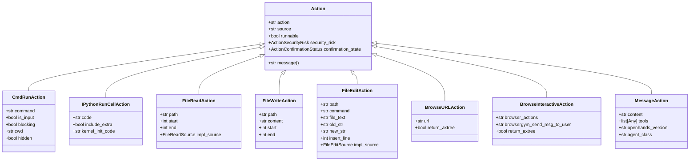
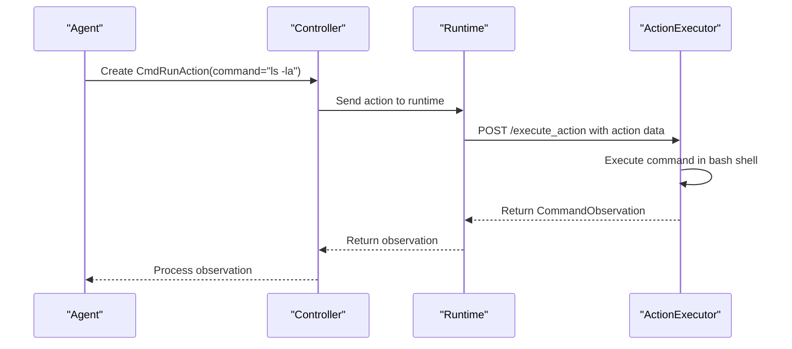
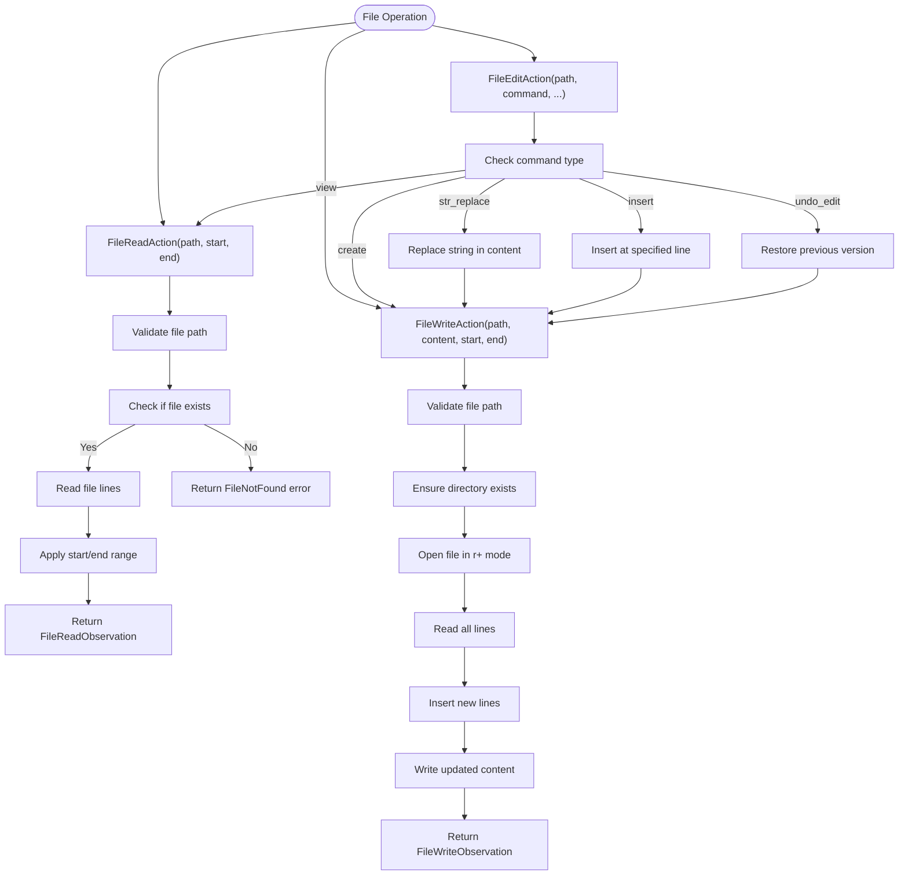
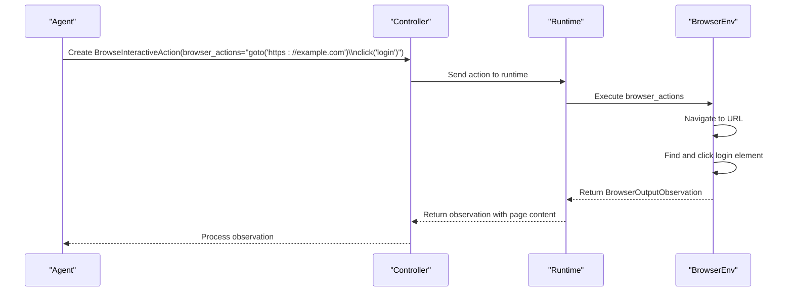
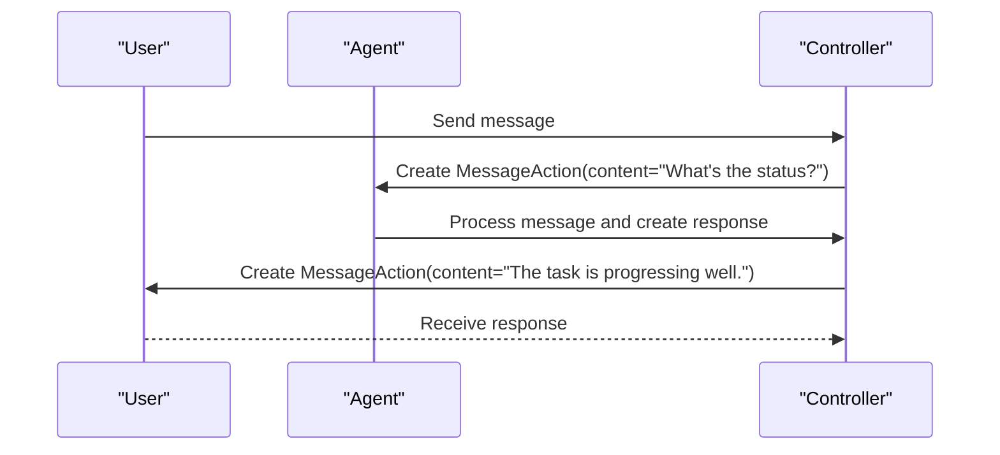
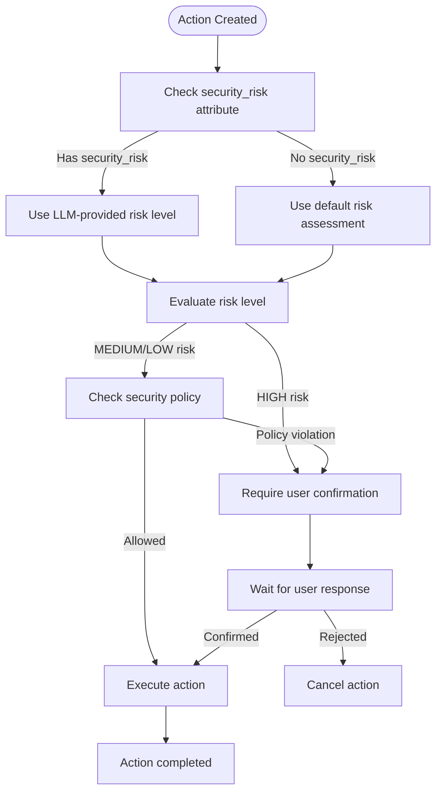
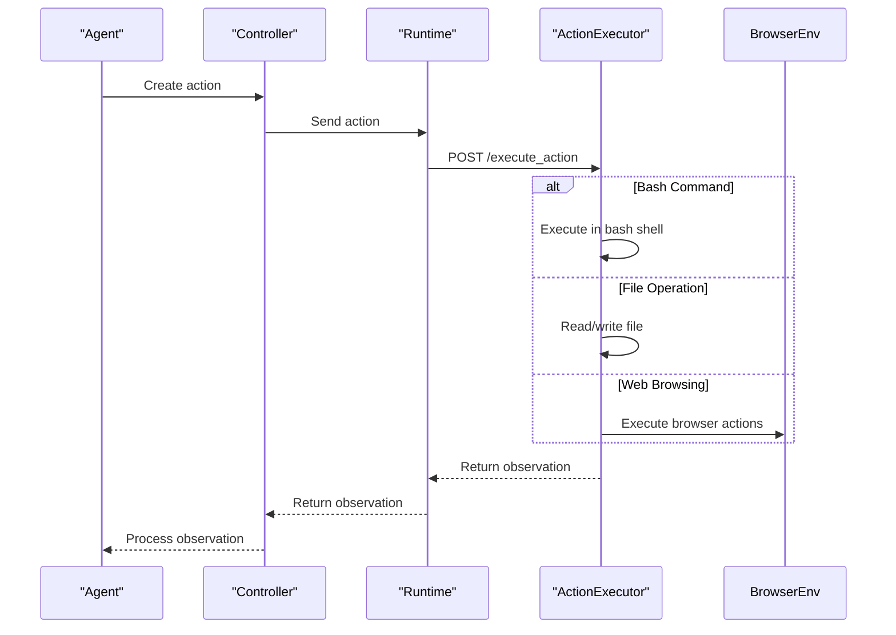

# Action Types

<cite>
**Referenced Files in This Document**   
- [action.py](file://openhands/events/action/action.py)
- [commands.py](file://openhands/events/action/commands.py)
- [files.py](file://openhands/events/action/files.py)
- [browse.py](file://openhands/events/action/browse.py)
- [message.py](file://openhands/events/action/message.py)
- [action_executor_server.py](file://openhands/runtime/action_execution_server.py)
- [security_risk.py](file://openhands/security/llm/analyzer.py)
- [invariant/analyzer.py](file://openhands/security/invariant/analyzer.py)
- [str_replace_editor.py](file://openhands/agenthub/codeact_agent/tools/str_replace_editor.py)
- [utils/files.py](file://openhands/runtime/utils/files.py)
</cite>

## Table of Contents
1. [Introduction](#introduction)
2. [Action Class Hierarchy](#action-class-hierarchy)
3. [Bash Command Actions](#bash-command-actions)
4. [File Operations](#file-operations)
5. [Web Browsing Actions](#web-browsing-actions)
6. [Message Passing](#message-passing)
7. [Action Validation and Security](#action-validation-and-security)
8. [Action Execution and Dispatching](#action-execution-and-dispatching)
9. [Extending the Action System](#extending-the-action-system)
10. [Troubleshooting Common Issues](#troubleshooting-common-issues)

## Introduction

The OpenHands framework implements a comprehensive action system that enables agents to interact with their environment through various action types. These actions form the core of agent capabilities, allowing them to execute commands, manipulate files, browse the web, and communicate with users. The action system is designed with security, extensibility, and ease of use in mind, providing a robust foundation for agent operations.

The action types are implemented as a hierarchy of classes that inherit from the base Action class. Each action type has specific parameters, constraints, and execution logic that define its behavior. The system includes built-in validation, security assessment, and execution mechanisms that ensure actions are processed safely and efficiently.

This document provides a detailed analysis of the different action types available in the OpenHands framework, their implementation, and how they interact with the security and execution systems.

**Section sources**
- [action.py](file://openhands/events/action/action.py)
- [commands.py](file://openhands/events/action/commands.py)

## Action Class Hierarchy

The action system in OpenHands is built on a well-defined class hierarchy that provides a consistent interface for all action types. At the core of this hierarchy is the base Action class, which defines common properties and behaviors that are inherited by all specific action types.



**Diagram sources**
- [action.py](file://openhands/events/action/action.py)
- [commands.py](file://openhands/events/action/commands.py)
- [files.py](file://openhands/events/action/files.py)
- [browse.py](file://openhands/events/action/browse.py)
- [message.py](file://openhands/events/action/message.py)

The base Action class, defined in `action.py`, serves as the foundation for all action types. It includes several key attributes:

- `runnable`: A class variable that indicates whether the action can be executed (default is False)
- `security_risk`: An enumeration that represents the security risk level of the action (UNKNOWN, LOW, MEDIUM, HIGH)
- `confirmation_state`: An enumeration that tracks the confirmation status of the action (CONFIRMED, REJECTED, AWAITING_CONFIRMATION)

All concrete action types inherit from this base class and set `runnable = True` to indicate they can be executed. The inheritance hierarchy allows for polymorphic handling of actions while providing type-specific functionality through specialized attributes and methods.

**Section sources**
- [action.py](file://openhands/events/action/action.py)
- [commands.py](file://openhands/events/action/commands.py)
- [files.py](file://openhands/events/action/files.py)
- [browse.py](file://openhands/events/action/browse.py)
- [message.py](file://openhands/events/action/message.py)

## Bash Command Actions

Bash command actions enable agents to execute shell commands in the runtime environment. These actions are implemented through the `CmdRunAction` and `IPythonRunCellAction` classes, which provide different capabilities for command execution.

### CmdRunAction

The `CmdRunAction` class is used for executing standard bash commands in the terminal environment. It includes several parameters that control how the command is executed:

- `command`: The bash command to execute
- `is_input`: Indicates whether the command is input to a running process
- `blocking`: Determines if the command should run in blocking mode (requires a timeout)
- `is_static`: Runs the command in a separate process if True
- `cwd`: The current working directory for the command (only used if is_static is True)
- `hidden`: If True, the command does not go through the LLM or event stream

The `CmdRunAction` supports both interactive and non-interactive command execution. When `is_input` is True, the command is treated as input to a currently running process rather than a new command. This is useful for providing input to interactive programs or scripts.

### IPythonRunCellAction

The `IPythonRunCellAction` class enables agents to execute Python code interactively using IPython. This action type is particularly useful for data analysis, prototyping, and testing code snippets. Key parameters include:

- `code`: The Python code to execute
- `include_extra`: Whether to include additional information like the current working directory and Python interpreter in the output
- `kernel_init_code`: Code to run in the kernel if the kernel is restarted

The IPython action maintains state between executions, allowing variables and functions defined in one action to be used in subsequent actions. This persistent state enables complex workflows that build upon previous computations.



**Diagram sources**
- [commands.py](file://openhands/events/action/commands.py)
- [action_executor_server.py](file://openhands/runtime/action_execution_server.py)

**Section sources**
- [commands.py](file://openhands/events/action/commands.py)
- [action_executor_server.py](file://openhands/runtime/action_execution_server.py)

## File Operations

The file operation actions in OpenHands provide comprehensive capabilities for reading, writing, and editing files in the workspace. These actions are implemented through the `FileReadAction`, `FileWriteAction`, and `FileEditAction` classes, each serving specific purposes in file manipulation.

### FileReadAction

The `FileReadAction` class allows agents to read files from the filesystem. It includes parameters that provide fine-grained control over what content is read:

- `path`: The file path to read
- `start`: The starting line number (0-indexed, default 0)
- `end`: The ending line number (-1 for end of file, default -1)
- `impl_source`: The source of the file read operation (DEFAULT)
- `view_range`: Line number range for OH_ACI mode (optional)

The action supports reading specific portions of a file by specifying start and end line numbers, which is particularly useful for large files where reading the entire content would be inefficient. The `view_range` parameter is used in OH_ACI mode to specify the range of lines to display.

### FileWriteAction

The `FileWriteAction` class enables agents to write content to files. Key parameters include:

- `path`: The file path to write to
- `content`: The content to write
- `start`: The starting line for insertion (0-indexed, default 0)
- `end`: The ending line for replacement (-1 for end of file, default -1)

When writing to a file, the action can either create a new file or modify an existing one. The start and end parameters allow for partial file updates, replacing only specific sections of the file rather than overwriting the entire content.

### FileEditAction

The `FileEditAction` class provides a more sophisticated interface for file editing, supporting multiple editing commands:

- `command`: The editing command to execute (view, create, str_replace, insert, undo_edit)
- `file_text`: Content for create command
- `old_str`: String to replace in str_replace command
- `new_str`: Replacement string in str_replace command
- `insert_line`: Line number for insert command
- `impl_source`: Source of implementation (LLM_BASED_EDIT or OH_ACI)

The `FileEditAction` supports two main modes of operation:
1. LLM-based editing (impl_source = FileEditSource.LLM_BASED_EDIT)
2. ACI-based editing (impl_source = FileEditSource.OH_ACI)

In LLM-based editing mode, the action uses the content, start, and end attributes to modify files. In ACI-based mode, it uses the command attribute with specific parameters depending on the command type.



**Diagram sources**
- [files.py](file://openhands/events/action/files.py)
- [utils/files.py](file://openhands/runtime/utils/files.py)

**Section sources**
- [files.py](file://openhands/events/action/files.py)
- [utils/files.py](file://openhands/runtime/utils/files.py)

## Web Browsing Actions

The web browsing actions in OpenHands enable agents to interact with web content through both simple navigation and interactive browser operations. These actions are implemented through the `BrowseURLAction` and `BrowseInteractiveAction` classes.

### BrowseURLAction

The `BrowseURLAction` class provides basic web navigation capabilities:

- `url`: The URL to navigate to
- `return_axtree`: Whether to return the accessibility tree of the page

This action is used for simple navigation to a specific URL, retrieving the content of the webpage for analysis. It's typically used when the agent needs to access information from a specific web page without requiring complex interactions.

### BrowseInteractiveAction

The `BrowseInteractiveAction` class enables more sophisticated browser interactions using BrowserGym commands. Key parameters include:

- `browser_actions`: A string containing BrowserGym commands to execute
- `browsergym_send_msg_to_user`: A message to send to the user during browser interaction
- `return_axtree`: Whether to return the accessibility tree of the page

The `browser_actions` parameter can contain multiple BrowserGym commands separated by newlines, allowing for complex workflows such as:
- Navigating to a URL
- Clicking on elements
- Filling out forms
- Extracting information from the page
- Navigating through multiple pages

The browsing system integrates with BrowserEnv, which provides a programmatic interface to control a web browser. This allows agents to perform tasks that require web interaction, such as research, data extraction, or interacting with web applications.



**Diagram sources**
- [browse.py](file://openhands/events/action/browse.py)
- [action_executor_server.py](file://openhands/runtime/action_execution_server.py)

**Section sources**
- [browse.py](file://openhands/events/action/browse.py)
- [action_executor_server.py](file://openhands/runtime/action_execution_server.py)

## Message Passing

Message passing actions enable communication between agents, users, and the system. These actions are implemented through various message action classes that facilitate different types of communication.

### MessageAction

The `MessageAction` class is used for sending messages within the system. It includes parameters that define the message content and context:

- `content`: The message content
- `tools`: A list of available tools (optional)
- `openhands_version`: The OpenHands version (optional)
- `agent_class`: The agent class (optional)

This action type is used for various communication scenarios, including:
- Agent-to-user communication
- Agent-to-agent communication
- System notifications
- Tool availability announcements

### SystemMessageAction

The `SystemMessageAction` class is used for system-level messages that provide context or instructions to the agent. It includes additional parameters for system-specific information:

- `tools`: A list of available tools
- `agent_class`: The class of the agent receiving the message
- `openhands_version`: The version of the OpenHands framework

System messages are used to initialize the agent with necessary context, provide updates about available tools, or communicate system status changes.



**Diagram sources**
- [message.py](file://openhands/events/action/message.py)

**Section sources**
- [message.py](file://openhands/events/action/message.py)

## Action Validation and Security

The OpenHands framework implements a comprehensive security system to assess and manage the risks associated with different actions. This system ensures that potentially dangerous operations are properly evaluated before execution.

### Security Risk Levels

Actions are assigned security risk levels based on their potential impact:

- `UNKNOWN`: Risk level not determined
- `LOW`: Minimal risk operations
- `MEDIUM`: Operations with moderate risk
- `HIGH`: Potentially dangerous operations

These risk levels are used to determine whether user confirmation is required before executing an action.

### Security Analyzers

The framework supports multiple security analyzers that can be configured based on the deployment requirements:

#### LLM Risk Analyzer

The default security analyzer that leverages LLM-provided risk assessments:

- Respects the `security_risk` attribute set by the LLM
- Automatically requires confirmation for HIGH-risk actions
- Lightweight with no external dependencies
- Integrates seamlessly with the agent's decision-making process

#### Invariant Analyzer

A more sophisticated analyzer that uses external policy checking:

- Analyzes action sequences against defined policies
- Detects potential security issues in workflows
- Uses confirmation mode for risky actions
- Provides detailed risk assessment

The security system is configured through the `SecurityAnalyzers` dictionary in `security/options.py`, which maps analyzer names to their implementation classes.



**Diagram sources**
- [action.py](file://openhands/events/action/action.py)
- [security_risk.py](file://openhands/security/llm/analyzer.py)
- [invariant/analyzer.py](file://openhands/security/invariant/analyzer.py)

**Section sources**
- [action.py](file://openhands/events/action/action.py)
- [security_risk.py](file://openhands/security/llm/analyzer.py)
- [invariant/analyzer.py](file://openhands/security/invariant/analyzer.py)

## Action Execution and Dispatching

The action execution system in OpenHands is responsible for dispatching actions to the appropriate runtime components and managing their execution. This system ensures that actions are processed efficiently and securely.

### Action Executor

The `ActionExecutor` class, implemented in `action_executor_server.py`, is the central component of the execution system. It provides an HTTP endpoint `/execute_action` that receives actions and returns observations. Key responsibilities include:

- Initializing the user environment and bash shell
- Managing plugins and their initialization
- Executing various action types (bash commands, IPython cells, file operations, browsing)
- Integrating with BrowserEnv for web interactions

The executor runs in a separate process or container, providing isolation between the agent and the execution environment.

### Runtime Implementations

OpenHands supports multiple runtime implementations that extend the `ActionExecutionClient` class:

- **Docker**: Runs locally in a Docker container
- **Remote**: Uses a custom HTTP API for remote runtime management
- **Modal**: Uses the Modal API
- **Runloop**: Uses the Runloop API

These implementations handle the lifecycle of the execution environment, including creation, pausing, resuming, and stopping.



**Diagram sources**
- [action_executor_server.py](file://openhands/runtime/action_execution_server.py)

**Section sources**
- [action_executor_server.py](file://openhands/runtime/action_execution_server.py)

## Extending the Action System

The OpenHands action system is designed to be extensible, allowing developers to add custom action types and integrate them with the agent's decision-making process.

### Creating Custom Actions

To create a custom action type, follow these steps:

1. Create a new class that inherits from the base `Action` class
2. Define the specific parameters needed for your action
3. Set the `action` attribute to a unique action type
4. Set `runnable = True` to indicate the action can be executed
5. Implement any necessary methods, such as `message()`

```python
@dataclass
class CustomAction(Action):
    """A custom action that performs a specific task."""
    
    parameter: str
    action: str = "custom_action"
    runnable: ClassVar[bool] = True
    security_risk: ActionSecurityRisk = ActionSecurityRisk.UNKNOWN
    
    @property
    def message(self) -> str:
        return f"Performing custom action with parameter: {self.parameter}"
```

### Integrating with Agent Decision-Making

To integrate a custom action with the agent's decision-making process:

1. Add the action to the agent's available tools
2. Update the agent's prompt to include information about the new action
3. Implement a response parser to convert LLM output into the custom action
4. Register the action with the action executor

The system's modular design makes it relatively straightforward to add new action types while maintaining compatibility with existing components.

**Section sources**
- [action.py](file://openhands/events/action/action.py)
- [action_executor_server.py](file://openhands/runtime/action_execution_server.py)

## Troubleshooting Common Issues

This section addresses common issues that may arise when working with the action system and provides guidance for resolving them.

### Command Injection Prevention

The action system includes several safeguards against command injection:

- Input validation for all action parameters
- Restricted execution environment (sandbox)
- Security risk assessment before execution
- User confirmation for high-risk actions

To further enhance security, always validate and sanitize any user input that might be used in action parameters.

### Handling Long-Running Processes

For actions that may take a long time to complete:

- Set appropriate timeouts using `set_hard_timeout()`
- Use non-blocking execution when possible
- Provide progress updates through intermediate observations
- Implement graceful cancellation mechanisms

### Managing File System Permissions

When working with file operations:

- Ensure the runtime environment has appropriate permissions
- Handle permission errors gracefully
- Validate file paths to prevent directory traversal attacks
- Use absolute paths when possible to avoid ambiguity

The system automatically handles common file operation errors, returning appropriate error observations when issues occur.

**Section sources**
- [action.py](file://openhands/events/action/action.py)
- [commands.py](file://openhands/events/action/commands.py)
- [files.py](file://openhands/events/action/files.py)