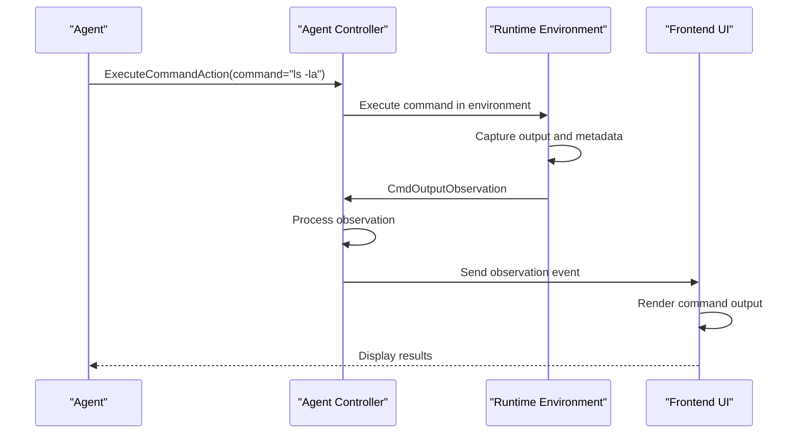
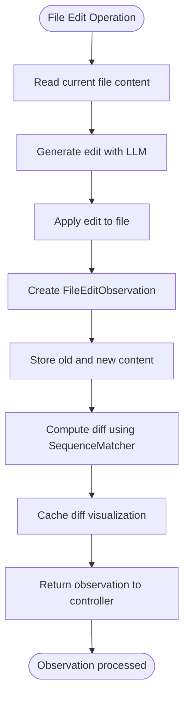
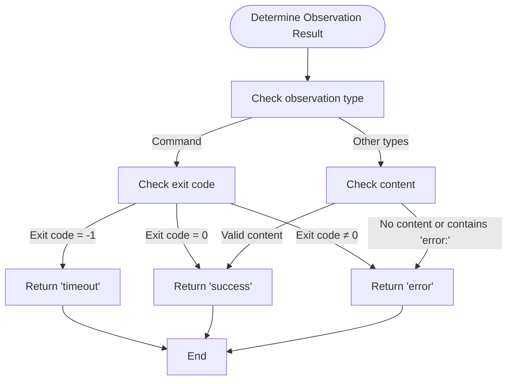
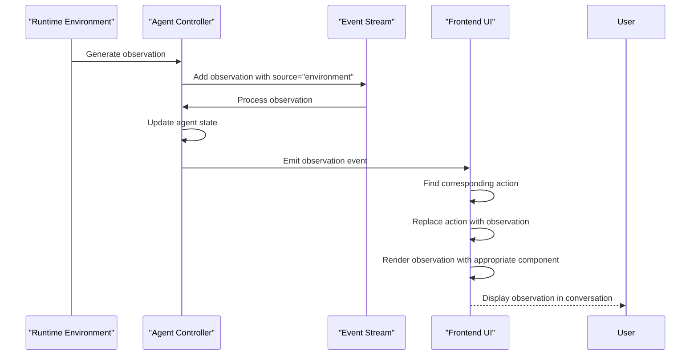

# Observation Types

<cite>
**Referenced Files in This Document**   
- [observation.py](file://openhands/events/observation/observation.py)
- [commands.py](file://openhands/events/observation/commands.py)
- [files.py](file://openhands/events/observation/files.py)
- [error.py](file://openhands/events/observation/error.py)
- [browse.py](file://openhands/events/observation/browse.py)
- [mcp.py](file://openhands/events/observation/mcp.py)
- [task_tracking.py](file://openhands/events/observation/task_tracking.py)
- [agent.py](file://openhands/events/observation/agent.py)
- [observation.py](file://frontend/src/types/core/observations.ts)
- [observation-type.tsx](file://frontend/src/types/observation-type.tsx)
- [get-observation-result.ts](file://frontend/src/components/features/chat/event-content-helpers/get-observation-result.ts)
</cite>

## Table of Contents
1. [Introduction](#introduction)
2. [Observation Type Hierarchy](#observation-type-hierarchy)
3. [Command Execution Observations](#command-execution-observations)
4. [File System Observations](#file-system-observations)
5. [Error and Success Observations](#error-and-success-observations)
6. [Interactive and Browsing Observations](#interactive-and-browsing-observations)
7. [Specialized Observations](#specialized-observations)
8. [Observation Processing and Display](#observation-processing-and-display)
9. [Data Structure and Metadata](#data-structure-and-metadata)
10. [Observation Lifecycle and Agent Context](#observation-lifecycle-and-agent-context)
11. [Common Issues and Best Practices](#common-issues-and-best-practices)
12. [Extending the Observation System](#extending-the-observation-system)

## Introduction

The Observation system in OpenHands represents the results of action execution within the agent environment. Observations capture various types of outcomes including command outputs, file content, errors, and success states. These observations form a critical part of the agent's feedback loop, enabling the agent to understand the consequences of its actions and make informed decisions for subsequent steps.

Observations are generated by the runtime environment in response to actions initiated by the agent, processed by the agent controller, and ultimately displayed in the frontend interface. The system is designed with a clear inheritance hierarchy where all observation types extend from a base Observation class, allowing for consistent handling while supporting specialized behavior for different observation types.

This documentation provides a comprehensive overview of the observation types implemented in OpenHands, detailing their domain model, inheritance hierarchy, data structures, and processing flow throughout the system.

**Section sources**
- [observation.py](file://openhands/events/observation/observation.py)
- [observation-type.tsx](file://frontend/src/types/observation-type.tsx)

## Observation Type Hierarchy

The observation system in OpenHands follows a well-defined inheritance hierarchy with a base Observation class that serves as the foundation for all specific observation types. This hierarchical structure enables polymorphic handling of observations while allowing specialized behavior for different types of observations.

```mermaid
classDiagram
class Observation {
+content : str
+id : str
+timestamp : str
+source : str
+cause : str
+message : str
}
class CmdOutputObservation {
+command : str
+metadata : CmdOutputMetadata
+hidden : bool
+command_id : int
+exit_code : int
+error : bool
+success : bool
}
class IPythonRunCellObservation {
+code : str
+image_urls : list[str]
+error : bool
+success : bool
}
class FileReadObservation {
+path : str
+impl_source : FileReadSource
}
class FileWriteObservation {
+path : str
}
class FileEditObservation {
+path : str
+prev_exist : bool
+old_content : str
+new_content : str
+impl_source : FileEditSource
+diff : str
+_diff_cache : str
}
class ErrorObservation {
+error_id : str
}
class SuccessObservation {
}
class BrowserOutputObservation {
+url : str
+trigger_by_action : str
+screenshot : str
+screenshot_path : str
+set_of_marks : str
+error : bool
+goal_image_urls : list[str]
+open_pages_urls : list[str]
+active_page_index : int
+dom_object : dict[str, Any]
+axtree_object : dict[str, Any]
+extra_element_properties : dict[str, Any]
+last_browser_action : str
+last_browser_action_error : str
+focused_element_bid : str
+filter_visible_only : bool
}
class MCPObservation {
+name : str
+arguments : dict[str, Any]
}
class TaskTrackingObservation {
+command : str
+task_list : list[dict[str, Any]]
}
class AgentStateChangedObservation {
+agent_state : str
+reason : str
}
class AgentThinkObservation {
}
class AgentDelegateObservation {
+outputs : dict
}
Observation <|-- CmdOutputObservation
Observation <|-- IPythonRunCellObservation
Observation <|-- FileReadObservation
Observation <|-- FileWriteObservation
Observation <|-- FileEditObservation
Observation <|-- ErrorObservation
Observation <|-- SuccessObservation
Observation <|-- BrowserOutputObservation
Observation <|-- MCPObservation
Observation <|-- TaskTrackingObservation
Observation <|-- AgentStateChangedObservation
Observation <|-- AgentThinkObservation
Observation <|-- AgentDelegateObservation
```

**Diagram sources**
- [observation.py](file://openhands/events/observation/observation.py)
- [commands.py](file://openhands/events/observation/commands.py)
- [files.py](file://openhands/events/observation/files.py)
- [error.py](file://openhands/events/observation/error.py)
- [browse.py](file://openhands/events/observation/browse.py)
- [mcp.py](file://openhands/events/observation/mcp.py)
- [task_tracking.py](file://openhands/events/observation/task_tracking.py)
- [agent.py](file://openhands/events/observation/agent.py)

**Section sources**
- [observation.py](file://openhands/events/observation/observation.py)
- [commands.py](file://openhands/events/observation/commands.py)
- [files.py](file://openhands/events/observation/files.py)

## Command Execution Observations

Command execution observations capture the results of command execution within the agent's environment. The primary classes handling command execution are CmdOutputObservation and IPythonRunCellObservation, which represent the output of shell commands and IPython cell executions respectively.

CmdOutputObservation includes comprehensive metadata captured from the shell environment, including exit codes, process IDs, username, hostname, working directory, and Python interpreter path. The observation system implements content truncation for large outputs, with a default maximum size of 30,000 characters to prevent performance issues. When content exceeds this limit, it is truncated with a message indicating the truncation.

The metadata is captured through a specialized PS1 prompt that includes JSON-encoded metadata between delimiter strings (###PS1JSON### and ###PS1END###). This metadata is parsed and stored in a CmdOutputMetadata object, which provides properties for accessing the various metadata fields. The exit code is particularly important as it determines the success or failure of the command execution, with exit code 0 indicating success and non-zero values indicating errors.

IPythonRunCellObservation handles the execution of code in IPython cells, which is commonly used for data analysis and scientific computing tasks. Unlike shell commands, IPython cells do not return exit codes, so the observation is always considered successful. The observation can include image URLs when the executed code generates visual output.

**Diagram sources**
- [commands.py](file://openhands/events/observation/commands.py)

**Section sources**
- [commands.py](file://openhands/events/observation/commands.py)

## File System Observations

File system observations track all file operations performed by the agent, including reading, writing, and editing files. These observations provide a detailed record of how the agent interacts with the file system, which is essential for understanding the agent's behavior and debugging issues.

FileReadObservation captures the content of files when they are read by the agent. It includes the file path and the content of the file, with an implementation source field that indicates how the file was read (e.g., through a direct read operation or as part of another process). This observation type helps the agent understand the current state of files in the workspace.

FileWriteObservation represents file write operations, recording when the agent writes content to a file. It includes the file path and the content that was written, allowing the agent to verify that the write operation was successful and to understand the new state of the file.

FileEditObservation is the most sophisticated file system observation, representing file edits that may involve changes to specific portions of a file rather than complete overwrites. It includes both the old and new content of the file, enabling the generation of diffs that show exactly what changes were made. The observation can generate a visual diff representation that highlights additions, deletions, and modifications with appropriate formatting.

**Diagram sources**
- [files.py](file://openhands/events/observation/files.py)

**Section sources**
- [files.py](file://openhands/events/observation/files.py)

## Error and Success Observations

Error and success observations represent the outcomes of actions in terms of their success or failure. These observations play a crucial role in the agent's decision-making process, allowing it to understand when actions have succeeded or failed and to adjust its strategy accordingly.

ErrorObservation captures errors encountered during action execution. Unlike fatal errors that would terminate the agent, these are recoverable errors that the agent can potentially address through subsequent actions. The observation includes an error ID for tracking specific error types and the error message content. Error observations are generated when actions fail to achieve their intended outcome, such as when a linter reports issues with edited code or when a command produces an error message.

SuccessObservation represents successful action outcomes. It is a simple observation type that indicates an action has completed successfully without errors. The observation's message property returns the content, providing a straightforward way to communicate success to the agent.

The system uses a consistent approach to determine observation results across different observation types. For command execution observations, the exit code determines the result: exit code 0 indicates success, non-zero exit codes indicate errors, and exit code -1 indicates a timeout. For other observation types like file operations and MCP tool calls, the presence of content and absence of error indicators in the content determine success.

**Diagram sources**
- [error.py](file://openhands/events/observation/error.py)
- [success.py](file://openhands/events/observation/success.py)
- [get-observation-result.ts](file://frontend/src/components/features/chat/event-content-helpers/get-observation-result.ts)

**Section sources**
- [error.py](file://openhands/events/observation/error.py)
- [success.py](file://openhands/events/observation/success.py)
- [get-observation-result.ts](file://frontend/src/components/features/chat/event-content-helpers/get-observation-result.ts)

## Interactive and Browsing Observations

Interactive and browsing observations capture the agent's interactions with web browsers and other interactive environments. These observations are essential for tasks that involve web navigation, data extraction from websites, or interacting with web-based applications.

BrowserOutputObservation represents the output of browser operations, including both standard browsing and interactive browsing. It includes comprehensive information about the browsing session, such as the current URL, screenshot data, accessibility tree (axtree), DOM structure, and information about open pages. The observation also tracks the last browser action and any errors that occurred during the action.

The observation includes several fields that support interactive browsing:
- screenshot and screenshot_path for visual representation of the current page
- dom_object and axtree_object for programmatic access to page structure
- open_pages_urls and active_page_index for managing multiple tabs
- last_browser_action and last_browser_action_error for debugging navigation issues
- focused_element_bid for tracking keyboard focus

These observations enable the agent to understand the current state of the browser and make informed decisions about subsequent navigation or interaction actions. The rich data captured in these observations allows the agent to reason about page content, identify interactive elements, and verify the results of browser actions.

**Section sources**
- [browse.py](file://openhands/events/observation/browse.py)

## Specialized Observations

OpenHands implements several specialized observation types that serve specific purposes in the agent's operation and user interaction.

MCPObservation represents the results of MCP (Model Context Protocol) server operations. It captures the name of the MCP tool that was called, the arguments passed to the tool, and the content of the response. This observation type enables integration with external tools and services through the MCP protocol, expanding the agent's capabilities beyond its core functionality.

TaskTrackingObservation captures the results of task tracking operations, such as planning or viewing tasks. It includes a command field indicating the type of task operation and a task_list containing detailed information about individual tasks, including their ID, title, status, and optional notes. This observation type supports task management workflows within the agent system.

AgentStateChangedObservation indicates changes in the agent's state, such as transitions between different operational modes. It includes the new agent state and an optional reason for the state change. This observation helps coordinate complex workflows involving multiple agents or state transitions.

AgentThinkObservation represents the agent's internal thought process. It is essentially a no-op observation that acknowledges a thought action has been logged. This observation type provides transparency into the agent's reasoning process without affecting the environment.

**Section sources**
- [mcp.py](file://openhands/events/observation/mcp.py)
- [task_tracking.py](file://openhands/events/observation/task_tracking.py)
- [agent.py](file://openhands/events/observation/agent.py)

## Observation Processing and Display

Observations follow a well-defined processing flow from generation in the runtime environment to display in the frontend interface. This flow ensures that observations are properly handled, stored, and presented to users in a consistent and informative manner.

When an action is executed in the runtime environment, the corresponding observation is generated and added to the event stream with the source set to "environment". The agent controller processes this observation, updating its internal state and potentially generating new actions based on the observation results. The observation is then sent to the frontend, where it is displayed in the conversation interface.

The frontend implements a specific pattern for handling observation events. When an observation event is received, it replaces the corresponding action event in the UI event list, creating a paired representation of action and observation. This approach provides a clear visual connection between what the agent attempted to do and what actually happened as a result.

Different observation types are rendered using specialized components in the frontend. For example, command output observations display the command and its output with syntax highlighting, file edit observations show diffs with change indicators, and browser observations include screenshots and interactive elements. The frontend also uses the observation's metadata to provide additional context, such as timing information and execution status.

**Diagram sources**
- [utils.py](file://openhands/events/utils.py)
- [handle-event-for-ui.ts](file://frontend/src/utils/handle-event-for-ui.ts)

**Section sources**
- [utils.py](file://openhands/events/utils.py)
- [handle-event-for-ui.ts](file://frontend/src/utils/handle-event-for-ui.ts)

## Data Structure and Metadata

Observations in OpenHands have a consistent data structure with common fields and type-specific metadata. The base Observation class defines the core structure, while subclasses add specialized fields relevant to their specific observation types.

All observations include the following core fields:
- content: The main content of the observation
- id: Unique identifier for the observation
- timestamp: When the observation was created
- source: The source of the observation (typically "environment")
- cause: The ID of the action that caused this observation
- observation: The observation type (e.g., "run", "read", "error")

In addition to these core fields, observations include type-specific metadata that provides detailed context about the observation. For example, command observations include exit codes, process IDs, and environment information, while file edit observations include path information and diff data.

The system implements content size limits to prevent performance issues with large observations. Command output observations are truncated to a maximum of 30,000 characters, with a message indicating truncation when necessary. This limit helps maintain system responsiveness while still providing sufficient context for the agent to understand the results of its actions.

Timing information is captured as part of the observation's timestamp field, which records when the observation was created. This allows for analysis of action execution times and identification of potential performance bottlenecks in the agent's workflow.

**Section sources**
- [observation.py](file://openhands/events/observation/observation.py)
- [commands.py](file://openhands/events/observation/commands.py)
- [files.py](file://openhands/events/observation/files.py)

## Observation Lifecycle and Agent Context

Observations play a critical role in updating the agent's context and informing subsequent decision-making. The lifecycle of an observation spans from its generation in response to an action, through processing by the agent controller, to its incorporation into the agent's memory and context.

When an observation is generated, it is added to the event stream and becomes part of the agent's historical context. The agent controller uses observations to update its internal state, validate the results of actions, and determine the next steps in the task. Observations with errors may trigger recovery strategies, while successful observations confirm progress toward the goal.

The agent's memory system incorporates observations into its context representation, with mechanisms to manage context size and relevance. The condenser system may summarize or filter observations to maintain an effective context window, prioritizing essential information while discarding less relevant details.

Observations also influence the agent's learning process, as patterns in observation outcomes can inform future decision-making. For example, if certain types of commands consistently fail, the agent may learn to avoid similar approaches in the future. Similarly, successful patterns can be reinforced and reused in similar contexts.

The relationship between actions and observations creates a feedback loop that enables the agent to adapt to the environment and refine its approach over time. Each observation provides information that helps the agent assess its current situation and plan subsequent actions more effectively.

**Section sources**
- [memory/condenser/impl/conversation_window_condenser.py](file://openhands/memory/condenser/impl/conversation_window_condenser.py)
- [controller.py](file://openhands/controller/agent.py)

## Common Issues and Best Practices

Several common issues arise when working with observations in the OpenHands system, along with corresponding best practices for addressing them.

Handling large outputs is a frequent challenge, particularly with command execution that produces extensive output. The system addresses this through content truncation, but developers should be aware of the 30,000 character limit and design workflows that minimize unnecessary output. Using command options to limit output (e.g., head, tail, grep) can help keep observations manageable.

Error classification is another important consideration. The system distinguishes between recoverable errors (ErrorObservation) and fatal errors, but proper error handling requires careful design of error recovery strategies. Agents should be designed to recognize common error patterns and apply appropriate recovery actions.

Maintaining consistency between observations and the actual system state is critical for reliable agent operation. This requires careful synchronization between the agent's internal state representation and the external environment. Regular state validation through explicit observation requests can help detect and correct discrepancies.

Best practices for working with observations include:
- Designing actions to produce clear, parseable output
- Using structured data formats when possible for easier parsing
- Implementing appropriate error handling and recovery strategies
- Monitoring observation sizes to avoid performance issues
- Using observation metadata to enhance debugging and analysis
- Regularly reviewing observation patterns to identify optimization opportunities

**Section sources**
- [commands.py](file://openhands/events/observation/commands.py)
- [error.py](file://openhands/events/observation/error.py)

## Extending the Observation System

The OpenHands observation system is designed to be extensible, allowing developers to add custom observation types and integrate them with the agent's learning and memory systems. To create a new observation type, developers should follow these steps:

1. Create a new dataclass that inherits from the base Observation class
2. Define the specific fields needed for the new observation type
3. Implement any specialized properties or methods
4. Register the observation type in the ObservationType enum
5. Create corresponding frontend components for displaying the observation

When integrating custom observation types with the agent's learning and memory systems, developers should consider how the observation will be processed by the condenser system, how it will contribute to the agent's context, and how it will influence decision-making. The observation should provide meaningful information that helps the agent understand its environment and progress toward its goals.

Custom observations should follow the same patterns as built-in observation types, including proper metadata, consistent error handling, and appropriate content size management. They should also be designed to work seamlessly with the existing observation processing pipeline and frontend display components.

**Section sources**
- [observation.py](file://openhands/events/observation/observation.py)
- [observation-type.tsx](file://frontend/src/types/observation-type.tsx)