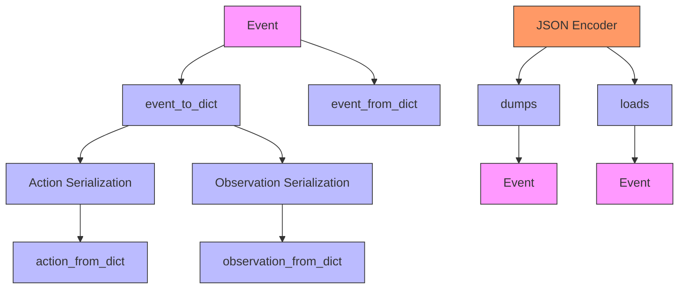
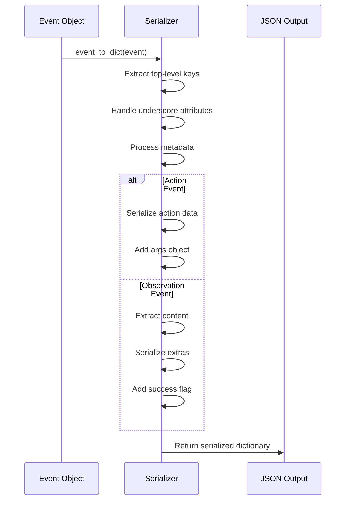
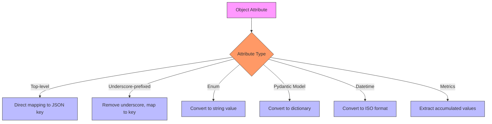
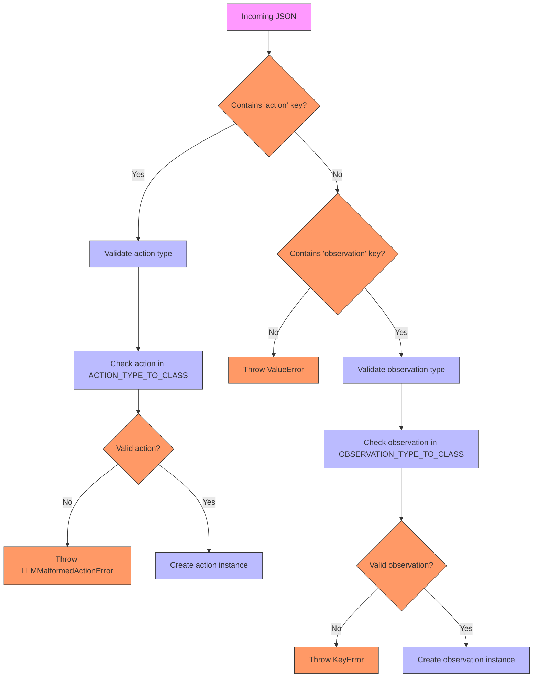
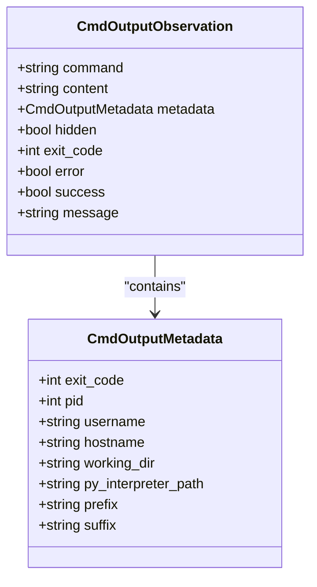
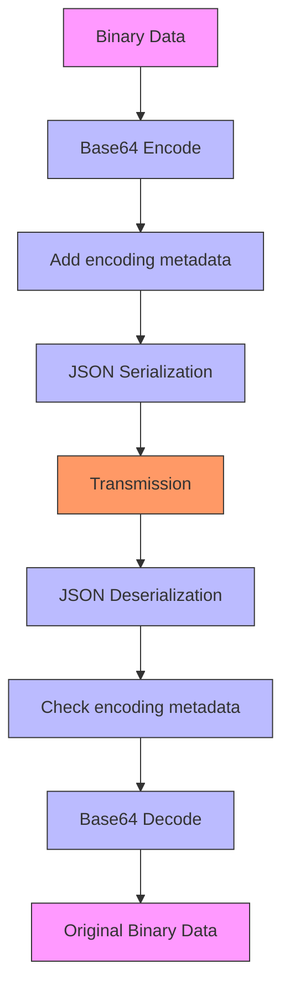
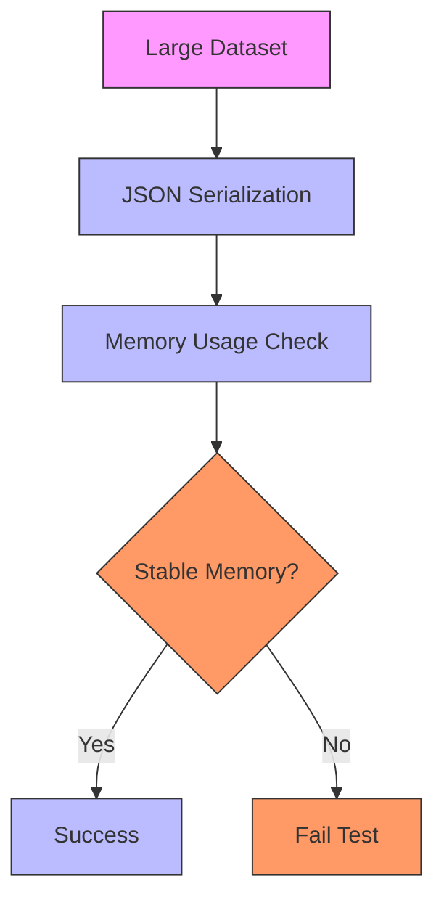
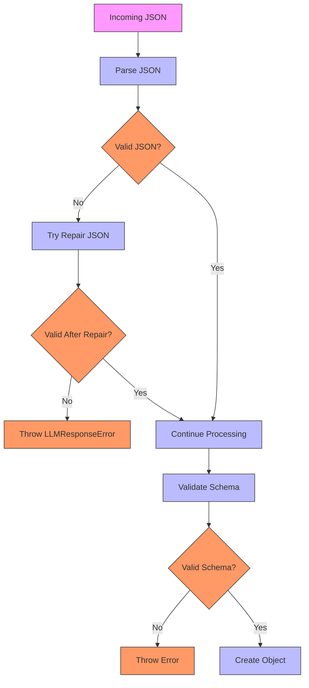
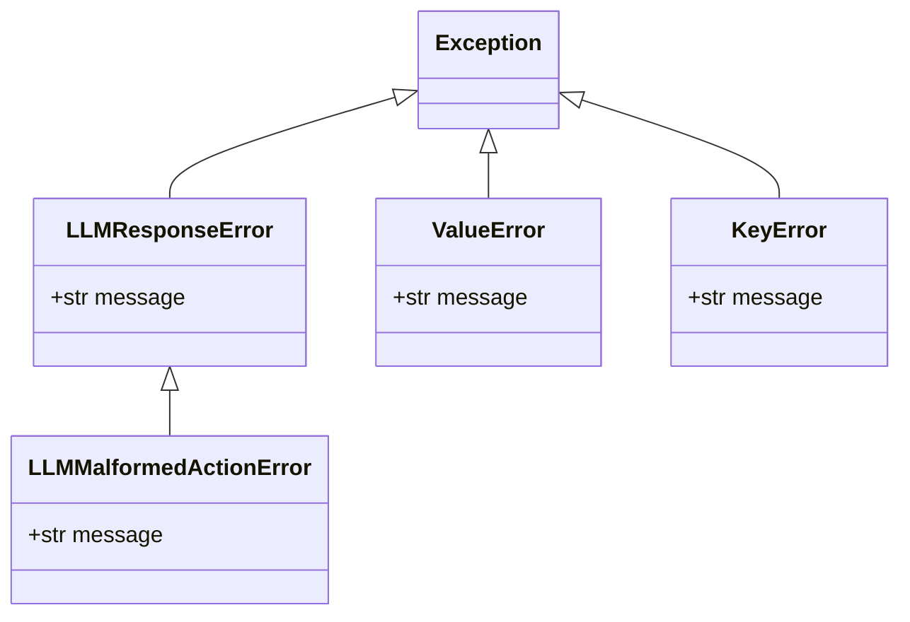
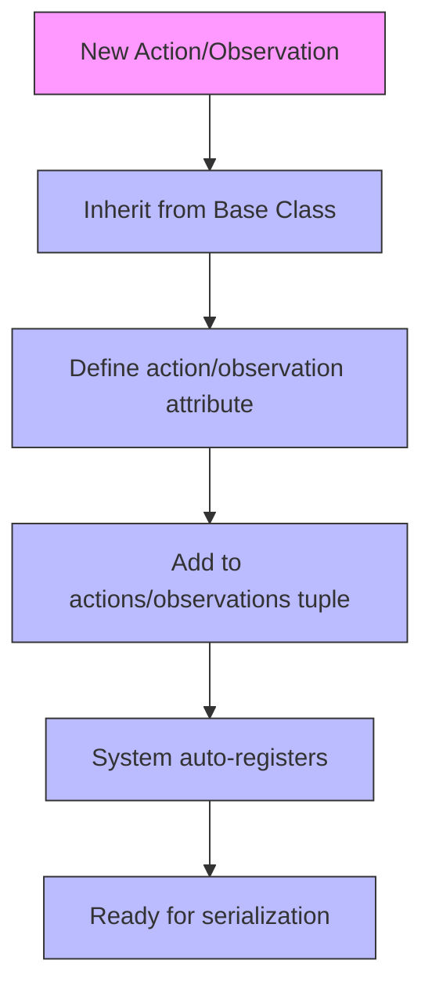

# Serialization System

<cite>
**Referenced Files in This Document**   
- [event.py](file://openhands/events/serialization/event.py)
- [action.py](file://openhands/events/serialization/action.py)
- [observation.py](file://openhands/events/serialization/observation.py)
- [json.py](file://openhands/io/json.py)
- [CmdOutputObservation.py](file://openhands/events/observation/commands.py)
- [CmdRunAction.py](file://openhands/events/action/commands.py)
- [test_event_serialization.py](file://tests/unit/events/test_event_serialization.py)
- [test_json.py](file://tests/unit/io/test_json.py)
</cite>

## Table of Contents
1. [Introduction](#introduction)
2. [Serialization Framework Architecture](#serialization-framework-architecture)
3. [Core Serialization Protocols](#core-serialization-protocols)
4. [Data Transformation Rules](#data-transformation-rules)
5. [Schema Validation Mechanisms](#schema-validation-mechanisms)
6. [Handling Complex Objects](#handling-complex-objects)
7. [Special Data Types Handling](#special-data-types-handling)
8. [Data Integrity and Edge Cases](#data-integrity-and-edge-cases)
9. [Performance Optimization](#performance-optimization)
10. [Security Considerations](#security-considerations)
11. [Error Handling and Debugging](#error-handling-and-debugging)
12. [Extending the Serialization System](#extending-the-serialization-system)
13. [Best Practices](#best-practices)

## Introduction
The Serialization System in OpenHands is responsible for converting actions and observations to JSON format for transmission between components. This system ensures that complex data structures, including file contents, command outputs, and browser states, are properly serialized and deserialized while maintaining data integrity. The framework handles various data types, implements validation mechanisms, and provides robust error handling for edge cases such as encoding issues and version compatibility.

**Section sources**
- [event.py](file://openhands/events/serialization/event.py#L1-L179)
- [json.py](file://openhands/io/json.py#L1-L75)

## Serialization Framework Architecture
The serialization framework is built around a modular architecture that separates concerns between event serialization, action serialization, and observation serialization. The core components work together to provide a comprehensive serialization solution.



**Diagram sources**
- [event.py](file://openhands/events/serialization/event.py#L100-L152)
- [action.py](file://openhands/events/serialization/action.py#L98-L154)
- [observation.py](file://openhands/events/serialization/observation.py#L99-L140)
- [json.py](file://openhands/io/json.py#L35-L74)

**Section sources**
- [event.py](file://openhands/events/serialization/event.py#L1-L179)
- [action.py](file://openhands/events/serialization/action.py#L1-L155)
- [observation.py](file://openhands/events/serialization/observation.py#L1-L141)

## Core Serialization Protocols
The serialization system implements standardized protocols for converting actions and observations to JSON format. These protocols ensure consistent data representation across the application.

### Event Serialization Protocol
The event serialization protocol follows a structured approach to convert events to dictionaries:

1. Extract top-level keys (id, timestamp, source, message, cause, action, observation)
2. Handle underscore-prefixed attributes
3. Process tool call metadata and LLM metrics
4. Serialize action or observation-specific data
5. Apply content truncation when necessary



**Diagram sources**
- [event.py](file://openhands/events/serialization/event.py#L100-L152)

**Section sources**
- [event.py](file://openhands/events/serialization/event.py#L100-L152)

## Data Transformation Rules
The serialization system applies specific transformation rules to ensure data consistency and compatibility.

### Field Mapping and Transformation
The system maps object attributes to JSON fields according to predefined rules:



**Diagram sources**
- [event.py](file://openhands/events/serialization/event.py#L100-L152)

**Section sources**
- [event.py](file://openhands/events/serialization/event.py#L100-L152)

## Schema Validation Mechanisms
The serialization system includes robust validation mechanisms to ensure data integrity and schema compliance.

### Deserialization Validation
During deserialization, the system validates incoming data against expected schemas:



**Diagram sources**
- [action.py](file://openhands/events/serialization/action.py#L98-L154)
- [observation.py](file://openhands/events/serialization/observation.py#L99-L140)

**Section sources**
- [action.py](file://openhands/events/serialization/action.py#L98-L154)
- [observation.py](file://openhands/events/serialization/observation.py#L99-L140)

## Handling Complex Objects
The serialization system is designed to handle complex objects such as file contents, command outputs, and browser states.

### Command Output Serialization
Command outputs are serialized with comprehensive metadata:



**Diagram sources**
- [commands.py](file://openhands/events/observation/commands.py#L97-L232)

**Section sources**
- [commands.py](file://openhands/events/observation/commands.py#L97-L232)

## Special Data Types Handling
The system implements specialized handling for various data types to ensure proper serialization.

### Binary Content Handling
Binary content is base64 encoded during serialization:



**Diagram sources**
- [test_batched_web_hook.py](file://tests/unit/storage/test_batched_web_hook.py#L205-L235)

**Section sources**
- [test_batched_web_hook.py](file://tests/unit/storage/test_batched_web_hook.py#L205-L235)

## Data Integrity and Edge Cases
The serialization system addresses various edge cases to maintain data integrity.

### Content Truncation
Large content is truncated to prevent excessive memory usage:

```python
def truncate_content(content: str, max_chars: int | None = None) -> str:
    """Truncate the middle of the observation content if it is too long."""
    if max_chars is None or len(content) <= max_chars or max_chars < 0:
        return content
    
    half = max_chars // 2
    return (
        content[:half]
        + '\n[... Observation truncated due to length ...]\n'
        + content[-half:]
    )
```

**Section sources**
- [event.py](file://openhands/events/serialization/event.py#L167-L179)
- [commands.py](file://openhands/events/observation/commands.py#L139-L165)

## Performance Optimization
The system includes optimizations for handling large payloads efficiently.

### Memory Management
The JSON encoder is designed to prevent memory leaks:



**Diagram sources**
- [test_json_encoder.py](file://tests/unit/io/test_json_encoder.py#L15-L48)

**Section sources**
- [test_json_encoder.py](file://tests/unit/io/test_json_encoder.py#L15-L48)

## Security Considerations
The serialization system includes security measures for deserialization.

### Input Validation
All deserialized data is validated to prevent security issues:



**Diagram sources**
- [json.py](file://openhands/io/json.py#L50-L74)

**Section sources**
- [json.py](file://openhands/io/json.py#L50-L74)

## Error Handling and Debugging
The system provides comprehensive error handling for serialization issues.

### Error Types
The system handles various error types:



**Diagram sources**
- [json.py](file://openhands/io/json.py#L7-L74)
- [action.py](file://openhands/events/serialization/action.py#L3-L154)

**Section sources**
- [json.py](file://openhands/io/json.py#L7-L74)
- [action.py](file://openhands/events/serialization/action.py#L3-L154)

## Extending the Serialization System
The system is designed to be extensible for custom serializers.

### Adding Custom Serializers
To add a custom serializer, follow these steps:

1. Create a new action or observation class
2. Register it in the appropriate type-to-class mapping
3. Implement serialization methods if needed



**Diagram sources**
- [action.py](file://openhands/events/serialization/action.py#L30-L53)
- [observation.py](file://openhands/events/serialization/observation.py#L35-L59)

**Section sources**
- [action.py](file://openhands/events/serialization/action.py#L30-L53)
- [observation.py](file://openhands/events/serialization/observation.py#L35-L59)

## Best Practices
Follow these best practices when working with the serialization system:

### Backward Compatibility
Maintain backward compatibility by:
- Handling deprecated fields gracefully
- Providing default values for missing fields
- Supporting multiple versions of schemas

### Performance Guidelines
Optimize performance by:
- Limiting payload size
- Using efficient data structures
- Avoiding unnecessary serialization

### Security Recommendations
Ensure security by:
- Validating all deserialized data
- Sanitizing input before processing
- Implementing proper error handling

**Section sources**
- [action.py](file://openhands/events/serialization/action.py#L56-L94)
- [observation.py](file://openhands/events/serialization/observation.py#L82-L96)