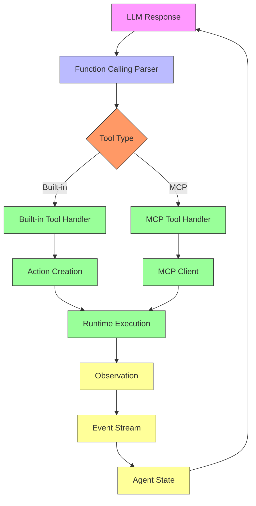
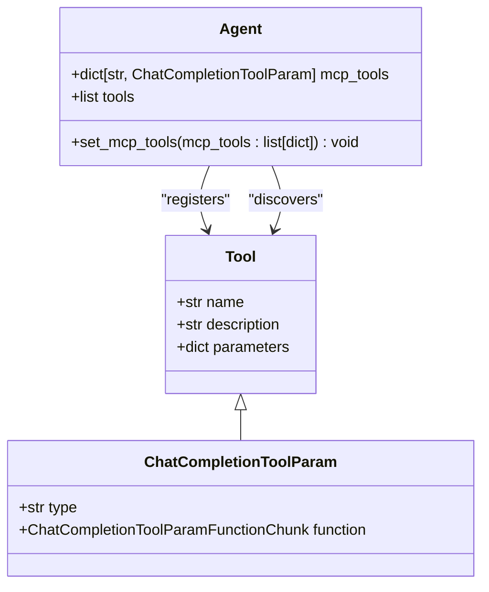
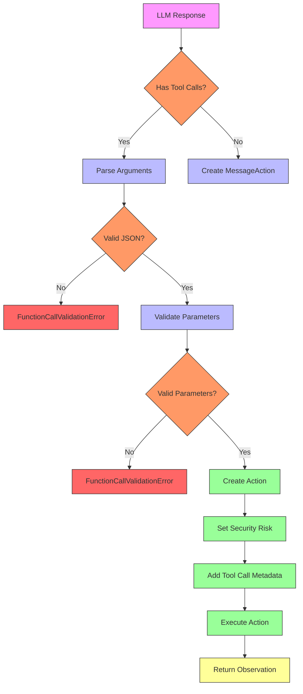
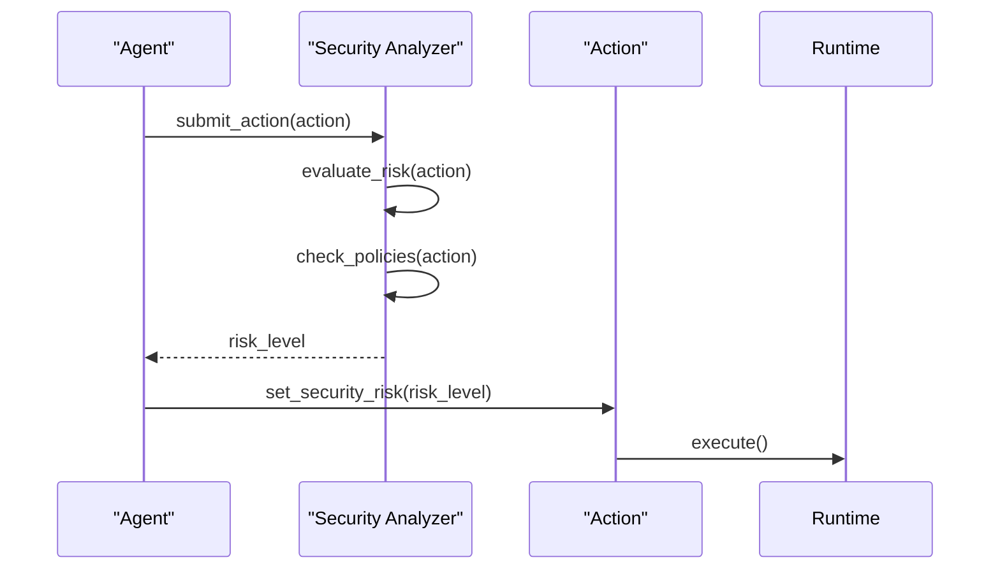
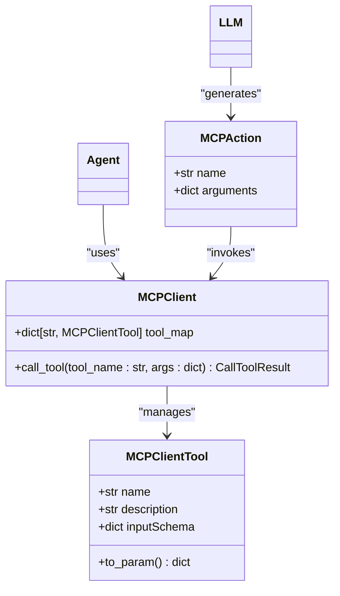
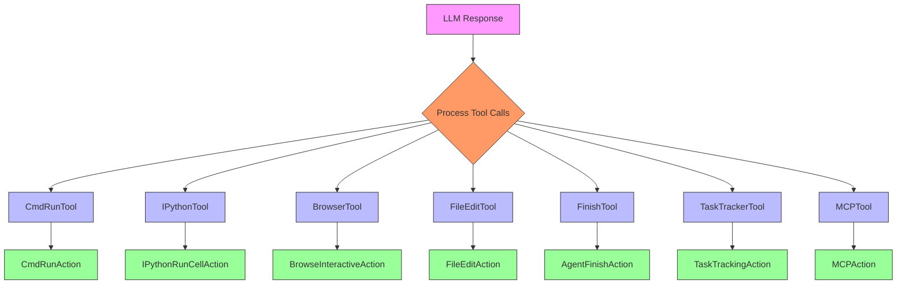
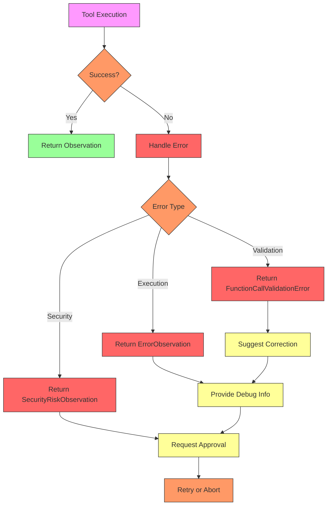

# Tool System

<cite>
**Referenced Files in This Document**   
- [function_calling.py](file://openhands/agenthub/codeact_agent/function_calling.py)
- [tool.py](file://openhands/events/tool.py)
- [agent.py](file://openhands/controller/agent.py)
- [bash.py](file://openhands/agenthub/codeact_agent/tools/bash.py)
- [str_replace_editor.py](file://openhands/agenthub/codeact_agent/tools/str_replace_editor.py)
- [browser.py](file://openhands/agenthub/codeact_agent/tools/browser.py)
- [security_utils.py](file://openhands/agenthub/codeact_agent/tools/security_utils.py)
- [analyzer.py](file://openhands/security/analyzer.py)
- [mcp/tool.py](file://openhands/mcp/tool.py)
- [tool_names.py](file://openhands/llm/tool_names.py)
</cite>

## Table of Contents
1. [Introduction](#introduction)
2. [Tool Framework Architecture](#tool-framework-architecture)
3. [Tool Registration and Discovery](#tool-registration-and-discovery)
4. [Parameter Validation and Execution Lifecycle](#parameter-validation-and-execution-lifecycle)
5. [Core Tool Categories](#core-tool-categories)
6. [Security Analysis Integration](#security-analysis-integration)
7. [MCP Tool Integration](#mcp-tool-integration)
8. [Function Calling Implementation](#function-calling-implementation)
9. [Custom Tool Development Guidelines](#custom-tool-development-guidelines)
10. [Common Issues and Solutions](#common-issues-and-solutions)

## Introduction

The OpenHands tool system provides a comprehensive framework for enabling function calling between the agent and external systems. This system allows the agent to extend its capabilities through modular tools that can interact with various external resources including the file system, shell environment, web browsers, and external services. The tool framework is designed to be extensible, secure, and efficient, supporting both built-in tools and external MCP (Modular Capability Provider) tools.

The system integrates tightly with the LLM's function calling capabilities, allowing natural language instructions to be translated into structured tool invocations. Each tool follows a standardized interface that includes parameter specifications, validation rules, and execution semantics. The framework also incorporates security analysis to assess potential risks associated with tool usage, ensuring safe execution of agent actions.

**Section sources**
- [function_calling.py](file://openhands/agenthub/codeact_agent/function_calling.py#L1-L339)
- [tool.py](file://openhands/events/tool.py#L1-L12)

## Tool Framework Architecture

The tool system architecture is built around a modular design that separates tool definitions, execution logic, and integration points. The core components include tool definitions, action converters, and execution handlers that work together to process LLM-generated function calls.



**Diagram sources**
- [function_calling.py](file://openhands/agenthub/codeact_agent/function_calling.py#L73-L339)
- [agent.py](file://openhands/controller/agent.py#L25-L184)

## Tool Registration and Discovery

The tool registration system allows agents to dynamically register and discover tools through a structured process. Tools are defined as `ChatCompletionToolParam` objects that contain metadata about the tool's name, description, parameters, and validation rules. The registration process is handled by the base `Agent` class, which maintains a registry of available tools.

Tools are discovered through the agent's initialization process, where specific agent implementations load their required tools. For example, the CodeActAgent loads tools from the `openhands.agenthub.codeact_agent.tools` module, including bash execution, file editing, browser interaction, and other capabilities. The tool registration process ensures that only authorized tools are available for use by the agent.



**Diagram sources**
- [agent.py](file://openhands/controller/agent.py#L50-L52)
- [tool.py](file://openhands/events/tool.py#L5-L12)

**Section sources**
- [agent.py](file://openhands/controller/agent.py#L163-L184)
- [function_calling.py](file://openhands/agenthub/codeact_agent/function_calling.py#L12-L21)

## Parameter Validation and Execution Lifecycle

The tool system implements a robust parameter validation and execution lifecycle that ensures safe and correct tool usage. When the LLM generates a function call, the system first validates the parameters against the tool's schema before creating the corresponding action object.

The validation process includes:
- JSON parsing of function arguments
- Required parameter checking
- Type validation
- Enum value validation
- Security risk assessment

The execution lifecycle follows a standardized pattern:
1. Receive LLM response with tool calls
2. Parse and validate tool call parameters
3. Create appropriate action object
4. Set security risk level
5. Add tool call metadata
6. Execute action in runtime
7. Return observation to agent



**Diagram sources**
- [function_calling.py](file://openhands/agenthub/codeact_agent/function_calling.py#L94-L320)
- [core/exceptions.py](file://openhands/core/exceptions.py#L136-L150)

**Section sources**
- [function_calling.py](file://openhands/agenthub/codeact_agent/function_calling.py#L94-L122)
- [core/exceptions.py](file://openhands/core/exceptions.py#L136-L150)

## Core Tool Categories

The tool system categorizes tools based on their functionality and domain. The main categories include:

### Bash Tools
Bash tools enable command-line operations within a persistent shell session. These tools support command execution, input handling, and timeout management.

```mermaid
classDiagram
class BashTool {
+str command
+str is_input
+float timeout
+str security_risk
}
BashTool : +execute_bash(command : str, is_input : bool, timeout : float)
BashTool : +interact_with_running_process()
BashTool : +handle_long_running_commands()
```

**Diagram sources**
- [bash.py](file://openhands/agenthub/codeact_agent/tools/bash.py#L42-L83)

### File Operations Tools
File operations tools provide capabilities for viewing, creating, and editing files. These tools support various commands including view, create, str_replace, insert, and undo_edit.

```mermaid
classDiagram
class FileOperationsTool {
+str command
+str path
+str file_text
+str old_str
+str new_str
+int insert_line
+list[int] view_range
+str security_risk
}
FileOperationsTool : +view(path : str, view_range : list[int])
FileOperationsTool : +create(path : str, file_text : str)
FileOperationsTool : +str_replace(path : str, old_str : str, new_str : str)
FileOperations
```

**Diagram sources**
- [str_replace_editor.py](file://openhands/agenthub/codeact_agent/tools/str_replace_editor.py#L92-L162)

### Browser Tools
Browser tools enable web interaction through Python code execution. These tools support navigation, form filling, clicking elements, and uploading files.

```mermaid
classDiagram
class BrowserTool {
+str code
+str security_risk
}
BrowserTool : +navigate(url : str)
BrowserTool : +fill(bid : str, value : str)
BrowserTool : +click(bid : str)
BrowserTool : +scroll(delta_x : int, delta_y : int)
BrowserTool : +upload_file(bid : str, file : str | list[str])
```

**Diagram sources**
- [browser.py](file://openhands/agenthub/codeact_agent/tools/browser.py#L147-L171)

**Section sources**
- [bash.py](file://openhands/agenthub/codeact_agent/tools/bash.py#L10-L83)
- [str_replace_editor.py](file://openhands/agenthub/codeact_agent/tools/str_replace_editor.py#L12-L162)
- [browser.py](file://openhands/agenthub/codeact_agent/tools/browser.py#L18-L171)

## Security Analysis Integration

The tool system integrates with security analyzers to assess potential risks associated with tool usage. Each tool includes a security_risk parameter that allows the LLM to self-assess the safety level of the action. The security analyzer evaluates actions and assigns risk levels based on predefined policies.

The security analysis process includes:
- Receiving action for risk assessment
- Evaluating against security policies
- Returning risk level (LOW, MEDIUM, HIGH)
- Logging security-related events



**Diagram sources**
- [analyzer.py](file://openhands/security/analyzer.py#L8-L38)
- [security_utils.py](file://openhands/agenthub/codeact_agent/tools/security_utils.py#L6-L10)

**Section sources**
- [analyzer.py](file://openhands/security/analyzer.py#L8-L38)
- [security_utils.py](file://openhands/agenthub/codeact_agent/tools/security_utils.py#L6-L10)

## MCP Tool Integration

The tool system supports MCP (Modular Capability Provider) tools, which allow integration with external services and capabilities. MCP tools are registered dynamically and can be called through the same function calling interface as built-in tools.

The MCP integration process includes:
- Loading MCP configuration
- Creating MCP clients
- Registering MCP tools with the agent
- Handling MCP tool calls
- Processing MCP observations



**Diagram sources**
- [mcp/tool.py](file://openhands/mcp/tool.py#L5-L24)
- [mcp/client.py](file://openhands/mcp/client.py#L149-L178)

**Section sources**
- [mcp/tool.py](file://openhands/mcp/tool.py#L1-L24)
- [mcp/client.py](file://openhands/mcp/client.py#L149-L178)

## Function Calling Implementation

The function calling implementation translates LLM-generated tool calls into executable actions. The system processes tool calls from the LLM response and converts them into appropriate action objects based on the tool name and parameters.

The implementation handles various tool types:
- Bash commands (execute_bash)
- File operations (str_replace_editor)
- Browser interactions (browser)
- Task tracking (task_tracker)
- IPython execution (ipython)
- Agent delegation (delegate_to_browsing_agent)
- Finish action (finish)



**Diagram sources**
- [function_calling.py](file://openhands/agenthub/codeact_agent/function_calling.py#L73-L309)

**Section sources**
- [function_calling.py](file://openhands/agenthub/codeact_agent/function_calling.py#L73-L309)
- [tool_names.py](file://openhands/llm/tool_names.py#L3-L8)

## Custom Tool Development Guidelines

When creating custom tools for the OpenHands system, follow these best practices:

### Input Validation
Always validate input parameters and provide clear error messages for invalid inputs. Use the standardized validation approach with appropriate exception types.

### Error Handling
Implement comprehensive error handling that captures and reports errors appropriately. Use the defined exception hierarchy including `FunctionCallValidationError` and `FunctionCallNotExistsError`.

### Documentation
Provide clear and comprehensive documentation for tool parameters, including descriptions, examples, and usage guidelines. Follow the pattern of detailed and short descriptions used in existing tools.

### Security Considerations
Include security risk assessment in all tools and follow the security guidelines for risk level definitions (LOW, MEDIUM, HIGH).

### Performance
Optimize tool performance by minimizing external dependencies and ensuring efficient execution. Handle timeouts and long-running operations appropriately.

```mermaid
classDiagram
class CustomTool {
+str name
+str description
+dict parameters
+list[str] required
+str security_risk
}
CustomTool : +validate_input(arguments : dict) bool
CustomTool : +execute(arguments : dict) Observation
CustomTool : +handle_errors(exception : Exception) ErrorObservation
CustomTool : +log_execution() void
```

**Diagram sources**
- [function_calling.py](file://openhands/agenthub/codeact_agent/function_calling.py#L136-L150)
- [core/exceptions.py](file://openhands/core/exceptions.py#L136-L150)

**Section sources**
- [function_calling.py](file://openhands/agenthub/codeact_agent/function_calling.py#L136-L150)
- [core/exceptions.py](file://openhands/core/exceptions.py#L136-L150)

## Common Issues and Solutions

### Handling Asynchronous Operations
For long-running commands, use background execution with output redirection to files. Set appropriate timeouts and provide mechanisms for monitoring and interacting with running processes.

### Managing Tool Dependencies
Ensure all tool dependencies are properly declared and available in the runtime environment. Use the plugin system to manage runtime dependencies for tools like Jupyter and VSCode.

### Preventing Infinite Loops
Implement loop detection and prevention mechanisms by tracking tool usage patterns and setting limits on repeated tool calls. Use the task tracker tool to manage complex workflows and prevent circular dependencies.

### Error Recovery
Implement robust error recovery by providing clear error messages, suggesting alternatives, and maintaining state consistency after failed tool executions.



**Diagram sources**
- [function_calling.py](file://openhands/agenthub/codeact_agent/function_calling.py#L94-L122)
- [core/exceptions.py](file://openhands/core/exceptions.py#L136-L150)

**Section sources**
- [function_calling.py](file://openhands/agenthub/codeact_agent/function_calling.py#L94-L122)
- [core/exceptions.py](file://openhands/core/exceptions.py#L136-L150)