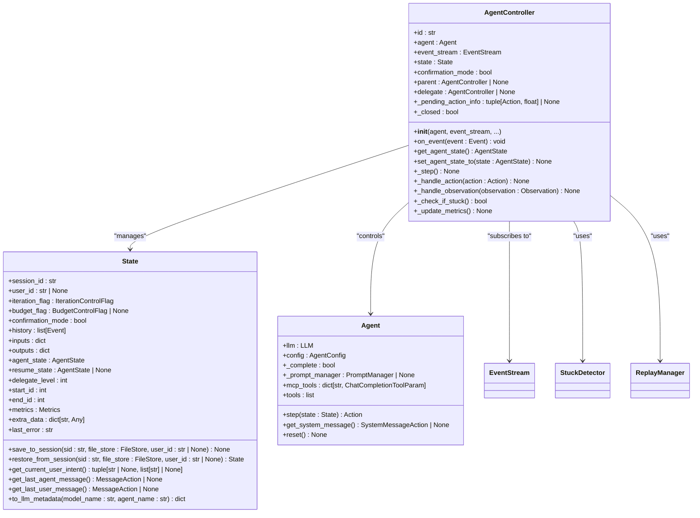
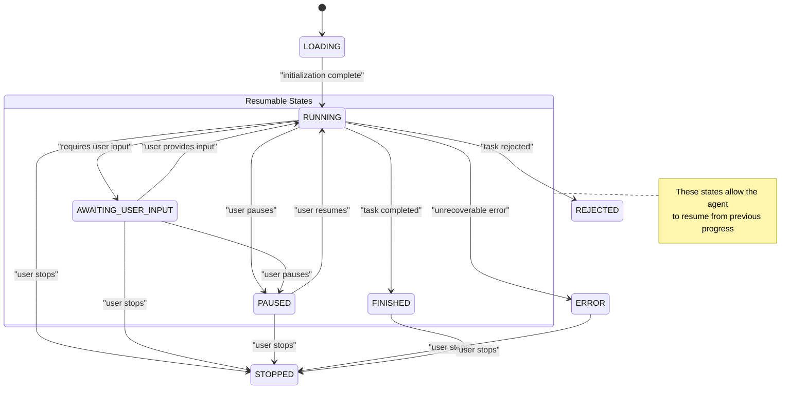
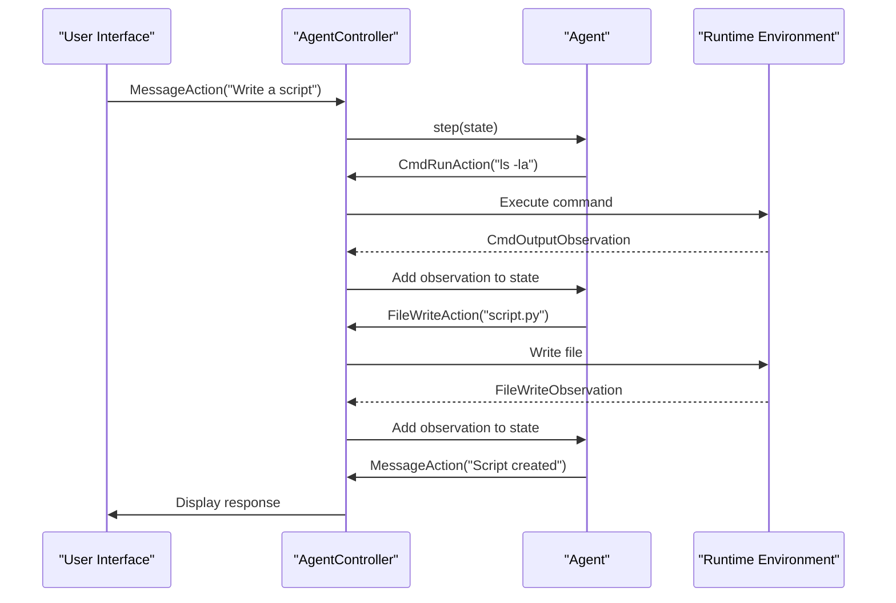
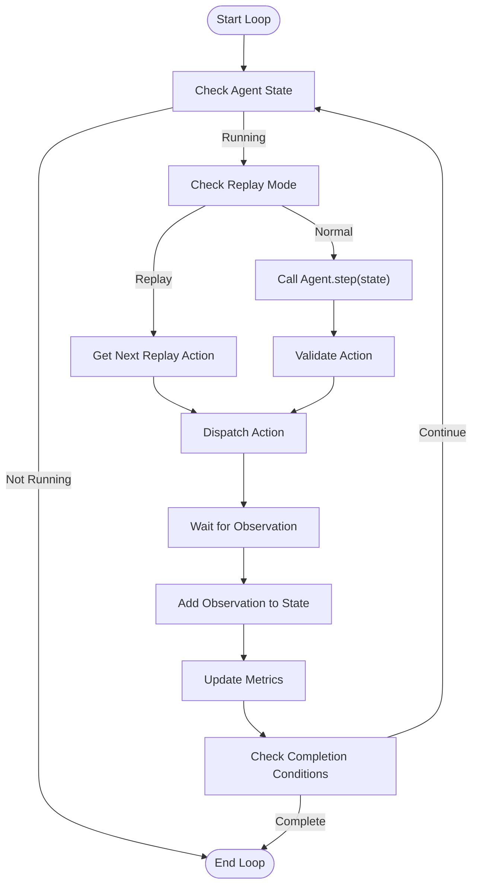
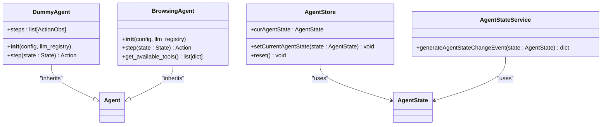
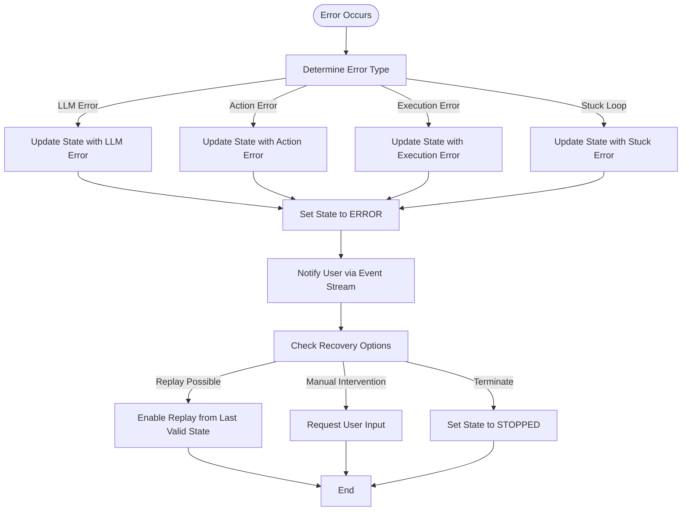

# Agent Architecture

<cite>
**Referenced Files in This Document**   
- [agent.py](file://openhands/controller/agent.py)
- [state.py](file://openhands/controller/state/state.py)
- [agent_controller.py](file://openhands/controller/agent_controller.py)
- [loop.py](file://openhands/core/loop.py)
- [agent.py](file://openhands/agenthub/dummy_agent/agent.py)
- [agent.py](file://openhands/agenthub/browsing_agent/agent.py)
- [agent_state.tsx](file://frontend/src/types/agent-state.tsx)
- [agent-store.ts](file://frontend/src/stores/agent-store.ts)
- [agent_state.py](file://openhands/core/schema/agent.py)
</cite>

## Table of Contents
1. [Introduction](#introduction)
2. [Agent Controller: Central Orchestrator](#agent-controller-central-orchestrator)
3. [State Management and Control Flags](#state-management-and-control-flags)
4. [Event-Driven Architecture](#event-driven-architecture)
5. [Agent Loop Implementation](#agent-loop-implementation)
6. [Practical Examples from Codebase](#practical-examples-from-codebase)
7. [Component Relationships](#component-relationships)
8. [Error Recovery and Concurrency](#error-recovery-and-concurrency)
9. [Conclusion](#conclusion)

## Introduction

The OpenHands agent system is designed as an intelligent automation platform that can execute complex tasks through natural language interaction. At its core, the agent architecture follows a modular, event-driven design pattern that enables flexible task execution, state management, and user interaction. This document provides a comprehensive overview of the agent system, focusing on the central components that orchestrate agent behavior, manage state transitions, and coordinate the agent loop.

The architecture is built around several key principles: separation of concerns between the agent logic and execution environment, event-driven communication between components, and a clear state management system that tracks the agent's progress through various stages of task execution. The system is designed to be both accessible to beginners through its intuitive state model and sufficiently sophisticated for experienced developers who need fine-grained control over agent behavior.

This documentation will explore the core components of the agent system, including the AgentController as the central orchestrator, the state machine implementation that manages agent states, the event-driven architecture for action dispatching and observation processing, and the detailed implementation of the agent loop that coordinates planning, action selection, execution, and observation handling.

**Section sources**
- [agent_controller.py](file://openhands/controller/agent_controller.py#L1-L50)
- [state.py](file://openhands/controller/state/state.py#L1-L50)

## Agent Controller: Central Orchestrator

The AgentController serves as the central orchestrator of the agent system, managing the entire lifecycle of agent execution from initialization to completion. It acts as the primary interface between the agent logic, the event stream, and the external environment, coordinating all aspects of agent behavior and state transitions.

The controller is initialized with several critical components: the agent instance that contains the specific logic for task execution, an event stream for communication between components, and configuration parameters that define the agent's behavior and constraints. During initialization, the controller establishes subscriptions to the event stream, sets up state tracking mechanisms, and configures various detection systems for identifying problematic agent behavior such as infinite loops or excessive resource consumption.

One of the key responsibilities of the AgentController is managing the agent's state transitions. It maintains a reference to the current agent state and provides methods for safely transitioning between states based on internal logic and external events. The controller also handles the delegation pattern, allowing agents to spawn sub-agents for specialized tasks while maintaining proper state tracking and resource management.

The controller implements several important patterns for robust agent operation. It includes mechanisms for handling confirmation mode, where potentially dangerous actions require explicit user approval before execution. It also manages the replay functionality, allowing previously recorded agent sessions to be replayed for debugging or demonstration purposes. Additionally, the controller integrates with security analysis components to evaluate the potential risks of proposed actions before they are executed.



**Diagram sources **
- [agent_controller.py](file://openhands/controller/agent_controller.py#L99-L200)
- [agent.py](file://openhands/controller/agent.py#L25-L184)
- [state.py](file://openhands/controller/state/state.py#L48-L312)

**Section sources**
- [agent_controller.py](file://openhands/controller/agent_controller.py#L99-L200)

## State Management and Control Flags

The agent system implements a comprehensive state management system that tracks the agent's execution status through various stages of task completion. The state machine is built around the AgentState enumeration, which defines the possible states an agent can occupy during its lifecycle.

The primary states include LOADING (initialization phase), RUNNING (active task execution), AWAITING_USER_INPUT (waiting for user response), PAUSED (temporarily suspended), STOPPED (terminated by user), FINISHED (completed successfully), REJECTED (rejected the task), ERROR (encountered an unrecoverable error), and several confirmation-related states. These states provide a clear indication of the agent's current status and determine how the system responds to various events and user inputs.

The State class serves as the central repository for all agent state information, containing not only the current agent state but also various control flags that govern agent behavior. The IterationControlFlag manages the agent's progress through the task, tracking the current iteration count against maximum limits. The BudgetControlFlag monitors resource consumption to prevent excessive costs. These control flags are checked at each step of the agent loop to ensure the agent operates within defined constraints.

State persistence is implemented through the save_to_session and restore_from_session methods, which serialize the state object using pickle and base64 encoding for storage in the file system. This allows agents to resume from previous states after interruptions, maintaining continuity across sessions. The state also includes mechanisms for backward compatibility, automatically converting deprecated fields from older versions while removing them during serialization to maintain clean data storage.

The state management system also includes sophisticated tracking of agent history through the event stream, with methods for accessing recent user messages, agent responses, and task intents. This historical context is crucial for maintaining coherent conversations and ensuring the agent can reference previous interactions when making decisions.



**Diagram sources **
- [agent_state.py](file://openhands/core/schema/agent.py#L3-L50)
- [state.py](file://openhands/controller/state/state.py#L28-L33)

**Section sources**
- [agent_state.py](file://openhands/core/schema/agent.py#L3-L50)
- [state.py](file://openhands/controller/state/state.py#L28-L200)

## Event-Driven Architecture

The OpenHands agent system employs an event-driven architecture that facilitates asynchronous communication between components through a centralized event stream. This design pattern enables loose coupling between the agent controller, runtime environment, and user interface, allowing each component to operate independently while maintaining synchronization through shared events.

The event stream serves as the central nervous system of the agent architecture, carrying all actions and observations between components. Actions are dispatched by the agent controller and include various types such as CmdRunAction for executing shell commands, FileReadAction for reading files, and MessageAction for communicating with the user. Observations are generated by the runtime environment in response to actions and include CmdOutputObservation for command results, FileReadObservation for file contents, and ErrorObservation for error conditions.

The event-driven model supports both synchronous and asynchronous processing patterns. Most actions follow a request-response pattern where an action is dispatched and a corresponding observation is expected in the subsequent step. However, the system also handles asynchronous events such as user messages that can interrupt the normal agent loop, allowing for real-time interaction and intervention.

Event filtering and processing are handled through the EventStream class, which supports subscription-based event delivery to different components. The AgentController subscribes to the event stream to receive user inputs and other external events, while the frontend subscribes to receive updates for display to the user. Each event includes metadata such as source (agent, user, or environment), timestamp, and unique identifier to maintain proper ordering and context.

The architecture also includes mechanisms for event replay, allowing previously recorded sessions to be reconstructed by replaying the sequence of events. This is particularly useful for debugging, demonstration, and testing purposes. The event stream can be serialized and deserialized, enabling persistent storage of agent sessions and facilitating collaboration features.



**Diagram sources **
- [agent_controller.py](file://openhands/controller/agent_controller.py#L134-L200)
- [agent.py](file://openhands/agenthub/dummy_agent/agent.py#L45-L121)

**Section sources**
- [agent_controller.py](file://openhands/controller/agent_controller.py#L134-L200)
- [agent.py](file://openhands/agenthub/dummy_agent/agent.py#L45-L121)

## Agent Loop Implementation

The agent loop is the core execution mechanism that drives the agent's task completion process. Implemented in the _step method of the AgentController, the loop follows a consistent pattern of planning, action selection, execution, and observation handling that repeats until the task is completed or terminated.

The loop begins with the agent receiving the current state, which includes the complete history of previous actions and observations. The agent's step method processes this state to generate the next action, typically by sending the conversation history to a language model and parsing the response into a structured action object. This planning phase considers the task goal, previous attempts, and current context to determine the most appropriate next step.

Once an action is selected, the controller validates it against security policies and confirmation requirements before dispatching it to the appropriate execution environment. For command execution, this involves sending the command to the runtime environment; for file operations, it involves interacting with the file system; and for user communication, it involves sending a message through the event stream.

After action dispatch, the loop waits for the corresponding observation, which is added to the state history. The controller then checks for completion conditions, such as reaching the maximum iteration count, exceeding budget limits, or detecting that the agent is stuck in a loop. If the task is not complete, the loop continues with the next iteration.

The loop implementation includes several sophisticated features for robust operation. It handles edge cases such as timeout conditions, manages the delegation pattern for multi-agent collaboration, and integrates with the security analyzer to prevent potentially harmful actions. The loop also supports replay mode, where instead of executing the agent's step method, it replays previously recorded actions from a trajectory file.



**Diagram sources **
- [agent_controller.py](file://openhands/controller/agent_controller.py#L200-L400)
- [loop.py](file://openhands/core/loop.py#L11-L46)

**Section sources**
- [agent_controller.py](file://openhands/controller/agent_controller.py#L200-L400)
- [loop.py](file://openhands/core/loop.py#L11-L46)

## Practical Examples from Codebase

The agent system's functionality can be clearly observed through practical examples in the codebase, particularly in the implementation of the DummyAgent and BrowsingAgent. These examples demonstrate how the agent controller, state management, and event-driven architecture work together to execute tasks.

In the DummyAgent implementation, we see a predefined sequence of actions that simulate a simple task workflow: starting with a message to the user, executing a shell command, writing a file, reading the file back, executing the script, and finally finishing the task. Each step in this sequence is defined with corresponding observations that validate the expected outcomes. This example illustrates how the agent controller manages the transition between states, from RUNNING to FINISHED, while processing each action and its corresponding observation.

The BrowsingAgent provides a more complex example of agent behavior, demonstrating how agents can handle specialized tasks like web browsing. This agent implements the step method to generate browsing actions based on the current state and user instructions. When a browsing action is executed, the runtime environment generates a BrowserOutputObservation that is processed by the controller and added to the state history, allowing the agent to incorporate the results into its next planning step.

Frontend components like the agent-store and agent-state-service demonstrate how the agent state is managed and updated in the user interface. The useAgentStore hook maintains the current agent state and provides methods to update it, while the generateAgentStateChangeEvent function creates events that are dispatched when the agent state changes. This shows the bidirectional flow of state information between the backend controller and the frontend interface.

These examples highlight the practical application of the agent architecture, showing how the theoretical components described in previous sections are implemented in real code. They demonstrate the flexibility of the system, which can support both simple scripted agents and complex adaptive agents, while maintaining a consistent interface and state management pattern.



**Diagram sources **
- [agent.py](file://openhands/agenthub/dummy_agent/agent.py#L45-L121)
- [agent.py](file://openhands/agenthub/browsing_agent/agent.py#L1-L50)
- [agent-store.ts](file://frontend/src/stores/agent-store.ts#L1-L21)
- [agent-state-service.ts](file://frontend/src/services/agent-state-service.ts#L1-L7)

**Section sources**
- [agent.py](file://openhands/agenthub/dummy_agent/agent.py#L45-L121)
- [agent.py](file://openhands/agenthub/browsing_agent/agent.py#L1-L50)
- [agent-store.ts](file://frontend/src/stores/agent-store.ts#L1-L21)
- [agent-state-service.ts](file://frontend/src/services/agent-state-service.ts#L1-L7)

## Component Relationships

The agent architecture consists of several interconnected components that work together to enable intelligent task execution. The primary components include the AgentController, Agent implementations, State management system, EventStream, and Runtime environment, each with well-defined responsibilities and interfaces.

The AgentController serves as the central orchestrator, coordinating between the agent logic, state management, and external systems. It maintains a direct relationship with the Agent implementation, calling its step method to determine the next action, and with the State object, which stores the complete history and current status of the agent's execution. The controller also subscribes to the EventStream to receive external events and dispatches actions back to the stream for execution.

Agents are pluggable components that implement the Agent interface, providing specific logic for task execution. They interact primarily with the State object, which provides the context needed to make decisions, and return actions that are processed by the controller. Different agent types, such as the DummyAgent or BrowsingAgent, can be registered and instantiated based on the task requirements.

The State object acts as a shared data repository, accessible to both the controller and agent. It maintains the execution history, control flags, and metrics, providing a consistent view of the agent's progress. The state is persisted through the file store, enabling session resumption and collaboration features.

The EventStream provides the communication backbone of the system, connecting the controller with the runtime environment and user interface. It uses a publish-subscribe pattern to distribute events to all interested components, ensuring that each part of the system has access to the information it needs.

```mermaid
graph TD
AgentController --> Agent : "controls"
AgentController --> State : "manages"
AgentController --> EventStream : "subscribes to and publishes"
AgentController --> Runtime : "dispatches actions to"
Agent --> State : "reads context from"
Agent --> AgentController : "returns actions to"
State --> FileStore : "persists to"
EventStream --> Runtime : "sends actions to"
EventStream --> UI : "sends updates to"
Runtime --> EventStream : "sends observations to"
UI --> EventStream : "sends user inputs to"
classDef component fill:#f9f,stroke:#333,stroke-width:2px;
class AgentController,Agent,State,EventStream,Runtime,UI component;
```

**Diagram sources **
- [agent_controller.py](file://openhands/controller/agent_controller.py#L99-L200)
- [agent.py](file://openhands/controller/agent.py#L25-L184)
- [state.py](file://openhands/controller/state/state.py#L48-L312)

**Section sources**
- [agent_controller.py](file://openhands/controller/agent_controller.py#L99-L200)

## Error Recovery and Concurrency

The agent system implements several mechanisms for error recovery and concurrency management to ensure robust operation in various scenarios. These features are critical for maintaining system stability and providing a reliable user experience, especially when dealing with complex tasks that may encounter unexpected conditions.

Error handling is implemented at multiple levels of the architecture. The controller includes comprehensive exception handling around the agent step method, catching various types of errors including LLM response errors, action validation errors, and execution errors. When an error occurs, the controller updates the state with the error information, transitions to the ERROR state, and notifies the user through the event stream. The system also includes specific error types for common failure modes, such as AgentStuckInLoopError for agents that appear to be cycling through the same actions repeatedly.

State persistence plays a crucial role in error recovery, allowing agents to resume from previous states after interruptions. The save_to_session and restore_from_session methods enable the system to recover from crashes or planned shutdowns, maintaining continuity across sessions. This is particularly important for long-running tasks that may span multiple user sessions.

Concurrency is managed through the event-driven architecture, which naturally supports asynchronous operations. The controller can handle multiple events concurrently, processing user inputs while waiting for action results from the runtime environment. The system also supports multiple agent instances running simultaneously, each with its own controller and state, enabling parallel task execution.

The replay functionality provides an additional layer of reliability, allowing failed tasks to be analyzed and debugged by replaying the exact sequence of events that led to the error. This is particularly useful for identifying edge cases and improving agent performance over time.



**Diagram sources **
- [agent_controller.py](file://openhands/controller/agent_controller.py#L33-L47)
- [state.py](file://openhands/controller/state/state.py#L122-L146)

**Section sources**
- [agent_controller.py](file://openhands/controller/agent_controller.py#L33-L47)
- [state.py](file://openhands/controller/state/state.py#L122-L146)

## Conclusion

The OpenHands agent architecture represents a sophisticated and well-structured system for intelligent task automation. By combining a central orchestrator (AgentController) with a flexible agent interface, comprehensive state management, and an event-driven communication model, the system achieves a balance between power and accessibility that makes it suitable for both beginners and experienced developers.

The agent controller effectively manages the complex coordination required for agent execution, handling state transitions, action dispatching, and observation processing while maintaining separation of concerns between components. The state machine implementation provides clear visibility into the agent's status and enables robust session management and persistence. The event-driven architecture facilitates loose coupling between components, allowing for flexible integration of new features and capabilities.

The agent loop implementation demonstrates a thoughtful approach to task execution, incorporating planning, action selection, execution, and observation handling in a consistent pattern that supports both simple and complex workflows. Practical examples from the codebase illustrate how these theoretical components work together in real-world scenarios, from basic scripted agents to more sophisticated adaptive agents.

The system's attention to error recovery and concurrency management ensures reliable operation even in challenging conditions, with mechanisms for handling various error types, maintaining state across sessions, and supporting parallel execution. These features contribute to a robust and resilient architecture that can handle the unpredictable nature of real-world tasks.

Overall, the OpenHands agent architecture provides a solid foundation for building intelligent automation systems, with a design that emphasizes clarity, flexibility, and reliability. Its modular structure and well-defined interfaces make it extensible and maintainable, while its comprehensive documentation and examples lower the barrier to entry for new users.

**Section sources**
- [agent_controller.py](file://openhands/controller/agent_controller.py#L1-L50)
- [agent.py](file://openhands/controller/agent.py#L1-L50)
- [state.py](file://openhands/controller/state/state.py#L1-L50)