# LLM Integration

<cite>
**Referenced Files in This Document**   
- [openhands/llm/llm.py](file://openhands/llm/llm.py)
- [openhands/llm/async_llm.py](file://openhands/llm/async_llm.py)
- [openhands/llm/streaming_llm.py](file://openhands/llm/streaming_llm.py)
- [openhands/llm/router/base.py](file://openhands/llm/router/base.py)
- [openhands/llm/router/rule_based/impl.py](file://openhands/llm/router/rule_based/impl.py)
- [openhands/llm/fn_call_converter.py](file://openhands/llm/fn_call_converter.py)
- [openhands/llm/model_features.py](file://openhands/llm/model_features.py)
- [openhands/llm/tool_names.py](file://openhands/llm/tool_names.py)
- [openhands/llm/llm_registry.py](file://openhands/llm/llm_registry.py)
- [openhands/core/message.py](file://openhands/core/message.py)
</cite>

## Table of Contents
1. [Introduction](#introduction)
2. [LLM Architecture](#llm-architecture)
3. [Async and Streaming Capabilities](#async-and-streaming-capabilities)
4. [LLM Router System](#llm-router-system)
5. [Function Calling Implementation](#function-calling-implementation)
6. [Prompt Formatting and Context Management](#prompt-formatting-and-context-management)
7. [Integration with Agent Components](#integration-with-agent-components)
8. [Error Handling and Common Issues](#error-handling-and-common-issues)
9. [Performance and Cost Optimization](#performance-and-cost-optimization)

## Introduction

The LLM integration system serves as the cognitive engine of the agent system, providing the core intelligence that enables autonomous decision-making, reasoning, and action execution. This documentation provides a comprehensive overview of the LLM layer architecture, implementation details, and integration patterns within the OpenHands framework.

The LLM system is designed with flexibility and efficiency in mind, supporting multiple LLM providers, advanced routing capabilities, and sophisticated function calling mechanisms. It acts as the central processing unit for the agent, interpreting user requests, generating responses, and orchestrating tool usage through a well-defined interface.

This document covers the key components of the LLM integration system, including the core LLM implementation, async and streaming capabilities, the router system for model selection, function calling implementation, prompt formatting, context window management, and integration with other agent components such as the agent controller, action system, and memory components.

**Section sources**
- [openhands/llm/llm.py](file://openhands/llm/llm.py#L1-L100)
- [openhands/llm/async_llm.py](file://openhands/llm/async_llm.py#L1-L50)

## LLM Architecture

The LLM architecture in OpenHands is built around a modular design that separates concerns and enables extensibility. At its core is the `LLM` class, which serves as the base implementation for all language model interactions. This class provides a unified interface for LLM operations while abstracting away provider-specific details.

The architecture follows a layered approach with the following key components:

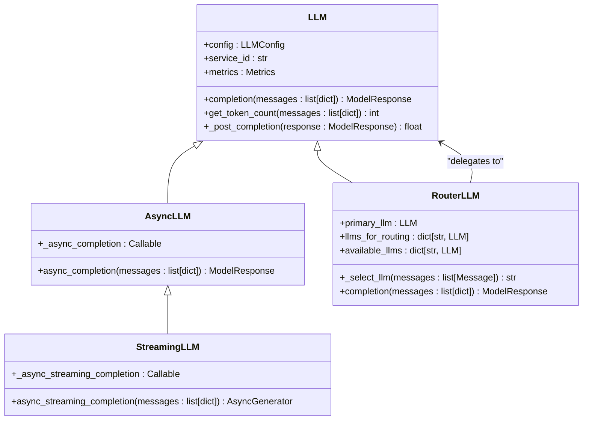
```mermaid
classDiagram
class LLM {
+config : LLMConfig
+service_id : str
+metrics : Metrics
+completion(messages : list[dict]) ModelResponse
+get_token_count(messages : list[dict]) int
+_post_completion(response : ModelResponse) float
}
class AsyncLLM {
+async_completion(messages : list[dict]) ModelResponse
+_async_completion : Callable
}
class StreamingLLM {
+async_streaming_completion(messages : list[dict]) AsyncGenerator
+_async_streaming_completion : Callable
}
class RouterLLM {
+primary_llm : LLM
+llms_for_routing : dict[str, LLM]
+available_llms : dict[str, LLM]
+_select_llm(messages : list[Message]) str
+completion(messages : list[dict]) ModelResponse
}
LLM <|-- AsyncLLM
AsyncLLM <|-- StreamingLLM
LLM <|-- RouterLLM
RouterLLM --> LLM : "delegates to"
```

**Diagram sources**
- [openhands/llm/llm.py](file://openhands/llm/llm.py#L54-L800)
- [openhands/llm/async_llm.py](file://openhands/llm/async_llm.py#L17-L131)
- [openhands/llm/streaming_llm.py](file://openhands/llm/streaming_llm.py#L11-L114)
- [openhands/llm/router/base.py](file://openhands/llm/router/base.py#L17-L165)

The `LLM` class is responsible for managing the connection to the language model provider, handling authentication, and providing the basic completion interface. It includes features such as retry logic, cost tracking, and token counting. The `AsyncLLM` class extends this functionality with asynchronous capabilities, while `StreamingLLM` adds support for streaming responses.

The `RouterLLM` class implements a routing pattern that allows the system to dynamically select between multiple LLMs based on configuration and context. This enables sophisticated model selection strategies, such as using different models for different types of tasks or routing based on content characteristics.

**Section sources**
- [openhands/llm/llm.py](file://openhands/llm/llm.py#L54-L800)
- [openhands/llm/async_llm.py](file://openhands/llm/async_llm.py#L17-L131)
- [openhands/llm/streaming_llm.py](file://openhands/llm/streaming_llm.py#L11-L114)
- [openhands/llm/router/base.py](file://openhands/llm/router/base.py#L17-L165)

## Async and Streaming Capabilities

The LLM system provides robust support for both asynchronous operations and streaming responses, enabling efficient handling of LLM interactions in the agent system.

### Asynchronous Operations

The `AsyncLLM` class implements asynchronous completion through the `async_completion` property, which returns a callable that can be awaited. This allows non-blocking LLM calls that don't block the event loop, improving overall system responsiveness.

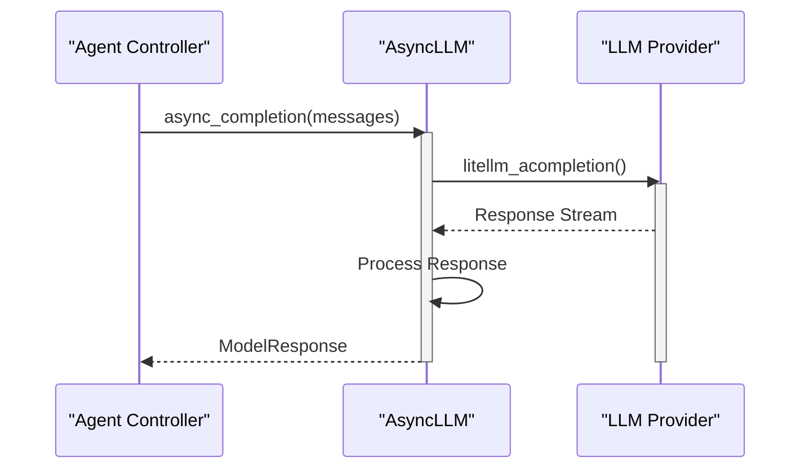
```mermaid
sequenceDiagram
participant Agent as "Agent Controller"
participant LLM as "AsyncLLM"
participant Provider as "LLM Provider"
Agent->>LLM : async_completion(messages)
activate LLM
LLM->>Provider : litellm_acompletion()
activate Provider
Provider-->>LLM : Response Stream
LLM->>LLM : Process Response
LLM-->>Agent : ModelResponse
deactivate Provider
deactivate LLM
```

**Diagram sources**
- [openhands/llm/async_llm.py](file://openhands/llm/async_llm.py#L20-L131)

The asynchronous implementation includes retry logic with exponential backoff, cancellation support, and proper error handling. The retry mechanism is configurable through the LLM configuration, allowing customization of retry parameters such as the number of retries, minimum and maximum wait times, and retry multiplier.

### Streaming Capabilities

For real-time interaction and progressive response generation, the system provides streaming capabilities through the `StreamingLLM` class. This enables the agent to receive and process LLM responses incrementally as they are generated, rather than waiting for the complete response.

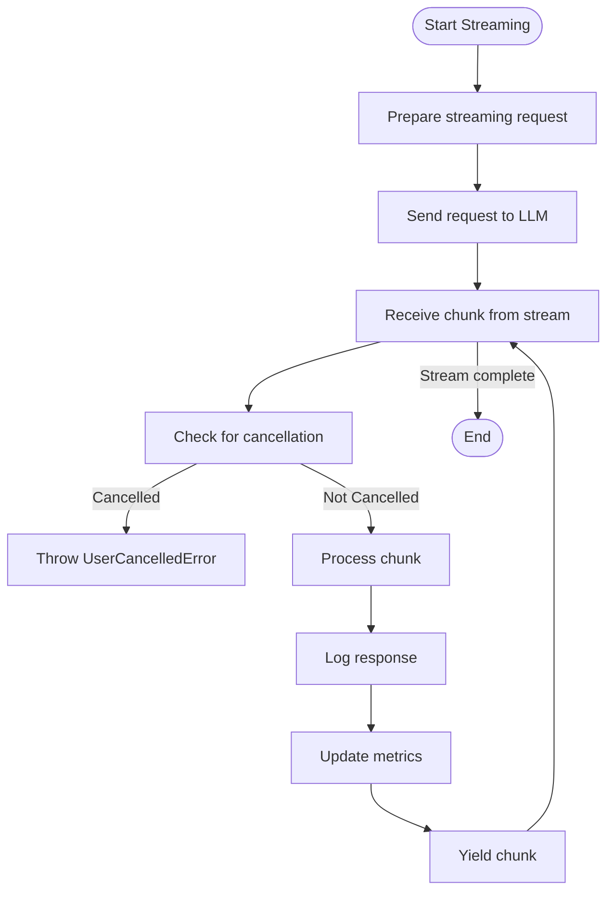
```mermaid
flowchart TD
Start([Start Streaming]) --> Prepare["Prepare streaming request"]
Prepare --> Send["Send request to LLM"]
Send --> Receive["Receive chunk from stream"]
Receive --> CheckCancel["Check for cancellation"]
CheckCancel --> |Cancelled| ThrowError["Throw UserCancelledError"]
CheckCancel --> |Not Cancelled| Process["Process chunk"]
Process --> Log["Log response"]
Log --> Update["Update metrics"]
Update --> Yield["Yield chunk"]
Yield --> Receive
Receive --> |Stream complete| End([End])
```

**Diagram sources**
- [openhands/llm/streaming_llm.py](file://openhands/llm/streaming_llm.py#L11-L114)

The streaming implementation processes the response as an asynchronous generator, yielding chunks as they arrive from the LLM provider. Each chunk is processed individually, with support for cancellation checks, response logging, and metrics updates. This allows the agent to react to partial responses and provide real-time feedback to users.

**Section sources**
- [openhands/llm/async_llm.py](file://openhands/llm/async_llm.py#L20-L131)
- [openhands/llm/streaming_llm.py](file://openhands/llm/streaming_llm.py#L11-L114)

## LLM Router System

The LLM router system enables dynamic model selection and provider routing based on configuration, allowing the agent to leverage multiple LLMs for different purposes or under different conditions.

### Router Architecture

The router system is implemented through the `RouterLLM` base class and specific router implementations like `MultimodalRouter`. The router acts as a facade that presents a unified LLM interface while internally managing multiple underlying LLM instances.

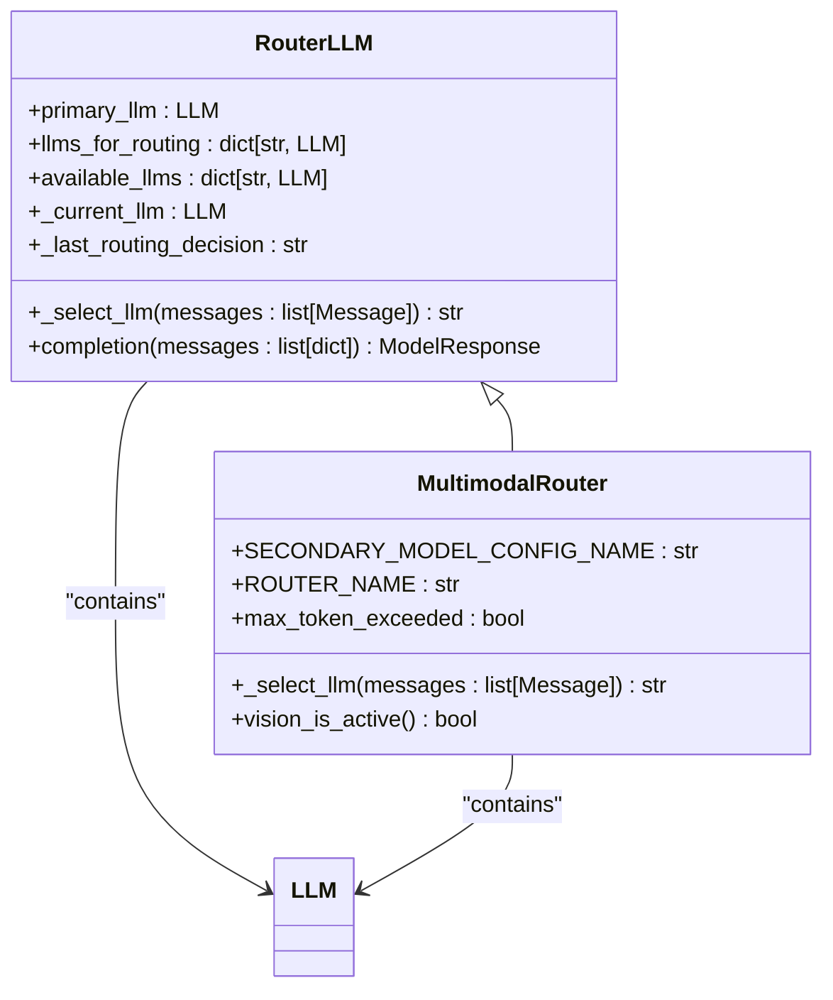
```mermaid
classDiagram
class RouterLLM {
+primary_llm : LLM
+llms_for_routing : dict[str, LLM]
+available_llms : dict[str, LLM]
+_current_llm : LLM
+_last_routing_decision : str
+_select_llm(messages : list[Message]) str
+completion(messages : list[dict]) ModelResponse
}
class MultimodalRouter {
+SECONDARY_MODEL_CONFIG_NAME : str
+ROUTER_NAME : str
+max_token_exceeded : bool
+_select_llm(messages : list[Message]) str
+vision_is_active() bool
}
RouterLLM <|-- MultimodalRouter
RouterLLM --> LLM : "contains"
MultimodalRouter --> LLM : "contains"
```

**Diagram sources**
- [openhands/llm/router/base.py](file://openhands/llm/router/base.py#L17-L165)
- [openhands/llm/router/rule_based/impl.py](file://openhands/llm/router/rule_based/impl.py#L9-L74)

### Routing Logic

The routing logic is implemented in the `_select_llm` method, which determines which LLM to use based on the input messages and current context. The `MultimodalRouter` implementation provides an example of routing based on content characteristics:

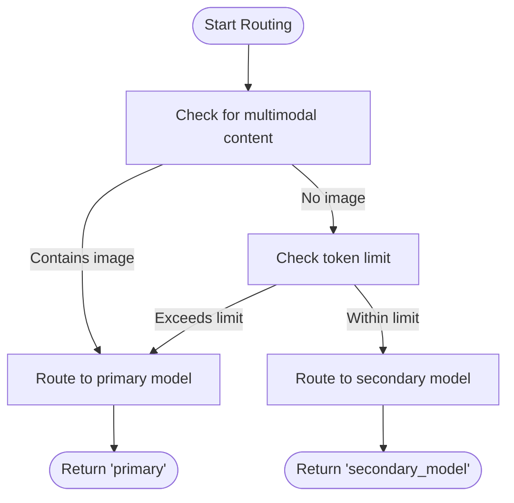
```mermaid
flowchart TD
Start([Start Routing]) --> CheckMultimodal["Check for multimodal content"]
CheckMultimodal --> |Contains image| RoutePrimary["Route to primary model"]
CheckMultimodal --> |No image| CheckTokenLimit["Check token limit"]
CheckTokenLimit --> |Exceeds limit| RoutePrimary
CheckTokenLimit --> |Within limit| RouteSecondary["Route to secondary model"]
RoutePrimary --> EndPrimary([Return 'primary'])
RouteSecondary --> EndSecondary([Return 'secondary_model'])
```

**Diagram sources**
- [openhands/llm/router/rule_based/impl.py](file://openhands/llm/router/rule_based/impl.py#L26-L61)

The router evaluates messages for multimodal content (images) and checks if the token count exceeds the context window of the secondary model. If either condition is met, it routes to the primary model; otherwise, it uses the secondary model. This allows for cost optimization by using a less expensive model when possible while ensuring capability when needed.

### Configuration

The router system is configured through the agent configuration, with support for multiple models and routing rules. The configuration is structured as follows:

```toml
# Main LLM (primary model)
[llm]
model = "claude-sonnet-4"
api_key = "your-api-key"

# Secondary model for routing
[llm.secondary_model]
model = "kimi-k2"
api_key = "your-api-key"
for_routing = true

# Enable routing
[model_routing]
router_name = "multimodal_router"
```

**Section sources**
- [openhands/llm/router/base.py](file://openhands/llm/router/base.py#L31-L87)
- [openhands/llm/router/rule_based/impl.py](file://openhands/llm/router/rule_based/impl.py#L13-L25)
- [openhands/llm/router/README.md](file://openhands/llm/router/README.md#L18-L35)

## Function Calling Implementation

The function calling system enables the agent to invoke tools and actions through the LLM interface, allowing for structured interaction with external systems and services.

### Function Calling Architecture

The function calling implementation is built around a conversion system that translates between native function calling formats and a custom format for models that don't support function calling natively.

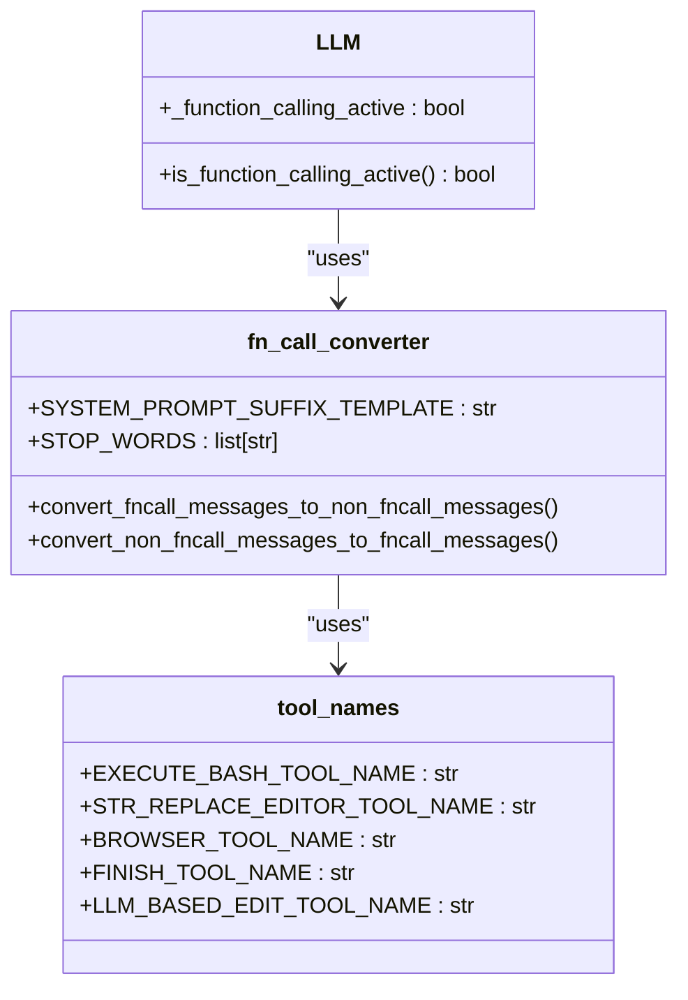
```mermaid
classDiagram
class LLM {
+is_function_calling_active() bool
+_function_calling_active : bool
}
class fn_call_converter {
+convert_fncall_messages_to_non_fncall_messages()
+convert_non_fncall_messages_to_fncall_messages()
+SYSTEM_PROMPT_SUFFIX_TEMPLATE : str
+STOP_WORDS : list[str]
}
class tool_names {
+EXECUTE_BASH_TOOL_NAME : str
+STR_REPLACE_EDITOR_TOOL_NAME : str
+BROWSER_TOOL_NAME : str
+FINISH_TOOL_NAME : str
+LLM_BASED_EDIT_TOOL_NAME : str
}
LLM --> fn_call_converter : "uses"
fn_call_converter --> tool_names : "uses"
```

**Diagram sources**
- [openhands/llm/llm.py](file://openhands/llm/llm.py#L582-L587)
- [openhands/llm/fn_call_converter.py](file://openhands/llm/fn_call_converter.py#L1-L800)
- [openhands/llm/tool_names.py](file://openhands/llm/tool_names.py#L1-L9)

### Message Conversion

The system uses a two-way conversion process to handle function calling:

1. **Function calling to non-function calling**: When the LLM doesn't support native function calling, the system converts function calling messages to a custom format with a system prompt that describes the available functions.

2. **Non-function calling to function calling**: When receiving a response in the custom format, the system parses it and converts it back to the standard function calling format.

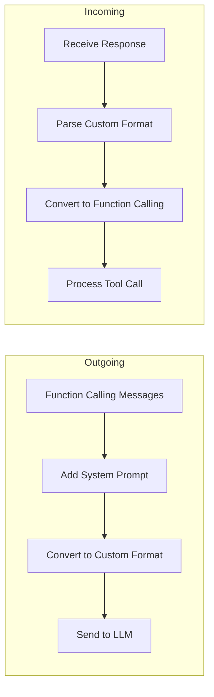
```mermaid
flowchart LR
subgraph "Outgoing"
A[Function Calling Messages] --> B[Add System Prompt]
B --> C[Convert to Custom Format]
C --> D[Send to LLM]
end
subgraph "Incoming"
E[Receive Response] --> F[Parse Custom Format]
F --> G[Convert to Function Calling]
G --> H[Process Tool Call]
end
```

**Diagram sources**
- [openhands/llm/fn_call_converter.py](file://openhands/llm/fn_call_converter.py#L478-L730)

The conversion process adds a system prompt that describes the available functions and their parameters, along with instructions for the LLM on how to format function calls. The custom format uses XML-like tags to delimit function calls and parameters:

```
<function=execute_bash>
<parameter=command>ls -la</parameter>
</function>
```

### Tool Definitions

The system defines a set of standard tools that can be invoked through function calling:

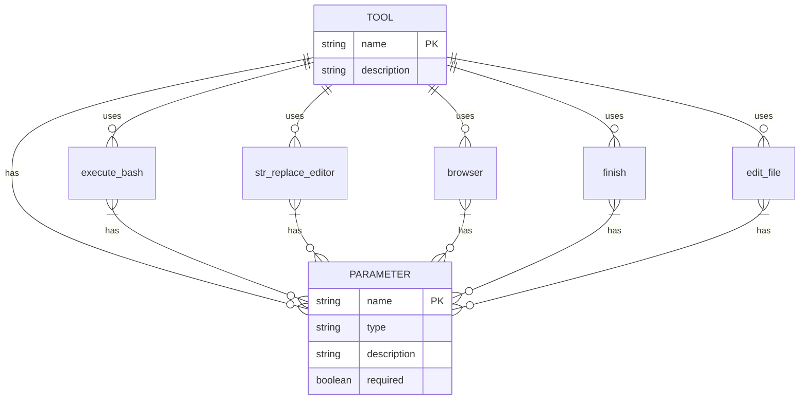
```mermaid
erDiagram
TOOL ||--o{ PARAMETER : has
TOOL {
string name PK
string description
}
PARAMETER {
string name PK
string type
string description
boolean required
}
TOOL ||--o{ "execute_bash" : uses
TOOL ||--o{ "str_replace_editor" : uses
TOOL ||--o{ "browser" : uses
TOOL ||--o{ "finish" : uses
TOOL ||--o{ "edit_file" : uses
"execute_bash" }|--o{ PARAMETER : has
"str_replace_editor" }|--o{ PARAMETER : has
"browser" }|--o{ PARAMETER : has
"finish" }|--o{ PARAMETER : has
"edit_file" }|--o{ PARAMETER : has
```

**Diagram sources**
- [openhands/llm/tool_names.py](file://openhands/llm/tool_names.py#L3-L9)
- [openhands/llm/fn_call_converter.py](file://openhands/llm/fn_call_converter.py#L21-L27)

Each tool has a defined name, description, and parameter schema that is used to generate the system prompt and validate function calls.

**Section sources**
- [openhands/llm/fn_call_converter.py](file://openhands/llm/fn_call_converter.py#L1-L800)
- [openhands/llm/tool_names.py](file://openhands/llm/tool_names.py#L1-L9)

## Prompt Formatting and Context Management

The LLM system implements sophisticated prompt formatting and context management to ensure effective communication with language models and efficient use of context windows.

### Prompt Formatting

The system handles prompt formatting through the `Message` class and associated serialization methods. Messages can contain multiple content types, including text and images, and are serialized appropriately for the target LLM.

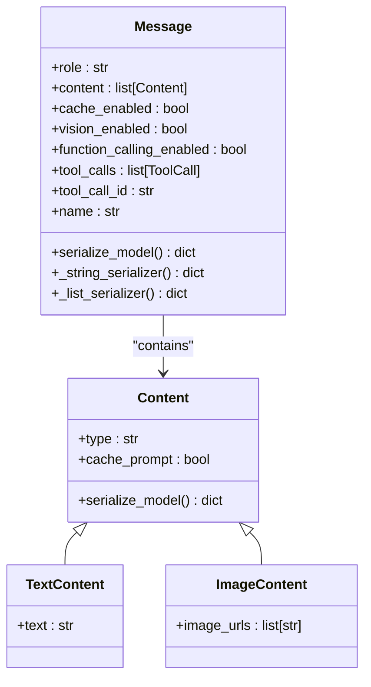
```mermaid
classDiagram
class Message {
+role : str
+content : list[Content]
+cache_enabled : bool
+vision_enabled : bool
+function_calling_enabled : bool
+tool_calls : list[ToolCall]
+tool_call_id : str
+name : str
+serialize_model() dict
+_string_serializer() dict
+_list_serializer() dict
}
class Content {
+type : str
+cache_prompt : bool
+serialize_model() dict
}
class TextContent {
+text : str
}
class ImageContent {
+image_urls : list[str]
}
Message --> Content : "contains"
Content <|-- TextContent
Content <|-- ImageContent
```

**Diagram sources**
- [openhands/core/message.py](file://openhands/core/message.py#L53-L159)

The message serialization process adapts to the capabilities of the target LLM:
- For models without vision or function calling support, content is serialized as a single string
- For models with advanced capabilities, content is serialized as a list of content items with appropriate type information

### Context Window Management

The system implements comprehensive context window management to prevent exceeding model limits and optimize token usage.

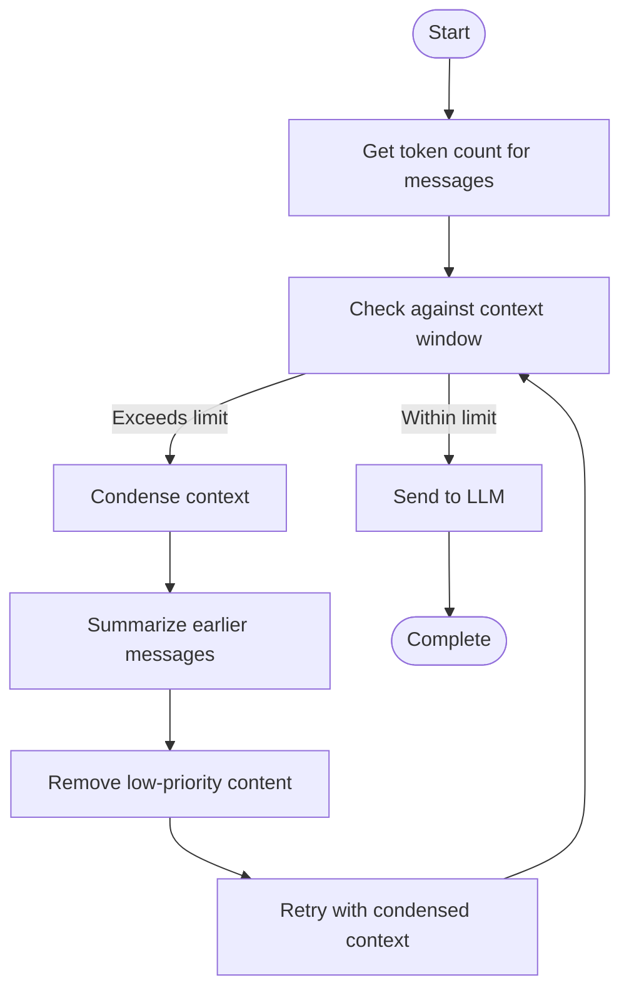
```mermaid
flowchart TD
Start([Start]) --> GetTokenCount["Get token count for messages"]
GetTokenCount --> CheckLimit["Check against context window"]
CheckLimit --> |Within limit| Send["Send to LLM"]
CheckLimit --> |Exceeds limit| Condense["Condense context"]
Condense --> Summarize["Summarize earlier messages"]
Summarize --> Remove["Remove low-priority content"]
Remove --> Retry["Retry with condensed context"]
Retry --> CheckLimit
Send --> End([Complete])
```

**Diagram sources**
- [openhands/llm/llm.py](file://openhands/llm/llm.py#L674-L723)

The token counting functionality uses the `litellm.token_counter` method with support for custom tokenizers. The system also tracks and reports token usage, including:
- Input tokens (prompt tokens)
- Output tokens (completion tokens)
- Cache hit tokens (for models with prompt caching)
- Cache write tokens (for models with prompt caching)

### Token Counting Implementation

The token counting is implemented in the `get_token_count` method of the `LLM` class:

```python
def get_token_count(self, messages: list[dict] | list[Message]) -> int:
    """Get the number of tokens in a list of messages. Use dicts for better token counting."""
    # Convert Message objects to dicts if needed
    if isinstance(messages, list) and len(messages) > 0 and isinstance(messages[0], Message):
        messages = self.format_messages_for_llm(messages)
    
    # Use litellm token counter with custom tokenizer if configured
    try:
        return int(
            litellm.token_counter(
                model=self.config.model,
                messages=messages,
                custom_tokenizer=self.tokenizer,
            )
        )
    except Exception as e:
        logger.error(f'Error getting token count for\n model {self.config.model}\n{e}')
        return 0
```

**Section sources**
- [openhands/llm/llm.py](file://openhands/llm/llm.py#L674-L723)
- [openhands/core/message.py](file://openhands/core/message.py#L53-L159)

## Integration with Agent Components

The LLM system integrates closely with other components of the agent architecture, including the agent controller, action system, and memory components.

### Agent Controller Integration

The LLM interacts with the agent controller through a well-defined interface that enables the controller to request completions and process responses.

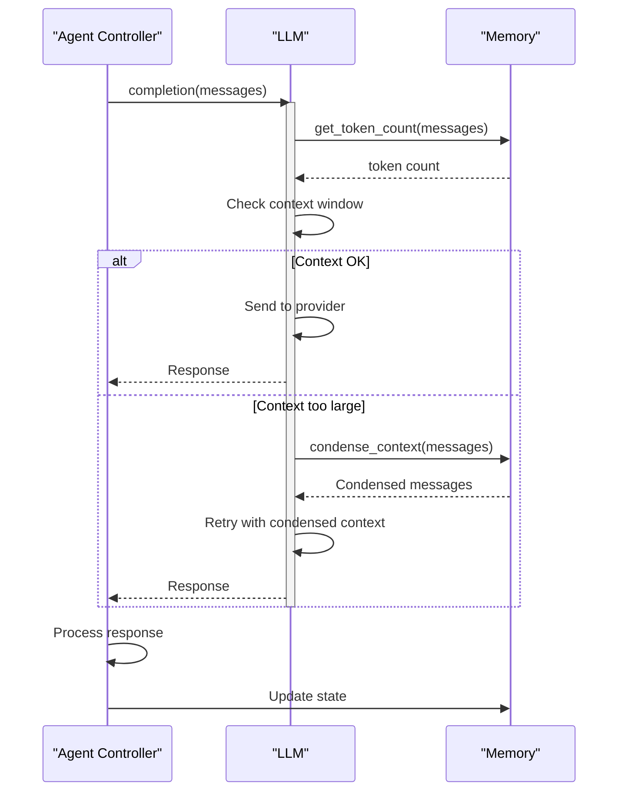
```mermaid
sequenceDiagram
participant Controller as "Agent Controller"
participant LLM as "LLM"
participant Memory as "Memory"
Controller->>LLM : completion(messages)
activate LLM
LLM->>Memory : get_token_count(messages)
Memory-->>LLM : token count
LLM->>LLM : Check context window
alt Context OK
LLM->>LLM : Send to provider
LLM-->>Controller : Response
else Context too large
LLM->>Memory : condense_context(messages)
Memory-->>LLM : Condensed messages
LLM->>LLM : Retry with condensed context
LLM-->>Controller : Response
end
deactivate LLM
Controller->>Controller : Process response
Controller->>Memory : Update state
```

**Diagram sources**
- [openhands/llm/llm.py](file://openhands/llm/llm.py#L197-L408)
- [openhands/controller/agent.py](file://openhands/controller/agent.py#L1-L100)

### Memory Integration

The LLM system works with the memory component to manage conversation history and context. The memory system is responsible for condensing context when necessary to fit within the LLM's context window.

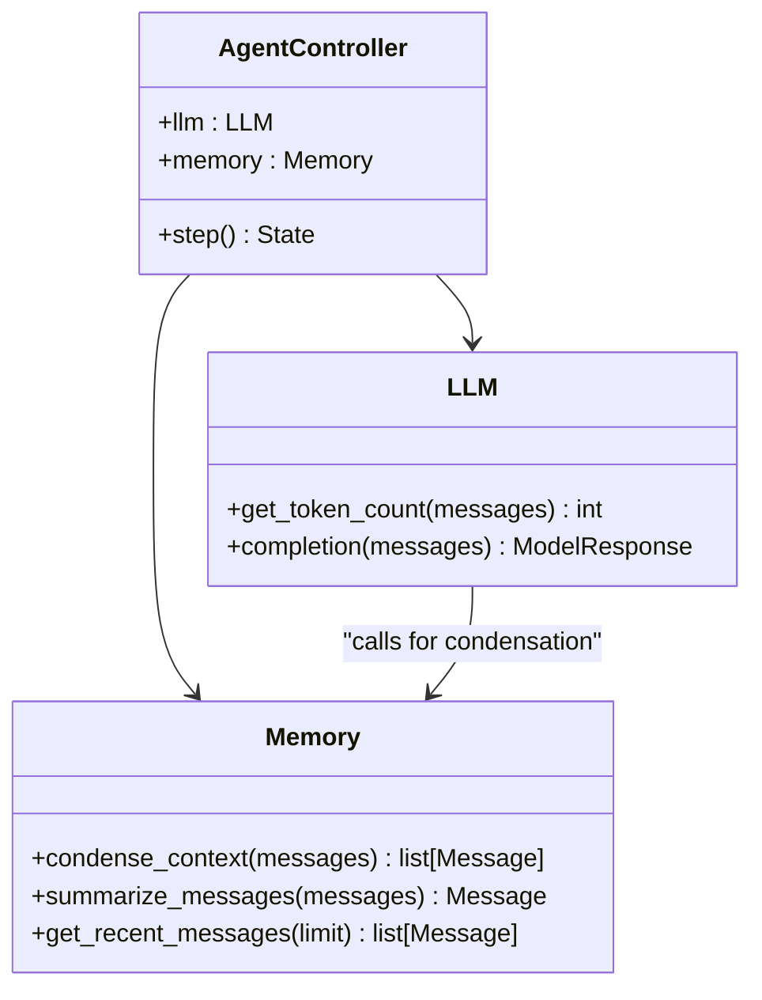
```mermaid
classDiagram
class AgentController {
+llm : LLM
+memory : Memory
+step() State
}
class LLM {
+get_token_count(messages) int
+completion(messages) ModelResponse
}
class Memory {
+condense_context(messages) list[Message]
+summarize_messages(messages) Message
+get_recent_messages(limit) list[Message]
}
AgentController --> LLM
AgentController --> Memory
LLM --> Memory : "calls for condensation"
```

**Diagram sources**
- [openhands/controller/agent.py](file://openhands/controller/agent.py#L1-L100)
- [openhands/memory/view.py](file://openhands/memory/view.py#L1-L50)

The memory system implements various condensation strategies, such as summarizing earlier messages or removing low-priority content, to ensure that the most relevant context is preserved within the token limit.

### Action System Integration

The LLM integrates with the action system through function calling, allowing it to invoke tools and actions as needed to accomplish tasks.

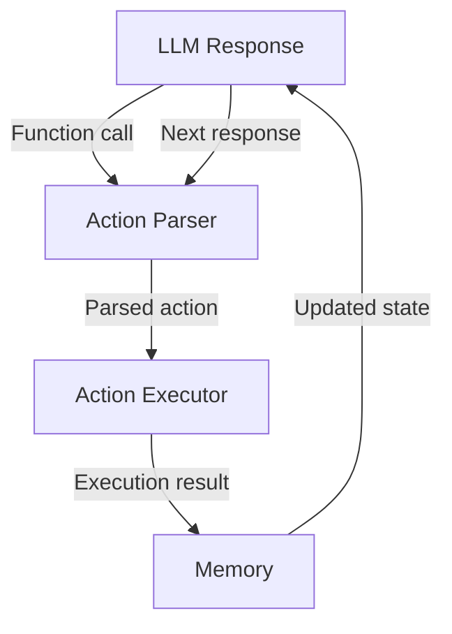
```mermaid
flowchart TD
LLM[LLM Response] --> |Function call| Parser[Action Parser]
Parser --> |Parsed action| Executor[Action Executor]
Executor --> |Execution result| Memory[Memory]
Memory --> |Updated state| LLM
LLM --> |Next response| Parser
```

**Diagram sources**
- [openhands/events/action/__init__.py](file://openhands/events/action/__init__.py#L1-L20)
- [openhands/controller/action_parser.py](file://openhands/controller/action_parser.py#L1-L50)

When the LLM generates a function call, the action parser converts it into an appropriate action object, which is then executed by the action executor. The results are stored in memory and can be used in subsequent LLM interactions.

**Section sources**
- [openhands/controller/agent.py](file://openhands/controller/agent.py#L1-L100)
- [openhands/memory/view.py](file://openhands/memory/view.py#L1-L50)
- [openhands/events/action/__init__.py](file://openhands/events/action/__init__.py#L1-L20)
- [openhands/controller/action_parser.py](file://openhands/controller/action_parser.py#L1-L50)

## Error Handling and Common Issues

The LLM system implements comprehensive error handling to manage common issues that arise during LLM interactions.

### Error Types and Handling

The system handles various types of errors that can occur during LLM operations:

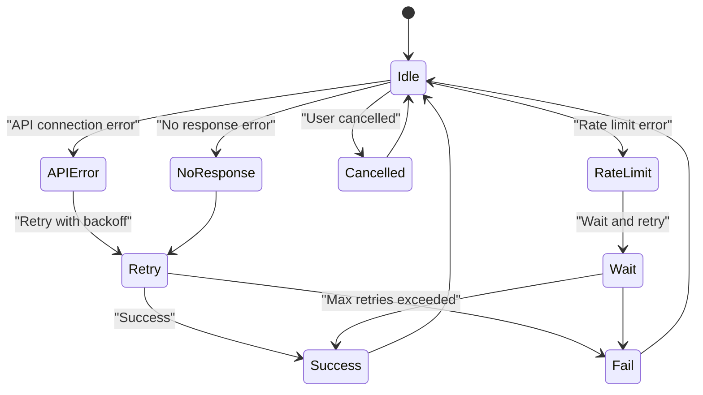
```mermaid
stateDiagram-v2
[*] --> Idle
Idle --> APIError : "API connection error"
APIError --> Retry : "Retry with backoff"
Retry --> Success : "Success"
Retry --> Fail : "Max retries exceeded"
Idle --> RateLimit : "Rate limit error"
RateLimit --> Wait : "Wait and retry"
Wait --> Success
Wait --> Fail
Idle --> Cancelled : "User cancelled"
Cancelled --> Idle
Idle --> NoResponse : "No response error"
NoResponse --> Retry
Success --> Idle
Fail --> Idle
```

**Diagram sources**
- [openhands/llm/llm.py](file://openhands/llm/llm.py#L44-L51)
- [openhands/llm/async_llm.py](file://openhands/llm/async_llm.py#L7-L8)

The system handles the following common error types:
- **APIConnectionError**: Network issues or provider unavailability
- **RateLimitError**: Exceeding rate limits imposed by the provider
- **ServiceUnavailableError**: Temporary provider outages
- **UserCancelledError**: User-initiated cancellation of a request
- **LLMNoResponseError**: No response received from the LLM

### Retry Mechanism

The system implements a robust retry mechanism with exponential backoff to handle transient errors:

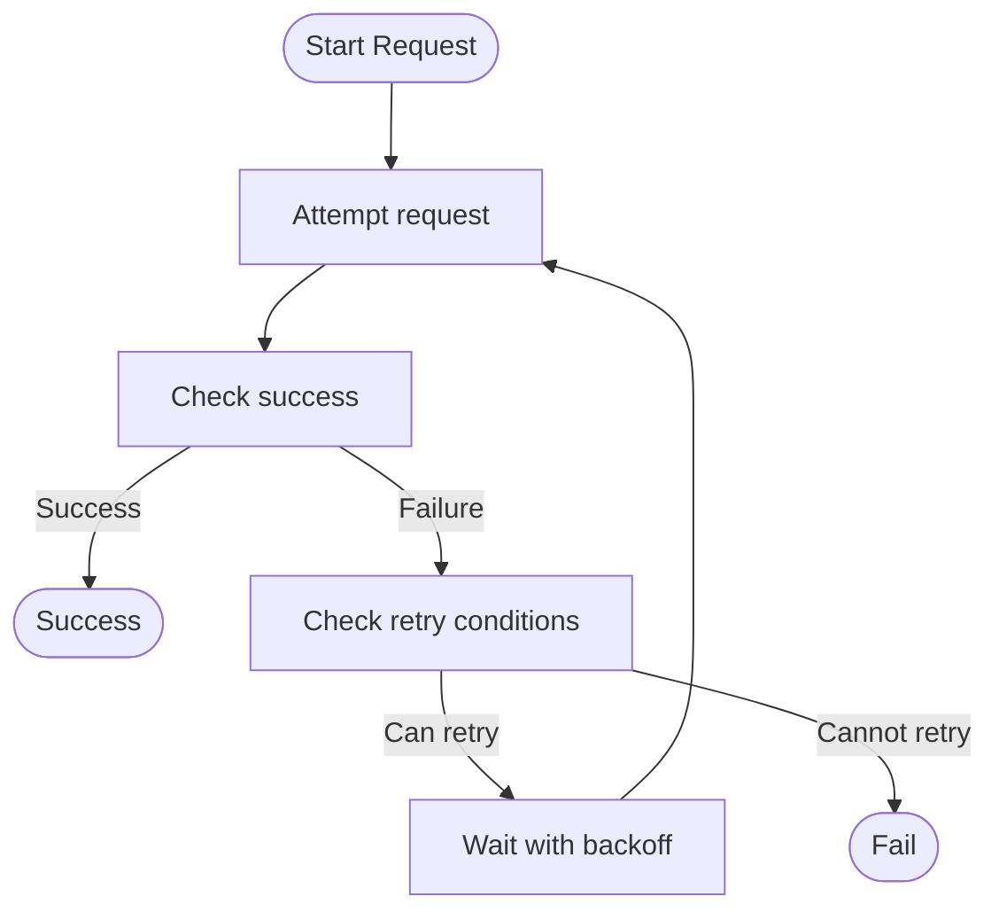
```mermaid
flowchart TD
Start([Start Request]) --> Attempt["Attempt request"]
Attempt --> CheckSuccess["Check success"]
CheckSuccess --> |Success| EndSuccess([Success])
CheckSuccess --> |Failure| CheckRetry["Check retry conditions"]
CheckRetry --> |Can retry| Wait["Wait with backoff"]
Wait --> Attempt
CheckRetry --> |Cannot retry| EndFail([Fail])
```

**Diagram sources**
- [openhands/llm/retry_mixin.py](file://openhands/llm/retry_mixin.py#L1-L50)
- [openhands/llm/llm.py](file://openhands/llm/llm.py#L214-L222)

The retry mechanism is configurable through the LLM configuration, allowing customization of:
- Number of retries
- Minimum and maximum wait times between retries
- Retry multiplier for exponential backoff
- Specific exceptions to retry on

### Incomplete Response Handling

The system includes mechanisms to handle incomplete or malformed responses from LLMs:

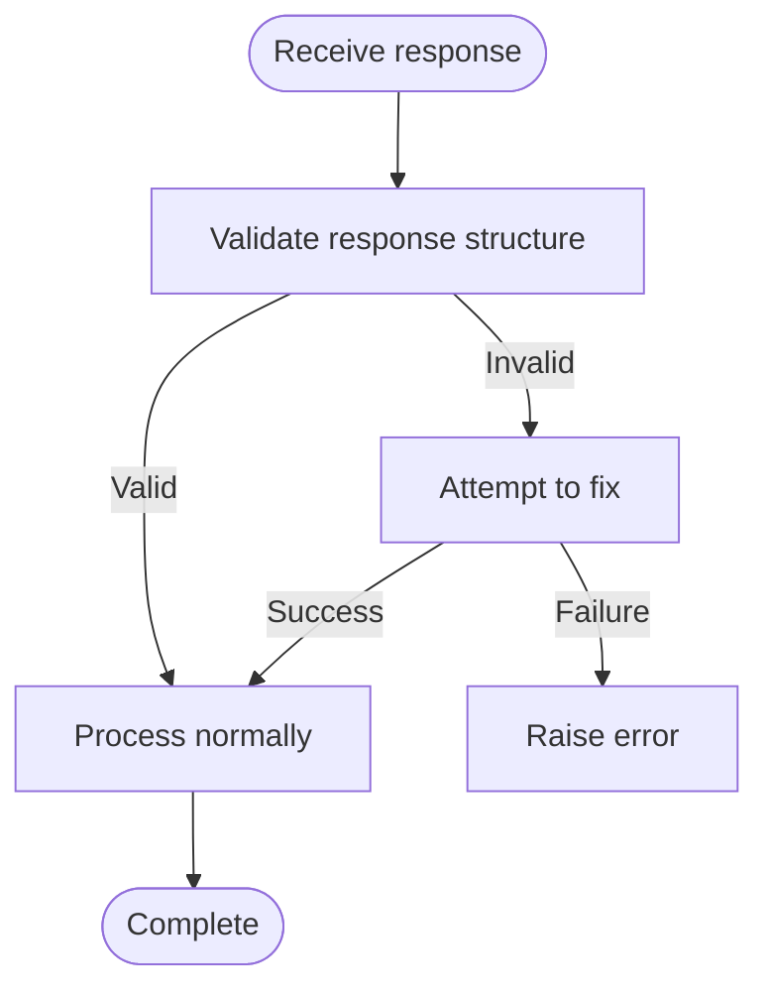
```mermaid
flowchart TD
Receive([Receive response]) --> Validate["Validate response structure"]
Validate --> |Valid| Process["Process normally"]
Validate --> |Invalid| Fix["Attempt to fix"]
Fix --> |Success| Process
Fix --> |Failure| Error["Raise error"]
Process --> End([Complete])
```

**Diagram sources**
- [openhands/llm/fn_call_converter.py](file://openhands/llm/fn_call_converter.py#L698-L705)
- [openhands/llm/fn_call_converter.py](file://openhands/llm/fn_call_converter.py#L727-L730)

For function calling responses, the system includes validation and normalization logic to handle common formatting issues, such as missing closing tags or malformed parameter syntax.

**Section sources**
- [openhands/llm/llm.py](file://openhands/llm/llm.py#L44-L51)
- [openhands/llm/async_llm.py](file://openhands/llm/async_llm.py#L7-L8)
- [openhands/llm/retry_mixin.py](file://openhands/llm/retry_mixin.py#L1-L50)
- [openhands/llm/fn_call_converter.py](file://openhands/llm/fn_call_converter.py#L698-L705)

## Performance and Cost Optimization

The LLM system includes several features for optimizing performance and managing costs.

### Performance Considerations

The system implements various performance optimizations to ensure efficient LLM usage:

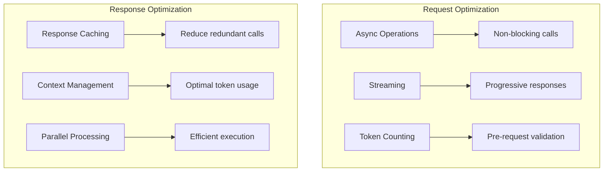
```mermaid
flowchart TD
subgraph "Request Optimization"
A[Async Operations] --> B[Non-blocking calls]
C[Streaming] --> D[Progressive responses]
E[Token Counting] --> F[Pre-request validation]
end
subgraph "Response Optimization"
G[Response Caching] --> H[Reduce redundant calls]
I[Context Management] --> J[Optimal token usage]
K[Parallel Processing] --> L[Efficient execution]
end
```

**Diagram sources**
- [openhands/llm/async_llm.py](file://openhands/llm/async_llm.py#L20-L131)
- [openhands/llm/streaming_llm.py](file://openhands/llm/streaming_llm.py#L11-L114)
- [openhands/llm/llm.py](file://openhands/llm/llm.py#L674-L723)

Key performance features include:
- **Asynchronous operations**: Non-blocking LLM calls that don't block the event loop
- **Streaming responses**: Incremental processing of responses as they arrive
- **Token counting**: Pre-validation of token usage to prevent exceeding context limits
- **Response caching**: Support for models with prompt caching capabilities

### Cost Management

The system includes comprehensive cost tracking and management features:

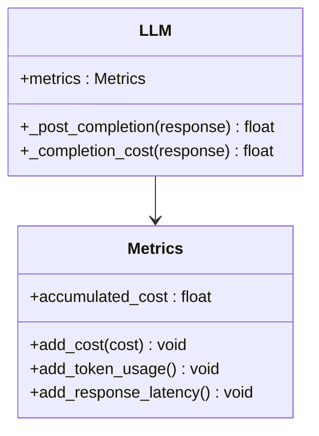
```mermaid
classDiagram
class LLM {
+metrics : Metrics
+_post_completion(response) float
+_completion_cost(response) float
}
class Metrics {
+accumulated_cost : float
+add_cost(cost) void
+add_token_usage() void
+add_response_latency() void
}
LLM --> Metrics
```

**Diagram sources**
- [openhands/llm/llm.py](file://openhands/llm/llm.py#L589-L672)
- [openhands/llm/metrics.py](file://openhands/llm/metrics.py#L1-L50)

The cost management system:
- Tracks accumulated costs across all LLM interactions
- Records token usage (input, output, cache hits, cache writes)
- Measures response latency for performance monitoring
- Supports custom cost per token for self-hosted or custom-priced models

### Optimization Strategies

The system supports several optimization strategies:

1. **Model routing**: Using less expensive models when possible through the router system
2. **Prompt caching**: Leveraging models with prompt caching capabilities to reduce costs
3. **Context optimization**: Minimizing token usage through effective context management
4. **Batching**: Combining multiple operations when possible to reduce API calls

These features work together to provide an efficient and cost-effective LLM integration that can be tailored to different use cases and budget constraints.

**Section sources**
- [openhands/llm/llm.py](file://openhands/llm/llm.py#L589-L797)
- [openhands/llm/metrics.py](file://openhands/llm/metrics.py#L1-L50)
- [openhands/llm/router/base.py](file://openhands/llm/router/base.py#L17-L165)