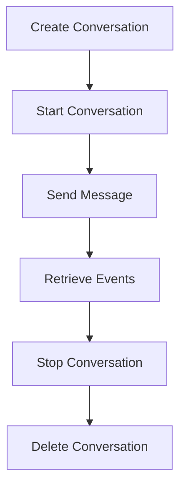
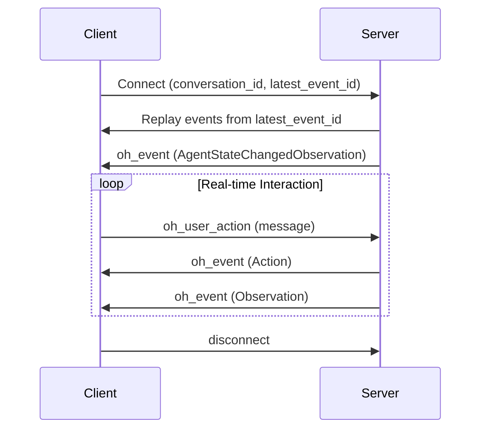
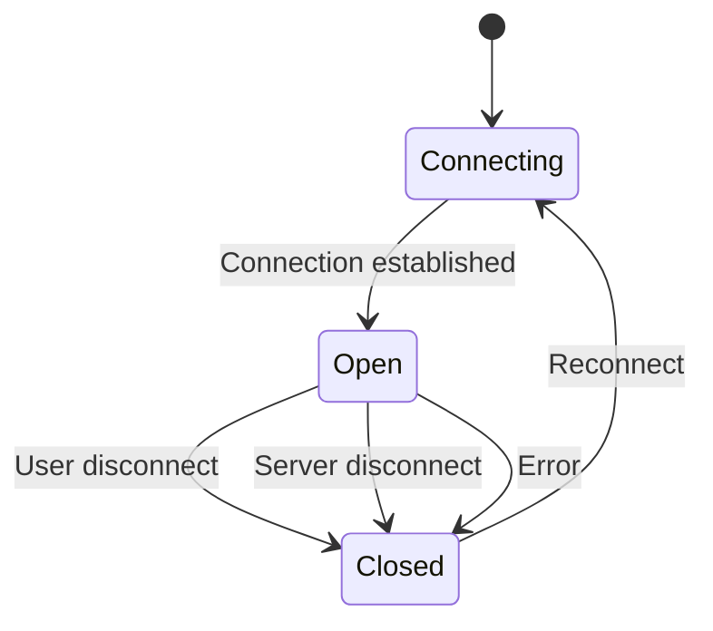
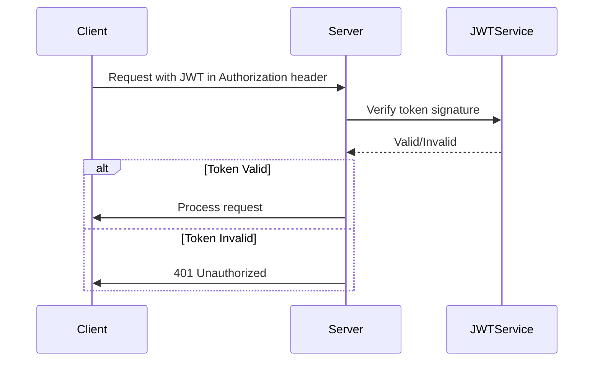
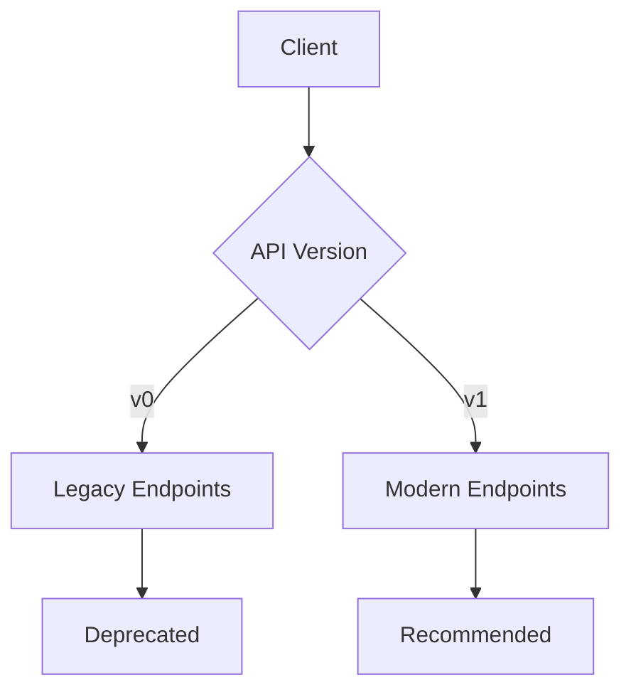
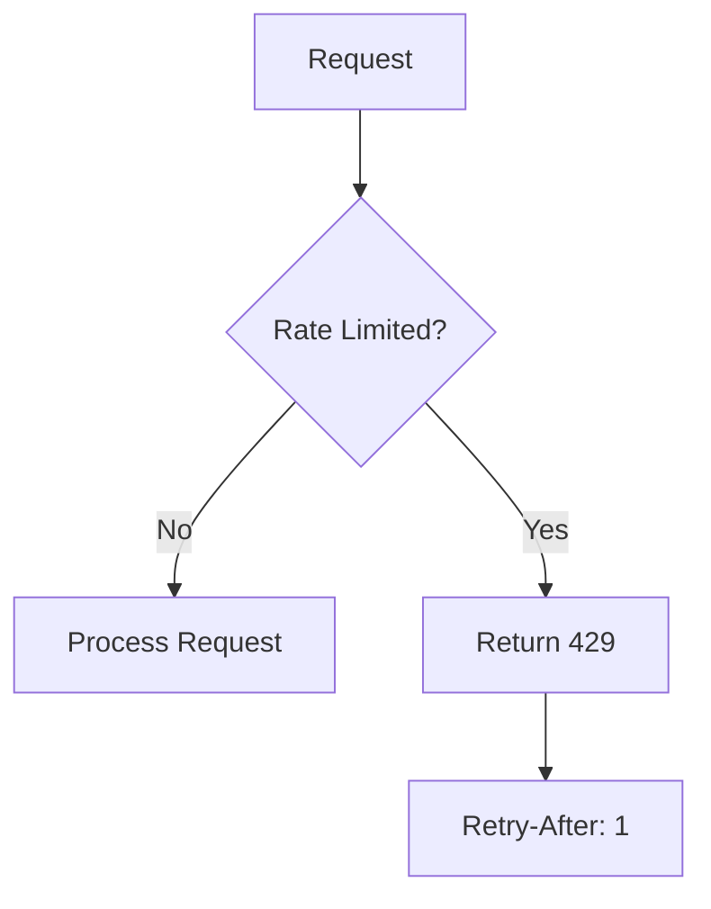
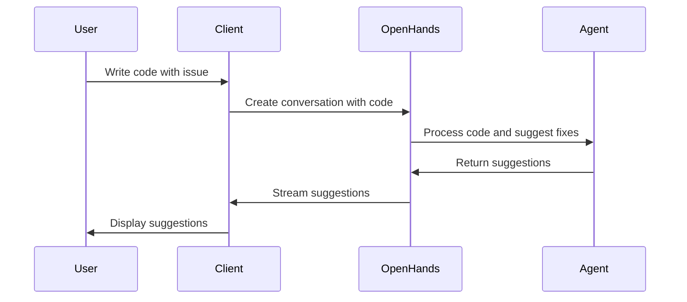

# API Reference

<cite>
**Referenced Files in This Document**   
- [app.py](file://openhands/server/app.py)
- [conversation.py](file://openhands/server/routes/conversation.py)
- [files.py](file://openhands/server/routes/files.py)
- [public.py](file://openhands/server/routes/public.py)
- [manage_conversations.py](file://openhands/server/routes/manage_conversations.py)
- [feedback.py](file://openhands/server/routes/feedback.py)
- [listen_socket.py](file://openhands/server/listen_socket.py)
- [jwt_service.py](file://openhands/app_server/services/jwt_service.py)
- [webhook_router.py](file://openhands/app_server/event_callback/webhook_router.py)
- [settings.py](file://openhands/server/routes/settings.py)
- [rate_limit.py](file://enterprise/server/rate_limit.py)
- [middleware.py](file://openhands/server/middleware.py)
- [conversation-websocket-context.tsx](file://frontend/src/contexts/conversation-websocket-context.tsx)
- [conversation-subscriptions-provider.tsx](file://frontend/src/context/conversation-subscriptions-provider.tsx)
- [api-keys.ts](file://frontend/src/api/api-keys.ts)
- [use-api-keys.ts](file://frontend/src/hooks/query/use-api-keys.ts)
- [types.py](file://openhands/server/types.py)
</cite>

## Table of Contents
1. [Introduction](#introduction)
2. [RESTful API Endpoints](#restful-api-endpoints)
3. [WebSocket API](#websocket-api)
4. [Authentication and Security](#authentication-and-security)
5. [API Versioning and Compatibility](#api-versioning-and-compatibility)
6. [Rate Limiting](#rate-limiting)
7. [Client Implementation Guidelines](#client-implementation-guidelines)
8. [Common Use Cases](#common-use-cases)
9. [Performance Optimization](#performance-optimization)
10. [Error Handling and Debugging](#error-handling-and-debugging)
11. [Migration Guide](#migration-guide)

## Introduction

The OpenHands platform provides a comprehensive API for interacting with AI agents, enabling users to create, manage, and monitor conversations with AI assistants. The API consists of RESTful endpoints for state management and WebSocket connections for real-time event streaming. This documentation covers all public interfaces, including authentication methods, request/response schemas, and interaction patterns.

The platform supports two primary interaction models: RESTful APIs for managing conversation state and WebSocket APIs for real-time agent communication. Authentication is handled through JWT tokens and API keys, with comprehensive security measures in place. The API is designed to be developer-friendly, with clear endpoints and consistent response formats.

**Section sources**
- [app.py](file://openhands/server/app.py#L1-L97)
- [types.py](file://openhands/server/types.py#L1-L45)

## RESTful API Endpoints

### Conversation Management

The conversation management endpoints allow users to create, retrieve, update, and delete conversations with AI agents.



**Diagram sources**
- [manage_conversations.py](file://openhands/server/routes/manage_conversations.py#L203-L800)
- [conversation.py](file://openhands/server/routes/conversation.py#L25-L319)

#### Create a New Conversation

Creates a new conversation session with the AI agent.

**Endpoint**
```
POST /api/conversations
```

**Request Body**
```json
{
  "repository": "string",
  "git_provider": "github|gitlab|bitbucket",
  "selected_branch": "string",
  "initial_user_msg": "string",
  "image_urls": ["string"],
  "replay_json": "string",
  "suggested_task": {
    "task": "string",
    "repo": "string",
    "git_provider": "github|gitlab|bitbucket"
  },
  "create_microagent": {
    "name": "string",
    "repo": "string",
    "git_provider": "github|gitlab|bitbucket",
    "instructions": "string"
  },
  "conversation_instructions": "string",
  "mcp_config": {
    "servers": [
      {
        "name": "string",
        "url": "string"
      }
    ]
  }
}
```

**Response (200 OK)**
```json
{
  "status": "ok",
  "conversation_id": "string",
  "conversation_status": "INITIALIZED|STARTING|RUNNING|FINISHED|STOPPED|ERROR"
}
```

**Response (400 Bad Request)**
```json
{
  "status": "error",
  "message": "string",
  "msg_id": "CONFIGURATION$SETTINGS_NOT_FOUND|ERROR_LLM_AUTHENTICATION"
}
```

**Section sources**
- [manage_conversations.py](file://openhands/server/routes/manage_conversations.py#L203-L271)

#### List Conversations

Retrieves a paginated list of conversations.

**Endpoint**
```
GET /api/conversations?page_id=string&limit=number&selected_repository=string&conversation_trigger=string
```

**Query Parameters**
- `page_id`: Pagination token for retrieving subsequent pages
- `limit`: Maximum number of conversations to return (default: 20, max: 100)
- `selected_repository`: Filter by repository URL
- `conversation_trigger`: Filter by trigger type (GUI, SUGGESTED_TASK, MICROAGENT_MANAGEMENT, REMOTE_API_KEY)

**Response (200 OK)**
```json
{
  "results": [
    {
      "trigger": "GUI|SUGGESTED_TASK|MICROAGENT_MANAGEMENT|REMOTE_API_KEY",
      "conversation_id": "string",
      "title": "string",
      "last_updated_at": "string",
      "created_at": "string",
      "selected_repository": "string",
      "selected_branch": "string",
      "git_provider": "github|gitlab|bitbucket",
      "status": "INITIALIZED|STARTING|RUNNING|FINISHED|STOPPED|ERROR",
      "runtime_status": "string",
      "num_connections": "number",
      "url": "string",
      "session_api_key": "string",
      "pr_number": "number"
    }
  ],
  "next_page_id": "string"
}
```

**Section sources**
- [manage_conversations.py](file://openhands/server/routes/manage_conversations.py#L292-L421)

#### Get Conversation Details

Retrieves detailed information about a specific conversation.

**Endpoint**
```
GET /api/conversations/{conversation_id}
```

**Response (200 OK)**
```json
{
  "trigger": "GUI|SUGGESTED_TASK|MICROAGENT_MANAGEMENT|REMOTE_API_KEY",
  "conversation_id": "string",
  "title": "string",
  "last_updated_at": "string",
  "created_at": "string",
  "selected_repository": "string",
  "selected_branch": "string",
  "git_provider": "github|gitlab|bitbucket",
  "status": "INITIALIZED|STARTING|RUNNING|FINISHED|STOPPED|ERROR",
  "runtime_status": "string",
  "num_connections": "number",
  "url": "string",
  "session_api_key": "string",
  "pr_number": "number"
}
```

**Response (404 Not Found)**
```json
null
```

**Section sources**
- [manage_conversations.py](file://openhands/server/routes/manage_conversations.py#L424-L457)

#### Start a Conversation

Starts the agent loop for a conversation.

**Endpoint**
```
POST /api/conversations/{conversation_id}/start
```

**Request Body**
```json
{
  "providers_set": ["github", "gitlab"]
}
```

**Response (200 OK)**
```json
{
  "status": "ok",
  "conversation_id": "string",
  "conversation_status": "INITIALIZED|STARTING|RUNNING|FINISHED|STOPPED|ERROR"
}
```

**Response (404 Not Found)**
```json
{
  "status": "error",
  "conversation_id": "string"
}
```

**Section sources**
- [manage_conversations.py](file://openhands/server/routes/manage_conversations.py#L580-L654)

#### Stop a Conversation

Stops the agent loop for a conversation.

**Endpoint**
```
POST /api/conversations/{conversation_id}/stop
```

**Response (200 OK)**
```json
{
  "status": "ok",
  "conversation_id": "string",
  "message": "string",
  "conversation_status": "INITIALIZED|STARTING|RUNNING|FINISHED|STOPPED|ERROR"
}
```

**Section sources**
- [manage_conversations.py](file://openhands/server/routes/manage_conversations.py#L657-L710)

#### Update Conversation

Updates conversation metadata, such as the title.

**Endpoint**
```
PATCH /api/conversations/{conversation_id}
```

**Request Body**
```json
{
  "title": "string"
}
```

**Response (200 OK)**
```json
true
```

**Section sources**
- [manage_conversations.py](file://openhands/server/routes/manage_conversations.py#L762-L799)

#### Delete Conversation

Deletes a conversation and all associated data.

**Endpoint**
```
DELETE /api/conversations/{conversation_id}
```

**Response (200 OK)**
```json
true
```

**Section sources**
- [manage_conversations.py](file://openhands/server/routes/manage_conversations.py#L459-L475)

### File Operations

The file operations endpoints allow users to interact with files in the agent's workspace.

#### List Files

Retrieves a list of files in the agent's workspace.

**Endpoint**
```
GET /api/conversations/{conversation_id}/list-files?path=string
```

**Query Parameters**
- `path`: Directory path to list files from (optional)

**Response (200 OK)**
```json
["file1.txt", "file2.py", "directory/"]
```

**Response (404 Not Found)**
```json
{
  "error": "Runtime not yet initialized"
}
```

**Section sources**
- [files.py](file://openhands/server/routes/files.py#L35-L110)

#### Read File

Retrieves the content of a file.

**Endpoint**
```
GET /api/conversations/{conversation_id}/select-file?file=string
```

**Query Parameters**
- `file`: Path to the file to read

**Response (200 OK)**
```json
{
  "code": "file content"
}
```

**Response (415 Unsupported Media Type)**
```json
{
  "error": "Unable to open binary file: /path/to/file"
}
```

**Section sources**
- [files.py](file://openhands/server/routes/files.py#L118-L182)

#### Upload Files

Uploads files to the agent's workspace.

**Endpoint**
```
POST /api/conversations/{conversation_id}/upload-files
```

**Request Body (multipart/form-data)**
- `files`: One or more files to upload

**Response (200 OK)**
```json
{
  "uploaded_files": ["/path/to/file1", "/path/to/file2"],
  "skipped_files": [
    {
      "name": "filename",
      "reason": "error message"
    }
  ]
}
```

**Section sources**
- [files.py](file://openhands/server/routes/files.py#L287-L318)

#### Zip Workspace

Creates a zip archive of the entire workspace.

**Endpoint**
```
GET /api/conversations/{conversation_id}/zip-directory
```

**Response (200 OK)**
- Returns a zip file attachment named "workspace.zip"

**Section sources**
- [files.py](file://openhands/server/routes/files.py#L185-L220)

#### Git Operations

Provides access to git repository information.

##### Get Git Changes

Retrieves the current git changes (staged and unstaged).

**Endpoint**
```
GET /api/conversations/{conversation_id}/git/changes
```

**Response (200 OK)**
```json
[
  {
    "path": "file.txt",
    "type": "modified|added|deleted",
    "content": "diff content"
  }
]
```

**Response (404 Not Found)**
```json
{
  "error": "Not a git repository"
}
```

**Section sources**
- [files.py](file://openhands/server/routes/files.py#L222-L259)

##### Get Git Diff

Retrieves the git diff for a specific file.

**Endpoint**
```
GET /api/conversations/{conversation_id}/git/diff?path=string
```

**Query Parameters**
- `path`: Path to the file to get diff for

**Response (200 OK)**
```json
{
  "diff": "diff content"
}
```

**Section sources**
- [files.py](file://openhands/server/routes/files.py#L262-L285)

### Public Information Endpoints

These endpoints provide information about available options and configuration.

#### Get Available Models

Retrieves a list of supported LLM models.

**Endpoint**
```
GET /api/options/models
```

**Response (200 OK)**
```json
["gpt-4", "gpt-3.5-turbo", "claude-2", "claude-instant-1"]
```

**Section sources**
- [public.py](file://openhands/server/routes/public.py#L14-L29)

#### Get Available Agents

Retrieves a list of supported agent types.

**Endpoint**
```
GET /api/options/agents
```

**Response (200 OK)**
```json
["CodeActAgent", "BrowsingAgent", "ReadOnlyAgent"]
```

**Section sources**
- [public.py](file://openhands/server/routes/public.py#L32-L44)

#### Get Security Analyzers

Retrieves a list of supported security analyzers.

**Endpoint**
```
GET /api/options/security-analyzers
```

**Response (200 OK)**
```json
["invariant", "grayswan"]
```

**Section sources**
- [public.py](file://openhands/server/routes/public.py#L47-L59)

#### Get Configuration

Retrieves the current server configuration.

**Endpoint**
```
GET /api/options/config
```

**Response (200 OK)**
```json
{
  "llm": {
    "model": "string",
    "api_key": "string",
    "base_url": "string"
  },
  "runtime": "string",
  "workspace_base": "string",
  "workspace_mount_path": "string",
  "sandbox": {
    "container_image": "string"
  }
}
```

**Section sources**
- [public.py](file://openhands/server/routes/public.py#L62-L69)

### Feedback and Settings

#### Submit Feedback

Submits user feedback about a conversation.

**Endpoint**
```
POST /api/conversations/{conversation_id}/submit-feedback
```

**Request Body**
```json
{
  "email": "string",
  "version": "string",
  "permissions": "public|private",
  "polarity": "positive|negative|neutral",
  "feedback": "string"
}
```

**Response (200 OK)**
```json
{
  "email": "string",
  "version": "string",
  "permissions": "public|private",
  "polarity": "positive|negative|neutral",
  "feedback": "string",
  "trajectory": [
    {
      "id": "number",
      "source": "agent|user|environment",
      "message": "string",
      "timestamp": "string",
      "action": "string",
      "args": {}
    }
  ]
}
```

**Section sources**
- [feedback.py](file://openhands/server/routes/feedback.py#L19-L67)

#### Get Settings

Retrieves user settings.

**Endpoint**
```
GET /api/settings
```

**Response (200 OK)**
```json
{
  "llm_model": "string",
  "llm_api_key": "string",
  "llm_base_url": "string",
  "max_budget_per_task": "number",
  "enable_sound_notifications": "boolean",
  "accepted_tos": "boolean",
  "proactive_conversation_starters": "boolean",
  "mcp_config": {
    "servers": [
      {
        "name": "string",
        "url": "string"
      }
    ]
  },
  "search_api_key": "string",
  "sandbox_api_key": "string",
  "llm_api_key_for_byor": "string",
  "email": "string",
  "git_user_name": "string",
  "git_user_email": "string"
}
```

**Section sources**
- [settings.py](file://openhands/server/routes/settings.py#L1-L25)

## WebSocket API

The WebSocket API provides real-time communication between the client and the AI agent, enabling bidirectional message exchange and event streaming.



**Diagram sources**
- [listen_socket.py](file://openhands/server/listen_socket.py#L35-L169)
- [conversation-websocket-context.tsx](file://frontend/src/contexts/conversation-websocket-context.tsx#L1-L156)

### Connection Handling

Clients connect to the WebSocket endpoint to receive real-time events from the AI agent.

**Endpoint**
```
ws://localhost/events/socket?conversation_id=string&latest_event_id=number&session_api_key=string
```

**Query Parameters**
- `conversation_id`: Required. The ID of the conversation to connect to.
- `latest_event_id`: Optional. The ID of the last event received by the client. Used for event stream resumption.
- `session_api_key`: Optional. Session API key for authentication.

**Connection Flow**
1. Client initiates WebSocket connection with required parameters
2. Server validates conversation access and authentication
3. Server replays events from `latest_event_id + 1` to current
4. Server sends final `AgentStateChangedObservation` event
5. Server joins conversation and begins real-time event streaming

**Section sources**
- [listen_socket.py](file://openhands/server/listen_socket.py#L35-L136)

### Message Formats

The WebSocket API uses a standardized event format for all messages.

#### Event Structure

All events follow this structure:

```json
{
  "id": 123,
  "source": "agent|user|environment",
  "message": "string",
  "timestamp": "2023-12-01T12:00:00Z",
  "action": "string",
  "args": {},
  "observation": "string",
  "content": "string",
  "extras": {}
}
```

**Section sources**
- [conversation-subscriptions-provider.tsx](file://frontend/src/context/conversation-subscriptions-provider.tsx#L83-L289)

#### Event Types

The API supports multiple event types for different interaction patterns.

##### Action Events

Sent when the agent or user performs an action.

```json
{
  "action": "run|read|write|browse|finish|think|delegate",
  "args": {
    "command": "ls -la",
    "path": "/path/to/file",
    "url": "https://example.com"
  }
}
```

**Section sources**
- [types.py](file://openhands/server/types.py#L1-L45)

##### Observation Events

Sent when the environment responds to an action.

```json
{
  "observation": "run|read|write|browse|error",
  "content": "command output or file content",
  "extras": {
    "exit_code": 0,
    "command": "ls -la"
  }
}
```

**Section sources**
- [types.py](file://openhands/server/types.py#L1-L45)

##### Agent State Events

Sent when the agent's state changes.

```json
{
  "action": "change_agent_state",
  "args": {
    "agent_state": "INIT|RUNNING|PAUSED|FINISHED|ERROR"
  }
}
```

**Section sources**
- [types.py](file://openhands/server/types.py#L1-L45)

### Real-time Interaction Patterns

#### Sending User Messages

Clients send user messages to the agent using the `oh_user_action` event.

```javascript
socket.emit('oh_user_action', {
  action: 'message',
  args: {
    content: 'Hello, agent!'
  }
});
```

**Section sources**
- [listen_socket.py](file://openhands/server/listen_socket.py#L143-L146)

#### Receiving Agent Events

Clients receive agent events through the `oh_event` event.

```javascript
socket.on('oh_event', (event) => {
  console.log('Received event:', event);
  // Handle event based on type
  if (event.action === 'run') {
    // Handle command execution
  } else if (event.observation === 'run') {
    // Handle command output
  }
});
```

**Section sources**
- [conversation-subscriptions-provider.tsx](file://frontend/src/context/conversation-subscriptions-provider.tsx#L262-L263)

#### Connection Lifecycle

The WebSocket connection follows a standard lifecycle with proper error handling.



**Diagram sources**
- [conversation-websocket-context.tsx](file://frontend/src/contexts/conversation-websocket-context.tsx#L111-L136)
- [conversation-subscriptions-provider.tsx](file://frontend/src/context/conversation-subscriptions-provider.tsx#L242-L260)

## Authentication and Security

The OpenHands platform implements robust authentication and security measures to protect user data and conversations.

### JWT Authentication

The platform uses JWT (JSON Web Tokens) for secure authentication and authorization.



**Diagram sources**
- [jwt_service.py](file://openhands/app_server/services/jwt_service.py#L233-L248)
- [webhook_router.py](file://openhands/app_server/event_callback/webhook_router.py#L150-L173)

#### JWT Service Features

- Token signing and verification for authentication
- JWE (JSON Web Encryption) support for sensitive data
- Multi-key support with key rotation capabilities
- Configurable algorithms (RS256, HS256, etc.)
- Secure token handling and validation

**Section sources**
- [jwt_service.py](file://openhands/app_server/services/jwt_service.py#L233-L248)

### API Key Management

The platform supports API keys for programmatic access, particularly in the SaaS version.

#### API Key Endpoints

**Get API Keys**
```
GET /api/keys
```

**Create API Key**
```
POST /api/keys
{
  "name": "string"
}
```

**Delete API Key**
```
DELETE /api/keys/{key_id}
```

**Section sources**
- [api-keys.ts](file://frontend/src/api/api-keys.ts#L1-L49)
- [use-api-keys.ts](file://frontend/src/hooks/query/use-api-keys.ts#L1-L20)

#### API Key Security

- API keys are stored securely in the database
- Keys can be revoked at any time
- Each key has a unique prefix for identification
- Keys can have expiration dates
- Usage is logged for security auditing

**Section sources**
- [test_api_key_store.py](file://enterprise/tests/unit/test_api_key_store.py#L51-L200)

### Security Headers

The platform implements standard security headers to protect against common web vulnerabilities.

- `Cache-Control`: Prevents caching of sensitive data
- `Content-Security-Policy`: Mitigates XSS attacks
- `X-Content-Type-Options`: Prevents MIME type sniffing
- `X-Frame-Options`: Prevents clickjacking
- `Strict-Transport-Security`: Enforces HTTPS

**Section sources**
- [middleware.py](file://openhands/server/middleware.py#L51-L67)

## API Versioning and Compatibility

The OpenHands platform implements a versioning strategy to ensure backward compatibility while allowing for API evolution.

### Versioning Strategy

The platform uses a hybrid versioning approach:

1. **URL-based versioning** for major breaking changes
2. **Header-based versioning** for minor updates
3. **Field deprecation** with grace periods
4. **Backward compatibility** for at least one major version

Currently, the platform supports both v0 and v1 conversation APIs, with v1 being the recommended approach.



**Diagram sources**
- [manage_conversations.py](file://openhands/server/routes/manage_conversations.py#L292-L421)

### Backward Compatibility

The platform maintains backward compatibility through:

- **Graceful deprecation**: Marking endpoints as deprecated before removal
- **Version negotiation**: Allowing clients to specify preferred version
- **Data migration**: Automatically migrating data between versions
- **Fallback mechanisms**: Providing alternative endpoints when possible

**Section sources**
- [manage_conversations.py](file://openhands/server/routes/manage_conversations.py#L300-L338)

## Rate Limiting

The platform implements rate limiting to prevent abuse and ensure fair usage.

### Rate Limiting Strategy

The rate limiting system uses a fixed window algorithm with Redis backend for distributed rate limiting.



**Diagram sources**
- [rate_limit.py](file://enterprise/server/rate_limit.py#L1-L137)

#### Rate Limit Headers

Rate-limited responses include the following headers:

- `X-RateLimit-Limit`: The total number of requests allowed in the time window
- `X-RateLimit-Remaining`: The number of requests remaining in the current window
- `X-RateLimit-Reset`: The time at which the rate limit will reset
- `Retry-After`: The number of seconds to wait before retrying

**Section sources**
- [rate_limit.py](file://enterprise/server/rate_limit.py#L32-L47)

#### Rate Limit Configuration

The platform supports configurable rate limits:

- Default: 2 requests per second, 100 requests per minute
- Per-user limits to prevent individual abuse
- Different limits for different endpoints
- Configurable through environment variables

**Section sources**
- [rate_limit.py](file://enterprise/server/rate_limit.py#L99-L106)

## Client Implementation Guidelines

This section provides guidelines for implementing clients that interact with the OpenHands API.

### Web Client Implementation

For web applications, use the following approach:

```javascript
// Initialize WebSocket connection
const socket = io('ws://localhost/events/socket', {
  query: {
    conversation_id: 'your-conversation-id',
    latest_event_id: 0
  }
});

// Handle connection events
socket.on('connect', () => {
  console.log('Connected to OpenHands');
});

socket.on('oh_event', (event) => {
  // Process agent events
  console.log('Received event:', event);
});

// Send user messages
function sendMessage(message) {
  socket.emit('oh_user_action', {
    action: 'message',
    args: { content: message }
  });
}
```

**Section sources**
- [conversation-websocket-context.tsx](file://frontend/src/contexts/conversation-websocket-context.tsx#L106-L109)

### Programmatic Access

For programmatic access, use the REST API with standard HTTP clients:

```python
import requests

# Set up authentication
headers = {
    'Authorization': 'Bearer your-jwt-token',
    'Content-Type': 'application/json'
}

# Create a new conversation
response = requests.post(
    'http://localhost:3000/api/conversations',
    json={'initial_user_msg': 'Hello, agent!'},
    headers=headers
)

conversation_id = response.json()['conversation_id']

# Start the conversation
requests.post(
    f'http://localhost:3000/api/conversations/{conversation_id}/start',
    headers=headers
)
```

**Section sources**
- [app.py](file://openhands/server/app.py#L83-L95)

### Error Handling

Implement robust error handling for all API interactions:

```javascript
async function callOpenHandsApi(endpoint, options = {}) {
  try {
    const response = await fetch(endpoint, {
      headers: {
        'Authorization': `Bearer ${getAuthToken()}`,
        'Content-Type': 'application/json'
      },
      ...options
    });

    if (!response.ok) {
      const error = await response.json();
      throw new Error(`${response.status}: ${error.message || response.statusText}`);
    }

    return await response.json();
  } catch (error) {
    console.error('API call failed:', error);
    // Implement retry logic or user notification
    throw error;
  }
}
```

**Section sources**
- [middleware.py](file://openhands/server/middleware.py#L108-L125)

## Common Use Cases

This section outlines common use cases and implementation patterns for the OpenHands API.

### Code Assistance

Use the API to provide AI-powered code assistance in your applications.



**Diagram sources**
- [conversation.py](file://openhands/server/routes/conversation.py#L172-L178)

### Repository Analysis

Analyze GitHub/GitLab repositories using the AI agent.

```javascript
// Initialize conversation with repository
const response = await fetch('/api/conversations', {
  method: 'POST',
  headers: { 'Content-Type': 'application/json' },
  body: JSON.stringify({
    repository: 'https://github.com/user/repo',
    git_provider: 'github',
    initial_user_msg: 'Analyze this repository and suggest improvements'
  })
});
```

**Section sources**
- [manage_conversations.py](file://openhands/server/routes/manage_conversations.py#L244-L247)

### Automated Testing

Use the agent to generate and run tests for code.

```javascript
// Send code to agent for testing
socket.emit('oh_user_action', {
  action: 'message',
  args: {
    content: 'Generate unit tests for this function:\n\nfunction add(a, b) {\n  return a + b;\n}'
  }
});
```

**Section sources**
- [conversation.py](file://openhands/server/routes/conversation.py#L172-L178)

## Performance Optimization

This section provides tips for optimizing API performance and user experience.

### Connection Management

- **Reuse WebSocket connections**: Maintain a single connection for the duration of a conversation
- **Batch operations**: Combine multiple file operations into a single request when possible
- **Lazy loading**: Load conversation history incrementally using pagination

**Section sources**
- [conversation-subscriptions-provider.tsx](file://frontend/src/context/conversation-subscriptions-provider.tsx#L83-L97)

### Caching Strategies

- **Cache static assets**: The `/assets` directory has aggressive caching (1 month)
- **Cache API responses**: Cache responses from `GET /api/options/*` endpoints
- **Cache conversation metadata**: Store conversation lists locally with appropriate TTL

**Section sources**
- [middleware.py](file://openhands/server/middleware.py#L51-L67)

### Data Transfer Optimization

- **Use compression**: The platform supports gzip compression for large responses
- **Limit payload size**: Break large file operations into smaller chunks
- **Use binary transfers**: For large files, consider direct file transfer instead of base64 encoding

**Section sources**
- [listen_socket.py](file://openhands/server/listen_socket.py#L50-L51)

## Error Handling and Debugging

This section covers error handling strategies and debugging approaches.

### Common Error Codes

The API returns standard HTTP status codes:

- `400 Bad Request`: Invalid request parameters
- `401 Unauthorized`: Authentication failed
- `404 Not Found`: Resource not found
- `429 Too Many Requests`: Rate limit exceeded
- `500 Internal Server Error`: Server-side error

**Section sources**
- [rate_limit.py](file://enterprise/server/rate_limit.py#L120-L124)

### Debugging Tools

The platform provides debugging endpoints for troubleshooting:

- `GET /api/health`: Check server health
- `GET /api/readiness`: Check server readiness
- `GET /api/metrics`: Retrieve server metrics

**Section sources**
- [app.py](file://openhands/server/app.py#L96-L97)

### Client-Side Debugging

Enable client-side debugging for development:

```javascript
// Enable event logging in development
if (process.env.NODE_ENV === 'development') {
  socket.on('oh_event', (event) => {
    console.warn('WebSocket event:', event);
  });
}
```

**Section sources**
- [event-logger.ts](file://frontend/src/utils/event-logger.ts#L1-L51)

## Migration Guide

This section provides guidance for migrating from older API versions to the current version.

### From v0 to v1 API

The v1 API introduces several improvements over the v0 API:

**Changes:**
- **Unified endpoints**: Consolidated conversation management endpoints
- **Improved authentication**: JWT-based authentication instead of session cookies
- **Enhanced error handling**: Standardized error response format
- **Better pagination**: Cursor-based pagination with `page_id`

**Migration Steps:**
1. Update endpoint URLs from `/api/v0/` to `/api/`
2. Replace session-based authentication with JWT tokens
3. Update request/response schemas to match v1 format
4. Implement cursor-based pagination using `page_id`

**Section sources**
- [manage_conversations.py](file://openhands/server/routes/manage_conversations.py#L292-L421)

### Deprecation Timeline

The platform follows a clear deprecation policy:

- **Announcement**: Deprecation announced 3 months in advance
- **Grace period**: Deprecated endpoints remain available for 6 months
- **Removal**: Endpoints are removed with major version updates

Developers are encouraged to monitor the release notes for deprecation announcements.

**Section sources**
- [manage_conversations.py](file://openhands/server/routes/manage_conversations.py#L300-L338)