# Agent Control API

<cite>
**Referenced Files in This Document**   
- [manage_conversations.py](file://openhands/server/routes/manage_conversations.py)
- [conversation_manager.py](file://openhands/server/conversation_manager/conversation_manager.py)
- [listen_socket.py](file://openhands/server/listen_socket.py)
- [trajectory.py](file://openhands/server/routes/trajectory.py)
- [conversation_info.py](file://openhands/server/data_models/conversation_info.py)
- [agent_loop_info.py](file://openhands/server/data_models/agent_loop_info.py)
</cite>

## Table of Contents
1. [Introduction](#introduction)
2. [Core Endpoints](#core-endpoints)
3. [WebSocket Event Streaming](#websocket-event-streaming)
4. [Trajectory Retrieval](#trajectory-retrieval)
5. [Data Models](#data-models)
6. [Error Handling](#error-handling)
7. [Connection Management](#connection-management)

## Introduction
The Agent Control API provides comprehensive endpoints for managing AI agent lifecycle operations. This API enables clients to start, stop, and monitor agent conversations through RESTful endpoints and real-time WebSocket event streaming. The system supports agent configuration with specific LLM settings, repository context, and task specifications, allowing for flexible and powerful agent control.

The API architecture is built around conversation management, where each conversation represents an agent session with its own state, event stream, and lifecycle. Clients can interact with agents through both synchronous REST calls for control operations and asynchronous WebSocket connections for real-time event streaming.

**Section sources**
- [manage_conversations.py](file://openhands/server/routes/manage_conversations.py#L1-L1009)
- [conversation_manager.py](file://openhands/server/conversation_manager/conversation_manager.py#L1-L161)

## Core Endpoints

### Starting an Agent Conversation
The `/api/conversations` POST endpoint initializes a new agent conversation or joins an existing one. This endpoint accepts configuration parameters for agent setup, including repository context, LLM configuration, and initial user messages.

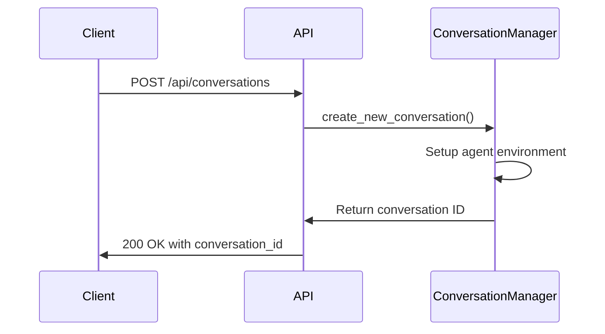

**Request Parameters**
- `repository`: Target repository URL or identifier
- `git_provider`: Git provider type (GitHub, GitLab, etc.)
- `selected_branch`: Repository branch to work on
- `initial_user_msg`: Initial prompt or task description
- `image_urls`: Optional image URLs for multimodal processing
- `replay_json`: Serialized conversation state for replay
- `suggested_task`: Predefined task template
- `create_microagent`: Microagent configuration
- `conversation_instructions`: Custom instructions for the agent
- `mcp_config`: MCP (Model Control Protocol) configuration

**Response**
```json
{
  "status": "ok",
  "conversation_id": "string",
  "conversation_status": "STARTING|RUNNING|STOPPED"
}
```

### Starting an Existing Conversation
The `/api/conversations/{conversation_id}/start` POST endpoint starts an agent loop for an existing conversation. This is used when resuming a previously created conversation.

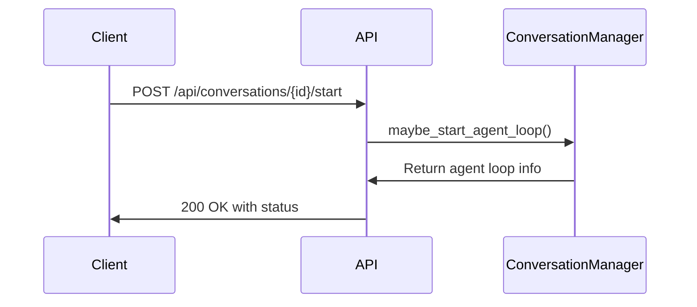

**Request Body**
```json
{
  "providers_set": ["github", "gitlab"]
}
```

**Response**
```json
{
  "status": "ok",
  "conversation_id": "string",
  "conversation_status": "STARTING|RUNNING|STOPPED",
  "message": "optional message"
}
```

### Stopping a Conversation
The `/api/conversations/{conversation_id}/stop` POST endpoint stops an active agent conversation.

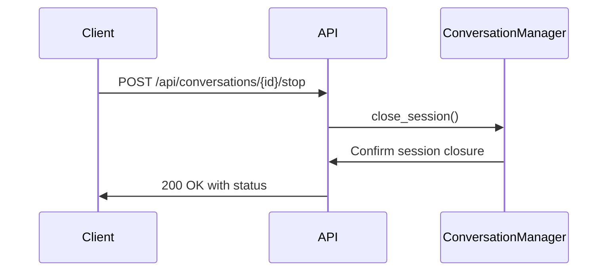

**Response**
```json
{
  "status": "ok",
  "conversation_id": "string",
  "message": "Conversation stopped successfully",
  "conversation_status": "STOPPED"
}
```

### Retrieving Conversation Information
The `/api/conversations/{conversation_id}` GET endpoint retrieves information about a specific conversation.

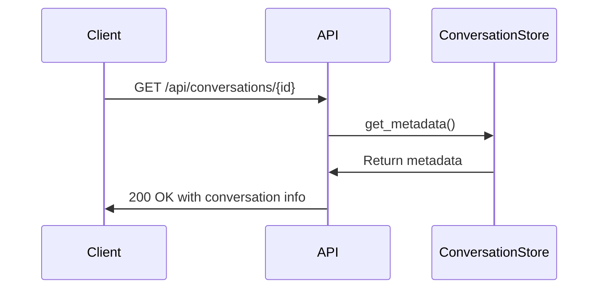

**Response**
```json
{
  "conversation_id": "string",
  "title": "string",
  "status": "STARTING|RUNNING|STOPPED",
  "runtime_status": "STATUS$STARTING_RUNTIME|STATUS$READY|STATUS$ERROR",
  "selected_repository": "string",
  "selected_branch": "string",
  "git_provider": "github|gitlab|bitbucket",
  "trigger": "GUI|SUGGESTED_TASK|MICROAGENT_MANAGEMENT|REMOTE_API_KEY",
  "num_connections": 0,
  "url": "string",
  "session_api_key": "string",
  "created_at": "datetime",
  "pr_number": [0]
}
```

**Diagram sources**
- [manage_conversations.py](file://openhands/server/routes/manage_conversations.py#L424-L457)
- [conversation_info.py](file://openhands/server/data_models/conversation_info.py#L1-L31)

**Section sources**
- [manage_conversations.py](file://openhands/server/routes/manage_conversations.py#L203-L711)

## WebSocket Event Streaming

### Connection Establishment
The WebSocket connection is established to receive real-time events from the agent. Clients connect to the WebSocket endpoint with the conversation ID and authentication parameters.

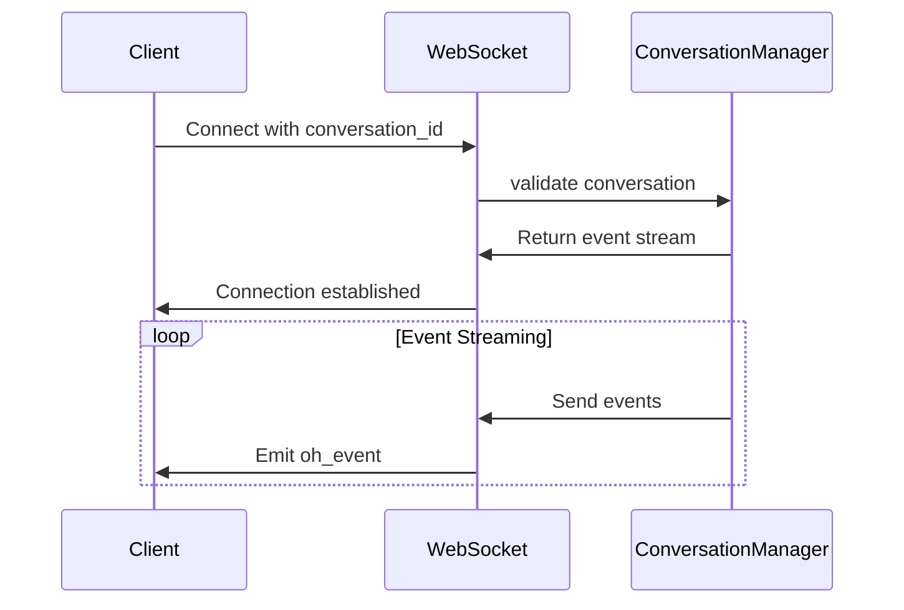

**Connection URL**
```
ws://localhost/events/socket?conversation_id={conversation_id}&latest_event_id={id}&session_api_key={key}
```

**Query Parameters**
- `conversation_id`: Required conversation identifier
- `latest_event_id`: Optional last received event ID for resuming
- `providers_set`: Comma-separated list of provider types
- `session_api_key`: Optional session API key for authentication

### Event Types
The WebSocket streams various event types representing agent actions, observations, and state changes.

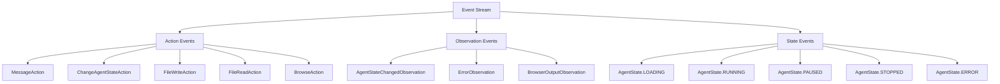

### Client Event Handling
Clients can send user actions through the WebSocket connection to interact with the agent.

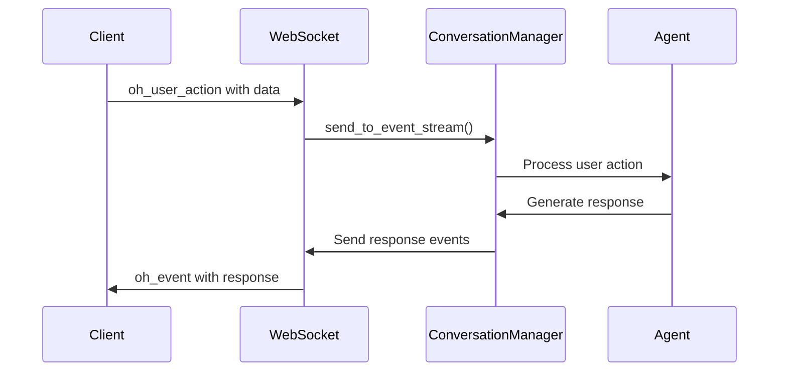

**Diagram sources**
- [listen_socket.py](file://openhands/server/listen_socket.py#L35-L168)
- [conversation_manager.py](file://openhands/server/conversation_manager/conversation_manager.py#L108-L113)

**Section sources**
- [listen_socket.py](file://openhands/server/listen_socket.py#L1-L169)

## Trajectory Retrieval

### Getting Conversation Trajectory
The `/api/conversations/{conversation_id}/trajectory` GET endpoint retrieves the complete event trajectory of a conversation.

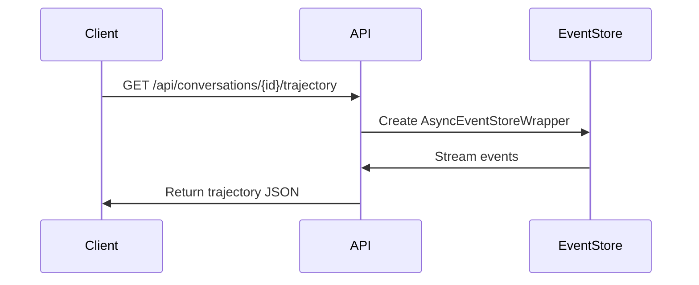

**Response**
```json
{
  "trajectory": [
    {
      "id": "string",
      "timestamp": "datetime",
      "source": "agent|user",
      "action": "string",
      "args": {},
      "observation": {}
    }
  ]
}
```

**Section sources**
- [trajectory.py](file://openhands/server/routes/trajectory.py#L1-L50)

## Data Models

### Conversation Information
The `ConversationInfo` data model represents metadata and status information for a conversation.

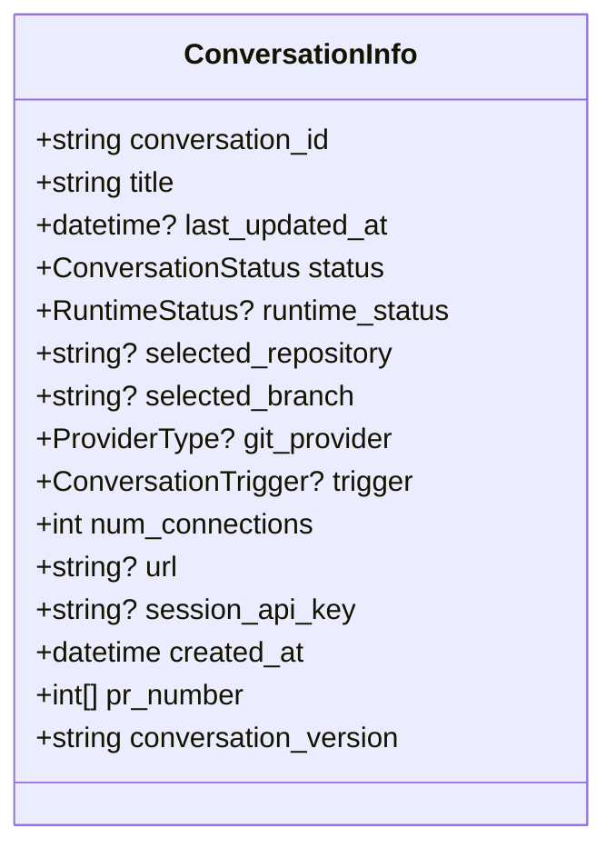

### Agent Loop Information
The `AgentLoopInfo` data model contains information about an active agent loop.

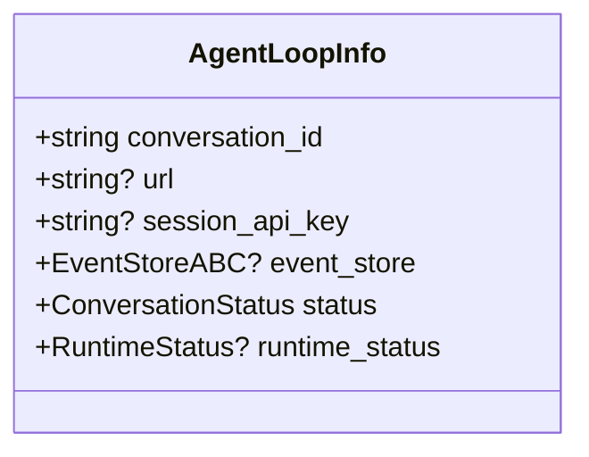

**Diagram sources**
- [conversation_info.py](file://openhands/server/data_models/conversation_info.py#L1-L31)
- [agent_loop_info.py](file://openhands/server/data_models/agent_loop_info.py#L1-L18)

**Section sources**
- [conversation_info.py](file://openhands/server/data_models/conversation_info.py#L1-L31)
- [agent_loop_info.py](file://openhands/server/data_models/agent_loop_info.py#L1-L18)

## Error Handling

### Common Error Responses
The API returns standardized error responses for various failure scenarios.

**Missing Settings Error**
```json
{
  "status": "error",
  "message": "LLM settings not found",
  "msg_id": "CONFIGURATION$SETTINGS_NOT_FOUND"
}
```

**LLM Authentication Error**
```json
{
  "status": "error",
  "message": "LLM authentication failed",
  "msg_id": "STATUS$ERROR_LLM_AUTHENTICATION"
}
```

**Conversation Not Found**
```json
{
  "status": "error",
  "conversation_id": "string",
  "message": "Conversation was not found"
}
```

### WebSocket Connection Errors
WebSocket connections may fail with specific error codes:

- `4001`: Invalid conversation_id in query params
- `4002`: Invalid session_api_key
- `4003`: Failed to access conversation events
- `4004`: Failed to join conversation

Clients should handle these errors by displaying appropriate messages and potentially retrying the connection.

**Section sources**
- [manage_conversations.py](file://openhands/server/routes/manage_conversations.py#L271-L289)
- [listen_socket.py](file://openhands/server/listen_socket.py#L60-L64)

## Connection Management

### Session Lifecycle
The system manages agent sessions with a well-defined lifecycle:

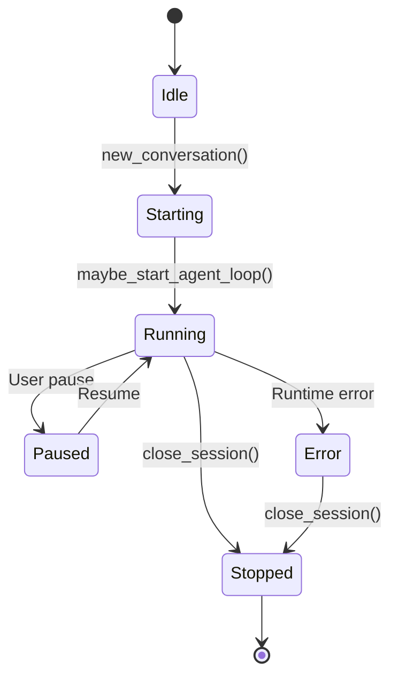

### Connection Recovery
The system supports connection recovery after temporary disconnections:

1. Clients maintain the last received event ID
2. On reconnection, clients pass the latest_event_id parameter
3. The server replays events from that point forward
4. This ensures no events are missed during brief disconnections

The system uses Socket.IO for underlying communication, which provides built-in support for connection interruption recovery.

**Section sources**
- [conversation_manager.py](file://openhands/server/conversation_manager/conversation_manager.py#L79-L82)
- [listen_socket.py](file://openhands/server/listen_socket.py#L94-L114)