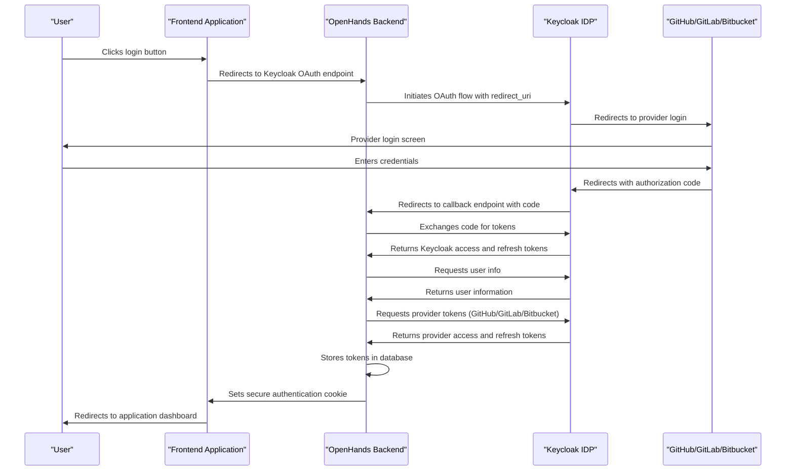
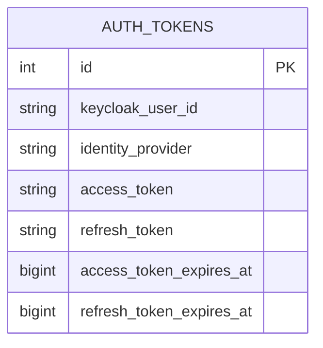
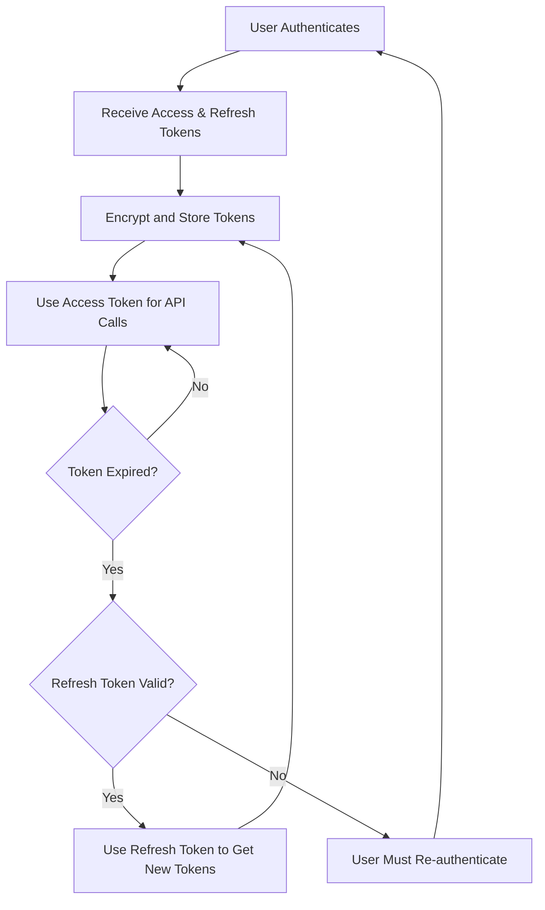
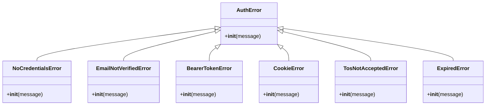
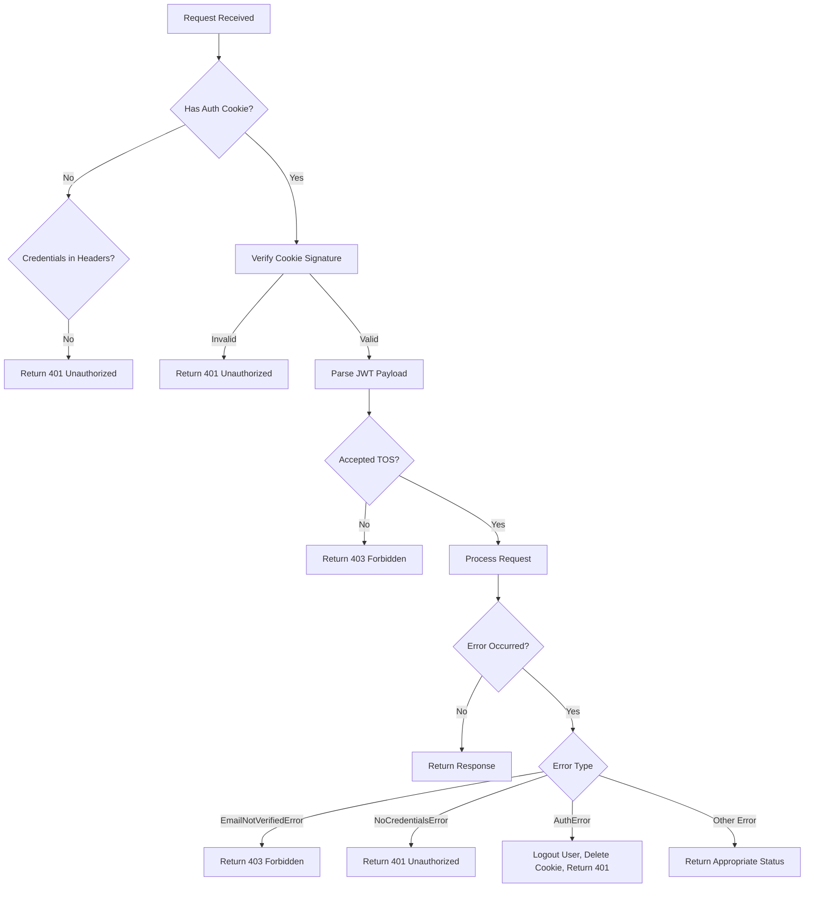
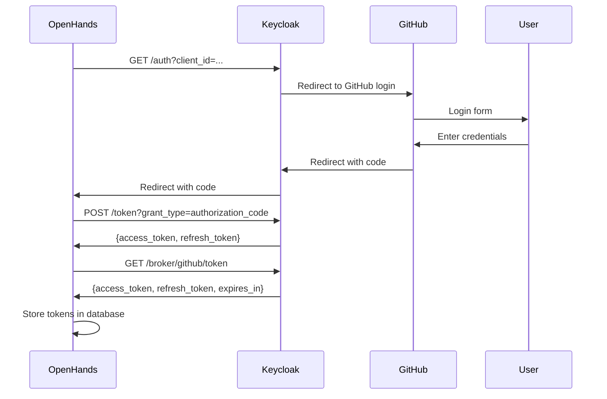
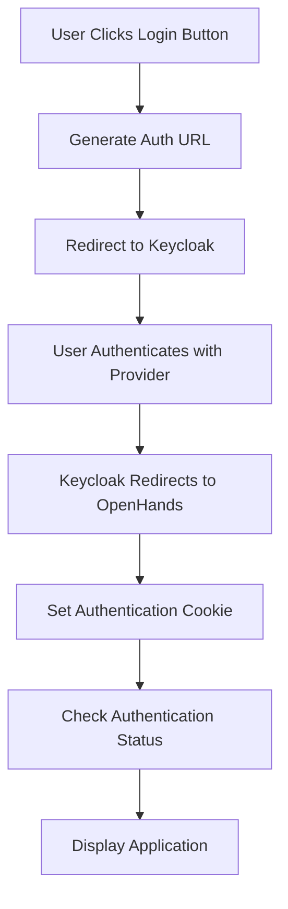
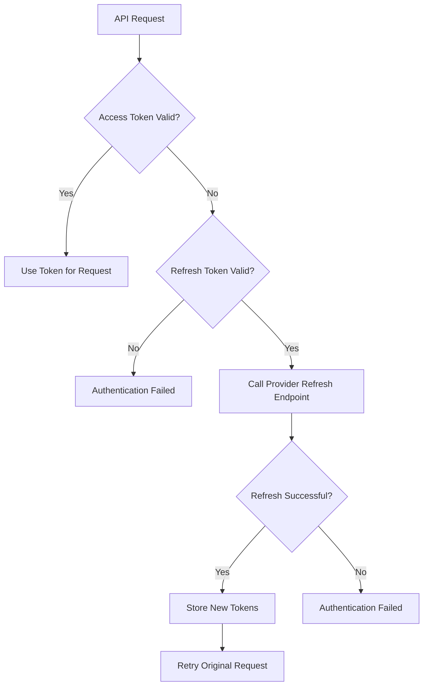

# Authentication API

<cite>
**Referenced Files in This Document**   
- [auth.py](file://enterprise/server/routes/auth.py)
- [token_manager.py](file://enterprise/server/auth/token_manager.py)
- [middleware.py](file://enterprise/server/middleware.py)
- [saas_user_auth.py](file://enterprise/server/auth/saas_user_auth.py)
- [auth_error.py](file://enterprise/server/auth/auth_error.py)
- [keycloak_manager.py](file://enterprise/server/auth/keycloak_manager.py)
- [auth_token_store.py](file://enterprise/storage/auth_token_store.py)
- [auth.types.ts](file://frontend/src/api/auth-service/auth.types.ts)
- [auth-service.api.ts](file://frontend/src/api/auth-service/auth-service.api.ts)
- [use-auth-url.ts](file://frontend/src/hooks/use-auth-url.ts)
- [generate-auth-url.ts](file://frontend/src/utils/generate-auth-url.ts)
</cite>

## Table of Contents
1. [Introduction](#introduction)
2. [Authentication Flow](#authentication-flow)
3. [API Endpoints](#api-endpoints)
4. [Token Management](#token-management)
5. [Security Considerations](#security-considerations)
6. [Error Handling](#error-handling)
7. [Integration with Keycloak](#integration-with-keycloak)
8. [Client Implementation](#client-implementation)
9. [Session Management](#session-management)
10. [Token Refresh Mechanism](#token-refresh-mechanism)

## Introduction

The OpenHands platform implements a comprehensive authentication system that supports OAuth integration with GitHub, GitLab, and Bitbucket through Keycloak as the identity provider. The authentication system is designed for the enterprise (SaaS) version of OpenHands, providing secure user authentication, token management, and session handling.

The authentication flow begins with OAuth authorization through Keycloak, which then communicates with the respective identity providers (GitHub, GitLab, or Bitbucket) to obtain access tokens. These tokens are securely stored and managed within the OpenHands backend, allowing the platform to interact with the user's repositories and perform actions on their behalf.

This documentation provides detailed specifications for all authentication endpoints, request/response formats, token handling mechanisms, and integration details with Keycloak for identity management.

**Section sources**
- [auth.py](file://enterprise/server/routes/auth.py#L1-L436)
- [README.md](file://enterprise/README.md#L29-L39)

## Authentication Flow

The authentication process in OpenHands follows the OAuth 2.0 authorization code flow, with Keycloak acting as the identity broker between OpenHands and the user's chosen identity provider (GitHub, GitLab, or Bitbucket).



**Diagram sources**
- [auth.py](file://enterprise/server/routes/auth.py#L98-L249)
- [token_manager.py](file://enterprise/server/auth/token_manager.py#L88-L110)
- [keycloak_manager.py](file://enterprise/server/auth/keycloak_manager.py#L21-L30)

## API Endpoints

### OAuth Callback Endpoint

The OAuth callback endpoint handles the authorization code returned by Keycloak after the user has authenticated with their chosen identity provider.

**Endpoint**: `GET /oauth/keycloak/callback`

**Request Parameters**:
- `code` (string, required): Authorization code provided by Keycloak
- `state` (string, optional): State parameter for CSRF protection and redirect preservation
- `error` (string, optional): Error code if authentication failed
- `error_description` (string, optional): Error description if authentication failed

**Success Response**:
```json
HTTP 302 Found
Location: {redirect_url}
Set-Cookie: keycloak_auth={signed_jwt_token}; HttpOnly; Secure; SameSite=Strict
```

**Error Responses**:
```json
HTTP 400 Bad Request
Content-Type: application/json
{
  "error": "Missing code in request params"
}
```

```json
HTTP 400 Bad Request
Content-Type: application/json
{
  "error": "Problem retrieving Keycloak tokens"
}
```

```json
HTTP 400 Bad Request
Content-Type: application/json
{
  "error": "Missing user ID or username in response"
}
```

```json
HTTP 401 Unauthorized
Content-Type: application/json
{
  "error": "Not authorized via waitlist"
}
```

**Authentication**: None (this is the callback endpoint)

**Notes**:
- The endpoint extracts the redirect URL from the `state` parameter or uses the base URL if not provided
- After successful authentication, the user is redirected to the original application URL
- A secure JWT cookie is set containing the Keycloak access and refresh tokens
- If the user has not accepted the Terms of Service, they are redirected to the TOS acceptance page

**Section sources**
- [auth.py](file://enterprise/server/routes/auth.py#L98-L249)

### Authenticate Endpoint

The authenticate endpoint verifies whether a user is currently authenticated with the system.

**Endpoint**: `POST /api/authenticate`

**Request Headers**:
- `Cookie` (optional): `keycloak_auth` cookie containing the authentication token
- `Authorization` (optional): Bearer token for API authentication

**Success Response**:
```json
HTTP 200 OK
Content-Type: application/json
{
  "message": "User authenticated"
}
```

**Error Response**:
```json
HTTP 401 Unauthorized
Content-Type: application/json
{
  "error": "User is not authenticated"
}
```

**Authentication**: Required (via cookie or Authorization header)

**Notes**:
- This endpoint is used by the frontend to check the user's authentication status
- If authentication fails, the authentication cookie is cleared
- The endpoint supports both cookie-based and bearer token authentication methods

**Section sources**
- [auth.py](file://enterprise/server/routes/auth.py#L296-L319)

### Accept Terms of Service Endpoint

The accept_tos endpoint handles the acceptance of the Terms of Service by the user.

**Endpoint**: `POST /api/accept_tos`

**Request Headers**:
- `Cookie`: `keycloak_auth` cookie containing the authentication token

**Request Body**:
```json
{
  "redirect_url": "string"
}
```

**Success Response**:
```json
HTTP 200 OK
Content-Type: application/json
{
  "redirect_url": "{redirect_url}"
}
Set-Cookie: keycloak_auth={updated_jwt_token}; HttpOnly; Secure; SameSite=Strict
```

**Error Response**:
```json
HTTP 401 Unauthorized
Content-Type: application/json
{
  "error": "User is not authenticated"
}
```

**Authentication**: Required (via cookie)

**Notes**:
- The endpoint updates the user's settings to record TOS acceptance
- A new authentication cookie is set with the `accepted_tos` flag set to true
- The user is redirected to the specified URL after accepting the TOS

**Section sources**
- [auth.py](file://enterprise/server/routes/auth.py#L322-L378)

### Logout Endpoint

The logout endpoint terminates the user's session and clears authentication data.

**Endpoint**: `POST /api/logout`

**Request Headers**:
- `Cookie` (optional): `keycloak_auth` cookie containing the authentication token

**Success Response**:
```json
HTTP 200 OK
Content-Type: application/json
{
  "message": "User logged out"
}
Set-Cookie: keycloak_auth=; HttpOnly; Secure; SameSite=Strict; Max-Age=0
```

**Authentication**: Optional (performs additional cleanup if authenticated)

**Notes**:
- The endpoint always clears the authentication cookie
- If the user is authenticated, their refresh token is invalidated with Keycloak
- The response ensures the authentication cookie is deleted regardless of the logout success

**Section sources**
- [auth.py](file://enterprise/server/routes/auth.py#L381-L407)

### Refresh Tokens Endpoint

The refresh-tokens endpoint returns the latest token for a specific provider.

**Endpoint**: `GET /api/refresh-tokens`

**Request Headers**:
- `X-Session-API-Key` (required): Session API key for authentication
- `Cookie` (required): `keycloak_auth` cookie containing the authentication token

**Query Parameters**:
- `provider` (string, required): Provider type (github, gitlab, bitbucket)
- `sid` (string, required): Session ID

**Success Response**:
```json
HTTP 200 OK
Content-Type: application/json
{
  "token": "{provider_access_token}"
}
```

**Error Responses**:
```json
HTTP 403 Forbidden
Content-Type: application/json
{
  "detail": "Forbidden"
}
```

```json
HTTP 404 Not Found
Content-Type: application/json
{
  "detail": "No token found for provider '{provider}'"
}
```

**Authentication**: Required (via cookie and X-Session-API-Key header)

**Notes**:
- The endpoint validates the session API key against the user's session
- It retrieves the latest provider token, refreshing it if necessary
- This endpoint is used to ensure the agent has valid tokens for repository operations

**Section sources**
- [auth.py](file://enterprise/server/routes/auth.py#L410-L435)

## Token Management

The OpenHands platform implements a comprehensive token management system that securely stores and handles authentication tokens for various identity providers.

### Token Storage

Authentication tokens are stored in the database using encryption to protect sensitive information. The `auth_tokens` table contains the following fields:



**Diagram sources**
- [auth_token_store.py](file://enterprise/storage/auth_token_store.py#L23-L34)
- [021_create_auth_tokens_table.py](file://enterprise/migrations/versions/021_create_auth_tokens_table.py#L22-L30)

The token storage system uses Fernet encryption with a key derived from the JWT secret to encrypt token values before storing them in the database. This ensures that even if the database is compromised, the tokens cannot be easily extracted.

### Token Encryption

Tokens are encrypted using a Fernet utility that creates a 32-byte key from the JWT secret:

```python
def create_encryption_utility(secret_key: bytes):
    """Creates an encryption utility using a 32-byte secret key."""
    fernet_key = b64encode(hashlib.sha256(secret_key).digest())
    f = Fernet(fernet_key)
    
    def encrypt_text(text: str) -> str:
        return f.encrypt(text.encode()).decode()
        
    def decrypt_text(encrypted_text: str) -> str:
        return f.decrypt(encrypted_text.encode()).decode()
        
    return encrypt_text, decrypt_text
```

**Section sources**
- [token_manager.py](file://enterprise/server/auth/token_manager.py#L46-L74)

### Token Lifecycle

The token lifecycle in OpenHands follows these steps:

1. **Initial Authentication**: When a user first authenticates, Keycloak returns access and refresh tokens
2. **Token Storage**: The tokens are encrypted and stored in the database
3. **Token Usage**: When the application needs to access a provider API, it retrieves the token from storage
4. **Token Refresh**: Before a token expires, it is automatically refreshed using the refresh token
5. **Token Expiration**: When both access and refresh tokens have expired, the user must re-authenticate



**Diagram sources**
- [token_manager.py](file://enterprise/server/auth/token_manager.py#L288-L327)
- [saas_user_auth.py](file://enterprise/server/auth/saas_user_auth.py#L134-L136)

## Security Considerations

The OpenHands authentication system implements multiple security measures to protect user data and prevent unauthorized access.

### Secure Token Storage

All authentication tokens are encrypted before being stored in the database using Fernet encryption. The encryption key is derived from the JWT secret, which is configured in the application settings. This ensures that tokens cannot be easily accessed even if the database is compromised.

### HTTP Security Headers

Authentication cookies are set with security-focused attributes:
- `HttpOnly`: Prevents client-side scripts from accessing the cookie
- `Secure`: Ensures the cookie is only sent over HTTPS connections (except for localhost)
- `SameSite`: Set to 'strict' in production and 'lax' in development/staging to prevent CSRF attacks

### Token Validation

All tokens are validated before use:
- JWT tokens are verified using the configured secret key
- Access tokens are checked for expiration before use
- Refresh tokens are validated with Keycloak when necessary

### Rate Limiting

The authentication system implements rate limiting to prevent brute force attacks:
- A Redis-based rate limiter is configured with limits of 10 requests per second and 100 requests per minute
- Rate limiting is applied to authentication attempts to prevent credential stuffing attacks

```python
rate_limiter: RateLimiter = create_redis_rate_limiter('10/second; 100/minute')
```

**Section sources**
- [middleware.py](file://enterprise/server/middleware.py#L19-L20)
- [saas_user_auth.py](file://enterprise/server/auth/saas_user_auth.py#L40)
- [auth.py](file://enterprise/server/routes/auth.py#L31-L32)

### Secure Cookie Handling

The authentication cookie (`keycloak_auth`) contains a signed JWT with the following claims:
- `access_token`: Keycloak access token
- `refresh_token`: Keycloak refresh token
- `accepted_tos`: Boolean indicating whether the user has accepted the Terms of Service

The cookie is signed using the JWT secret to prevent tampering. The signature is verified on each request to ensure the cookie has not been modified.

### Environment-Specific Security

Security settings are adjusted based on the environment:
- On localhost, cookies are set with `Secure=False` to allow HTTP connections
- On production domains, cookies are set with `Secure=True` to require HTTPS
- SameSite policy is set to 'lax' for localhost and staging environments, and 'strict' for production

**Section sources**
- [auth.py](file://enterprise/server/routes/auth.py#L59-L76)
- [middleware.py](file://enterprise/server/middleware.py#L89-L95)

## Error Handling

The authentication system implements comprehensive error handling to provide meaningful feedback while maintaining security.

### Authentication Error Types

The system defines several error types that extend the base `AuthError` class:



**Diagram sources**
- [auth_error.py](file://enterprise/server/auth/auth_error.py#L1-L41)

### Error Response Format

All authentication errors return a standardized JSON response:

```json
{
  "error": "Error description"
}
```

With appropriate HTTP status codes:
- `401 Unauthorized`: Authentication failed or credentials missing
- `403 Forbidden`: Authorized but forbidden action (e.g., email not verified)
- `400 Bad Request`: Invalid request parameters

### Error Handling Flow

The middleware implements a comprehensive error handling flow:



**Diagram sources**
- [middleware.py](file://enterprise/server/middleware.py#L32-L97)
- [auth_error.py](file://enterprise/server/auth/auth_error.py#L1-L41)

### Specific Error Scenarios

#### Invalid Cookie
When an invalid authentication cookie is detected, the system returns a 401 Unauthorized response and deletes the cookie to prevent repeated failed attempts.

#### Expired Tokens
When tokens have expired, the system attempts to refresh them using the refresh token. If the refresh token is also expired, the user is logged out and must re-authenticate.

#### Missing TOS Acceptance
Users who have not accepted the Terms of Service are blocked from most API endpoints until they accept the TOS, at which point they are redirected to the acceptance page.

**Section sources**
- [middleware.py](file://enterprise/server/middleware.py#L146-L148)
- [auth.py](file://enterprise/server/routes/auth.py#L227-L232)

## Integration with Keycloak

OpenHands integrates with Keycloak as the identity provider to manage user authentication and token exchange.

### Keycloak Configuration

The integration is configured with the following constants:

```python
KEYCLOAK_SERVER_URL = "https://auth.staging.all-hands.dev"
KEYCLOAK_SERVER_URL_EXT = "https://auth.staging.all-hands.dev"
KEYCLOAK_REALM_NAME = "openhands"
KEYCLOAK_CLIENT_ID = "openhands-frontend"
KEYCLOAK_CLIENT_SECRET = config.keycloak_client_secret
KEYCLOAK_ADMIN_PASSWORD = config.keycloak_admin_password
```

**Section sources**
- [constants.py](file://enterprise/server/auth/constants.py)

### Keycloak Client Implementation

The system uses the `python-keycloak` library to interact with Keycloak:

```python
def get_keycloak_openid(external=False) -> KeycloakOpenID:
    """Returns a singleton instance of KeycloakOpenID based on the 'external' flag."""
    if external not in _keycloak_instances:
        _keycloak_instances[external] = KeycloakOpenID(
            server_url=KEYCLOAK_SERVER_URL_EXT if external else KEYCLOAK_SERVER_URL,
            realm_name=KEYCLOAK_REALM_NAME,
            client_id=KEYCLOAK_CLIENT_ID,
            client_secret_key=KEYCLOAK_CLIENT_SECRET,
        )
    return _keycloak_instances[external]
```

**Section sources**
- [keycloak_manager.py](file://enterprise/server/auth/keycloak_manager.py#L21-L30)

### Token Exchange Flow

The token exchange process between OpenHands and Keycloak follows these steps:

1. OpenHands redirects the user to Keycloak's authorization endpoint
2. Keycloak authenticates the user with the selected identity provider
3. Keycloak redirects back to OpenHands with an authorization code
4. OpenHands exchanges the code for Keycloak tokens (access and refresh)
5. OpenHands requests the provider tokens (GitHub/GitLab/Bitbucket) from Keycloak
6. OpenHands stores the provider tokens in its database



**Diagram sources**
- [token_manager.py](file://enterprise/server/auth/token_manager.py#L88-L110)
- [auth.py](file://enterprise/server/routes/auth.py#L122-L130)

### User Information Retrieval

After authentication, OpenHands retrieves user information from Keycloak:

```python
async def get_user_info(self, access_token: str) -> dict:
    """Get user information from Keycloak."""
    if not access_token:
        return {}
    user_info = await get_keycloak_openid(self.external).a_userinfo(access_token)
    return user_info
```

The user information includes:
- `sub`: User ID
- `preferred_username`: Username
- `email`: Email address
- `email_verified`: Email verification status
- Provider-specific IDs (e.g., `github_id`)

**Section sources**
- [token_manager.py](file://enterprise/server/auth/token_manager.py#L140-L144)

## Client Implementation

The frontend implementation of the authentication system provides a seamless user experience while maintaining security.

### Authentication Service

The frontend uses an `AuthService` class to handle all authentication-related API calls:

```typescript
class AuthService {
  static async authenticate(
    appMode: GetConfigResponse["APP_MODE"],
  ): Promise<boolean> {
    if (appMode === "oss") return true;
    await openHands.post<AuthenticateResponse>("/api/authenticate");
    return true;
  }

  static async getGitHubAccessToken(
    code: string,
  ): Promise<GitHubAccessTokenResponse> {
    const { data } = await openHands.post<GitHubAccessTokenResponse>(
      "/api/keycloak/callback",
      {
        code,
      },
    );
    return data;
  }

  static async logout(appMode: GetConfigResponse["APP_MODE"]): Promise<void> {
    const endpoint =
      appMode === "saas" ? "/api/logout" : "/api/unset-provider-tokens";
    await openHands.post(endpoint);
  }
}
```

**Section sources**
- [auth-service.api.ts](file://frontend/src/api/auth-service/auth-service.api.ts#L8-L51)
- [auth.types.ts](file://frontend/src/api/auth-service/auth.types.ts#L1-L8)

### Authentication URL Generation

The frontend generates authentication URLs based on the current environment:

```typescript
export const generateAuthUrl = (
  identityProvider: string,
  requestUrl: URL,
  authUrl?: string,
) => {
  const protocol =
    requestUrl.hostname === "localhost" ? requestUrl.protocol : "https:";
  const redirectUri = `${protocol}//${requestUrl.host}/oauth/keycloak/callback`;

  let finalAuthUrl: string;

  if (authUrl) {
    finalAuthUrl = `https://${authUrl.replace(/^https?:\/\//, "")}`;
  } else {
    finalAuthUrl = requestUrl.hostname
      .replace(/(^|\.)staging\.all-hands\.dev$/, "$1auth.staging.all-hands.dev")
      .replace(/(^|\.)app\.all-hands\.dev$/, "auth.app.all-hands.dev")
      .replace(/(^|\.)localhost$/, "auth.staging.all-hands.dev");

    if (
      finalAuthUrl === requestUrl.hostname &&
      requestUrl.hostname !== "localhost"
    ) {
      finalAuthUrl = `auth.${requestUrl.hostname}`;
    }

    finalAuthUrl = `https://${finalAuthUrl}`;
  }
  
  return `${finalAuthUrl}/realms/openhands/protocol/openid-connect/auth?client_id=openhands-frontend&response_type=code&scope=openid&redirect_uri=${encodeURIComponent(redirectUri)}&kc_idp_hint=${identityProvider}`;
};
```

**Section sources**
- [generate-auth-url.ts](file://frontend/src/utils/generate-auth-url.ts#L1-L37)
- [use-auth-url.ts](file://frontend/src/hooks/use-auth-url.ts#L1-L20)

### Authentication Flow in UI

The authentication flow in the user interface:

1. User clicks a login button (GitHub, GitLab, or Bitbucket)
2. The application generates the appropriate authentication URL
3. The user is redirected to Keycloak for authentication
4. After successful authentication, Keycloak redirects back to OpenHands
5. The frontend checks authentication status and displays the application



**Diagram sources**
- [auth-modal.tsx](file://frontend/src/components/features/waitlist/auth-modal.tsx#L48-L74)
- [use-auth-url.ts](file://frontend/src/hooks/use-auth-url.ts#L10-L20)

## Session Management

The OpenHands platform implements robust session management to maintain user state across requests.

### Session Authentication

The system supports multiple authentication methods:

1. **Cookie-based authentication**: For browser-based interactions
2. **Bearer token authentication**: For API clients and programmatic access
3. **Session API key authentication**: For nested runtime environments

The authentication middleware checks for credentials in the following order:
1. Authentication cookie (`keycloak_auth`)
2. Authorization header (Bearer token)
3. X-Session-API-Key header (for nested runtimes)

```python
def _check_tos(self, request: Request):
    keycloak_auth_cookie = request.cookies.get('keycloak_auth')
    auth_header = request.headers.get('Authorization')
    mcp_auth_header = request.headers.get('X-Session-API-Key')
    
    if (keycloak_auth_cookie is None and 
        (auth_header is None or not auth_header.startswith('Bearer ')) and 
        mcp_auth_header is None):
        raise NoCredentialsError
```

**Section sources**
- [middleware.py](file://enterprise/server/middleware.py#L103-L112)

### Session Persistence

User sessions are persisted using a secure JWT cookie that contains:
- Keycloak access token
- Keycloak refresh token
- TOS acceptance status

The cookie is signed with the JWT secret to prevent tampering and is set with appropriate security flags (HttpOnly, Secure, SameSite).

### Session Expiration

Sessions have multiple expiration mechanisms:
- **Access token expiration**: Typically short-lived (1 hour)
- **Refresh token expiration**: Longer-lived (30 days)
- **Offline token expiration**: Used for background operations

When tokens expire, the system automatically refreshes them using the refresh token. If the refresh token has also expired, the user must re-authenticate.

### Session Validation

On each request, the system validates the session:
1. Verifies the JWT signature of the authentication cookie
2. Checks if the access token is expired
3. Refreshes tokens if necessary
4. Updates the authentication cookie if tokens were refreshed

```python
async def __call__(self, request: Request, call_next: Callable):
    keycloak_auth_cookie = request.cookies.get('keycloak_auth')
    try:
        if self._should_attach(request):
            self._check_tos(request)
            
        response: Response = await call_next(request)
        
        # If token was refreshed, update the cookie
        if keycloak_auth_cookie and user_auth.refreshed:
            set_response_cookie(
                request=request,
                response=response,
                keycloak_access_token=user_auth.access_token.get_secret_value(),
                keycloak_refresh_token=user_auth.refresh_token.get_secret_value(),
                secure=False if request.url.hostname == 'localhost' else True,
                accepted_tos=user_auth.accepted_tos,
            )
```

**Section sources**
- [middleware.py](file://enterprise/server/middleware.py#L32-L53)

## Token Refresh Mechanism

The OpenHands platform implements an automatic token refresh mechanism to ensure uninterrupted service.

### Refresh Trigger

Tokens are refreshed automatically when:
- An access token is about to expire (within 10 minutes)
- An API request is made with an expired access token
- The system detects that a token has expired

The refresh process is transparent to the user and happens automatically in the background.

### Refresh Flow



**Diagram sources**
- [token_manager.py](file://enterprise/server/auth/token_manager.py#L288-L327)
- [saas_user_auth.py](file://enterprise/server/auth/saas_user_auth.py#L70-L78)

### Provider-Specific Refresh

Different providers have different token refresh endpoints:

**GitHub**:
```python
async def _refresh_github_token(self, refresh_token: str) -> dict[str, str | int]:
    url = 'https://github.com/login/oauth/access_token'
    payload = {
        'client_id': GITHUB_APP_CLIENT_ID,
        'client_secret': GITHUB_APP_CLIENT_SECRET,
        'refresh_token': refresh_token,
        'grant_type': 'refresh_token',
    }
    # POST request to GitHub token endpoint
```

**GitLab**:
```python
async def _refresh_gitlab_token(self, refresh_token: str) -> dict[str, str | int]:
    url = 'https://gitlab.com/oauth/token'
    payload = {
        'client_id': GITLAB_APP_CLIENT_ID,
        'client_secret': GITLAB_APP_CLIENT_SECRET,
        'refresh_token': refresh_token,
        'grant_type': 'refresh_token',
    }
    # POST request to GitLab token endpoint
```

**Bitbucket**:
```python
async def _refresh_bitbucket_token(self, refresh_token: str) -> dict[str, str | int]:
    url = 'https://bitbucket.org/site/oauth2/access_token'
    auth = base64.b64encode(
        f'{BITBUCKET_APP_CLIENT_ID}:{BITBUCKET_APP_CLIENT_SECRET}'.encode()
    ).decode()
    headers = {
        'Authorization': f'Basic {auth}',
        'Content-Type': 'application/x-www-form-urlencoded',
    }
    data = {
        'grant_type': 'refresh_token',
        'refresh_token': refresh_token,
    }
    # POST request to Bitbucket token endpoint
```

**Section sources**
- [token_manager.py](file://enterprise/server/auth/token_manager.py#L342-L412)

### Refresh Error Handling

The system implements robust error handling for token refresh operations:

1. **Retry mechanism**: Failed refresh attempts are retried up to 2 times
2. **Error logging**: All refresh errors are logged for monitoring
3. **Graceful degradation**: If refresh fails, the system falls back to requiring re-authentication

```python
@retry(
    stop=stop_after_attempt(2),
    retry=retry_if_exception_type(KeycloakConnectionError),
    before_sleep=_before_sleep_callback,
)
async def store_idp_tokens(
    self,
    idp: ProviderType,
    user_id: str,
    keycloak_access_token: str,
):
    # Implementation with retry logic
```

**Section sources**
- [token_manager.py](file://enterprise/server/auth/token_manager.py#L146-L150)
- [token_manager.py](file://enterprise/server/auth/token_manager.py#L244-L247)

### Background Token Refresh

For background operations, the system uses offline tokens that can be refreshed without user interaction:

```python
async def get_idp_token_from_offline_token(
    self, offline_token: str, idp: ProviderType
) -> str:
    tokens = await get_keycloak_openid(self.external).a_refresh_token(
        offline_token
    )
    return await self.get_idp_token(tokens['access_token'], idp)
```

This allows the system to perform operations like repository synchronization even when the user is not actively using the application.

**Section sources**
- [token_manager.py](file://enterprise/server/auth/token_manager.py#L447-L456)