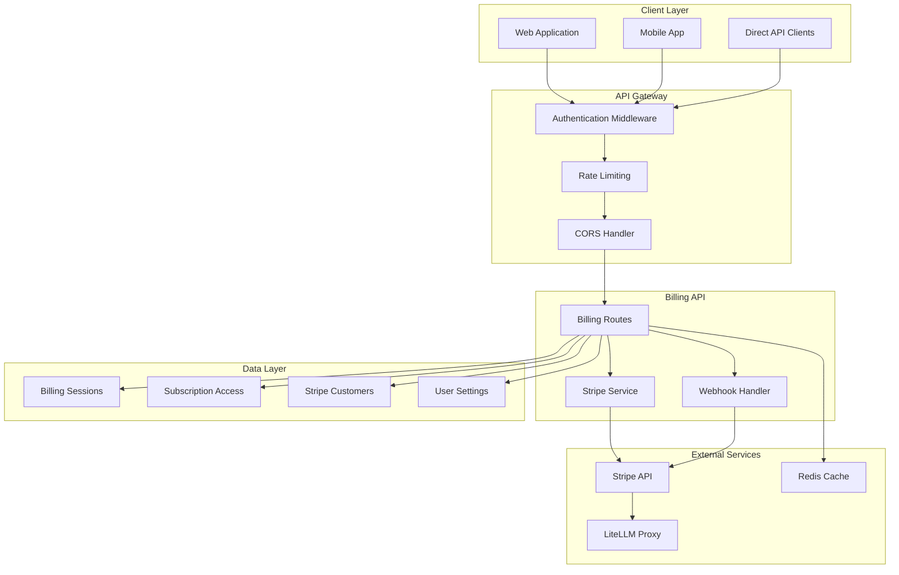
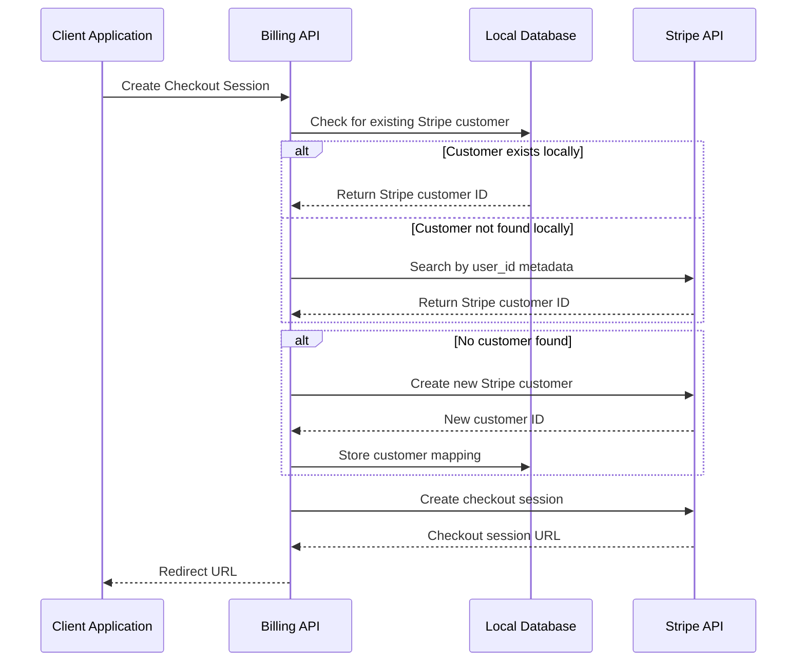
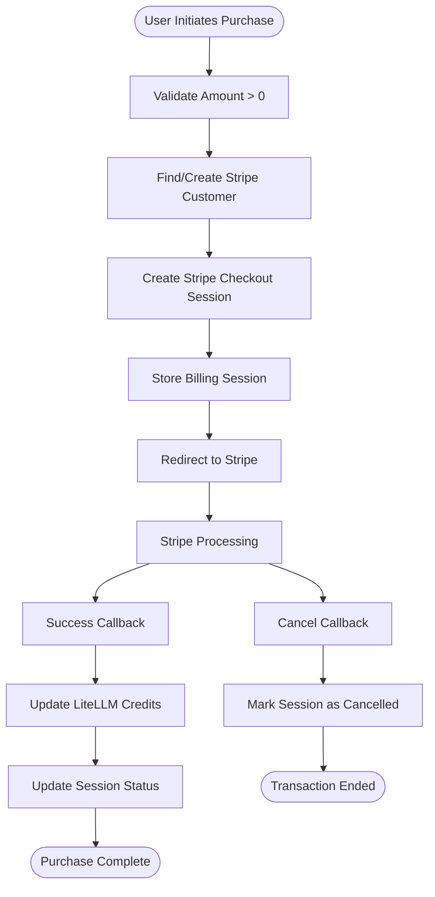
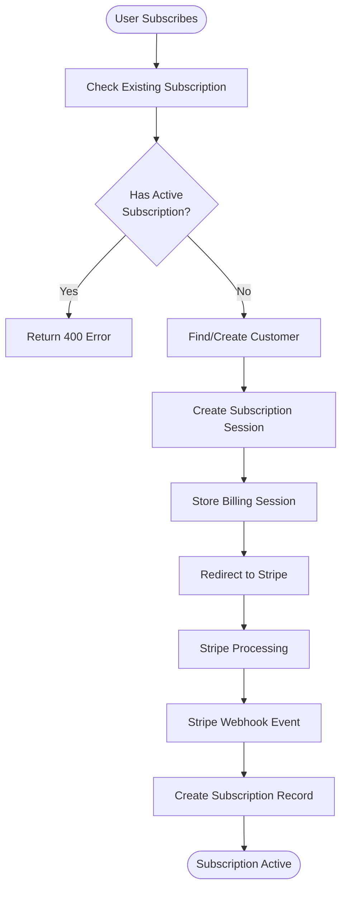
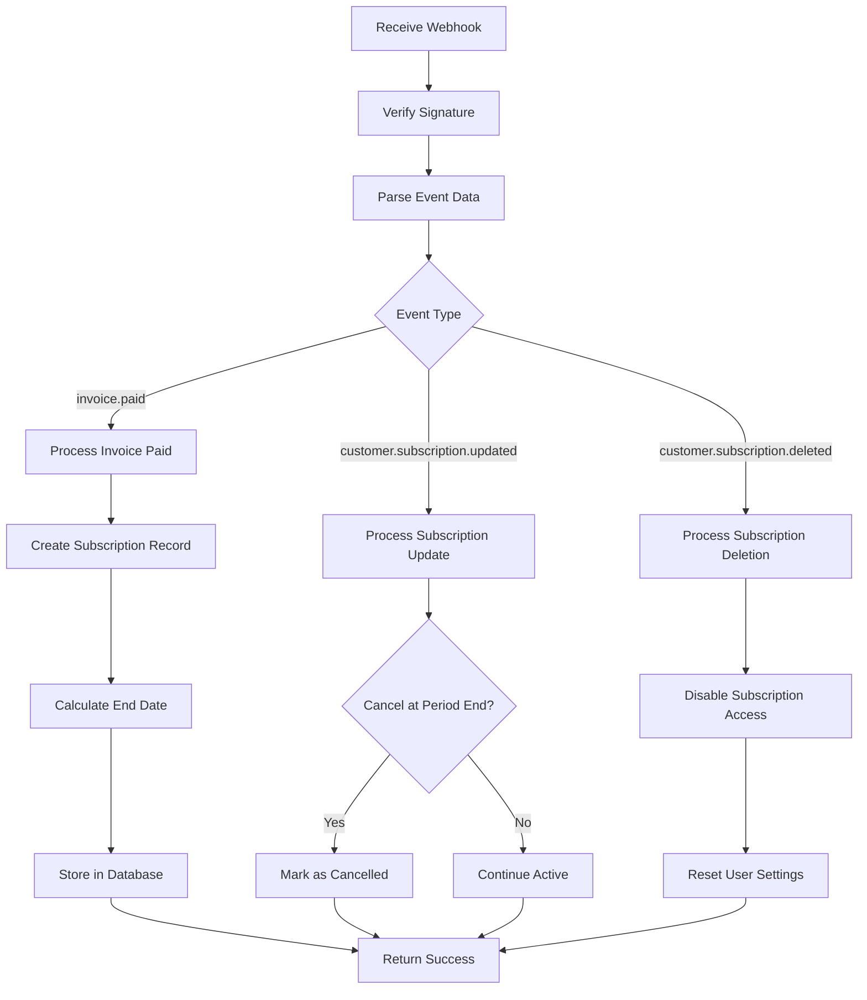
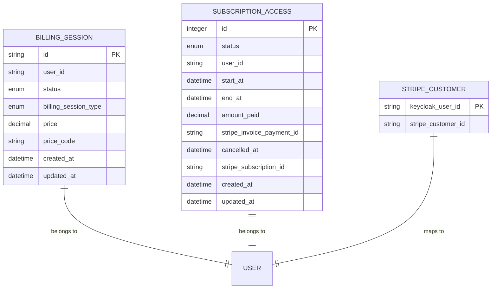
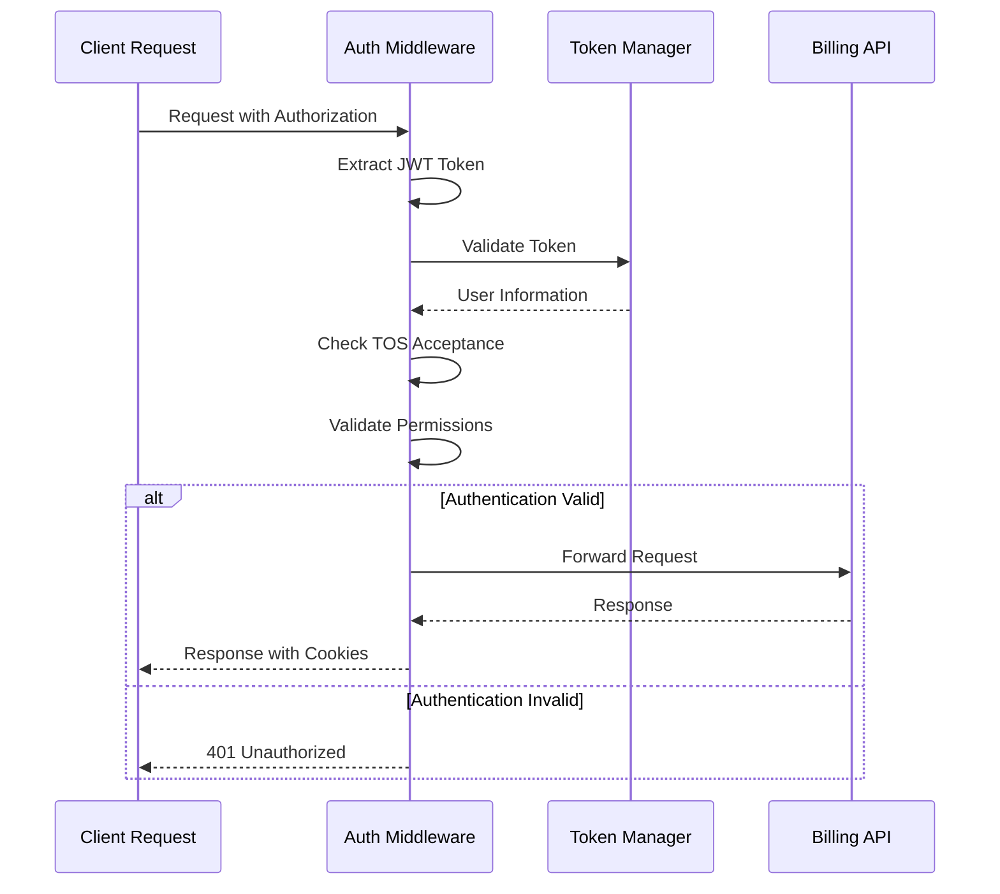
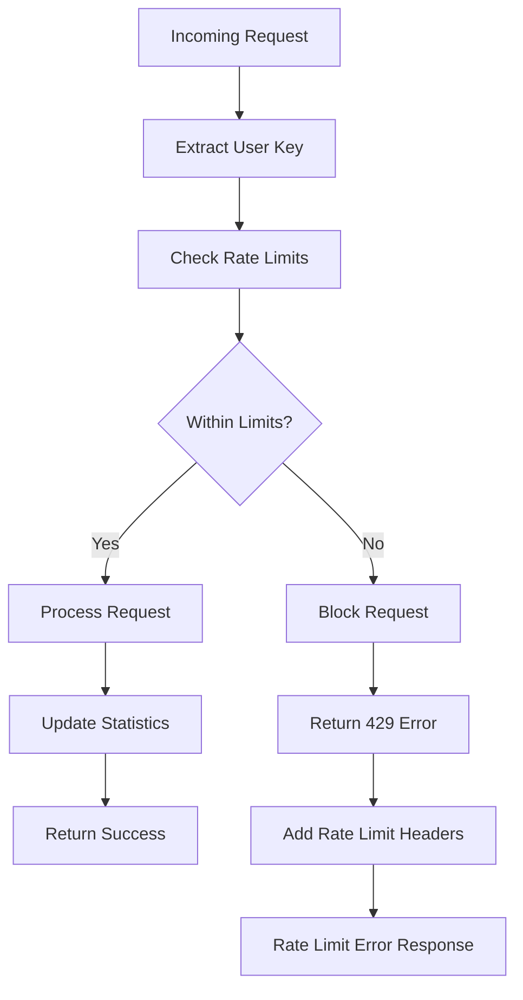

# Billing API Documentation

<cite>
**Referenced Files in This Document**
- [billing.py](file://enterprise/server/routes/billing.py)
- [stripe_service.py](file://enterprise/integrations/stripe_service.py)
- [billing_session.py](file://enterprise/storage/billing_session.py)
- [subscription_access.py](file://enterprise/storage/subscription_access.py)
- [subscription_access_status.py](file://enterprise/storage/subscription_access_status.py)
- [billing_session_type.py](file://enterprise/storage/billing_session_type.py)
- [constants.py](file://enterprise/server/constants.py)
- [rate_limit.py](file://enterprise/server/rate_limit.py)
- [middleware.py](file://enterprise/server/middleware.py)
- [event_webhook.py](file://enterprise/server/routes/event_webhook.py)
- [billing-service.api.ts](file://frontend/src/api/billing-service/billing-service.api.ts)
- [billing.types.ts](file://frontend/src/api/billing-service/billing.types.ts)
- [payment-form.tsx](file://frontend/src/components/features/payment/payment-form.tsx)
- [use-create-stripe-checkout-session.ts](file://frontend/src/hooks/mutation/stripe/use-create-stripe-checkout-session.ts)
- [use-create-subscription-checkout-session.ts](file://frontend/src/hooks/mutation/stripe/use-create-subscription-checkout-session.ts)
- [use-cancel-subscription.ts](file://frontend/src/hooks/mutation/use-cancel-subscription.ts)
- [use-balance.ts](file://frontend/src/hooks/query/use-balance.ts)
- [billing-handlers.ts](file://frontend/src/mocks/billing-handlers.ts)
</cite>

## Table of Contents
1. [Introduction](#introduction)
2. [System Architecture](#system-architecture)
3. [Core API Endpoints](#core-api-endpoints)
4. [Stripe Integration](#stripe-integration)
5. [Webhook Endpoints](#webhook-endpoints)
6. [Data Models](#data-models)
7. [Authentication & Security](#authentication--security)
8. [Rate Limiting Strategy](#rate-limiting-strategy)
9. [Client Implementation Examples](#client-implementation-examples)
10. [Error Handling](#error-handling)
11. [Edge Cases](#edge-cases)
12. [Testing & Mocking](#testing--mocking)

## Introduction

The OpenHands Billing API provides comprehensive payment processing capabilities for credit purchases and subscription management through Stripe integration. The system supports both one-time payments for credits and recurring monthly subscriptions, with robust error handling, webhook processing, and real-time balance tracking.

The billing system is built on a microservices architecture with dedicated endpoints for payment flows, subscription management, and webhook processing. It integrates seamlessly with the LiteLLM proxy for credit calculations and maintains strict security standards for payment data handling.

## System Architecture



**Diagram sources**
- [billing.py](file://enterprise/server/routes/billing.py#L1-L50)
- [stripe_service.py](file://enterprise/integrations/stripe_service.py#L1-L74)
- [middleware.py](file://enterprise/server/middleware.py#L1-L175)

## Core API Endpoints

### Credit Management Endpoints

#### GET /api/billing/credits
Retrieves the user's current credit balance from the LiteLLM proxy.

**Request Headers:**
- `Authorization: Bearer <access_token>`
- `Content-Type: application/json`

**Response Format:**
```json
{
  "credits": "150.00"
}
```

**Implementation Details:**
- Queries LiteLLM proxy for user credit information
- Calculates remaining credits based on max_budget - spend
- Returns balance as decimal string with 2 decimal places

**Section sources**
- [billing.py](file://enterprise/server/routes/billing.py#L76-L85)

#### POST /api/billing/create-checkout-session
Creates a Stripe checkout session for purchasing credits.

**Request Body:**
```json
{
  "amount": 25
}
```

**Response Format:**
```json
{
  "redirect_url": "https://checkout.stripe.com/session_id"
}
```

**Implementation Details:**
- Creates Stripe checkout session with card payment method
- Enables payment method saving for future transactions
- Sets up success and cancel URLs with session ID parameters
- Stores billing session in database for tracking

**Section sources**
- [billing.py](file://enterprise/server/routes/billing.py#L210-L262)

### Subscription Management Endpoints

#### GET /api/billing/subscription-access
Retrieves the user's current active subscription information.

**Response Format:**
```json
{
  "start_at": "2024-01-01T00:00:00Z",
  "end_at": "2024-12-31T23:59:59Z",
  "created_at": "2024-01-01T00:00:00Z",
  "cancelled_at": null,
  "stripe_subscription_id": "sub_123456789"
}
```

**Implementation Details:**
- Filters active subscriptions with current validity period
- Returns null if no active subscription exists
- Validates subscription status and date ranges

**Section sources**
- [billing.py](file://enterprise/server/routes/billing.py#L87-L111)

#### POST /api/billing/subscription-checkout-session
Creates a Stripe checkout session for subscribing to a monthly plan.

**Response Format:**
```json
{
  "redirect_url": "https://checkout.stripe.com/session_id"
}
```

**Implementation Details:**
- Prevents duplicate subscriptions for the same user
- Uses predefined subscription pricing data
- Sets up subscription metadata with user information
- Stores billing session for tracking

**Section sources**
- [billing.py](file://enterprise/server/routes/billing.py#L265-L336)

#### POST /api/billing/cancel-subscription
Cancels the user's active subscription at the end of the billing period.

**Response Format:**
```json
{
  "status": "success",
  "message": "Subscription cancelled successfully"
}
```

**Implementation Details:**
- Validates active subscription existence
- Updates Stripe subscription with cancel_at_period_end flag
- Records cancellation timestamp in local database
- Resets user settings to free tier defaults

**Section sources**
- [billing.py](file://enterprise/server/routes/billing.py#L122-L191)

### Payment Method Management

#### POST /api/billing/create-customer-setup-session
Creates a Stripe customer setup session for managing payment methods.

**Response Format:**
```json
{
  "redirect_url": "https://checkout.stripe.com/setup_session_id"
}
```

**Implementation Details:**
- Creates Stripe setup intent for payment method management
- Supports card payment methods
- Provides success and cancel URLs
- Links to user's Stripe customer account

**Section sources**
- [billing.py](file://enterprise/server/routes/billing.py#L194-L207)

## Stripe Integration

### Customer Management

The system maintains a dual-layer customer management approach combining local database storage with Stripe's native customer records.



**Diagram sources**
- [stripe_service.py](file://enterprise/integrations/stripe_service.py#L11-L74)
- [billing.py](file://enterprise/server/routes/billing.py#L217-L218)

### Payment Flow Implementation

#### Credit Purchase Flow


**Diagram sources**
- [billing.py](file://enterprise/server/routes/billing.py#L210-L262)
- [billing.py](file://enterprise/server/routes/billing.py#L352-L421)

#### Subscription Flow


**Diagram sources**
- [billing.py](file://enterprise/server/routes/billing.py#L265-L336)
- [billing.py](file://enterprise/server/routes/billing.py#L467-L576)

**Section sources**
- [stripe_service.py](file://enterprise/integrations/stripe_service.py#L33-L74)
- [constants.py](file://enterprise/server/constants.py#L40-L51)

## Webhook Endpoints

### Stripe Webhook Endpoint

#### POST /api/billing/stripe-webhook
Handles incoming Stripe webhook events for payment processing and subscription management.

**Request Headers:**
- `stripe-signature: <signature>`
- `Content-Type: application/json`

**Supported Event Types:**
- `invoice.paid`: Payment completion for subscriptions
- `customer.subscription.updated`: Subscription modifications
- `customer.subscription.deleted`: Subscription expiration

**Event Processing Logic:**



**Diagram sources**
- [billing.py](file://enterprise/server/routes/billing.py#L467-L576)

**Implementation Details:**
- Verifies webhook signatures using STRIPE_WEBHOOK_SECRET
- Processes different event types with appropriate business logic
- Maintains data consistency between Stripe and local databases
- Handles subscription lifecycle events automatically

**Section sources**
- [billing.py](file://enterprise/server/routes/billing.py#L467-L576)

### Event Webhook Endpoint

#### POST /event-webhook/{path}
Handles batched webhook requests for conversation events and metadata updates.

**Request Headers:**
- `X-Session-API-Key: <api_key>`
- `Content-Type: application/json`

**Supported Operations:**
- File creation and updates
- Conversation metadata changes
- Agent state updates
- Event processing

**Section sources**
- [event_webhook.py](file://enterprise/server/routes/event_webhook.py#L164-L242)

## Data Models

### Billing Session Model

Represents a Stripe billing session for tracking payment transactions.



**Diagram sources**
- [billing_session.py](file://enterprise/storage/billing_session.py#L7-L46)
- [subscription_access.py](file://enterprise/storage/subscription_access.py#L7-L46)

### Subscription Access Model

Tracks user subscription status, duration, and payment information.

**Fields:**
- `status`: ACTIVE or DISABLED
- `user_id`: Associated user identifier
- `start_at`: Subscription start timestamp
- `end_at`: Subscription end timestamp
- `amount_paid`: Total amount paid
- `stripe_invoice_payment_id`: Stripe invoice reference
- `cancelled_at`: Cancellation timestamp (nullable)
- `stripe_subscription_id`: Stripe subscription identifier (nullable)

**Section sources**
- [subscription_access.py](file://enterprise/storage/subscription_access.py#L7-L46)
- [subscription_access_status.py](file://enterprise/storage/subscription_access_status.py#L4-L7)

### Billing Session Types

Defines the types of billing sessions supported:

- `DIRECT_PAYMENT`: One-time credit purchases
- `MONTHLY_SUBSCRIPTION`: Recurring monthly subscriptions

**Section sources**
- [billing_session_type.py](file://enterprise/storage/billing_session_type.py#L4-L6)

## Authentication & Security

### Authentication Middleware

The system implements comprehensive authentication and authorization controls for billing operations.



**Diagram sources**
- [middleware.py](file://enterprise/server/middleware.py#L32-L97)

### Security Considerations

#### Payment Data Protection
- All payment processing occurs through Stripe's PCI-compliant infrastructure
- Local storage of payment information is minimized
- Sensitive data encrypted in database
- Audit logging for all financial transactions

#### API Security
- JWT-based authentication with automatic token refresh
- CSRF protection through SameSite cookies
- Rate limiting on all billing endpoints
- CORS restrictions for cross-origin requests

#### Data Privacy
- GDPR-compliant data handling
- Minimal data retention policies
- Secure deletion of sensitive information
- Audit trails for compliance reporting

**Section sources**
- [middleware.py](file://enterprise/server/middleware.py#L1-L175)

## Rate Limiting Strategy

### Implementation

The billing system implements Redis-based rate limiting with configurable windows.



**Diagram sources**
- [rate_limit.py](file://enterprise/server/rate_limit.py#L58-L96)

### Rate Limiting Configuration

**Default Limits:**
- 10 requests per second
- 100 requests per minute
- 1,000 requests per hour

**Rate Limit Headers:**
- `X-RateLimit-Limit`: Maximum requests in window
- `X-RateLimit-Remaining`: Remaining requests in window
- `X-RateLimit-Reset`: Window reset timestamp
- `Retry-After`: Seconds until reset (when applicable)

**Section sources**
- [rate_limit.py](file://enterprise/server/rate_limit.py#L1-L138)

## Client Implementation Examples

### React Hook Implementation

#### Creating Checkout Sessions
```typescript
// Credit Purchase
const useCreateStripeCheckoutSession = () => {
  const { mutateAsync } = useMutation({
    mutationFn: async (amount: number) => {
      const redirectUrl = await BillingService.createCheckoutSession(amount);
      window.location.href = redirectUrl;
    },
  });
  
  return { createCheckoutSession: mutateAsync };
};

// Subscription Purchase
const useCreateSubscriptionCheckoutSession = () => {
  const { mutateAsync } = useMutation({
    mutationFn: BillingService.createSubscriptionCheckoutSession,
    onSuccess: ({ redirect_url }) => {
      if (redirect_url) {
        window.location.href = redirect_url;
      }
    },
  });
  
  return { createSubscriptionCheckoutSession: mutateAsync };
};
```

**Section sources**
- [use-create-stripe-checkout-session.ts](file://frontend/src/hooks/mutation/stripe/use-create-stripe-checkout-session.ts#L1-L12)
- [use-create-subscription-checkout-session.ts](file://frontend/src/hooks/mutation/stripe/use-create-subscription-checkout-session.ts#L1-L12)

#### Managing Subscription Access
```typescript
// Get Current Subscription
const useSubscriptionAccess = () => {
  const { data: config } = useConfig();
  const isOnTosPage = useIsOnTosPage();
  
  return useQuery({
    queryKey: ["user", "subscription_access"],
    queryFn: BillingService.getSubscriptionAccess,
    enabled: !isOnTosPage && config?.FEATURE_FLAGS.ENABLE_BILLING,
  });
};

// Cancel Subscription
const useCancelSubscription = () => {
  const queryClient = useQueryClient();
  
  return useMutation({
    mutationFn: BillingService.cancelSubscription,
    onSuccess: () => {
      queryClient.invalidateQueries({
        queryKey: ["user", "subscription_access"],
      });
    },
  });
};
```

**Section sources**
- [use-cancel-subscription.ts](file://frontend/src/hooks/mutation/use-cancel-subscription.ts#L1-L16)

### Frontend Form Implementation

#### Payment Form Component
```typescript
const PaymentForm = () => {
  const { data: balance } = useBalance();
  const { createCheckoutSession } = useCreateStripeCheckoutSession();
  const [buttonIsDisabled, setButtonIsDisabled] = useState(true);
  
  const billingFormAction = async (formData: FormData) => {
    const amount = formData.get("top-up-input")?.toString();
    
    if (amount?.trim()) {
      if (!amountIsValid(amount)) return;
      
      const intValue = parseInt(amount, 10);
      await createCheckoutSession(intValue);
    }
    
    setButtonIsDisabled(true);
  };
  
  return (
    <form action={billingFormAction}>
      <div className="flex items-center justify-between">
        <span>Credits: ${Number(balance).toFixed(2)}</span>
        {/* Payment method and amount input */}
      </div>
    </form>
  );
};
```

**Section sources**
- [payment-form.tsx](file://frontend/src/components/features/payment/payment-form.tsx#L33-L70)

## Error Handling

### Common Error Scenarios

#### Payment Failures
```typescript
interface PaymentErrorResponse {
  error: string;
  details?: string;
  retry_after?: number;
}

// Example error responses
{
  "error": "Payment failed",
  "details": "Card declined by issuer"
}

{
  "error": "Rate limit exceeded: 10/second",
  "details": "Too many requests",
  "retry_after": 5
}
```

#### Subscription Errors
```typescript
// Duplicate subscription attempt
{
  "error": "Bad Request",
  "details": "Cannot create subscription: User already has an active subscription that has not been cancelled"
}

// Subscription not found
{
  "error": "Not Found",
  "details": "No active subscription found"
}
```

### Error Recovery Strategies

#### Automatic Retry Logic
```typescript
const handlePaymentError = (error: any) => {
  if (error.status === 429) {
    // Rate limit exceeded - implement exponential backoff
    const retryAfter = error.headers.get('Retry-After');
    setTimeout(() => retry, retryAfter * 1000);
  } else if (error.status === 500) {
    // Server error - log and notify user
    logger.error('Payment processing failed', error);
    displayErrorToast('Payment processing failed. Please try again.');
  }
};
```

**Section sources**
- [billing.py](file://enterprise/server/routes/billing.py#L189-L191)
- [rate_limit.py](file://enterprise/server/rate_limit.py#L123-L137)

## Edge Cases

### Payment Method Management

#### Missing Payment Methods
```typescript
// Check if user has payment method before allowing subscription
const useHasPaymentMethod = () => {
  const { data: hasPaymentMethod, isLoading } = useQuery({
    queryKey: ['user', 'has-payment-method'],
    queryFn: BillingService.hasPaymentMethod,
  });
  
  return { hasPaymentMethod, isLoading };
};
```

#### Payment Method Expiration
- Automatic detection of expired payment methods
- Graceful degradation to free tier
- User notification of payment method updates required

### Subscription Cancellation

#### Immediate vs. End-of-Period Cancellation
```typescript
// Immediate cancellation (not implemented)
await stripe.Subscription.modify(subscriptionId, { cancel_at_period_end: true });

// End-of-period cancellation handled by webhook
// User retains access until billing period ends
```

#### Grace Period Handling
- 30-day grace period for failed payments
- Automatic subscription suspension after grace period
- Proactive renewal reminders

### Credit Balance Management

#### Negative Balances
- Grace period for negative balances
- Automatic payment collection attempts
- Temporary service limitations

#### Balance Synchronization
- Real-time balance updates
- Conflict resolution for concurrent transactions
- Audit trail for balance adjustments

**Section sources**
- [billing.py](file://enterprise/server/routes/billing.py#L114-L119)
- [billing.py](file://enterprise/server/routes/billing.py#L562-L606)

## Testing & Mocking

### Test Data Setup

#### Mock Subscription States
```typescript
// Different subscription scenarios for testing
const MOCK_ACTIVE_SUBSCRIPTION = {
  start_at: "2024-01-01T00:00:00Z",
  end_at: "2024-12-31T23:59:59Z",
  created_at: "2024-01-01T00:00:00Z",
  cancelled_at: null,
  stripe_subscription_id: "sub_mock123456789",
};

const MOCK_CANCELLED_SUBSCRIPTION = {
  start_at: "2024-01-01T00:00:00Z",
  end_at: "2025-01-01T23:59:59Z",
  created_at: "2024-01-01T00:00:00Z",
  cancelled_at: "2024-06-15T10:30:00Z",
  stripe_subscription_id: "sub_mock123456789",
};
```

### API Testing Utilities

#### Mock Billing Handlers
```typescript
// Factory function for different test scenarios
function createBillingHandlers(subscriptionData: SubscriptionAccess | null) {
  return [
    http.get("/api/billing/credits", () => {
      return HttpResponse.json({ credits: "100" });
    }),
    
    http.get("/api/billing/subscription-access", () => {
      const activeSubscription = isSubscriptionActive(subscriptionData)
        ? subscriptionData
        : null;
      return HttpResponse.json(activeSubscription);
    }),
    
    http.post("/api/billing/create-checkout-session", () => {
      return HttpResponse.json({
        redirect_url: "https://stripe.com/some-checkout",
      });
    }),
  ];
}
```

**Section sources**
- [billing-handlers.ts](file://frontend/src/mocks/billing-handlers.ts#L1-L101)

### Unit Test Coverage

#### Key Test Scenarios
- Successful payment processing
- Payment failure handling
- Subscription creation and cancellation
- Webhook event processing
- Rate limiting enforcement
- Authentication validation

#### Integration Tests
- End-to-end payment flows
- Stripe webhook simulation
- Database consistency validation
- Error condition handling

**Section sources**
- [test_billing_stripe_integration.py](file://enterprise/tests/unit/test_billing_stripe_integration.py#L1-L138)