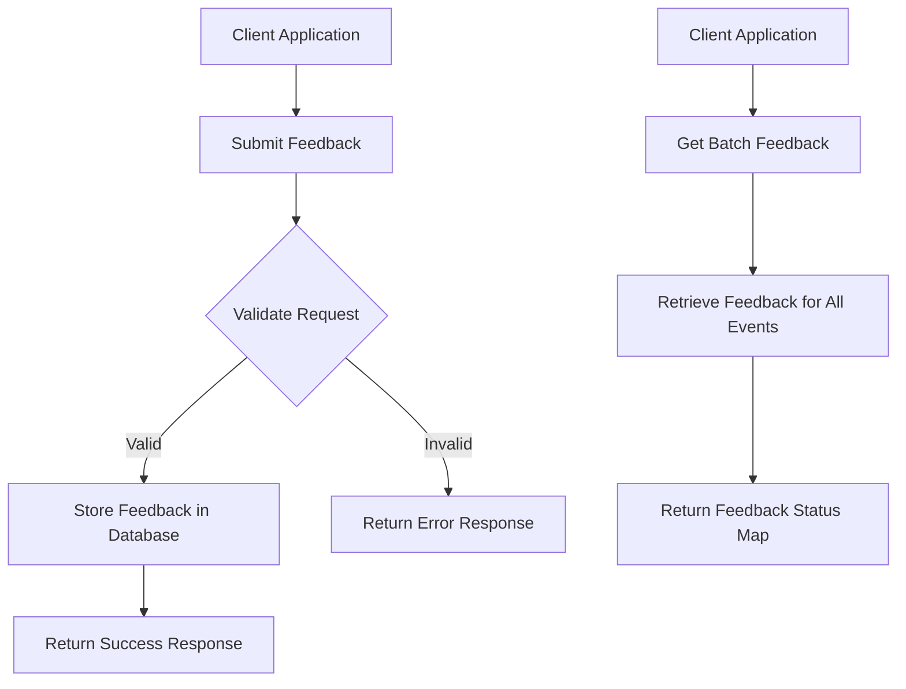
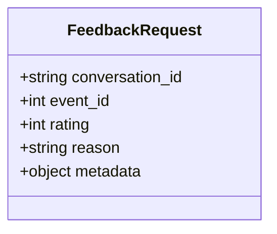
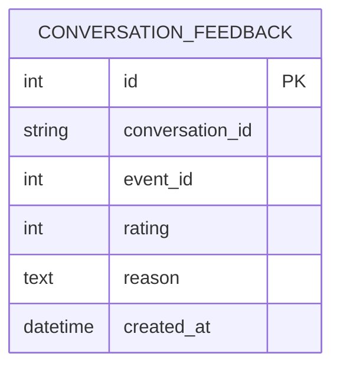
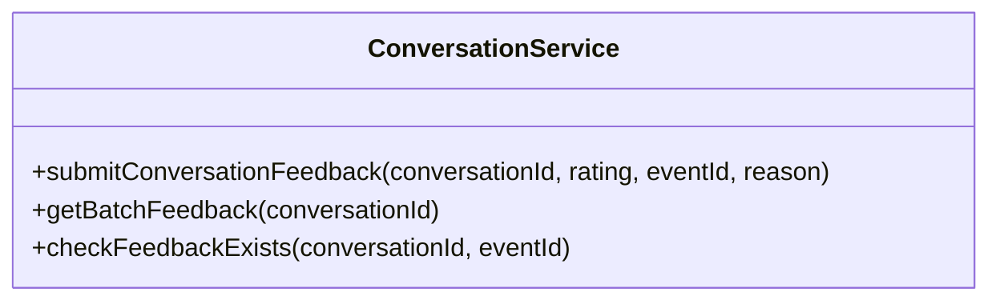
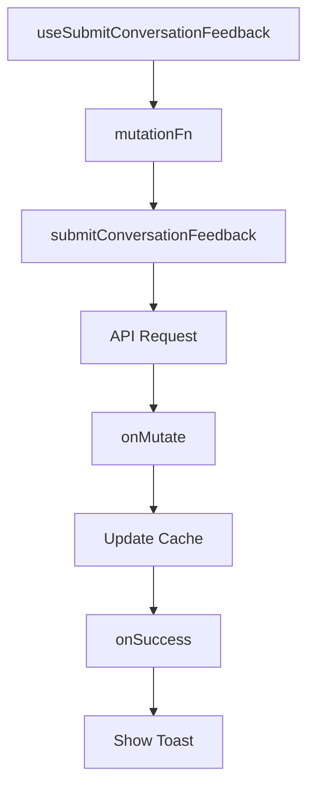
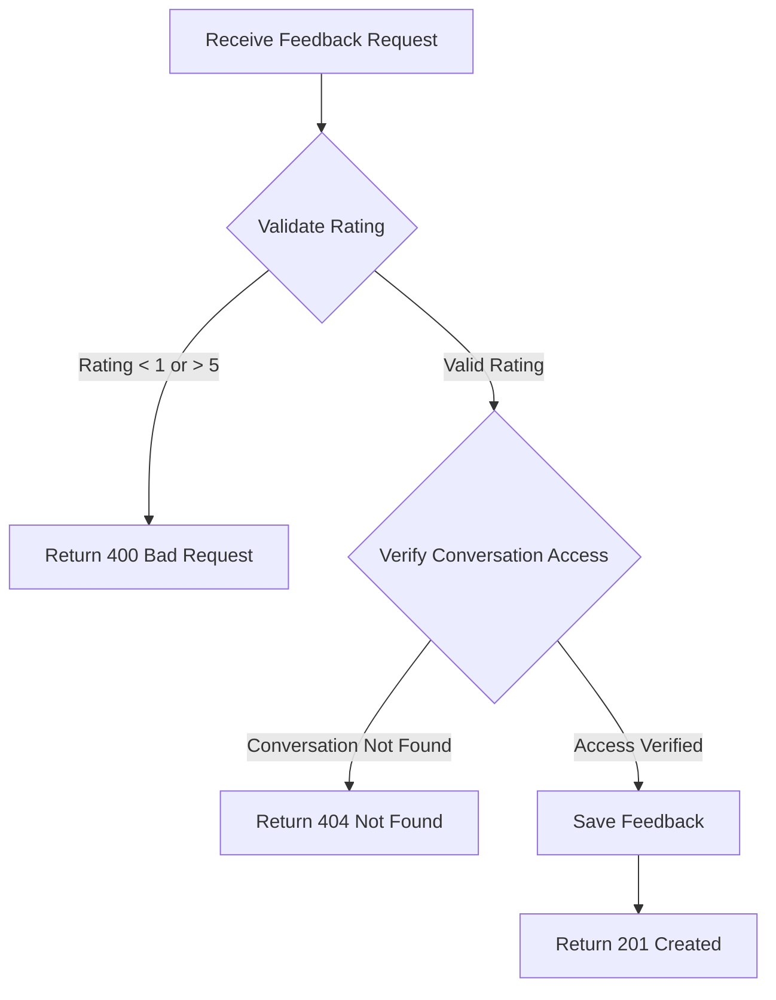
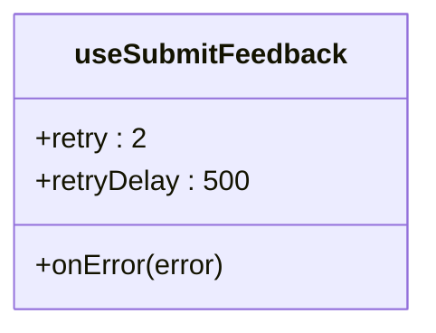
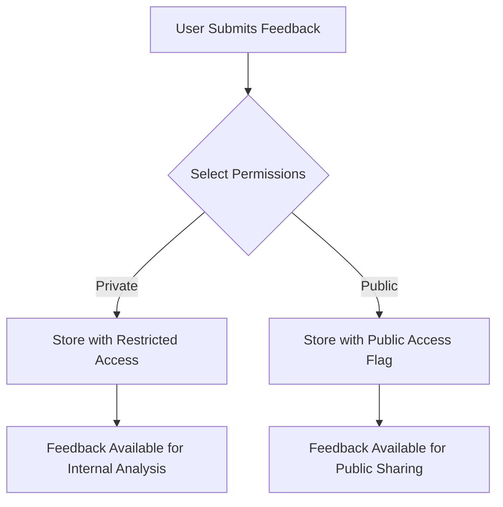

# Feedback API

<cite>
**Referenced Files in This Document**   
- [feedback.py](file://enterprise/server/routes/feedback.py)
- [feedback.py](file://enterprise/storage/feedback.py)
- [use-batch-feedback.ts](file://frontend/src/hooks/query/use-batch-feedback.ts)
- [use-submit-conversation-feedback.ts](file://frontend/src/hooks/mutation/use-submit-conversation-feedback.ts)
- [conversation-service.api.ts](file://frontend/src/api/conversation-service/conversation-service.api.ts)
- [feedback-form.tsx](file://frontend/src/components/features/feedback/feedback-form.tsx)
- [open-hands.types.ts](file://frontend/src/api/open-hands.types.ts)
- [047_create_conversation_feedback_table.py](file://enterprise/migrations/versions/047_create_conversation_feedback_table.py)
- [test_feedback.py](file://enterprise/tests/unit/test_feedback.py)
</cite>

## Table of Contents
1. [Introduction](#introduction)
2. [Feedback API Endpoints](#feedback-api-endpoints)
3. [Request and Response Schemas](#request-and-response-schemas)
4. [Data Storage and Retrieval](#data-storage-and-retrieval)
5. [Frontend Implementation](#frontend-implementation)
6. [Error Handling](#error-handling)
7. [Privacy Considerations](#privacy-considerations)
8. [Conclusion](#conclusion)

## Introduction
The Feedback API in OpenHands provides a comprehensive system for collecting user feedback on agent performance during conversations. This documentation details the API endpoints, data models, and implementation patterns for submitting and retrieving feedback. The system supports both authenticated and anonymous feedback submission, with mechanisms for rating agent performance, providing comments, and evaluating specific actions. Feedback data is used to improve system performance and agent capabilities through continuous learning and analysis.

## Feedback API Endpoints
The Feedback API provides endpoints for submitting and retrieving user feedback on agent performance. The primary endpoint allows users to submit ratings and comments for specific conversations or events within conversations.

**Diagram sources**
- [feedback.py](file://enterprise/server/routes/feedback.py#L74-L106)
- [feedback.py](file://enterprise/server/routes/feedback.py#L109-L149)

### Submit Conversation Feedback
The POST `/feedback/conversation` endpoint allows users to submit feedback for a conversation. This endpoint accepts a rating (1-5) and optional reason for the feedback. The feedback can be associated with a specific conversation and optionally a specific event within that conversation.

**Section sources**
- [feedback.py](file://enterprise/server/routes/feedback.py#L74-L106)

### Get Batch Feedback
The GET `/feedback/conversation/{conversation_id}/batch` endpoint retrieves feedback status for all events in a specific conversation. It returns a map of event IDs to feedback data, including whether feedback exists and if so, the rating and reason.

**Section sources**
- [feedback.py](file://enterprise/server/routes/feedback.py#L109-L149)

## Request and Response Schemas
The Feedback API uses well-defined request and response schemas to ensure consistent data exchange between client and server.

### Feedback Request Schema
The FeedbackRequest model defines the structure for submitting feedback. It includes the following fields:

| Field | Type | Required | Description | Validation |
|-------|------|----------|-------------|------------|
| conversation_id | string | Yes | The ID of the conversation to provide feedback for | Must be a valid conversation ID |
| event_id | integer | No | The ID of the specific event to provide feedback for | Must be a valid event ID within the conversation |
| rating | integer | Yes | The rating for the conversation or event (1-5) | Must be between 1 and 5 |
| reason | string | No | Optional reason explaining the rating | Maximum length enforced |
| metadata | object | No | Additional metadata about the feedback submission | Key-value pairs with string values |

**Diagram sources**
- [feedback.py](file://enterprise/server/routes/feedback.py#L66-L72)

### Response Schema
The API returns standardized responses for feedback operations. Successful submissions return a success status with a confirmation message.

| Field | Type | Description |
|-------|------|-------------|
| status | string | Operation status ("success" or "error") |
| message | string | Human-readable message describing the result |

**Section sources**
- [feedback.py](file://enterprise/server/routes/feedback.py#L106)

## Data Storage and Retrieval
The Feedback API stores user feedback in a dedicated database table with optimized indexing for efficient retrieval.

### Database Schema
The conversation_feedback table stores all user feedback with the following structure:

| Column | Type | Nullable | Index | Description |
|--------|------|----------|-------|-------------|
| id | Integer | No | Primary Key | Auto-incrementing primary key |
| conversation_id | String | No | Yes | ID of the associated conversation |
| event_id | Integer | Yes | No | ID of the specific event (optional) |
| rating | Integer | No | No | User rating (1-5) |
| reason | Text | Yes | No | User-provided reason for the rating |
| created_at | DateTime | No | No | Timestamp of feedback creation |

**Diagram sources**
- [047_create_conversation_feedback_table.py](file://enterprise/migrations/versions/047_create_conversation_feedback_table.py#L19-L37)
- [feedback.py](file://enterprise/storage/feedback.py#L21-L29)

### Data Retrieval Process
The batch feedback retrieval process follows these steps:
1. Verify the conversation belongs to the authenticated user
2. Retrieve all event IDs for the conversation from the event store
3. Query the database for existing feedback for all events
4. Create a mapping of event IDs to feedback status
5. Return a comprehensive response with feedback status for all events

**Section sources**
- [feedback.py](file://enterprise/server/routes/feedback.py#L117-L148)

## Frontend Implementation
The frontend implementation provides user-friendly interfaces for submitting feedback and integrates with the backend API through service classes and hooks.

### Service Layer
The ConversationService class in the frontend provides methods for interacting with the Feedback API:

**Diagram sources**
- [conversation-service.api.ts](file://frontend/src/api/conversation-service/conversation-service.api.ts#L85-L104)
- [conversation-service.api.ts](file://frontend/src/api/conversation-service/conversation-service.api.ts#L135-L159)

### React Hooks
The frontend uses React hooks to manage feedback state and interactions:

**Diagram sources**
- [use-submit-conversation-feedback.ts](file://frontend/src/hooks/mutation/use-submit-conversation-feedback.ts#L15-L38)
- [use-batch-feedback.ts](file://frontend/src/hooks/query/use-batch-feedback.ts#L25-L37)

**Section sources**
- [use-submit-conversation-feedback.ts](file://frontend/src/hooks/mutation/use-submit-conversation-feedback.ts#L15-L38)
- [use-batch-feedback.ts](file://frontend/src/hooks/query/use-batch-feedback.ts#L25-L37)

## Error Handling
The Feedback API implements comprehensive error handling to ensure robust operation and provide meaningful feedback to users.

### Server-Side Error Handling
The API validates input data and returns appropriate HTTP status codes for different error conditions:

**Section sources**
- [feedback.py](file://enterprise/server/routes/feedback.py#L82-L87)
- [feedback.py](file://enterprise/server/routes/feedback.py#L32-L47)

### Client-Side Error Handling
The frontend implements retry logic and user feedback for error conditions:

**Diagram sources**
- [use-submit-feedback.ts](file://frontend/src/hooks/mutation/use-submit-feedback.ts#L11-L21)

**Section sources**
- [use-submit-feedback.ts](file://frontend/src/hooks/mutation/use-submit-feedback.ts#L11-L21)

## Privacy Considerations
The Feedback API includes mechanisms to protect user privacy and control data sharing.

### Anonymous vs Authenticated Feedback
The system supports both anonymous and authenticated feedback submission. Anonymous feedback is associated with a conversation but not with a specific user account, while authenticated feedback is linked to the user's account for follow-up and analysis.

### Data Sharing Controls
Users can control the visibility of their feedback through permissions settings:

| Permission | Description |
|-----------|-------------|
| private | Feedback is only visible to the submitter and system administrators |
| public | Feedback may be shared publicly for community learning and improvement |

The feedback form includes explicit controls for users to select their preferred privacy level.

**Section sources**
- [feedback-form.tsx](file://frontend/src/components/features/feedback/feedback-form.tsx#L108-L122)

## Conclusion
The Feedback API in OpenHands provides a robust system for collecting user input on agent performance. It supports detailed feedback submission with ratings, comments, and metadata, while ensuring data privacy and security. The API is well-integrated with both the backend storage system and frontend user interface, providing a seamless experience for users to share their experiences and help improve the system. The comprehensive error handling and validation ensure reliable operation, while the privacy controls give users confidence in sharing their feedback.