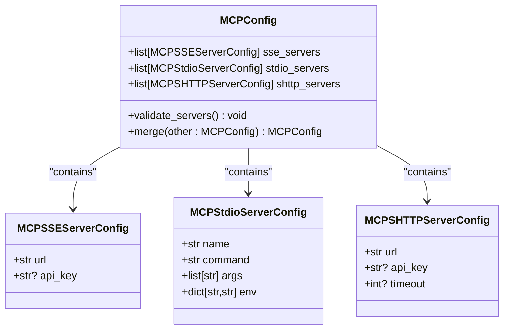
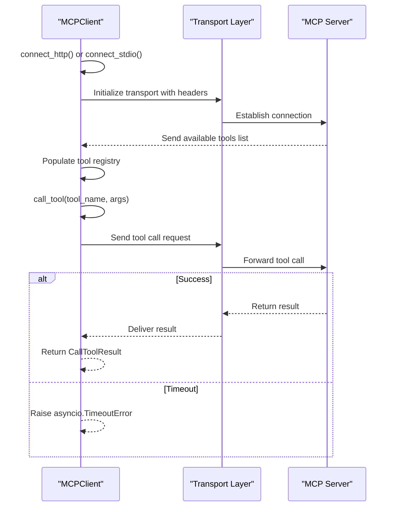
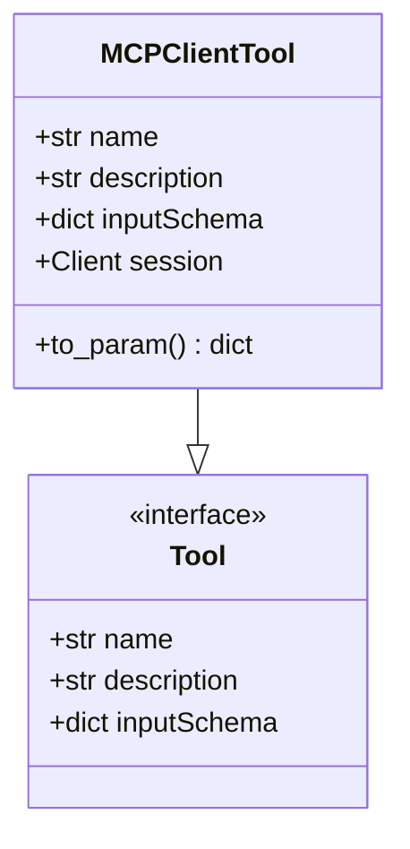
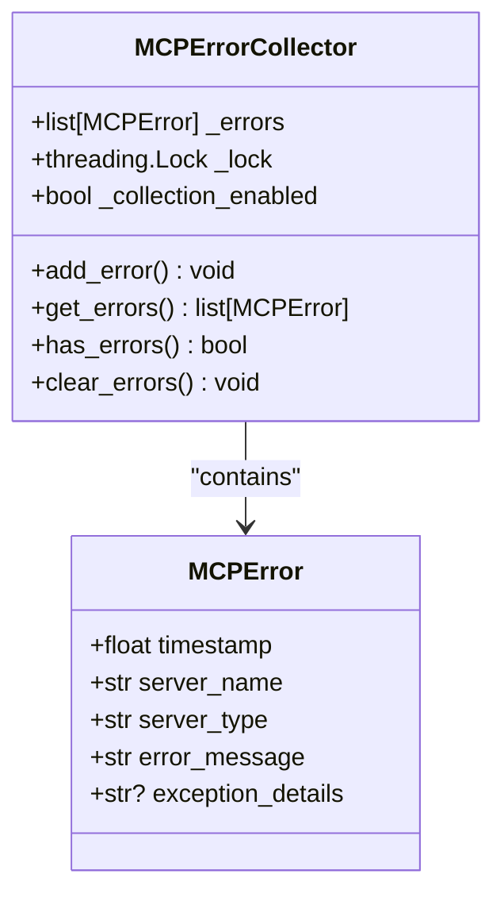
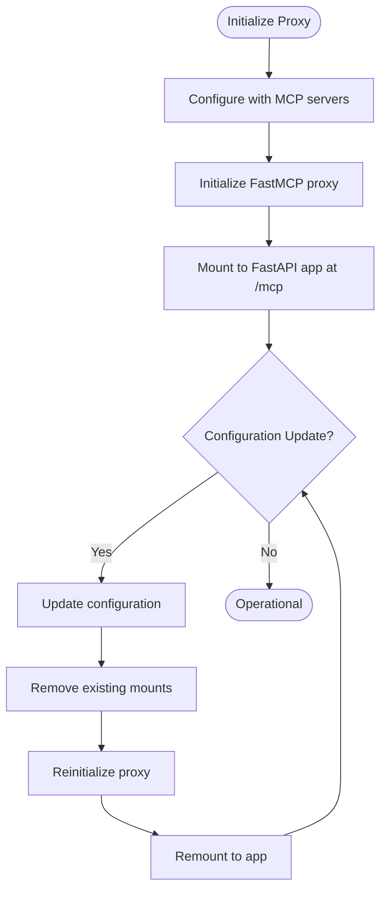

# MCP API

<cite>
**Referenced Files in This Document**   
- [mcp_config.py](file://openhands/core/config/mcp_config.py)
- [client.py](file://openhands/mcp/client.py)
- [tool.py](file://openhands/mcp/tool.py)
- [error_collector.py](file://openhands/mcp/error_collector.py)
- [manager.py](file://openhands/runtime/mcp/proxy/manager.py)
- [mcp_config.py](file://enterprise/server/mcp/mcp_config.py)
- [mcp_patch.py](file://enterprise/server/routes/mcp_patch.py)
</cite>

## Table of Contents
1. [Introduction](#introduction)
2. [MCP Configuration](#mcp-configuration)
3. [Client Implementation](#client-implementation)
4. [Tool Management](#tool-management)
5. [Error Handling](#error-handling)
6. [Server Integration](#server-integration)
7. [Security Considerations](#security-considerations)
8. [Timeout Management](#timeout-management)
9. [Frontend Integration](#frontend-integration)
10. [Conclusion](#conclusion)

## Introduction
The Model Control Protocol (MCP) API provides a framework for integrating external tools and services into the OpenHands platform. This documentation details the endpoints and mechanisms for managing tool integration, function calling, and server configuration. The MCP system enables both synchronous and asynchronous tool execution through various transport protocols including SSE, SHTTP, and stdio. The architecture supports discovery of available tools, execution of tool calls, and comprehensive error handling for tool execution failures and timeout scenarios.

## MCP Configuration

The MCP configuration system provides a structured approach to defining and managing MCP server connections. The configuration supports three types of server connections: SSE (Server-Sent Events), SHTTP (Streamable HTTP), and stdio (standard input/output). Each server type has specific configuration requirements and use cases.

### Configuration Structure
The MCP configuration is defined through the `MCPConfig` class which contains three main components:

- **sse_servers**: List of MCPSSEServerConfig objects for Server-Sent Events connections
- **stdio_servers**: List of MCPStdioServerConfig objects for standard I/O connections  
- **shttp_servers**: List of MCPSHTTPServerConfig objects for Streamable HTTP connections

Each server configuration type includes validation rules to ensure proper formatting and security. For example, URL validation ensures proper scheme (http, https, ws, wss) and domain format, while server names are restricted to alphanumeric characters, hyphens, and underscores.

**Diagram sources**
- [mcp_config.py](file://openhands/core/config/mcp_config.py#L222-L384)

**Section sources**
- [mcp_config.py](file://openhands/core/config/mcp_config.py#L222-L384)

## Client Implementation

The MCP client implementation provides the core functionality for connecting to MCP servers and executing tool calls. The `MCPClient` class serves as the primary interface for interacting with MCP servers, handling connection management, tool discovery, and execution.

### Connection Methods
The MCP client supports multiple transport protocols:

1. **HTTP/SSE Connection**: Uses `connect_http()` method for connecting to servers via HTTP or SSE transports
2. **Stdio Connection**: Uses `connect_stdio()` method for connecting to servers via standard input/output

Both connection methods handle authentication through API keys, which are included in request headers. The client automatically discovers available tools upon connection and maintains a local registry of available tools.

### Tool Execution
Tool execution is handled through the `call_tool()` method, which includes timeout handling based on server configuration. The method uses asyncio.wait_for() to enforce timeouts, ensuring that long-running operations do not block the system indefinitely.

**Diagram sources**
- [client.py](file://openhands/mcp/client.py#L24-L178)

**Section sources**
- [client.py](file://openhands/mcp/client.py#L24-L178)

## Tool Management

The tool management system provides a consistent interface for representing and invoking MCP tools. The `MCPClientTool` class extends the base Tool class from the MCP protocol, adding OpenHands-specific functionality.

### Tool Representation
Each tool is represented with the following attributes:
- **name**: Unique identifier for the tool
- **description**: Human-readable description of the tool's purpose
- **inputSchema**: JSON schema defining the tool's expected input parameters
- **session**: Reference to the client session for execution

The `to_param()` method converts the tool representation into the format expected by the LLM system, enabling function calling capabilities. This conversion creates a standardized function definition that includes the tool's name, description, and parameter schema.

**Diagram sources**
- [tool.py](file://openhands/mcp/tool.py#L5-L24)

**Section sources**
- [tool.py](file://openhands/mcp/tool.py#L5-L24)

## Error Handling

The MCP system implements comprehensive error handling to ensure robust operation in the face of connection issues, authentication failures, and tool execution problems. The error handling system is designed to provide meaningful feedback while maintaining system stability.

### Error Collector
The `MCPErrorCollector` class provides a thread-safe mechanism for collecting and storing MCP-related errors during system startup and operation. This collector captures:
- Timestamp of the error
- Server name and type
- Error message and exception details

The collector is particularly useful for diagnosing connection issues during startup, allowing administrators to review collected errors and address configuration problems.

### Error Types
The system handles several types of errors:
- **Connection errors**: Network issues, timeouts, or server unavailability
- **Authentication errors**: Invalid or missing API keys
- **Tool execution errors**: Issues during tool invocation or result processing
- **Validation errors**: Configuration or input validation failures

**Diagram sources**
- [error_collector.py](file://openhands/mcp/error_collector.py#L19-L79)

**Section sources**
- [error_collector.py](file://openhands/mcp/error_collector.py#L19-L79)

## Server Integration

The MCP server integration provides mechanisms for exposing MCP functionality through web APIs and managing server instances. The integration includes both client-side utilities and server-side components.

### Proxy Manager
The `MCPProxyManager` class manages FastMCP proxy instances, handling initialization, configuration, and mounting to FastAPI applications. Key features include:

- Dynamic configuration updates
- CORS support through allow_origins parameter
- Proper cleanup of existing mounts before remounting
- Integration with FastAPI applications

The proxy manager supports mounting the MCP server at the `/mcp` path, making it accessible through standard HTTP requests. The implementation includes safeguards against double response starts, addressing known issues with the MCP protocol.

### Route Patching
The server routes include patching functionality that allows dynamic modification of MCP server configurations. This enables runtime updates to server settings without requiring application restarts.

**Diagram sources**
- [manager.py](file://openhands/runtime/mcp/proxy/manager.py#L21-L144)

**Section sources**
- [manager.py](file://openhands/runtime/mcp/proxy/manager.py#L21-L144)

## Security Considerations

The MCP system implements several security measures to protect against unauthorized access and ensure secure communication between components.

### Authentication
Authentication is implemented through API keys that are included in HTTP headers:
- **Authorization**: Standard Bearer token format
- **s**: Required for action execution server's MCP Router
- **X-Session-API-Key**: Required for Remote Runtime

These headers ensure that only authorized clients can access MCP functionality. The API key is validated on the server side before processing any requests.

### Secure Configuration
The system follows security best practices in configuration management:
- API keys are never stored in plain text
- Configuration validation prevents malformed URLs and invalid parameters
- Environment variables for stdio servers are properly sanitized

The SaaS implementation specifically uses Streamable HTTP over SSE connections for better performance and stateless connections, which is essential for distributed server environments.

**Section sources**
- [client.py](file://openhands/mcp/client.py#L73-L81)
- [mcp_config.py](file://enterprise/server/mcp/mcp_config.py#L16-L24)

## Timeout Management

The MCP system implements comprehensive timeout management to prevent hanging operations and ensure responsive behavior.

### Connection Timeouts
Connection timeouts are configurable at multiple levels:
- Default connection timeout of 120 seconds
- Server-specific timeouts for tool calls
- Configurable timeout parameter in connection methods

The system handles timeout exceptions gracefully, logging errors and collecting them for diagnostic purposes. When a connection timeout occurs, the system continues attempting to connect to other configured servers, ensuring that a single failure does not prevent overall operation.

### Tool Call Timeouts
Tool call timeouts are handled through the `call_tool()` method, which uses asyncio.wait_for() to enforce time limits. If a server configuration includes a timeout value, it is used; otherwise, the call proceeds without a timeout limit.

The timeout system is designed to prevent the agent from getting stuck on long-running operations, allowing it to continue processing other tasks or attempt alternative approaches.

**Section sources**
- [client.py](file://openhands/mcp/client.py#L170-L178)
- [test_mcp_timeout.py](file://tests/unit/mcp/test_mcp_timeout.py#L1-L39)

## Frontend Integration

The frontend implementation provides a user interface for managing MCP server configurations and monitoring their status. The integration is built using React and follows modern web development practices.

### Configuration Management
The frontend allows users to:
- Add, edit, and delete MCP server configurations
- View server status and connection information
- Manage authentication credentials

The interface supports all three server types (SSE, stdio, SHTTP) with appropriate input fields for each configuration type. Server configurations are stored in the user settings and synchronized with the backend.

### User Interface Components
Key UI components include:
- Server list with edit/delete actions
- Form validation for server configuration
- Confirmation dialogs for destructive operations
- Empty state handling when no servers are configured

The implementation uses React Query for data fetching and mutation, ensuring that the UI stays synchronized with the backend state.

**Section sources**
- [mcp-settings.tsx](file://frontend/src/routes/mcp-settings.tsx)
- [use-update-mcp-server.ts](file://frontend/src/hooks/mutation/use-update-mcp-server.ts)
- [mcp-server-list.tsx](file://frontend/src/components/features/settings/mcp-settings/mcp-server-list.tsx)

## Conclusion
The MCP API provides a robust framework for integrating external tools and services into the OpenHands platform. The system supports multiple transport protocols, comprehensive error handling, and secure authentication mechanisms. The architecture enables both synchronous and asynchronous tool execution with proper timeout management to ensure system responsiveness. The client-server integration is designed for scalability and reliability, making it suitable for both local development environments and distributed production deployments. The frontend interface provides an intuitive way to manage server configurations, while the underlying implementation ensures secure and reliable operation.