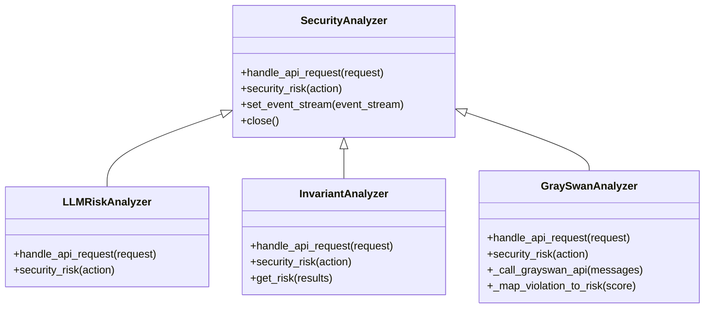
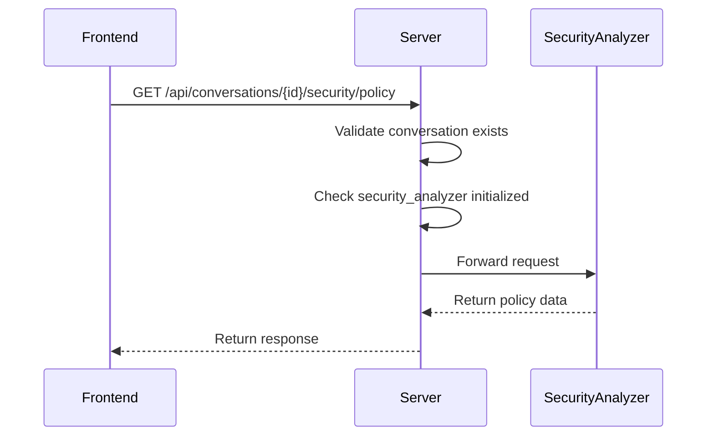
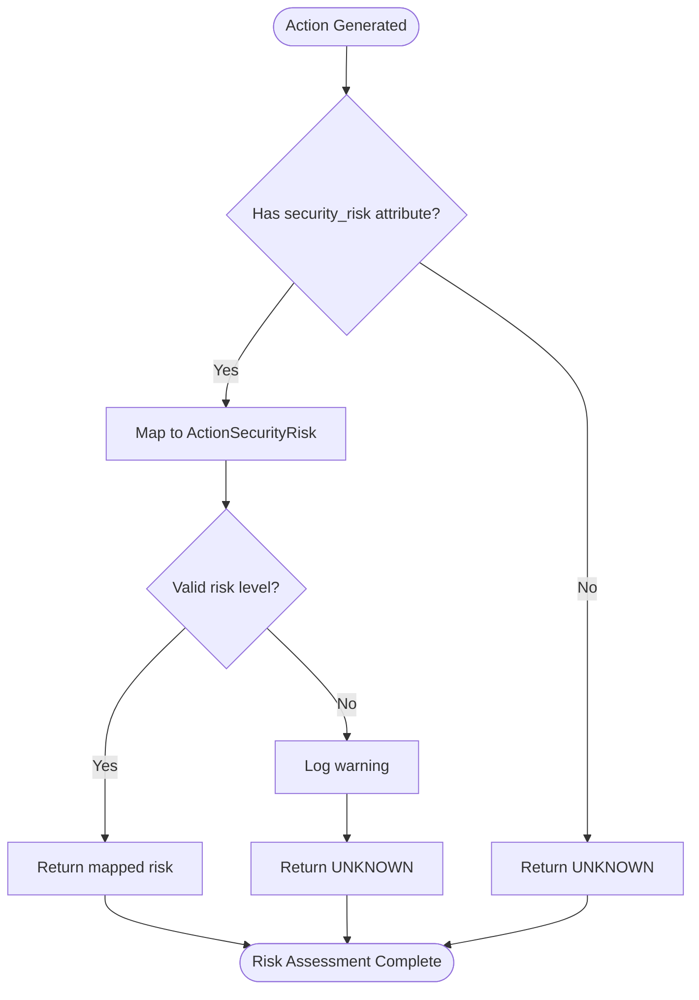
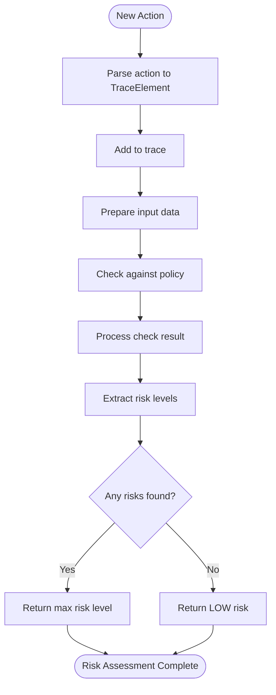
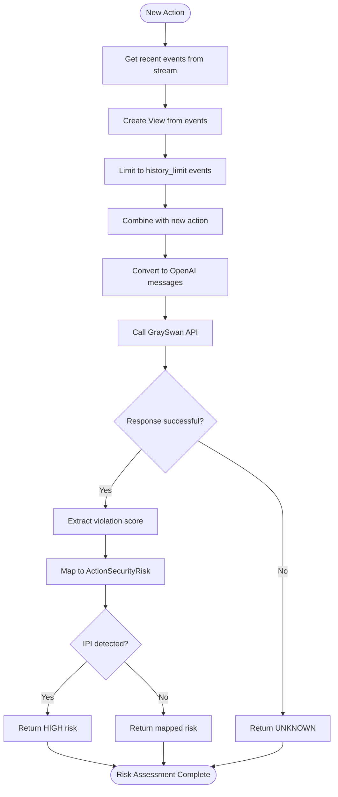
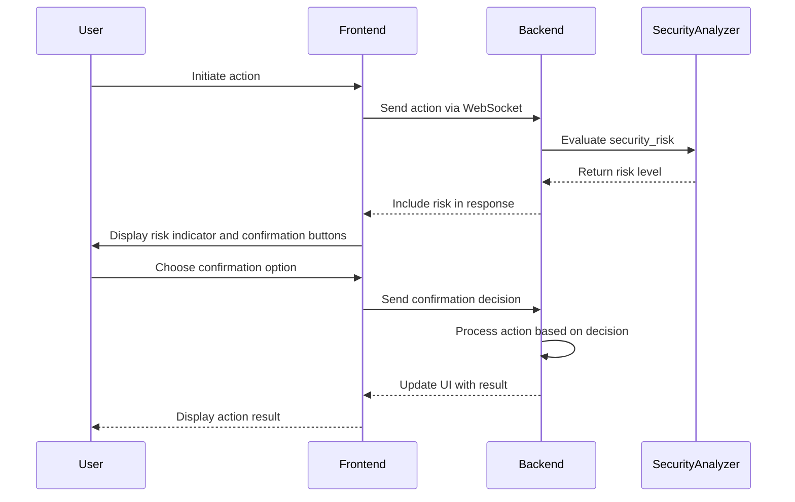

# Security API

<cite>
**Referenced Files in This Document**   
- [security.py](file://openhands/server/routes/security.py)
- [analyzer.py](file://openhands/security/analyzer.py)
- [options.py](file://openhands/security/options.py)
- [llm/analyzer.py](file://openhands/security/llm/analyzer.py)
- [invariant/analyzer.py](file://openhands/security/invariant/analyzer.py)
- [grayswan/analyzer.py](file://openhands/security/grayswan/analyzer.py)
- [invariant-service.ts](file://frontend/src/api/invariant-service.ts)
- [security-analyzer-store.ts](file://frontend/src/stores/security-analyzer-store.ts)
- [action.py](file://openhands/events/action/action.py)
</cite>

## Table of Contents
1. [Introduction](#introduction)
2. [Security Analyzer Architecture](#security-analyzer-architecture)
3. [API Endpoints](#api-endpoints)
4. [Security Analyzer Integration](#security-analyzer-integration)
5. [Request/Response Formats](#requestresponse-formats)
6. [Frontend Implementation](#frontend-implementation)
7. [Performance Considerations](#performance-considerations)
8. [Configuration and Environment Variables](#configuration-and-environment-variables)

## Introduction

The Security API in OpenHands provides a comprehensive framework for security analysis and risk assessment of agent actions. It enables real-time evaluation of potential security risks through multiple analyzer implementations, including LLM-based, Invariant, and GraySwan analyzers. The API supports dynamic configuration of security policies, risk thresholds, and confirmation workflows, allowing users to balance security requirements with operational efficiency.

The system is designed to integrate seamlessly with the agent workflow, providing risk assessments for each action before execution. It supports various confirmation modes that determine when user intervention is required based on the assessed risk level. This documentation details the API endpoints, integration patterns, request/response formats, and implementation details for the security analysis system.

**Section sources**
- [security.py](file://openhands/server/routes/security.py)
- [analyzer.py](file://openhands/security/analyzer.py)
- [options.py](file://openhands/security/options.py)

## Security Analyzer Architecture

The security analyzer architecture in OpenHands follows a plugin-based design pattern, allowing multiple security analysis implementations to coexist and be selected based on configuration. The core architecture consists of a base `SecurityAnalyzer` class that defines the interface for all security analyzers, with specific implementations for different analysis approaches.



**Diagram sources **
- [analyzer.py](file://openhands/security/analyzer.py#L8-L38)
- [llm/analyzer.py](file://openhands/security/llm/analyzer.py#L12-L43)
- [invariant/analyzer.py](file://openhands/security/invariant/analyzer.py#L15-L126)
- [grayswan/analyzer.py](file://openhands/security/grayswan/analyzer.py#L18-L204)

The base `SecurityAnalyzer` class defines the essential methods that all concrete analyzers must implement:
- `handle_api_request(request)`: Handles incoming API requests for configuration and status
- `security_risk(action)`: Evaluates the security risk of an action and returns the risk level
- `set_event_stream(event_stream)`: Sets the event stream for accessing conversation history
- `close()`: Cleans up resources allocated by the analyzer

Each concrete implementation extends this base class to provide specific security analysis capabilities. The architecture supports runtime selection of analyzers through configuration, allowing users to switch between different analysis approaches without code changes.

**Section sources**
- [analyzer.py](file://openhands/security/analyzer.py#L8-L38)
- [options.py](file://openhands/security/options.py#L6-L10)

## API Endpoints

The Security API provides a set of endpoints for managing security analysis, retrieving risk assessments, and configuring analyzer settings. These endpoints follow a consistent pattern and are accessible through the `/api/conversations/{conversation_id}/security` path.

### Base Security Endpoint

The base security endpoint acts as a catch-all route that forwards requests to the appropriate security analyzer based on the current conversation configuration.



**Diagram sources **
- [security.py](file://openhands/server/routes/security.py#L19-L42)
- [invariant/analyzer.py](file://openhands/security/invariant/analyzer.py#L15-L126)

### Available Endpoints

The following endpoints are available for security analysis and configuration:

#### GET /api/security/policy
Retrieves the current security policy configuration.

**Response Format**
```json
{
  "policy": "string"
}
```

#### POST /api/security/policy
Updates the security policy configuration.

**Request Format**
```json
{
  "policy": "string"
}
```

#### GET /api/security/settings
Retrieves the current security settings, including risk severity thresholds.

**Response Format**
```json
{
  "RISK_SEVERITY": "number"
}
```

#### POST /api/security/settings
Updates the security settings, including risk severity thresholds.

**Request Format**
```json
{
  "RISK_SEVERITY": "number"
}
```

#### GET /api/security/export-trace
Exports the security analysis trace for debugging and auditing purposes.

**Response Format**
```json
{
  "trace": "array"
}
```

**Section sources**
- [security.py](file://openhands/server/routes/security.py#L19-L42)
- [invariant-service.ts](file://frontend/src/api/invariant-service.ts#L4-L27)

## Security Analyzer Integration

The integration between security analyzers and API endpoints is designed to be flexible and extensible, allowing different analyzers to expose their specific functionality through the API while maintaining a consistent interface.

### LLM Risk Analyzer

The LLM Risk Analyzer is the default security analyzer that leverages LLM-provided risk assessments. It checks if actions have a `security_risk` attribute set by the LLM and maps it to the appropriate `ActionSecurityRisk` level.



**Diagram sources **
- [llm/analyzer.py](file://openhands/security/llm/analyzer.py#L19-L43)
- [action.py](file://openhands/events/action/action.py#L8-L19)

### Invariant Analyzer

The Invariant Analyzer uses the Invariant framework to analyze traces and detect potential issues with OpenHands workflows. It maintains a trace of actions and observations, which is used to evaluate policy compliance.



**Diagram sources **
- [invariant/analyzer.py](file://openhands/security/invariant/analyzer.py#L110-L125)
- [invariant/parser.py](file://openhands/security/invariant/parser.py)

### GraySwan Analyzer

The GraySwan Analyzer integrates with the GraySwan AI Cygnal API to provide advanced AI safety monitoring. It converts conversation events to OpenAI message format and sends them to the GraySwan API for risk assessment.



**Diagram sources **
- [grayswan/analyzer.py](file://openhands/security/grayswan/analyzer.py#L165-L195)
- [grayswan/utils.py](file://openhands/security/grayswan/utils.py)

**Section sources**
- [llm/analyzer.py](file://openhands/security/llm/analyzer.py#L12-L43)
- [invariant/analyzer.py](file://openhands/security/invariant/analyzer.py#L15-L126)
- [grayswan/analyzer.py](file://openhands/security/grayswan/analyzer.py#L18-L204)

## Request/Response Formats

The Security API uses standardized request and response formats for consistency across endpoints. These formats are designed to be simple and intuitive while providing the necessary information for security analysis and risk assessment.

### Action Security Risk Levels

The system defines four security risk levels that are used consistently across all analyzers:

| Risk Level | Value | Description |
|------------|-------|-------------|
| UNKNOWN | -1 | Risk level could not be determined |
| LOW | 0 | Minimal risk, typically auto-confirmed |
| MEDIUM | 1 | Moderate risk, may require confirmation |
| HIGH | 2 | High risk, requires user confirmation |

**Section sources**
- [action.py](file://openhands/events/action/action.py#L14-L19)
- [security-analyzer-store.ts](file://frontend/src/stores/security-analyzer-store.ts#L3-L8)

### Action Serialization

Actions are serialized with security risk information as part of their metadata. The LLM-generated actions include a `security_risk` field that indicates the assessed risk level.

```json
{
  "action": "run_command",
  "command": "git push origin main",
  "path": "/workspace",
  "security_risk": "HIGH"
}
```

The security risk field is defined in the tool schema with specific enumeration values:

```json
{
  "security_risk": {
    "type": "string",
    "description": "The security risk level of the action",
    "enum": ["LOW", "MEDIUM", "HIGH"]
  }
}
```

**Section sources**
- [str_replace_editor.py](file://openhands/agenthub/codeact_agent/tools/str_replace_editor.py#L152-L156)
- [action.py](file://openhands/events/action/action.py)

### Risk Scoring

Different analyzers use different approaches to risk scoring:

- **LLM Risk Analyzer**: Uses the `security_risk` attribute provided by the LLM
- **Invariant Analyzer**: Maps policy violation results to risk levels based on keywords
- **GraySwan Analyzer**: Maps violation scores to risk levels using threshold values

The GraySwan Analyzer uses configurable thresholds to determine risk levels:

```python
low_threshold: float = 0.3      # Below this score: LOW risk
medium_threshold: float = 0.7   # Below this score: MEDIUM risk  
high_threshold: float = 1.0     # Above this score: HIGH risk
```

**Section sources**
- [llm/analyzer.py](file://openhands/security/llm/analyzer.py#L26-L38)
- [invariant/analyzer.py](file://openhands/security/invariant/analyzer.py#L93-L108)
- [grayswan/analyzer.py](file://openhands/security/grayswan/analyzer.py#L26-L29)

## Frontend Implementation

The frontend implementation of the security analysis system provides a user-friendly interface for managing security settings, viewing risk assessments, and handling confirmation workflows.

### Confirmation Workflows

The frontend implements confirmation workflows that display risk indicators and prompt users for approval when required. The confirmation buttons component handles user interactions and communicates with the backend via WebSocket.



**Diagram sources **
- [confirmation-buttons.tsx](file://frontend/src/components/shared/buttons/confirmation-buttons.tsx)
- [security-analyzer-store.ts](file://frontend/src/stores/security-analyzer-store.ts)

### Risk Indicators

The frontend displays risk indicators to help users quickly assess the security implications of agent actions. These indicators use visual cues such as color coding and warning icons to convey risk levels.

The security analyzer store maintains a log of security analysis results, including:
- Action content
- Security risk level
- Confirmation state
- Change tracking for UI updates

```typescript
interface SecurityAnalyzerLog {
  id: number;
  content: string;
  security_risk: ActionSecurityRisk;
  confirmation_state?: "awaiting_confirmation" | "confirmed" | "rejected";
  confirmed_changed: boolean;
}
```

**Section sources**
- [security-analyzer-store.ts](file://frontend/src/stores/security-analyzer-store.ts#L10-L16)
- [risk-alert.tsx](file://frontend/src/components/shared/risk-alert.tsx)
- [confirmation-buttons.tsx](file://frontend/src/components/shared/buttons/confirmation-buttons.tsx)

## Performance Considerations

The security analysis system is designed with performance in mind, balancing thorough risk assessment with minimal impact on agent responsiveness.

### Real-time Analysis

Security analysis is performed in real-time as actions are generated by the agent. The system is optimized to minimize latency while providing comprehensive risk assessment:

- **LLM Risk Analyzer**: Near-instantaneous analysis by reading the `security_risk` attribute
- **Invariant Analyzer**: Fast local analysis with policy checking
- **GraySwan Analyzer**: Asynchronous API calls with configurable timeouts

The GraySwan Analyzer includes a configurable timeout parameter (default: 30 seconds) to prevent indefinite blocking of the agent workflow.

### Caching Strategies

The system implements caching strategies for repeated action patterns to improve performance:

- **Conversation History Caching**: Recent events are cached and reused for analysis
- **Policy Result Caching**: Invariant Analyzer maintains state across multiple actions
- **API Response Caching**: GraySwan API responses could be cached for identical action patterns

For repeated actions with identical parameters and context, the system can potentially cache risk assessments to avoid redundant analysis. This is particularly effective for common operations like file reads or simple commands.

### Resource Management

Each security analyzer manages resources efficiently:

- **LLM Risk Analyzer**: Minimal resource usage, no external dependencies
- **Invariant Analyzer**: Runs a local Docker container that persists across sessions
- **GraySwan Analyzer**: Maintains a persistent HTTP session for API calls

The system automatically cleans up resources when conversations are closed or analyzers are disabled.

**Section sources**
- [grayswan/analyzer.py](file://openhands/security/grayswan/analyzer.py#L25-L26)
- [invariant/analyzer.py](file://openhands/security/invariant/analyzer.py#L23-L24)
- [analyzer.py](file://openhands/security/analyzer.py#L35-L37)

## Configuration and Environment Variables

The security analysis system is highly configurable through both environment variables and API endpoints, allowing users to customize behavior without code changes.

### Available Security Analyzers

The system supports multiple security analyzers that can be selected through configuration:

| Analyzer | Configuration Value | Description |
|---------|-------------------|-------------|
| LLM Risk Analyzer | "llm" | Default analyzer using LLM-provided risk assessments |
| Invariant Analyzer | "invariant" | Analyzes traces using Invariant framework |
| GraySwan Analyzer | "grayswan" | Integrates with GraySwan AI Cygnal API |

The available analyzers are defined in the `SecurityAnalyzers` dictionary:

```python
SecurityAnalyzers: dict[str, type[SecurityAnalyzer]] = {
    'invariant': InvariantAnalyzer,
    'llm': LLMRiskAnalyzer,
    'grayswan': GraySwanAnalyzer,
}
```

### Environment Variables

Certain analyzers require environment variables for configuration:

#### GraySwan Analyzer
- `GRAYSWAN_API_KEY`: Required API key for GraySwan authentication
- `GRAYSWAN_POLICY_ID`: Optional policy ID for custom GraySwan policy

#### Invariant Analyzer
- No specific environment variables required
- Requires Docker to be running for the analyzer container

### Confirmation Mode Settings

The system supports different confirmation modes that determine when user intervention is required:

- **Always confirm**: Ask for confirmation on all actions
- **Never confirm**: Proceed without asking (disables security analyzer)
- **Risk-based confirmation**: Auto-confirm LOW/MEDIUM risk, ask for HIGH risk

These modes are managed through the frontend interface and can be changed dynamically during a conversation.

**Section sources**
- [options.py](file://openhands/security/options.py#L6-L10)
- [grayswan/analyzer.py](file://openhands/security/grayswan/analyzer.py#L42-L45)
- [runner.py](file://openhands-cli/openhands_cli/runner.py#L153-L174)
- [agent_action.py](file://openhands-cli/openhands_cli/user_actions/agent_action.py#L44-L95)