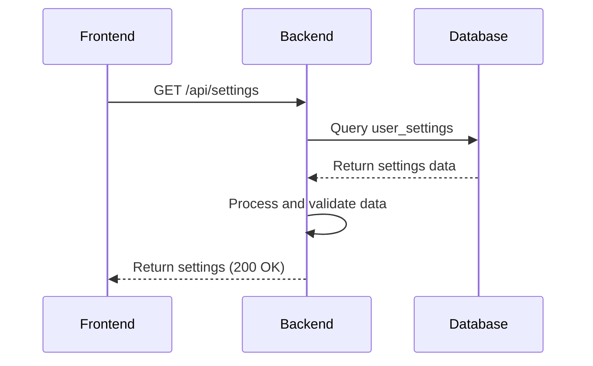
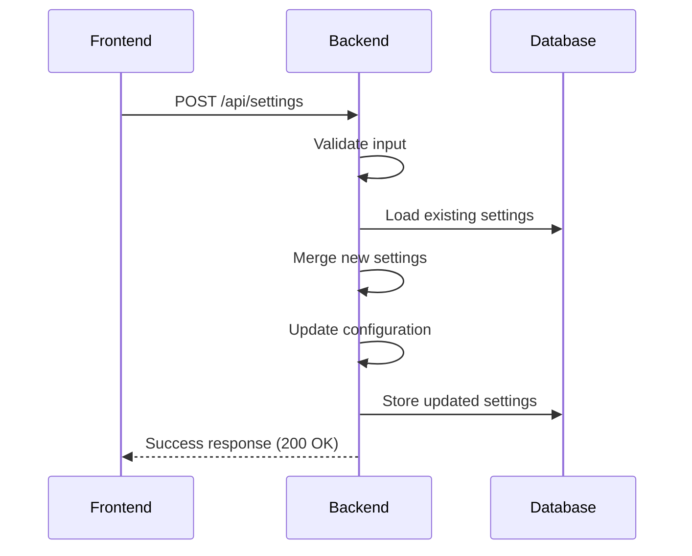
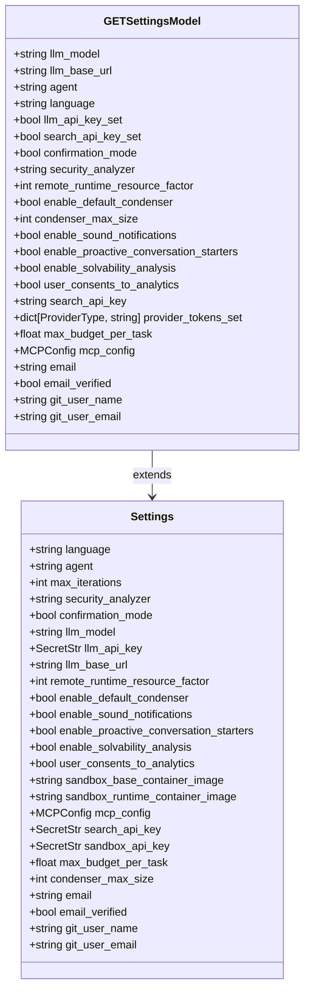
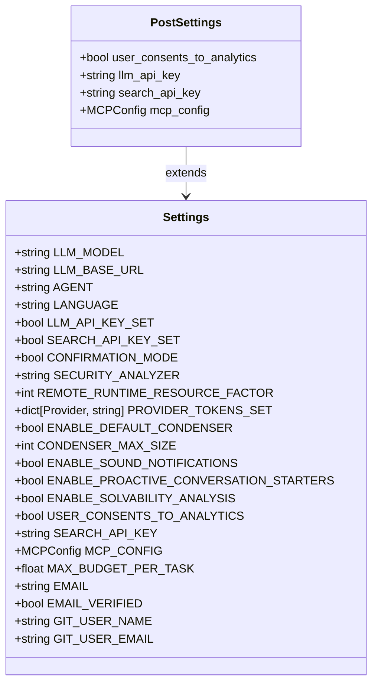
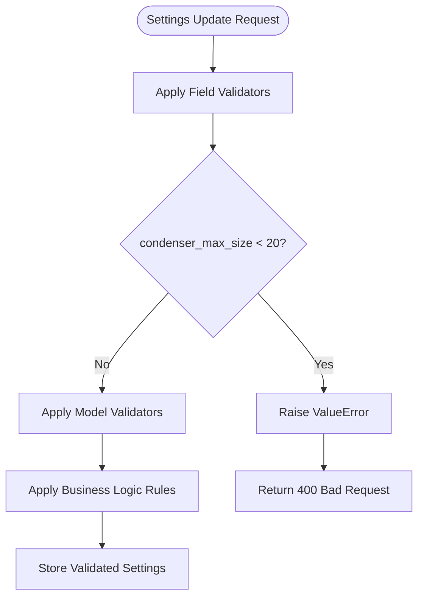
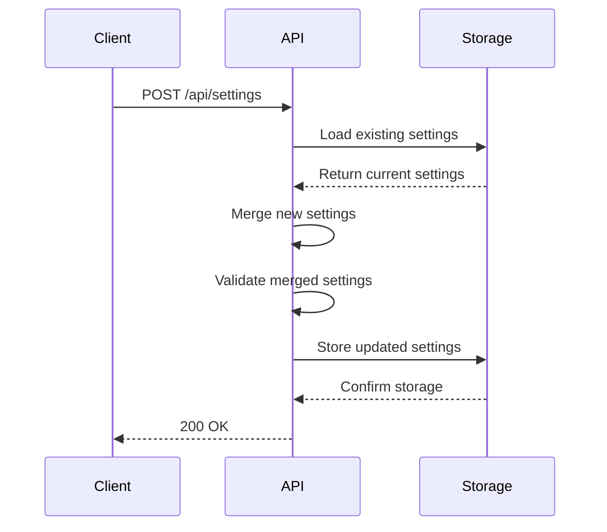
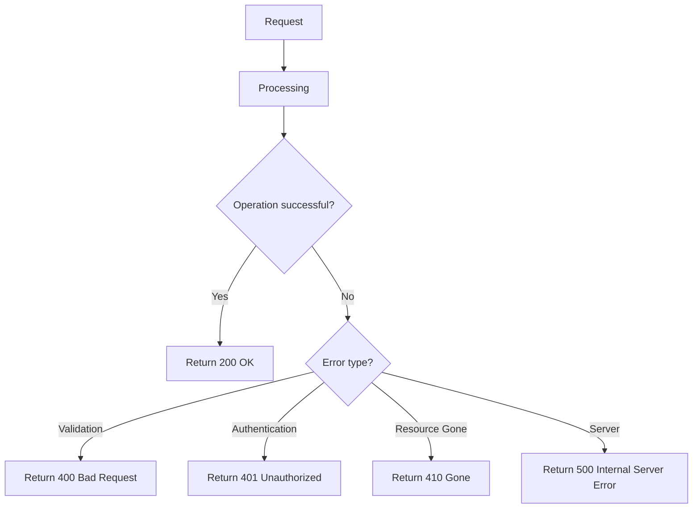
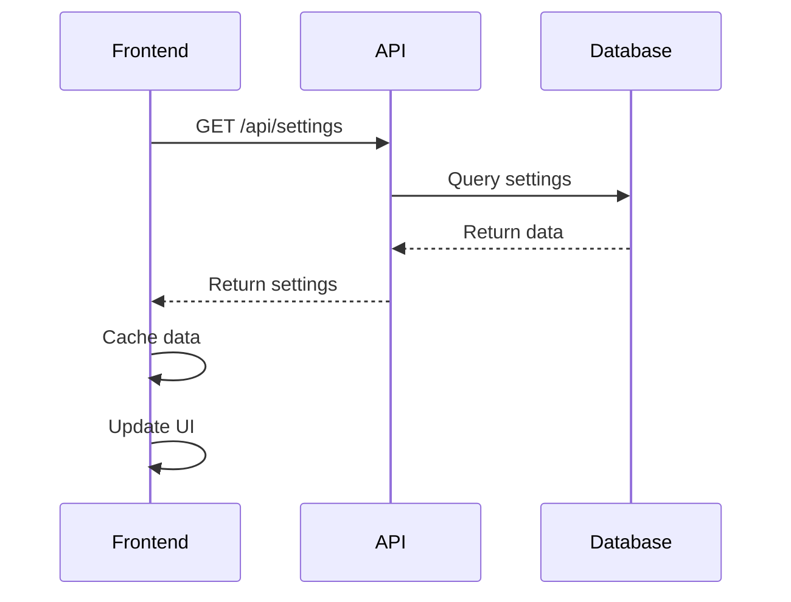
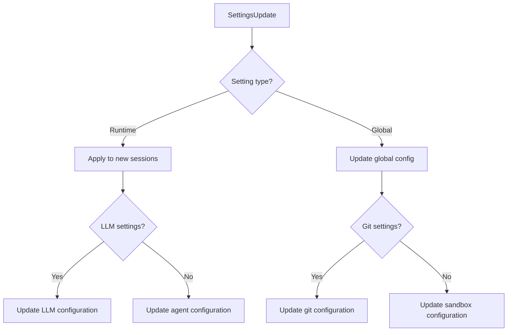
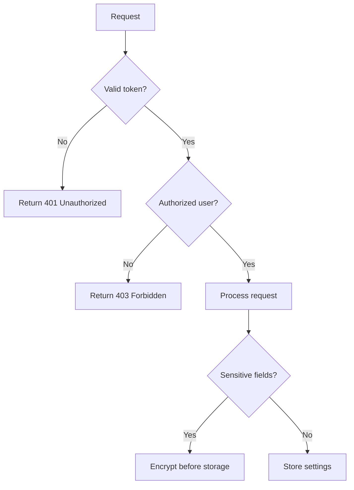

# Settings API

<cite>
**Referenced Files in This Document**   
- [settings.py](file://openhands/server/routes/settings.py)
- [settings.py](file://enterprise/storage/saas_settings_store.py)
- [user_settings.py](file://enterprise/storage/user_settings.py)
- [settings.py](file://openhands/storage/data_models/settings.py)
- [settings.types.ts](file://frontend/src/types/settings.ts)
- [settings-service.api.ts](file://frontend/src/settings-service/settings-service.api.ts)
- [settings.types.ts](file://frontend/src/settings-service/settings.types.ts)
</cite>

## Table of Contents
1. [Introduction](#introduction)
2. [API Endpoints](#api-endpoints)
3. [Request/Response Schemas](#requestresponse-schemas)
4. [Validation Rules](#validation-rules)
5. [Atomic Settings Updates](#atomic-settings-updates)
6. [Error Handling](#error-handling)
7. [Frontend-Backend Synchronization](#frontend-backend-synchronization)
8. [Impact on Agent Sessions](#impact-on-agent-sessions)
9. [Security Considerations](#security-considerations)

## Introduction

The Settings API provides a comprehensive interface for managing user preferences and configurations in the OpenHands application. This API enables users to customize their experience across various dimensions including LLM preferences, security configurations, integration settings, and UI preferences. The API supports full CRUD operations for user settings, allowing retrieval and modification of configuration options through standardized endpoints.

The settings system is designed to persist user preferences across sessions and synchronize them between the frontend and backend components. Settings are stored in a dedicated database table with encryption for sensitive fields, ensuring both data integrity and security. The API serves as the central point for all settings-related operations, handling validation, storage, and retrieval of user configuration data.

The Settings API plays a crucial role in personalizing the user experience, allowing configuration of agent behavior, LLM parameters, security policies, and integration options. These settings directly influence how the application functions, from the choice of language model to the level of confirmation required for actions.

**Section sources**
- [settings.py](file://openhands/server/routes/settings.py#L1-L212)
- [user_settings.py](file://enterprise/storage/user_settings.py#L1-L41)

## API Endpoints

The Settings API provides two primary endpoints for managing user settings: one for retrieving current settings and another for updating them. These endpoints follow REST conventions and are accessible via HTTP methods on the `/api/settings` route.

The GET endpoint (`GET /api/settings`) retrieves the current user settings configuration. This endpoint returns a comprehensive settings object containing all configurable options with their current values. The response includes both direct settings values and derived properties that indicate the status of certain features (such as whether API keys are set). Authentication is required to access this endpoint, ensuring that users can only retrieve their own settings.

**Diagram sources**
- [settings.py](file://openhands/server/routes/settings.py#L28-L88)
- [saas_settings_store.py](file://enterprise/storage/saas_settings_store.py#L43-L67)

The POST endpoint (`POST /api/settings`) allows users to update their settings configuration. This endpoint accepts a partial settings object, enabling users to modify specific settings without needing to provide values for all configurable options. The API merges the provided settings with existing values, preserving unchanged settings. This approach supports atomic updates of multiple settings simultaneously.

**Diagram sources**
- [settings.py](file://openhands/server/routes/settings.py#L133-L192)
- [saas_settings_store.py](file://enterprise/storage/saas_settings_store.py#L68-L99)

A deprecated endpoint (`POST /api/reset-settings`) was previously available for resetting user settings to default values but has been removed due to changes in the application's architecture. Attempts to access this endpoint will result in a 410 Gone response, indicating that the functionality is no longer available.

**Section sources**
- [settings.py](file://openhands/server/routes/settings.py#L90-L105)

## Request/Response Schemas

The Settings API uses well-defined schemas for both requests and responses, ensuring consistency and predictability in data exchange between the frontend and backend. These schemas are implemented using Pydantic models on the server side and TypeScript interfaces on the client side, providing type safety and validation.

The response schema for the GET endpoint is defined by the `GETSettingsModel` class, which extends the base `Settings` model with additional computed properties. These computed properties provide information about the status of certain settings without exposing sensitive data. For example, the schema includes `llm_api_key_set` and `search_api_key_set` boolean fields that indicate whether API keys are configured, without revealing the actual key values.

**Diagram sources**
- [settings.py](file://openhands/server/settings.py#L28-L37)
- [settings.py](file://openhands/storage/data_models/settings.py#L20-L51)

The request schema for the POST endpoint is based on the `Settings` model, which defines all configurable options with their data types and constraints. The API accepts partial updates, allowing clients to send only the settings they wish to modify. Sensitive fields like API keys are handled specially, with the actual key values being processed separately from other settings.

The frontend uses TypeScript interfaces that mirror the backend schemas, ensuring type consistency across the application. The `Settings` interface in the frontend codebase corresponds directly to the backend model, with field names mapped to a consistent naming convention using uppercase constants.

**Diagram sources**
- [settings.types.ts](file://frontend/src/types/settings.ts#L39-L65)
- [settings.types.ts](file://frontend/src/settings-service/settings.types.ts#L3-L38)

**Section sources**
- [settings.py](file://openhands/storage/data_models/settings.py#L20-L51)
- [settings.types.ts](file://frontend/src/types/settings.ts#L39-L73)
- [settings.types.ts](file://frontend/src/settings-service/settings.types.ts#L3-L54)

## Validation Rules

The Settings API implements comprehensive validation rules to ensure data integrity and prevent invalid configurations. These rules are enforced at multiple levels, including field-level validation, model-level validation, and business logic validation.

Field-level validation is implemented using Pydantic validators, which automatically validate data as it is processed by the API. For example, the `condenser_max_size` field has a validator that ensures its value is at least 20, preventing configurations that could lead to performance issues or unexpected behavior.

**Diagram sources**
- [settings.py](file://openhands/storage/data_models/settings.py#L112-L119)

The API also implements business logic validation to ensure that settings changes are consistent with the application's operational requirements. For example, when updating LLM settings, the API checks for existing values and preserves them if new values are not provided. This prevents accidental loss of configuration when partial updates are submitted.

Security-related validation is applied to sensitive fields such as API keys. The API uses `SecretStr` types to handle API keys, which automatically mask the actual values in logs and responses. Additionally, API keys are encrypted before storage in the database, with encryption handled by the settings store implementation.

The validation process also includes type checking and coercion, ensuring that all settings values are of the correct type before storage. For complex types like the MCP configuration, the API validates the structure and content of the configuration object to prevent malformed configurations from being saved.

**Section sources**
- [settings.py](file://openhands/storage/data_models/settings.py#L112-L119)
- [settings.py](file://openhands/server/routes/settings.py#L108-L126)

## Atomic Settings Updates

The Settings API supports atomic updates of multiple settings through a single request, ensuring that all changes are applied consistently. This approach prevents partial updates that could leave the application in an inconsistent state.

When a client submits a settings update, the API follows a transactional pattern to ensure atomicity. First, it loads the existing settings from storage. Then, it merges the new settings with the existing ones, applying validation rules to each field. Finally, it stores the complete updated settings object back to the database in a single operation.

**Diagram sources**
- [settings.py](file://openhands/server/routes/settings.py#L147-L182)

The merge process is designed to be intelligent, preserving existing values for settings that are not included in the update request. For example, if a client only wants to update the LLM model and agent type, they can submit a request with just those fields, and all other settings will remain unchanged.

This atomic update mechanism also handles special cases like API keys, which are processed separately from other settings. The API ensures that API key updates are handled securely, with proper encryption and validation before storage.

The atomic update approach simplifies client implementation by eliminating the need for multiple API calls to update different settings. Clients can submit all desired changes in a single request, knowing that either all changes will be applied successfully or none will be applied in case of validation errors.

**Section sources**
- [settings.py](file://openhands/server/routes/settings.py#L147-L182)
- [settings.py](file://openhands/storage/data_models/settings.py#L127-L186)

## Error Handling

The Settings API implements comprehensive error handling to provide clear feedback to clients about the success or failure of operations. The API uses standard HTTP status codes to indicate the outcome of requests, with detailed error messages in the response body when appropriate.

For successful operations, the API returns a 200 OK status code with a success message in the response body. For the GET endpoint, a 404 Not Found status is returned if no settings are found for the user, while the POST endpoint returns a 500 Internal Server Error if there is a problem storing the settings.

**Diagram sources**
- [settings.py](file://openhands/server/routes/settings.py#L28-L88)
- [settings.py](file://openhands/server/routes/settings.py#L133-L192)

The API also handles specific error conditions with appropriate responses. For example, the deprecated reset settings endpoint returns a 410 Gone status code with a message explaining that the functionality has been removed. Authentication errors result in a 401 Unauthorized response, while validation errors would result in a 400 Bad Request response.

Error responses include descriptive messages that help clients understand the cause of the failure. For example, if there is a problem storing settings, the response will include an error message like "Something went wrong storing settings" to indicate the nature of the issue.

The API's error handling is designed to be informative without revealing sensitive information about the system's internal state. Error messages are carefully crafted to provide useful feedback to clients while maintaining security and preventing information disclosure.

**Section sources**
- [settings.py](file://openhands/server/routes/settings.py#L89-L105)
- [settings.py](file://openhands/server/routes/settings.py#L187-L192)

## Frontend-Backend Synchronization

The Settings API facilitates seamless synchronization between the frontend and backend components, ensuring that user preferences are consistently applied across the application. This synchronization is achieved through a combination of API endpoints, client-side caching, and real-time updates.

The frontend uses a query-based approach to retrieve and cache settings data. The `useSettings` hook in the frontend codebase manages the lifecycle of settings data, handling retrieval, caching, and error states. This hook uses React Query to manage the data fetching process, providing features like automatic refetching, caching, and error handling.

**Diagram sources**
- [settings-service.api.ts](file://frontend/src/settings-service/settings-service.api.ts#L11-L14)
- [use-settings.ts](file://frontend/src/hooks/query/use-settings.ts#L10-L12)

Client-side caching is implemented with a stale time of 5 minutes and a garbage collection time of 15 minutes. This ensures that the UI remains responsive while still providing up-to-date settings data. The cache is automatically invalidated when settings are updated, triggering a refetch to ensure consistency.

When settings are updated, the API ensures that changes are propagated to all relevant components. For example, changes to the LLM model or API key are immediately reflected in the agent configuration, affecting subsequent interactions. The synchronization mechanism also handles edge cases like network failures or concurrent updates from multiple devices.

The frontend also implements a fallback mechanism for cases where settings cannot be retrieved. If the API returns a 404 Not Found response, the frontend uses default settings to ensure that the application remains functional. This allows users to configure their preferences even when starting with a clean slate.

**Section sources**
- [use-settings.ts](file://frontend/src/hooks/query/use-settings.ts#L48-L92)
- [settings-service.api.ts](file://frontend/src/settings-service/settings-service.api.ts#L11-L25)

## Impact on Agent Sessions

Changes to user settings have a direct impact on active agent sessions, with certain settings taking effect immediately and others requiring session restart. The API handles this distinction by updating both runtime configuration and persistent storage when appropriate settings are modified.

Settings that affect the agent's behavior, such as the LLM model, confirmation mode, and security analyzer, are applied to new sessions immediately. When these settings are updated, the changes are reflected in the configuration of any new agent sessions created after the update. However, existing sessions continue with their original configuration to maintain consistency during ongoing tasks.

**Diagram sources**
- [settings.py](file://openhands/server/routes/settings.py#L159-L179)

Global settings like git configuration and sandbox resource factors are updated in the application's global configuration, affecting all subsequent sessions. For example, when the `remote_runtime_resource_factor` is changed, it immediately updates the sandbox configuration, influencing the resource allocation for new runtime instances.

The API also handles special cases like the MCP (Model Context Protocol) configuration, which defines the services available to the agent. Changes to MCP configuration are merged with existing settings, with configuration file settings taking priority over stored settings. This ensures that system-wide MCP configurations are preserved while allowing user-specific overrides.

Settings related to analytics and user consent trigger additional actions when modified. For example, when a user consents to analytics, the system captures a "user_activated" event in PostHog, enabling tracking of user engagement and feature usage.

The impact of settings changes is designed to balance immediate effect with stability. While most settings take effect for new sessions, critical changes that could disrupt ongoing work are deferred until the next session start, ensuring a consistent user experience.

**Section sources**
- [settings.py](file://openhands/server/routes/settings.py#L159-L180)
- [use-settings.ts](file://frontend/src/hooks/query/use-settings.ts#L64-L68)

## Security Considerations

The Settings API implements multiple security measures to protect user data and prevent unauthorized access to sensitive information. These measures include authentication, encryption, and careful handling of sensitive fields.

Authentication is required for all settings operations, ensuring that users can only access and modify their own settings. The API integrates with the application's authentication system, validating user tokens before processing any requests. Invalid tokens result in a 401 Unauthorized response, preventing unauthorized access.

**Diagram sources**
- [settings.py](file://openhands/server/routes/settings.py#L37-L87)

Sensitive fields like API keys are handled with special care. The API uses `SecretStr` types to automatically mask these values in logs and responses. Before storage, API keys are encrypted using Fernet encryption with a key derived from the JWT secret. This ensures that even if the database is compromised, the actual API key values remain protected.

The API also implements output filtering to prevent sensitive data from being exposed in responses. For example, while the API accepts `llm_api_key` in requests, it never returns the actual key value in responses. Instead, it provides boolean flags like `llm_api_key_set` to indicate whether a key is configured without revealing its value.

Database-level security is provided by the settings store implementation, which handles encryption and decryption transparently. The `SaasSettingsStore` class implements methods to encrypt and decrypt settings data, ensuring that sensitive fields are always stored in encrypted form.

The API follows the principle of least privilege, only exposing the minimum necessary information to the frontend. This reduces the attack surface and limits the potential impact of security vulnerabilities in client-side code.

**Section sources**
- [settings.py](file://openhands/server/routes/settings.py#L66-L75)
- [saas_settings_store.py](file://enterprise/storage/saas_settings_store.py#L326-L361)