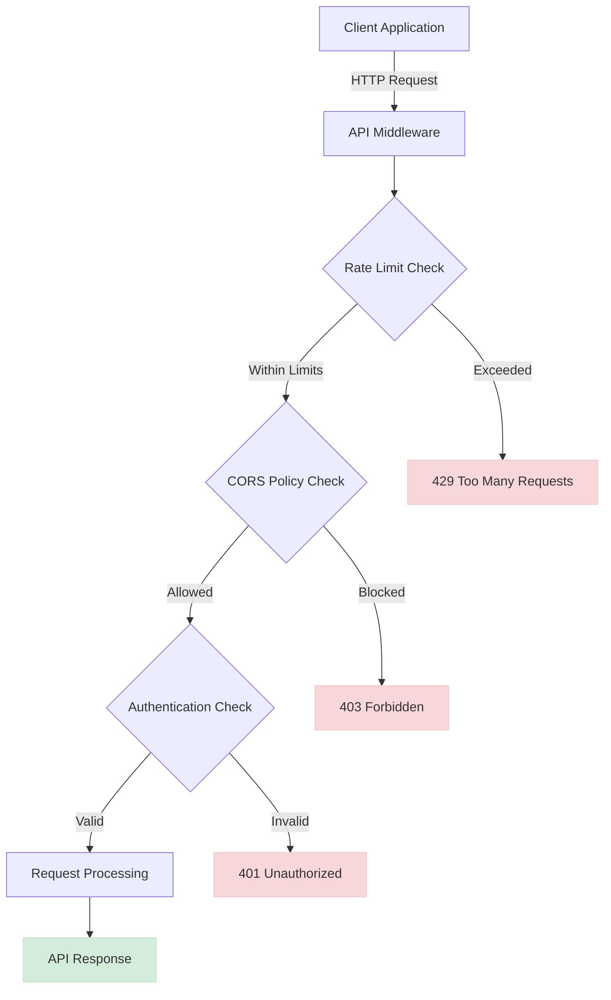

# API Endpoints Reference

<cite>
**Referenced Files in This Document**   
- [debugging.py](file://enterprise/server/routes/debugging.py)
- [email.py](file://enterprise/server/routes/email.py)
- [event_webhook.py](file://enterprise/server/routes/event_webhook.py)
- [feedback.py](file://enterprise/server/routes/feedback.py)
- [github_proxy.py](file://enterprise/server/routes/github_proxy.py)
- [mcp_patch.py](file://enterprise/server/routes/mcp_patch.py)
- [readiness.py](file://enterprise/server/routes/readiness.py)
- [api-keys.ts](file://frontend/src/api/api-keys.ts)
- [middleware.py](file://openhands/server/middleware.py)
- [app.py](file://openhands/server/app.py)
- [v1_router.py](file://openhands/app_server/v1_router.py)
</cite>

## Table of Contents
1. [Introduction](#introduction)
2. [API Versioning and Compatibility](#api-versioning-and-compatibility)
3. [Authentication and Security](#authentication-and-security)
4. [Rate Limiting and CORS Policies](#rate-limiting-and-cors-policies)
5. [Endpoint Groups](#endpoint-groups)
6. [Debugging Endpoints](#debugging-endpoints)
7. [Email Endpoints](#email-endpoints)
8. [Event Webhook Endpoints](#event-webhook-endpoints)
9. [Feedback Endpoints](#feedback-endpoints)
10. [GitHub Proxy Endpoints](#github-proxy-endpoints)
11. [MCP Patch Endpoints](#mcp-patch-endpoints)
12. [Readiness Endpoints](#readiness-endpoints)
13. [WebSocket Endpoints](#websocket-endpoints)
14. [API Key Management](#api-key-management)
15. [Error Handling](#error-handling)
16. [Practical Examples](#practical-examples)
17. [Conclusion](#conclusion)

## Introduction

The OpenHands API provides a comprehensive set of endpoints for interacting with the OpenHands platform. This documentation covers all backend API endpoints, including RESTful endpoints, WebSocket connections, and specialized routes for debugging, email management, webhooks, feedback collection, GitHub integration, MCP patching, and system readiness checks.

The API is designed to support various integration scenarios, from simple user interactions to complex automation workflows. Each endpoint group serves a specific purpose in the overall system architecture, enabling developers to build applications that leverage the full capabilities of the OpenHands platform.

The API follows RESTful principles for most endpoints, using standard HTTP methods and status codes. Authentication is primarily handled through session-based mechanisms with support for API keys for programmatic access. The system also implements comprehensive security measures including rate limiting, CORS policies, and secure authentication flows.

**Section sources**
- [app.py](file://openhands/server/app.py#L66-L96)
- [v1_router.py](file://openhands/app_server/v1_router.py#L1-L18)

## API Versioning and Compatibility

The OpenHands API implements a versioning strategy to ensure backward compatibility and smooth transitions between API versions. The primary API version is v1, which is enabled through configuration settings in the server environment.

API versioning is implemented through URL prefixes, with the v1 API accessible under the `/api/v1` prefix. This allows multiple API versions to coexist, enabling gradual migration from older versions to newer ones. The versioning system supports both backward compatibility for existing clients and forward-looking features for new implementations.

The API version is also exposed in the server metadata, allowing clients to programmatically determine the available version. This information can be used to adapt client behavior based on the server capabilities. When new features are introduced or existing ones are modified, they are typically added to a new API version while maintaining the previous version for compatibility.

Deprecation of API endpoints follows a structured process. When an endpoint is scheduled for removal, it is first marked as deprecated in the documentation and API metadata. During this period, clients receive warnings when using the deprecated endpoint. After a reasonable grace period, the endpoint is removed in a subsequent major version release.

The system also supports feature flags that can enable or disable specific API endpoints based on configuration. This allows for gradual rollout of new features and easy rollback if issues are discovered. Feature flags are particularly useful for experimental endpoints that may change significantly before becoming stable.

**Section sources**
- [app.py](file://openhands/server/app.py#L93-L94)
- [v1_router.py](file://openhands/app_server/v1_router.py#L12)

## Authentication and Security

The OpenHands API implements a multi-layered authentication and security system to protect user data and system resources. Authentication is primarily handled through session-based mechanisms using JWT (JSON Web Tokens) with support for various authentication methods including cookie-based authentication and API keys.

The authentication system is built around Keycloak for identity management, providing secure user authentication and authorization. When users log in, they receive JWT tokens that are used for subsequent API requests. These tokens contain user information and permissions, allowing the server to make authorization decisions without additional database queries.

For programmatic access, the API supports API keys that can be generated and managed through the API itself. API keys provide a secure way for applications to authenticate without requiring user credentials. Each API key has a unique identifier and a full key value that is only revealed upon creation, following security best practices.

The system implements secure token handling with refresh tokens to maintain user sessions without requiring frequent re-authentication. Access tokens have a limited lifespan, while refresh tokens allow for obtaining new access tokens without requiring the user to log in again. This balance between security and user experience is crucial for maintaining both security and usability.

Security measures include protection against common vulnerabilities such as CSRF (Cross-Site Request Forgery) and XSS (Cross-Site Scripting). The API also implements secure cookie policies, including the use of HttpOnly and Secure flags, to prevent client-side script access and ensure cookies are only transmitted over HTTPS connections.

**Section sources**
- [email.py](file://enterprise/server/routes/email.py#L6-L9)
- [middleware.py](file://openhands/server/middleware.py#L16-L48)
- [app.py](file://openhands/server/app.py#L75-L80)

## Rate Limiting and CORS Policies

The OpenHands API implements comprehensive rate limiting and CORS (Cross-Origin Resource Sharing) policies to protect against abuse and ensure secure cross-origin access. These mechanisms are crucial for maintaining system stability and security in a multi-tenant environment.

Rate limiting is implemented using an in-memory rate limiter that tracks requests per client IP address. The default configuration allows 2 requests per second, with additional protection against burst requests. When a client exceeds the rate limit, the API returns a 429 Too Many Requests status code with a Retry-After header indicating when the client can make another request.

The rate limiting middleware is selectively applied to API endpoints, excluding static assets which have their own caching strategy. This ensures that legitimate users can access the application interface while protecting API endpoints from excessive requests. The rate limiter also includes a sleep mechanism that introduces a small delay for requests that exceed the threshold but are not outright rejected, helping to smooth out request patterns.

CORS policies are implemented through a custom middleware that extends the standard FastAPI CORS middleware. The system allows flexible configuration through environment variables, with a default setting that permits any localhost or 127.0.0.1 origin regardless of port. This facilitates development and testing while maintaining security in production environments.

For non-localhost origins, the CORS policy follows the configured permitted origins specified in the PERMITTED_CORS_ORIGINS environment variable. The middleware allows all methods and headers, with credentials support enabled to allow cookie-based authentication across origins. This configuration strikes a balance between security and functionality, enabling legitimate cross-origin requests while preventing unauthorized access.

The system also implements cache control headers to prevent caching of sensitive API responses. Dynamic content is marked with no-cache, no-store directives, while static assets are configured for aggressive caching with immutable flags, optimizing performance without compromising security.



**Diagram sources**
- [middleware.py](file://openhands/server/middleware.py#L70-L131)
- [middleware.py](file://openhands/server/middleware.py#L16-L48)

**Section sources**
- [middleware.py](file://openhands/server/middleware.py#L1-L131)

## Endpoint Groups

The OpenHands API is organized into logical endpoint groups, each serving a specific purpose within the system. This modular design allows for better maintainability and enables selective enabling of features based on deployment requirements.

The endpoint groups include debugging, email management, event webhooks, feedback collection, GitHub proxy, MCP patching, and readiness checks. Each group is implemented as a separate router that can be independently mounted to the main application. This architecture facilitates code organization and allows for easy extension of the API with new functionality.

The grouping also reflects the security model of the application, with different endpoint groups having different security requirements and access controls. For example, debugging endpoints are typically restricted to non-production environments, while user-facing endpoints like email management have more permissive access controls.

The endpoint groups are designed to be cohesive, with related functionality grouped together. This makes it easier for developers to understand the API structure and find the endpoints they need. The grouping also facilitates documentation, as each group can be documented separately with its own set of examples and use cases.

Some endpoint groups are conditionally enabled based on environment variables or configuration settings. This allows for feature toggles and gradual rollout of new functionality. For example, the GitHub proxy endpoints are only enabled when the GITHUB_PROXY_ENDPOINTS environment variable is set, preventing accidental exposure in production environments.

The modular design also supports independent testing of endpoint groups, allowing for more focused test suites and easier identification of issues. Each group can be tested in isolation, reducing test complexity and improving test reliability.

**Section sources**
- [debugging.py](file://enterprise/server/routes/debugging.py#L19)
- [email.py](file://enterprise/server/routes/email.py#L18)
- [event_webhook.py](file://enterprise/server/routes/event_webhook.py#L28)
- [feedback.py](file://enterprise/server/routes/feedback.py#L15)
- [github_proxy.py](file://enterprise/server/routes/github_proxy.py#L18)
- [mcp_patch.py](file://enterprise/server/routes/mcp_patch.py#L14)
- [readiness.py](file://enterprise/server/routes/readiness.py#L8)

## Debugging Endpoints

The debugging endpoints provide tools for system administrators and developers to monitor and troubleshoot the OpenHands platform. These endpoints are specifically designed for diagnostic purposes and are typically disabled in production environments to prevent potential security risks.

The debugging endpoints include functionality for monitoring database connection pool statistics, stress testing database connections, and simulating event loop blocking. These tools help identify performance bottlenecks and resource constraints under various load conditions.

Access to debugging endpoints is controlled by the ADD_DEBUGGING_ROUTES environment variable, which must be explicitly enabled. This safety mechanism prevents accidental exposure of these powerful diagnostic tools in production environments where they could be misused or lead to system instability.

The /pool-stats endpoint returns real-time metrics about the SQLAlchemy connection pool, including the number of checked-in connections, checked-out connections, and overflow connections. This information is valuable for understanding database resource utilization and identifying potential connection leaks.

The /test-db and /a-test-db endpoints allow for stress testing of the database connection pool using multiple threads or async coroutines respectively. These endpoints help evaluate the system's behavior under concurrent load and can reveal issues with connection pool configuration or database performance.

The /lock-main-runloop endpoint deliberately blocks the main asyncio event loop for a specified duration. This simulates what happens when CPU-intensive operations or blocking I/O operations are incorrectly used in async code, helping developers understand the impact of such operations on system responsiveness.

```mermaid
flowchart LR
A[Client] --> B[/debugging/pool-stats]
A --> C[/debugging/test-db]
A --> D[/debugging/a-test-db]
A --> E[/debugging/lock-main-runloop]
B --> F[Database Pool Metrics]
C --> G[Threaded DB Stress Test]
D --> H[Async DB Stress Test]
E --> I[Event Loop Blocking]
style B fill:#e7f3ff,stroke:#4a90e2
style C fill:#e7f3ff,stroke:#4a90e2
style D fill:#e7f3ff,stroke:#4a90e2
style E fill:#ffebee,stroke:#f44336
classDef endpoint fill:#e7f3ff,stroke:#4a90e2,stroke-width:2px;
classDef warning fill:#ffebee,stroke:#f44336,stroke-width:2px;
class E warning;
```

**Diagram sources**
- [debugging.py](file://enterprise/server/routes/debugging.py#L38-L112)

**Section sources**
- [debugging.py](file://enterprise/server/routes/debugging.py#L1-L162)

## Email Endpoints

The email endpoints provide functionality for managing user email addresses within the OpenHands platform. These endpoints handle email updates, verification, and related operations, ensuring that user contact information is accurate and verified.

The primary endpoint is POST /api/email, which allows users to update their email address. The request requires a JSON payload with the new email address, which is validated against a regular expression pattern to ensure it follows standard email format. The endpoint integrates with Keycloak for user management, updating the user's email in the identity provider.

After updating the email address, the system automatically initiates the verification process by sending a verification email to the new address. This ensures that users can only use email addresses they control, preventing unauthorized access through email spoofing.

The PUT /api/email/verify endpoint allows users to resend the verification email if needed. This is useful if the initial verification email was not received or has expired. The endpoint triggers Keycloak to send a new verification email with a fresh token.

The GET /api/email/verified endpoint serves as the callback for email verification. When users click the verification link in their email, they are redirected to this endpoint, which marks their email as verified in the system. The endpoint then redirects users back to the settings page with appropriate authentication cookies.

The email endpoints implement comprehensive error handling for various scenarios, including invalid email formats, Keycloak API errors, and network issues. Error responses include descriptive messages to help clients understand and handle the specific error condition.

Security considerations include ensuring that email updates are performed by authenticated users and that the new email address is verified before being fully activated. The system also maintains the user's existing authentication session during the email update process, providing a seamless user experience.

**Section sources**
- [email.py](file://enterprise/server/routes/email.py#L1-L137)

## Event Webhook Endpoints

The event webhook endpoints provide a mechanism for external systems to receive notifications about events occurring within the OpenHands platform. These endpoints support both individual event delivery and batched operations for improved efficiency.

The primary endpoint is POST /event-webhook/{path:path}, which accepts event data for a specific conversation. The path parameter includes the conversation ID and subpath, allowing the system to route the event to the appropriate conversation. The endpoint validates the X-Session-API-Key header to ensure that only authorized systems can send events.

For improved performance with multiple related operations, the API provides a batch endpoint at POST /event-webhook/batch. This endpoint accepts an array of batch operations, each specifying a method (currently only POST is supported), path, and content. The batch operations are processed in the background, allowing the API to return immediately with a 202 Accepted status.

The webhook system supports several types of event data, including agent state updates, conversation metadata, conversation statistics, and individual events. Each type of data is stored in a specific subpath within the conversation directory, allowing for organized storage and retrieval.

The system implements robust error handling for webhook operations. Individual operations within a batch that fail are logged but do not prevent other operations from being processed. This ensures that partial failures do not result in complete batch rejection, improving reliability in the presence of transient errors.

Security is maintained through the X-Session-API-Key header, which is validated against the expected session API key for the conversation. This prevents unauthorized systems from injecting events into conversations. The system also ignores updates to sensitive paths like settings.json and secrets.json to prevent security vulnerabilities.

The webhook endpoints are designed to be idempotent where possible, allowing clients to retry failed operations without causing duplicate effects. This is particularly important for reliable event delivery in distributed systems where network issues may occur.

**Section sources**
- [event_webhook.py](file://enterprise/server/routes/event_webhook.py#L1-L242)

## Feedback Endpoints

The feedback endpoints enable users to provide ratings and comments on conversations and individual events within the OpenHands platform. This feedback is valuable for improving the system's performance and understanding user satisfaction.

The primary endpoint is POST /feedback/conversation, which accepts feedback for a conversation. The request body includes the conversation ID, optional event ID, a rating from 1 to 5, an optional reason, and optional metadata. The rating is validated to ensure it falls within the acceptable range before being stored.

The endpoint creates a new feedback record in the database, associating it with the specified conversation and optionally a specific event. This allows for granular feedback on individual interactions within a conversation, providing detailed insights into user experience.

The GET /feedback/conversation/{conversation_id}/batch endpoint retrieves feedback status for all events in a conversation. This allows clients to efficiently determine which events have received feedback and display appropriate indicators to users. The response includes a mapping of event IDs to feedback status, including whether feedback exists and the rating if available.

The feedback system is designed to be flexible, supporting both conversation-level and event-level feedback. This enables different use cases, from overall satisfaction ratings to detailed feedback on specific agent responses or actions.

Security measures ensure that users can only provide feedback for conversations they own. The system verifies the conversation belongs to the authenticated user before accepting feedback, preventing unauthorized feedback submission.

The feedback data is stored in a dedicated table with fields for conversation ID, event ID, rating, reason, and metadata. This structure allows for efficient querying and analysis of feedback data, supporting both real-time display and long-term trend analysis.

**Section sources**
- [feedback.py](file://enterprise/server/routes/feedback.py#L1-L150)

## GitHub Proxy Endpoints

The GitHub proxy endpoints facilitate authentication flows for feature branches and staging environments. These endpoints act as an intermediary between Keycloak and GitHub, enabling OAuth authentication with dynamic callback URLs.

The proxy is designed to address the limitation of GitHub's OAuth system, which allows only a fixed number of callback URLs. By using a proxy, the system can support multiple subdomains and dynamic environments without requiring separate GitHub OAuth applications for each.

The primary endpoint is GET /github-proxy/{subdomain}/login/oauth/authorize, which initiates the OAuth flow. This endpoint captures the original state and redirect_uri parameters, encrypts them, and replaces them with proxy-specific values. The encrypted data is stored in the state parameter, allowing it to be recovered later.

The callback endpoint at GET /github-proxy/callback receives the response from GitHub, decrypts the state parameter to recover the original state and redirect_uri, and redirects the user to the appropriate destination. This completes the OAuth flow while maintaining the integrity of the original authentication request.

The POST /github-proxy/{subdomain}/login/oauth/access_token endpoint proxies requests to GitHub's access token endpoint. This ensures that the token request is sent from the proxy server, maintaining consistency with the authorization request.

Additional POST endpoints at /github-proxy/{subdomain}/{path:path} provide general proxy functionality for other GitHub API calls, allowing the system to route requests through the proxy as needed.

The GitHub proxy functionality is conditionally enabled through the GITHUB_PROXY_ENDPOINTS environment variable, preventing accidental exposure in production environments. This safety mechanism ensures that the proxy is only active in appropriate environments like staging or feature branches.

**Section sources**
- [github_proxy.py](file://enterprise/server/routes/github_proxy.py#L1-L112)

## MCP Patch Endpoints

The MCP (Model Control Protocol) patch endpoints provide integration with external services to extend the capabilities of the OpenHands platform. These endpoints enable the addition of specialized functionality through proxy servers.

The primary functionality is implemented in the patch_mcp_server function, which conditionally enables integration with the Tavily search engine. This integration is controlled by the ENABLE_MCP_SEARCH_ENGINE environment variable, allowing for easy toggling of the feature.

When enabled, the system creates a proxy client to the Tavily MCP package and mounts it as a proxy server under the 'tavily' prefix. This allows the OpenHands agent to access search capabilities through the MCP interface, enhancing its ability to gather information from the web.

The integration uses the TAVILY_API_KEY environment variable for authentication with the Tavily service. If the API key is not configured, the integration is skipped with a warning message, allowing the system to continue operating without search capabilities.

The MCP patching system is designed to be extensible, allowing for the addition of other external services beyond search. The architecture supports mounting multiple proxy servers, each providing different capabilities to the agent.

The patching mechanism is applied at startup, modifying the MCP server to include the additional capabilities. This ensures that the extended functionality is available whenever the agent requires it, without requiring changes to the agent's code.

**Section sources**
- [mcp_patch.py](file://enterprise/server/routes/mcp_patch.py#L1-L33)

## Readiness Endpoints

The readiness endpoints provide health checks for the OpenHands platform, allowing external systems to determine if the service is ready to handle requests. These endpoints are crucial for deployment orchestration and monitoring.

The primary endpoint is GET /ready, which performs comprehensive health checks on the system's dependencies. The endpoint verifies connectivity to both the database and Redis cache, returning a 503 Service Unavailable status if either dependency is inaccessible.

The database check executes a simple query (SELECT 1) to verify that the database connection is functional and responsive. This goes beyond a simple connection check by ensuring that the database can process queries, detecting issues like database locks or performance problems.

The Redis check uses the PING command to verify that the Redis server is responsive. This ensures that the caching layer is available, which is critical for system performance and session management.

If both checks pass, the endpoint returns a simple "OK" response with a 200 status code, indicating that the service is ready to handle traffic. This simple response format is easy for monitoring systems to parse and act upon.

The readiness endpoint is designed to be lightweight and fast, minimizing its impact on system resources while providing reliable health information. It does not perform deep application logic checks, focusing instead on the core dependencies that must be available for the service to function.

This endpoint is typically used by load balancers and container orchestration platforms to determine when to route traffic to a service instance. It helps ensure that only healthy instances receive traffic, improving overall system reliability.

**Section sources**
- [readiness.py](file://enterprise/server/routes/readiness.py#L1-L36)

## WebSocket Endpoints

The OpenHands platform utilizes WebSocket connections for real-time communication between the client and server. These connections enable instant updates and interactive features that would not be possible with traditional HTTP polling.

WebSocket connections are established to the /events/socket endpoint, providing a persistent bidirectional channel for event streaming. This allows the server to push updates to the client as they occur, such as new conversation messages, agent state changes, and file system updates.

The WebSocket implementation includes comprehensive connection lifecycle management, handling connection establishment, message processing, error conditions, and graceful closure. The system detects and handles various connection states, including connecting, open, closing, and closed.

Error handling is robust, with specific handling for different WebSocket close codes. Normal closure (code 1000) is treated as an expected disconnection, while other codes trigger error states and appropriate user notifications. This allows the client to distinguish between intentional disconnections and errors.

The WebSocket system supports message queuing and reconnection logic to maintain a reliable user experience. When connections are lost, the client automatically attempts to reconnect, preserving the application state and minimizing disruption to the user.

Security is maintained through authentication tokens passed during the WebSocket handshake, ensuring that only authorized users can establish connections. The system also implements message validation to prevent malicious content from being transmitted through the WebSocket channel.

The frontend implementation includes a WebSocket context and custom hooks to manage the connection state and provide a clean API for components to send and receive messages. This abstraction simplifies the use of WebSockets throughout the application.

**Section sources**
- [use-websocket.ts](file://frontend/src/hooks/use-websocket.ts#L42-L85)
- [conversation-websocket-context.tsx](file://frontend/src/contexts/conversation-websocket-context.tsx#L82-L156)

## API Key Management

The OpenHands platform provides API key management functionality to support programmatic access to the API. This system allows users to create, list, and delete API keys for use in automated workflows and integrations.

The API key system is exposed through endpoints that enable CRUD operations on API keys. Users can retrieve their existing keys, create new ones, and delete keys they no longer need. When a new API key is created, the full key value is returned only once, following security best practices.

The frontend implementation includes an ApiKeysClient class that provides methods for interacting with the API key endpoints. The getApiKeys method retrieves all API keys for the current user, while createApiKey creates a new key with a specified name. The deleteApiKey method removes a key by its ID.

API keys are associated with specific users and are subject to the same permission model as other user actions. This ensures that API key usage is properly attributed and can be audited. The system also supports key rotation by allowing users to create new keys and delete old ones.

The API key system integrates with the platform's authentication and authorization mechanisms, ensuring that API key usage is properly validated and logged. Each API key operation requires authentication, preventing unauthorized access to key management functionality.

Security considerations include rate limiting on API key creation to prevent abuse, and logging of key creation and deletion for audit purposes. The system also ensures that API key values are handled securely, with appropriate encryption at rest and protection against accidental exposure.

**Section sources**
- [api-keys.ts](file://frontend/src/api/api-keys.ts#L1-L49)

## Error Handling

The OpenHands API implements a comprehensive error handling system to provide meaningful feedback to clients when issues occur. This system ensures that clients can understand and respond appropriately to different error conditions.

The API uses standard HTTP status codes to indicate the general nature of errors. Client errors (4xx) indicate issues with the request, such as invalid parameters or authentication problems, while server errors (5xx) indicate issues with processing the request on the server side.

For client errors, the API provides descriptive error messages that help clients understand what went wrong and how to fix it. For example, invalid email formats return a 400 Bad Request with a message explaining the required format. Authentication failures return 401 Unauthorized, while forbidden operations return 403 Forbidden.

Server errors include detailed logging on the server side while providing generic error messages to clients to avoid exposing sensitive information. The 500 Internal Server Error is used for unexpected issues, with additional context provided in the logs for debugging.

Specific endpoints implement additional error handling tailored to their functionality. For example, the email update endpoint handles Keycloak API errors and network issues, returning appropriate HTTP status codes and messages. The feedback endpoint validates ratings and returns 400 Bad Request for invalid values.

The system also implements global exception handling for specific exception types. For example, AuthenticationError exceptions are caught and converted to 401 Unauthorized responses with appropriate messages. This ensures consistent error handling across different parts of the application.

Error responses are structured to be machine-readable, typically including a message field with a human-readable description. This allows clients to display appropriate messages to users while also providing programmatic access to error information.

**Section sources**
- [email.py](file://enterprise/server/routes/email.py#L82-L90)
- [feedback.py](file://enterprise/server/routes/feedback.py#L83-L87)
- [app.py](file://openhands/server/app.py#L75-L80)

## Practical Examples

This section provides practical examples demonstrating common request/response flows for the OpenHands API. These examples illustrate how to use the various endpoints in real-world scenarios.

### Updating User Email

To update a user's email address, send a POST request to the email endpoint with the new email in the request body:

```http
POST /api/email HTTP/1.1
Content-Type: application/json
Authorization: Bearer <access_token>

{
  "email": "newemail@example.com"
}
```

The response will be:
```http
HTTP/1.1 200 OK
Content-Type: application/json

{
  "message": "Email changed"
}
```

### Submitting Feedback

To submit feedback for a conversation, send a POST request to the feedback endpoint:

```http
POST /feedback/conversation HTTP/1.1
Content-Type: application/json
Authorization: Bearer <access_token>

{
  "conversation_id": "conv_123",
  "event_id": 456,
  "rating": 5,
  "reason": "Excellent response, solved my problem quickly"
}
```

The response will be:
```http
HTTP/1.1 201 Created
Content-Type: application/json

{
  "status": "success",
  "message": "Feedback submitted successfully"
}
```

### Checking System Readiness

To check if the system is ready to handle requests, send a GET request to the readiness endpoint:

```http
GET /ready HTTP/1.1
```

A healthy system will respond with:
```http
HTTP/1.1 200 OK
Content-Type: text/plain

OK
```

While an unhealthy system might respond with:
```http
HTTP/1.1 503 Service Unavailable
Content-Type: application/json

{
  "detail": "Database is not accessible: connection timeout"
}
```

### Creating an API Key

To create a new API key, send a POST request to the keys endpoint:

```http
POST /api/keys HTTP/1.1
Content-Type: application/json
Authorization: Bearer <access_token>

{
  "name": "My Integration Key"
}
```

The response will include the full key value (only returned once):

```http
HTTP/1.1 200 OK
Content-Type: application/json

{
  "id": "key_123",
  "name": "My Integration Key",
  "key": "sk-abc123def456ghi789",
  "prefix": "sk-abc",
  "created_at": "2024-01-01T00:00:00Z"
}
```

**Section sources**
- [email.py](file://enterprise/server/routes/email.py#L31-L80)
- [feedback.py](file://enterprise/server/routes/feedback.py#L74-L106)
- [readiness.py](file://enterprise/server/routes/readiness.py#L11-L35)
- [api-keys.ts](file://frontend/src/api/api-keys.ts#L33-L37)

## Conclusion

The OpenHands API provides a comprehensive set of endpoints for interacting with the platform, supporting a wide range of use cases from user management to system monitoring. The API is designed with security, reliability, and ease of use in mind, following RESTful principles and industry best practices.

Key features of the API include robust authentication and authorization mechanisms, comprehensive error handling, and well-organized endpoint groups that reflect the logical structure of the system. The API also implements important security measures such as rate limiting, CORS policies, and secure token handling.

The documentation covers all major endpoint groups, including debugging, email management, event webhooks, feedback collection, GitHub proxy, MCP patching, and readiness checks. Each endpoint is described with its HTTP method, URL pattern, request/response schemas, and authentication requirements.

For developers integrating with the OpenHands platform, the API provides the tools needed to build powerful applications and automation workflows. The combination of RESTful endpoints and WebSocket connections enables both request-response interactions and real-time event streaming.

As the platform evolves, the API will continue to expand with new functionality while maintaining backward compatibility through proper versioning and deprecation policies. This ensures that existing integrations continue to work while new features are added to support emerging use cases.