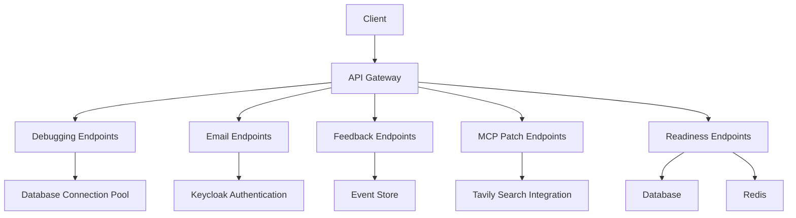
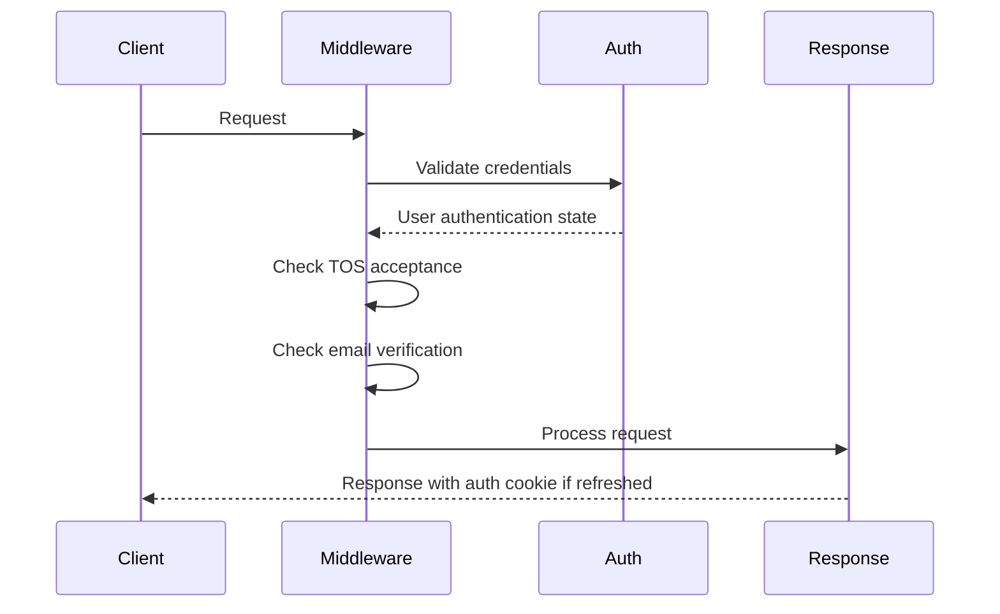
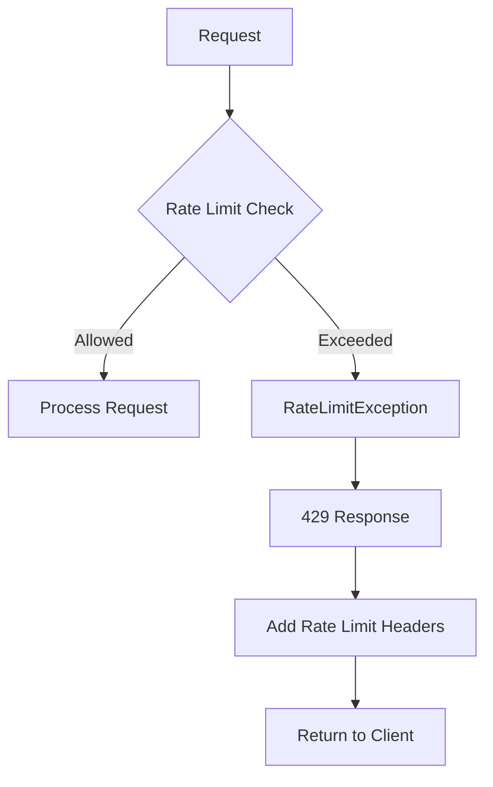

# Core API Endpoints

<cite>
**Referenced Files in This Document**   
- [debugging.py](file://enterprise/server/routes/debugging.py)
- [email.py](file://enterprise/server/routes/email.py)
- [feedback.py](file://enterprise/server/routes/feedback.py)
- [mcp_patch.py](file://enterprise/server/routes/mcp_patch.py)
- [readiness.py](file://enterprise/server/routes/readiness.py)
- [middleware.py](file://enterprise/server/middleware.py)
- [rate_limit.py](file://enterprise/server/rate_limit.py)
- [saas_server.py](file://enterprise/saas_server.py)
</cite>

## Table of Contents
1. [Introduction](#introduction)
2. [API Overview](#api-overview)
3. [Debugging Endpoints](#debugging-endpoints)
4. [Email Endpoints](#email-endpoints)
5. [Feedback Endpoints](#feedback-endpoints)
6. [MCP Patch Endpoints](#mcp-patch-endpoints)
7. [Readiness Endpoints](#readiness-endpoints)
8. [Authentication and Security](#authentication-and-security)
9. [Rate Limiting](#rate-limiting)
10. [CORS Policy](#cors-policy)
11. [Error Handling](#error-handling)
12. [API Versioning](#api-versioning)

## Introduction

This document provides comprehensive documentation for the core backend API endpoints in the OpenHands system. The API includes endpoints for debugging, email management, user feedback collection, MCP patching, and system readiness checks. These endpoints serve various purposes from system diagnostics to user interaction management.

The API follows RESTful principles with JSON request and response payloads. All endpoints require appropriate authentication except for the readiness probe. The API is designed to be consumed by both frontend applications and external services.

**Section sources**
- [saas_server.py](file://enterprise/saas_server.py#L80-L130)

## API Overview

The OpenHands API is built on FastAPI and exposes several endpoint categories for different system functions. The main categories include:

- **Debugging routes**: For system diagnostics and stress testing
- **Email routes**: For managing user email addresses and verification
- **Feedback routes**: For collecting user feedback on conversations
- **MCP patch routes**: For configuring MCP (Model Control Plane) settings
- **Readiness routes**: For health checks and system availability monitoring

The API is mounted under various prefixes with different security requirements. The system uses JWT-based authentication with cookie-based sessions for web clients and API keys for service-to-service communication.



**Diagram sources**
- [saas_server.py](file://enterprise/saas_server.py#L80-L130)
- [debugging.py](file://enterprise/server/routes/debugging.py#L1-L162)
- [email.py](file://enterprise/server/routes/email.py#L1-L137)
- [feedback.py](file://enterprise/server/routes/feedback.py#L1-L150)
- [mcp_patch.py](file://enterprise/server/routes/mcp_patch.py#L1-L33)
- [readiness.py](file://enterprise/server/routes/readiness.py#L1-L36)

**Section sources**
- [saas_server.py](file://enterprise/saas_server.py#L80-L130)

## Debugging Endpoints

The debugging endpoints provide tools for system diagnostics and stress testing. These routes are only enabled in non-production environments through the `ADD_DEBUGGING_ROUTES` environment variable.

### GET /debugging/pool-stats

Returns current database connection pool statistics.

**Parameters**
- None

**Response Schema**
```json
{
  "checked_in": 5,
  "checked_out": 2,
  "overflow": 0
}
```

**Status Codes**
- 200: Success - Returns pool statistics
- 404: Not Found - Route not enabled in production

**Example Request**
```bash
curl -X GET "http://localhost:3000/debugging/pool-stats"
```

**Example Response**
```json
{
  "checked_in": 5,
  "checked_out": 2,
  "overflow": 0
}
```

**Section sources**
- [debugging.py](file://enterprise/server/routes/debugging.py#L40-L54)

### GET /debugging/test-db

Stress tests the database connection pool using multiple threads.

**Query Parameters**
- `num_tests` (integer, default: 10): Number of concurrent database connections to create
- `delay` (integer, default: 1): Number of seconds each connection is held open

**Response Schema**
```json
"success"
```

**Status Codes**
- 200: Success - Test completed
- 404: Not Found - Route not enabled in production

**Example Request**
```bash
curl -X GET "http://localhost:3000/debugging/test-db?num_tests=5&delay=2"
```

**Example Response**
```json
"success"
```

**Section sources**
- [debugging.py](file://enterprise/server/routes/debugging.py#L56-L76)

### GET /debugging/a-test-db

Stress tests the async database connection pool.

**Query Parameters**
- `num_tests` (integer, default: 10): Number of concurrent async database connections to create
- `delay` (integer, default: 1): Number of seconds each connection is held open

**Response Schema**
```json
"success"
```

**Status Codes**
- 200: Success - Test completed
- 404: Not Found - Route not enabled in production

**Example Request**
```bash
curl -X GET "http://localhost:3000/debugging/a-test-db?num_tests=5&delay=2"
```

**Example Response**
```json
"success"
```

**Section sources**
- [debugging.py](file://enterprise/server/routes/debugging.py#L78-L92)

### GET /debugging/lock-main-runloop

Deliberately blocks the main asyncio event loop.

**Query Parameters**
- `duration` (integer, default: 10): Number of seconds to block the event loop

**Response Schema**
```json
"success"
```

**Status Codes**
- 200: Success - Loop was blocked and released
- 404: Not Found - Route not enabled in production

**Warning**: This endpoint will make the entire server unresponsive for the specified duration.

**Example Request**
```bash
curl -X GET "http://localhost:3000/debugging/lock-main-runloop?duration=5"
```

**Example Response**
```json
"success"
```

**Section sources**
- [debugging.py](file://enterprise/server/routes/debugging.py#L94-L110)

## Email Endpoints

The email endpoints handle user email management and verification processes.

### POST /api/email

Updates the user's email address and triggers verification.

**Request Body**
```json
{
  "email": "user@example.com"
}
```

**Request Schema**
- `email` (string): The new email address to set

**Validation Rules**
- Must match email format: `^[a-zA-Z0-9._%+-]+@[a-zA-Z0-9.-]+\.[a-zA-Z]{2,}$`
- Required field

**Response Schema**
```json
{
  "message": "Email changed"
}
```

**Status Codes**
- 200: Success - Email updated and verification sent
- 400: Bad Request - Invalid email format
- 401: Unauthorized - Authentication required
- 500: Internal Server Error - Failed to update email

**Authentication**: Required (Cookie-based JWT)

**Example Request**
```bash
curl -X POST "http://localhost:3000/api/email" \
  -H "Content-Type: application/json" \
  -d '{"email": "newemail@example.com"}'
```

**Example Response**
```json
{
  "message": "Email changed"
}
```

**Section sources**
- [email.py](file://enterprise/server/routes/email.py#L31-L80)

### PUT /api/email/verify

Resends the email verification message.

**Response Schema**
```json
{
  "message": "Email verification message sent"
}
```

**Status Codes**
- 200: Success - Verification email sent
- 401: Unauthorized - Authentication required

**Authentication**: Required (Cookie-based JWT)

**Example Request**
```bash
curl -X PUT "http://localhost:3000/api/email/verify"
```

**Example Response**
```json
{
  "message": "Email verification message sent"
}
```

**Section sources**
- [email.py](file://enterprise/server/routes/email.py#L93-L101)

### GET /api/email/verified

Callback endpoint for email verification completion.

**Response**
- 302 Redirect to settings page

**Authentication**: Required (Cookie-based JWT)

**Example Request**
```bash
curl -X GET "http://localhost:3000/api/email/verified"
```

**Example Response**
```
HTTP/1.1 302 Found
Location: http://localhost:3000/settings/user
```

**Section sources**
- [email.py](file://enterprise/server/routes/email.py#L104-L124)

## Feedback Endpoints

The feedback endpoints allow users to provide ratings and comments on conversations.

### POST /feedback/conversation

Submits feedback for a conversation.

**Request Body**
```json
{
  "conversation_id": "conv_123",
  "event_id": 456,
  "rating": 5,
  "reason": "Great assistance!",
  "metadata": {
    "agent_type": "CodeActAgent"
  }
}
```

**Request Schema**
- `conversation_id` (string): ID of the conversation being rated
- `event_id` (integer, optional): Specific event within the conversation
- `rating` (integer): Rating from 1-5
- `reason` (string, optional): Text explanation for the rating
- `metadata` (object, optional): Additional context about the feedback

**Validation Rules**
- `rating` must be between 1 and 5 (inclusive)
- `conversation_id` is required
- `event_id` must be a positive integer if provided

**Response Schema**
```json
{
  "status": "success",
  "message": "Feedback submitted successfully"
}
```

**Status Codes**
- 201: Created - Feedback successfully stored
- 400: Bad Request - Invalid rating or missing required fields
- 404: Not Found - Conversation not found
- 500: Internal Server Error - Database error

**Authentication**: Required

**Example Request**
```bash
curl -X POST "http://localhost:3000/feedback/conversation" \
  -H "Content-Type: application/json" \
  -d '{
    "conversation_id": "conv_123",
    "rating": 5,
    "reason": "Excellent help with coding"
  }'
```

**Example Response**
```json
{
  "status": "success",
  "message": "Feedback submitted successfully"
}
```

**Section sources**
- [feedback.py](file://enterprise/server/routes/feedback.py#L74-L106)

### GET /feedback/conversation/{conversation_id}/batch

Retrieves feedback status for all events in a conversation.

**Path Parameters**
- `conversation_id` (string): The ID of the conversation

**Response Schema**
```json
{
  "1": {
    "exists": true,
    "rating": 5,
    "reason": "Good start"
  },
  "2": {
    "exists": false
  }
}
```

**Status Codes**
- 200: Success - Returns feedback status for all events
- 401: Unauthorized - Authentication required
- 404: Not Found - Conversation not found

**Authentication**: Required

**Example Request**
```bash
curl -X GET "http://localhost:3000/feedback/conversation/conv_123/batch"
```

**Example Response**
```json
{
  "1": {
    "exists": true,
    "rating": 5,
    "reason": "Good start"
  },
  "2": {
    "exists": false
  }
}
```

**Section sources**
- [feedback.py](file://enterprise/server/routes/feedback.py#L109-L149)

## MCP Patch Endpoints

The MCP patch endpoints handle integration with external services through the MCP (Model Control Plane) framework.

### MCP Patch Initialization

The MCP patching is handled through server initialization rather than direct HTTP endpoints. The system checks for the `ENABLE_MCP_SEARCH_ENGINE` environment variable and the `TAVILY_API_KEY` to configure search integration.

**Configuration Environment Variables**
- `ENABLE_MCP_SEARCH_ENGINE` (boolean): Enables/disables MCP search integration
- `TAVILY_API_KEY` (string): API key for Tavily search service

**Initialization Flow**
1. Check if MCP search is enabled
2. Validate Tavily API key exists
3. Initialize proxy client with NpxStdioTransport
4. Mount proxy server under 'tavily' prefix

**Logging**
- INFO: "Tavily search integration initialized successfully"
- WARNING: "Tavily API key not found, skipping search integration"
- WARNING: "Tavily search integration is disabled"

**Section sources**
- [mcp_patch.py](file://enterprise/server/routes/mcp_patch.py#L1-L33)

## Readiness Endpoints

The readiness endpoints provide health checks for the system and its dependencies.

### GET /ready

Checks system readiness by verifying database and Redis connections.

**Response**
- Plain text: "OK"

**Status Codes**
- 200: OK - System is ready
- 503: Service Unavailable - One or more dependencies are not accessible

**Dependency Checks**
- Database: Executes a simple SELECT 1 query
- Redis: Sends a PING command

**Example Request**
```bash
curl -X GET "http://localhost:3000/ready"
```

**Example Response**
```
OK
```

**Section sources**
- [readiness.py](file://enterprise/server/routes/readiness.py#L11-L35)

## Authentication and Security

The API implements multiple authentication mechanisms and security middleware.

### Authentication Methods

The system supports three authentication methods:

1. **Cookie-based JWT**: For web browser clients
2. **Bearer Token**: For API clients
3. **Session API Key**: For internal service communication

The authentication is handled by the `SetAuthCookieMiddleware` which processes requests and validates credentials.

### Middleware Chain

The request processing flow includes:

1. CORS validation
2. Authentication check
3. Terms of Service verification
4. Email verification check
5. Rate limiting
6. Cache control



**Diagram sources**
- [middleware.py](file://enterprise/server/middleware.py#L26-L175)

**Section sources**
- [middleware.py](file://enterprise/server/middleware.py#L26-L175)

## Rate Limiting

The API implements rate limiting using Redis as the backend storage.

### Rate Limiter Configuration

Rate limiting is configured using the `create_redis_rate_limiter` function with a string pattern:

```
"10/second; 100/minute"
```

This creates limits of 10 requests per second and 100 requests per minute.

### Rate Limit Headers

Rate-limited responses include the following headers:

- `X-RateLimit-Limit`: The configured rate limit
- `X-RateLimit-Remaining`: Number of requests remaining
- `X-RateLimit-Reset`: Unix timestamp when the limit resets
- `Retry-After`: Seconds to wait before retrying (when limit is exceeded)

### Exception Handling

When a rate limit is exceeded, a `RateLimitException` is raised with a 429 status code. The exception handler adds the appropriate headers to the response.



**Diagram sources**
- [rate_limit.py](file://enterprise/server/rate_limit.py#L1-L138)

**Section sources**
- [rate_limit.py](file://enterprise/server/rate_limit.py#L1-L138)

## CORS Policy

The API implements a configurable CORS policy to control cross-origin requests.

### Allowed Origins

The CORS policy allows:
- All origins specified in `PERMITTED_CORS_ORIGINS`
- Any localhost/127.0.0.1 origin regardless of port

### Configuration

CORS is configured with the following settings:
- `allow_origins`: List of permitted origins
- `allow_credentials`: True (allows credentials)
- `allow_methods`: '*' (all methods)
- `allow_headers`: '*' (all headers)

The middleware extends the default CORS implementation to specifically allow localhost origins on any port.

**Section sources**
- [saas_server.py](file://enterprise/saas_server.py#L100-L106)

## Error Handling

The API implements comprehensive error handling with standardized responses.

### Standard Error Format

All error responses follow the format:
```json
{
  "error": "Error description"
}
```

### HTTP Status Codes

The API uses standard HTTP status codes:

| Code | Meaning | Description |
|------|---------|-------------|
| 200 | OK | Successful response |
| 201 | Created | Resource created successfully |
| 302 | Found | Redirect response |
| 400 | Bad Request | Client error in request |
| 401 | Unauthorized | Authentication required |
| 403 | Forbidden | Access denied |
| 404 | Not Found | Resource not found |
| 429 | Too Many Requests | Rate limit exceeded |
| 500 | Internal Server Error | Server error |
| 503 | Service Unavailable | Dependency not available |

### Exception Types

The system handles several specific exception types:
- `NoCredentialsError`: No authentication provided
- `ExpiredError`: Authentication token has expired
- `EmailNotVerifiedError`: User email not verified
- `TosNotAcceptedError`: User hasn't accepted Terms of Service
- `RateLimitException`: Rate limit exceeded

Each exception type has a dedicated handler that returns the appropriate status code.

**Section sources**
- [middleware.py](file://enterprise/server/middleware.py#L69-L97)
- [saas_server.py](file://enterprise/saas_server.py#L116-L127)

## API Versioning

The API follows a versioning strategy to ensure backward compatibility.

### Version Structure

The API uses semantic versioning with the format:
- `/api/v1` - Current stable version

The version is included in the URL path to allow multiple versions to coexist.

### Deprecation Policy

When endpoints are deprecated:
1. They remain available for at least 6 months
2. Deprecation notices are added to documentation
3. Alternative endpoints are provided
4. Monitoring is implemented to track usage

### Backward Compatibility

The system maintains backward compatibility by:
- Never removing required fields from responses
- Making new fields optional in requests
- Supporting multiple authentication methods during transitions
- Providing migration guides for breaking changes

The v1 API is mounted through the `v1_router` which includes various sub-routers for different functionality areas.

**Section sources**
- [v1_router.py](file://openhands/app_server/v1_router.py#L1-L18)
- [app.py](file://openhands/server/app.py#L93-L94)