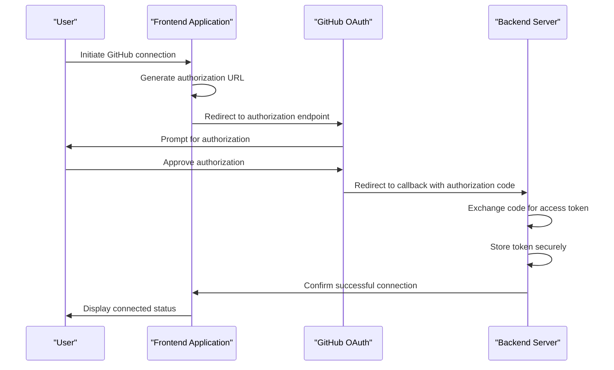
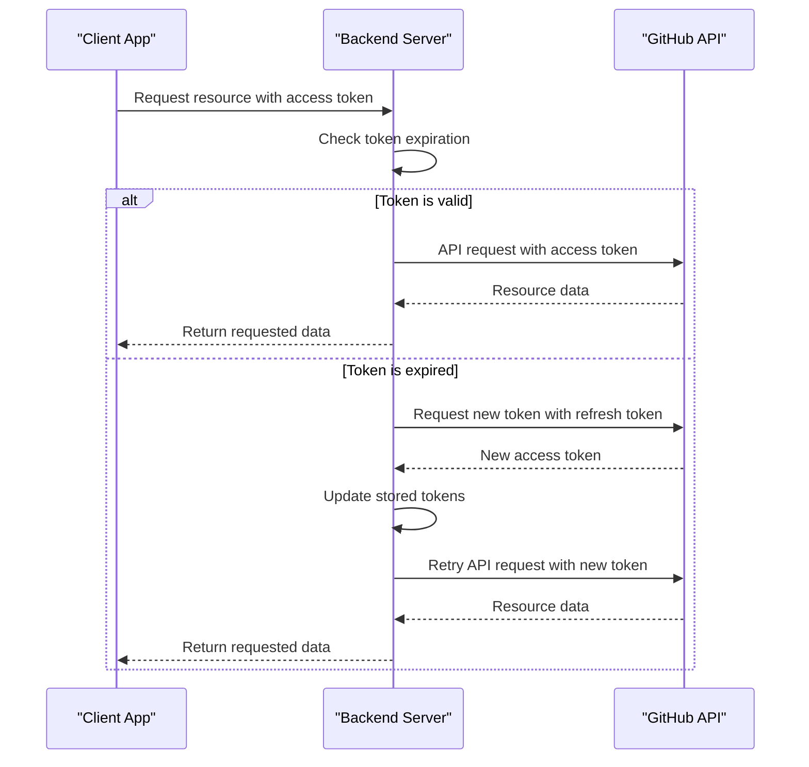
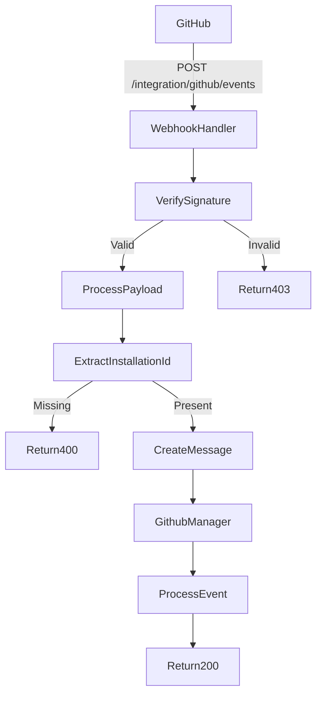
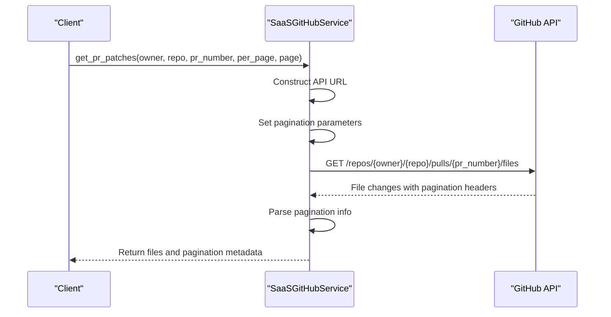
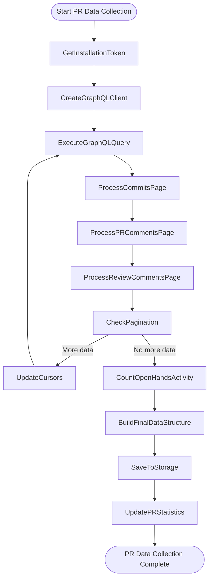
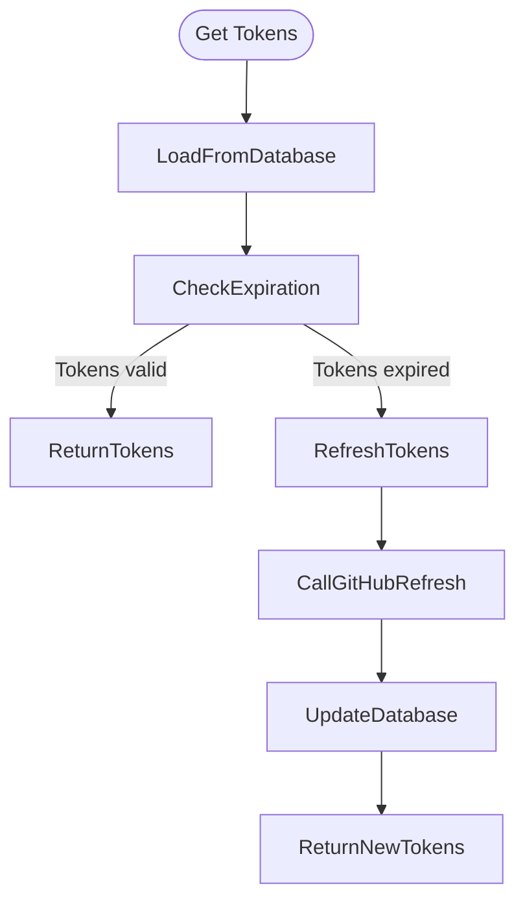
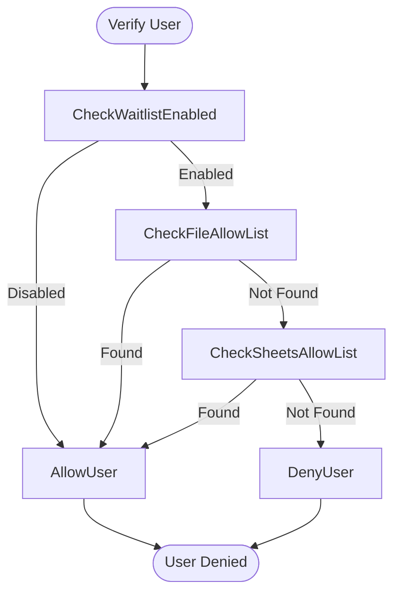
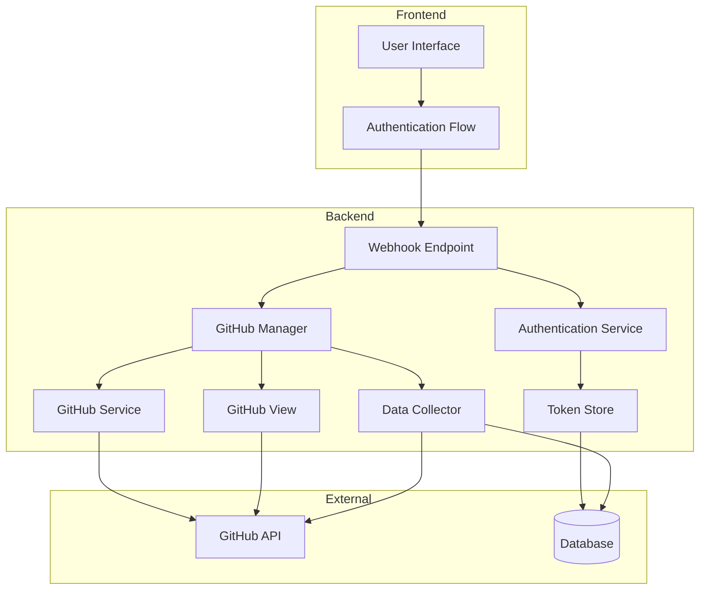

# GitHub Integration

<cite>
**Referenced Files in This Document**   
- [github.py](file://enterprise/server/routes/integration/github.py)
- [github_service.py](file://enterprise/integrations/github/github_service.py)
- [github_manager.py](file://enterprise/integrations/github/github_manager.py)
- [github_view.py](file://enterprise/integrations/github/github_view.py)
- [data_collector.py](file://enterprise/integrations/github/data_collector.py)
- [github_types.py](file://enterprise/integrations/github/github_types.py)
- [queries.py](file://enterprise/integrations/github/queries.py)
- [github_utils.py](file://enterprise/server/auth/github_utils.py)
- [auth_token_store.py](file://enterprise/storage/auth_token_store.py)
- [auth_tokens.py](file://enterprise/storage/auth_tokens.py)
- [github_callback_processor.py](file://enterprise/server/conversation_callback_processor/github_callback_processor.py)
- [github_proxy.py](file://enterprise/server/routes/github_proxy.py)
</cite>

## Table of Contents
1. [Introduction](#introduction)
2. [OAuth 2.0 Authentication Flow](#oauth-20-authentication-flow)
3. [Webhook Configuration](#webhook-configuration)
4. [Pull Request Operations](#pull-request-operations)
5. [Token Management](#token-management)
6. [User Identity Mapping](#user-identity-mapping)
7. [Security Considerations](#security-considerations)
8. [Error Handling](#error-handling)
9. [Integration Examples](#integration-examples)
10. [Architecture Overview](#architecture-overview)

## Introduction

The GitHub integration provides a comprehensive API for connecting repositories, handling authentication callbacks, configuring webhooks, and managing pull request operations. This documentation details the RESTful endpoints and their implementation, focusing on the OAuth 2.0 flow, webhook processing, and pull request interactions.

The integration enables users to connect their GitHub accounts, allowing the system to interact with repositories, issues, and pull requests. The architecture is designed to handle various GitHub events, process them through appropriate handlers, and maintain secure token storage for ongoing access.

**Section sources**
- [github.py](file://enterprise/server/routes/integration/github.py#L1-L83)
- [github_manager.py](file://enterprise/integrations/github/github_manager.py#L1-L345)

## OAuth 2.0 Authentication Flow

### Authorization URL Generation

The OAuth 2.0 flow begins with generating an authorization URL that redirects users to GitHub for authentication. The frontend generates this URL using the `generateAuthUrl` function, which constructs the appropriate parameters for the GitHub OAuth endpoint.

The authorization URL includes:
- Client ID for the application
- Response type (code)
- Redirect URI for callback handling
- Scope (openid, email, profile)
- State parameter containing the original request URL



**Diagram sources**
- [github_proxy.py](file://enterprise/server/routes/github_proxy.py#L46-L77)
- [github_utils.py](file://enterprise/server/auth/github_utils.py#L85-L127)

### Token Exchange and Refresh Mechanisms

After the user authorizes the application, GitHub redirects to the callback endpoint with an authorization code. The backend exchanges this code for an access token and refresh token, which are securely stored in the database.

The token exchange process involves:
1. Receiving the authorization code from GitHub
2. Exchanging the code for access and refresh tokens via GitHub's token endpoint
3. Storing tokens in the `auth_tokens` table with expiration information
4. Associating tokens with the user's Keycloak ID for future reference

Token refresh is handled automatically when access tokens expire. The system uses the refresh token to obtain new access tokens without requiring user interaction.



**Diagram sources**
- [auth_token_store.py](file://enterprise/storage/auth_token_store.py#L69-L208)
- [auth_tokens.py](file://enterprise/storage/auth_tokens.py#L1-L26)

## Webhook Configuration

### Webhook Endpoint

The GitHub integration provides a dedicated endpoint for receiving webhook events from GitHub repositories. This endpoint is configured in the GitHub App settings and secured with HMAC signature verification.



**Diagram sources**
- [github.py](file://enterprise/server/routes/integration/github.py#L45-L83)

### Signature Verification

The webhook endpoint verifies the authenticity of incoming requests using HMAC signature verification with the GitHub App webhook secret. This ensures that requests originate from GitHub and have not been tampered with.

The verification process:
1. Extracts the `x-hub-signature-256` header from the request
2. Computes the expected signature using the payload and webhook secret
3. Compares the signatures using a timing-attack-resistant comparison function
4. Rejects requests with invalid or missing signatures

**Section sources**
- [github.py](file://enterprise/server/routes/integration/github.py#L26-L42)

### Event Processing

When a webhook event is received, the system processes it through the following steps:
1. Parse the JSON payload
2. Extract the installation ID for the GitHub App
3. Create a message object with the payload and installation context
4. Pass the message to the GitHub manager for processing

The GitHub manager determines the appropriate action based on the event type and payload content, such as creating a new conversation for labeled issues or processing pull request comments.

**Section sources**
- [github.py](file://enterprise/server/routes/integration/github.py#L64-L75)
- [github_manager.py](file://enterprise/integrations/github/github_manager.py#L157-L184)

## Pull Request Operations

### Pull Request Patch Retrieval

The system provides functionality to retrieve patches for files changed in a pull request, with support for pagination. This allows clients to fetch PR changes in manageable chunks.



**Diagram sources**
- [github_service.py](file://enterprise/integrations/github/github_service.py#L75-L103)

### Repository Node ID Retrieval

For GraphQL operations, the system can retrieve the new format node ID for a repository using the REST API. This is necessary for making GraphQL queries that require the node ID format.

The process:
1. Make a GET request to the repositories endpoint with the numeric repository ID
2. Extract the `node_id` field from the response
3. Return the node ID for use in GraphQL queries

**Section sources**
- [github_service.py](file://enterprise/integrations/github/github_service.py#L105-L123)

### Pull Request Data Collection

The system collects comprehensive data about pull requests, including:
- Repository metadata (name, owner, languages)
- PR metadata (title, body, author, comments)
- Commit information (SHA, authors, message, stats)
- Review comments and general PR comments
- Merge status and statistics

This data is collected using GraphQL queries with pagination support to handle large PRs with many changes.



**Diagram sources**
- [data_collector.py](file://enterprise/integrations/github/data_collector.py#L421-L598)

## Token Management

### Token Storage

Authentication tokens are securely stored in the database using encrypted fields. The `auth_tokens` table stores:
- Keycloak user ID
- Identity provider (GitHub)
- Encrypted access token
- Encrypted refresh token
- Access token expiration timestamp
- Refresh token expiration timestamp

Tokens are encrypted using Fernet encryption with a key derived from the JWT secret.

**Section sources**
- [auth_tokens.py](file://enterprise/storage/auth_tokens.py#L1-L26)
- [auth_token_store.py](file://enterprise/storage/auth_token_store.py#L51-L67)

### Token Retrieval and Refresh

Tokens are retrieved from storage with automatic refresh functionality when they are close to expiration. The retrieval process:
1. Loads the token record from the database
2. Checks if the access token is expired or close to expiration
3. If needed, uses the refresh token to obtain new tokens
4. Updates the stored tokens with new values
5. Returns the current access token



**Diagram sources**
- [auth_token_store.py](file://enterprise/storage/auth_token_store.py#L69-L145)

## User Identity Mapping

### User Verification

The system verifies GitHub users against allow lists before processing their requests. User verification checks:
1. Text file allow list (if configured)
2. Google Sheets allow list (if configured)
3. Global waitlist status

Users must be present in at least one allow list to be considered allowed.



**Diagram sources**
- [github_utils.py](file://enterprise/server/auth/github_utils.py#L11-L79)

### Identity Provider Integration

GitHub user identities are mapped to internal Keycloak user IDs through the token manager. When a GitHub user authenticates:
1. The system extracts the GitHub user ID from the access token
2. Uses the token manager to find or create a corresponding Keycloak user ID
3. Associates the GitHub identity with the internal user account
4. Stores the mapping for future reference

This allows the system to maintain a consistent user identity across different authentication providers.

**Section sources**
- [github_utils.py](file://enterprise/server/auth/github_utils.py#L93-L109)

## Security Considerations

### Secure Token Storage

All GitHub access tokens are stored in encrypted form in the database. The encryption uses Fernet with a key derived from the application's JWT secret. Tokens are never stored in plaintext and are only decrypted when needed for API requests.

### Scope Validation

The system validates that users have appropriate permissions before processing GitHub events. For repository actions, the system checks if the user has write access to the repository by:
1. Checking if the user is a collaborator with admin or write permissions
2. Checking if the user is an organization member (for organization repositories)

### Permission Verification

Before processing any GitHub event, the system verifies that the user has permission to trigger actions. This prevents unauthorized users from initiating operations on repositories they don't have access to.

The permission verification process:
1. Extracts the user and repository information from the webhook payload
2. Uses the GitHub API to check the user's permissions on the repository
3. Only proceeds if the user has write or admin permissions

**Section sources**
- [github_manager.py](file://enterprise/integrations/github/github_manager.py#L95-L119)

## Error Handling

### GitHub Integration Failures

The system handles various GitHub integration failures with appropriate error responses:

| Error Type | Status Code | Description |
|-----------|------------|-------------|
| Invalid Token | 401 | GitHub access token is invalid or expired |
| Insufficient Permissions | 403 | User lacks required permissions for the operation |
| Rate Limiting | 429 | GitHub API rate limit exceeded |
| Repository Not Found | 404 | Specified repository does not exist or is inaccessible |
| Webhook Signature Mismatch | 403 | HMAC signature verification failed |
| Installation ID Missing | 400 | Webhook payload missing installation ID |

### Error Response Structure

Error responses follow a consistent JSON structure:

```json
{
  "error": "Descriptive error message"
}
```

For webhook processing errors, the system returns appropriate HTTP status codes while ensuring the GitHub App webhook delivery is marked as successful when possible.

**Section sources**
- [github.py](file://enterprise/server/routes/integration/github.py#L28-L42)
- [github_manager.py](file://enterprise/integrations/github/github_manager.py#L334-L339)

## Integration Examples

### Successful Integration Setup

#### Example 1: Repository Connection

1. User clicks "Connect GitHub" in the frontend
2. Frontend generates authorization URL and redirects user
3. User authorizes the application on GitHub
4. GitHub redirects to callback with authorization code
5. Backend exchanges code for access token
6. System stores encrypted tokens and creates user mapping
7. Frontend displays connected repositories

#### Example 2: Pull Request Processing

1. User labels an issue with "openhands" label
2. GitHub sends webhook to integration endpoint
3. System verifies webhook signature
4. Extracts installation ID and payload
5. Creates message object and passes to GitHub manager
6. Manager checks user permissions and creates conversation
7. System posts comment with conversation link on the issue

#### Example 3: Webhook Configuration

```bash
# Register webhook with GitHub API
curl -X POST https://api.github.com/app/hook \
  -H "Authorization: Bearer $INSTALLATION_TOKEN" \
  -H "Accept: application/vnd.github.v3+json" \
  -d '{
    "config": {
      "url": "https://your-domain.com/integration/github/events",
      "content_type": "json",
      "secret": "your-webhook-secret"
    },
    "events": ["issues", "issue_comment", "pull_request", "pull_request_review_comment"]
  }'
```

**Section sources**
- [github.py](file://enterprise/server/routes/integration/github.py#L45-L83)
- [github_manager.py](file://enterprise/integrations/github/github_manager.py#L157-L184)

## Architecture Overview

The GitHub integration architecture consists of several interconnected components that work together to provide seamless GitHub functionality:



**Diagram sources**
- [github.py](file://enterprise/server/routes/integration/github.py#L20-L23)
- [github_manager.py](file://enterprise/integrations/github/github_manager.py#L38-L47)
- [github_service.py](file://enterprise/integrations/github/github_service.py#L13-L33)
- [github_view.py](file://enterprise/integrations/github/github_view.py#L43-L44)
- [data_collector.py](file://enterprise/integrations/github/data_collector.py#L80-L88)