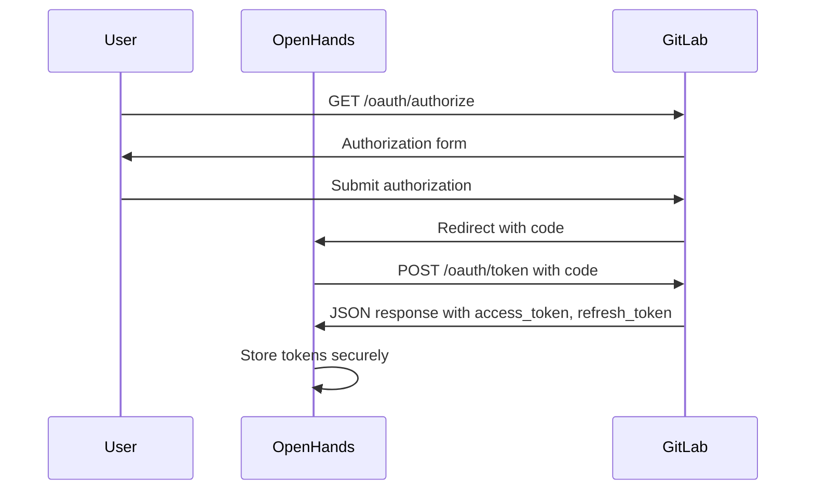
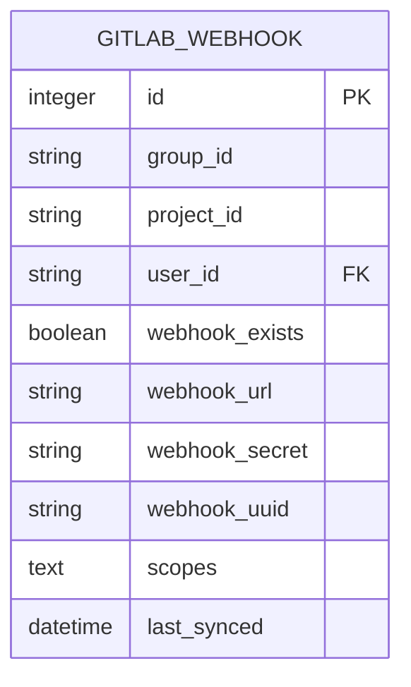
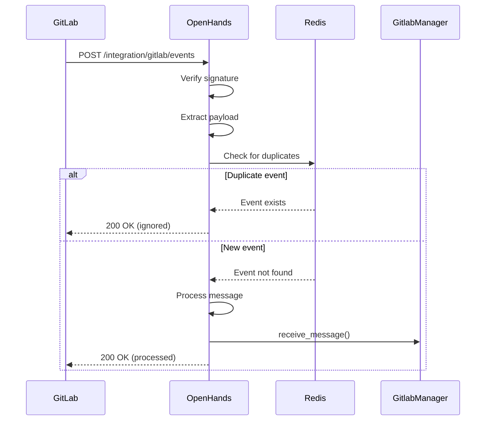
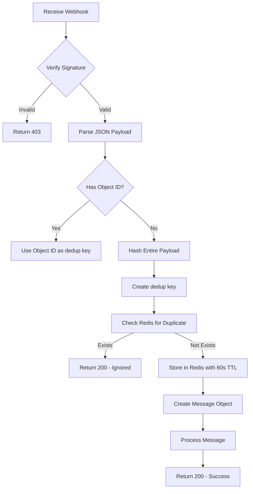
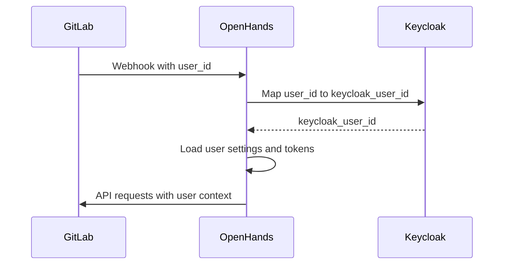

# GitLab Integration

<cite>
**Referenced Files in This Document**   
- [gitlab.py](file://enterprise/server/routes/integration/gitlab.py)
- [gitlab_manager.py](file://enterprise/integrations/gitlab/gitlab_manager.py)
- [gitlab_service.py](file://enterprise/integrations/gitlab/gitlab_service.py)
- [gitlab_view.py](file://enterprise/integrations/gitlab/gitlab_view.py)
- [gitlab_webhook.py](file://enterprise/storage/gitlab_webhook.py)
- [gitlab_webhook_store.py](file://enterprise/storage/gitlab_webhook_store.py)
- [token_manager.py](file://server/auth/token_manager.py)
- [gitlab_callback_processor.py](file://server/conversation_callback_processor/gitlab_callback_processor.py)
</cite>

## Table of Contents
1. [Introduction](#introduction)
2. [OAuth 2.0 Implementation](#oauth-20-implementation)
3. [Webhook Configuration](#webhook-configuration)
4. [Integration Endpoints](#integration-endpoints)
5. [Merge Request Operations](#merge-request-operations)
6. [Webhook Payload Processing](#webhook-payload-processing)
7. [Error Handling](#error-handling)
8. [Security Considerations](#security-considerations)
9. [User Identity Synchronization](#user-identity-synchronization)
10. [Example Integration Flow](#example-integration-flow)

## Introduction

The GitLab integration enables seamless connection between the OpenHands platform and GitLab repositories, allowing automated processing of issues, merge requests, and other GitLab events. This documentation details the RESTful API endpoints, OAuth 2.0 implementation, webhook configuration, and related components that facilitate this integration.

The integration follows a comprehensive architecture where GitLab events are received via webhook endpoints, authenticated using OAuth 2.0 tokens, and processed according to user permissions and repository access levels. The system handles various GitLab events including issues, merge requests, and comments, creating corresponding conversations in the OpenHands platform for automated resolution.

**Section sources**
- [gitlab.py](file://enterprise/server/routes/integration/gitlab.py#L1-L86)
- [gitlab_manager.py](file://enterprise/integrations/gitlab/gitlab_manager.py#L1-L262)

## OAuth 2.0 Implementation

The GitLab integration implements OAuth 2.0 for secure authentication and authorization. The implementation follows the authorization code flow with refresh tokens to maintain long-term access to GitLab resources.

### Authorization URL Parameters

The authorization URL is constructed with the following parameters:

- `client_id`: The GitLab application client ID
- `redirect_uri`: The callback URL where GitLab will redirect after authorization
- `scope`: The requested permissions scope (e.g., `api`, `read_user`, `read_repository`)
- `state`: A random string for CSRF protection
- `response_type`: Set to `code` for authorization code flow

The authorization endpoint follows the pattern: `https://gitlab.com/oauth/authorize`

### Token Exchange Process

After the user authorizes the application, GitLab redirects to the callback URL with an authorization code. The system exchanges this code for access and refresh tokens through the token endpoint:



**Diagram sources**
- [gitlab_service.py](file://enterprise/integrations/gitlab/gitlab_service.py#L47-L81)
- [token_manager.py](file://server/auth/token_manager.py#L205-L230)

### Refresh Token Handling

The integration implements automatic token refresh when access tokens expire. The refresh process follows these steps:

1. When an API request returns a 401 Unauthorized response, the system detects token expiration
2. The system uses the stored refresh token to obtain a new access token
3. The new access token is used to retry the original request
4. Both new tokens are securely stored for future use

The `SaaSGitLabService` class handles token management, with methods to retrieve the latest token from the token manager based on user ID or external authentication tokens.

```python
async def get_latest_token(self) -> SecretStr | None:
    if self.external_auth_token:
        return SecretStr(await self.token_manager.get_idp_token(
            self.external_auth_token.get_secret_value(), 
            idp=ProviderType.GITLAB
        ))
    elif self.external_auth_id:
        offline_token = await self.token_manager.load_offline_token(self.external_auth_id)
        return SecretStr(await self.token_manager.get_idp_token_from_offline_token(
            offline_token, ProviderType.GITLAB
        ))
    elif self.user_id:
        return SecretStr(await self.token_manager.get_idp_token_from_idp_user_id(
            self.user_id, ProviderType.GITLAB
        ))
```

**Section sources**
- [gitlab_service.py](file://enterprise/integrations/gitlab/gitlab_service.py#L47-L81)
- [token_manager.py](file://server/auth/token_manager.py#L205-L230)

## Webhook Configuration

The integration supports webhook configuration for receiving GitLab events. Webhooks are configured at both project and group levels, allowing the system to receive notifications for various GitLab activities.

### Webhook Database Schema

The `gitlab_webhook` table stores webhook configuration with the following schema:



**Diagram sources**
- [gitlab_webhook.py](file://enterprise/storage/gitlab_webhook.py#L1-L43)

### Webhook Installation Process

Webhooks are installed through the following process:

1. The system checks if the user has admin access to the resource (project or group)
2. It verifies whether a webhook already exists for the resource
3. If no webhook exists, it creates a new webhook with the configured URL and secret
4. The webhook configuration is stored in the database with a unique UUID

The installation process uses the GitLab API endpoints:
- For projects: `POST /projects/{project_id}/hooks`
- For groups: `POST /groups/{group_id}/hooks`

```python
async def install_webhook(
    self,
    resource_type: GitLabResourceType,
    resource_id: str,
    webhook_name: str,
    webhook_url: str,
    webhook_secret: str,
    webhook_uuid: str,
    scopes: list[str],
) -> tuple[str | None, WebhookStatus | None]:
```

**Section sources**
- [gitlab_service.py](file://enterprise/integrations/gitlab/gitlab_service.py#L405-L475)
- [gitlab_webhook_store.py](file://enterprise/storage/gitlab_webhook_store.py#L33-L78)

## Integration Endpoints

The GitLab integration exposes RESTful endpoints for handling GitLab events and managing the integration.

### Events Endpoint

The primary endpoint for receiving GitLab webhook events:



**Diagram sources**
- [gitlab.py](file://enterprise/server/routes/integration/gitlab.py#L35-L85)

### HTTP Methods and URL Patterns

| Endpoint | Method | URL Pattern | Description |
|--------|--------|-----------|-------------|
| Events | POST | `/integration/gitlab/events` | Receives GitLab webhook events |
| Webhook Management | Various | Internal API | Manages webhook configuration |

### Request Headers

The events endpoint requires the following headers for authentication and verification:

- `X-Gitlab-Token`: The webhook secret for signature verification
- `X-OpenHands-Webhook-ID`: The webhook UUID for database lookup
- `X-OpenHands-User-ID`: The user ID for permission verification

### Request/Response Schema

**Request Schema (Events Endpoint):**
```json
{
  "headers": {
    "X-Gitlab-Token": "string",
    "X-OpenHands-Webhook-ID": "string",
    "X-OpenHands-User-ID": "string"
  },
  "body": {
    "object_kind": "string",
    "event_type": "string",
    "project": {
      "id": "number",
      "path_with_namespace": "string"
    },
    "user": {
      "id": "number",
      "username": "string"
    },
    "object_attributes": {
      "id": "number",
      "title": "string",
      "description": "string"
    }
  }
}
```

**Response Schema (Events Endpoint):**
```json
{
  "status_code": 200,
  "content": {
    "message": "GitLab events endpoint reached successfully."
  }
}
```

For duplicate events:
```json
{
  "status_code": 200,
  "content": {
    "message": "Duplicate GitLab event ignored."
  }
}
```

For invalid payloads:
```json
{
  "status_code": 400,
  "content": {
    "error": "Invalid payload."
  }
}
```

**Section sources**
- [gitlab.py](file://enterprise/server/routes/integration/gitlab.py#L35-L85)

## Merge Request Operations

The integration supports various operations on GitLab merge requests through the `SaaSGitLabService` class.

### Reply to Merge Request

The system can reply to merge request discussions using the following API endpoint:

```
POST /projects/{project_id}/merge_requests/{merge_request_iid}/discussions/{discussion_id}/notes
```

Parameters:
- `project_id`: The ID of the GitLab project
- `merge_request_iid`: The internal ID of the merge request
- `discussion_id`: The ID of the discussion thread
- `body`: The comment content

```python
async def reply_to_mr(
    self, project_id: str, merge_request_iid: str, discussion_id: str, body: str
):
```

### Check Merge Request Status

The system can check if a merge request is still active (not closed or merged):

```python
async def is_pr_open(self, repository: str, pr_number: int) -> bool:
```

This method returns `True` if the MR state is 'opened', and `False` if it's closed or merged.

### Determine Merge Request Task Type

The system analyzes merge requests to determine the appropriate task type:

```python
if mr.get('conflicts'):
    task_type = TaskType.MERGE_CONFLICTS
elif (mr.get('pipelines', {}).get('nodes', []) and 
      mr.get('pipelines', {}).get('nodes', [])[0].get('status') == 'FAILED'):
    task_type = TaskType.FAILING_CHECKS
elif has_unresolved_comments:
    task_type = TaskType.UNRESOLVED_COMMENTS
else:
    task_type = TaskType.OPEN_PR
```

**Section sources**
- [gitlab_service.py](file://enterprise/integrations/gitlab/gitlab_service.py#L517-L530)
- [features.py](file://openhands/integrations/gitlab/service/features.py#L110-L134)

## Webhook Payload Processing

The system processes GitLab webhook payloads through a structured workflow that ensures proper handling of events while preventing duplicates.

### Payload Processing Workflow



**Diagram sources**
- [gitlab.py](file://enterprise/server/routes/integration/gitlab.py#L43-L85)

### Event Deduplication

To prevent processing duplicate events, the system uses Redis to track recently processed events:

```python
dedup_key = object_attributes.get('id')
if not dedup_key:
    dedup_json = json.dumps(payload_data, sort_keys=True)
    dedup_hash = hashlib.sha256(dedup_json.encode()).hexdigest()
    dedup_key = f'gitlab_msg: {dedup_hash}'

redis = sio.manager.redis
created = await redis.set(dedup_key, 1, nx=True, ex=60)
if not created:
    return JSONResponse(
        status_code=200,
        content={'message': 'Duplicate GitLab event ignored.'},
    )
```

The deduplication mechanism uses:
- Object ID when available in the payload
- SHA-256 hash of the entire payload when no object ID exists
- 60-second TTL in Redis to prevent reprocessing

### GitLab Event Types

The system processes the following GitLab event types:

- Issue events (creation, update, comment)
- Merge request events (creation, update, comment)
- Label events (when issues are labeled)
- Inline comments on merge requests

The `GitlabFactory` determines if a job should be requested based on these event types:

```python
if not (
    GitlabFactory.is_labeled_issue(message)
    or GitlabFactory.is_issue_comment(message)
    or GitlabFactory.is_mr_comment(message)
    or GitlabFactory.is_mr_comment(message, inline=True)
):
    return False
```

**Section sources**
- [gitlab.py](file://enterprise/server/routes/integration/gitlab.py#L49-L67)
- [gitlab_manager.py](file://enterprise/integrations/gitlab/gitlab_manager.py#L86-L94)

## Error Handling

The integration implements comprehensive error handling for various failure scenarios.

### HTTP Status Codes

| Status Code | Scenario | Response |
|-----------|---------|---------|
| 200 | Success or duplicate event | Success message |
| 400 | Invalid payload | "Invalid payload" error |
| 403 | Authentication failure | "Required payload headers missing" or "Request signatures didn't match" |
| 429 | Rate limiting | Handled internally with retry logic |

### Common Integration Failures

**Invalid Credentials:**
When user tokens are missing or invalid, the system raises a `MissingSettingsError`:

```python
if not user_token:
    logger.warning(f'[GitLab] No token found for user {user_info.username}')
    raise MissingSettingsError('Missing settings')
```

**Insufficient Scopes:**
When the token lacks required permissions, GitLab API returns 403 errors, which are handled by the service layer.

**API Rate Limits:**
The system handles rate limiting through the `RateLimitError` exception:

```python
except RateLimitError:
    return False, WebhookStatus.RATE_LIMITED
```

The `gitlab_service.py` implementation includes retry logic for rate-limited requests.

### Error Response Schema

```json
{
  "error": "string",
  "timestamp": "string",
  "request_id": "string"
}
```

Example error responses:
```json
{"error": "Invalid payload."}
{"error": "Required payload headers missing!"}
{"error": "Request signatures didn't match!"}
```

**Section sources**
- [gitlab.py](file://enterprise/server/routes/integration/gitlab.py#L24-L32)
- [gitlab_manager.py](file://enterprise/integrations/gitlab/gitlab_manager.py#L191-L195)
- [gitlab_service.py](file://enterprise/integrations/gitlab/gitlab_service.py#L337-L341)

## Security Considerations

The GitLab integration implements multiple security measures to protect user data and system integrity.

### Secure Token Storage

Access tokens are stored securely using the `AuthTokenStore` and encrypted when persisted:

```python
webhook_secret = await webhook_store.get_webhook_secret(
    webhook_uuid=webhook_uuid, user_id=user_id
)
```

The system uses the `SecretStr` type from Pydantic to handle sensitive data, ensuring tokens are not accidentally logged or exposed.

### Scope Validation

The integration validates that users have the necessary scopes before performing actions:

```python
async def user_has_write_access(self, project_id: str) -> bool:
    # Check if user has write access (access_level >= 30)
    permissions = response['permissions']
    if permissions['project_access']:
        return permissions['project_access']['access_level'] >= 30
    if permissions['group_access']:
        return permissions['group_access']['access_level'] >= 30
    return False
```

### Permission Verification

Before processing any event, the system verifies user permissions:

```python
async def _user_has_write_access_to_repo(
    self, project_id: str, user_id: str
) -> bool:
    keycloak_user_id = await self.token_manager.get_user_id_from_idp_user_id(
        user_id, ProviderType.GITLAB
    )
    
    gitlab_service: SaaSGitLabService = GitLabServiceImpl(
        external_auth_id=keycloak_user_id
    )
    
    return await gitlab_service.user_has_write_access(project_id)
```

This ensures that only users with write access to a repository can trigger automated processing.

### Webhook Signature Verification

All webhook requests are verified using a shared secret:

```python
async def verify_gitlab_signature(
    header_webhook_secret: str, webhook_uuid: str, user_id: str
):
    webhook_secret = await webhook_store.get_webhook_secret(
        webhook_uuid=webhook_uuid, user_id=user_id
    )
    
    if header_webhook_secret != webhook_secret:
        raise HTTPException(status_code=403, detail="Request signatures didn't match!")
```

**Section sources**
- [gitlab.py](file://enterprise/server/routes/integration/gitlab.py#L21-L32)
- [gitlab_manager.py](file://enterprise/integrations/gitlab/gitlab_manager.py#L43-L72)
- [gitlab_service.py](file://enterprise/integrations/gitlab/gitlab_service.py#L476-L498)

## User Identity Synchronization

The integration synchronizes GitLab user identities with internal user accounts through a multi-step process.

### Identity Mapping

The system maps GitLab user IDs to internal Keycloak user IDs:

```python
keycloak_user_id = await self.token_manager.get_user_id_from_idp_user_id(
    user_id, ProviderType.GITLAB
)
```

This mapping allows the system to associate GitLab actions with internal user accounts.

### Session Management

User sessions are managed through the authentication middleware, which handles token refresh and session updates:

```python
if user_auth.refreshed:
    set_response_cookie(
        request=request,
        response=response,
        keycloak_access_token=user_auth.access_token.get_secret_value(),
        keycloak_refresh_token=user_auth.refresh_token.get_secret_value(),
        secure=False if request.url.hostname == 'localhost' else True,
        accepted_tos=user_auth.accepted_tos,
    )
    
    # On re-authentication, kick off background sync for GitLab repos
    schedule_gitlab_repo_sync(await user_auth.get_user_id())
```

When a user's token is refreshed, the system automatically schedules a sync of their GitLab repositories.

### User Information Flow



**Diagram sources**
- [gitlab_manager.py](file://enterprise/integrations/gitlab/gitlab_manager.py#L58-L63)
- [middleware.py](file://enterprise/server/middleware.py#L45-L58)

## Example Integration Flow

This section demonstrates a complete integration setup with sample request/response payloads.

### Successful Integration Setup

1. User connects GitLab account through UI
2. OAuth flow completes, tokens are stored
3. System retrieves user's repositories
4. Webhooks are installed on owned projects and groups

### Sample Request/Response Payloads

**Webhook Request:**
```json
{
  "headers": {
    "X-Gitlab-Token": "webhook-secret-123",
    "X-OpenHands-Webhook-ID": "uuid-456",
    "X-OpenHands-User-ID": "user-789"
  },
  "body": {
    "object_kind": "issue",
    "event_type": "issue",
    "project": {
      "id": 12345,
      "path_with_namespace": "username/project-name"
    },
    "user": {
      "id": 67890,
      "username": "gitlab_user"
    },
    "object_attributes": {
      "id": 1001,
      "title": "Bug: Login fails with 500 error",
      "description": "When clicking login, server returns 500 error"
    }
  }
}
```

**Webhook Response (Success):**
```json
{
  "status_code": 200,
  "content": {
    "message": "GitLab events endpoint reached successfully."
  }
}
```

**Webhook Response (Duplicate):**
```json
{
  "status_code": 200,
  "content": {
    "message": "Duplicate GitLab event ignored."
  }
}
```

**Error Response:**
```json
{
  "status_code": 400,
  "content": {
    "error": "Invalid payload."
  }
}
```

The integration successfully processes GitLab events, creates conversations in OpenHands, and provides feedback to users through GitLab comments.

**Section sources**
- [gitlab.py](file://enterprise/server/routes/integration/gitlab.py#L68-L76)
- [gitlab_manager.py](file://enterprise/integrations/gitlab/gitlab_manager.py#L77-L84)