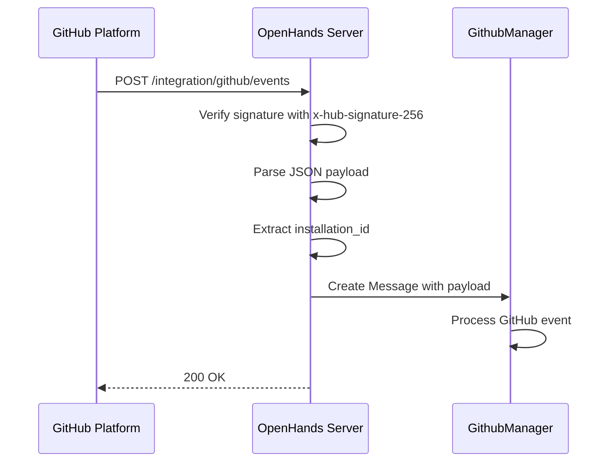
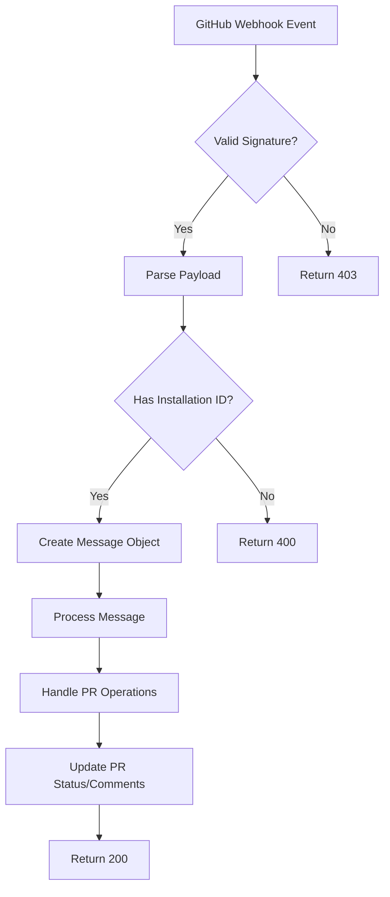
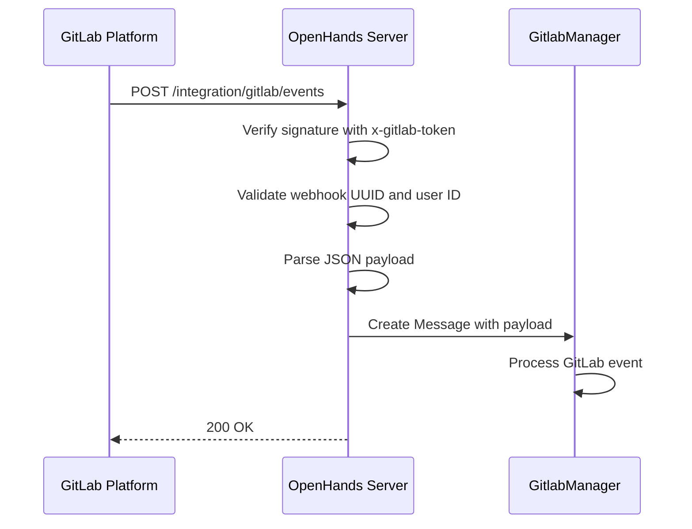
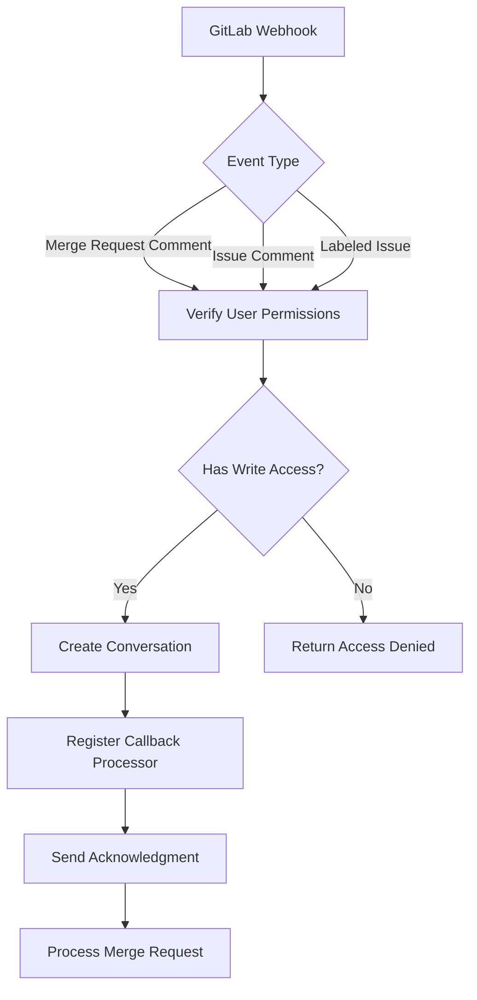
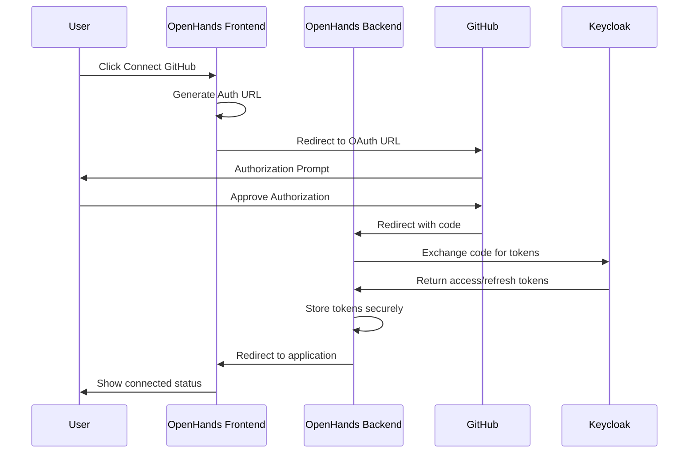
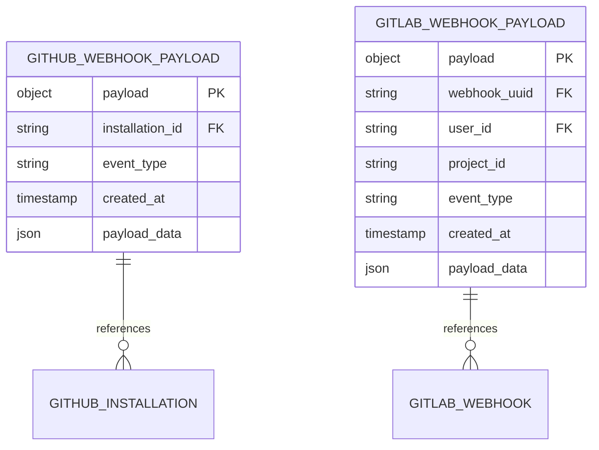
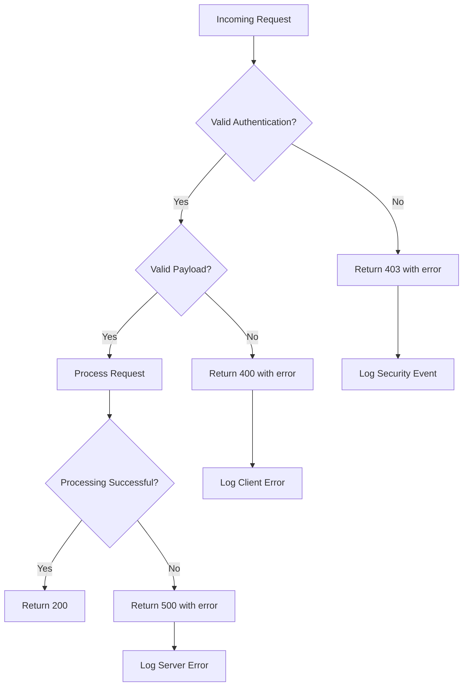

# Integration Endpoints

<cite>
**Referenced Files in This Document**   
- [github.py](file://enterprise/server/routes/integration/github.py)
- [gitlab.py](file://enterprise/server/routes/integration/gitlab.py)
- [token_manager.py](file://enterprise/server/auth/token_manager.py)
- [github_service.py](file://enterprise/integrations/github/github_service.py)
- [gitlab_manager.py](file://enterprise/integrations/gitlab/gitlab_manager.py)
- [github_callback_processor.py](file://enterprise/server/conversation_callback_processor/github_callback_processor.py)
- [gitlab_callback_processor.py](file://enterprise/server/conversation_callback_processor/gitlab_callback_processor.py)
- [gitlab_webhook.py](file://enterprise/storage/gitlab_webhook.py)
- [github_app_installation.py](file://enterprise/storage/github_app_installation.py)
- [github_utils.py](file://enterprise/server/auth/github_utils.py)
- [gitlab_sync.py](file://enterprise/server/auth/gitlab_sync.py)
</cite>

## Table of Contents
1. [Introduction](#introduction)
2. [GitHub Integration Endpoints](#github-integration-endpoints)
3. [GitLab Integration Endpoints](#gitlab-integration-endpoints)
4. [Authentication and OAuth Flow](#authentication-and-oauth-flow)
5. [Webhook Configuration and Security](#webhook-configuration-and-security)
6. [Error Handling and Response Formats](#error-handling-and-response-formats)
7. [Security Considerations](#security-considerations)
8. [Integration Examples](#integration-examples)
9. [Conclusion](#conclusion)

## Introduction

The OpenHands platform provides comprehensive integration endpoints for connecting with external development platforms, specifically GitHub and GitLab. These integration endpoints enable seamless communication between OpenHands and the respective code hosting platforms, facilitating repository connections, authentication callbacks, webhook setup, and pull/merge request operations. The integration architecture is designed to support secure OAuth authentication, webhook event processing, and bidirectional communication for collaborative development workflows.

The integration system follows a modular design with dedicated components for each platform, ensuring separation of concerns and maintainable code. The endpoints are implemented using FastAPI and follow RESTful principles, with clear HTTP methods, URL patterns, and request/response schemas. The system handles both incoming events from the external platforms and outgoing communications from OpenHands to the platforms.

**Section sources**
- [github.py](file://enterprise/server/routes/integration/github.py#L1-L83)
- [gitlab.py](file://enterprise/server/routes/integration/gitlab.py#L1-L85)

## GitHub Integration Endpoints

### Repository Connection and Authentication Callbacks

The GitHub integration provides endpoints for handling repository connections and authentication callbacks. The primary endpoint for receiving GitHub events is accessible at `/integration/github/events` via POST method. This endpoint processes webhook payloads from GitHub, including repository events, pull requests, and issue comments.

The endpoint requires the `x-hub-signature-256` header for request verification, which contains the HMAC signature of the payload using the shared webhook secret. The payload is validated against the configured `GITHUB_APP_WEBHOOK_SECRET` to ensure authenticity. The endpoint processes the JSON payload and extracts the installation ID from the `installation.id` field, which is used to identify the GitHub App installation associated with the event.

When GitHub webhooks are disabled via the `GITHUB_WEBHOOKS_ENABLED` environment variable, the endpoint returns a 200 status code with a message indicating that webhooks are disabled, allowing for graceful degradation of functionality.

**Diagram sources**
- [github.py](file://enterprise/server/routes/integration/github.py#L45-L83)
- [github_service.py](file://enterprise/integrations/github/github_service.py#L13-L144)

**Section sources**
- [github.py](file://enterprise/server/routes/integration/github.py#L45-L83)
- [github_service.py](file://enterprise/integrations/github/github_service.py#L13-L144)

### Webhook Setup and Event Processing

The GitHub webhook endpoint processes various event types including pull requests, issues, and repository events. Upon receiving a valid webhook payload, the system creates a `Message` object with the source type `SourceType.GITHUB` and the parsed payload data. This message is then passed to the `github_manager.receive_message()` method for further processing.

The webhook processing includes duplicate detection using Redis to prevent processing the same event multiple times within a 60-second window. The deduplication key is generated from the event ID in the payload or, if not present, from a SHA-256 hash of the entire payload. This ensures that events are processed exactly once, even in high-traffic scenarios with potential webhook retries.

The system supports pagination for pull request patches through the `get_pr_patches` method in the `SaaSGitHubService` class, which allows retrieving file changes in a PR with configurable page size and number. This enables efficient processing of large pull requests with many file changes.

**Section sources**
- [github.py](file://enterprise/server/routes/integration/github.py#L45-L83)
- [github_service.py](file://enterprise/integrations/github/github_service.py#L75-L103)

### Pull Request Operations

The GitHub integration supports comprehensive pull request operations through the `SaaSGitHubService` class. The service provides methods for retrieving pull request patches, getting repository node IDs for GraphQL queries, and managing repository connections. The `get_pr_patches` method retrieves file changes in a pull request with pagination support, returning both the file data and pagination metadata.

The integration also handles pull request comments and status updates through the callback processor system. When a conversation in OpenHands is linked to a GitHub pull request, the system can send summary updates back to the pull request as comments, providing a seamless feedback loop between the AI agent and the development team.

**Diagram sources**
- [github_service.py](file://enterprise/integrations/github/github_service.py#L75-L103)
- [github_callback_processor.py](file://enterprise/server/conversation_callback_processor/github_callback_processor.py#L27-L144)

**Section sources**
- [github_service.py](file://enterprise/integrations/github/github_service.py#L75-L103)
- [github_callback_processor.py](file://enterprise/server/conversation_callback_processor/github_callback_processor.py#L27-L144)

## GitLab Integration Endpoints

### Project Linking and OAuth Callbacks

The GitLab integration provides endpoints for project linking and OAuth callbacks at `/integration/gitlab/events` via POST method. This endpoint receives webhook payloads from GitLab, including merge request events, issue comments, and project updates. The endpoint requires three headers for authentication: `x-gitlab-token` for the webhook secret, `x-openhands-webhook-id` for the webhook UUID, and `x-openhands-user-id` for the user identifier.

The authentication process involves verifying the webhook signature by comparing the provided token with the stored webhook secret retrieved from the `GitlabWebhookStore` using the webhook UUID and user ID. This three-factor authentication ensures that only authorized GitLab instances can trigger events in the OpenHands system.

**Diagram sources**
- [gitlab.py](file://enterprise/server/routes/integration/gitlab.py#L35-L85)
- [gitlab_manager.py](file://enterprise/integrations/gitlab/gitlab_manager.py#L31-L262)

**Section sources**
- [gitlab.py](file://enterprise/server/routes/integration/gitlab.py#L35-L85)
- [gitlab_manager.py](file://enterprise/integrations/gitlab/gitlab_manager.py#L31-L262)

### Merge Request Handling

The GitLab integration handles merge requests through the `GitlabManager` class, which processes incoming webhook events and determines whether a job should be initiated based on the event type and user permissions. The system supports various event types including labeled issues, issue comments, and merge request comments (both inline and regular).

When a merge request comment triggers a job, the system first verifies that the user has write access to the repository by checking their permissions through the GitLab API. This permission check is performed using the user's GitLab ID and the project ID, ensuring that only authorized users can initiate actions through OpenHands.

The merge request handling includes a job initiation workflow that creates a new conversation in OpenHands, sets up a callback processor to handle status updates, and sends an acknowledgment message back to the merge request. This creates a bidirectional communication channel between the development team and the AI agent.

**Diagram sources**
- [gitlab_manager.py](file://enterprise/integrations/gitlab/gitlab_manager.py#L86-L117)
- [gitlab_callback_processor.py](file://enterprise/server/conversation_callback_processor/gitlab_callback_processor.py)

**Section sources**
- [gitlab_manager.py](file://enterprise/integrations/gitlab/gitlab_manager.py#L86-L117)
- [gitlab_callback_processor.py](file://enterprise/server/conversation_callback_processor/gitlab_callback_processor.py)

## Authentication and OAuth Flow

### OAuth Implementation

The OpenHands platform implements OAuth 2.0 for authentication with both GitHub and GitLab. The authentication flow begins with the frontend generating an authorization URL using the `generateAuthUrl` function, which constructs the appropriate OAuth endpoint based on the identity provider (GitHub or GitLab). Users are redirected to this URL to authorize the OpenHands application.

Upon successful authorization, the external platform redirects back to the OpenHands callback endpoint with an authorization code. The system exchanges this code for access and refresh tokens through the Keycloak identity provider, which acts as an intermediary for managing OAuth credentials. The `TokenManager` class handles the token exchange process, storing the tokens securely in the database with encryption.

The OAuth flow supports both user-level and organization-level authentication. For GitHub, organization tokens are stored using the `store_org_token` method, which encrypts the installation token before storing it in the `github_app_installations` table. For GitLab, user tokens are managed through the `SaaSGitLabService` and stored in the `offline_token_store`.

**Diagram sources**
- [token_manager.py](file://enterprise/server/auth/token_manager.py#L77-L670)
- [github_utils.py](file://enterprise/server/auth/github_utils.py)
- [gitlab_sync.py](file://enterprise/server/auth/gitlab_sync.py)

**Section sources**
- [token_manager.py](file://enterprise/server/auth/token_manager.py#L77-L670)
- [github_utils.py](file://enterprise/server/auth/github_utils.py)
- [gitlab_sync.py](file://enterprise/server/auth/gitlab_sync.py)

### Token Exchange Process

The token exchange process is managed by the `TokenManager` class, which handles both initial token acquisition and token refresh operations. When a user authenticates, the system obtains an access token and refresh token from the external platform via Keycloak. These tokens are stored in the `auth_tokens` table with encryption using Fernet encryption based on the JWT secret.

The token manager implements automatic token refresh functionality through the `_check_expiration_and_refresh` method, which monitors token expiration times and automatically refreshes tokens before they expire. The system refreshes access tokens when they are within 10 minutes of expiration, using the refresh token to obtain a new access token without requiring user interaction.

For GitHub, the token refresh endpoint is `https://github.com/login/oauth/access_token` with the grant type `refresh_token`. For GitLab, the endpoint is `https://gitlab.com/oauth/token` with the same grant type. The refresh process includes retry logic with exponential backoff to handle temporary network issues or rate limiting.

The system also supports offline tokens, which are long-lived refresh tokens that can be used to obtain new access tokens even when the user is not actively using the application. These offline tokens are stored in the `offline_token_store` and can be used to maintain continuous integration capabilities.

**Section sources**
- [token_manager.py](file://enterprise/server/auth/token_manager.py#L249-L440)
- [github_service.py](file://enterprise/integrations/github/github_service.py#L39-L73)

## Webhook Configuration and Security

### Webhook Payload Structures

The webhook payload structures for GitHub and GitLab follow their respective platform specifications. GitHub webhook payloads include a `payload` field with the complete event data from GitHub, including the `installation.id` field that identifies the GitHub App installation. The payload also includes event-specific data such as pull request details, issue information, or repository metadata.

GitLab webhook payloads include the complete JSON payload from GitLab in the `payload` field, with the `object_attributes.id` field used as a deduplication key. The system extracts relevant information from the payload such as project ID, user ID, and event type to determine how to process the event.

Both webhook endpoints include comprehensive error handling for invalid payloads, missing required fields, and authentication failures. The system returns appropriate HTTP status codes and error messages to help diagnose integration issues.

**Diagram sources**
- [github.py](file://enterprise/server/routes/integration/github.py#L64-L74)
- [gitlab.py](file://enterprise/server/routes/integration/gitlab.py#L49-L74)

**Section sources**
- [github.py](file://enterprise/server/routes/integration/github.py#L64-L74)
- [gitlab.py](file://enterprise/server/routes/integration/gitlab.py#L49-L74)

### Event Filtering

The integration system implements event filtering at multiple levels to ensure that only relevant events trigger processing. At the webhook level, the system uses Redis-based deduplication to prevent processing the same event multiple times within a 60-second window. This is particularly important for platforms like GitLab that may send duplicate webhook events.

At the application level, the `GitlabManager.is_job_requested` method implements business logic filtering to determine whether an event should trigger a job. This method checks the event type (labeled issues, issue comments, merge request comments) and verifies that the user has write access to the repository before initiating a job.

For GitHub, similar filtering is implemented in the `github_manager.receive_message` method, which processes the event payload and determines the appropriate action based on the event type and context. The system also supports scope-based filtering through the `scopes` field in the `GitlabWebhook` model, which can store an array of event types that the webhook should respond to.

**Section sources**
- [gitlab_manager.py](file://enterprise/integrations/gitlab/gitlab_manager.py#L86-L117)
- [github.py](file://enterprise/server/routes/integration/github.py#L73-L75)

## Error Handling and Response Formats

### Response Status Codes

The integration endpoints use standard HTTP status codes to communicate the result of API requests:

- **200 OK**: Successful processing of webhook events
- **400 Bad Request**: Invalid payload or missing required fields (e.g., missing installation ID)
- **403 Forbidden**: Authentication failure (invalid signature or missing headers)
- **404 Not Found**: Endpoint not found
- **500 Internal Server Error**: Unexpected server error during processing

The GitHub webhook endpoint returns a 200 status code even when webhooks are disabled, allowing for graceful degradation. This prevents external platforms from repeatedly retrying failed webhook deliveries when the feature is intentionally disabled.

For authentication endpoints, additional status codes include:
- **302 Found**: Redirect during OAuth flow
- **401 Unauthorized**: Invalid or expired tokens
- **429 Too Many Requests**: Rate limiting

### Error Formats for Integration Failures

Integration failures return JSON error responses with a consistent format that includes an `error` field with a descriptive message. For example, missing installation ID returns `{"error": "Installation ID is missing in the payload."}` while signature verification failures return `{"error": "Request signatures didn't match!"}`.

The system logs detailed error information including stack traces for debugging purposes, but only returns high-level error messages to clients to avoid exposing sensitive information. The logging includes contextual information such as user IDs, repository names, and event types to facilitate troubleshooting.

The callback processors implement their own error handling to ensure that failures in sending status updates do not disrupt the main conversation flow. If a GitHub or GitLab comment cannot be posted, the error is logged but the conversation continues processing.

**Diagram sources**
- [github.py](file://enterprise/server/routes/integration/github.py#L67-L71)
- [gitlab.py](file://enterprise/server/routes/integration/gitlab.py#L53-L66)

**Section sources**
- [github.py](file://enterprise/server/routes/integration/github.py#L67-L71)
- [gitlab.py](file://enterprise/server/routes/integration/gitlab.py#L53-L66)

## Security Considerations

### Token Storage

The system implements secure token storage using multiple layers of protection. All tokens are encrypted before storage using Fernet encryption with a key derived from the JWT secret. The encryption utility is created using `create_encryption_utility` function, which generates a Fernet key from the SHA-256 hash of the JWT secret.

Tokens are stored in dedicated database tables: `auth_tokens` for user access tokens and `github_app_installations` for GitHub App installation tokens. The `offline_token_store` is used for long-lived refresh tokens that enable background operations without requiring user presence.

The system implements token expiration and refresh logic to minimize the risk of token compromise. Access tokens are automatically refreshed before expiration using the refresh tokens, and the system validates token active status through periodic introspection of offline tokens.

### Scope Management and Permission Validation

The integration system implements strict scope management and permission validation to ensure least privilege access. When a user connects their GitHub or GitLab account, the system requests only the minimum required scopes for the intended functionality.

For GitHub, the system verifies user permissions through the `is_user_allowed` function in `github_utils.py`, which checks against allowlists configured via environment variables or Google Sheets. This prevents unauthorized users from accessing the system even if they have valid GitHub tokens.

For GitLab, the system verifies write access to repositories through the `_user_has_write_access_to_repo` method in `GitlabManager`, which checks the user's permissions on the specific project before allowing any operations. This ensures that users can only initiate actions on repositories where they have appropriate permissions.

The system also implements rate limiting protection through Redis-based deduplication and monitoring of API usage patterns. This prevents abuse of the integration endpoints and protects against denial-of-service attacks.

**Section sources**
- [token_manager.py](file://enterprise/server/auth/token_manager.py#L46-L74)
- [github_utils.py](file://enterprise/server/auth/github_utils.py#L11-L89)
- [gitlab_manager.py](file://enterprise/integrations/gitlab/gitlab_manager.py#L43-L73)

## Integration Examples

### Successful Integration Setup

A successful GitHub integration setup follows this sequence:

1. User clicks "Connect GitHub" in the OpenHands UI
2. Frontend generates OAuth URL and redirects user to GitHub
3. User authorizes the OpenHands application on GitHub
4. GitHub redirects back to OpenHands with authorization code
5. OpenHands exchanges code for access and refresh tokens via Keycloak
6. Tokens are encrypted and stored in the database
7. User is redirected back to OpenHands with connected status

For webhook setup:
1. GitHub sends ping event to `/integration/github/events`
2. OpenHands verifies signature and responds with 200 OK
3. Subsequent events (pull requests, issues) are processed as they occur

### Common Error Scenarios

Common error scenarios include:

- **Invalid webhook signature**: Caused by mismatched webhook secrets between GitHub/GitLab and OpenHands configuration
- **Missing installation ID**: GitHub payload does not contain the installation ID, often due to incorrect webhook configuration
- **Token expiration**: Access token has expired and refresh token is invalid or missing
- **Permission denied**: User does not have write access to the repository or is not in the allowlist
- **Rate limiting**: Too many webhook events received within a short period

Troubleshooting these issues involves checking the configuration settings, verifying token validity, and reviewing the system logs for detailed error messages.

**Section sources**
- [github.py](file://enterprise/server/routes/integration/github.py)
- [gitlab.py](file://enterprise/server/routes/integration/gitlab.py)
- [token_manager.py](file://enterprise/server/auth/token_manager.py)

## Conclusion

The OpenHands integration endpoints provide a robust and secure framework for connecting with external development platforms like GitHub and GitLab. The system implements comprehensive authentication flows, webhook processing, and bidirectional communication capabilities that enable seamless collaboration between AI agents and development teams.

Key features of the integration system include secure OAuth authentication with token refresh capabilities, webhook event processing with deduplication, and permission validation to ensure secure operations. The modular architecture with dedicated components for each platform allows for maintainable code and easy extension to support additional platforms in the future.

The integration endpoints follow RESTful principles with clear HTTP methods, URL patterns, and response formats, making them easy to understand and use. Comprehensive error handling and logging provide visibility into integration issues, while the security measures protect user credentials and prevent unauthorized access.

By leveraging these integration endpoints, development teams can create powerful workflows that combine the capabilities of AI agents with their existing development platforms, enhancing productivity and accelerating software development cycles.