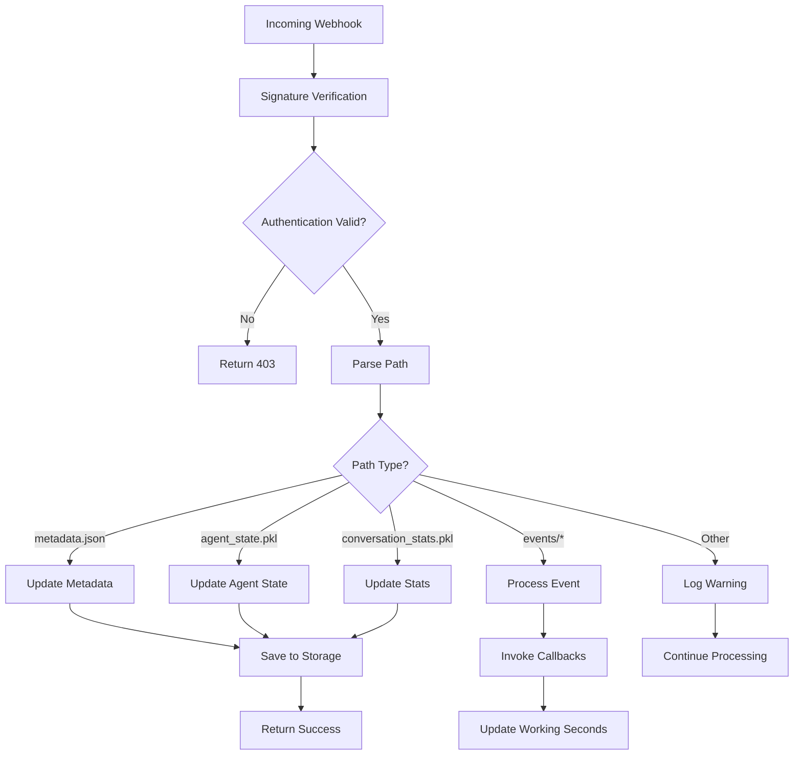
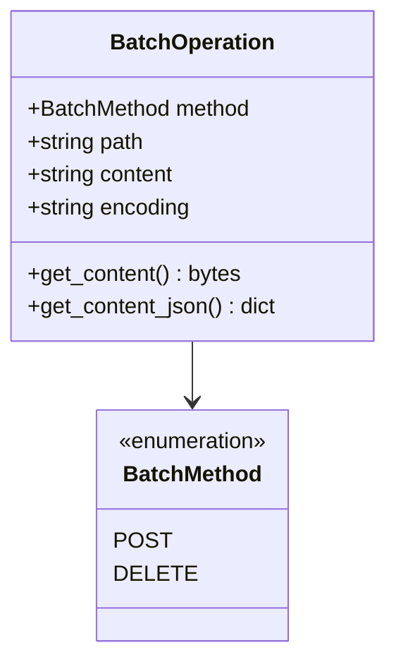
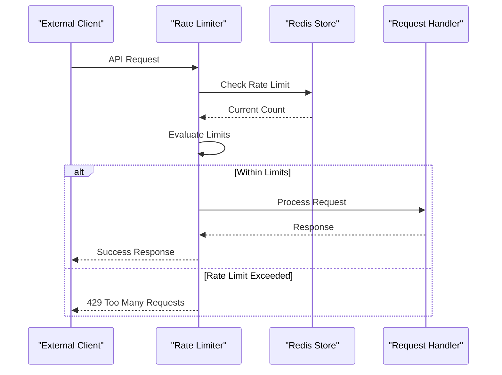
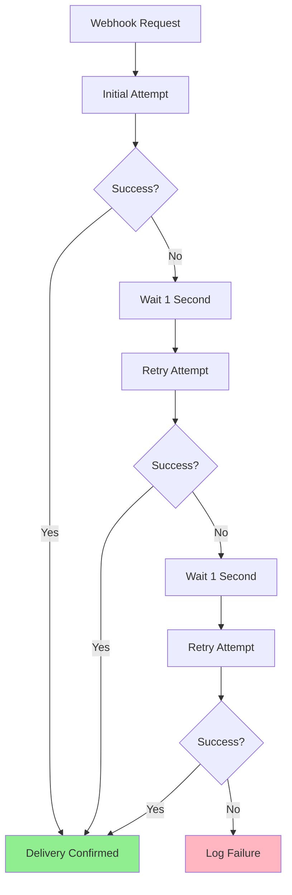

# Webhook Endpoints

<cite>
**Referenced Files in This Document**
- [event_webhook.py](file://enterprise/server/routes/event_webhook.py)
- [github_proxy.py](file://enterprise/server/routes/github_proxy.py)
- [github.py](file://enterprise/server/routes/integration/github.py)
- [gitlab.py](file://enterprise/server/routes/integration/gitlab.py)
- [conversation_callback_utils.py](file://enterprise/server/utils/conversation_callback_utils.py)
- [config.py](file://enterprise/server/config.py)
- [rate_limit.py](file://enterprise/server/rate_limit.py)
- [batched_web_hook.py](file://openhands/storage/batched_web_hook.py)
- [web_hook.py](file://openhands/storage/web_hook.py)
- [logger.py](file://enterprise/server/logger.py)
- [gitlab_webhook_store.py](file://enterprise/storage/gitlab_webhook_store.py)
- [gitlab_webhook_table.py](file://enterprise/migrations/versions/027_create_gitlab_webhook_table.py)
</cite>

## Table of Contents
1. [Introduction](#introduction)
2. [Event Webhook Endpoints](#event-webhook-endpoints)
3. [GitHub Proxy Endpoints](#github-proxy-endpoints)
4. [Authentication and Security](#authentication-and-security)
5. [Event Processing and Transformation](#event-processing-and-transformation)
6. [Rate Limiting and High-Volume Processing](#rate-limiting-and-high-volume-processing)
7. [Reliability and Delivery Guarantees](#reliability-and-delivery-guarantees)
8. [Monitoring and Logging](#monitoring-and-logging)
9. [Configuration Examples](#configuration-examples)
10. [Troubleshooting Guide](#troubleshooting-guide)

## Introduction

OpenHands provides a comprehensive webhook infrastructure that enables external systems to integrate with the platform through secure, reliable event notifications. The system consists of two main categories of endpoints: event webhook endpoints for receiving conversation events and GitHub proxy endpoints for acting as intermediaries for GitHub webhook events.

The webhook system supports multiple integration scenarios including:
- Real-time conversation event notifications
- GitHub repository synchronization
- GitLab project integration
- Batched event processing for high-volume scenarios
- Automatic retry mechanisms for failed deliveries
- Comprehensive logging and monitoring capabilities

## Event Webhook Endpoints

### Overview

The event webhook system handles real-time communication between external systems and OpenHands conversations. It provides both individual event endpoints and batch processing capabilities for efficient high-volume event handling.

### Individual Event Endpoints

#### POST /event-webhook/{path}

Processes individual conversation events and metadata updates.

**URL Pattern:** `/event-webhook/sessions/{conversation_id}/{subpath}`

**HTTP Methods:** POST, DELETE

**Headers Required:**
- `X-Session-API-Key`: Session API key for authentication

**Supported Subpaths:**
- `metadata.json`: Conversation metadata updates
- `agent_state.pkl`: Agent state persistence
- `conversation_stats.pkl`: Conversation statistics
- `events/{timestamp}`: Individual event records
- `event_cache/*`: Event cache management
- `exp_config.json`: Experiment configuration

**Request Schema:**
```json
{
  "path": "sessions/{conversation_id}/metadata.json",
  "content": {
    "title": "Conversation Title",
    "last_updated_at": "2024-01-01T00:00:00Z",
    "accumulated_cost": 10.5,
    "prompt_tokens": 1000,
    "completion_tokens": 500,
    "total_tokens": 1500
  }
}
```

**Response Codes:**
- `200 OK`: Successfully processed
- `400 Bad Request`: Invalid path or content
- `403 Forbidden`: Authentication failure
- `202 Accepted`: Batch operation accepted (background processing)

**Section sources**
- [event_webhook.py](file://enterprise/server/routes/event_webhook.py#L164-L208)

### Batch Webhook Endpoints

#### POST /event-webhook/batch

Handles multiple file operations in a single request for high-performance scenarios.

**Request Schema:**
```json
[
  {
    "method": "POST",
    "path": "sessions/{conversation_id}/events/20240101T000000Z",
    "content": "{\"type\":\"Action\",\"content\":\"Hello World\"}",
    "encoding": "utf-8"
  },
  {
    "method": "POST",
    "path": "sessions/{conversation_id}/metadata.json",
    "content": "{\"title\":\"Updated Title\"}",
    "encoding": "utf-8"
  }
]
```

**Batch Operation Types:**
- `POST`: Create or update resources
- `DELETE`: Remove resources (currently returns 200 OK)

**Content Encoding Options:**
- `utf-8`: Default text encoding
- `base64`: Binary content encoding

**Processing Logic:**
1. Validates session API key for each operation
2. Processes operations in background tasks
3. Handles partial failures gracefully
4. Maintains conversation state consistency

**Section sources**
- [event_webhook.py](file://enterprise/server/routes/event_webhook.py#L146-L161)

## GitHub Proxy Endpoints

### Overview

The GitHub proxy acts as an intermediary between GitHub and OpenHands, providing OAuth flow management and API request forwarding with enhanced security and debugging capabilities.

### OAuth Flow Endpoints

#### GET /github-proxy/{subdomain}/login/oauth/authorize

Handles GitHub OAuth authorization requests with state encryption.

**Parameters:**
- `subdomain`: Target subdomain for redirection
- Standard OAuth parameters (`client_id`, `redirect_uri`, `scope`, `state`)

**Security Features:**
- Encrypted state parameter using Fernet encryption
- Automatic redirect URI modification
- JWT secret-based encryption keys

#### GET /github-proxy/callback

Processes OAuth callback requests and decrypts state parameters.

**Processing Steps:**
1. Decrypt state parameter
2. Extract original redirect URI and state
3. Forward to original destination with parameters

#### POST /github-proxy/{subdomain}/login/oauth/access_token

Handles OAuth access token requests with redirect URI modification.

**Request Processing:**
- Modifies redirect URI to proxy endpoint
- Forwards request to GitHub API
- Returns original response with modified headers

#### POST /github-proxy/{subdomain}/{path}

Generic proxy endpoint for forwarding GitHub API requests.

**Features:**
- Preserves original request headers
- Maintains authentication tokens
- Supports all GitHub API endpoints

**Environment Configuration:**
- Requires `GITHUB_PROXY_ENDPOINTS=true` to enable
- Uses JWT secret for Fernet encryption
- Provides staging-specific OAuth handling

**Section sources**
- [github_proxy.py](file://enterprise/server/routes/github_proxy.py#L46-L112)

## Authentication and Security

### Signature Verification

#### GitHub Webhook Authentication

GitHub webhooks use HMAC-SHA256 signature verification for security.

**Verification Process:**
1. Extract `x-hub-signature-256` header from request
2. Generate expected signature using webhook secret
3. Compare signatures using constant-time comparison

**Signature Format:**
```
sha256=expected_signature_hex
```

**Implementation Details:**
- Uses `hmac.compare_digest()` for secure comparison
- Requires `GITHUB_APP_WEBHOOK_SECRET` environment variable
- Supports environment-based webhook enable/disable

**Section sources**
- [github.py](file://enterprise/server/routes/integration/github.py#L26-L43)
- [config.py](file://enterprise/server/config.py#L43-L59)

#### GitLab Webhook Authentication

GitLab webhooks use custom signature verification with UUID-based authentication.

**Verification Process:**
1. Extract headers: `x-gitlab-token`, `x-openhands-webhook-id`, `x-openhands-user-id`
2. Retrieve webhook secret from database using UUID and user ID
3. Compare received and stored secrets

**Security Features:**
- UUID-based webhook identification
- User-scoped webhook secrets
- Redis-based deduplication

**Section sources**
- [gitlab.py](file://enterprise/server/routes/integration/gitlab.py#L21-L33)

### Session Authentication

#### Event Webhook Authentication

Individual event endpoints use session API key authentication.

**Authentication Flow:**
1. Parse conversation ID from path
2. Retrieve user ID from database
3. Fetch session API key from conversation manager
4. Compare with provided API key

**Validation Logic:**
- Ensures request originates from authorized conversation
- Prevents cross-conversation access
- Supports dynamic session key validation

**Section sources**
- [event_webhook.py](file://enterprise/server/routes/event_webhook.py#L227-L242)

## Event Processing and Transformation

### Event Processing Pipeline

The event webhook system transforms external webhook payloads into internal event models through a sophisticated processing pipeline.



**Diagram sources**
- [event_webhook.py](file://enterprise/server/routes/event_webhook.py#L164-L208)
- [conversation_callback_utils.py](file://enterprise/server/utils/conversation_callback_utils.py#L34-L71)

### Event Transformation Logic

#### Metadata Processing

Conversation metadata updates include:
- Title updates and history tracking
- Token usage statistics (prompt, completion, total)
- Cost accumulation and budget tracking
- Last updated timestamps
- User interaction metrics

#### Agent State Management

Agent state persistence involves:
- Pickle serialization for state objects
- File system storage with conversation isolation
- Atomic write operations to prevent corruption
- Version compatibility handling

#### Event Processing

Individual events undergo:
- JSON deserialization and validation
- Event type classification
- Callback invocation for registered processors
- Working time calculation for billing

**Section sources**
- [conversation_callback_utils.py](file://enterprise/server/utils/conversation_callback_utils.py#L34-L71)

### Batch Processing

#### Batch Operation Types



**Diagram sources**
- [event_webhook.py](file://enterprise/server/routes/event_webhook.py#L31-L50)

#### Background Processing

Batch operations are processed asynchronously:
1. Validation and authentication per operation
2. Grouping by conversation ID for efficiency
3. Parallel processing where safe
4. Error isolation to prevent cascade failures
5. Logging and monitoring for debugging

**Section sources**
- [event_webhook.py](file://enterprise/server/routes/event_webhook.py#L53-L144)

## Rate Limiting and High-Volume Processing

### Rate Limiting Implementation

The system implements comprehensive rate limiting to handle high-volume event processing while maintaining system stability.



**Diagram sources**
- [rate_limit.py](file://enterprise/server/rate_limit.py#L50-L137)

### High-Volume Processing Strategies

#### Batch Webhook Processing

High-volume scenarios benefit from batch processing:
- **Reduced API overhead**: Single request for multiple operations
- **Improved throughput**: Better network utilization
- **Consistency guarantees**: Atomic batch operations
- **Resource optimization**: Reduced database connections

#### Background Task Processing

Critical operations use background tasks:
- **Non-blocking UI**: Immediate response to clients
- **Resource management**: Controlled concurrency
- **Error isolation**: Failures don't impact main thread
- **Retry mechanisms**: Automatic failure recovery

#### Queue-Based Processing

For extreme volumes, the system supports queue-based processing:
- **Message queuing**: Distributed processing capability
- **Load balancing**: Multiple workers for high throughput
- **Persistence**: Guaranteed delivery even during outages
- **Monitoring**: Real-time queue depth tracking

**Section sources**
- [batched_web_hook.py](file://openhands/storage/batched_web_hook.py#L185-L267)

## Reliability and Delivery Guarantees

### Retry Mechanisms

The webhook system implements robust retry mechanisms to ensure reliable event delivery.

#### Automatic Retry Configuration



**Diagram sources**
- [batched_web_hook.py](file://openhands/storage/batched_web_hook.py#L215-L267)
- [web_hook.py](file://openhands/storage/web_hook.py#L88-L118)

#### Retry Parameters

- **Maximum Attempts**: 3 retries
- **Delay Between Attempts**: 1 second
- **Exponential Backoff**: Not implemented (fixed delay)
- **Failure Handling**: Logging and alerting on final failure

### Duplicate Detection

#### GitLab Deduplication

GitLab events include built-in deduplication:
- **Event ID Tracking**: Uses object_attributes.id when available
- **Payload Hashing**: SHA256 hash of entire payload as fallback
- **Redis-Based Deduplication**: 60-second TTL for duplicate detection
- **Atomic Operations**: NX flag ensures single processing

#### GitHub Event Handling

GitHub events rely on external deduplication:
- **GitHub Delivery IDs**: Unique per-event delivery
- **Payload Validation**: Content-based verification
- **Rate Limit Awareness**: Respects GitHub rate limits

**Section sources**
- [gitlab.py](file://enterprise/server/routes/integration/gitlab.py#L50-L66)

### Delivery Guarantees

#### At-Least-Once Delivery

The system guarantees at-least-once delivery:
- **Acknowledgment**: Immediate HTTP 200 for successful processing
- **Storage**: Events persisted to durable storage
- **Recovery**: Automatic retry on transient failures
- **Monitoring**: Failed deliveries logged for manual intervention

#### Idempotency Considerations

While not strictly idempotent, the system handles duplicates gracefully:
- **State Updates**: Overwrites previous state with latest data
- **Event Processing**: Skips duplicate events based on deduplication keys
- **Metadata Updates**: Merges conflicting updates intelligently
- **Error Recovery**: Safe to retry failed operations

**Section sources**
- [gitlab.py](file://enterprise/server/routes/integration/gitlab.py#L59-L66)

## Monitoring and Logging

### Logging Architecture

The webhook system implements comprehensive logging for monitoring and troubleshooting.

#### Structured Logging Format

All logs follow a structured JSON format:
```json
{
  "timestamp": "2024-01-01T00:00:00Z",
  "severity": "INFO",
  "message": "Webhook event processed successfully",
  "conversation_id": "uuid",
  "user_id": "uuid",
  "event_type": "push",
  "source": "github"
}
```

#### Log Categories

**Authentication Logs:**
- Signature verification failures
- API key validation results
- Session authentication status

**Processing Logs:**
- Event parsing and validation
- Callback invocation results
- State update operations

**Error Logs:**
- Processing failures
- Network connectivity issues
- Database operation errors

**Performance Logs:**
- Request latency measurements
- Throughput statistics
- Resource utilization metrics

**Section sources**
- [logger.py](file://enterprise/server/logger.py#L1-122)

### Monitoring Metrics

#### Key Performance Indicators

**Throughput Metrics:**
- Events processed per minute
- Webhook delivery rate
- Batch processing efficiency

**Latency Metrics:**
- Average processing time
- 95th percentile latency
- Request queue depth

**Error Metrics:**
- Authentication failure rate
- Processing error rate
- Retry success rate

#### Alerting Configuration

Critical events trigger alerts:
- **Authentication Failures**: >1% failure rate
- **Processing Errors**: >5% error rate
- **Queue Backlog**: >1000 queued events
- **System Health**: CPU/memory threshold breaches

### Debugging Capabilities

#### Request Tracing

Each webhook request receives a unique trace identifier:
- **Conversation ID**: Links to specific conversation
- **Event ID**: Identifies individual events
- **Timestamp**: Precise timing information
- **Correlation ID**: Cross-system tracing

#### Diagnostic Tools

**Log Analysis:**
- Search by conversation ID
- Filter by event type
- Correlate authentication failures
- Track processing pipeline stages

**Health Checks:**
- Endpoint availability monitoring
- Database connection health
- Redis connectivity testing
- External service dependencies

**Section sources**
- [logger.py](file://enterprise/server/logger.py#L100-122)

## Configuration Examples

### GitHub Webhook Configuration

#### Environment Variables

```bash
# Enable GitHub webhooks
GITHUB_WEBHOOKS_ENABLED=true

# GitHub App credentials
GITHUB_APP_CLIENT_ID=your_client_id
GITHUB_APP_PRIVATE_KEY=your_private_key
GITHUB_APP_WEBHOOK_SECRET=your_webhook_secret

# JWT configuration
JWT_SECRET=your_jwt_secret
```

#### GitHub App Setup

1. **Create GitHub App**: Configure app permissions and webhook URL
2. **Generate Private Key**: Create RSA key pair for app authentication
3. **Configure Webhook**: Point to `/integration/github/events`
4. **Set Secret**: Use `GITHUB_APP_WEBHOOK_SECRET` value

#### Webhook Payload Example

```json
{
  "action": "opened",
  "pull_request": {
    "id": 12345,
    "title": "Fix bug in authentication",
    "html_url": "https://github.com/user/repo/pull/12345",
    "user": {
      "login": "username"
    }
  },
  "repository": {
    "full_name": "user/repo",
    "owner": {
      "login": "user"
    }
  },
  "installation": {
    "id": 67890
  }
}
```

### GitLab Webhook Configuration

#### Environment Variables

```bash
# GitLab webhook configuration
GITLAB_WEBHOOK_SECRET=your_gitlab_webhook_secret
```

#### GitLab Project Setup

1. **Project Settings**: Navigate to Integrations
2. **Webhook URL**: Configure to point to webhook endpoint
3. **Secret Token**: Use `GITLAB_WEBHOOK_SECRET` value
4. **Trigger Events**: Select desired GitLab events
5. **SSL Verification**: Enable for production

#### Webhook Payload Example

```json
{
  "object_kind": "push",
  "ref": "refs/heads/main",
  "user_username": "username",
  "project": {
    "path_with_namespace": "user/repo"
  },
  "commits": [
    {
      "id": "commit_hash",
      "message": "Fix authentication issue",
      "url": "https://gitlab.com/user/repo/-/commit/commit_hash"
    }
  ]
}
```

### Event Webhook Configuration

#### Endpoint Registration

```python
# Register webhook for conversation events
conversation_id = "your_conversation_id"
webhook_url = "https://your-domain.com/event-webhook/sessions/{}/events/"
session_api_key = "your_session_api_key"

# Headers required for authentication
headers = {
    "X-Session-API-Key": session_api_key,
    "Content-Type": "application/json"
}
```

#### Batch Processing Setup

```python
# Configure batch webhook for high-volume scenarios
batch_payload = [
    {
        "method": "POST",
        "path": f"sessions/{conversation_id}/events/20240101T000000Z",
        "content": json.dumps(event_data),
        "encoding": "utf-8"
    }
]

response = requests.post(
    "https://your-domain.com/event-webhook/batch",
    json=batch_payload,
    headers=headers
)
```

## Troubleshooting Guide

### Common Issues and Solutions

#### Authentication Failures

**Problem**: 403 Forbidden responses from webhook endpoints

**Causes:**
- Incorrect session API key
- Expired authentication tokens
- Wrong conversation ID in path
- Missing required headers

**Solutions:**
1. Verify session API key is correct and active
2. Check conversation ID matches expected format
3. Ensure all required headers are present
4. Validate JWT secret configuration

#### Signature Verification Errors

**Problem**: GitHub/GitLab signature verification failures

**Causes:**
- Incorrect webhook secret configuration
- Timestamp skew between systems
- Network issues causing payload corruption
- Misconfigured signing algorithm

**Solutions:**
1. Verify webhook secret matches GitHub/GitLab configuration
2. Check system clock synchronization
3. Review network connectivity and timeouts
4. Validate signing algorithm configuration

#### Processing Failures

**Problem**: Events not appearing in conversation history

**Causes:**
- Invalid JSON payload format
- Unsupported event types
- Database connectivity issues
- File system permission problems

**Solutions:**
1. Validate JSON payload against expected schema
2. Check event type support in system
3. Verify database connection and permissions
4. Review file system storage configuration

#### Performance Issues

**Problem**: Slow webhook processing or timeouts

**Causes:**
- High volume without batch processing
- Insufficient system resources
- Network latency issues
- Database performance bottlenecks

**Solutions:**
1. Implement batch processing for high-volume scenarios
2. Scale system resources appropriately
3. Optimize network configuration
4. Review database indexing and query performance

### Debugging Tools

#### Log Analysis

**Search Patterns:**
```bash
# Find authentication failures
grep "authentication_failed" webhook.log

# Monitor processing errors
grep "error_processing" webhook.log

# Track signature verification
grep "signature" webhook.log
```

#### Health Checks

**Endpoint Monitoring:**
```bash
# Test webhook endpoint availability
curl -I https://your-domain.com/event-webhook/

# Verify GitHub webhook configuration
curl -H "X-Hub-Signature-256: sha256=test" \
     -H "Content-Type: application/json" \
     -d "{}" \
     https://your-domain.com/integration/github/events
```

#### System Diagnostics

**Resource Monitoring:**
```bash
# Check system resources
htop
iostat
netstat -tulpn

# Monitor database connections
psql -c "SELECT * FROM pg_stat_activity;"
```

### Error Recovery Procedures

#### Failed Delivery Recovery

1. **Identify Failed Events**: Check webhook delivery logs
2. **Manual Retry**: Resend failed payloads manually
3. **System Restart**: Restart webhook service if necessary
4. **Database Repair**: Repair corrupted database entries

#### Configuration Recovery

1. **Backup Configuration**: Maintain configuration backups
2. **Rollback Changes**: Revert to known good configuration
3. **Validate Setup**: Test configuration changes thoroughly
4. **Monitor Results**: Watch for improved performance

**Section sources**
- [logger.py](file://enterprise/server/logger.py#L100-122)