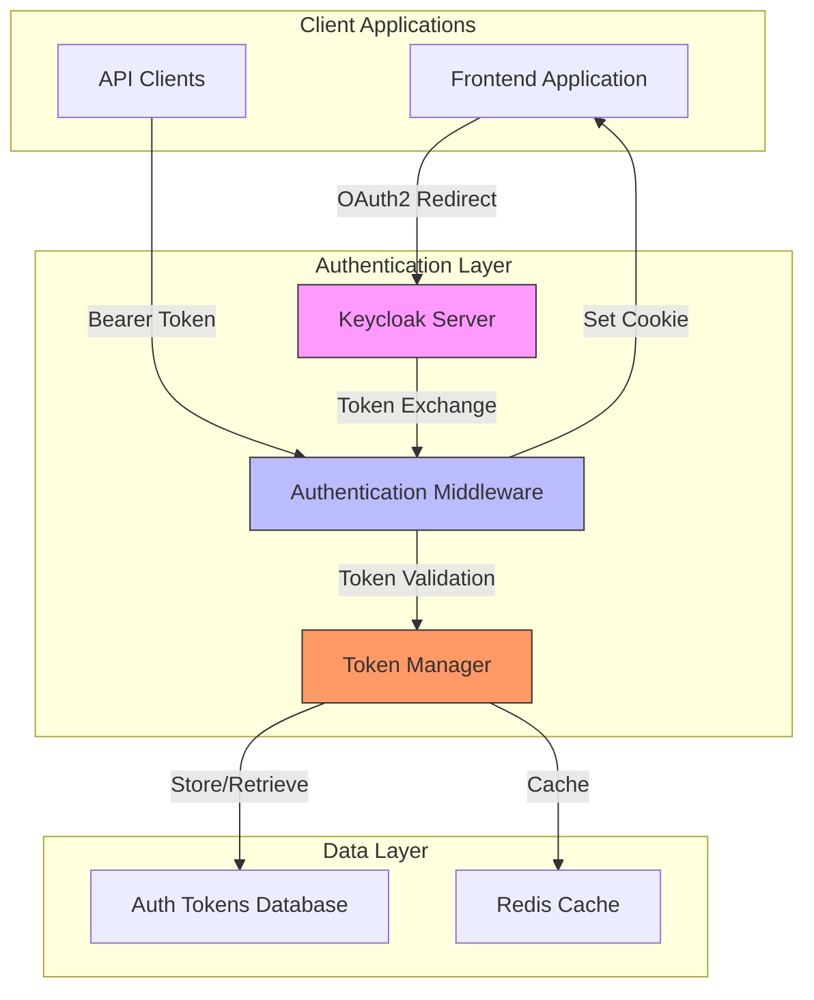
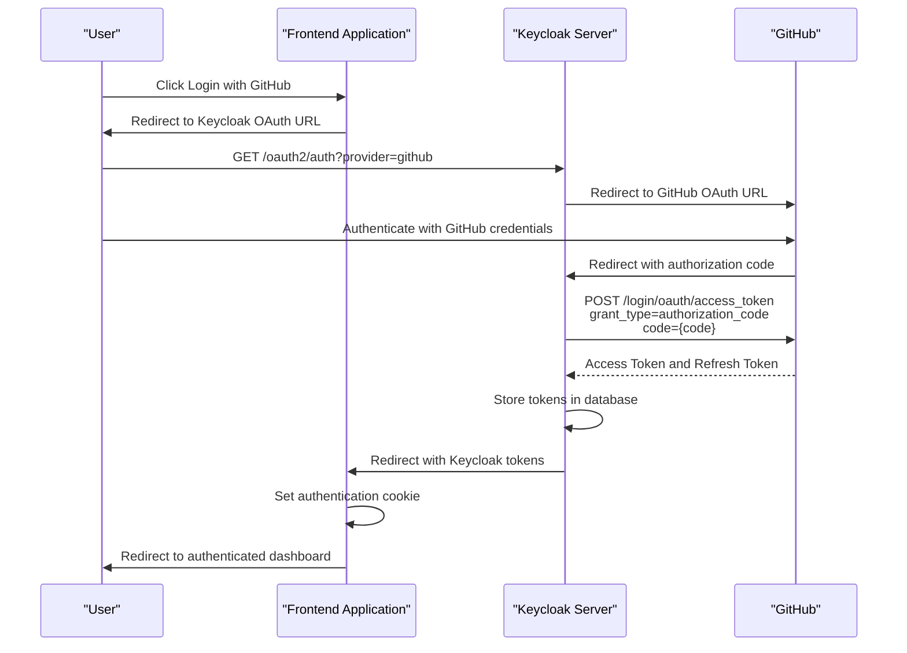
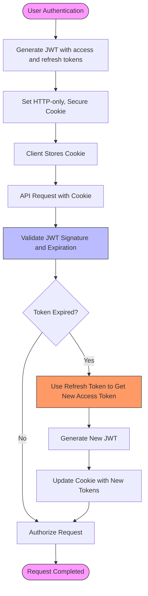
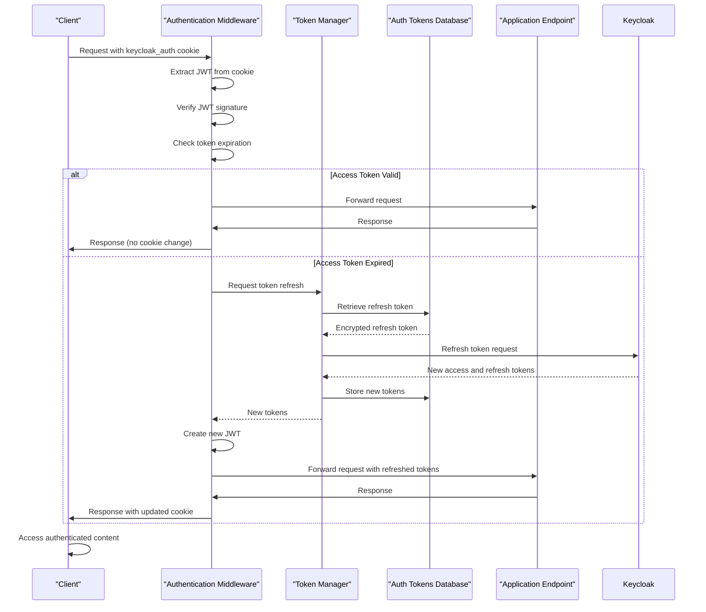
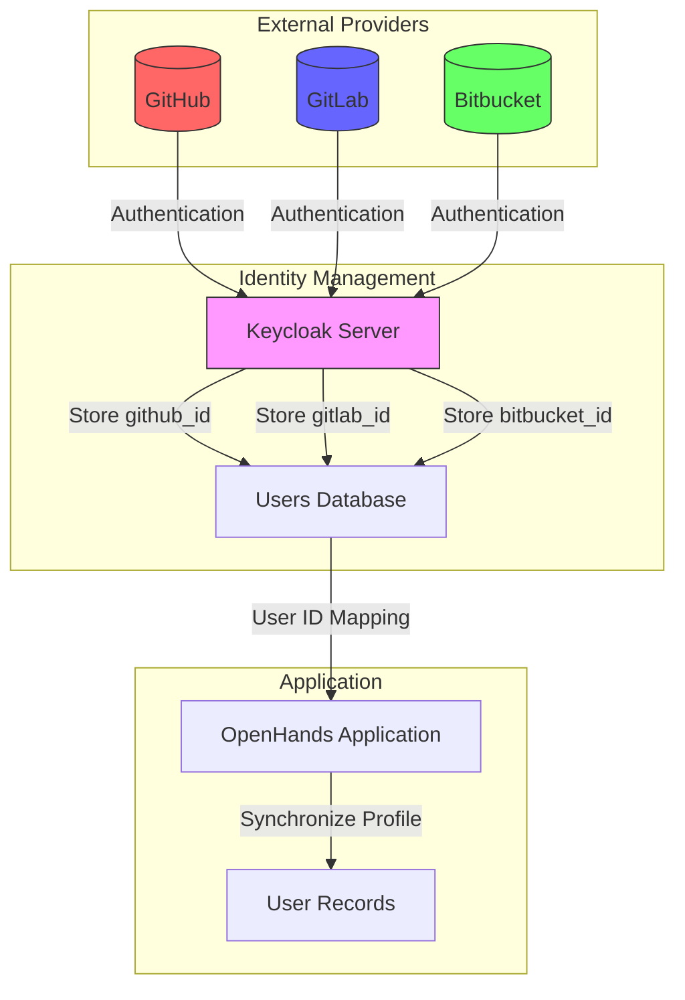
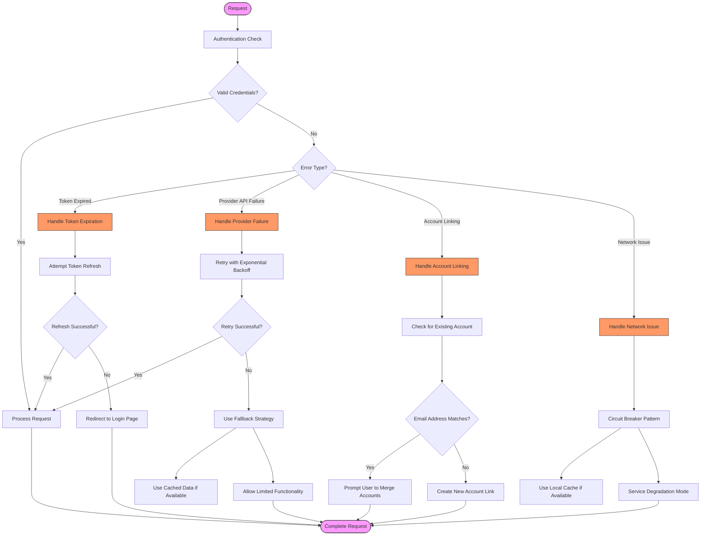
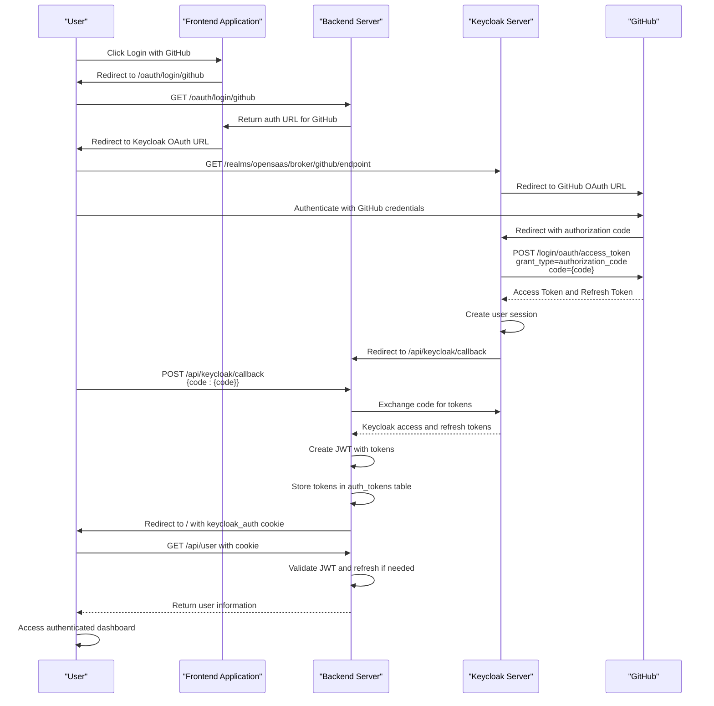
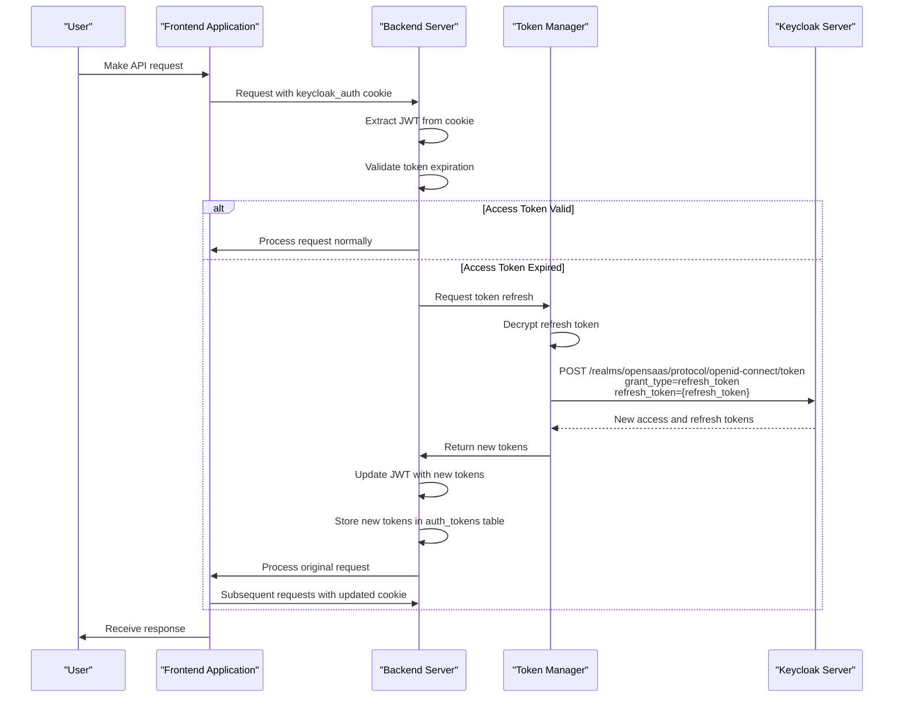
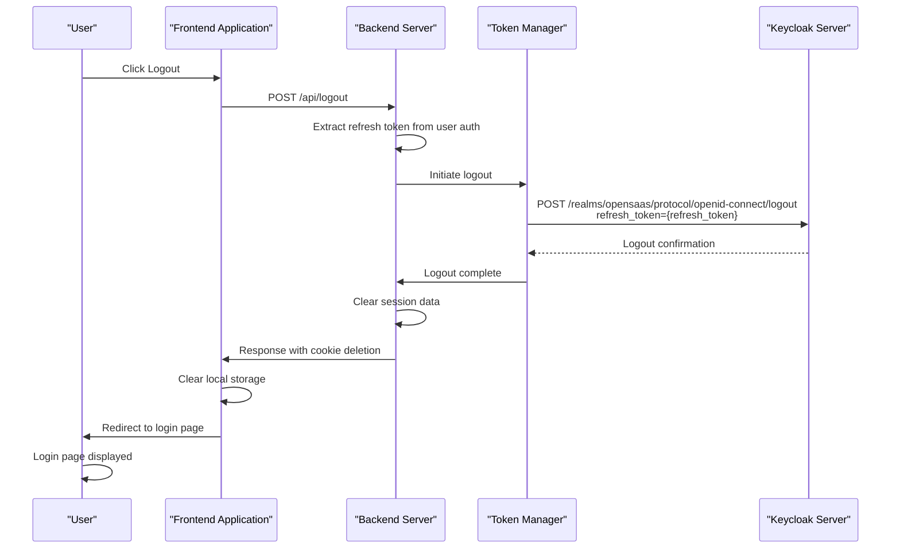

# Authentication Flow

<cite>
**Referenced Files in This Document**   
- [auth_tokens.py](file://enterprise/storage/auth_tokens.py)
- [auth_token_store.py](file://enterprise/storage/auth_token_store.py)
- [token_manager.py](file://enterprise/server/auth/token_manager.py)
- [saas_user_auth.py](file://enterprise/server/auth/saas_user_auth.py)
- [middleware.py](file://enterprise/server/middleware.py)
- [keycloak_manager.py](file://enterprise/server/auth/keycloak_manager.py)
- [auth_utils.py](file://enterprise/server/auth/auth_utils.py)
- [github_utils.py](file://enterprise/server/auth/github_utils.py)
- [gitlab_sync.py](file://enterprise/server/auth/gitlab_sync.py)
- [constants.py](file://enterprise/server/auth/constants.py)
- [auth-service.api.ts](file://frontend/src/api/auth-service/auth-service.api.ts)
- [use-auth-callback.ts](file://frontend/src/hooks/use-auth-callback.ts)
- [use-logout.ts](file://frontend/src/hooks/mutation/use-logout.ts)
- [generate-auth-url.ts](file://frontend/src/utils/generate-auth-url.ts)
</cite>

## Table of Contents
1. [Introduction](#introduction)
2. [Authentication Architecture](#authentication-architecture)
3. [OAuth2 Implementation with Keycloak](#oauth2-implementation-with-keycloak)
4. [JWT-Based Session Management](#jwt-based-session-management)
5. [Authentication Middleware and Request Flow](#authentication-middleware-and-request-flow)
6. [User Identity Synchronization](#user-identity-synchronization)
7. [Security Considerations](#security-considerations)
8. [Multi-Factor Authentication and Session Management](#multi-factor-authentication-and-session-management)
9. [Edge Cases and Error Handling](#edge-cases-and-error-handling)
10. [Sequence Diagrams](#sequence-diagrams)

## Introduction

The OpenHands authentication system implements a comprehensive security framework that integrates OAuth2 authentication through Keycloak with multiple identity providers including GitHub, GitLab, and Bitbucket. The system uses JWT-based session management for secure API access, with token refresh mechanisms and robust security features. This documentation details the complete authentication flow from initial login to authenticated API access, covering the architecture, implementation details, and security considerations.

**Section sources**
- [auth_tokens.py](file://enterprise/storage/auth_tokens.py)
- [token_manager.py](file://enterprise/server/auth/token_manager.py)
- [saas_user_auth.py](file://enterprise/server/auth/saas_user_auth.py)

## Authentication Architecture

The authentication architecture is built around Keycloak as the central identity and access management solution, which acts as an identity broker between the application and various external identity providers. The system follows a microservices-based approach with clear separation of concerns between authentication, session management, and authorization components.

The core components of the authentication architecture include:
- **Keycloak Integration**: Central authentication server handling OAuth2 flows with external providers
- **JWT-Based Session Management**: JSON Web Tokens for stateless session handling
- **Token Storage**: Secure storage of access and refresh tokens in the database
- **Authentication Middleware**: Intercepts requests to validate authentication status
- **User Identity Synchronization**: Maintains user identity mapping between external providers and internal system

The architecture supports multiple authentication methods including cookie-based authentication for web interfaces and bearer token authentication for API access. The system also implements rate limiting and various security measures to protect against common attacks.



**Diagram sources **
- [token_manager.py](file://enterprise/server/auth/token_manager.py)
- [middleware.py](file://enterprise/server/middleware.py)
- [auth_tokens.py](file://enterprise/storage/auth_tokens.py)

**Section sources**
- [token_manager.py](file://enterprise/server/auth/token_manager.py)
- [middleware.py](file://enterprise/server/middleware.py)
- [auth_tokens.py](file://enterprise/storage/auth_tokens.py)

## OAuth2 Implementation with Keycloak

The OAuth2 implementation leverages Keycloak as an identity broker to integrate with multiple external providers including GitHub, GitLab, and Bitbucket. When a user initiates authentication, they are redirected to Keycloak, which then redirects them to the selected identity provider for authentication.

The OAuth2 flow follows the authorization code grant type, which is the most secure OAuth2 flow for web applications. The process begins when the user clicks on a login option (GitHub, GitLab, etc.) in the frontend application. The frontend generates an authentication URL that redirects the user to Keycloak with the appropriate parameters.

Keycloak then redirects the user to the selected identity provider, where they authenticate with their credentials. Upon successful authentication, the identity provider redirects back to Keycloak with an authorization code. Keycloak exchanges this code for access and refresh tokens from the identity provider, storing them securely in the database.

The system supports multiple identity providers through a unified interface, with specific configuration for each provider's OAuth2 endpoints and credentials. The configuration is managed through environment variables, allowing for easy customization without code changes.



**Diagram sources **
- [keycloak_manager.py](file://enterprise/server/auth/keycloak_manager.py)
- [token_manager.py](file://enterprise/server/auth/token_manager.py)
- [auth-service.api.ts](file://frontend/src/api/auth-service/auth-service.api.ts)

**Section sources**
- [keycloak_manager.py](file://enterprise/server/auth/keycloak_manager.py)
- [token_manager.py](file://enterprise/server/auth/token_manager.py)
- [constants.py](file://enterprise/server/auth/constants.py)

## JWT-Based Session Management

The system implements JWT-based session management for secure and stateless authentication. When a user successfully authenticates through Keycloak, the backend generates a signed JWT that contains the user's authentication information and stores it in a secure HTTP-only cookie.

The JWT contains the following claims:
- **sub**: User identifier from Keycloak
- **access_token**: Encrypted Keycloak access token
- **refresh_token**: Encrypted Keycloak refresh token
- **accepted_tos**: Terms of service acceptance status
- **exp**: Token expiration time

The JWT is signed using a secret key configured in the environment variables, ensuring that the token cannot be tampered with. The token is set as an HTTP-only cookie to prevent access via JavaScript, mitigating XSS attacks.

Token refresh is handled automatically by the authentication middleware. When an API request is made with an expired access token, the middleware uses the refresh token to obtain a new access token from Keycloak without requiring the user to re-authenticate. This provides a seamless user experience while maintaining security.

The system implements token rotation for refresh tokens, where a new refresh token is issued with each refresh operation. This enhances security by limiting the lifespan of each refresh token and making it more difficult for attackers to exploit stolen tokens.



**Diagram sources **
- [saas_user_auth.py](file://enterprise/server/auth/saas_user_auth.py)
- [middleware.py](file://enterprise/server/middleware.py)
- [token_manager.py](file://enterprise/server/auth/token_manager.py)

**Section sources**
- [saas_user_auth.py](file://enterprise/server/auth/saas_user_auth.py)
- [middleware.py](file://enterprise/server/middleware.py)
- [token_manager.py](file://enterprise/server/auth/token_manager.py)

## Authentication Middleware and Request Flow

The authentication middleware is a critical component that intercepts all incoming requests to validate the user's authentication status. It operates as a FastAPI middleware, processing requests before they reach the application endpoints and responses before they are sent to the client.

The middleware supports multiple authentication methods, including cookie-based authentication for web requests and bearer token authentication for API calls. It first checks for the presence of the "keycloak_auth" cookie, and if not found, checks for a Bearer token in the Authorization header or the X-Session-API-Key header.

When a valid authentication token is found, the middleware validates it and attaches a user authentication object to the request state. This object provides access to the user's identity, tokens, and settings throughout the request lifecycle. If the access token has expired, the middleware automatically refreshes it using the refresh token.

For requests that modify authentication state (such as login or logout), the middleware handles setting or clearing the authentication cookie. It also implements CSRF protection by ensuring that authentication state changes are only allowed from trusted origins.

The request flow begins with the client making a request to the server. The middleware intercepts the request, validates the authentication credentials, and either allows the request to proceed or returns an appropriate error response. After the application processes the request, the middleware may update the authentication cookie if token refresh occurred during the request.



**Diagram sources **
- [middleware.py](file://enterprise/server/middleware.py)
- [token_manager.py](file://enterprise/server/auth/token_manager.py)
- [auth_tokens.py](file://enterprise/storage/auth_tokens.py)

**Section sources**
- [middleware.py](file://enterprise/server/middleware.py)
- [saas_user_auth.py](file://enterprise/server/auth/saas_user_auth.py)
- [token_manager.py](file://enterprise/server/auth/token_manager.py)

## User Identity Synchronization

The system implements robust user identity synchronization between external identity providers and internal user records. When a user authenticates through an external provider, the system creates a mapping between the external user ID and the internal Keycloak user ID, allowing for seamless integration across multiple services.

The synchronization process begins when a user authenticates with an external provider such as GitHub or GitLab. Keycloak receives the user information from the provider and creates or updates the user record in its database. The system then stores the external provider's user ID as an attribute in the Keycloak user profile, creating a bidirectional mapping.

For GitHub integration, the system stores the GitHub user ID in the "github_id" attribute of the Keycloak user profile. For GitLab, it uses a similar approach with the GitLab user ID. This allows the system to quickly look up the internal user ID when interacting with external APIs using the external user ID.

The synchronization also extends to user profile information such as email, username, and avatar. When a user authenticates, the system updates the internal user record with the latest information from the external provider, ensuring that user profiles remain current.

The system supports account linking, allowing users to connect multiple external identities to a single internal account. This is implemented by storing multiple external provider IDs in the user attributes and allowing authentication through any of the linked providers.



**Diagram sources **
- [token_manager.py](file://enterprise/server/auth/token_manager.py)
- [gitlab_sync.py](file://enterprise/server/auth/gitlab_sync.py)
- [github_utils.py](file://enterprise/server/auth/github_utils.py)

**Section sources**
- [token_manager.py](file://enterprise/server/auth/token_manager.py)
- [gitlab_sync.py](file://enterprise/server/auth/gitlab_sync.py)
- [github_utils.py](file://enterprise/server/auth/github_utils.py)

## Security Considerations

The authentication system implements multiple security measures to protect user accounts and data. These include token expiration and refresh mechanisms, CSRF protection, rate limiting, and secure token storage.

Token expiration is implemented with both access tokens and refresh tokens. Access tokens have a relatively short lifespan (typically one hour) to minimize the impact of token theft. Refresh tokens have a longer lifespan but are rotated with each use, meaning that each refresh operation invalidates the previous refresh token. This makes it more difficult for attackers to maintain persistent access with a stolen token.

CSRF protection is implemented through the use of secure, HTTP-only cookies for session storage. The authentication cookie is marked as SameSite=Strict to prevent cross-site request forgery attacks. Additionally, the system validates the origin of requests that modify authentication state to ensure they come from trusted domains.

Rate limiting is applied to authentication endpoints to prevent brute force attacks. The system uses Redis to track request rates per user or IP address, temporarily blocking excessive requests. This protects against password guessing and other automated attacks.

Token storage security is ensured through encryption of sensitive token data in the database. Both access and refresh tokens are encrypted using Fernet encryption with a key derived from the JWT secret. This protects token data even if the database is compromised.

The system also implements secure logout functionality that invalidates the user's session on both the client and server side. When a user logs out, the authentication cookie is cleared, and the refresh token is invalidated in Keycloak, preventing further use.

```mermaid
flowchart TD
Start([Security Measures]) --> TokenExpiration["Token Expiration Policy"]
TokenExpiration --> AccessToken["Access Token: 1 hour expiration"]
TokenExpiration --> RefreshToken["Refresh Token: Rotation on use"]
Start --> CSRFProtection["CSRF Protection"]
CSRFProtection --> HttpOnly["HTTP-only Cookies"]
CSRFProtection --> SecureFlag["Secure Flag (HTTPS only)"]
CSRFProtection --> SameSite["SameSite=Strict"]
Start --> RateLimiting["Rate Limiting"]
RateLimiting --> RedisTracking["Track requests in Redis"]
RateLimiting --> BlockExcessive["Block excessive requests"]
Start --> TokenEncryption["Token Encryption"]
TokenEncryption --> Fernet["Fernet encryption with JWT secret"]
TokenEncryption --> EncryptedStorage["Encrypted storage in database"]
Start --> SecureLogout["Secure Logout"]
SecureLogout --> ClearCookie["Clear authentication cookie"]
SecureLogout --> InvalidateToken["Invalidate refresh token in Keycloak"]
style Start fill:#f9f,stroke:#333
style TokenExpiration fill:#bbf,stroke:#333
style CSRFProtection fill:#bbf,stroke:#333
style RateLimiting fill:#bbf,stroke:#333
style TokenEncryption fill:#bbf,stroke:#333
style SecureLogout fill:#bbf,stroke:#333
```



**Diagram sources **
- [token_manager.py](file://enterprise/server/auth/token_manager.py)
- [middleware.py](file://enterprise/server/middleware.py)
- [saas_user_auth.py](file://enterprise/server/auth/saas_user_auth.py)

**Section sources**
- [token_manager.py](file://enterprise/server/auth/token_manager.py)
- [middleware.py](file://enterprise/server/middleware.py)
- [saas_user_auth.py](file://enterprise/server/auth/saas_user_auth.py)

## Multi-Factor Authentication and Session Management

The system supports flexible session management with provisions for multi-factor authentication (MFA) integration, although MFA is currently not implemented. The architecture is designed to accommodate MFA in the future by separating authentication factors and supporting step-up authentication.

Session persistence is managed through refresh tokens that maintain the user's authenticated state across sessions. When a user logs in, an offline token (a special type of refresh token) is stored in the database, allowing the system to maintain long-term authentication state. This enables features like "remember me" functionality while still maintaining security through periodic token refresh.

The system implements session isolation between different authentication methods. Users can authenticate via cookie-based sessions for web access and bearer token sessions for API access simultaneously, with each session type having its own token lifecycle and refresh mechanism.

Session revocation is supported through both user-initiated logout and administrative actions. When a user logs out, their refresh token is invalidated in Keycloak, immediately terminating all active sessions. Administrators can also revoke sessions through user management interfaces.

The system monitors session activity and can automatically terminate inactive sessions based on configurable timeout policies. This helps protect against unauthorized access when users forget to log out from shared devices.

```mermaid
graph TD
subgraph "Session Types"
WebSession[Web Session<br/>(Cookie-based)]
APISession[API Session<br/>(Bearer Token)]
OfflineSession[Offline Session<br/>(Refresh Token)]
end
subgraph "Session Management"
TokenStore[Token Storage]
RefreshMechanism[Token Refresh]
Revocation[Session Revocation]
end
WebSession --> |Authentication| TokenStore
APISession --> |Authentication| TokenStore
OfflineSession --> |Long-term Auth| TokenStore
TokenStore --> |Secure Storage| RefreshMechanism
RefreshMechanism --> |Automatic Refresh| WebSession
RefreshMechanism --> |Automatic Refresh| APISession
Revocation --> |Invalidate Tokens| TokenStore
TokenStore --> |Terminate Sessions| WebSession
TokenStore --> |Terminate Sessions| APISession
style WebSession fill:#f9f,stroke:#333
style APISession fill:#f9f,stroke:#333
style OfflineSession fill:#f9f,stroke:#333
style TokenStore fill:#bbf,stroke:#333
style RefreshMechanism fill:#bbf,stroke:#333
style Revocation fill:#bbf,stroke:#333
```

**Diagram sources **
- [token_manager.py](file://enterprise/server/auth/token_manager.py)
- [auth_token_store.py](file://enterprise/storage/auth_token_store.py)
- [saas_user_auth.py](file://enterprise/server/auth/saas_user_auth.py)

**Section sources**
- [token_manager.py](file://enterprise/server/auth/token_manager.py)
- [auth_token_store.py](file://enterprise/storage/auth_token_store.py)
- [saas_user_auth.py](file://enterprise/server/auth/saas_user_auth.py)

## Edge Cases and Error Handling

The authentication system includes comprehensive error handling for various edge cases and failure scenarios. These include token revocation, provider API failures, account linking scenarios, and network connectivity issues.

When a token is revoked either by the user or due to security policies, the system gracefully handles the invalidation by redirecting the user to the login page and clearing local authentication state. The error handling middleware catches authentication errors and returns appropriate HTTP status codes (typically 401 Unauthorized) to trigger re-authentication.

Provider API failures are handled with retry mechanisms and fallback strategies. The system implements exponential backoff for retrying failed API calls to external identity providers, preventing cascading failures during provider outages. When a provider API is unavailable, the system may fall back to cached user information or allow limited functionality until the provider is restored.

Account linking scenarios are managed through a consistent user identity model that supports multiple external identities per internal user account. When a user attempts to link a new identity, the system checks for existing accounts with the same email address and prompts for account merging if appropriate.

Network connectivity issues between the application and Keycloak are handled with circuit breaker patterns and local caching of authentication state when possible. The system also implements health checks for the authentication infrastructure to detect and respond to connectivity issues proactively.



**Diagram sources **
- [middleware.py](file://enterprise/server/middleware.py)
- [token_manager.py](file://enterprise/server/auth/token_manager.py)
- [saas_user_auth.py](file://enterprise/server/auth/saas_user_auth.py)

**Section sources**
- [middleware.py](file://enterprise/server/middleware.py)
- [token_manager.py](file://enterprise/server/auth/token_manager.py)
- [saas_user_auth.py](file://enterprise/server/auth/saas_user_auth.py)

## Sequence Diagrams

### Complete Authentication Flow

The complete authentication flow from user login to session establishment involves multiple steps across the frontend, backend, and external identity providers. This sequence diagram illustrates the end-to-end process.



**Diagram sources **
- [auth-service.api.ts](file://frontend/src/api/auth-service/auth-service.api.ts)
- [token_manager.py](file://enterprise/server/auth/token_manager.py)
- [middleware.py](file://enterprise/server/middleware.py)
- [saas_user_auth.py](file://enterprise/server/auth/saas_user_auth.py)

### Token Refresh Flow

The token refresh flow illustrates how the system automatically renews expired access tokens without requiring user interaction, providing a seamless experience while maintaining security.



**Diagram sources **
- [middleware.py](file://enterprise/server/middleware.py)
- [token_manager.py](file://enterprise/server/auth/token_manager.py)
- [auth_token_store.py](file://enterprise/storage/auth_token_store.py)
- [saas_user_auth.py](file://enterprise/server/auth/saas_user_auth.py)

### Logout Flow

The logout flow demonstrates how the system securely terminates user sessions by invalidating tokens on both the client and server side.



**Diagram sources **
- [use-logout.ts](file://frontend/src/hooks/mutation/use-logout.ts)
- [middleware.py](file://enterprise/server/middleware.py)
- [token_manager.py](file://enterprise/server/auth/token_manager.py)
- [saas_user_auth.py](file://enterprise/server/auth/saas_user_auth.py)