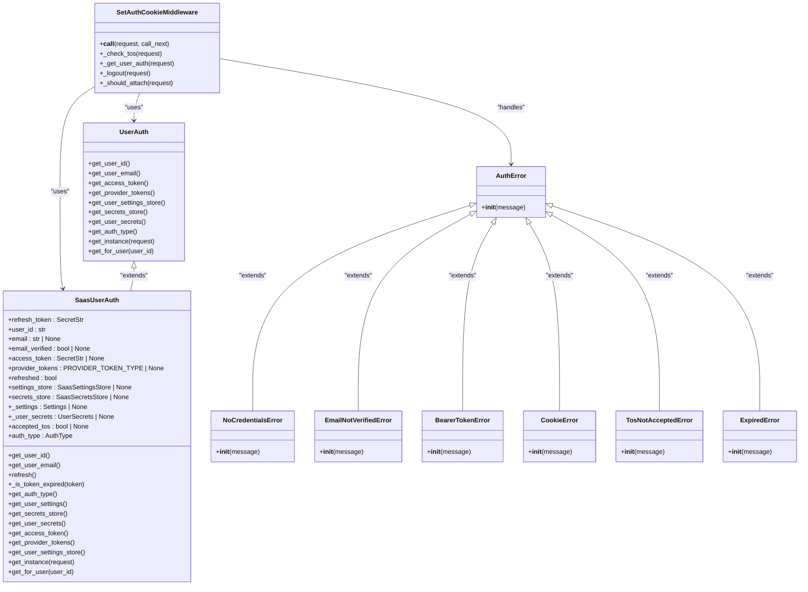
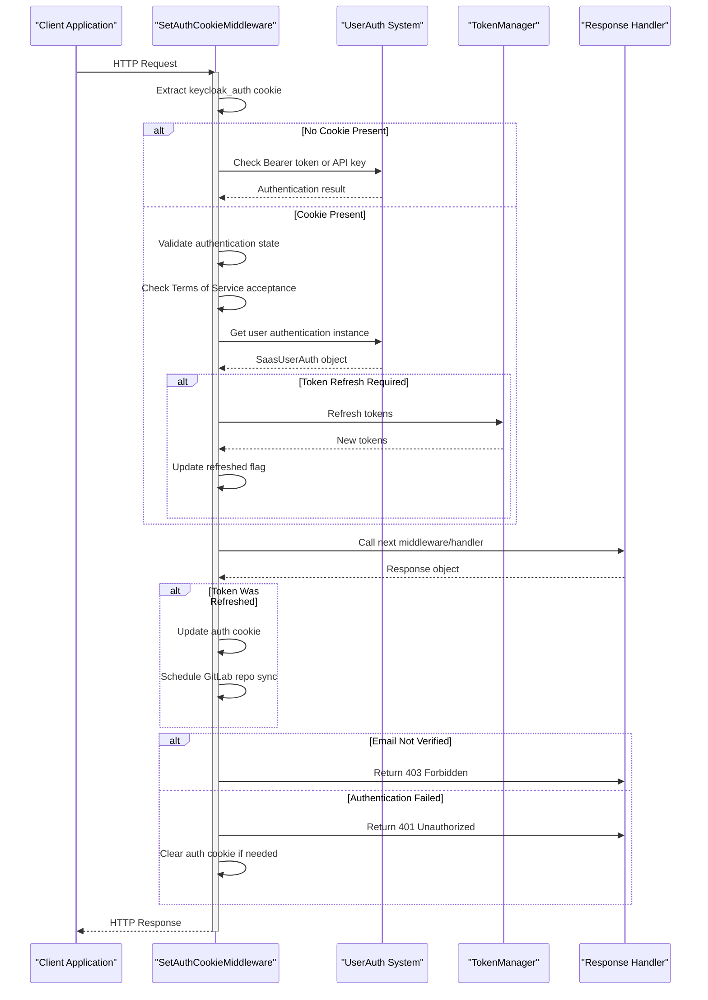
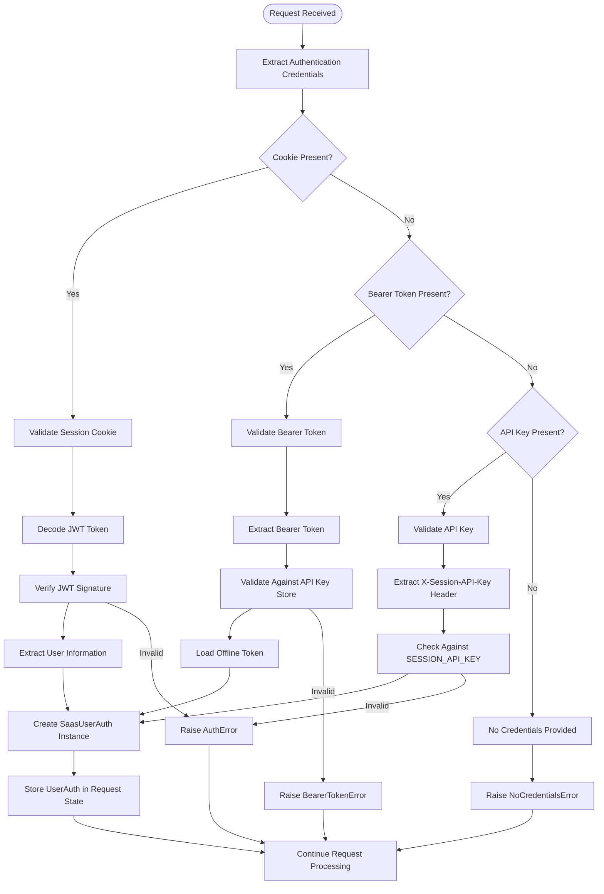
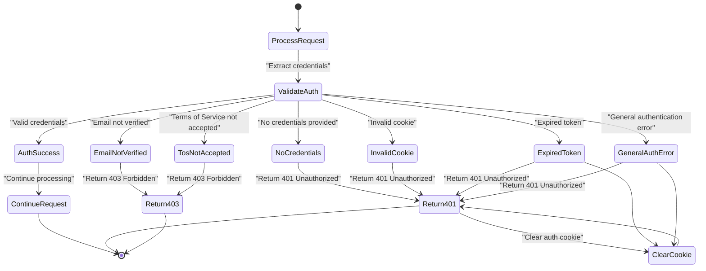
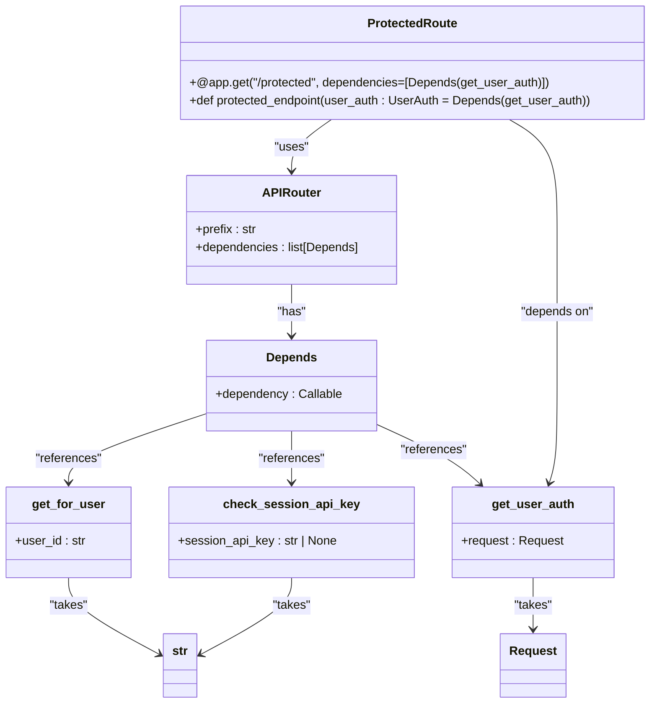
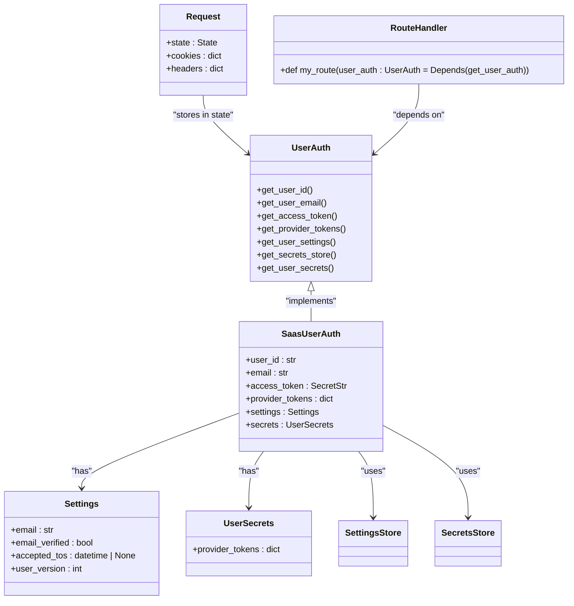

# Authentication Middleware

<cite>
**Referenced Files in This Document**   
- [middleware.py](file://enterprise/server/middleware.py)
- [user_auth.py](file://openhands/server/user_auth/user_auth.py)
- [saas_user_auth.py](file://enterprise/server/auth/saas_user_auth.py)
- [auth_error.py](file://enterprise/server/auth/auth_error.py)
- [token_manager.py](file://enterprise/server/auth/token_manager.py)
- [dependencies.py](file://openhands/server/dependencies.py)
- [auth.py](file://enterprise/server/routes/auth.py)
- [api_key_store.py](file://enterprise/storage/api_key_store.py)
</cite>

## Table of Contents
1. [Introduction](#introduction)
2. [Authentication Middleware Architecture](#authentication-middleware-architecture)
3. [Request Flow Through Middleware](#request-flow-through-middleware)
4. [Authentication Methods and Validation Strategies](#authentication-methods-and-validation-strategies)
5. [Exception Handling and Error Responses](#exception-handling-and-error-responses)
6. [Integration with FastAPI Dependency System](#integration-with-fastapi-dependency-system)
7. [User Context Injection](#user-context-injection)
8. [Performance Considerations](#performance-considerations)
9. [Conclusion](#conclusion)

## Introduction

The authentication middleware layer in the OpenHands system provides a comprehensive security framework for protecting API endpoints and ensuring authorized access to resources. This documentation details the implementation of the authentication system, which supports multiple authentication methods including session cookies, API keys, and Bearer tokens. The middleware intercepts incoming HTTP requests, validates authentication state, and injects user context into the request flow for downstream processing.

The system is designed with extensibility in mind, allowing for custom authentication implementations through the `UserAuth` abstract base class. The authentication flow is integrated with Keycloak for identity management, with additional support for GitHub, GitLab, and Bitbucket integrations. The middleware handles token validation, refresh operations, and proper error responses for various authentication failure scenarios.

**Section sources**
- [middleware.py](file://enterprise/server/middleware.py#L1-L175)
- [user_auth.py](file://openhands/server/user_auth/user_auth.py#L1-L107)

## Authentication Middleware Architecture

The authentication system is built around a middleware-based architecture that intercepts requests before they reach the application endpoints. The core component is the `SetAuthCookieMiddleware` class, which handles the authentication lifecycle including token validation, refresh operations, and cookie management.

**Diagram sources**
- [middleware.py](file://enterprise/server/middleware.py#L26-L175)
- [user_auth.py](file://openhands/server/user_auth/user_auth.py#L18-L87)
- [saas_user_auth.py](file://enterprise/server/auth/saas_user_auth.py#L43-L324)
- [auth_error.py](file://enterprise/server/auth/auth_error.py#L1-L41)

## Request Flow Through Middleware

The authentication middleware processes incoming requests through a well-defined flow that ensures proper authentication state validation before allowing access to protected resources. The request flow begins with the `SetAuthCookieMiddleware.__call__` method, which serves as the entry point for all incoming requests.

**Diagram sources**
- [middleware.py](file://enterprise/server/middleware.py#L32-L97)
- [saas_user_auth.py](file://enterprise/server/auth/saas_user_auth.py#L207-L225)
- [token_manager.py](file://enterprise/server/auth/token_manager.py#L589-L599)

## Authentication Methods and Validation Strategies

The authentication system supports multiple authentication methods, each with its own validation strategy. The system determines the appropriate validation approach based on the authentication credentials provided in the request. The primary authentication methods include session cookies, Bearer tokens, and API keys.

**Diagram sources**
- [middleware.py](file://enterprise/server/middleware.py#L102-L149)
- [saas_user_auth.py](file://enterprise/server/auth/saas_user_auth.py#L207-L225)
- [dependencies.py](file://openhands/server/dependencies.py#L10-L17)
- [api_key_store.py](file://enterprise/storage/api_key_store.py#L49-L72)

## Exception Handling and Error Responses

The authentication middleware implements comprehensive exception handling for various authentication failure scenarios. When authentication validation fails, the middleware catches specific exception types and returns appropriate HTTP status codes and error responses to the client.

The system defines several specific exception types that inherit from the base `AuthError` class:

- **NoCredentialsError**: Raised when no authentication credentials are provided in the request
- **EmailNotVerifiedError**: Raised when the user's email address has not been verified
- **BearerTokenError**: Raised when there is an error decoding or validating a Bearer token
- **CookieError**: Raised when there is an error decoding or validating the authentication cookie
- **TosNotAcceptedError**: Raised when the user has not accepted the Terms of Service
- **ExpiredError**: Raised when an authentication token has expired

Each exception type triggers a specific error response with the appropriate HTTP status code (401 for unauthorized access, 403 for forbidden access) and a JSON response body containing an error message.

**Section sources**
- [middleware.py](file://enterprise/server/middleware.py#L69-L97)
- [auth_error.py](file://enterprise/server/auth/auth_error.py#L1-L41)

## Integration with FastAPI Dependency System

The authentication system integrates seamlessly with FastAPI's dependency injection system, allowing protected routes to declare authentication requirements through dependency parameters. The system provides several mechanisms for route protection, including direct middleware application and dependency-based authentication checks.

The integration works through several key components:

1. **Dependency Functions**: The system provides dependency functions like `get_user_auth` and `get_for_user` that can be used as FastAPI dependencies in route definitions.

2. **Session API Key Protection**: The `check_session_api_key` function validates the `X-Session-API-Key` header against an environment variable, providing an additional layer of protection for specific endpoints.

3. **Route-Level Protection**: API routers can be configured with dependencies that apply to all routes within that router, ensuring consistent authentication requirements across related endpoints.

4. **Parameter-Level Injection**: Routes can request the authenticated user context directly as a parameter, with FastAPI automatically resolving the dependency through the `get_user_auth` function.

This integration allows for flexible security configurations, where different routes or route groups can have different authentication requirements based on their sensitivity and intended use.

**Section sources**
- [dependencies.py](file://openhands/server/dependencies.py#L10-L24)
- [user_auth.py](file://openhands/server/user_auth/user_auth.py#L89-L106)
- [auth.py](file://enterprise/server/routes/auth.py#L398-L401)

## User Context Injection

The authentication middleware injects user context into the request flow, making authenticated user information available to downstream route handlers and services. This is achieved through the `UserAuth` abstraction, which provides a consistent interface for accessing user-related data regardless of the authentication method used.

The user context injection process works as follows:

1. When a request is received, the middleware checks for authentication credentials and validates them.

2. If authentication is successful, an instance of `SaasUserAuth` (or another `UserAuth` implementation) is created and stored in the request state.

3. Subsequent route handlers can access the authenticated user context by declaring a dependency on the `get_user_auth` function.

4. The `UserAuth` interface provides methods to access various aspects of the user's context, including:
   - User identifier and email address
   - Access tokens for the main authentication system
   - Provider tokens for integrated services (GitHub, GitLab, etc.)
   - User settings and preferences
   - User secrets and API keys

5. The system implements lazy loading and caching for expensive operations like database queries, ensuring that user data is only retrieved when needed and reused within the same request context.

This approach provides a clean separation between authentication concerns and business logic, allowing route handlers to focus on their primary functionality while having access to the authenticated user's context.

**Section sources**
- [user_auth.py](file://openhands/server/user_auth/user_auth.py#L35-L77)
- [saas_user_auth.py](file://enterprise/server/auth/saas_user_auth.py#L43-L205)

## Performance Considerations

The authentication system incorporates several performance optimizations to minimize overhead and reduce database queries during the authentication validation process. These optimizations are critical for maintaining responsive API performance, especially under high load conditions.

### Caching Mechanisms

The system implements multiple levels of caching to avoid redundant operations:

1. **Request-Scoped Caching**: User authentication instances are cached within the request state, ensuring that multiple calls to retrieve the same user's authentication context within a single request do not result in redundant database queries.

2. **Token Expiration Checking**: Before attempting to refresh tokens, the system checks token expiration times by decoding the JWT payload without signature verification, avoiding unnecessary network calls to the authentication server.

3. **Rate Limiting**: The system implements rate limiting at the middleware level to prevent abuse and protect backend services from excessive authentication requests.

### Database Query Optimization

The authentication flow is designed to minimize database interactions:

1. **Lazy Loading**: User settings and secrets are only loaded when explicitly requested through their respective methods, rather than being eagerly loaded for every authenticated request.

2. **Batched Operations**: When multiple pieces of user information are needed, the system attempts to retrieve them in a single database query where possible.

3. **Connection Pooling**: The system leverages SQLAlchemy's connection pooling to reuse database connections, reducing the overhead of establishing new connections for each authentication operation.

### Asynchronous Operations

All authentication operations are implemented asynchronously to prevent blocking the event loop:

1. **Non-Blocking I/O**: Network requests to external services (Keycloak, GitHub, GitLab) are performed asynchronously using `httpx.AsyncClient`.

2. **Background Tasks**: Certain operations, such as GitLab repository synchronization, are scheduled as background tasks to avoid delaying the main request response.

3. **Concurrent Validation**: When multiple validation steps are required, they are performed concurrently where possible to reduce overall latency.

These performance considerations ensure that the authentication middleware adds minimal overhead to request processing while maintaining robust security guarantees.

**Section sources**
- [saas_user_auth.py](file://enterprise/server/auth/saas_user_auth.py#L99-L120)
- [token_manager.py](file://enterprise/server/auth/token_manager.py#L288-L327)
- [middleware.py](file://enterprise/server/middleware.py#L218-L224)

## Conclusion

The authentication middleware layer in the OpenHands system provides a robust, extensible framework for securing API endpoints and managing user authentication. By supporting multiple authentication methods and integrating seamlessly with FastAPI's dependency system, the middleware offers flexibility in security configuration while maintaining a consistent interface for authenticated user context.

Key features of the authentication system include:

- Support for multiple authentication methods (session cookies, Bearer tokens, API keys)
- Comprehensive exception handling with appropriate HTTP status codes
- Seamless integration with FastAPI's dependency injection system
- Efficient user context injection for downstream route handlers
- Performance optimizations including caching and asynchronous operations

The system's modular design, centered around the `UserAuth` abstract base class, allows for easy extension and customization to meet specific security requirements. The implementation demonstrates best practices in authentication middleware design, balancing security, performance, and developer experience.