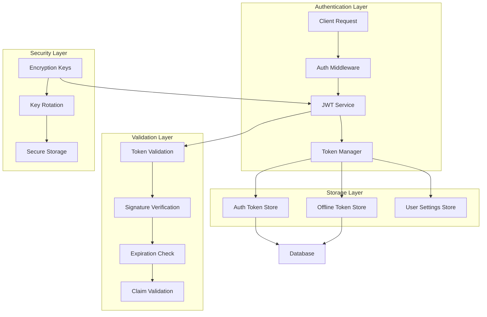
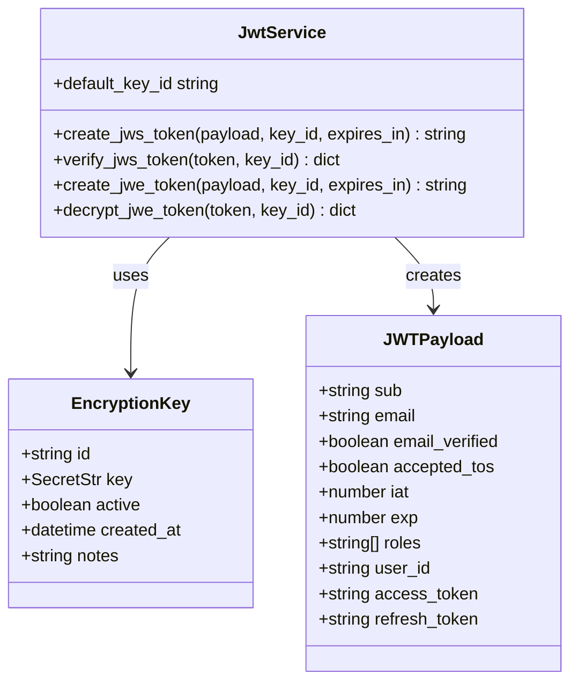
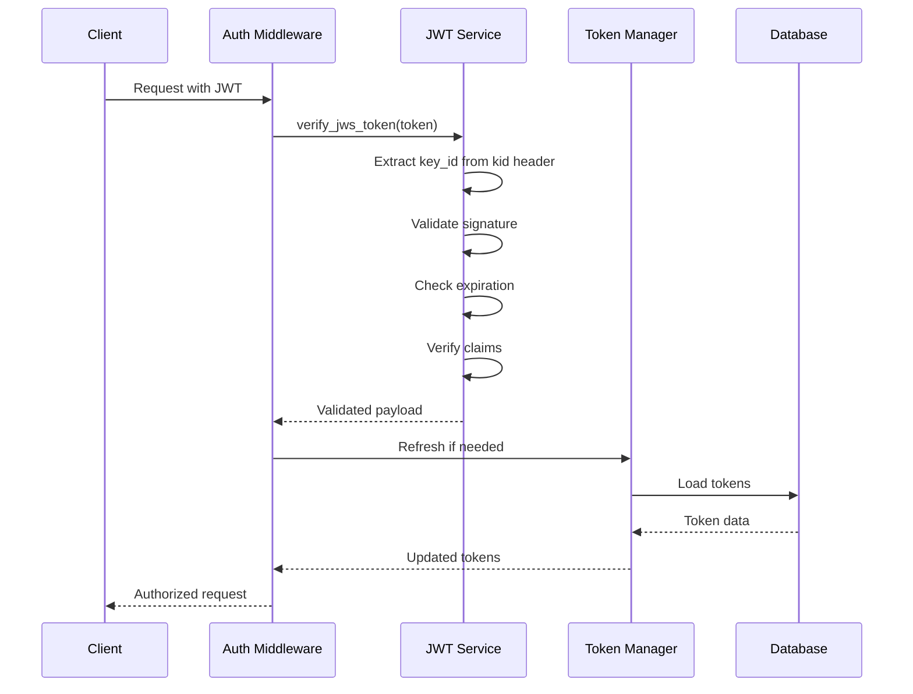
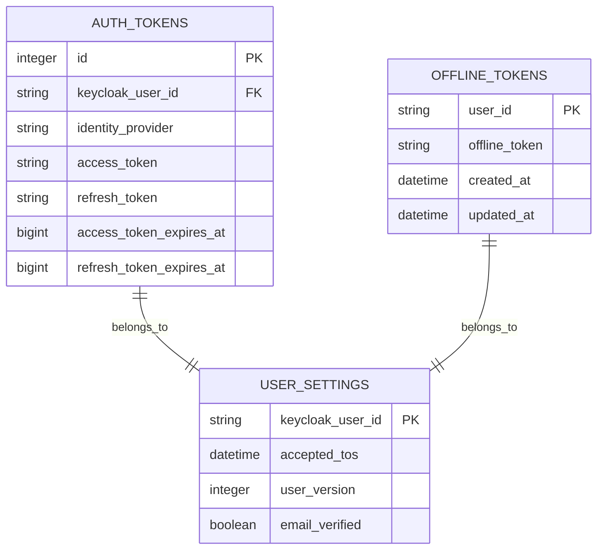
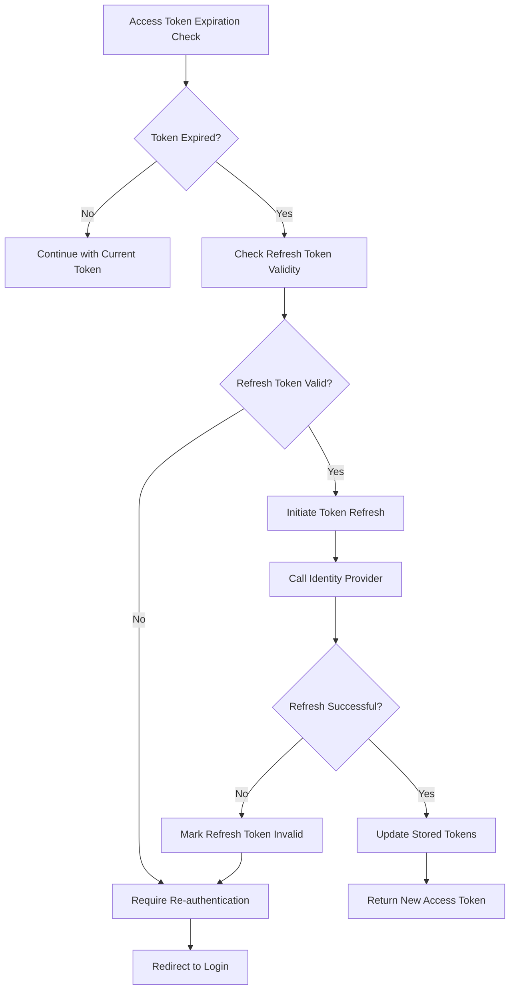
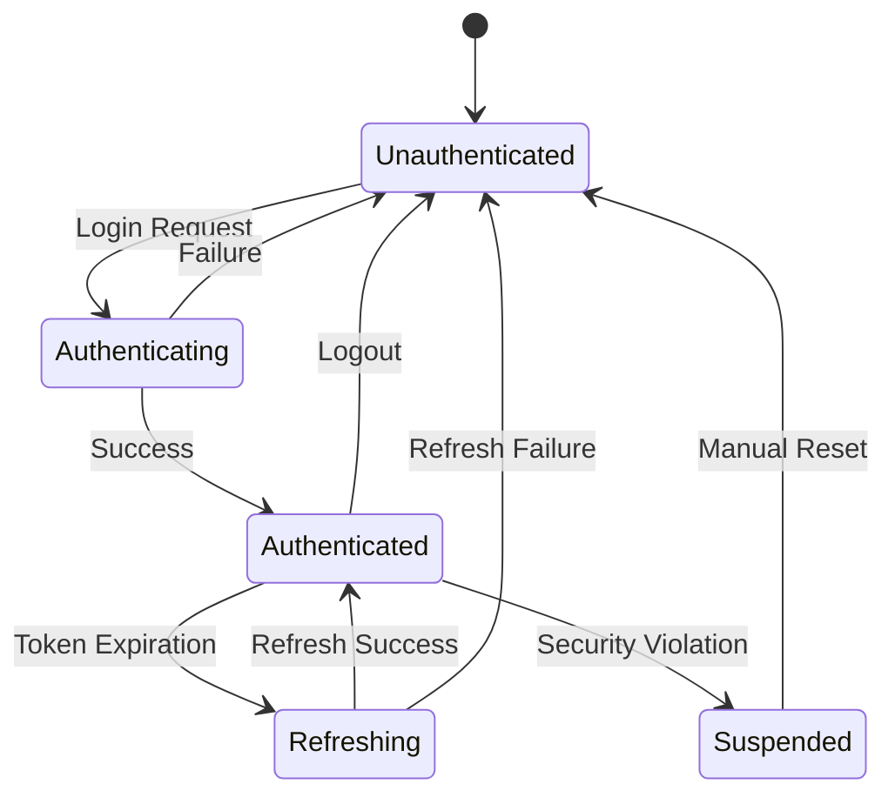
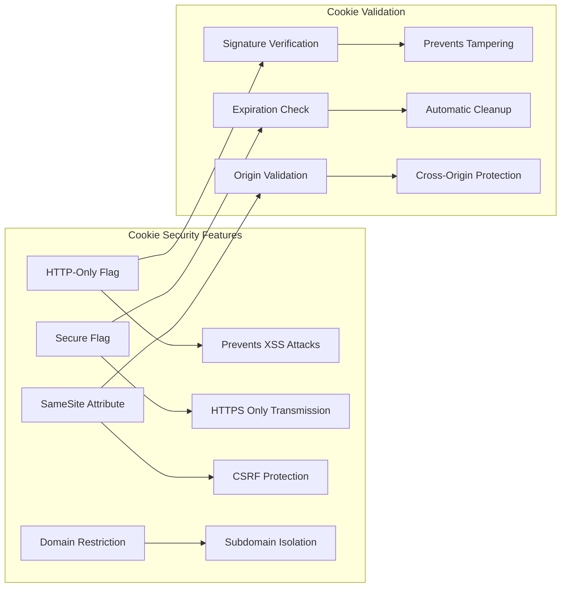
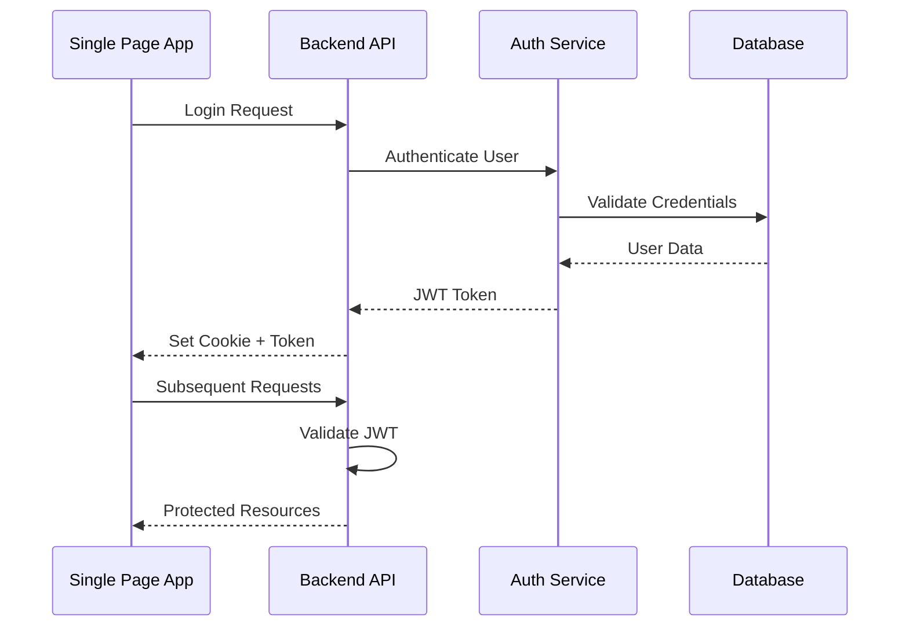
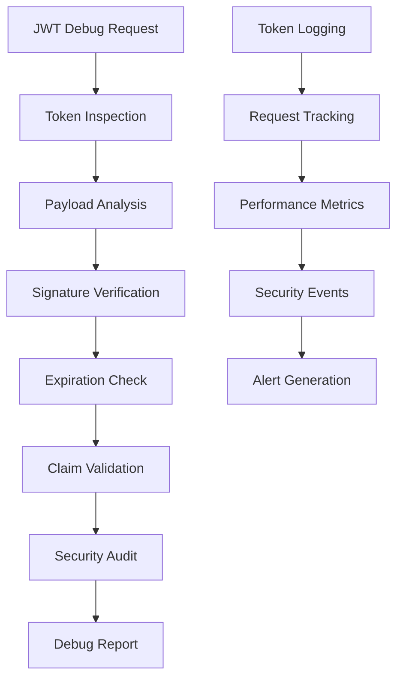

# JWT Management

<cite>
**Referenced Files in This Document**
- [jwt_service.py](file://openhands/app_server/services/jwt_service.py)
- [middleware.py](file://enterprise/server/middleware.py)
- [token_manager.py](file://enterprise/server/auth/token_manager.py)
- [auth.py](file://enterprise/server/routes/auth.py)
- [saas_user_auth.py](file://enterprise/server/auth/saas_user_auth.py)
- [encryption_key.py](file://openhands/app_server/utils/encryption_key.py)
- [config.py](file://enterprise/server/config.py)
- [auth_token_store.py](file://enterprise/storage/auth_token_store.py)
- [auth_tokens.py](file://enterprise/storage/auth_tokens.py)
- [stored_offline_token.py](file://enterprise/storage/stored_offline_token.py)
- [offline_token_store.py](file://enterprise/storage/offline_token_store.py)
- [test_auth_middleware.py](file://enterprise/tests/unit/test_auth_middleware.py)
- [test_token_manager.py](file://enterprise/tests/unit/test_token_manager.py)
</cite>

## Table of Contents
1. [Introduction](#introduction)
2. [JWT Architecture Overview](#jwt-architecture-overview)
3. [Token Generation Process](#token-generation-process)
4. [Token Validation and Verification](#token-validation-and-verification)
5. [Refresh Token Mechanism](#refresh-token-mechanism)
6. [Session Management](#session-management)
7. [Security Implementation](#security-implementation)
8. [Integration Patterns](#integration-patterns)
9. [Debugging and Monitoring](#debugging-and-monitoring)
10. [Best Practices](#best-practices)

## Introduction

OpenHands implements a comprehensive JWT-based session management system that handles authentication, authorization, and user session lifecycle management. The system supports both traditional cookie-based authentication and API key-based authentication, with robust token refresh mechanisms and secure storage practices.

The JWT implementation follows industry standards while incorporating enterprise-grade security features including multi-key support, token rotation, and comprehensive validation mechanisms.

## JWT Architecture Overview

The JWT system in OpenHands consists of several interconnected components that work together to provide secure session management:

**Diagram sources**
- [jwt_service.py](file://openhands/app_server/services/jwt_service.py#L21-L249)
- [middleware.py](file://enterprise/server/middleware.py#L26-L175)
- [token_manager.py](file://enterprise/server/auth/token_manager.py#L77-L670)

**Section sources**
- [jwt_service.py](file://openhands/app_server/services/jwt_service.py#L21-L249)
- [middleware.py](file://enterprise/server/middleware.py#L26-L175)

## Token Generation Process

### JWT Payload Structure

The JWT system generates tokens with standardized payload structures that include essential user and session information:

**Diagram sources**
- [jwt_service.py](file://openhands/app_server/services/jwt_service.py#L49-L230)
- [encryption_key.py](file://openhands/app_server/utils/encryption_key.py#L12-L59)

### Signing Algorithm Configuration

The system primarily uses HS256 (HMAC with SHA-256) for token signing, with support for JWE (JSON Web Encryption) for sensitive data:

| Algorithm | Purpose | Security Level | Use Case |
|-----------|---------|----------------|----------|
| HS256 | Standard JWT signing | High | Access tokens, session tokens |
| RS256 | RSA signing | Very High | GitHub app authentication |
| JWE | Encrypted tokens | Highest | Sensitive data storage |

### Token Expiration Policies

Token expiration is managed through standard JWT claims with configurable durations:

- **Access Tokens**: 1-hour default expiration with automatic refresh
- **Refresh Tokens**: Extended expiration (days/weeks) with rotation
- **Offline Tokens**: Long-term storage for offline access
- **Session Cookies**: Browser session duration with automatic cleanup

**Section sources**
- [jwt_service.py](file://openhands/app_server/services/jwt_service.py#L49-L230)
- [config.py](file://enterprise/server/config.py#L38-L41)

## Token Validation and Verification

### Signature Verification Process

The token validation system implements multi-layered verification to ensure token authenticity and integrity:

**Diagram sources**
- [middleware.py](file://enterprise/server/middleware.py#L99-L175)
- [jwt_service.py](file://openhands/app_server/services/jwt_service.py#L92-L128)

### Claim Validation

The system validates multiple JWT claims to ensure token validity:

| Claim | Purpose | Validation Logic |
|-------|---------|------------------|
| `iat` | Issued At | Must be in past |
| `exp` | Expiration | Must be in future |
| `sub` | Subject | Matches user ID |
| `email` | User Email | Valid email format |
| `email_verified` | Email Verification | Boolean flag |
| `accepted_tos` | Terms of Service | Boolean flag |

### Error Handling and Recovery

The validation system includes comprehensive error handling for various failure scenarios:

- **Invalid Signature**: Immediate rejection with appropriate error
- **Expired Tokens**: Automatic refresh attempt if possible
- **Malformed Tokens**: Graceful degradation with user re-authentication
- **Missing Claims**: Validation failure with detailed error messages

**Section sources**
- [jwt_service.py](file://openhands/app_server/services/jwt_service.py#L92-L128)
- [middleware.py](file://enterprise/server/middleware.py#L99-L175)

## Refresh Token Mechanism

### Refresh Token Storage

The system implements a sophisticated token storage mechanism that securely manages both access and refresh tokens:

**Diagram sources**
- [auth_tokens.py](file://enterprise/storage/auth_tokens.py#L5-L26)
- [stored_offline_token.py](file://enterprise/storage/stored_offline_token.py#L5-L18)

### Token Rotation Strategy

The refresh mechanism implements intelligent token rotation with safety measures:

**Diagram sources**
- [token_manager.py](file://enterprise/server/auth/token_manager.py#L288-L327)
- [auth_token_store.py](file://enterprise/storage/auth_token_store.py#L116-L185)

### Revocation Handling

The system includes mechanisms for token revocation and cleanup:

- **Automatic Revocation**: Invalid refresh tokens are automatically removed
- **Manual Revocation**: Users can manually revoke tokens through logout
- **Batch Cleanup**: Periodic cleanup of expired tokens
- **Security Monitoring**: Detection of suspicious token usage patterns

**Section sources**
- [token_manager.py](file://enterprise/server/auth/token_manager.py#L288-L327)
- [auth_token_store.py](file://enterprise/storage/auth_token_store.py#L116-L185)

## Session Management

### User Session Lifecycle

The session management system handles the complete lifecycle of user authentication sessions:

### Permission and Settings Encoding

JWT tokens encode user permissions and settings directly within the token payload:

| Setting Category | Storage Method | Security Level |
|------------------|----------------|----------------|
| Basic User Info | Direct Claims | Public |
| Role Permissions | Array Claims | Protected |
| Feature Flags | Boolean Claims | Protected |
| User Preferences | Nested Objects | Protected |
| Organization Settings | Hierarchical Data | Protected |

### Session Persistence

The system maintains session state across requests through multiple mechanisms:

- **Cookie-Based Sessions**: Traditional browser session management
- **API Key Sessions**: Programmatic access with long-lived tokens
- **Offline Sessions**: Persistent access for offline applications
- **Multi-Device Support**: Coordinated session management across devices

**Section sources**
- [saas_user_auth.py](file://enterprise/server/auth/saas_user_auth.py#L43-L324)
- [auth.py](file://enterprise/server/routes/auth.py#L42-L76)

## Security Implementation

### Secure Storage in HTTP-Only Cookies

The system implements comprehensive security measures for cookie-based authentication:

**Diagram sources**
- [auth.py](file://enterprise/server/routes/auth.py#L42-L76)
- [middleware.py](file://enterprise/server/middleware.py#L46-L53)

### Token Leakage Prevention

Multiple layers of protection prevent token leakage and unauthorized access:

| Protection Layer | Implementation | Effectiveness |
|------------------|----------------|---------------|
| Token Encryption | AES-256 encryption | High |
| Secure Headers | CSP, HSTS, X-Frame-Options | High |
| Rate Limiting | Redis-based throttling | Medium |
| IP Binding | Origin verification | Medium |
| Device Fingerprinting | Behavioral analysis | Low-Medium |

### Replay Attack Protection

The system implements several mechanisms to prevent replay attacks:

- **Nonce Validation**: Unique identifiers for each request
- **Timestamp Checking**: Requests must be within acceptable time windows
- **Token Versioning**: Each refresh increments token version
- **Session Binding**: Tokens bound to specific sessions

**Section sources**
- [auth.py](file://enterprise/server/routes/auth.py#L42-L76)
- [middleware.py](file://enterprise/server/middleware.py#L46-L53)

## Integration Patterns

### Frontend Integration

The JWT system integrates seamlessly with both SPA and traditional web applications:

**Diagram sources**
- [auth.py](file://enterprise/server/routes/auth.py#L98-L249)
- [middleware.py](file://enterprise/server/middleware.py#L26-L175)

### API Integration

RESTful APIs integrate with the JWT system through standardized authentication patterns:

- **Bearer Token Authentication**: Standard OAuth2 bearer tokens
- **Cookie-Based Authentication**: Traditional session cookies
- **Mixed Mode**: Support for both authentication methods
- **API Key Authentication**: Long-lived tokens for programmatic access

### Third-Party Integrations

The system supports integration with multiple identity providers:

| Provider | Authentication Method | Token Type | Refresh Support |
|----------|----------------------|------------|-----------------|
| GitHub | OAuth2 + JWT | Access/Refresh | Yes |
| GitLab | OAuth2 + JWT | Access/Refresh | Yes |
| Bitbucket | OAuth2 + JWT | Access/Refresh | Yes |
| Keycloak | OIDC + JWT | Access/Refresh | Yes |
| Enterprise SSO | OIDC + JWT | Access/Refresh | Yes |

**Section sources**
- [token_manager.py](file://enterprise/server/auth/token_manager.py#L288-L327)
- [auth.py](file://enterprise/server/routes/auth.py#L98-L249)

## Debugging and Monitoring

### Token Debugging Tools

The system provides comprehensive debugging capabilities for JWT-related issues:

### Monitoring and Analytics

The system includes built-in monitoring for JWT operations:

- **Token Creation Metrics**: Track token generation rates
- **Validation Performance**: Monitor verification latency
- **Refresh Success Rates**: Track token refresh effectiveness
- **Security Events**: Log authentication failures and anomalies
- **Usage Patterns**: Analyze token consumption patterns

### Error Reporting

Comprehensive error reporting helps diagnose authentication issues:

| Error Type | Severity | Resolution Strategy |
|------------|----------|-------------------|
| Invalid Signature | High | Regenerate token |
| Expired Token | Medium | Automatic refresh |
| Malformed Token | High | User re-authentication |
| Missing Claims | Medium | Validate token structure |
| Storage Failure | Critical | Emergency recovery |

**Section sources**
- [test_auth_middleware.py](file://enterprise/tests/unit/test_auth_middleware.py#L1-L236)
- [test_token_manager.py](file://enterprise/tests/unit/test_token_manager.py#L1-L670)

## Best Practices

### Token Management Guidelines

Follow these best practices for optimal JWT token management:

1. **Token Size Optimization**: Keep payloads minimal to reduce bandwidth
2. **Expiration Strategy**: Balance security and user experience
3. **Key Rotation**: Regular rotation of signing keys
4. **Storage Security**: Encrypt tokens at rest
5. **Network Security**: Always use HTTPS for token transmission

### Performance Optimization

Optimize JWT performance through these strategies:

- **Caching**: Cache frequently accessed tokens
- **Compression**: Compress large token payloads
- **Batch Operations**: Minimize token validation overhead
- **Async Processing**: Use asynchronous token operations
- **Resource Pooling**: Reuse connection pools for token services

### Security Hardening

Implement additional security measures:

- **Multi-Factor Authentication**: Require secondary authentication factors
- **Device Trust**: Build device trust relationships
- **Behavioral Analysis**: Detect anomalous authentication patterns
- **Zero Trust Architecture**: Verify every request independently
- **Continuous Monitoring**: Real-time security event detection

### Migration Strategies

Plan for JWT system evolution:

- **Version Compatibility**: Maintain backward compatibility during upgrades
- **Gradual Rollout**: Phased deployment of new features
- **Fallback Mechanisms**: Graceful degradation during updates
- **Testing Protocols**: Comprehensive testing for migration scenarios
- **Rollback Plans**: Quick recovery from migration failures

**Section sources**
- [jwt_service.py](file://openhands/app_server/services/jwt_service.py#L21-L249)
- [encryption_key.py](file://openhands/app_server/utils/encryption_key.py#L29-L59)