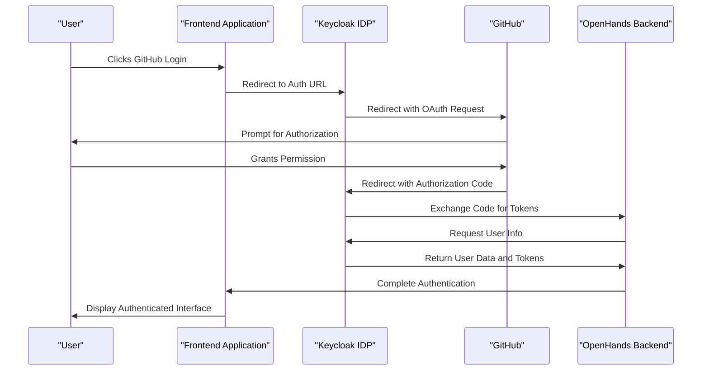
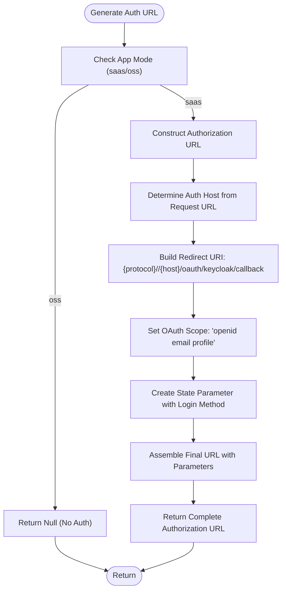
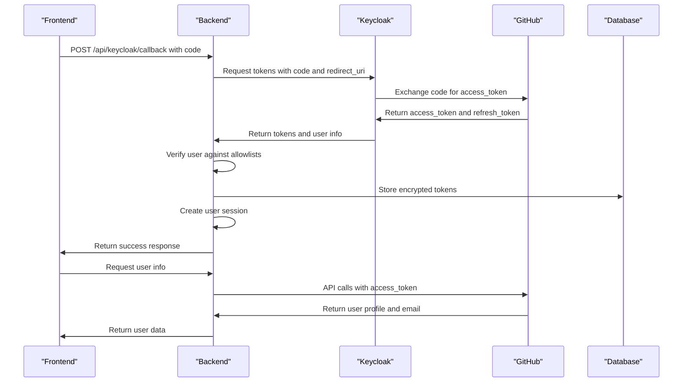
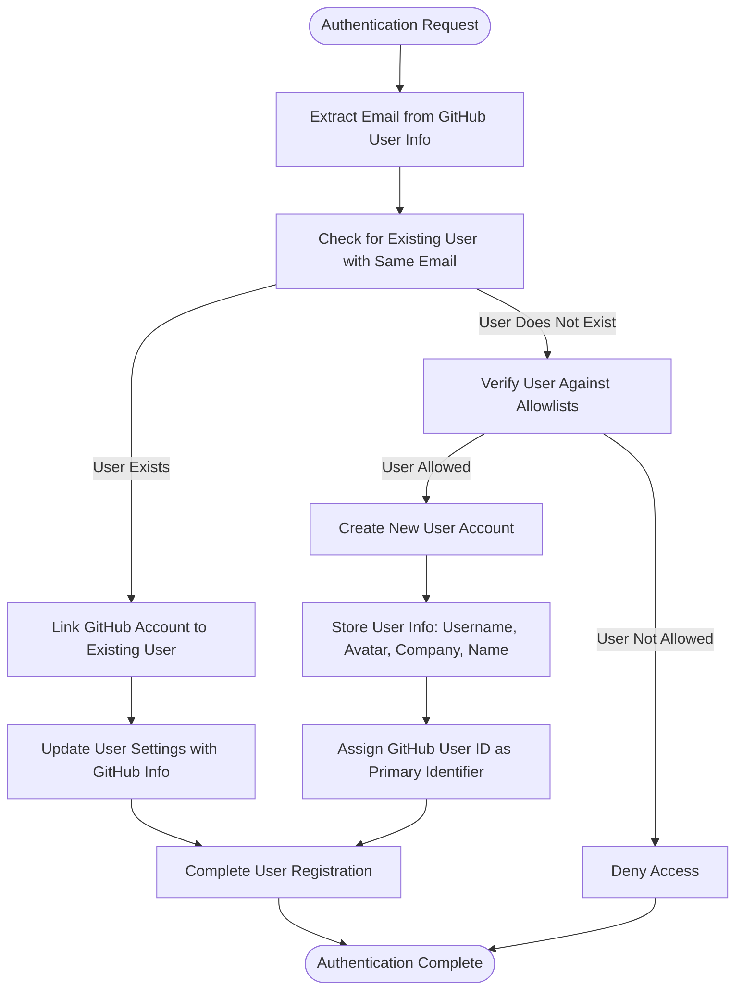
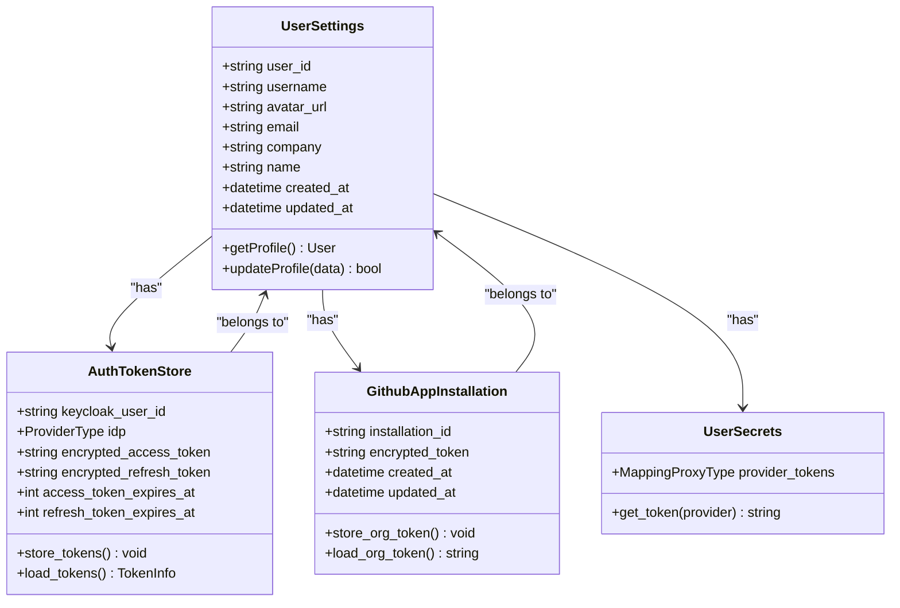
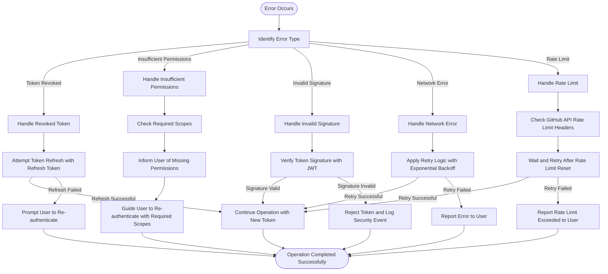
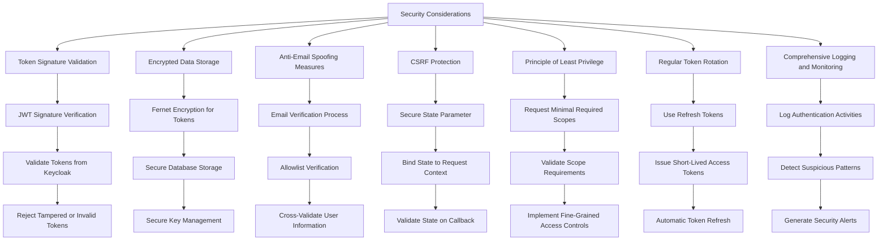

# GitHub OAuth Integration

<cite>
**Referenced Files in This Document**   
- [github_utils.py](file://enterprise/server/auth/github_utils.py)
- [token_manager.py](file://enterprise/server/auth/token_manager.py)
- [github_service.py](file://enterprise/integrations/github/github_service.py)
- [github_proxy.py](file://enterprise/server/routes/github_proxy.py)
- [use-auth-url.ts](file://frontend/src/hooks/use-auth-url.ts)
- [generate-auth-url.ts](file://frontend/src/utils/generate-auth-url.ts)
- [auth-service.api.ts](file://frontend/src/api/auth-service/auth-service.api.ts)
- [constants.py](file://enterprise/server/auth/constants.py)
</cite>

## Table of Contents
1. [Introduction](#introduction)
2. [OAuth Flow Overview](#oauth-flow-overview)
3. [Authorization URL Construction](#authorization-url-construction)
4. [Callback Handling Process](#callback-handling-process)
5. [User Creation and Linking Logic](#user-creation-and-linking-logic)
6. [GitHub User Data Storage and Usage](#github-user-data-storage-and-usage)
7. [Error Handling Scenarios](#error-handling-scenarios)
8. [Security Considerations](#security-considerations)

## Introduction
This document details the implementation of GitHub OAuth integration within the OpenHands system, focusing on the OAuth2 flow, callback handling, user management, and security considerations. The integration leverages Keycloak as an identity broker to handle GitHub authentication, enabling seamless user login and access to GitHub resources with appropriate scopes.

**Section sources**
- [github_utils.py](file://enterprise/server/auth/github_utils.py#L1-L127)
- [token_manager.py](file://enterprise/server/auth/token_manager.py#L1-L670)

## OAuth Flow Overview
The GitHub OAuth integration in OpenHands follows a standard OAuth2 authorization code flow with Keycloak acting as an identity provider. The process begins when a user initiates authentication through the frontend, which redirects them to GitHub via Keycloak. After the user grants permissions, GitHub redirects back to the application with an authorization code. This code is exchanged for access tokens through Keycloak, which then provides the application with the necessary credentials to access GitHub APIs on behalf of the user.

The integration supports the required scopes including `user:email`, `read:org`, and `repo` to enable comprehensive access to user information, organization details, and repository operations. The token management system ensures secure storage and refresh of access tokens, maintaining continuous access to GitHub resources while adhering to security best practices.

**Diagram sources**
- [github_utils.py](file://enterprise/server/auth/github_utils.py#L1-L127)
- [token_manager.py](file://enterprise/server/auth/token_manager.py#L1-L670)

## Authorization URL Construction
The authorization URL construction process begins in the frontend application, where the `use-auth-url.ts` and `generate-auth-url.ts` files handle the creation of the OAuth redirect URL. The `generateAuthUrl` function constructs the complete authorization URL by combining the Keycloak server URL with the necessary OAuth parameters including client ID, response type, redirect URI, scope, and state.

The authorization URL includes the required scopes `user:email`, `read:org`, and `repo` to ensure the application can access user email information, organization membership details, and repository data. The redirect URI is set to `/oauth/keycloak/callback`, which is the endpoint that will handle the OAuth callback from Keycloak. The state parameter includes contextual information about the original request to prevent CSRF attacks and ensure proper request routing.

**Diagram sources**
- [use-auth-url.ts](file://frontend/src/hooks/use-auth-url.ts#L1-L21)
- [generate-auth-url.ts](file://frontend/src/utils/generate-auth-url.ts#L1-L44)

**Section sources**
- [use-auth-url.ts](file://frontend/src/hooks/use-auth-url.ts#L1-L21)
- [generate-auth-url.ts](file://frontend/src/utils/generate-auth-url.ts#L1-L44)

## Callback Handling Process
The callback handling process begins at the `/oauth/keycloak/callback` endpoint, where the authorization code from GitHub (via Keycloak) is received and exchanged for access tokens. The `token_manager.py` file contains the core logic for handling this exchange through the `get_keycloak_tokens` method, which makes a token request to Keycloak with the authorization code and redirect URI.

Once the access and refresh tokens are obtained from Keycloak, the system verifies the token and retrieves user information through the `verify_keycloak_token` and `get_user_info` methods. The user information includes the GitHub user ID, which is used to establish the user session and link the user to their GitHub account. The tokens are then securely stored in the database using encryption, with the access token used for subsequent GitHub API calls.

The callback process also includes validation of the user against allowlists, which can be configured through environment variables to restrict access to specific users or organizations. This adds an additional layer of security and control over who can authenticate with the system.

**Diagram sources**
- [token_manager.py](file://enterprise/server/auth/token_manager.py#L88-L111)
- [github_utils.py](file://enterprise/server/auth/github_utils.py#L93-L109)

**Section sources**
- [token_manager.py](file://enterprise/server/auth/token_manager.py#L88-L111)
- [github_utils.py](file://enterprise/server/auth/github_utils.py#L93-L109)

## User Creation and Linking Logic
The user creation and linking logic in OpenHands follows a sophisticated process that matches GitHub email addresses to existing users or creates new accounts when necessary. When a user authenticates via GitHub, the system first attempts to find an existing user with the same email address. If found, the GitHub account is linked to the existing user account, preserving their settings and history.

The user verification process is handled by the `UserVerifier` class in `github_utils.py`, which checks if the user is allowed based on configured allowlists. These allowlists can be defined through environment variables pointing to text files or Google Sheets, providing flexible access control mechanisms. If the user is not in any allowlist and the waitlist is active, authentication is denied.

When creating new users, the system extracts comprehensive user information from GitHub including username, avatar URL, company, name, and email. This information is stored in the user settings and used throughout the application to personalize the user experience. The GitHub user ID is particularly important as it becomes the primary identifier for the user in the enterprise version of OpenHands.

**Diagram sources**
- [github_utils.py](file://enterprise/server/auth/github_utils.py#L11-L79)
- [token_manager.py](file://enterprise/server/auth/token_manager.py#L140-L145)

**Section sources**
- [github_utils.py](file://enterprise/server/auth/github_utils.py#L11-L79)
- [token_manager.py](file://enterprise/server/auth/token_manager.py#L140-L145)

## GitHub User Data Storage and Usage
GitHub user data is stored in the user settings and used throughout the OpenHands application to provide a personalized experience and enable GitHub-integrated features. The core user data including username, avatar URL, organizations, and email is retrieved during the authentication process and stored in the database through the `store_repositories_in_db` function and related storage mechanisms.

The user data is used in multiple contexts across the application. The avatar and username are displayed in the user interface to provide visual identification. The email address is used for notifications and communication. Organization membership information enables features that require access to organization repositories and resources. This data is also used in analytics and tracking to understand user behavior and improve the platform.

The system maintains a clear separation between user data and authentication tokens, storing them in different locations with appropriate security measures. User profile information is stored in the user settings table, while authentication tokens are encrypted and stored in dedicated token storage tables. This separation enhances security and allows for independent management of user data and authentication credentials.

**Diagram sources**
- [github_service.py](file://enterprise/integrations/github/github_service.py#L13-L144)
- [token_manager.py](file://enterprise/server/auth/token_manager.py#L177-L187)
- [storage/github_app_installation.py](file://enterprise/storage/github_app_installation.py)

**Section sources**
- [github_service.py](file://enterprise/integrations/github/github_service.py#L13-L144)
- [token_manager.py](file://enterprise/server/auth/token_manager.py#L177-L187)

## Error Handling Scenarios
The GitHub OAuth integration includes comprehensive error handling for various scenarios that may occur during authentication and API usage. For revoked tokens, the system implements automatic token refresh using the refresh token stored during the initial authentication. When a token refresh fails due to revocation, the user is prompted to re-authenticate through GitHub.

Insufficient permissions are handled by checking the required scopes during the authentication process and providing clear error messages to users when their GitHub token lacks necessary permissions. The system also validates token signatures using JWT verification to prevent security vulnerabilities from tampered tokens.

Network errors and API rate limiting are managed through retry mechanisms with exponential backoff. The `token_manager.py` file implements retry logic for Keycloak operations using the tenacity library, with configurable retry attempts and backoff strategies. This ensures resilience against temporary network issues and service interruptions.

**Diagram sources**
- [token_manager.py](file://enterprise/server/auth/token_manager.py#L146-L150)
- [token_manager.py](file://enterprise/server/auth/token_manager.py#L589-L593)
- [github_utils.py](file://enterprise/server/auth/github_utils.py#L107-L109)

**Section sources**
- [token_manager.py](file://enterprise/server/auth/token_manager.py#L146-L150)
- [github_utils.py](file://enterprise/server/auth/github_utils.py#L107-L109)

## Security Considerations
The GitHub OAuth integration in OpenHands incorporates several security considerations to protect user data and prevent unauthorized access. Token signatures are validated using JWT verification to ensure the integrity of authentication tokens received from Keycloak. The system uses encrypted storage for all sensitive credentials, with tokens encrypted using Fernet encryption before being stored in the database.

To protect against account takeover via email spoofing, the system implements strict email verification processes and cross-validates user information from multiple sources. The allowlist system provides an additional layer of protection by restricting authentication to approved users or organizations. The state parameter in the OAuth flow includes contextual information to prevent CSRF attacks and ensure that authentication requests are legitimate.

The integration also follows the principle of least privilege by requesting only the necessary scopes (`user:email`, `read:org`, `repo`) and implementing fine-grained access controls for GitHub API operations. Regular token rotation and refresh mechanisms reduce the window of opportunity for token compromise, while comprehensive logging and monitoring help detect and respond to suspicious activities.

**Diagram sources**
- [token_manager.py](file://enterprise/server/auth/token_manager.py#L46-L74)
- [github_utils.py](file://enterprise/server/auth/github_utils.py#L11-L79)
- [constants.py](file://enterprise/server/auth/constants.py)

**Section sources**
- [token_manager.py](file://enterprise/server/auth/token_manager.py#L46-L74)
- [github_utils.py](file://enterprise/server/auth/github_utils.py#L11-L79)