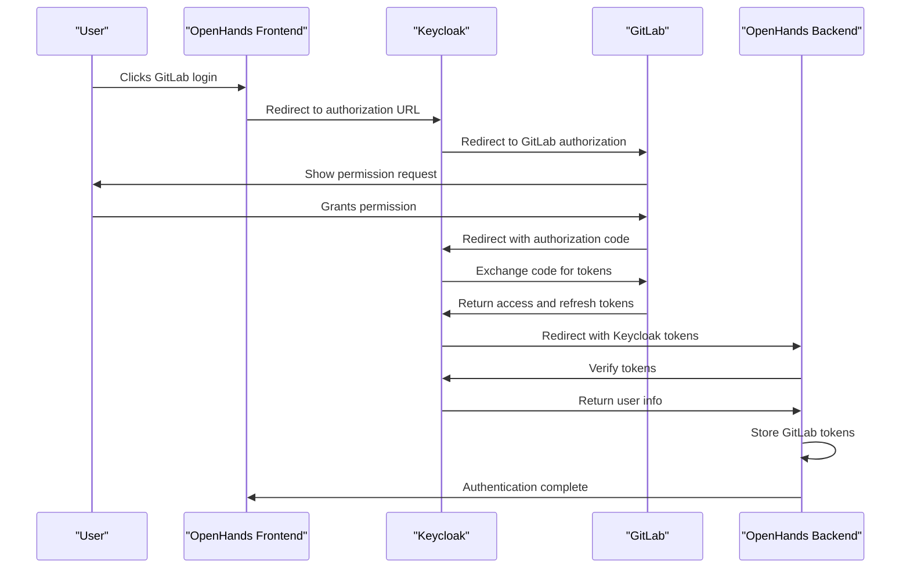
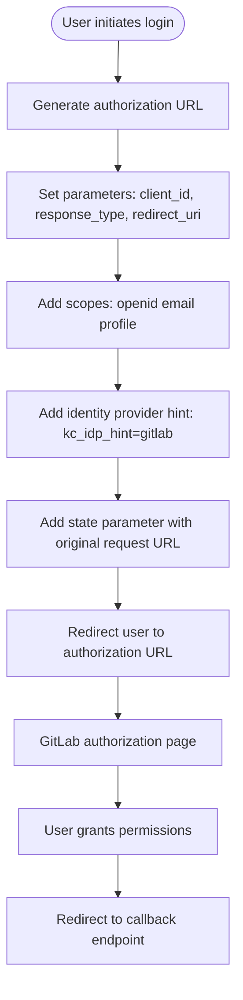
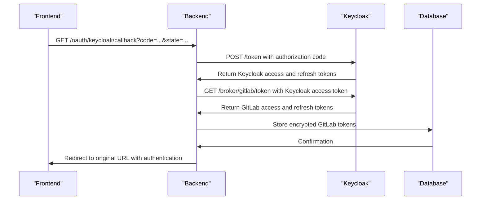
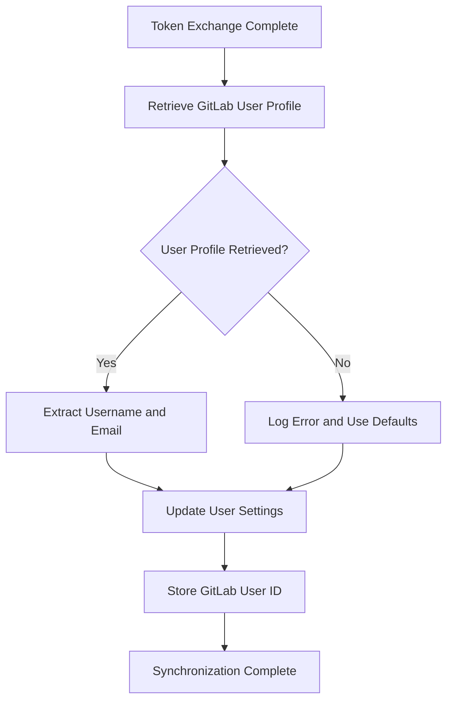
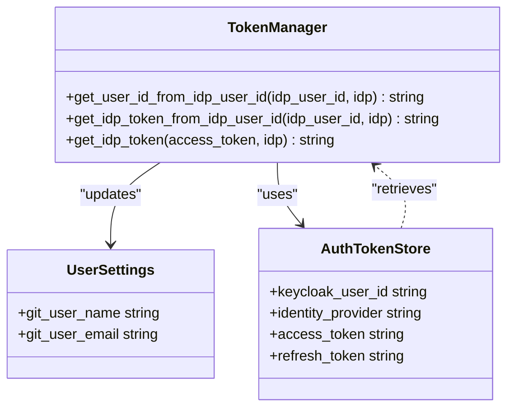
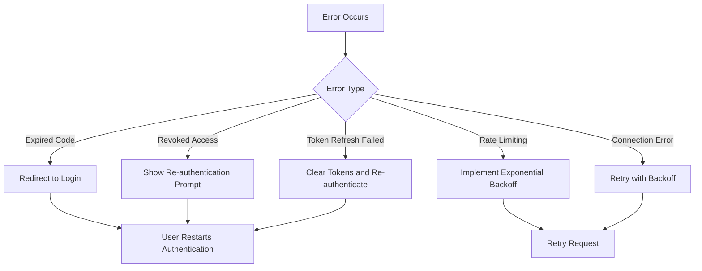
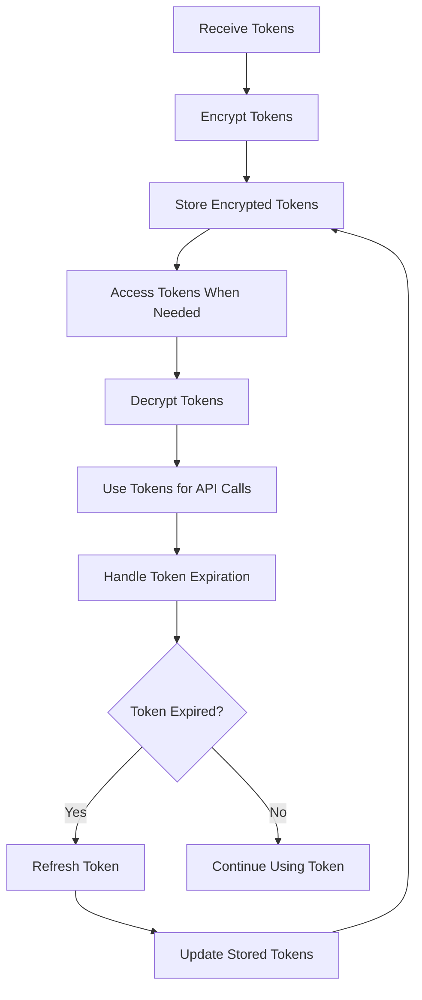

# GitLab OAuth Integration

<cite>
**Referenced Files in This Document**   
- [token_manager.py](file://enterprise/server/auth/token_manager.py)
- [gitlab_service.py](file://enterprise/integrations/gitlab/gitlab_service.py)
- [gitlab_manager.py](file://enterprise/integrations/gitlab/gitlab_manager.py)
- [gitlab_sync.py](file://enterprise/server/auth/gitlab_sync.py)
- [gitlab_callback_processor.py](file://enterprise/server/conversation_callback_processor/gitlab_callback_processor.py)
- [generate-auth-url.ts](file://frontend/src/utils/generate-auth-url.ts)
- [auth_utils.py](file://enterprise/server/auth/auth_utils.py)
- [user_settings.py](file://enterprise/storage/user_settings.py)
</cite>

## Table of Contents
1. [Introduction](#introduction)
2. [OAuth Flow Overview](#oauth-flow-overview)
3. [Authorization URL Construction](#authorization-url-construction)
4. [Callback Handling and Token Exchange](#callback-handling-and-token-exchange)
5. [User Synchronization Process](#user-synchronization-process)
6. [GitLab User ID Storage and Usage](#gitlab-user-id-storage-and-usage)
7. [Error Handling](#error-handling)
8. [Security Considerations](#security-considerations)

## Introduction
This document details the implementation of GitLab OAuth integration within the OpenHands system. The integration enables users to authenticate with GitLab using OAuth2, allowing the system to access GitLab resources on their behalf. The implementation leverages Keycloak as an identity broker to manage the OAuth flow, token storage, and user synchronization. This document covers the complete flow from authorization URL construction to user synchronization and security considerations.

## OAuth Flow Overview
The GitLab OAuth integration in OpenHands follows a standard OAuth2 authorization code flow with Keycloak acting as an identity broker. When a user initiates authentication, they are redirected to Keycloak with GitLab specified as the identity provider. Keycloak then redirects to GitLab's authorization endpoint, where the user grants permissions. After authorization, GitLab redirects back to Keycloak with an authorization code, which Keycloak exchanges for access and refresh tokens. These tokens are then used by OpenHands to access GitLab APIs on behalf of the user.



**Diagram sources**
- [token_manager.py](file://enterprise/server/auth/token_manager.py#L88-L111)
- [generate-auth-url.ts](file://frontend/src/utils/generate-auth-url.ts#L7-L44)

## Authorization URL Construction
The authorization URL for GitLab OAuth is constructed by the frontend and includes the necessary parameters for the OAuth flow. The URL is generated with specific scopes required for GitLab integration, including read_user and api permissions. The redirect URI is set to the Keycloak callback endpoint, which handles the OAuth response.

The authorization URL follows this pattern:
```
https://{keycloak-domain}/realms/allhands/protocol/openid-connect/auth?client_id=allhands&kc_idp_hint=gitlab&response_type=code&redirect_uri={redirect_uri}&scope=openid+email+profile&state={state}
```

The scopes parameter includes "openid", "email", and "profile" for basic user information, while the actual GitLab API access is controlled by the GitLab application's configured scopes (read_user, api, read_repository, write_repository).



**Diagram sources**
- [generate-auth-url.ts](file://frontend/src/utils/generate-auth-url.ts#L7-L44)
- [auth_utils.py](file://enterprise/server/auth/auth_utils.py)

## Callback Handling and Token Exchange
The callback handling process begins at the `/oauth/keycloak/callback` endpoint, where the authorization code from Keycloak is processed. The TokenManager component handles the token exchange process, retrieving both Keycloak tokens and the underlying GitLab tokens through Keycloak's broker functionality.

The token exchange process involves:
1. Receiving the authorization code and state parameter from Keycloak
2. Exchanging the authorization code for Keycloak access and refresh tokens
3. Using the Keycloak access token to retrieve the GitLab access token from Keycloak's token broker endpoint
4. Decrypting and storing the GitLab tokens in the database for future use

The TokenManager's `get_keycloak_tokens` method handles the initial token exchange, while the `get_idp_tokens_from_keycloak` method retrieves the GitLab-specific tokens using the Keycloak access token.



**Diagram sources**
- [token_manager.py](file://enterprise/server/auth/token_manager.py#L88-L243)
- [auth_utils.py](file://enterprise/server/auth/auth_utils.py)

## User Synchronization Process
After successful authentication, the system synchronizes the user's GitLab profile information with their OpenHands account. This process creates or updates user records based on the GitLab profile data, ensuring that username and email information is consistent across systems.

The user synchronization process is triggered after token exchange and involves:
1. Retrieving the user's GitLab profile information using the GitLab API
2. Extracting the username and email from the profile data
3. Updating the user's settings in the OpenHands system with the GitLab profile information
4. Storing the GitLab user ID for future integration purposes

The synchronization occurs through the SaaSGitLabService, which uses the GitLab API to retrieve user information and then updates the user settings accordingly. This ensures that the user's Git identity (name and email) is properly configured for Git operations within OpenHands.



**Diagram sources**
- [gitlab_service.py](file://enterprise/integrations/gitlab/gitlab_service.py#L140-L142)
- [user_settings.py](file://enterprise/storage/user_settings.py)

## GitLab User ID Storage and Usage
The GitLab user ID is stored in the user settings and used for various integration purposes throughout the system. When a user authenticates with GitLab, their GitLab user ID is retrieved and stored in the Keycloak user attributes, allowing for efficient lookup and association between OpenHands users and their GitLab identities.

The GitLab user ID is used for:
1. Token management - Associating GitLab tokens with the correct user
2. Repository access control - Verifying user permissions on GitLab repositories
3. Webhook management - Tracking user-specific webhooks
4. User identification - Ensuring consistent user identity across sessions

The TokenManager provides methods to convert between Keycloak user IDs and GitLab user IDs, enabling seamless integration between the authentication system and GitLab services. This bidirectional mapping ensures that the system can always retrieve the appropriate tokens and user information regardless of which ID is available.



**Diagram sources**
- [token_manager.py](file://enterprise/server/auth/token_manager.py#L488-L498)
- [user_settings.py](file://enterprise/storage/user_settings.py#L21-L26)

## Error Handling
The GitLab OAuth integration includes comprehensive error handling for common scenarios such as expired authorization codes, revoked application access, and token refresh failures. The system implements retry mechanisms and user-friendly error messages to handle these situations gracefully.

Key error handling scenarios include:
1. **Expired authorization codes**: When an authorization code has expired, the system redirects the user back to the login page to restart the authentication process.
2. **Revoked application access**: If the user has revoked OpenHands' access to their GitLab account, the system prompts the user to re-authorize the application.
3. **Token refresh failures**: When refresh tokens are expired or invalid, the system requires the user to re-authenticate.
4. **Rate limiting**: GitLab API rate limits are handled by implementing exponential backoff and queuing mechanisms.

The TokenManager class includes retry mechanisms with exponential backoff for handling temporary connection issues with Keycloak, ensuring robustness in distributed environments.



**Diagram sources**
- [token_manager.py](file://enterprise/server/auth/token_manager.py#L146-L151)
- [gitlab_service.py](file://enterprise/integrations/gitlab/gitlab_service.py)

## Security Considerations
The GitLab OAuth implementation includes several security measures to protect user credentials and ensure secure integration:

1. **Token encryption**: All GitLab access and refresh tokens are encrypted before storage using Fernet encryption with a key derived from the JWT secret.
2. **Secure token storage**: Tokens are stored in a dedicated database table with proper access controls, separate from user credentials.
3. **Redirect URI validation**: The system validates redirect URIs to prevent open redirect vulnerabilities.
4. **Token expiration handling**: The system proactively refreshes tokens before they expire and handles expired tokens gracefully.
5. **Secure cookie handling**: Authentication cookies are marked as secure and use appropriate SameSite policies.

The token encryption process uses the application's JWT secret to derive a Fernet key, ensuring that tokens cannot be decrypted without access to the server's secret key. This provides an additional layer of security beyond database access controls.



**Diagram sources**
- [token_manager.py](file://enterprise/server/auth/token_manager.py#L46-L74)
- [auth_token_store.py](file://enterprise/storage/auth_token_store.py)