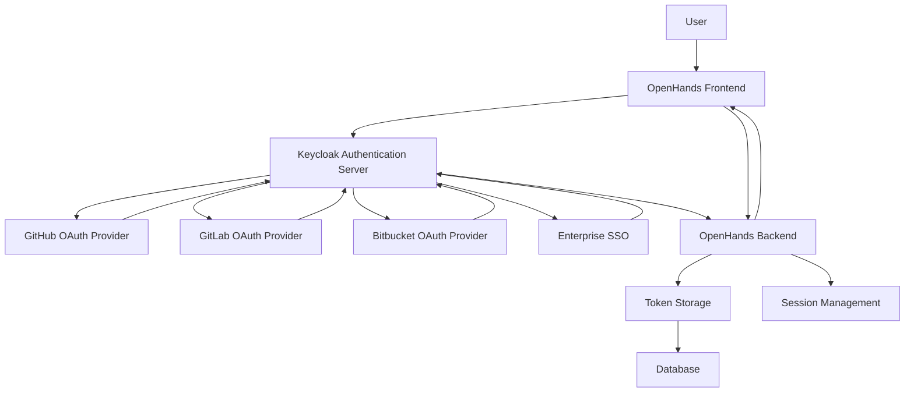
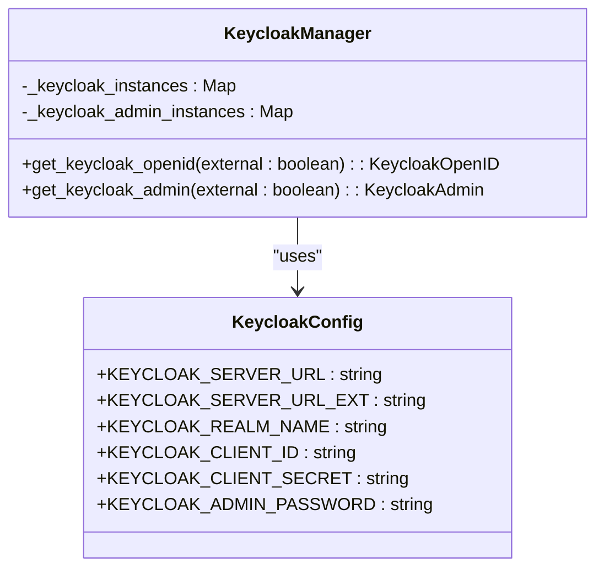
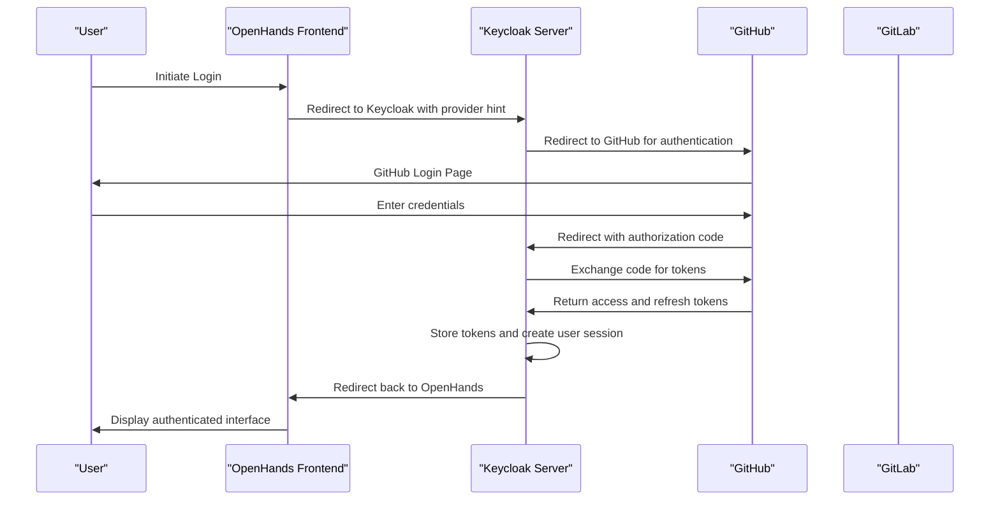
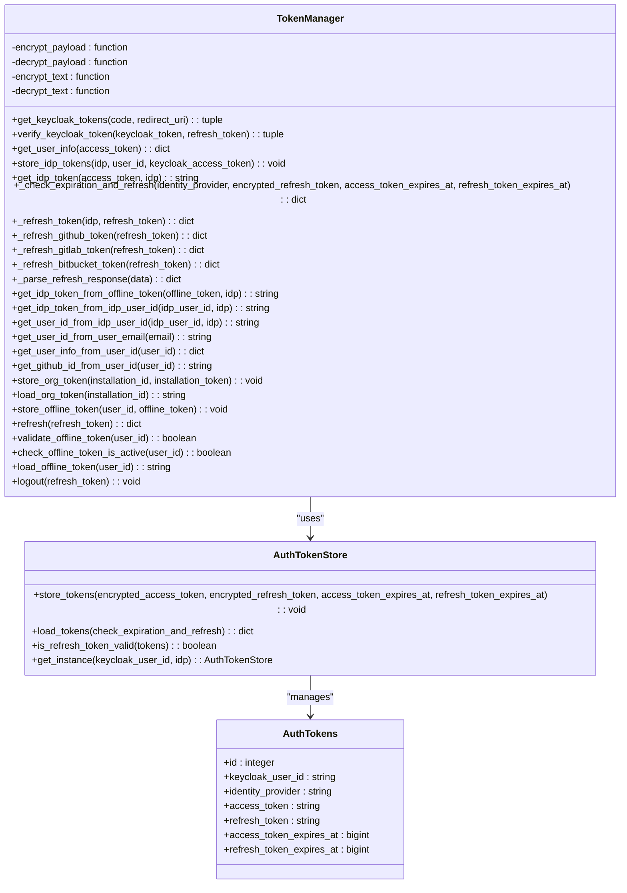
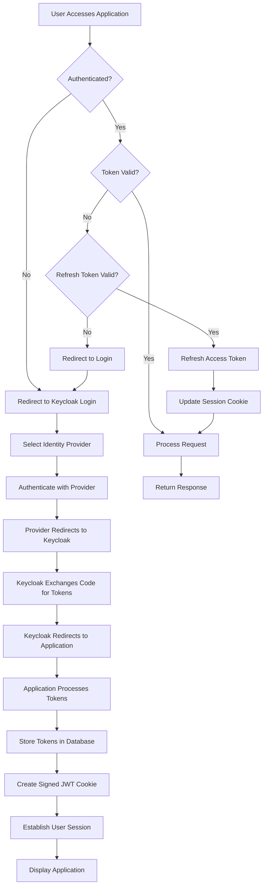

# Keycloak Configuration

<cite>
**Referenced Files in This Document**   
- [keycloak_manager.py](file://enterprise/server/auth/keycloak_manager.py)
- [constants.py](file://enterprise/server/auth/constants.py)
- [token_manager.py](file://enterprise/server/auth/token_manager.py)
- [auth.py](file://enterprise/server/routes/auth.py)
- [auth_token_store.py](file://enterprise/storage/auth_token_store.py)
- [auth_tokens.py](file://enterprise/storage/auth_tokens.py)
- [middleware.py](file://enterprise/server/middleware.py)
</cite>

## Table of Contents
1. [Introduction](#introduction)
2. [Keycloak Integration Overview](#keycloak-integration-overview)
3. [Realm and Client Configuration](#realm-and-client-configuration)
4. [Identity Provider Setup](#identity-provider-setup)
5. [Token Management System](#token-management-system)
6. [Authentication Flow](#authentication-flow)
7. [Security Considerations](#security-considerations)
8. [Conclusion](#conclusion)

## Introduction

Keycloak serves as the central identity and access management solution for OpenHands, providing secure authentication and authorization services. This document details the comprehensive configuration of Keycloak within the OpenHands ecosystem, focusing on its integration with various OAuth providers, token management, and security mechanisms. The system is designed to support seamless authentication through GitHub and GitLab while maintaining robust security practices for token handling and session management.

## Keycloak Integration Overview

The Keycloak integration in OpenHands is implemented through a well-structured architecture that handles authentication, token management, and user identity federation. The system leverages Keycloak's OpenID Connect capabilities to authenticate users and manage their sessions securely.

**Diagram sources**
- [keycloak_manager.py](file://enterprise/server/auth/keycloak_manager.py#L1-L50)
- [auth.py](file://enterprise/server/routes/auth.py#L1-L436)

**Section sources**
- [keycloak_manager.py](file://enterprise/server/auth/keycloak_manager.py#L1-L50)
- [auth.py](file://enterprise/server/routes/auth.py#L1-L436)

## Realm and Client Configuration

The Keycloak realm configuration in OpenHands is defined through environment variables that specify the server URL, realm name, client ID, and client secret. This configuration enables the application to communicate securely with the Keycloak server for authentication and token management operations.

The primary configuration parameters include:
- **KEYCLOAK_SERVER_URL**: The internal URL for the Keycloak server
- **KEYCLOAK_SERVER_URL_EXT**: The external URL for the Keycloak server, used for public-facing operations
- **KEYCLOAK_REALM_NAME**: The name of the Keycloak realm used for authentication
- **KEYCLOAK_CLIENT_ID**: The client ID registered in Keycloak for OpenHands
- **KEYCLOAK_CLIENT_SECRET**: The client secret associated with the OpenHands client
- **KEYCLOAK_ADMIN_PASSWORD**: The password for the Keycloak admin user, used for administrative operations

The system implements singleton patterns for both KeycloakOpenID and KeycloakAdmin instances, ensuring efficient resource utilization and consistent authentication across the application. The `get_keycloak_openid` function returns a KeycloakOpenID instance configured with the appropriate server URL, realm name, client ID, and client secret based on whether external access is required.

**Diagram sources**
- [constants.py](file://enterprise/server/auth/constants.py#L1-L33)
- [keycloak_manager.py](file://enterprise/server/auth/keycloak_manager.py#L1-L50)

**Section sources**
- [constants.py](file://enterprise/server/auth/constants.py#L1-L33)
- [keycloak_manager.py](file://enterprise/server/auth/keycloak_manager.py#L1-L50)

## Identity Provider Setup

OpenHands configures Keycloak to support multiple identity providers, including GitHub, GitLab, and Bitbucket, allowing users to authenticate using their existing accounts with these services. The configuration is managed through environment variables that store the client IDs and secrets for each provider.

For GitHub integration, the system uses:
- **GITHUB_APP_CLIENT_ID**: The client ID obtained from GitHub when registering the OpenHands application
- **GITHUB_APP_CLIENT_SECRET**: The client secret associated with the GitHub application

For GitLab integration, the system uses:
- **GITLAB_APP_CLIENT_ID**: The client ID obtained from GitLab when registering the OpenHands application
- **GITLAB_APP_CLIENT_SECRET**: The client secret associated with the GitLab application

The authentication flow begins when a user attempts to log in through one of the supported providers. The frontend generates an authentication URL that redirects the user to Keycloak, which then forwards the authentication request to the selected identity provider. After successful authentication, the identity provider redirects back to Keycloak with an authorization code, which Keycloak exchanges for access and refresh tokens.

The token manager component handles the retrieval and storage of tokens from these identity providers. When a user authenticates through Keycloak, the system extracts tokens from the brokered identity provider and stores them securely in the database, encrypted using Fernet encryption derived from the JWT secret.

**Diagram sources**
- [constants.py](file://enterprise/server/auth/constants.py#L1-L33)
- [token_manager.py](file://enterprise/server/auth/token_manager.py#L1-L670)
- [auth.py](file://enterprise/server/routes/auth.py#L1-L436)

**Section sources**
- [constants.py](file://enterprise/server/auth/constants.py#L1-L33)
- [token_manager.py](file://enterprise/server/auth/token_manager.py#L1-L670)

## Token Management System

The token management system in OpenHands is designed to securely handle authentication tokens from multiple identity providers while maintaining user sessions and enabling access to integrated services. The system implements a comprehensive token storage and refresh mechanism that ensures continuous access while adhering to security best practices.

The core component of the token management system is the `TokenManager` class, which handles various aspects of token lifecycle management:

1. **Token Storage**: Authentication tokens from identity providers are stored in the `auth_tokens` database table, encrypted using Fernet encryption. The encryption key is derived from the JWT secret, ensuring that tokens are protected at rest.

2. **Token Refresh**: The system implements automatic token refresh functionality that detects when access tokens are nearing expiration and refreshes them using the corresponding refresh token. This process is transparent to the user and ensures uninterrupted service access.

3. **Offline Tokens**: For long-term access, the system stores offline tokens that can be used to obtain new access tokens without requiring user interaction. These tokens are stored in the `offline_tokens` table and are used to maintain user sessions across application restarts.

The database schema for token storage includes the following fields:
- **keycloak_user_id**: The Keycloak user ID associated with the tokens
- **identity_provider**: The identity provider (GitHub, GitLab, etc.) that issued the tokens
- **access_token**: The encrypted access token
- **refresh_token**: The encrypted refresh token
- **access_token_expires_at**: The expiration timestamp for the access token
- **refresh_token_expires_at**: The expiration timestamp for the refresh token

**Diagram sources**
- [token_manager.py](file://enterprise/server/auth/token_manager.py#L1-L670)
- [auth_token_store.py](file://enterprise/storage/auth_token_store.py#L1-L208)
- [auth_tokens.py](file://enterprise/storage/auth_tokens.py#L1-L27)

**Section sources**
- [token_manager.py](file://enterprise/server/auth/token_manager.py#L1-L670)
- [auth_token_store.py](file://enterprise/storage/auth_token_store.py#L1-L208)

## Authentication Flow

The authentication flow in OpenHands follows a standard OAuth 2.0 authorization code flow with PKCE (Proof Key for Code Exchange) to ensure secure authentication. The process begins when a user attempts to log in through the frontend interface.

1. **Authentication Initiation**: The frontend generates an authentication URL that includes the client ID, redirect URI, and scope parameters. The user is redirected to Keycloak, which presents the available identity providers.

2. **Identity Provider Selection**: The user selects their preferred identity provider (GitHub, GitLab, etc.), and Keycloak redirects them to the corresponding provider's authentication endpoint.

3. **User Authentication**: The user authenticates with the selected identity provider using their credentials. Upon successful authentication, the provider redirects back to Keycloak with an authorization code.

4. **Token Exchange**: Keycloak exchanges the authorization code for access and refresh tokens by making a server-to-server request to the identity provider's token endpoint.

5. **Session Creation**: Keycloak creates a user session and redirects back to the OpenHands application with the authentication tokens.

6. **Token Processing**: The OpenHands backend receives the tokens and processes them through the token manager, which stores the tokens securely and creates a signed JWT cookie for session management.

7. **User Verification**: The system verifies that the user is allowed to access the application, checking against any configured allowlists or waitlists.

8. **Session Establishment**: A secure cookie is set in the user's browser, containing the signed JWT with the access and refresh tokens, establishing the user session.

The system also implements a middleware component that intercepts incoming requests to validate the authentication state. If the access token is nearing expiration, the middleware automatically refreshes it using the refresh token and updates the session cookie accordingly.

**Diagram sources**
- [auth.py](file://enterprise/server/routes/auth.py#L1-L436)
- [middleware.py](file://enterprise/server/middleware.py#L1-L175)
- [token_manager.py](file://enterprise/server/auth/token_manager.py#L1-L670)

**Section sources**
- [auth.py](file://enterprise/server/routes/auth.py#L1-L436)
- [middleware.py](file://enterprise/server/middleware.py#L1-L175)

## Security Considerations

The Keycloak configuration in OpenHands incorporates several security measures to protect user data and prevent unauthorized access:

1. **Token Encryption**: All authentication tokens stored in the database are encrypted using Fernet encryption derived from the JWT secret. This ensures that even if the database is compromised, the tokens cannot be easily decrypted without access to the encryption key.

2. **Secure Cookie Handling**: The authentication cookie is configured with the HttpOnly and Secure flags, preventing client-side JavaScript access and ensuring it is only transmitted over HTTPS connections (except for localhost development).

3. **Token Refresh Protection**: The system implements refresh token rotation, where a new refresh token is issued with each refresh operation. This helps detect and prevent token replay attacks.

4. **Session Management**: The middleware component validates the authentication state on each request and automatically refreshes expiring tokens, ensuring that sessions remain secure while providing a seamless user experience.

5. **Error Handling**: The system includes comprehensive error handling for authentication failures, including proper cleanup of invalid cookies and appropriate HTTP status codes to prevent information leakage.

6. **Rate Limiting**: Although not explicitly shown in the provided code, the presence of a rate_limit.py file suggests that the system likely implements rate limiting to prevent brute force attacks on authentication endpoints.

7. **Token Expiration Policies**: The system enforces token expiration policies by tracking expiration timestamps and proactively refreshing tokens before they expire, reducing the window of opportunity for token interception and misuse.

8. **Cross-Origin Protection**: The cookie SameSite policy is configured based on the request context, using 'strict' for production environments and 'lax' for localhost and staging environments to balance security and usability.

These security measures work together to create a robust authentication system that protects user credentials and session data while providing a seamless experience for legitimate users.

**Section sources**
- [token_manager.py](file://enterprise/server/auth/token_manager.py#L1-L670)
- [middleware.py](file://enterprise/server/middleware.py#L1-L175)
- [auth.py](file://enterprise/server/routes/auth.py#L1-L436)

## Conclusion

The Keycloak configuration in OpenHands provides a comprehensive identity and access management solution that supports multiple OAuth providers while maintaining high security standards. The system effectively integrates GitHub and GitLab authentication through Keycloak's identity brokering capabilities, securely manages tokens through encryption and refresh mechanisms, and implements robust security practices for session management.

The architecture demonstrates a well-structured approach to authentication, with clear separation of concerns between the frontend, Keycloak server, and backend token management components. The use of environment variables for configuration allows for flexible deployment across different environments, while the encryption of stored tokens ensures data protection at rest.

Future enhancements could include additional identity providers, more granular role-based access control, and improved monitoring of authentication events for security analysis. The current implementation provides a solid foundation for secure user authentication and authorization in the OpenHands platform.