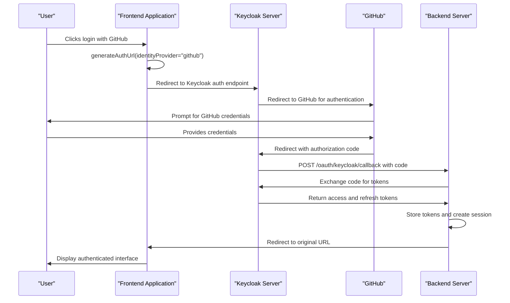
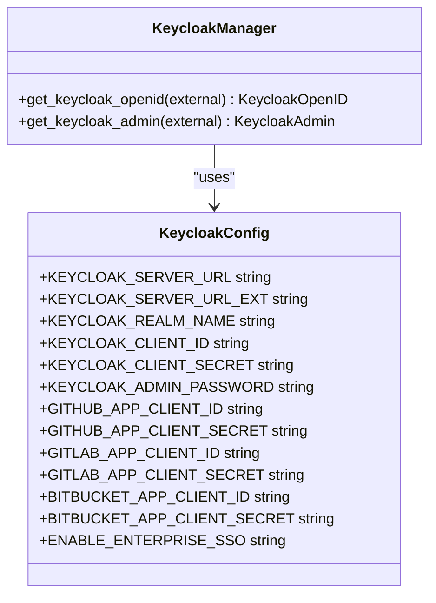
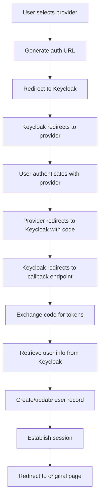
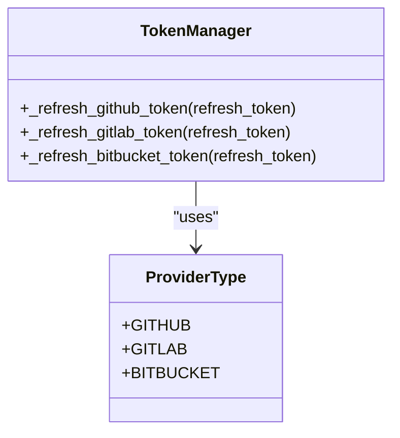
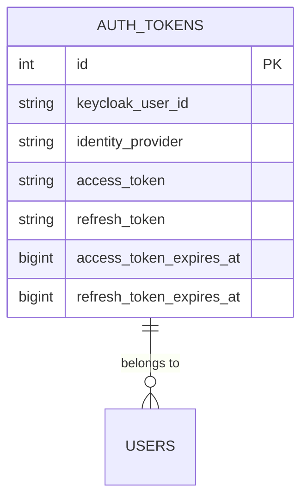
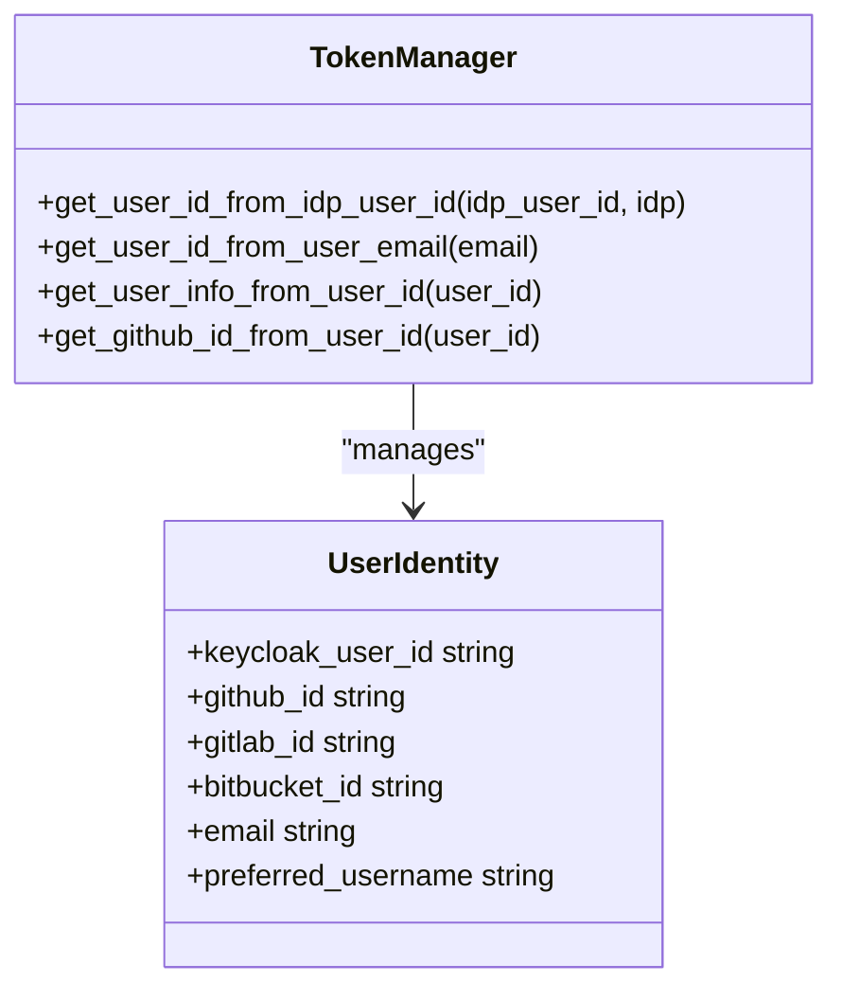
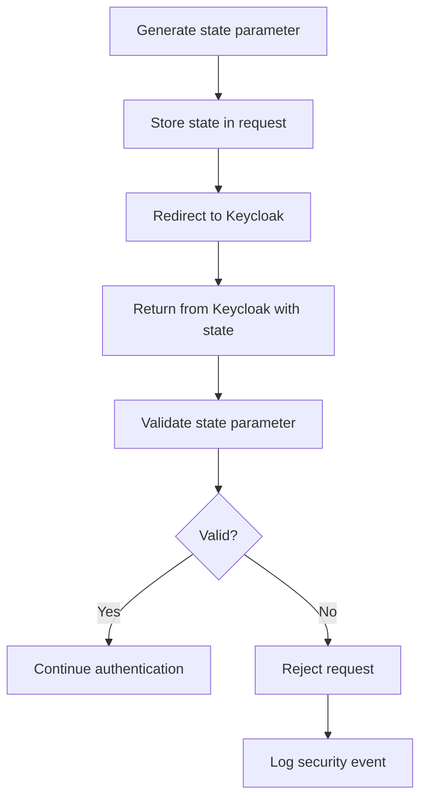
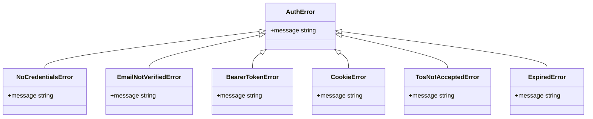
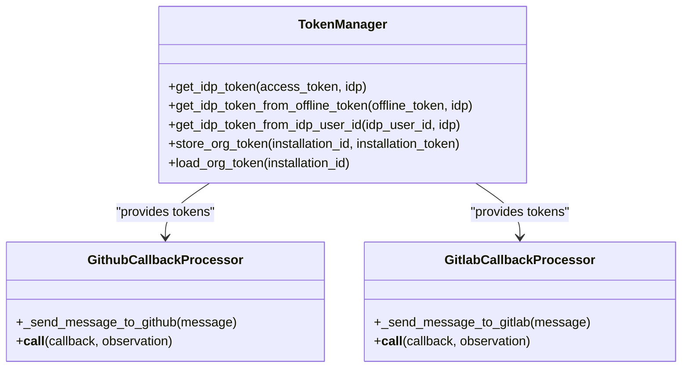

# OAuth Integration

<cite>
**Referenced Files in This Document**   
- [generate-auth-url.ts](file://frontend/src/utils/generate-auth-url.ts)
- [auth-service.api.ts](file://frontend/src/api/auth-service/auth-service.api.ts)
- [keycloak_manager.py](file://enterprise/server/auth/keycloak_manager.py)
- [auth_utils.py](file://enterprise/server/auth/auth_utils.py)
- [constants.py](file://enterprise/server/auth/constants.py)
- [token_manager.py](file://enterprise/server/auth/token_manager.py)
- [github_utils.py](file://enterprise/server/auth/github_utils.py)
- [auth_token_store.py](file://enterprise/server/storage/auth_token_store.py)
- [auth_tokens.py](file://enterprise/server/storage/auth_tokens.py)
- [middleware.py](file://enterprise/server/middleware.py)
- [auth_error.py](file://enterprise/server/auth/auth_error.py)
- [use-auth-url.ts](file://frontend/src/hooks/use-auth-url.ts)
- [github_callback_processor.py](file://enterprise/server/conversation_callback_processor/github_callback_processor.py)
- [gitlab_callback_processor.py](file://enterprise/server/conversation_callback_processor/gitlab_callback_processor.py)
</cite>

## Table of Contents
1. [Introduction](#introduction)
2. [OAuth Flow Overview](#oauth-flow-overview)
3. [Keycloak Configuration](#keycloak-configuration)
4. [User Authorization Flow](#user-authorization-flow)
5. [Provider-Specific Adaptations](#provider-specific-adaptations)
6. [Token Management and Storage](#token-management-and-storage)
7. [User Identity Mapping](#user-identity-mapping)
8. [Security Considerations](#security-considerations)
9. [Error Handling](#error-handling)
10. [Integration with External Services](#integration-with-external-services)

## Introduction

The OAuth integration system in OpenHands provides secure authentication and authorization through Keycloak, supporting multiple identity providers including GitHub, GitLab, and Bitbucket. The system enables users to authenticate using their existing accounts with these providers, while maintaining a consistent user experience across the application. This documentation details the implementation of OAuth2 flows, configuration requirements, and security considerations for the integration.

**Section sources**
- [constants.py](file://enterprise/server/auth/constants.py)
- [keycloak_manager.py](file://enterprise/server/auth/keycloak_manager.py)

## OAuth Flow Overview

The OAuth integration follows the Authorization Code flow with Proof Key for Code Exchange (PKCE) to ensure secure authentication. When a user initiates login through an identity provider, the frontend generates an authentication URL that redirects to Keycloak. Keycloak then handles the authentication with the selected provider and returns an authorization code to the application's callback endpoint.

The authentication URL is generated by the `generateAuthUrl` function in the frontend, which constructs the appropriate URL with required parameters including client_id, response_type, redirect_uri, scope, and state. The state parameter contains information about the original request URL and login method, which is used to redirect the user back to the correct location after authentication.

**Diagram sources**
- [generate-auth-url.ts](file://frontend/src/utils/generate-auth-url.ts)
- [keycloak_manager.py](file://enterprise/server/auth/keycloak_manager.py)

**Section sources**
- [generate-auth-url.ts](file://frontend/src/utils/generate-auth-url.ts)
- [auth-service.api.ts](file://frontend/src/api/auth-service/auth-service.api.ts)

## Keycloak Configuration

Keycloak is configured as the central authentication server, managing identity providers and handling the OAuth2 flows. The configuration is defined through environment variables that specify the server URLs, realm name, client credentials, and provider-specific settings.

Keycloak is initialized with two base URLs: an internal URL for service-to-service communication and an external URL for client-facing requests. The realm name is set to "allhands", and the client ID is "allhands". Each identity provider (GitHub, GitLab, Bitbucket) requires its own client ID and client secret, which are configured in Keycloak and referenced in the application through environment variables.

The Keycloak configuration also includes settings for enterprise SSO, JIRA, and Linear integrations, allowing these services to be enabled or disabled based on deployment requirements. The configuration is validated at startup to ensure all required parameters are present.

**Diagram sources**
- [constants.py](file://enterprise/server/auth/constants.py)
- [keycloak_manager.py](file://enterprise/server/auth/keycloak_manager.py)

**Section sources**
- [constants.py](file://enterprise/server/auth/constants.py)
- [keycloak_manager.py](file://enterprise/server/auth/keycloak_manager.py)

## User Authorization Flow

The user authorization flow begins when a user selects an identity provider for authentication. The frontend generates an authentication URL using the `generateAuthUrl` function, which includes the provider name as a hint (kc_idp_hint parameter) to direct Keycloak to the appropriate identity provider.

After successful authentication with the identity provider, Keycloak redirects back to the application's callback endpoint at `/oauth/keycloak/callback`. The backend server exchanges the authorization code for access and refresh tokens using Keycloak's token endpoint. These tokens are then used to retrieve user information from Keycloak, including the user's sub (subject identifier), email, and preferred username.

The user information is used to create or update the user's record in the application's database. If the user is logging in for the first time, a new user account is created. For returning users, the existing account is updated with the latest information from the identity provider.

**Diagram sources**
- [generate-auth-url.ts](file://frontend/src/utils/generate-auth-url.ts)
- [token_manager.py](file://enterprise/server/auth/token_manager.py)

**Section sources**
- [token_manager.py](file://enterprise/server/auth/token_manager.py)
- [auth_utils.py](file://enterprise/server/auth/auth_utils.py)

## Provider-Specific Adaptations

The OAuth integration supports multiple providers with specific adaptations for each. The system is designed to handle the differences in API endpoints, scope requirements, and token refresh mechanisms between providers.

For GitHub, the integration uses the standard OAuth2 endpoints with the required scopes of "openid", "email", and "profile". The token refresh process follows GitHub's OAuth2 token refresh flow, using the client ID, client secret, and refresh token to obtain new access tokens.

GitLab integration follows a similar pattern but uses GitLab's specific OAuth2 endpoints. The token refresh process for GitLab uses the same general OAuth2 refresh token flow but with GitLab's token endpoint.

The system also supports Bitbucket as an identity provider, with configuration for Bitbucket's OAuth2 endpoints and token refresh mechanism. The provider type is represented as an enumeration (ProviderType) that includes GitHub, GitLab, and Bitbucket as options.

**Diagram sources**
- [token_manager.py](file://enterprise/server/auth/token_manager.py)
- [constants.py](file://enterprise/server/auth/constants.py)

**Section sources**
- [token_manager.py](file://enterprise/server/auth/token_manager.py)
- [constants.py](file://enterprise/server/auth/constants.py)

## Token Management and Storage

The OAuth integration implements a comprehensive token management system that securely stores and manages access and refresh tokens for identity providers. Tokens are encrypted before storage using Fernet encryption with a key derived from the application's JWT secret.

The token storage system uses a database table named "auth_tokens" with fields for the Keycloak user ID, identity provider, encrypted access token, encrypted refresh token, and expiration timestamps for both tokens. The table has a unique constraint on the combination of Keycloak user ID and identity provider to ensure each user can have only one set of tokens per provider.

The TokenManager class provides methods for storing, retrieving, and refreshing tokens. When retrieving tokens, the system automatically checks if they are expired or nearing expiration and refreshes them if necessary. The refresh process uses the refresh token to obtain new access and refresh tokens from the identity provider.

**Diagram sources**
- [auth_tokens.py](file://enterprise/server/storage/auth_tokens.py)
- [auth_token_store.py](file://enterprise/server/storage/auth_token_store.py)

**Section sources**
- [auth_tokens.py](file://enterprise/server/storage/auth_tokens.py)
- [auth_token_store.py](file://enterprise/server/storage/auth_token_store.py)
- [token_manager.py](file://enterprise/server/auth/token_manager.py)

## User Identity Mapping

The system maps user identities between external providers and internal user records using the subject identifier (sub) from Keycloak as the primary key. When a user authenticates through an identity provider, Keycloak returns a user info object that includes the sub field, which is used to identify the user in the application's database.

For GitHub integration, the system also stores the GitHub user ID as an attribute in the Keycloak user profile, allowing direct lookup of users by their GitHub ID. This enables features like GitHub App installation and webhook processing, where the system needs to identify users based on their GitHub activity.

The user mapping system supports email-based lookup, allowing the application to find users by their email address. This is used in scenarios where a user might authenticate with a different provider but has the same email address as an existing account.

**Diagram sources**
- [token_manager.py](file://enterprise/server/auth/token_manager.py)

**Section sources**
- [token_manager.py](file://enterprise/server/auth/token_manager.py)
- [auth_utils.py](file://enterprise/server/auth/auth_utils.py)

## Security Considerations

The OAuth integration implements several security measures to protect user data and prevent common vulnerabilities. All tokens are encrypted before storage using Fernet encryption with a key derived from the application's JWT secret. The encryption utility uses SHA-256 to hash the secret key, ensuring that even if the database is compromised, the tokens cannot be easily decrypted.

The system implements proper token expiration and refresh mechanisms to minimize the risk of token leakage. Access tokens are set to expire after a short period, while refresh tokens have a longer lifespan but are rotated on each use. The system checks token expiration before use and automatically refreshes expired tokens.

State parameter validation is implemented to prevent CSRF attacks. The state parameter in the authentication request contains the original request URL and login method, which is validated upon return from Keycloak. This ensures that the authentication response is associated with a legitimate authentication request.

HTTPS is enforced for all production requests, with the exception of localhost for development purposes. The redirect URI is constructed using the request hostname with HTTPS protocol, except for localhost which uses the original protocol.

**Diagram sources**
- [generate-auth-url.ts](file://frontend/src/utils/generate-auth-url.ts)
- [token_manager.py](file://enterprise/server/auth/token_manager.py)

**Section sources**
- [token_manager.py](file://enterprise/server/auth/token_manager.py)
- [generate-auth-url.ts](file://frontend/src/utils/generate-auth-url.ts)
- [middleware.py](file://enterprise/server/middleware.py)

## Error Handling

The OAuth integration includes comprehensive error handling for various failure scenarios. Authentication errors are represented by a hierarchy of exception classes that extend the base AuthError class. These include specific errors for missing credentials, unverified email addresses, expired tokens, and cookie decoding issues.

When an authentication error occurs, the system returns appropriate HTTP status codes and error messages. For example, a 401 Unauthorized status is returned for expired or invalid tokens, while a 403 Forbidden status is returned for unverified email addresses.

The token refresh process includes retry logic with exponential backoff to handle temporary connection issues with Keycloak. The system will attempt to refresh tokens up to two times before failing, with a callback function that logs each retry attempt.

Error scenarios such as denied permissions during the OAuth flow are handled by redirecting the user back to the application with an error parameter. The frontend can then display an appropriate message to the user explaining that authentication was denied.

**Diagram sources**
- [auth_error.py](file://enterprise/server/auth/auth_error.py)
- [middleware.py](file://enterprise/server/middleware.py)

**Section sources**
- [auth_error.py](file://enterprise/server/auth/auth_error.py)
- [middleware.py](file://enterprise/server/middleware.py)
- [token_manager.py](file://enterprise/server/auth/token_manager.py)

## Integration with External Services

The OAuth integration enables seamless interaction with external services like GitHub and GitLab through the stored access tokens. The system provides a TokenManager service that applications can use to retrieve valid access tokens for making API calls to these services.

For GitHub integration, the system supports GitHub App installations, allowing the application to act on behalf of organizations. GitHub App installation tokens are stored separately from user tokens and are encrypted using the same encryption utility. The system can retrieve these tokens when processing webhook events or performing actions on behalf of an organization.

The integration also supports callback processors for GitHub and GitLab that can post summaries of conversations to issues or pull requests. These processors use the stored access tokens to authenticate API calls and post messages to the appropriate repositories.

**Diagram sources**
- [token_manager.py](file://enterprise/server/auth/token_manager.py)
- [github_callback_processor.py](file://enterprise/server/conversation_callback_processor/github_callback_processor.py)
- [gitlab_callback_processor.py](file://enterprise/server/conversation_callback_processor/gitlab_callback_processor.py)

**Section sources**
- [token_manager.py](file://enterprise/server/auth/token_manager.py)
- [github_callback_processor.py](file://enterprise/server/conversation_callback_processor/github_callback_processor.py)
- [gitlab_callback_processor.py](file://enterprise/server/conversation_callback_processor/gitlab_callback_processor.py)