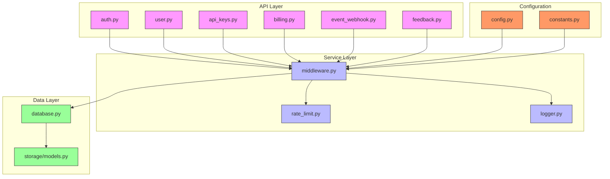
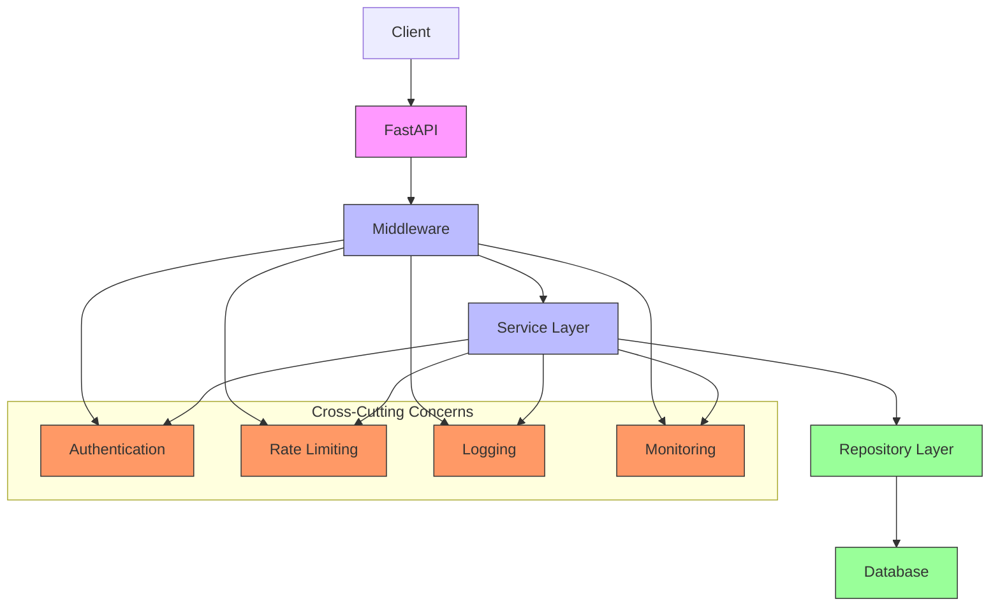
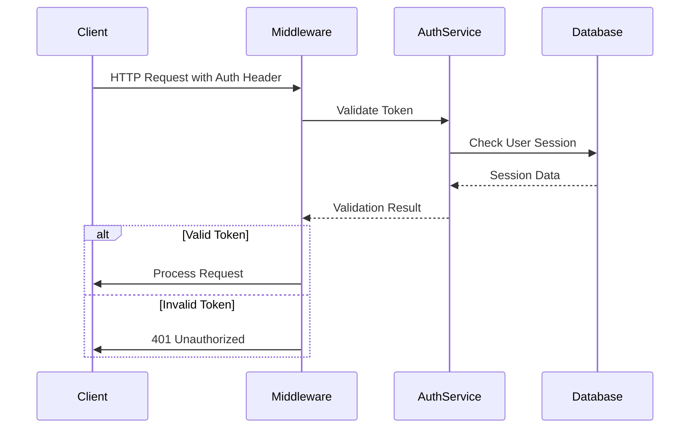
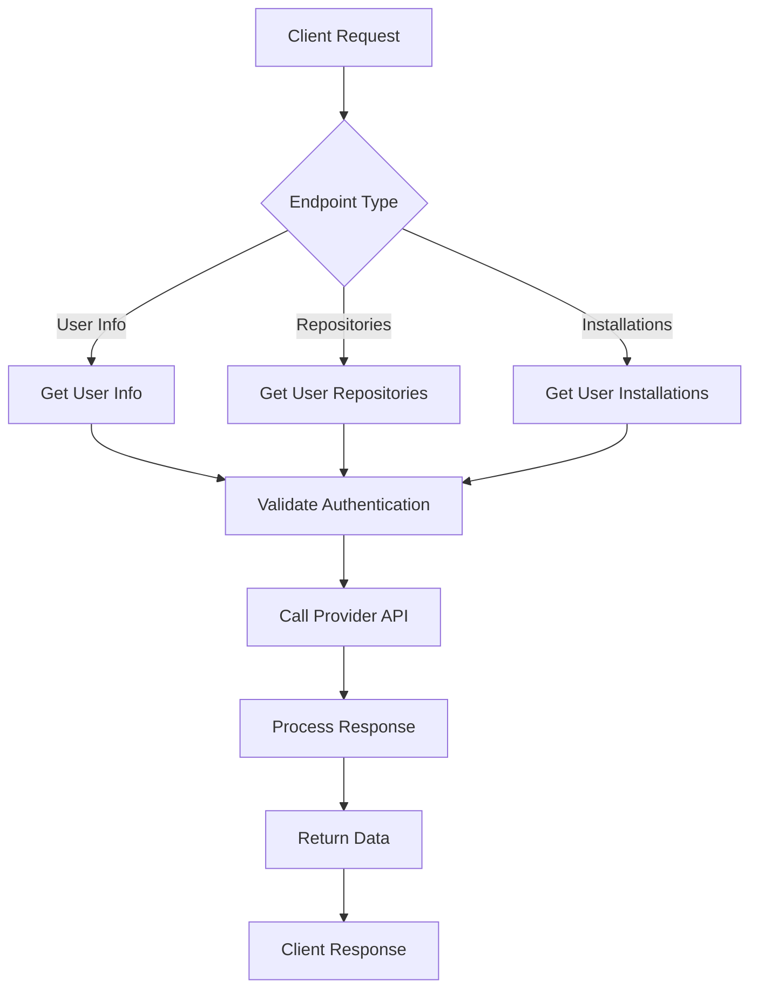
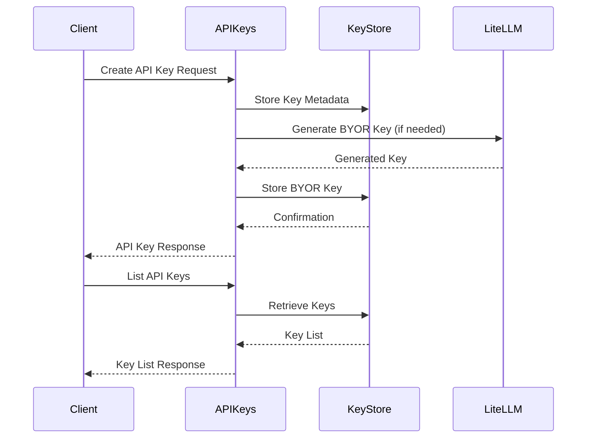
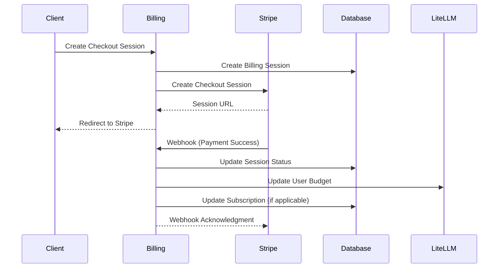
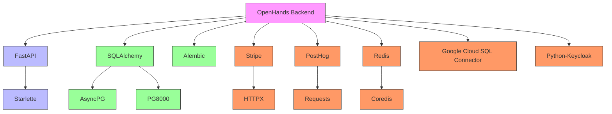

# Backend Architecture

<cite>
**Referenced Files in This Document**   
- [saas_server.py](file://enterprise/saas_server.py)
- [config.py](file://enterprise/server/config.py)
- [middleware.py](file://enterprise/server/middleware.py)
- [rate_limit.py](file://enterprise/server/rate_limit.py)
- [database.py](file://enterprise/storage/database.py)
- [logger.py](file://enterprise/server/logger.py)
- [auth.py](file://enterprise/server/routes/auth.py)
- [user.py](file://enterprise/server/routes/user.py)
- [api_keys.py](file://enterprise/server/routes/api_keys.py)
- [billing.py](file://enterprise/server/routes/billing.py)
- [Dockerfile](file://enterprise/Dockerfile)
- [pyproject.toml](file://enterprise/pyproject.toml)
</cite>

## Table of Contents
1. [Introduction](#introduction)
2. [Project Structure](#project-structure)
3. [Core Components](#core-components)
4. [Architecture Overview](#architecture-overview)
5. [Detailed Component Analysis](#detailed-component-analysis)
6. [Dependency Analysis](#dependency-analysis)
7. [Performance Considerations](#performance-considerations)
8. [Troubleshooting Guide](#troubleshooting-guide)
9. [Conclusion](#conclusion)

## Introduction
The OpenHands backend architecture is a comprehensive system built on FastAPI with RESTful API patterns and a service-layer architecture. This document provides a detailed analysis of the backend components, focusing on the enterprise SaaS implementation. The architecture incorporates modern design patterns including dependency injection, event-driven design, and modular service organization. The system handles authentication, billing, user management, and integration with various third-party services through a well-defined API layer. The backend is designed for scalability and maintainability, with clear separation of concerns between API endpoints, business logic services, and data storage layers.

## Project Structure
The backend architecture follows a modular structure with clear separation of concerns. The enterprise server component is organized into several key directories: server (containing routes, middleware, and configuration), storage (handling database interactions and models), integrations (managing third-party service connections), and migrations (handling database schema evolution). The routing structure is organized by functionality, with separate modules for authentication, user management, billing, and API key management. The storage layer abstracts database interactions through a repository pattern, while the server layer implements the API endpoints and business logic.

**Diagram sources**
- [enterprise/server/routes/auth.py](file://enterprise/server/routes/auth.py)
- [enterprise/server/routes/user.py](file://enterprise/server/routes/user.py)
- [enterprise/server/routes/api_keys.py](file://enterprise/server/routes/api_keys.py)
- [enterprise/server/routes/billing.py](file://enterprise/server/routes/billing.py)
- [enterprise/server/middleware.py](file://enterprise/server/middleware.py)
- [enterprise/server/rate_limit.py](file://enterprise/server/rate_limit.py)
- [enterprise/server/logger.py](file://enterprise/server/logger.py)
- [enterprise/storage/database.py](file://enterprise/storage/database.py)
- [enterprise/server/config.py](file://enterprise/server/config.py)

**Section sources**
- [enterprise/server/routes/auth.py](file://enterprise/server/routes/auth.py)
- [enterprise/server/routes/user.py](file://enterprise/server/routes/user.py)
- [enterprise/server/routes/api_keys.py](file://enterprise/server/routes/api_keys.py)
- [enterprise/server/routes/billing.py](file://enterprise/server/routes/billing.py)
- [enterprise/server/middleware.py](file://enterprise/server/middleware.py)
- [enterprise/server/rate_limit.py](file://enterprise/server/rate_limit.py)
- [enterprise/server/logger.py](file://enterprise/server/logger.py)
- [enterprise/storage/database.py](file://enterprise/storage/database.py)
- [enterprise/server/config.py](file://enterprise/server/config.py)

## Core Components
The backend architecture consists of several core components that work together to provide a robust and scalable system. The main entry point is the saas_server.py file, which initializes the FastAPI application and mounts various routers for different functionality. The configuration system is implemented through the config.py module, which handles environment variables and application settings. Authentication is managed through a comprehensive system that includes JWT token handling, OAuth integration, and session management. The rate limiting system protects against abuse, while the logging system provides comprehensive monitoring and debugging capabilities. The data storage layer uses SQLAlchemy with PostgreSQL, providing a robust ORM for database interactions.

**Section sources**
- [enterprise/saas_server.py](file://enterprise/saas_server.py)
- [enterprise/server/config.py](file://enterprise/server/config.py)
- [enterprise/server/middleware.py](file://enterprise/server/middleware.py)
- [enterprise/server/rate_limit.py](file://enterprise/server/rate_limit.py)
- [enterprise/server/logger.py](file://enterprise/server/logger.py)
- [enterprise/storage/database.py](file://enterprise/storage/database.py)

## Architecture Overview
The backend architecture follows a layered approach with clear separation between presentation, business logic, and data access layers. At the top level, FastAPI handles HTTP requests and responses, routing them to appropriate endpoints. The middleware layer handles cross-cutting concerns such as authentication, rate limiting, and logging. Business logic is implemented in service classes that interact with the data storage layer through repositories. The data storage layer uses SQLAlchemy ORM to abstract database operations, with Alembic managing database migrations. The system is designed to be modular, allowing for easy extension and maintenance.

**Diagram sources**
- [enterprise/saas_server.py](file://enterprise/saas_server.py)
- [enterprise/server/middleware.py](file://enterprise/server/middleware.py)
- [enterprise/server/routes](file://enterprise/server/routes)
- [enterprise/storage](file://enterprise/storage)
- [enterprise/server/logger.py](file://enterprise/server/logger.py)
- [enterprise/server/rate_limit.py](file://enterprise/server/rate_limit.py)

## Detailed Component Analysis

### Authentication System Analysis
The authentication system is a critical component of the backend architecture, handling user identity and access control. It implements a comprehensive solution using JWT tokens, OAuth integration, and session management. The system supports multiple identity providers including GitHub, GitLab, and Keycloak, allowing for flexible authentication options. The authentication flow is implemented through middleware that intercepts requests and validates credentials before allowing access to protected endpoints.

#### Authentication Flow

**Diagram sources**
- [enterprise/server/middleware.py](file://enterprise/server/middleware.py)
- [enterprise/server/routes/auth.py](file://enterprise/server/routes/auth.py)
- [enterprise/server/auth](file://enterprise/server/auth)
- [enterprise/storage/database.py](file://enterprise/storage/database.py)

**Section sources**
- [enterprise/server/middleware.py](file://enterprise/server/middleware.py)
- [enterprise/server/routes/auth.py](file://enterprise/server/routes/auth.py)
- [enterprise/server/auth](file://enterprise/server/auth)

### User Management Analysis
The user management system handles user-related operations including profile retrieval, repository access, and permission management. It provides endpoints for retrieving user information, managing installations, and accessing repositories. The system integrates with third-party providers to fetch user data and repository information, abstracting the underlying API differences.

#### User Management Flow

**Diagram sources**
- [enterprise/server/routes/user.py](file://enterprise/server/routes/user.py)
- [enterprise/server/routes/git.py](file://enterprise/server/routes/git.py)
- [enterprise/integrations](file://enterprise/integrations)
- [enterprise/storage/database.py](file://enterprise/storage/database.py)

**Section sources**
- [enterprise/server/routes/user.py](file://enterprise/server/routes/user.py)
- [enterprise/server/routes/git.py](file://enterprise/server/routes/git.py)

### API Key Management Analysis
The API key management system provides secure access to the backend services through API keys. It supports creation, listing, and deletion of API keys, with proper authentication and authorization checks. The system also handles BYOR (Bring Your Own Runtime) API keys, integrating with external services like LiteLLM for key generation and management.

#### API Key Management Flow

**Diagram sources**
- [enterprise/server/routes/api_keys.py](file://enterprise/server/routes/api_keys.py)
- [enterprise/storage/api_key_store.py](file://enterprise/storage/api_key_store.py)
- [enterprise/storage/database.py](file://enterprise/storage/database.py)

**Section sources**
- [enterprise/server/routes/api_keys.py](file://enterprise/server/routes/api_keys.py)
- [enterprise/storage/api_key_store.py](file://enterprise/storage/api_key_store.py)

### Billing System Analysis
The billing system handles credit management and Stripe payment integration. It provides endpoints for credit retrieval, subscription management, and payment processing. The system integrates with Stripe for payment processing and webhook handling, maintaining subscription state in the database.

#### Billing Flow

**Diagram sources**
- [enterprise/server/routes/billing.py](file://enterprise/server/routes/billing.py)
- [enterprise/integrations/stripe_service.py](file://enterprise/integrations/stripe_service.py)
- [enterprise/storage/billing_session.py](file://enterprise/storage/billing_session.py)
- [enterprise/storage/subscription_access.py](file://enterprise/storage/subscription_access.py)

**Section sources**
- [enterprise/server/routes/billing.py](file://enterprise/server/routes/billing.py)
- [enterprise/integrations/stripe_service.py](file://enterprise/integrations/stripe_service.py)

## Dependency Analysis
The backend architecture has a well-defined dependency structure that promotes loose coupling and high cohesion. The main application depends on FastAPI for web framework functionality, SQLAlchemy for database ORM, and various third-party libraries for specific features. The dependency management is handled through Poetry, with clear separation between production and development dependencies. The system uses dependency injection to provide configuration and services to various components, reducing tight coupling.

**Diagram sources**
- [enterprise/pyproject.toml](file://enterprise/pyproject.toml)
- [enterprise/Dockerfile](file://enterprise/Dockerfile)
- [enterprise/server/requirements.txt](file://enterprise/server/requirements.txt)

**Section sources**
- [enterprise/pyproject.toml](file://enterprise/pyproject.toml)
- [enterprise/Dockerfile](file://enterprise/Dockerfile)

## Performance Considerations
The backend architecture includes several performance optimizations to ensure responsiveness and scalability. The database layer uses connection pooling with configurable pool size and overflow settings to handle concurrent requests efficiently. The system implements rate limiting to prevent abuse and ensure fair resource usage. Asynchronous operations are used throughout the codebase to maximize throughput, with async database operations and HTTP requests. The logging system is optimized to minimize performance impact, with configurable log levels and JSON formatting for efficient processing.

**Section sources**
- [enterprise/storage/database.py](file://enterprise/storage/database.py)
- [enterprise/server/rate_limit.py](file://enterprise/server/rate_limit.py)
- [enterprise/server/logger.py](file://enterprise/server/logger.py)

## Troubleshooting Guide
When troubleshooting issues with the backend system, consider the following common scenarios and their solutions:

1. **Authentication failures**: Check JWT token validity, ensure proper cookie settings, and verify Keycloak configuration.
2. **Database connection issues**: Verify database credentials, check connection pool settings, and ensure network connectivity.
3. **Rate limiting problems**: Review rate limit configuration, check Redis connectivity, and verify rate limit rules.
4. **Payment processing errors**: Validate Stripe API keys, check webhook configuration, and verify subscription state.
5. **Performance bottlenecks**: Monitor database query performance, check connection pool utilization, and review logging overhead.

For debugging, enable detailed logging and use the provided debugging routes. Monitor application metrics through the integrated monitoring system, and check server logs for error messages.

**Section sources**
- [enterprise/server/middleware.py](file://enterprise/server/middleware.py)
- [enterprise/server/logger.py](file://enterprise/server/logger.py)
- [enterprise/server/routes/debugging.py](file://enterprise/server/routes/debugging.py)
- [enterprise/server/routes/readiness.py](file://enterprise/server/routes/readiness.py)

## Conclusion
The OpenHands backend architecture provides a robust, scalable foundation for the enterprise SaaS platform. Built on FastAPI with RESTful API patterns, the system implements a clean service-layer architecture with well-defined separation of concerns. The modular design allows for easy extension and maintenance, while the comprehensive authentication, billing, and user management systems provide essential functionality for a modern web application. The architecture incorporates best practices for security, performance, and reliability, making it suitable for production deployment at scale.