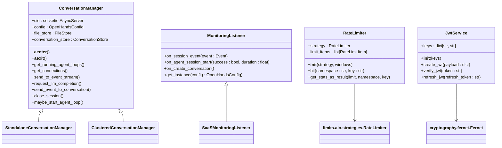
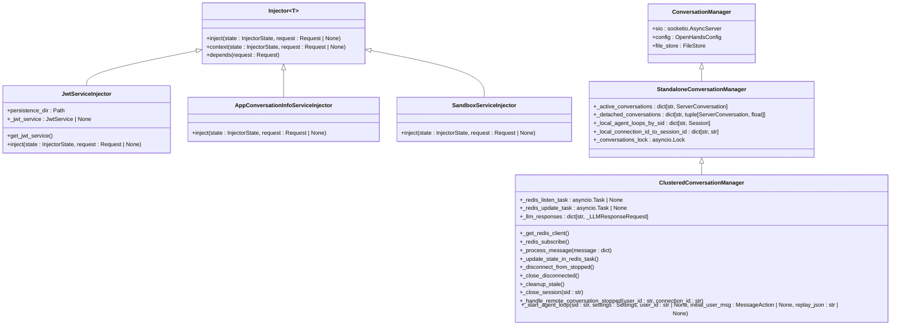
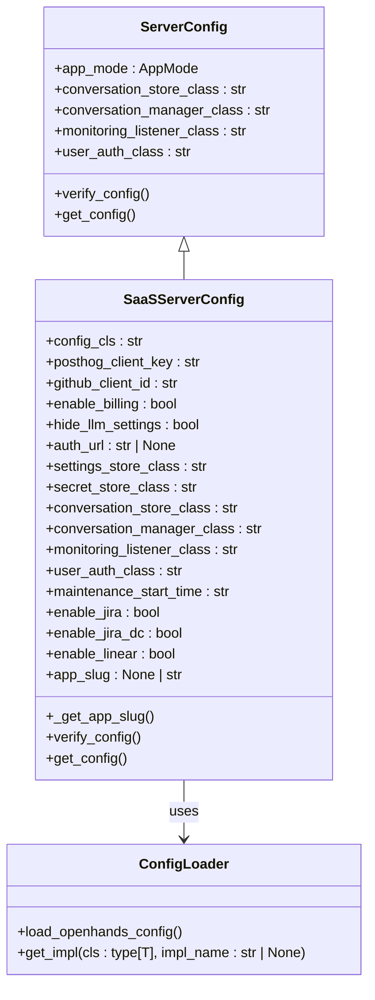
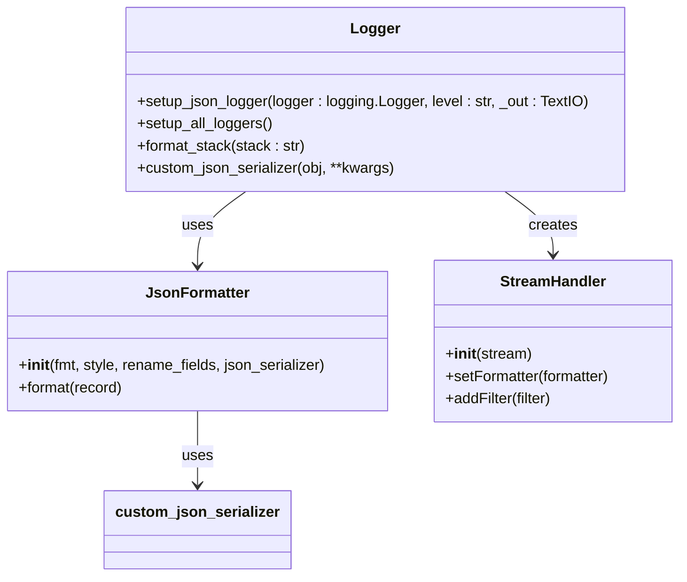
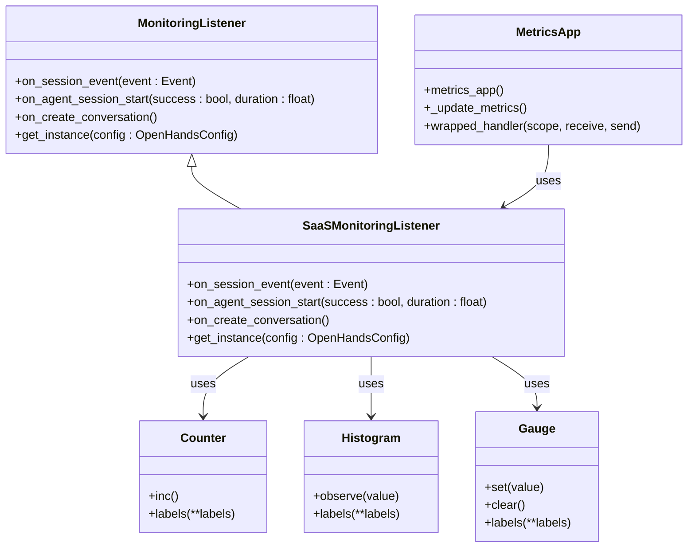
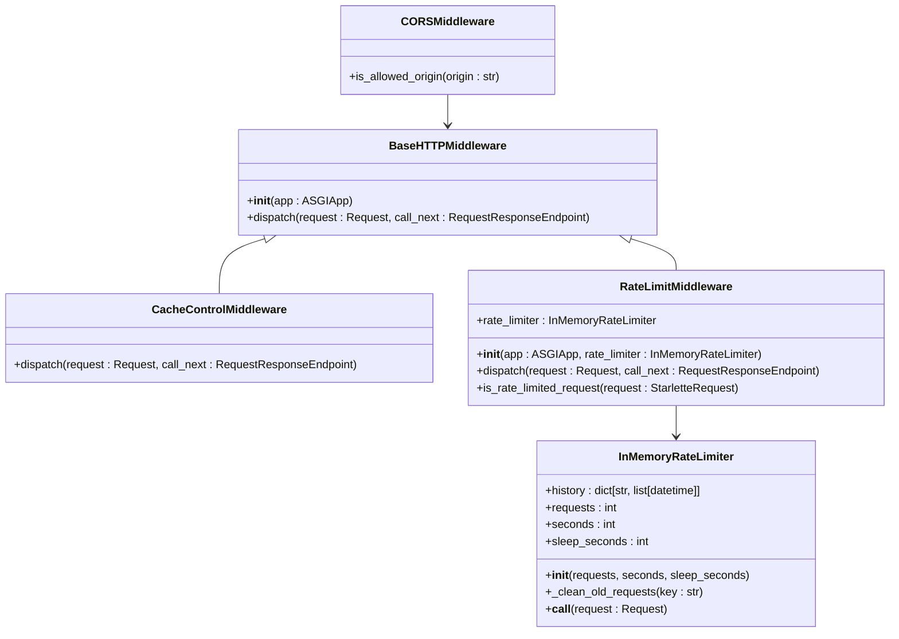
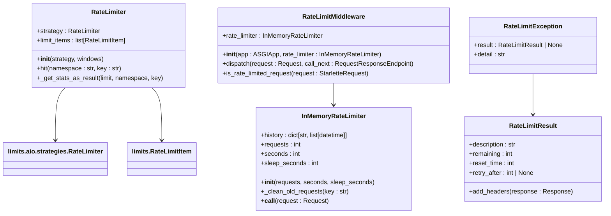
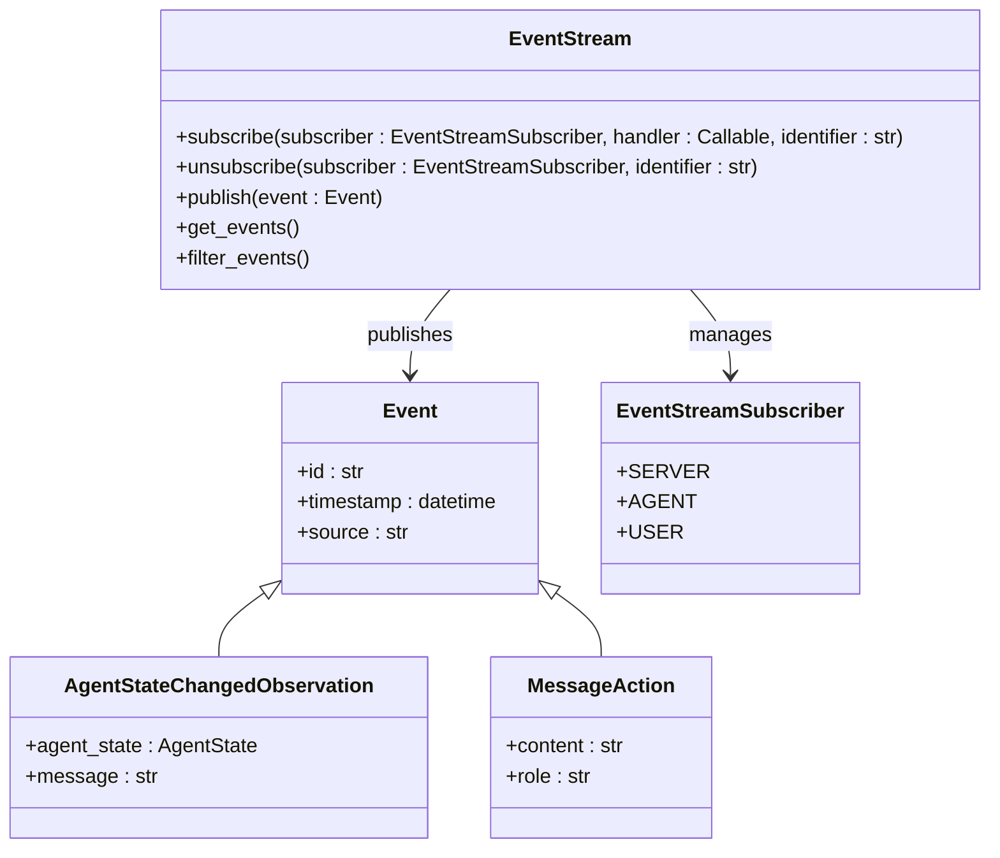
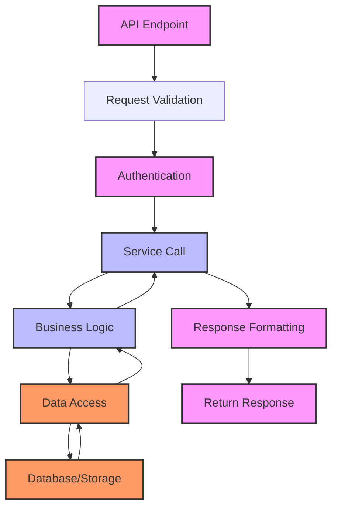
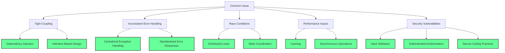

# Business Logic Layer

<cite>
**Referenced Files in This Document**   
- [middleware.py](file://openhands/server/middleware.py)
- [rate_limit.py](file://enterprise/server/rate_limit.py)
- [saas_monitoring_listener.py](file://enterprise/server/saas_monitoring_listener.py)
- [config.py](file://enterprise/server/config.py)
- [logger.py](file://enterprise/server/logger.py)
- [metrics.py](file://enterprise/server/metrics.py)
- [conversation_manager.py](file://openhands/server/conversation_manager/conversation_manager.py)
- [clustered_conversation_manager.py](file://enterprise/server/clustered_conversation_manager.py)
- [jwt_service.py](file://openhands/app_server/services/jwt_service.py)
- [injector.py](file://openhands/app_server/services/injector.py)
- [saas_conversation_validator.py](file://enterprise/storage/saas_conversation_validator.py)
</cite>

## Table of Contents
1. [Introduction](#introduction)
2. [Service Layer Design Pattern](#service-layer-design-pattern)
3. [Dependency Injection and Service Orchestration](#dependency-injection-and-service-orchestration)
4. [Configuration Management](#configuration-management)
5. [Logging Infrastructure](#logging-infrastructure)
6. [Metrics Collection and Monitoring](#metrics-collection-and-monitoring)
7. [Middleware Architecture](#middleware-architecture)
8. [Rate Limiting Implementation](#rate-limiting-implementation)
9. [Event-Driven Patterns](#event-driven-patterns)
10. [Business Logic Separation](#business-logic-separation)
11. [Common Issues and Solutions](#common-issues-and-solutions)
12. [Conclusion](#conclusion)

## Introduction

The business logic layer in the OpenHands architecture serves as the central nervous system that orchestrates application behavior, enforces business rules, and coordinates interactions between various components. This layer implements a sophisticated service-oriented architecture that separates concerns while maintaining flexibility and extensibility. The design emphasizes clean separation between business logic, API endpoints, and data access layers, enabling maintainable and testable code.

The business logic layer handles critical functions including user authentication, conversation management, rate limiting, monitoring, and event processing. It employs dependency injection patterns to manage service lifecycles and uses middleware to process requests in a pipeline fashion. The architecture supports both standalone and clustered deployments, with the enterprise version providing enhanced capabilities for distributed systems.

**Section sources**
- [middleware.py](file://openhands/server/middleware.py#L42-L131)
- [conversation_manager.py](file://openhands/server/conversation_manager/conversation_manager.py#L20-L57)

## Service Layer Design Pattern

The service layer in OpenHands follows a well-defined design pattern that promotes separation of concerns and testability. Services are implemented as classes that encapsulate specific business capabilities, such as user authentication, conversation management, and event processing. Each service exposes a clear interface through well-defined methods that represent business operations.

The service layer acts as an intermediary between the API endpoints and the data access layer, ensuring that business rules are consistently enforced regardless of how the functionality is accessed. This pattern prevents business logic from leaking into controllers or data access components, creating a clean architectural boundary.

Services in OpenHands are designed to be stateless where possible, making them easier to test and scale. When state is required, it is managed explicitly through well-defined patterns rather than implicit dependencies. The service layer also handles cross-cutting concerns such as logging, error handling, and security checks, providing a consistent experience across different business operations.

**Diagram sources **
- [conversation_manager.py](file://openhands/server/conversation_manager/conversation_manager.py#L20-L57)
- [saas_monitoring_listener.py](file://enterprise/server/saas_monitoring_listener.py#L25-L75)
- [rate_limit.py](file://enterprise/server/rate_limit.py#L50-L104)
- [jwt_service.py](file://openhands/app_server/services/jwt_service.py#L233-L248)

**Section sources**
- [conversation_manager.py](file://openhands/server/conversation_manager/conversation_manager.py#L20-L57)
- [saas_monitoring_listener.py](file://enterprise/server/saas_monitoring_listener.py#L25-L75)
- [rate_limit.py](file://enterprise/server/rate_limit.py#L50-L104)

## Dependency Injection and Service Orchestration

OpenHands implements a sophisticated dependency injection system that enables flexible service orchestration and promotes loose coupling between components. The dependency injection pattern is implemented through injector classes that manage the lifecycle of services and provide them to consumers when needed.

The core of the dependency injection system is the `Injector` base class, which defines a protocol for service provisioning. Injector classes implement the `inject` method that yields service instances, allowing for both synchronous and asynchronous dependency resolution. This pattern enables services to be created on-demand and properly disposed of when no longer needed.

Service orchestration in OpenHands follows a hierarchical pattern where higher-level services depend on lower-level ones, creating a clear dependency graph. The system uses a discriminated union mixin pattern to support multiple implementations of the same service interface, allowing applications to customize behavior without modifying core code.

The dependency injection system also supports configuration-driven service resolution, where the specific implementation to use is determined at runtime based on configuration settings. This enables applications to substitute their own implementations for core services like user authentication, conversation management, and storage.

**Diagram sources **
- [injector.py](file://openhands/app_server/services/injector.py#L12-L34)
- [jwt_service.py](file://openhands/app_server/services/jwt_service.py#L233-L248)
- [conversation_manager.py](file://openhands/server/conversation_manager/conversation_manager.py#L20-L57)
- [clustered_conversation_manager.py](file://enterprise/server/clustered_conversation_manager.py#L61-L800)

**Section sources**
- [injector.py](file://openhands/app_server/services/injector.py#L12-L34)
- [jwt_service.py](file://openhands/app_server/services/jwt_service.py#L233-L248)
- [conversation_manager.py](file://openhands/server/conversation_manager/conversation_manager.py#L20-L57)

## Configuration Management

Configuration management in OpenHands is implemented through a comprehensive system that supports both environment variables and runtime configuration. The configuration system is designed to be flexible and extensible, allowing applications to customize behavior without modifying code.

The core configuration class `SaaSServerConfig` extends the base `ServerConfig` class and adds enterprise-specific configuration options. Configuration values are primarily sourced from environment variables, with sensible defaults provided for optional settings. The configuration system validates required settings during initialization, ensuring that the application fails fast if critical configuration is missing.

Configuration options in OpenHands cover various aspects of the system, including authentication settings, feature flags, monitoring configuration, and integration endpoints. The system supports dynamic configuration through the `get_config` method, which returns a dictionary representation of the current configuration that can be exposed to clients.

The configuration system also includes specialized functionality for enterprise deployments, such as retrieving GitHub App information through the GitHub API. This allows the system to dynamically configure itself based on the deployment environment, reducing the need for manual configuration.

**Diagram sources **
- [config.py](file://enterprise/server/config.py#L62-L191)
- [import_utils.py](file://openhands/utils/import_utils.py#L42-L73)

**Section sources**
- [config.py](file://enterprise/server/config.py#L62-L191)
- [import_utils.py](file://openhands/utils/import_utils.py#L42-L73)

## Logging Infrastructure

The logging infrastructure in OpenHands is designed to provide comprehensive visibility into system behavior while supporting different deployment environments. The system uses Python's built-in logging module with custom formatting and filtering to produce structured logs that are easy to analyze.

The logging system supports both plain text and JSON output formats, with JSON being the default for production environments. This allows logs to be easily ingested by log management systems like Google Cloud Logging. The JSON formatter includes custom serialization to handle stack traces and exception information in a structured way.

The logging configuration includes mechanisms to reduce noise from verbose third-party libraries by setting appropriate log levels. Libraries like `engineio`, `httpx`, and `sqlalchemy` are configured to log at the WARNING level or higher, preventing excessive log output that could obscure important information.

The system also includes a mechanism to format file paths in log messages, replacing absolute paths with relative ones to improve readability and consistency across different deployment environments. This is particularly useful when logs are viewed in different contexts or shared between team members.

**Diagram sources **
- [logger.py](file://enterprise/server/logger.py#L1-L122)

**Section sources**
- [logger.py](file://enterprise/server/logger.py#L1-L122)

## Metrics Collection and Monitoring

The metrics collection and monitoring system in OpenHands provides comprehensive observability into system performance and behavior. The system uses Prometheus as the metrics backend, exposing a standard metrics endpoint that can be scraped by monitoring systems.

The monitoring architecture is built around the `MonitoringListener` abstract base class, which defines a set of callback methods for different application events. Applications can provide their own implementation by creating a class that inherits from `MonitoringListener` and implementing the desired methods.

The enterprise implementation `SaaSMonitoringListener` forwards application signals to Prometheus using the `prometheus_client` library. It tracks key metrics such as agent status errors, agent session starts, and conversation creation attempts. Each metric is properly labeled to enable detailed analysis and filtering.

The metrics system also includes a custom metrics app that wraps the standard Prometheus ASGI app to update metrics before serving the endpoint. This ensures that metrics are up-to-date when scraped by monitoring systems. The system tracks running agent loops by periodically querying the conversation manager and updating a gauge metric accordingly.

**Diagram sources **
- [monitoring.py](file://openhands/server/monitoring.py#L5-L41)
- [saas_monitoring_listener.py](file://enterprise/server/saas_monitoring_listener.py#L25-L75)
- [metrics.py](file://enterprise/server/metrics.py#L1-L44)

**Section sources**
- [monitoring.py](file://openhands/server/monitoring.py#L5-L41)
- [saas_monitoring_listener.py](file://enterprise/server/saas_monitoring_listener.py#L25-L75)
- [metrics.py](file://enterprise/server/metrics.py#L1-L44)

## Middleware Architecture

The middleware architecture in OpenHands implements a request processing pipeline that handles cross-cutting concerns before requests reach the application endpoints. Middleware components are implemented as classes that inherit from FastAPI's `BaseHTTPMiddleware` and override the `dispatch` method.

The system includes several middleware components that handle different aspects of request processing. The `CacheControlMiddleware` adds appropriate cache control headers to responses, disabling caching for most routes while allowing aggressive caching for static assets. This ensures that dynamic content is always fresh while static content can be cached efficiently.

The rate limiting middleware uses an in-memory rate limiter to control request frequency on a per-client basis. It tracks request timestamps in a dictionary keyed by client IP address, allowing for flexible rate limiting policies. The middleware can be configured to sleep between requests or reject excessive requests with a 429 status code.

The CORS middleware is customized to allow any localhost or 127.0.0.1 origin regardless of port, facilitating development and testing. For other origins, it delegates to the parent class's logic, ensuring secure cross-origin request handling in production environments.

**Diagram sources **
- [middleware.py](file://openhands/server/middleware.py#L51-L131)

**Section sources**
- [middleware.py](file://openhands/server/middleware.py#L51-L131)

## Rate Limiting Implementation

The rate limiting implementation in OpenHands provides a robust mechanism to control request frequency and prevent abuse. The system offers two complementary approaches: an in-memory rate limiter for simple scenarios and a Redis-based rate limiter for distributed environments.

The in-memory rate limiter tracks request history in a dictionary keyed by client IP address, storing timestamps of recent requests. It uses a sliding window algorithm to determine whether a request should be allowed, rejecting requests that exceed the configured limit. The implementation includes configurable parameters for the number of requests allowed per time period and whether to sleep between requests or reject them immediately.

The Redis-based rate limiter uses the `limits` library to provide distributed rate limiting across multiple server instances. It supports complex rate limiting policies expressed as strings (e.g., "10/second; 100/minute"), allowing for multiple limits to be applied simultaneously. The system integrates with FastAPI's exception handling to automatically return appropriate 429 responses when limits are exceeded.

Rate limiting in OpenHands is designed to be applied selectively to different endpoints, with static assets typically excluded from rate limiting. The implementation also supports per-user rate limiting, allowing different limits to be applied based on user identity or other criteria.

**Diagram sources **
- [rate_limit.py](file://enterprise/server/rate_limit.py#L50-L104)
- [middleware.py](file://openhands/server/middleware.py#L70-L131)

**Section sources**
- [rate_limit.py](file://enterprise/server/rate_limit.py#L50-L104)
- [middleware.py](file://openhands/server/middleware.py#L70-L131)

## Event-Driven Patterns

The event-driven architecture in OpenHands enables loose coupling between components and facilitates real-time communication throughout the system. Events are used to signal state changes, trigger background processing, and coordinate distributed operations.

The core of the event system is the `EventStream` class, which provides a publish-subscribe mechanism for events. Components can subscribe to the event stream to receive notifications when specific types of events occur. The system supports multiple subscription types, allowing different components to receive events based on their needs.

Events in OpenHands are represented as objects that inherit from a base `Event` class, with specific event types defined for different scenarios. For example, `AgentStateChangedObservation` events are used to signal changes in agent state, while `MessageAction` events represent user messages. This type hierarchy enables polymorphic event handling and filtering.

The event system is integrated with the conversation management infrastructure, allowing events to be stored and retrieved by conversation ID. This enables features like conversation replay and audit logging. Events can also be filtered by type, timestamp, and other criteria, supporting complex querying capabilities.

**Diagram sources **
- [event.py](file://openhands/events/event.py#L1-L10)
- [observation.py](file://openhands/events/observation.py#L1-L20)
- [event_store.py](file://openhands/events/event_store.py#L1-L50)

**Section sources**
- [event.py](file://openhands/events/event.py#L1-L10)
- [observation.py](file://openhands/events/observation.py#L1-L20)
- [event_store.py](file://openhands/events/event_store.py#L1-L50)

## Business Logic Separation

The business logic separation in OpenHands follows a clean architecture pattern that clearly delineates responsibilities between different layers. Business logic is isolated in service classes, separate from API endpoints and data access operations, ensuring maintainability and testability.

API endpoints in OpenHands are kept thin, primarily responsible for request validation, authentication, and response formatting. They delegate business operations to service classes, which contain the core logic. This separation allows the same business logic to be accessed through different endpoints (e.g., REST API, WebSocket) without duplication.

Data access is handled by specialized storage classes that abstract the underlying persistence mechanism. Services depend on these storage interfaces rather than directly on database operations, enabling easy testing with mock implementations and supporting multiple storage backends.

The separation of concerns is enforced through dependency injection, with services receiving their dependencies (such as storage implementations) through constructor injection or injector classes. This prevents services from having direct knowledge of the specific implementation details of their dependencies.

**Diagram sources **
- [routes.py](file://openhands/server/routes.py#L1-L50)
- [conversation_manager.py](file://openhands/server/conversation_manager/conversation_manager.py#L20-L57)
- [conversation_store.py](file://openhands/storage/conversation/conversation_store.py#L1-L50)

**Section sources**
- [routes.py](file://openhands/server/routes.py#L1-L50)
- [conversation_manager.py](file://openhands/server/conversation_manager/conversation_manager.py#L20-L57)
- [conversation_store.py](file://openhands/storage/conversation/conversation_store.py#L1-L50)

## Common Issues and Solutions

Several common issues arise in business logic implementation, and OpenHands addresses them with well-defined patterns and solutions. One common issue is tight coupling between components, which is addressed through dependency injection and interface-based design. By depending on abstractions rather than concrete implementations, components can be easily tested and replaced.

Another common issue is inconsistent error handling, which is addressed through centralized exception handling and consistent error response formats. The rate limiting system, for example, uses a dedicated exception handler that converts `RateLimitException` to standardized 429 responses with appropriate headers.

Race conditions in distributed systems are addressed through careful state management and the use of distributed locks. The clustered conversation manager uses Redis to coordinate state across multiple server instances, preventing multiple servers from simultaneously starting the same conversation.

Performance issues related to database access are mitigated through caching and asynchronous operations. The system uses in-memory caching for frequently accessed data and performs database operations asynchronously to avoid blocking the main event loop.

Security issues are addressed through comprehensive input validation, proper authentication and authorization, and the use of secure coding practices. The system validates API keys and JWT tokens, ensures users have appropriate access to resources, and protects against common vulnerabilities like injection attacks.

**Diagram sources **
- [injector.py](file://openhands/app_server/services/injector.py#L12-L34)
- [rate_limit.py](file://enterprise/server/rate_limit.py#L123-L137)
- [clustered_conversation_manager.py](file://enterprise/server/clustered_conversation_manager.py#L398-L402)
- [saas_conversation_validator.py](file://enterprise/storage/saas_conversation_validator.py#L16-L153)

**Section sources**
- [injector.py](file://openhands/app_server/services/injector.py#L12-L34)
- [rate_limit.py](file://enterprise/server/rate_limit.py#L123-L137)
- [clustered_conversation_manager.py](file://enterprise/server/clustered_conversation_manager.py#L398-L402)
- [saas_conversation_validator.py](file://enterprise/storage/saas_conversation_validator.py#L16-L153)

## Conclusion

The business logic layer in OpenHands demonstrates a sophisticated and well-architected approach to service design and implementation. By following established patterns like dependency injection, separation of concerns, and event-driven architecture, the system achieves a high degree of maintainability, testability, and extensibility.

The service layer design pattern provides a clear structure for organizing business logic, with well-defined interfaces and responsibilities. Dependency injection enables flexible service orchestration and promotes loose coupling between components. Configuration management supports both environment variables and runtime configuration, allowing applications to adapt to different deployment scenarios.

The logging and monitoring infrastructure provides comprehensive observability, with structured logs and Prometheus metrics enabling effective system monitoring and troubleshooting. The middleware architecture implements a request processing pipeline that handles cross-cutting concerns like caching and rate limiting in a consistent manner.

The rate limiting implementation offers both in-memory and distributed options, supporting different deployment scenarios. The event-driven patterns facilitate loose coupling and real-time communication between components. Business logic is cleanly separated from API endpoints and data access layers, following clean architecture principles.

Common issues in business logic implementation are addressed through well-defined patterns and solutions, including dependency injection for loose coupling, centralized exception handling for consistent error responses, distributed locks for race conditions, caching for performance, and comprehensive security measures.

Overall, the business logic layer in OpenHands represents a robust and scalable architecture that balances flexibility with maintainability, providing a solid foundation for both standalone and enterprise deployments.