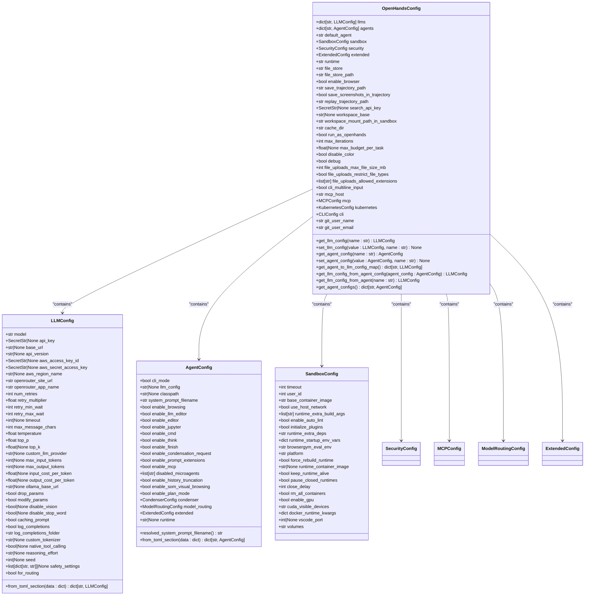
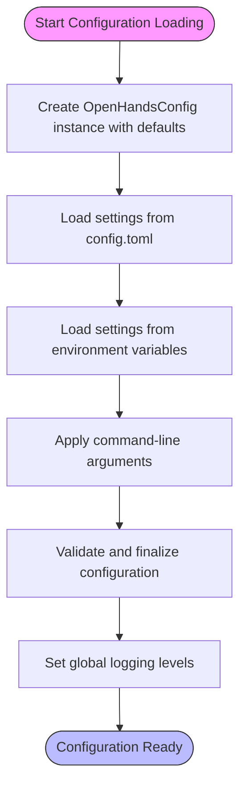
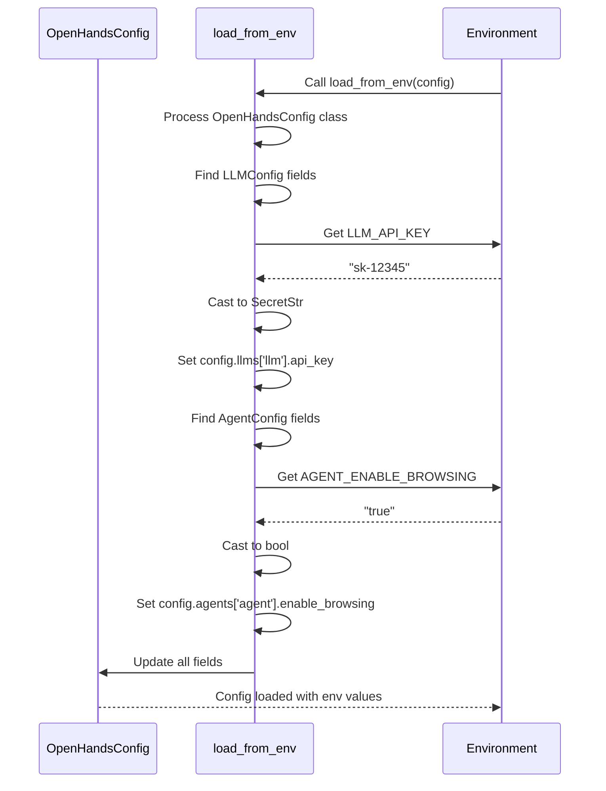
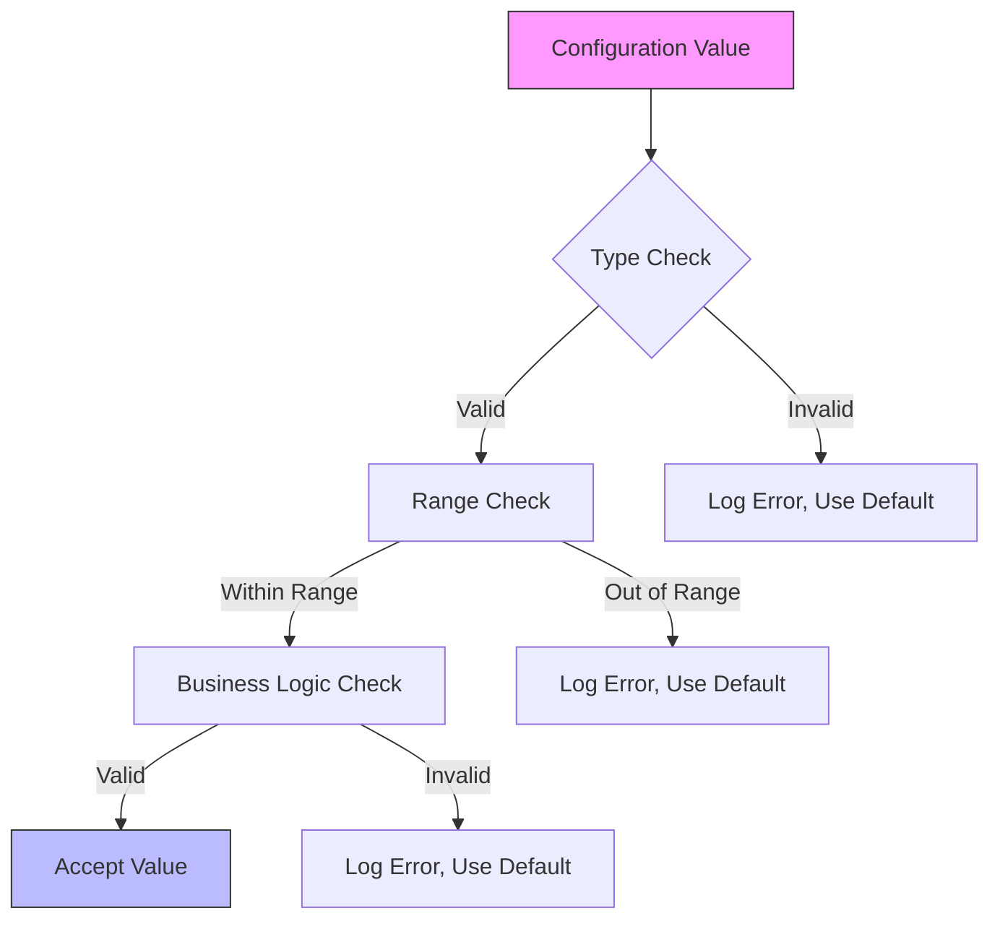
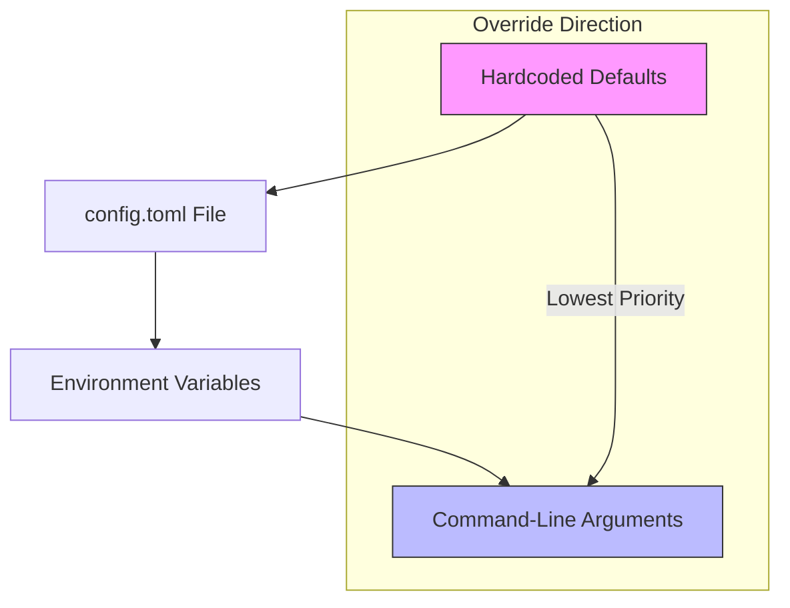
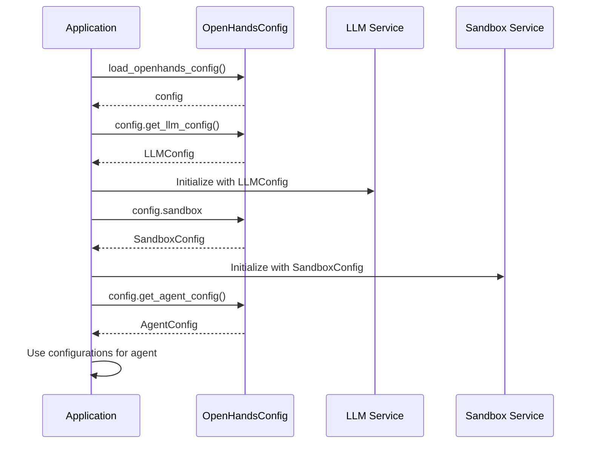
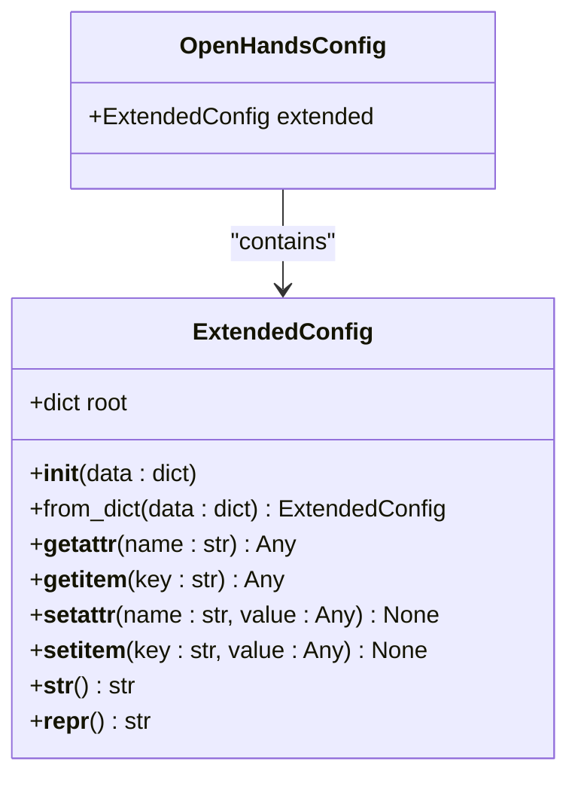

# Configuration Management

<cite>
**Referenced Files in This Document**   
- [openhands_config.py](file://openhands/core/config/openhands_config.py)
- [llm_config.py](file://openhands/core/config/llm_config.py)
- [agent_config.py](file://openhands/core/config/agent_config.py)
- [config_utils.py](file://openhands/core/config/config_utils.py)
- [config.template.toml](file://config.template.toml)
- [config.toml](file://config.toml)
- [README.md](file://openhands/core/config/README.md)
</cite>

## Table of Contents
1. [Introduction](#introduction)
2. [Configuration Classes](#configuration-classes)
3. [Configuration Loading Process](#configuration-loading-process)
4. [Environment Variable Handling](#environment-variable-handling)
5. [Settings Validation](#settings-validation)
6. [Configuration Hierarchy](#configuration-hierarchy)
7. [Configuration Access](#configuration-access)
8. [Extended Configuration](#extended-configuration)
9. [Common Configuration Issues](#common-configuration-issues)
10. [Best Practices](#best-practices)

## Introduction

The OpenHands configuration management system provides a flexible approach to managing application settings through multiple sources including environment variables, TOML configuration files, and command-line arguments. The system is designed to allow developers and users to customize the behavior of OpenHands components while maintaining a consistent and type-safe configuration interface.

The configuration system is centered around the `OpenHandsConfig` class, which serves as the root configuration object containing nested configurations for various components such as LLMs, agents, sandbox environments, and security settings. The system supports hierarchical configuration with proper type validation and default values, ensuring that the application can operate with sensible defaults while allowing for extensive customization.

**Section sources**
- [README.md](file://openhands/core/config/README.md#L1-L101)

## Configuration Classes

The OpenHands configuration system is built around several key configuration classes that define the structure and default values for different aspects of the application. These classes are implemented using Pydantic models, providing type safety, validation, and documentation capabilities.

The main configuration classes include:

- `OpenHandsConfig`: The root configuration class that contains all other configuration components
- `LLMConfig`: Configuration for language model settings including model name, API keys, and performance parameters
- `AgentConfig`: Configuration for agent behavior including enabled tools and system prompts
- `SandboxConfig`: Configuration for the sandbox environment where code execution occurs
- `SecurityConfig`: Configuration for security-related settings
- `MCPConfig`: Configuration for Model Context Protocol servers
- `ModelRoutingConfig`: Configuration for routing between different LLM models

Each configuration class is defined as a Pydantic model with fields that have appropriate types and default values. The classes use the `ConfigDict(extra='forbid')` setting to prevent the addition of unexpected fields, ensuring configuration integrity.

**Diagram sources**
- [openhands_config.py](file://openhands/core/config/openhands_config.py#L23-L184)
- [llm_config.py](file://openhands/core/config/llm_config.py#L12-L98)
- [agent_config.py](file://openhands/core/config/agent_config.py#L15-L68)
- [sandbox_config.py](file://openhands/core/config/sandbox_config.py)

**Section sources**
- [openhands_config.py](file://openhands/core/config/openhands_config.py#L23-L184)
- [llm_config.py](file://openhands/core/config/llm_config.py#L12-L98)
- [agent_config.py](file://openhands/core/config/agent_config.py#L15-L68)

## Configuration Loading Process

The configuration loading process in OpenHands follows a specific sequence to ensure consistent initialization of settings from multiple sources. The primary entry point for configuration loading is the `load_openhands_config()` function, which orchestrates the entire process.

The loading process consists of the following steps:

1. Create an instance of `OpenHandsConfig` with default values
2. Load settings from the `config.toml` file if present
3. Load settings from environment variables, which override TOML settings
4. Apply command-line arguments, which override both TOML and environment settings
5. Perform final validation and adjustments to the configuration
6. Set global logging levels based on the configuration

The `load_from_toml` function handles the parsing of TOML configuration files, supporting both flat and hierarchical configurations. For sections like `[llm]` and `[agent]`, the system supports custom configurations through subsections (e.g., `[llm.custom1]`, `[agent.BrowsingAgent]`). These custom configurations inherit values from the base section and override specific fields as needed.

The `model_post_init` hook in the `OpenHandsConfig` class is used to capture default values when the configuration is first initialized, which helps in tracking configuration changes and providing better debugging information.

**Diagram sources**
- [openhands_config.py](file://openhands/core/config/openhands_config.py#L178-L184)
- [config_utils.py](file://openhands/core/config/config_utils.py#L52-L63)

**Section sources**
- [openhands_config.py](file://openhands/core/config/openhands_config.py#L178-L184)
- [config_utils.py](file://openhands/core/config/config_utils.py#L52-L63)

## Environment Variable Handling

OpenHands provides a systematic approach to handling configuration through environment variables, allowing for easy customization in different deployment environments. The system uses a consistent naming convention to map environment variables to configuration fields.

The naming convention for environment variables follows this pattern:
- Prefix: Uppercase name of the configuration class followed by an underscore (e.g., `LLM_`, `AGENT_`)
- Field names: All uppercase
- Full variable name: Prefix + Field Name (e.g., `LLM_API_KEY`, `AGENT_MEMORY_ENABLED`)

The `load_from_env` function is responsible for loading configuration values from environment variables. It recursively processes the configuration classes, mapping environment variable names to class attributes. The function attempts to cast environment variable values to the types specified in the models, handling basic types (str, int, bool), optional types (e.g., `str | None`), and nested models.

When type casting fails, an error is logged and the default value is retained. This ensures that the application can continue running even with malformed environment variables, falling back to safe defaults.

**Diagram sources**
- [config_utils.py](file://openhands/core/config/config_utils.py#L12-L49)
- [README.md](file://openhands/core/config/README.md#L20-L46)

**Section sources**
- [config_utils.py](file://openhands/core/config/config_utils.py#L12-L49)
- [README.md](file://openhands/core/config/README.md#L20-L46)

## Settings Validation

The OpenHands configuration system includes comprehensive validation mechanisms to ensure that configuration values are correct and consistent. Validation occurs at multiple levels:

1. **Type validation**: Using Pydantic's built-in type checking to ensure values match their declared types
2. **Range validation**: Ensuring numeric values fall within acceptable ranges
3. **Required field validation**: Confirming that required fields are present
4. **Custom validation**: Applying business logic rules to configuration values

The system uses Pydantic's validation decorators and methods to implement custom validation logic. For example, the `LLMConfig` class includes post-initialization hooks that set default values for certain fields based on the model being used. The `model_post_init` method in `LLMConfig` automatically sets the `reasoning_effort` to 'high' for non-Gemini models and sets a default API version for Azure models.

The configuration system also validates TOML files when loading them, providing clear error messages when configuration values are invalid. If a section cannot be parsed, a warning is logged and default values are used instead, ensuring the application can continue running.

**Diagram sources**
- [llm_config.py](file://openhands/core/config/llm_config.py#L162-L195)
- [agent_config.py](file://openhands/core/config/agent_config.py#L82-L159)

**Section sources**
- [llm_config.py](file://openhands/core/config/llm_config.py#L162-L195)
- [agent_config.py](file://openhands/core/config/agent_config.py#L82-L159)

## Configuration Hierarchy

The OpenHands configuration system implements a hierarchical approach to configuration management, allowing for multiple levels of configuration that can override each other in a predictable manner. The hierarchy follows the principle of "last write wins," where later configuration sources override earlier ones.

The configuration hierarchy from lowest to highest priority is:
1. Hardcoded defaults in configuration classes
2. Values from the `config.toml` file
3. Environment variables
4. Command-line arguments

This hierarchy allows for flexible configuration management across different environments. Default values are defined in the configuration classes themselves, providing a baseline for application behavior. The `config.toml` file allows for persistent configuration that can be version-controlled and shared across deployments.

Environment variables provide a way to customize configuration for specific deployment environments without modifying configuration files. This is particularly useful for sensitive information like API keys that should not be stored in version control.

Command-line arguments have the highest priority, allowing for temporary overrides during development or troubleshooting. This enables users to quickly test different configuration options without modifying persistent configuration files.

The system also supports hierarchical configuration within the TOML file itself. For example, the `[llm]` section can define default values, while subsections like `[llm.custom1]` can define custom configurations that inherit from the defaults but override specific fields.

**Diagram sources**
- [README.md](file://openhands/core/config/README.md#L58-L64)
- [config_utils.py](file://openhands/core/config/config_utils.py#L27-L28)

**Section sources**
- [README.md](file://openhands/core/config/README.md#L58-L64)

## Configuration Access

Accessing configuration values in OpenHands is designed to be straightforward and consistent across the application. The primary method is through the `OpenHandsConfig` instance, which provides getter methods for accessing configuration values.

The configuration system provides several convenience methods for accessing configuration values:

- `get_llm_config(name: str = 'llm')`: Retrieves an LLM configuration by name, defaulting to the 'llm' configuration
- `get_agent_config(name: str = 'agent')`: Retrieves an agent configuration by name, defaulting to the 'agent' configuration
- Direct attribute access for top-level configuration values (e.g., `config.sandbox.timeout`)

The system also provides methods for retrieving relationships between configurations, such as `get_llm_config_from_agent(name: str)` which retrieves the LLM configuration associated with a specific agent configuration.

Configuration values are accessed throughout the application in various services. For example, the LLM service uses the LLM configuration to initialize the language model client, while the sandbox service uses the sandbox configuration to set up the execution environment.

**Diagram sources**
- [openhands_config.py](file://openhands/core/config/openhands_config.py#L135-L177)
- [README.md](file://openhands/core/config/README.md#L77-L84)

**Section sources**
- [openhands_config.py](file://openhands/core/config/openhands_config.py#L135-L177)

## Extended Configuration

The OpenHands configuration system includes support for extended configuration through the `ExtendedConfig` class, which allows for arbitrary key-value pairs to be stored in the configuration. This feature enables users to add custom configuration options without modifying the core configuration classes.

The `ExtendedConfig` class is designed to hold arbitrary data that doesn't fit into the predefined configuration schema. It can be accessed both as a dictionary and through attribute access, providing a flexible interface for working with custom configuration data.

Extended configuration can be loaded from the `[extended]` section of the TOML configuration file. This section accepts arbitrary keys and values, which are then available through the `config.extended` property. This is particularly useful for experimental features or custom integrations that require configuration options not supported by the core system.

The extended configuration system is implemented using Python's `__getattr__` and `__getitem__` methods, allowing for seamless access to configuration values regardless of whether they are accessed as attributes or dictionary keys.

**Diagram sources**
- [extended_config.py](file://openhands/core/config/extended_config.py)
- [openhands_config.py](file://openhands/core/config/openhands_config.py#L70)

**Section sources**
- [extended_config.py](file://openhands/core/config/extended_config.py)
- [test_config_extended.py](file://tests/unit/core/config/test_config_extended.py#L83-L171)

## Common Configuration Issues

The OpenHands configuration system addresses several common configuration issues that can arise in complex applications. Understanding these issues and their solutions is essential for maintaining a stable and predictable application behavior.

### Missing Values

When configuration values are missing, the system falls back to default values defined in the configuration classes. This ensures that the application can continue running even when required configuration is not provided. The system logs warnings when values are missing, helping users identify configuration gaps.

### Type Mismatches

Type mismatches between configuration sources (e.g., providing a string value for a numeric field) are handled by attempting to cast the value to the expected type. If casting fails, an error is logged and the default value is used. This prevents the application from crashing due to configuration errors while maintaining data integrity.

### Environment-Specific Settings

Environment-specific settings are managed through the configuration hierarchy, with environment variables taking precedence over file-based configuration. This allows for different settings in development, testing, and production environments without modifying configuration files. Sensitive information like API keys should be provided through environment variables rather than configuration files.

### Configuration Validation Errors

When configuration validation fails (e.g., invalid TOML syntax or values outside acceptable ranges), the system logs detailed error messages and falls back to default values. This graceful degradation ensures that the application remains operational while alerting users to configuration problems.

## Best Practices

To effectively use the OpenHands configuration system, follow these best practices:

### Adding New Configuration Options

When adding new configuration options:
1. Define the option in the appropriate configuration class with a clear name and appropriate type
2. Provide a sensible default value
3. Add documentation explaining the purpose and usage of the option
4. Consider whether the option should be exposed through environment variables
5. Test the option with different configuration sources (TOML, environment variables, command-line)

### Maintaining Backward Compatibility

To maintain backward compatibility when modifying configuration:
1. Avoid removing existing configuration options; instead, deprecate them and provide migration guidance
2. When changing default values, document the change clearly and provide upgrade instructions
3. Use versioning in configuration files if significant changes are required
4. Provide clear error messages when deprecated options are used
5. Test configuration changes with existing configuration files to ensure compatibility

### Security Considerations

For security-sensitive configuration:
1. Use `SecretStr` for sensitive values like API keys to prevent accidental exposure
2. Avoid storing sensitive information in version-controlled configuration files
3. Use environment variables for sensitive configuration in production environments
4. Regularly review and audit configuration settings for security implications
5. Implement proper access controls for configuration management

### Configuration Management

For effective configuration management:
1. Use the `config.template.toml` file as a starting point for new deployments
2. Document custom configuration options and their purposes
3. Use consistent naming conventions across configuration sources
4. Validate configuration changes in a staging environment before deploying to production
5. Monitor configuration-related errors and warnings to identify potential issues