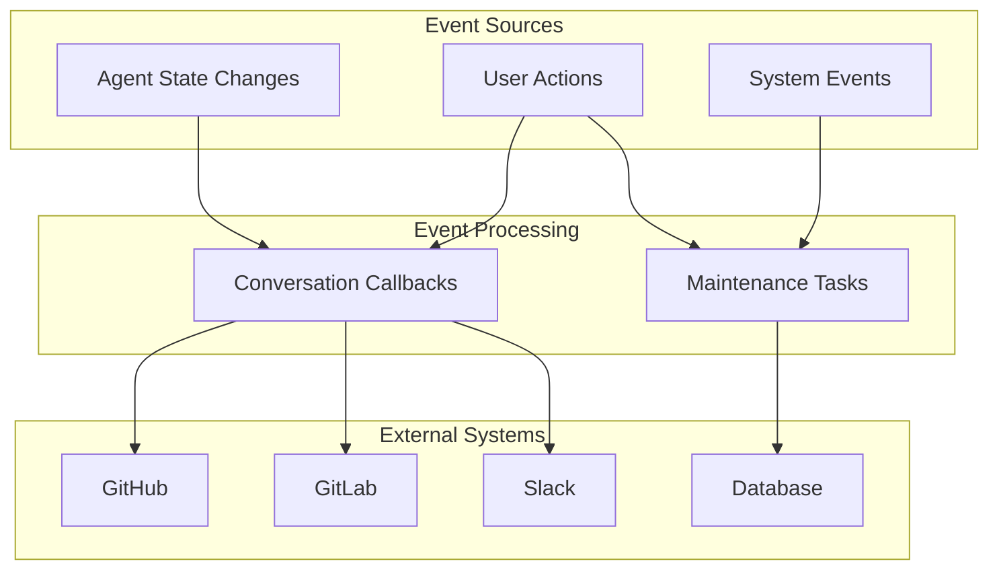
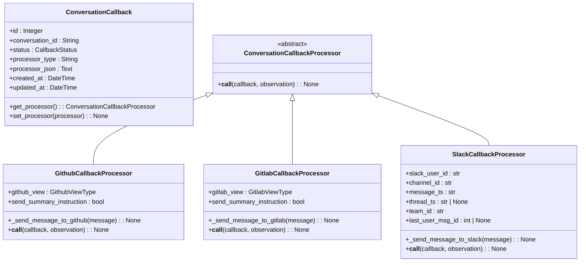
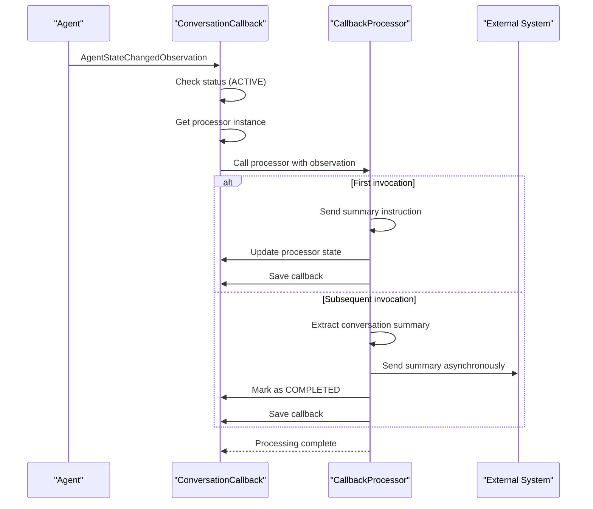
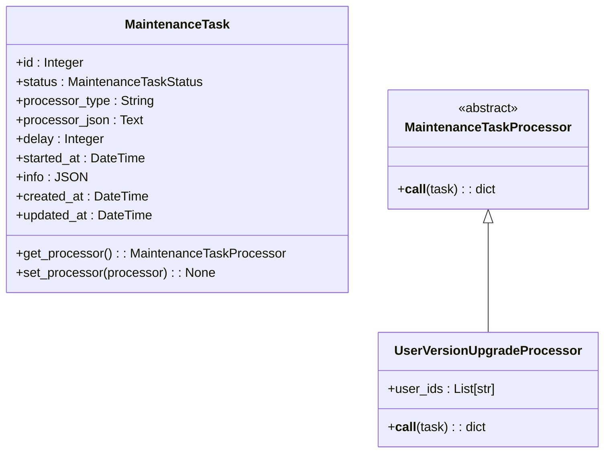
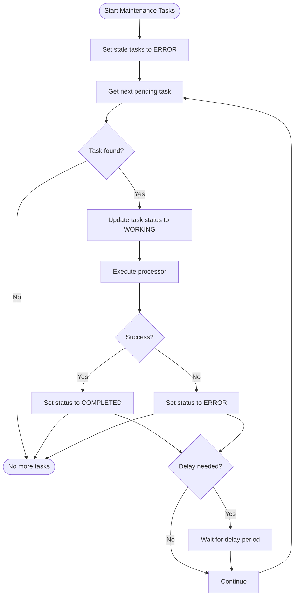
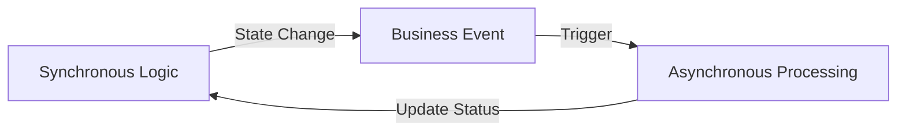

# Event-Driven Patterns

<cite>
**Referenced Files in This Document**   
- [conversation_callback.py](file://enterprise/storage/conversation_callback.py)
- [maintenance_task.py](file://enterprise/storage/maintenance_task.py)
- [github_callback_processor.py](file://enterprise/server/conversation_callback_processor/github_callback_processor.py)
- [gitlab_callback_processor.py](file://enterprise/server/conversation_callback_processor/gitlab_callback_processor.py)
- [slack_callback_processor.py](file://enterprise/server/conversation_callback_processor/slack_callback_processor.py)
- [user_version_upgrade_processor.py](file://enterprise/server/maintenance_task_processor/user_version_upgrade_processor.py)
- [run_maintenance_tasks.py](file://enterprise/run_maintenance_tasks.py)
- [event_callback_models.py](file://openhands/app_server/event_callback/event_callback_models.py)
</cite>

## Table of Contents
1. [Introduction](#introduction)
2. [Event-Driven Architecture Overview](#event-driven-architecture-overview)
3. [Conversation Callback Processor System](#conversation-callback-processor-system)
4. [Maintenance Task Processor System](#maintenance-task-processor-system)
5. [Event Subscription and Processing Patterns](#event-subscription-and-processing-patterns)
6. [Relationship Between Event-Driven and Synchronous Logic](#relationship-between-event-driven-and-synchronous-logic)
7. [Common Issues in Event-Driven Systems](#common-issues-in-event-driven-systems)
8. [Best Practices for Reliable Event Processing](#best-practices-for-reliable-event-processing)
9. [Conclusion](#conclusion)

## Introduction

The OpenHands platform implements a sophisticated event-driven architecture in its business logic layer to handle asynchronous processing and background tasks. This document details the implementation of event listeners, asynchronous processing mechanisms, and the two primary event-driven systems: the conversation callback processor and maintenance task processor. These systems enable the platform to respond to business events with background processing and system updates while maintaining separation between synchronous user interactions and asynchronous operations.

The event-driven patterns in OpenHands are designed to handle various scenarios including integration with external platforms (GitHub, GitLab, Slack), user data migrations, and system maintenance tasks. The architecture follows a processor pattern where event processors are dynamically instantiated and executed based on stored configurations, allowing for flexible and extensible event handling.

**Section sources**
- [conversation_callback.py](file://enterprise/storage/conversation_callback.py#L1-L112)
- [maintenance_task.py](file://enterprise/storage/maintenance_task.py#L1-L110)

## Event-Driven Architecture Overview

OpenHands employs an event-driven architecture that separates business logic into synchronous and asynchronous components. The system uses two primary event processing mechanisms: conversation callbacks for real-time integration events and maintenance tasks for background processing.

The architecture follows a processor pattern where event processors are implemented as Pydantic models that can be serialized to and from JSON. This allows processors to be stored in the database with their configuration, enabling persistent event processing across application restarts. Each processor is associated with a callback or task record that contains the processor type and serialized configuration.

The event-driven components are designed to be loosely coupled, with processors implementing specific interfaces for their respective domains. This design allows new processors to be added without modifying the core processing logic, promoting extensibility and maintainability.



**Diagram sources **
- [conversation_callback.py](file://enterprise/storage/conversation_callback.py#L17-L112)
- [maintenance_task.py](file://enterprise/storage/maintenance_task.py#L17-L110)

**Section sources**
- [conversation_callback.py](file://enterprise/storage/conversation_callback.py#L1-L112)
- [maintenance_task.py](file://enterprise/storage/maintenance_task.py#L1-L110)

## Conversation Callback Processor System

The conversation callback processor system handles real-time events related to conversation state changes, primarily for integration with external platforms. This system is triggered by agent state changes and processes callbacks to send summaries or notifications to external systems.

### Core Components

The conversation callback system consists of two main components: the `ConversationCallback` database model and the `ConversationCallbackProcessor` abstract base class. The `ConversationCallback` model stores information about pending callbacks, including the conversation ID, processor type, and serialized processor configuration.



**Diagram sources **
- [conversation_callback.py](file://enterprise/storage/conversation_callback.py#L56-L112)
- [github_callback_processor.py](file://enterprise/server/conversation_callback_processor/github_callback_processor.py#L27-L144)
- [gitlab_callback_processor.py](file://enterprise/server/conversation_callback_processor/gitlab_callback_processor.py#L30-L143)
- [slack_callback_processor.py](file://enterprise/server/conversation_callback_processor/slack_callback_processor.py#L28-L183)

### Processing Workflow

The conversation callback processing follows a specific workflow when an agent state change occurs:



**Diagram sources **
- [github_callback_processor.py](file://enterprise/server/conversation_callback_processor/github_callback_processor.py#L66-L144)
- [gitlab_callback_processor.py](file://enterprise/server/conversation_callback_processor/gitlab_callback_processor.py#L65-L143)
- [slack_callback_processor.py](file://enterprise/server/conversation_callback_processor/slack_callback_processor.py#L81-L183)

### Implementation Details

The conversation callback processors implement a two-phase processing pattern. On the first invocation, they send a summary instruction to the conversation and update their internal state to prevent reprocessing. On subsequent invocations, they extract the summary and send it to the external system.

The processors are designed to handle specific integration scenarios:
- **GithubCallbackProcessor**: Sends conversation summaries to GitHub issues or pull requests
- **GitlabCallbackProcessor**: Sends conversation summaries to GitLab merge requests
- **SlackCallbackProcessor**: Sends conversation summaries to Slack channels

Each processor stores the necessary context (such as repository information, issue numbers, or channel IDs) in its fields, which are serialized along with the processor instance.

**Section sources**
- [github_callback_processor.py](file://enterprise/server/conversation_callback_processor/github_callback_processor.py#L1-L144)
- [gitlab_callback_processor.py](file://enterprise/server/conversation_callback_processor/gitlab_callback_processor.py#L1-L143)
- [slack_callback_processor.py](file://enterprise/server/conversation_callback_processor/slack_callback_processor.py#L1-L183)

## Maintenance Task Processor System

The maintenance task processor system handles background operations such as data migrations, user upgrades, and system maintenance. Unlike conversation callbacks that respond to real-time events, maintenance tasks are typically scheduled or triggered by administrative actions.

### Core Components

The maintenance task system consists of the `MaintenanceTask` database model and the `MaintenanceTaskProcessor` abstract base class. The `MaintenanceTask` model stores information about pending maintenance operations, including their status, processor type, and serialized configuration.



**Diagram sources **
- [maintenance_task.py](file://enterprise/storage/maintenance_task.py#L55-L110)
- [user_version_upgrade_processor.py](file://enterprise/server/maintenance_task_processor/user_version_upgrade_processor.py#L15-L156)

### Processing Workflow

The maintenance task processing follows a batch processing pattern where tasks are executed sequentially by a dedicated worker process:



**Diagram sources **
- [run_maintenance_tasks.py](file://enterprise/run_maintenance_tasks.py#L1-L79)

### Implementation Details

The maintenance task system is executed by the `run_maintenance_tasks.py` script, which runs as a separate process. The script follows these steps:

1. First, it identifies any stale tasks (tasks in WORKING status for more than one hour) and marks them as ERROR
2. Then, it enters a loop to process pending tasks in order of creation
3. For each task, it updates the status to WORKING and records the start time
4. It instantiates the appropriate processor and executes it
5. Based on the result, it updates the task status to COMPLETED or ERROR
6. If the task has a delay configured, it waits before processing the next task

The `UserVersionUpgradeProcessor` is an example implementation that upgrades user settings to the current version. It takes a list of user IDs and processes each user, creating default settings if needed and tracking the results of each upgrade operation.

**Section sources**
- [maintenance_task.py](file://enterprise/storage/maintenance_task.py#L1-L110)
- [user_version_upgrade_processor.py](file://enterprise/server/maintenance_task_processor/user_version_upgrade_processor.py#L1-L156)
- [run_maintenance_tasks.py](file://enterprise/run_maintenance_tasks.py#L1-L79)

## Event Subscription and Processing Patterns

OpenHands implements several patterns for event subscription and processing across its architecture. These patterns enable both real-time event handling and background processing of business events.

### Dynamic Processor Instantiation

A key pattern in the event-driven architecture is dynamic processor instantiation. Processors are stored in the database as serialized JSON with their type information, allowing them to be reconstructed at runtime:

```python
def get_processor(self) -> ConversationCallbackProcessor:
    processor_type: Type[ConversationCallbackProcessor] = get_impl(
        ConversationCallbackProcessor, self.processor_type
    )
    processor = processor_type.model_validate_json(self.processor_json)
    return processor
```

This pattern enables processors to maintain state between invocations and allows for complex configurations to be persisted.

### Asynchronous Processing

The system uses asynchronous processing extensively, particularly for external integrations. Processors use `asyncio.create_task()` to send messages to external systems without blocking the main processing flow:

```python
# Send the summary to GitHub asynchronously
asyncio.create_task(self._send_message_to_github(summary))
```

This ensures that external API calls do not delay the overall event processing.

### State Management

Processors maintain state through their instance fields, which are automatically serialized and persisted. For example, the `GithubCallbackProcessor` uses the `send_summary_instruction` field to track whether it has already sent the summary instruction:

```python
# Update the processor state
self.send_summary_instruction = False
callback.set_processor(self)
```

This pattern allows processors to implement multi-step workflows across multiple invocations.

**Section sources**
- [conversation_callback.py](file://enterprise/storage/conversation_callback.py#L87-L111)
- [github_callback_processor.py](file://enterprise/server/conversation_callback_processor/github_callback_processor.py#L111-L117)
- [maintenance_task.py](file://enterprise/storage/maintenance_task.py#L85-L109)

## Relationship Between Event-Driven and Synchronous Logic

The OpenHands architecture carefully separates event-driven (asynchronous) processing from synchronous business logic. This separation provides several benefits in terms of system reliability, scalability, and maintainability.

### Separation of Concerns

Synchronous logic handles immediate user interactions and request processing, while event-driven components handle background operations and integrations. This separation ensures that user-facing operations remain responsive even when background processing is occurring.

The conversation callback system demonstrates this separation: when a user interacts with the system, the synchronous logic processes the immediate request, while the callback system handles the subsequent integration with external platforms in the background.

### Event Triggering

Business events that trigger background processing are typically generated by state changes in the synchronous logic. For example, when an agent's state changes to AWAITING_USER_INPUT or FINISHED, this synchronous state change triggers the asynchronous processing of conversation callbacks.



**Diagram sources **
- [github_callback_processor.py](file://enterprise/server/conversation_callback_processor/github_callback_processor.py#L78-L83)
- [gitlab_callback_processor.py](file://enterprise/server/conversation_callback_processor/gitlab_callback_processor.py#L77-L82)

### Data Consistency

The system maintains data consistency between synchronous and asynchronous components through careful transaction management. When a processor updates its state, it does so within a database transaction to ensure atomicity:

```python
# Update the processor state and save to database
callback.set_processor(self)
callback.updated_at = datetime.now()
with session_maker() as session:
    session.merge(callback)
    session.commit()
```

This pattern prevents race conditions and ensures that processor state is consistently persisted.

**Section sources**
- [github_callback_processor.py](file://enterprise/server/conversation_callback_processor/github_callback_processor.py#L114-L117)
- [gitlab_callback_processor.py](file://enterprise/server/conversation_callback_processor/gitlab_callback_processor.py#L113-L116)
- [slack_callback_processor.py](file://enterprise/server/conversation_callback_processor/slack_callback_processor.py#L146-L147)

## Common Issues in Event-Driven Systems

Event-driven systems introduce several challenges that must be addressed to ensure reliability and correctness. OpenHands implements specific patterns to mitigate these common issues.

### Message Ordering

In distributed systems, message ordering can be challenging. OpenHands addresses this by processing conversation callbacks in a deterministic order based on the agent state changes. The system ensures that summary instructions are sent before summaries by using state flags within the processors.

### Error Handling

Robust error handling is critical in event-driven systems. OpenHands implements comprehensive error handling in its processors:

```python
try:
    # Processing logic
    processor = task.get_processor()
    task.info = await processor(task)
    task.status = MaintenanceTaskStatus.COMPLETED
except Exception as e:
    task.info = {'error': str(e)}
    task.status = MaintenanceTaskStatus.ERROR
```

This pattern ensures that failures are captured and recorded, allowing for diagnosis and recovery.

### Processing Guarantees

The system provides at-least-once processing guarantees by persisting the state of processors. If a processor fails mid-execution, it can resume from its last known state when retried. The maintenance task system also includes a mechanism to detect and recover from stalled tasks by marking them as ERROR after a timeout period.

### Idempotency

Processors are designed to be idempotent, meaning they can be safely executed multiple times without adverse effects. This is achieved by checking state before performing actions:

```python
# Check if we have already sent the summary instruction
if self.send_summary_instruction:
    # Send instruction and update state
else:
    # Extract summary and complete
```

This pattern prevents duplicate processing and ensures reliability in the face of retries.

**Section sources**
- [run_maintenance_tasks.py](file://enterprise/run_maintenance_tasks.py#L45-L53)
- [github_callback_processor.py](file://enterprise/server/conversation_callback_processor/github_callback_processor.py#L140-L143)
- [gitlab_callback_processor.py](file://enterprise/server/conversation_callback_processor/gitlab_callback_processor.py#L140-L142)

## Best Practices for Reliable Event Processing

Based on the OpenHands implementation, several best practices emerge for implementing reliable event processing in business logic.

### Use Abstract Base Classes for Processors

Defining processors as abstract base classes with a consistent interface promotes code reuse and makes it easier to add new processor types:

```python
class ConversationCallbackProcessor(BaseModel, ABC):
    @abstractmethod
    async def __call__(
        self,
        callback: ConversationCallback,
        observation: AgentStateChangedObservation,
    ) -> None:
        pass
```

### Persist Processor State

Storing processor configuration and state in the database allows for recovery from failures and processing across application restarts. The serialization pattern used in OpenHands enables complex processor states to be persisted.

### Implement Health Monitoring

The maintenance task system includes health monitoring by detecting and recovering from stalled tasks:

```python
def set_stale_task_error():
    session.query(MaintenanceTask).filter(
        MaintenanceTask.status == MaintenanceTaskStatus.WORKING,
        MaintenanceTask.started_at < datetime.now(timezone.utc) - timedelta(hours=1),
    ).update({MaintenanceTask.status: MaintenanceTaskStatus.ERROR})
```

### Use Asynchronous Operations for External Calls

External API calls should be performed asynchronously to prevent blocking the main processing flow. Using `asyncio.create_task()` allows these operations to proceed without delaying other processing.

### Implement Idempotent Processing

Design processors to be idempotent by checking state before performing actions. This ensures reliability in the face of retries and system failures.

### Provide Comprehensive Logging

Detailed logging is essential for diagnosing issues in event-driven systems. OpenHands processors include extensive logging at various levels to track processing progress and errors.

**Section sources**
- [conversation_callback.py](file://enterprise/storage/conversation_callback.py#L17-L38)
- [maintenance_task.py](file://enterprise/storage/maintenance_task.py#L17-L38)
- [run_maintenance_tasks.py](file://enterprise/run_maintenance_tasks.py#L23-L31)

## Conclusion

The event-driven patterns in OpenHands demonstrate a robust approach to handling asynchronous processing in business logic. The system effectively separates real-time integration events (handled by conversation callbacks) from background maintenance tasks, providing a flexible and reliable architecture.

Key strengths of the implementation include:
- Dynamic processor instantiation with state persistence
- Clear separation between synchronous and asynchronous logic
- Comprehensive error handling and recovery mechanisms
- Idempotent processing to ensure reliability
- Extensible architecture that supports multiple processor types

The conversation callback system efficiently handles integration with external platforms like GitHub, GitLab, and Slack, while the maintenance task system provides a reliable mechanism for background operations such as user data migrations. Together, these systems enable OpenHands to deliver a responsive user experience while performing complex background processing.

By following the best practices demonstrated in this implementation, developers can create reliable event-driven systems that are maintainable, scalable, and resilient to failures.