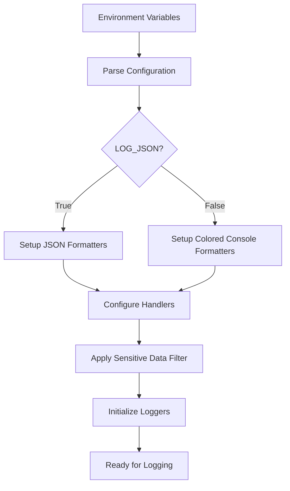
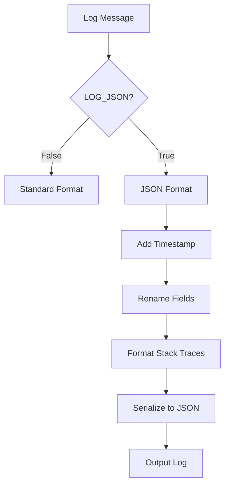
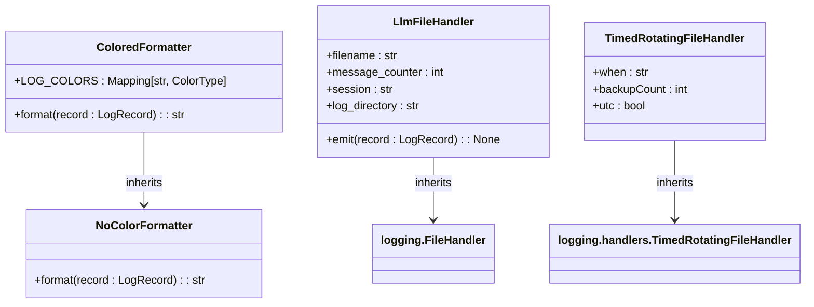
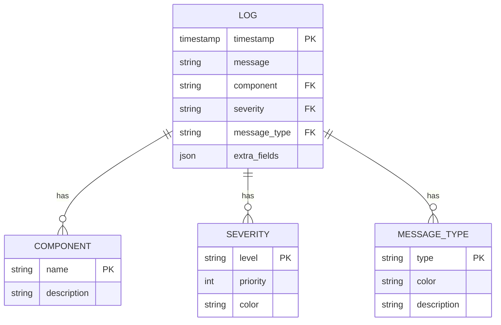
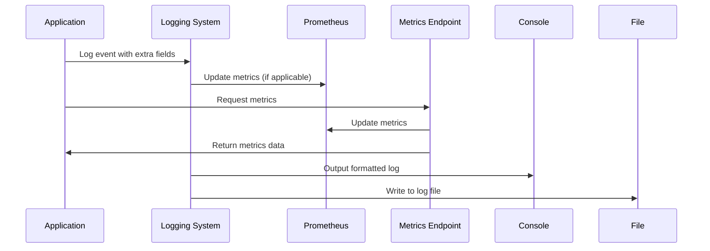
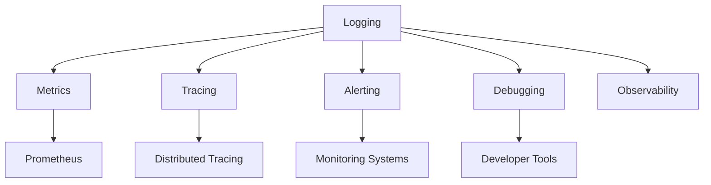
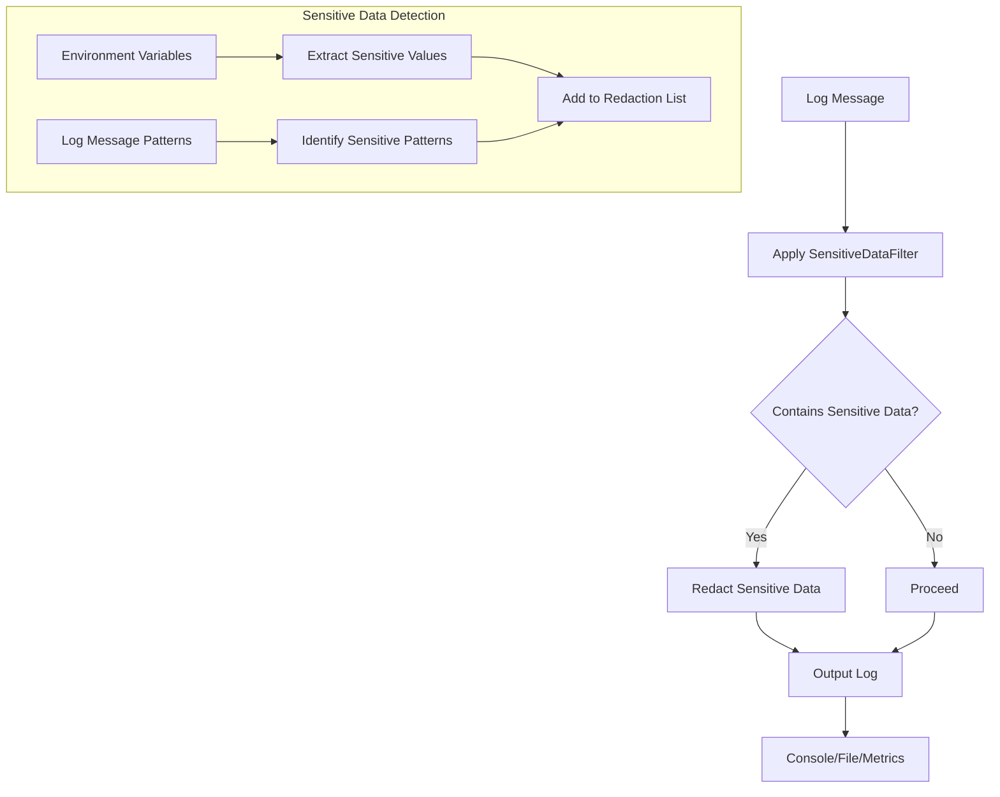

# Logging Infrastructure

<cite>
**Referenced Files in This Document**   
- [openhands/core/logger.py](file://openhands/core/logger.py)
- [enterprise/server/logger.py](file://enterprise/server/logger.py)
- [enterprise/server/saas_monitoring_listener.py](file://enterprise/server/saas_monitoring_listener.py)
- [openhands/server/app.py](file://openhands/server/app.py)
- [enterprise/saas_server.py](file://enterprise/saas_server.py)
- [openhands/core/config/openhands_config.py](file://openhands/core/config/openhands_config.py)
- [openhands/runtime/utils/log_capture.py](file://openhands/runtime/utils/log_capture.py)
</cite>

## Table of Contents
1. [Introduction](#introduction)
2. [Logging Configuration](#logging-configuration)
3. [Log Level Management](#log-level-management)
4. [Structured Logging Implementation](#structured-logging-implementation)
5. [Custom Log Formatters and Handlers](#custom-log-formatters-and-handlers)
6. [Log Categorization by Component and Severity](#log-categorization-by-component-and-severity)
7. [Integration with Monitoring Systems](#integration-with-monitoring-systems)
8. [Relationship Between Logging and Other Observability Components](#relationship-between-logging-and-other-observability-components)
9. [Common Logging Issues](#common-logging-issues)
10. [Guidelines for Effective Logging in Business Logic Components](#guidelines-for-effective-logging-in-business-logic-components)

## Introduction
The OpenHands platform implements a comprehensive logging infrastructure designed to provide detailed insights into system behavior while maintaining security and performance. The logging system is built on Python's standard logging module with extensive customizations for structured logging, sensitive data protection, and integration with monitoring systems. This document details the logging configuration, log level management, structured logging implementation, custom formatters and handlers, log categorization, and integration with monitoring systems across the business logic layer.

**Section sources**
- [openhands/core/logger.py](file://openhands/core/logger.py#L1-L589)
- [enterprise/server/logger.py](file://enterprise/server/logger.py#L1-L122)

## Logging Configuration
The logging infrastructure in OpenHands is configured through environment variables that control various aspects of logging behavior. The primary configuration file `openhands/core/logger.py` sets up the logging system based on these environment variables. Key configuration options include:

- **LOG_LEVEL**: Sets the minimum severity level for log messages (default: INFO)
- **LOG_JSON**: Enables structured JSON logging (default: False)
- **LOG_TO_FILE**: Determines whether logs should be written to files (default: True when LOG_LEVEL is DEBUG)
- **DEBUG**: Enables debug mode, which automatically sets LOG_LEVEL to DEBUG
- **LOG_ALL_EVENTS**: Controls whether all events are logged (default: False)
- **DEBUG_RUNTIME**: Controls whether Docker container logs are streamed (default: False)

The enterprise version extends this configuration with additional settings in `enterprise/server/logger.py`, including LOG_JSON_FOR_CONSOLE which formats JSON output for better readability in console environments. The logging system is initialized early in the application lifecycle, with the root logger and all dependent loggers being configured according to these settings.



**Diagram sources**
- [openhands/core/logger.py](file://openhands/core/logger.py#L1-L589)
- [enterprise/server/logger.py](file://enterprise/server/logger.py#L1-L122)

**Section sources**
- [openhands/core/logger.py](file://openhands/core/logger.py#L1-L589)
- [enterprise/server/logger.py](file://enterprise/server/logger.py#L1-L122)

## Log Level Management
Log level management in OpenHands follows a hierarchical approach with multiple levels of control. The system supports standard Python logging levels (DEBUG, INFO, WARNING, ERROR, CRITICAL) with additional customizations for specific use cases.

The primary log level is controlled by the LOG_LEVEL environment variable, which defaults to INFO. When DEBUG mode is enabled, the log level is automatically set to DEBUG regardless of the LOG_LEVEL setting. This ensures comprehensive logging during development and troubleshooting.

Specialized log levels are implemented for different components:
- LLM-related logging can be controlled with DEBUG_LLM, which enables verbose logging for LLM interactions
- Runtime debugging is controlled by DEBUG_RUNTIME, which enables streaming of Docker container logs
- The LOG_ALL_EVENTS flag controls whether all events are logged at the info level, otherwise they are logged at debug level

The system also implements log level filtering for third-party libraries that produce excessive logging output. Libraries such as engineio, socketio, and sqlalchemy have their log levels set to WARNING by default to reduce noise in the logs.

```mermaid
stateDiagram-v2
[*] --> INFO
INFO --> DEBUG : DEBUG=true
INFO --> DEBUG : LOG_LEVEL=DEBUG
DEBUG --> INFO : DEBUG=false
DEBUG --> INFO : LOG_LEVEL=INFO
INFO --> WARNING : Third-party libraries
DEBUG --> WARNING : Third-party libraries
state "Log Level States" as LogLevels
LogLevels {
INFO
DEBUG
WARNING
ERROR
CRITICAL
}
```

**Diagram sources**
- [openhands/core/logger.py](file://openhands/core/logger.py#L16-L45)
- [openhands/core/logger.py](file://openhands/core/logger.py#L407-L419)

**Section sources**
- [openhands/core/logger.py](file://openhands/core/logger.py#L16-L45)
- [openhands/core/logger.py](file://openhands/core/logger.py#L407-L419)

## Structured Logging Implementation
OpenHands implements structured logging through JSON formatting, which is particularly useful for cloud environments and log aggregation systems. When LOG_JSON is enabled, all log messages are formatted as JSON objects with consistent field names.

The structured logging implementation uses the pythonjsonlogger library to create JSON-formatted log records. Key features include:
- Custom JSON serializer that formats timestamps and stack traces
- Field renaming (e.g., 'levelname' renamed to 'severity' for Google Cloud compatibility)
- Support for additional fields in log records through the 'extra' parameter
- Proper handling of exceptions and stack traces in JSON format

In the enterprise version, additional JSON formatting options are available, including LOG_JSON_FOR_CONSOLE which formats JSON output with indentation for better readability in console environments. The custom_json_serializer function in enterprise/server/logger.py enhances the JSON output with timestamps and properly formatted stack traces.

The system also implements proper handling of uncaught exceptions, routing them through the structured logging system to ensure consistent error reporting.



**Diagram sources**
- [openhands/core/logger.py](file://openhands/core/logger.py#L321-L327)
- [enterprise/server/logger.py](file://enterprise/server/logger.py#L38-L54)

**Section sources**
- [openhands/core/logger.py](file://openhands/core/logger.py#L321-L327)
- [enterprise/server/logger.py](file://enterprise/server/logger.py#L38-L54)

## Custom Log Formatters and Handlers
OpenHands implements several custom log formatters and handlers to support different logging requirements across the application.

### Custom Formatters
The system includes two primary custom formatters:
- **ColoredFormatter**: Adds color coding to log messages in console output based on message type (ACTION, USER_ACTION, OBSERVATION, etc.)
- **NoColorFormatter**: Strips ANSI color codes from messages for file logging

The ColoredFormatter uses a mapping of message types to colors defined in LOG_COLORS, allowing visual differentiation of different types of log messages. Message types include ACTION (green), USER_ACTION (light red), OBSERVATION (yellow), and ERROR (red).

### Custom Handlers
Several custom handlers are implemented:
- **TimedRotatingFileHandler**: Rotates log files daily with up to 7 backup files
- **LlmFileHandler**: Specialized handler for LLM prompt and response logging, creating separate files for each message
- **json_log_handler**: Handler that outputs JSON-formatted logs to stdout

The LlmFileHandler is particularly noteworthy as it creates a hierarchical directory structure for LLM logs, with separate directories for debug and non-debug sessions. Each LLM interaction is logged to a separate file with a sequential number, making it easy to trace individual LLM conversations.



**Diagram sources**
- [openhands/core/logger.py](file://openhands/core/logger.py#L129-L156)
- [openhands/core/logger.py](file://openhands/core/logger.py#L421-L474)

**Section sources**
- [openhands/core/logger.py](file://openhands/core/logger.py#L129-L156)
- [openhands/core/logger.py](file://openhands/core/logger.py#L421-L474)

## Log Categorization by Component and Severity
Logs in OpenHands are categorized by both component and severity to facilitate filtering and analysis.

### Component-Based Categorization
Each component in the system uses its own logger instance, typically created with logging.getLogger(__name__). This creates a hierarchical naming structure that reflects the component's location in the codebase. For example:
- openhands.core.logger for core logging functionality
- openhands.controller.agent_controller for agent controller operations
- openhands.agenthub.codeact_agent for the CodeAct agent

Specialized loggers are also created for specific purposes:
- llm_prompt_logger for LLM prompt logging
- llm_response_logger for LLM response logging
- saas for enterprise SaaS operations

### Severity-Based Categorization
The system uses standard logging levels with specific guidelines for their use:
- **DEBUG**: Detailed information for debugging, including internal state and flow
- **INFO**: General operational information, including significant events and state changes
- **WARNING**: Indications of potential issues that don't prevent operation
- **ERROR**: Errors that prevent specific operations but don't crash the system
- **CRITICAL**: Severe errors that may cause system instability

The system also implements message type categorization through the msg_type field, which allows for additional semantic categorization beyond severity levels. Message types include ACTION, OBSERVATION, PLAN, and ERROR, each with associated colors for visual identification.



**Diagram sources**
- [openhands/core/logger.py](file://openhands/core/logger.py#L76-L84)
- [openhands/core/logger.py](file://openhands/core/logger.py#L365-L375)

**Section sources**
- [openhands/core/logger.py](file://openhands/core/logger.py#L76-L84)
- [openhands/core/logger.py](file://openhands/core/logger.py#L365-L375)

## Integration with Monitoring Systems
The logging infrastructure in OpenHands is designed to integrate seamlessly with monitoring systems, particularly in the enterprise SaaS version.

### Prometheus Integration
The enterprise version includes integration with Prometheus for metrics collection. The SaaSMonitoringListener class in enterprise/server/saas_monitoring_listener.py implements callbacks that update Prometheus metrics based on application events. Key metrics include:
- saas_agent_status_errors: Counter for agent status change events to error state
- saas_create_conversation: Counter for conversation creation attempts
- saas_agent_session_start: Histogram for agent session start duration, labeled by success

These metrics are exposed through a dedicated metrics endpoint mounted at /internal/metrics, which uses a custom ASGI app wrapper to update metrics before serving the Prometheus endpoint.

### Uvicorn Integration
For web server logging, OpenHands provides a custom JSON log configuration for Uvicorn. The get_uvicorn_json_log_config function in openhands/core/logger.py returns a configuration dictionary that ensures Uvicorn's error and access logs are emitted as single-line JSON, avoiding multi-line plain-text tracebacks in log aggregators.

### Exception Handling Integration
The system integrates logging with exception handling through the log_uncaught_exceptions function, which routes uncaught exceptions through the structured logging system. This ensures consistent error reporting and prevents sensitive information from being exposed in unstructured exception traces.



**Diagram sources**
- [enterprise/server/saas_monitoring_listener.py](file://enterprise/server/saas_monitoring_listener.py#L1-L76)
- [openhands/core/logger.py](file://openhands/core/logger.py#L520-L589)

**Section sources**
- [enterprise/server/saas_monitoring_listener.py](file://enterprise/server/saas_monitoring_listener.py#L1-L76)
- [openhands/core/logger.py](file://openhands/core/logger.py#L520-L589)

## Relationship Between Logging and Other Observability Components
The logging system in OpenHands is closely integrated with other observability components, creating a comprehensive monitoring ecosystem.

### Logging and Metrics
Logging and metrics are tightly coupled through the MonitoringListener interface. When significant events occur in the application, they are both logged and used to update metrics. For example, when an agent session starts, the event is logged and a histogram metric is updated with the duration. This dual approach provides both detailed event information in logs and aggregated statistical data in metrics.

### Logging and Tracing
While not explicitly implemented in the current codebase, the structured logging system provides a foundation for distributed tracing. The JSON log format includes fields that could be used to correlate log entries across service boundaries, such as request IDs and session IDs. The msg_type field also provides semantic information that could be used to reconstruct request flows.

### Logging and Alerting
The logging system supports alerting through integration with monitoring systems. Error-level logs automatically trigger alerts in monitoring platforms that support log-based alerting. The structured format makes it easy to create alerts based on specific error patterns or message types.

### Logging and Debugging
The logging infrastructure is a primary tool for debugging, with different log levels providing varying degrees of detail. The DEBUG level provides comprehensive information about the application's internal state, while the INFO level provides a high-level view of operations. The system also includes specialized logging for LLM interactions, which is crucial for debugging AI behavior.



**Diagram sources**
- [enterprise/server/saas_monitoring_listener.py](file://enterprise/server/saas_monitoring_listener.py#L1-L76)
- [openhands/core/logger.py](file://openhands/core/logger.py#L1-L589)

**Section sources**
- [enterprise/server/saas_monitoring_listener.py](file://enterprise/server/saas_monitoring_listener.py#L1-L76)
- [openhands/core/logger.py](file://openhands/core/logger.py#L1-L589)

## Common Logging Issues
The OpenHands logging infrastructure addresses several common logging issues through careful design and implementation.

### Performance Impact
Logging can have a significant performance impact, especially when writing to disk or when excessive logging occurs. OpenHands mitigates this through several strategies:
- Conditional logging based on log level
- Asynchronous logging where appropriate
- Rate limiting for verbose logging
- Efficient formatting and serialization

The system also implements log level filtering for third-party libraries that are known to produce excessive logging output, reducing overall log volume.

### Log Flooding
To prevent log flooding, the system implements several controls:
- Default log levels that balance information and noise
- Selective enabling of verbose logging through specific environment variables
- Rate limiting for certain types of log messages
- Automatic suppression of repetitive messages

The LOG_ALL_EVENTS flag provides a way to control the volume of event logging, allowing developers to enable comprehensive event logging only when needed for debugging.

### Sensitive Data Exposure
Protecting sensitive data is a critical concern in logging. OpenHands implements multiple layers of protection:
- **SensitiveDataFilter**: A custom logging filter that removes sensitive values from environment variables and log messages
- Environment variable scanning: The filter scans environment variables for values that match patterns indicating sensitive data (containing 'SECRET', '_KEY', '_CODE', '_TOKEN')
- Pattern-based redaction: The filter uses regular expressions to redact sensitive patterns from log messages
- Exclusion of sensitive libraries: The LiteLLM logger is disabled to prevent API key leakage

The SensitiveDataFilter is applied to the main logger, ensuring that sensitive data is redacted before logs are output to any destination.



**Diagram sources**
- [openhands/core/logger.py](file://openhands/core/logger.py#L239-L285)
- [tests/unit/core/logger/test_logger.py](file://tests/unit/core/logger/test_logger.py#L1-L117)

**Section sources**
- [openhands/core/logger.py](file://openhands/core/logger.py#L239-L285)
- [tests/unit/core/logger/test_logger.py](file://tests/unit/core/logger/test_logger.py#L1-L117)

## Guidelines for Effective Logging in Business Logic Components
To ensure consistent and effective logging across the OpenHands codebase, the following guidelines should be followed when implementing logging in business logic components.

### Use Appropriate Log Levels
- **DEBUG**: Use for detailed information about internal state, flow, and variables. Include enough context to understand what the code is doing without needing to read the source.
- **INFO**: Use for significant events, state changes, and operational milestones. These should provide a high-level view of what the system is doing.
- **WARNING**: Use for conditions that are unexpected but don't prevent operation. Include information about potential impacts.
- **ERROR**: Use for errors that prevent specific operations but don't crash the system. Include error details and context.
- **CRITICAL**: Use for severe errors that may cause system instability or data loss.

### Include Contextual Information
When logging, include sufficient context to understand the event without needing to correlate with other logs. Use the 'extra' parameter to add structured data:

```python
logger.info('User action received', extra={
    'user_id': user_id,
    'action_type': action_type,
    'session_id': session_id
})
```

### Use Consistent Message Types
Use the msg_type field to categorize log messages by their semantic meaning. This enables visual differentiation and filtering:

```python
logger.info('Executing action', extra={'msg_type': 'ACTION'})
logger.info('Received observation', extra={'msg_type': 'OBSERVATION'})
```

### Avoid Sensitive Data
Never log sensitive data such as API keys, passwords, or personal information. Rely on the SensitiveDataFilter but also be cautious in what you include in log messages.

### Use Structured Logging
When LOG_JSON is enabled, ensure that log messages can be properly structured. Avoid multi-line messages and ensure that any structured data is included in the 'extra' parameter rather than the message string.

### Be Mindful of Performance
Avoid logging in performance-critical code paths. Use conditional logging when appropriate:

```python
if logger.isEnabledFor(logging.DEBUG):
    logger.debug(f'Large data structure: {large_data}')
```

### Handle Exceptions Properly
When logging exceptions, use the exc_info parameter to include the full traceback:

```python
try:
    # code
except Exception as e:
    logger.error('Operation failed', exc_info=True)
```

This ensures that the full exception context is captured in the log.

**Section sources**
- [openhands/core/logger.py](file://openhands/core/logger.py#L1-L589)
- [enterprise/server/logger.py](file://enterprise/server/logger.py#L1-L122)
- [openhands/core/config/openhands_config.py](file://openhands/core/config/openhands_config.py#L1-L184)