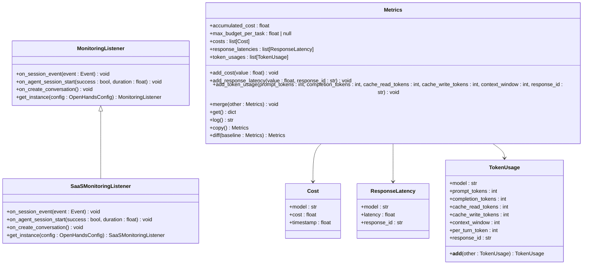
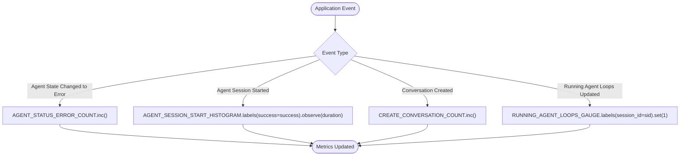
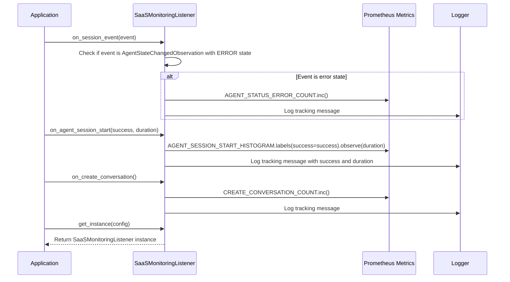
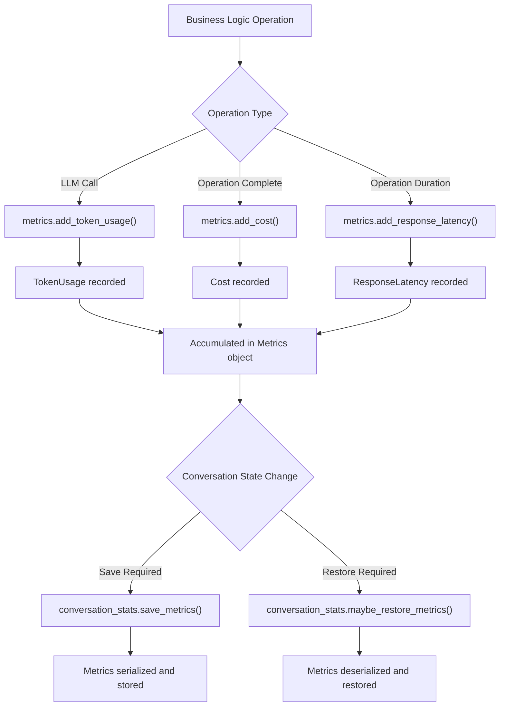
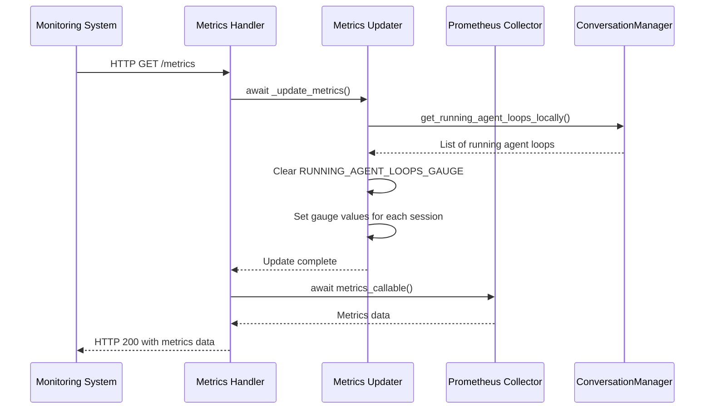
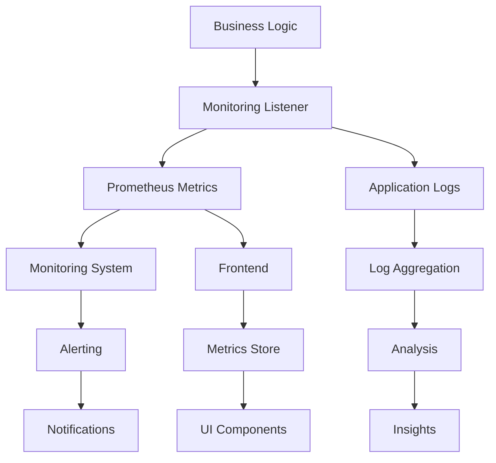

# Metrics Collection

<cite>
**Referenced Files in This Document**   
- [saas_monitoring_listener.py](file://enterprise/server/saas_monitoring_listener.py)
- [metrics.py](file://enterprise/server/metrics.py)
- [metrics.py](file://openhands/llm/metrics.py)
- [monitoring.py](file://openhands/server/monitoring.py)
- [shared.py](file://openhands/server/shared.py)
- [conversation_stats.py](file://openhands/server/services/conversation_stats.py)
- [metrics-store.ts](file://frontend/src/stores/metrics-store.ts)
</cite>

## Table of Contents
1. [Introduction](#introduction)
2. [Core Metrics Implementation](#core-metrics-implementation)
3. [Metrics Types and Instrumentation](#metrics-types-and-instrumentation)
4. [SaaS Monitoring Listener Integration](#saas-monitoring-listener-integration)
5. [Business Logic Metrics Collection](#business-logic-metrics-collection)
6. [Metrics Exposure and Monitoring](#metrics-exposure-and-monitoring)
7. [Relationship Between Metrics, Logging, and Monitoring](#relationship-between-metrics-logging-and-monitoring)
8. [Common Issues in Metrics Collection](#common-issues-in-metrics-collection)
9. [Best Practices for Adding New Metrics](#best-practices-for-adding-new-metrics)
10. [Conclusion](#conclusion)

## Introduction

The OpenHands platform implements a comprehensive metrics collection system to monitor business logic performance and system health. This documentation details the architecture and implementation of the metrics collection system, focusing on how business events are instrumented to generate meaningful metrics that can be exposed to monitoring systems.

The metrics system serves multiple purposes: tracking agent performance, monitoring resource utilization, measuring business operations, and providing insights into system behavior. It integrates with Prometheus for metrics exposure and implements a layered approach to metrics collection that spans from low-level LLM interactions to high-level business operations.

The system employs various metric types including counters, gauges, and histograms to capture different aspects of system behavior. These metrics are collected at various points in the business logic layer and aggregated for analysis and monitoring purposes.

**Section sources**
- [saas_monitoring_listener.py](file://enterprise/server/saas_monitoring_listener.py#L1-L76)
- [metrics.py](file://enterprise/server/metrics.py#L1-L43)

## Core Metrics Implementation

The metrics collection system in OpenHands is built on a modular architecture that separates concerns between metric definition, collection, and exposure. At its core, the system uses Prometheus client libraries to define and expose metrics, while implementing custom business logic to instrument key operations.

The implementation follows a listener pattern where specific events in the application lifecycle trigger metric updates. The `MonitoringListener` abstract base class defines the interface for monitoring application activity, allowing for extensibility and customization of the monitoring behavior.

**Diagram sources **
- [monitoring.py](file://openhands/server/monitoring.py#L5-L42)
- [metrics.py](file://openhands/llm/metrics.py#L7-L278)

**Section sources**
- [monitoring.py](file://openhands/server/monitoring.py#L5-L42)
- [metrics.py](file://openhands/llm/metrics.py#L7-L278)

## Metrics Types and Instrumentation

The OpenHands metrics system implements three primary types of metrics: counters, gauges, and histograms, each serving different monitoring purposes.

### Counters
Counters are used to track the number of occurrences of specific events. In the OpenHands system, counters are implemented using the Prometheus `Counter` class and are used to measure discrete events such as error occurrences and conversation creation attempts. The `AGENT_STATUS_ERROR_COUNT` counter tracks the number of times an agent enters an error state, while the `CREATE_CONVERSATION_COUNT` counter tracks conversation creation attempts.

### Gauges
Gauges represent single numerical values that can go up and down. The `RUNNING_AGENT_LOOPS_GAUGE` is used to track the count of running agent loops, with each session ID serving as a label to deduplicate sessions. This gauge is updated periodically by the `_update_metrics` function, which queries the conversation manager for currently running agent loops.

### Histograms
Histograms are used to track the distribution of values, particularly durations. The `AGENT_SESSION_START_HISTOGRAM` measures the duration of agent session startups, with a 'success' label to differentiate between successful and failed startups. This allows for analysis of startup performance and identification of potential bottlenecks.

The instrumentation of these metrics occurs throughout the business logic layer, with specific methods in the `SaaSMonitoringListener` class handling the incrementing and observation of metrics based on application events.

**Diagram sources **
- [saas_monitoring_listener.py](file://enterprise/server/saas_monitoring_listener.py#L12-L22)
- [metrics.py](file://enterprise/server/metrics.py#L10-L14)

**Section sources**
- [saas_monitoring_listener.py](file://enterprise/server/saas_monitoring_listener.py#L12-L76)
- [metrics.py](file://enterprise/server/metrics.py#L10-L30)

## SaaS Monitoring Listener Integration

The SaaS Monitoring Listener serves as the bridge between application events and the metrics collection system. It extends the base `MonitoringListener` class and implements specific methods to handle different types of business events.

The integration process begins with the instantiation of the monitoring listener through the `get_instance` class method, which is called during application startup. The listener is configured through the server configuration and is responsible for forwarding application signals to Prometheus.

The listener implementation follows the observer pattern, where it subscribes to specific application events and reacts by updating the appropriate metrics. This decoupled design allows for easy extension and modification of the monitoring behavior without affecting the core application logic.

The integration with the SaaS platform is configured through the server configuration, allowing for different monitoring implementations to be substituted based on deployment requirements. This flexibility enables the same core application to be monitored differently in various environments (e.g., development, staging, production).

**Diagram sources **
- [saas_monitoring_listener.py](file://enterprise/server/saas_monitoring_listener.py#L25-L76)
- [monitoring.py](file://openhands/server/monitoring.py#L5-L42)

**Section sources**
- [saas_monitoring_listener.py](file://enterprise/server/saas_monitoring_listener.py#L25-L76)
- [shared.py](file://openhands/server/shared.py#L54-L59)

## Business Logic Metrics Collection

The business logic layer in OpenHands collects a comprehensive set of metrics that track both technical performance and business operations. These metrics are collected through a combination of direct instrumentation and automated tracking.

### LLM Interaction Metrics
The system tracks detailed metrics for LLM interactions, including:
- **Cost tracking**: Accumulated costs and individual cost entries with timestamps
- **Token usage**: Detailed breakdown of prompt, completion, cache read, and cache write tokens
- **Response latency**: Round-trip time for each completion call
- **Context window utilization**: Tracking of context window usage across turns

These metrics are collected through the `Metrics` class in the LLM module, which provides methods to add cost, response latency, and token usage information. The class also implements merging functionality to combine metrics from different sources.

### Conversation Management Metrics
The conversation management system tracks metrics related to conversation lifecycle and resource utilization:
- **Running agent loops**: Current count of active agent sessions
- **Conversation creation**: Attempts to create new conversations
- **Session startup duration**: Time taken to initialize agent sessions

### Metrics Storage and Retrieval
Metrics are persisted to storage through the `ConversationStats` service, which handles saving and restoring metrics for conversations. The service implements a merging strategy that combines restored metrics with current service metrics, with special handling for zero-cost entries.

**Diagram sources **
- [metrics.py](file://openhands/llm/metrics.py#L130-L197)
- [conversation_stats.py](file://openhands/server/services/conversation_stats.py#L34-L81)

**Section sources**
- [metrics.py](file://openhands/llm/metrics.py#L130-L197)
- [conversation_stats.py](file://openhands/server/services/conversation_stats.py#L34-L160)

## Metrics Exposure and Monitoring

The metrics collection system exposes collected metrics through a Prometheus-compatible endpoint, making them available for monitoring and alerting systems.

The exposure mechanism is implemented through the `metrics_app` function in the enterprise metrics module, which creates an ASGI application that serves Prometheus metrics. This function wraps the standard Prometheus metrics handler with additional logic to update metrics before serving them.

The metrics endpoint is designed to be non-disruptive to the main application flow. The `_update_metrics` function is called before serving the metrics, ensuring that the most up-to-date information is provided. This approach balances the need for current metrics with the performance implications of real-time metric calculation.

The system also implements proper error handling in the metrics collection process. The `MonitoringListener` implementations are designed to be non-blocking and non-disruptive, ensuring that issues with metrics collection do not affect the core application functionality.

**Diagram sources **
- [metrics.py](file://enterprise/server/metrics.py#L32-L43)
- [saas_monitoring_listener.py](file://enterprise/server/saas_monitoring_listener.py#L17-L30)

**Section sources**
- [metrics.py](file://enterprise/server/metrics.py#L32-L43)
- [shared.py](file://openhands/server/shared.py#L54-L59)

## Relationship Between Metrics, Logging, and Monitoring

The OpenHands system implements a cohesive approach to observability by integrating metrics, logging, and monitoring into a unified system. These three components work together to provide comprehensive insights into application behavior.

### Metrics and Logging Integration
Each metrics update is accompanied by a corresponding log entry that provides context about the metric change. For example, when the `AGENT_STATUS_ERROR_COUNT` counter is incremented, a log entry is created with the signal name and additional context. This integration allows for correlation between metric changes and specific application events.

The logging system uses structured logging with the `extra` parameter to include metadata about the metrics being tracked. This enables filtering and analysis of logs based on specific metrics, making it easier to diagnose issues.

### Monitoring Architecture
The monitoring architecture follows a layered approach:
1. **Instrumentation Layer**: Business logic code that generates metrics
2. **Collection Layer**: Monitoring listeners that receive events and update metrics
3. **Storage Layer**: Persistence of metrics data for historical analysis
4. **Exposure Layer**: Prometheus endpoint for real-time monitoring
5. **Visualization Layer**: Frontend components that display metrics to users

### Frontend Metrics Display
The frontend implements a metrics store using Zustand to manage metrics state and provide it to UI components. The `useMetricsStore` hook allows components to access and update metrics data, while the `MetricRow` component provides a consistent way to display individual metrics.

**Diagram sources **
- [saas_monitoring_listener.py](file://enterprise/server/saas_monitoring_listener.py#L38-L68)
- [metrics-store.ts](file://frontend/src/stores/metrics-store.ts#L1-L27)

**Section sources**
- [saas_monitoring_listener.py](file://enterprise/server/saas_monitoring_listener.py#L38-L68)
- [metrics-store.ts](file://frontend/src/stores/metrics-store.ts#L1-L27)

## Common Issues in Metrics Collection

The metrics collection system addresses several common challenges in metrics collection, particularly in the context of a complex business logic layer.

### Cardinality Explosion
Cardinality explosion occurs when a metric has too many label combinations, leading to performance issues and increased storage requirements. The OpenHands system mitigates this risk by:

1. **Careful label selection**: Only using essential labels like session_id and success status
2. **Gauge clearing**: The `RUNNING_AGENT_LOOPS_GAUGE` is cleared before each update to prevent accumulation of stale labels
3. **Limited label cardinality**: Avoiding high-cardinality labels like user IDs or timestamps

### Inconsistent Labeling
Inconsistent labeling can make metrics difficult to query and analyze. The system addresses this through:

1. **Standardized naming conventions**: Using consistent prefixes like 'saas_' for all metrics
2. **Centralized metric definition**: Defining all metrics in dedicated modules rather than分散 across the codebase
3. **Comprehensive documentation**: Clear descriptions for each metric and its labels

### Performance Overhead
Metrics collection can introduce performance overhead, particularly when collecting high-frequency data. The system minimizes this impact by:

1. **Asynchronous updates**: Using async functions for metric updates to avoid blocking the main execution thread
2. **Batched operations**: Grouping related metric updates when possible
3. **Non-blocking implementations**: Ensuring monitoring listeners do not raise exceptions or block on I/O operations
4. **Efficient data structures**: Using optimized data structures for metric storage and retrieval

The system also implements safeguards against metrics collection failures. The monitoring listener implementations are designed to be resilient, with try-catch blocks around potentially problematic operations and fallback mechanisms to ensure that metrics collection issues do not affect core application functionality.

**Section sources**
- [metrics.py](file://enterprise/server/metrics.py#L23-L30)
- [saas_monitoring_listener.py](file://enterprise/server/saas_monitoring_listener.py#L16-L17)

## Best Practices for Adding New Metrics

When adding new metrics to track business logic performance, the following best practices should be followed:

### Metric Design Principles
1. **Purpose-driven**: Each metric should have a clear purpose and use case
2. **Actionable**: Metrics should provide insights that can lead to concrete actions
3. **Maintainable**: Consider the long-term maintenance cost of the metric
4. **Cost-effective**: Balance the value of the metric against the collection overhead

### Implementation Guidelines
1. **Use appropriate metric types**: Choose counters for events, gauges for point-in-time values, and histograms for distributions
2. **Limit label cardinality**: Avoid high-cardinality labels that could lead to cardinality explosion
3. **Use consistent naming**: Follow established naming conventions and prefixes
4. **Provide clear descriptions**: Include descriptive documentation for each metric

### Code Organization
1. **Centralize metric definitions**: Define metrics in dedicated modules rather than分散 across the codebase
2. **Group related metrics**: Organize metrics by functional area or subsystem
3. **Use constants for metric names**: Define metric names as constants to avoid typos and enable refactoring

### Testing and Validation
1. **Unit tests**: Write tests to verify metric behavior under different conditions
2. **Integration tests**: Verify that metrics are properly exposed through the Prometheus endpoint
3. **Performance testing**: Assess the performance impact of new metrics
4. **Validation in staging**: Test new metrics in a staging environment before deploying to production

When adding metrics to track specific business logic performance, consider using the `diff` method of the `Metrics` class to calculate the difference between baseline and current metrics. This is particularly useful for tracking metrics for specific operations like delegates or focused tasks.

**Section sources**
- [metrics.py](file://openhands/llm/metrics.py#L223-L277)
- [saas_monitoring_listener.py](file://enterprise/server/saas_monitoring_listener.py#L25-L76)

## Conclusion

The metrics collection system in OpenHands provides a robust foundation for monitoring business logic performance and system health. By implementing a comprehensive set of metrics across counters, gauges, and histograms, the system captures essential information about application behavior and resource utilization.

The integration with the SaaS monitoring listener enables seamless forwarding of application signals to Prometheus, making metrics available for real-time monitoring and alerting. The system's design addresses common challenges in metrics collection, including cardinality explosion, inconsistent labeling, and performance overhead.

The relationship between metrics, logging, and monitoring is carefully orchestrated to provide comprehensive observability without compromising application performance. The frontend components effectively visualize metrics data, making it accessible to users and operators.

By following the documented best practices, developers can extend the metrics system to track additional business logic performance indicators while maintaining the integrity and performance of the overall system.

[No sources needed since this section summarizes without analyzing specific files]