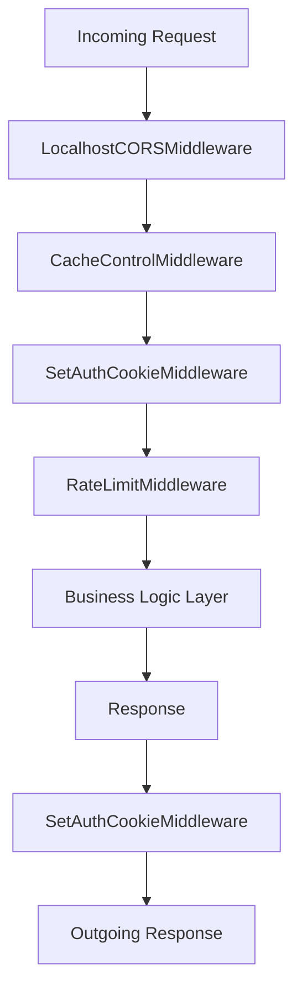
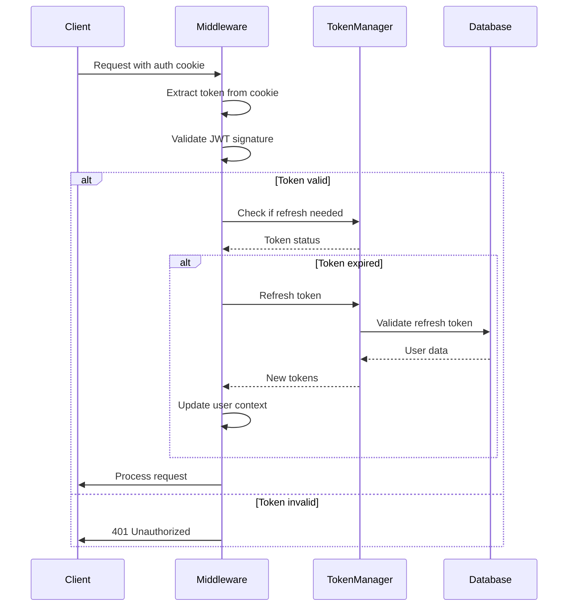
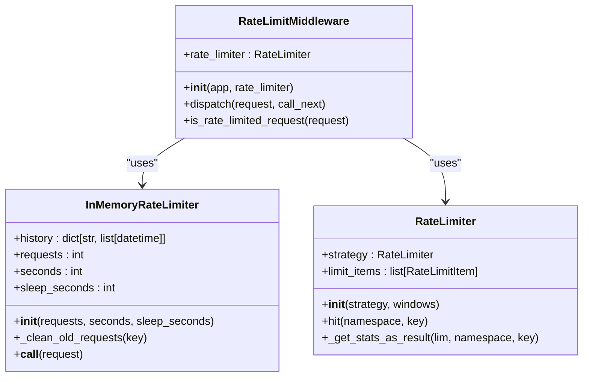
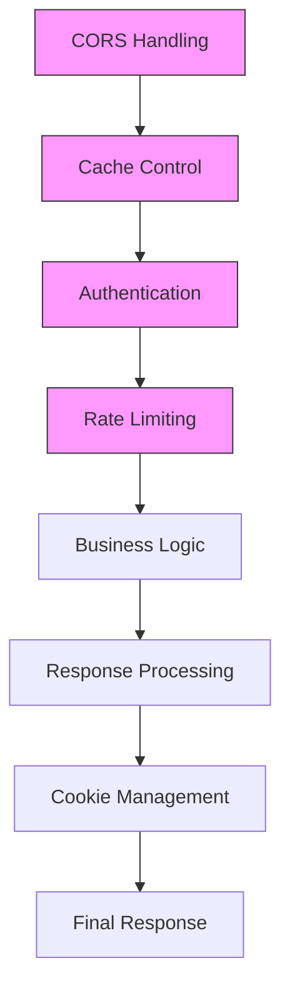
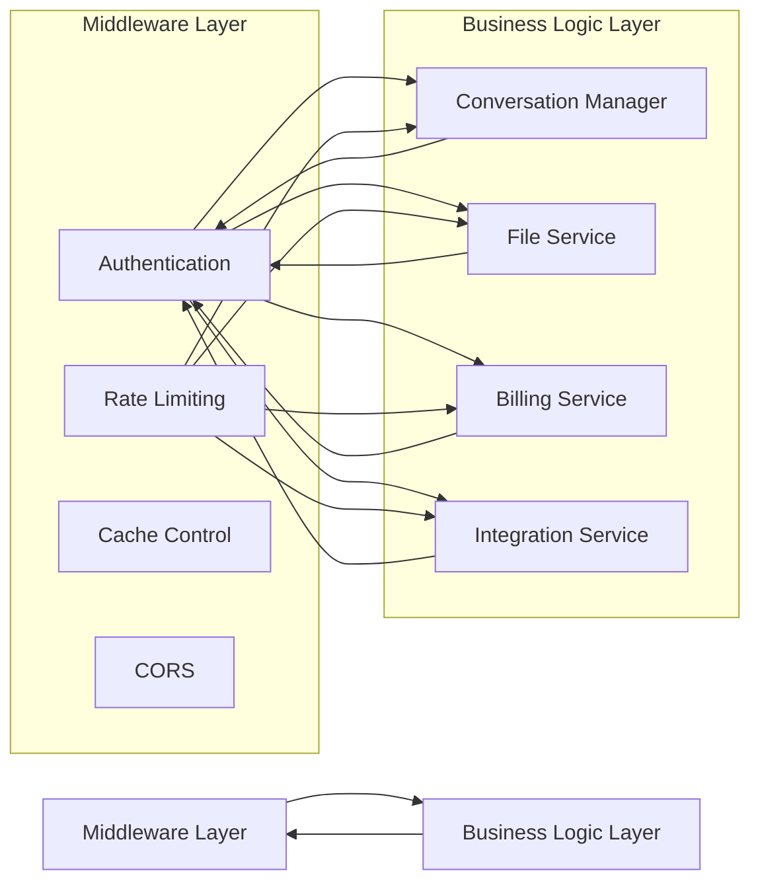

# Middleware Architecture

<cite>
**Referenced Files in This Document**   
- [middleware.py](file://openhands/server/middleware.py)
- [rate_limit.py](file://enterprise/server/rate_limit.py)
- [saas_user_auth.py](file://enterprise/server/auth/saas_user_auth.py)
- [user_auth.py](file://openhands/server/user_auth/user_auth.py)
- [saas_server.py](file://enterprise/saas_server.py)
- [redis.py](file://enterprise/storage/redis.py)
</cite>

## Table of Contents
1. [Introduction](#introduction)
2. [Request Processing Pipeline](#request-processing-pipeline)
3. [Authentication Middleware](#authentication-middleware)
4. [Rate Limiting Implementation](#rate-limiting-implementation)
5. [Cross-Cutting Concerns](#cross-cutting-concerns)
6. [Middleware Integration with API Routes](#middleware-integration-with-api-routes)
7. [Relationship Between Middleware and Business Logic](#relationship-between-middleware-and-business-logic)
8. [Common Middleware Issues](#common-middleware-issues)
9. [Guidelines for Developing New Middleware](#guidelines-for-developing-new-middleware)
10. [Conclusion](#conclusion)

## Introduction

The middleware architecture in the OpenHands business logic layer provides a robust framework for handling cross-cutting concerns such as authentication, rate limiting, and request processing. This document details the implementation and integration of middleware components that intercept and process requests before they reach the business logic layer. The architecture supports both in-memory and Redis-based rate limiting, comprehensive authentication mechanisms, and various cross-cutting concerns essential for a secure and scalable application.

**Section sources**
- [middleware.py](file://openhands/server/middleware.py#L1-L132)
- [saas_server.py](file://enterprise/saas_server.py#L1-L131)

## Request Processing Pipeline

The request processing pipeline in OpenHands follows a structured flow where incoming HTTP requests pass through multiple middleware layers before reaching the business logic components. The pipeline begins with CORS handling through the `LocalhostCORSMiddleware`, which allows requests from localhost/127.0.0.1 domains regardless of port while applying standard CORS rules for other origins. This is followed by cache control middleware that sets appropriate headers to disable caching for most routes, except for assets which are cached aggressively due to fingerprinted filenames.

After these initial processing steps, requests proceed through authentication middleware that validates user credentials and establishes user context. The `SetAuthCookieMiddleware` updates authentication cookies with current authentication state and handles various authentication errors by returning appropriate HTTP responses. Finally, rate limiting middleware evaluates request frequency and either allows the request to proceed or returns a 429 Too Many Requests response when limits are exceeded.



**Diagram sources**
- [middleware.py](file://openhands/server/middleware.py#L16-L48)
- [middleware.py](file://openhands/server/middleware.py#L51-L67)
- [saas_server.py](file://enterprise/saas_server.py#L108-L109)

**Section sources**
- [middleware.py](file://openhands/server/middleware.py#L16-L67)
- [saas_server.py](file://enterprise/saas_server.py#L100-L109)

## Authentication Middleware

The authentication middleware in OpenHands implements a comprehensive system for user authentication and authorization. The `SetAuthCookieMiddleware` class serves as the primary authentication component, responsible for validating authentication tokens, refreshing expired tokens, and maintaining user session state. This middleware extracts authentication information from cookies, bearer tokens, or MCP headers, and establishes user context for subsequent processing.

Authentication supports multiple methods including cookie-based authentication with Keycloak integration and bearer token authentication via API keys. The middleware validates JWT tokens, checks for terms of service acceptance, and verifies email verification status. When authentication credentials are invalid or expired, the middleware returns appropriate HTTP error responses (401 Unauthorized or 403 Forbidden) and handles cookie cleanup.



**Diagram sources**
- [saas_server.py](file://enterprise/saas_server.py#L26-L27)
- [saas_user_auth.py](file://enterprise/server/auth/saas_user_auth.py#L207-L225)

**Section sources**
- [saas_server.py](file://enterprise/saas_server.py#L26-L27)
- [saas_user_auth.py](file://enterprise/server/auth/saas_user_auth.py#L207-L225)

## Rate Limiting Implementation

The rate limiting implementation in OpenHands provides both in-memory and Redis-based solutions for controlling request frequency. The system includes two primary components: an in-memory rate limiter for simple scenarios and a Redis-based rate limiter for distributed environments.

The `InMemoryRateLimiter` uses a sliding window algorithm to track request timestamps for each client IP address. It maintains a dictionary of request histories and cleans old requests based on a configurable time window. When the number of requests exceeds the threshold within the specified time period, the middleware either sleeps for a configured duration (allowing the request to proceed) or rejects the request.

For enterprise deployments, the Redis-based rate limiter provides distributed rate limiting across multiple server instances. This implementation uses the `limits` library with a Redis backend and Fixed Window strategy. The configuration allows defining multiple rate limit windows (e.g., "10/second; 100/minute") and stores rate limit state in Redis for consistency across instances.



**Diagram sources**
- [middleware.py](file://openhands/server/middleware.py#L70-L106)
- [rate_limit.py](file://enterprise/server/rate_limit.py#L50-L57)
- [middleware.py](file://openhands/server/middleware.py#L108-L126)

**Section sources**
- [middleware.py](file://openhands/server/middleware.py#L70-L126)
- [rate_limit.py](file://enterprise/server/rate_limit.py#L50-L107)

## Cross-Cutting Concerns

The middleware architecture addresses several cross-cutting concerns essential for application security and performance. Beyond authentication and rate limiting, the system implements CORS handling, cache control, and exception handling for various authentication scenarios.

The `LocalhostCORSMiddleware` extends FastAPI's built-in CORS middleware to allow any request from localhost/127.0.0.1 domains regardless of port, while applying standard CORS rules for other origins. This facilitates development and testing while maintaining security for production environments.

Cache control is handled by the `CacheControlMiddleware`, which sets appropriate headers to disable caching for most routes. This prevents stale data issues and ensures users receive current content. However, static assets are cached aggressively due to their fingerprinted filenames, improving performance for frontend resources.

Exception handling is implemented through FastAPI's exception handler mechanism, with specific handlers for authentication errors such as `NoCredentialsError` and `ExpiredError`. These handlers return standardized JSON responses with appropriate HTTP status codes, ensuring consistent error reporting across the API.



**Diagram sources**
- [middleware.py](file://openhands/server/middleware.py#L16-L48)
- [middleware.py](file://openhands/server/middleware.py#L51-L67)
- [saas_server.py](file://enterprise/saas_server.py#L100-L109)
- [saas_server.py](file://enterprise/saas_server.py#L116-L128)

**Section sources**
- [middleware.py](file://openhands/server/middleware.py#L16-L67)
- [saas_server.py](file://enterprise/saas_server.py#L100-L128)

## Middleware Integration with API Routes

Middleware components are integrated with API routes through the FastAPI application object in the `saas_server.py` file. The middleware stack is applied globally to all routes, ensuring consistent processing across the entire API surface.

The integration follows a specific order that is crucial for proper functionality. CORS middleware is applied first to handle preflight requests, followed by cache control middleware. Authentication middleware is applied next to establish user context before rate limiting, which depends on authenticated user IDs for accurate rate tracking.

Custom middleware components are registered using FastAPI's `add_middleware` method, while exception handlers are registered using `add_exception_handler`. The `SetAuthCookieMiddleware` is applied using the `@app.middleware('http')` decorator, allowing it to process both requests and responses.

```mermaid
graph TD
A[FastAPI App] --> B[CORSMiddleware]
A --> C[CacheControlMiddleware]
A --> D[SetAuthCookieMiddleware]
A --> E[RateLimitMiddleware]
A --> F[Exception Handlers]
B --> G[API Routes]
C --> G
D --> G
E --> G
F --> G
G --> H[/api/conversations/*]
G --> I[/api/settings/*]
G --> J[/api/billing/*]
G --> K[/api/integration/*]
```

**Diagram sources**
- [saas_server.py](file://enterprise/saas_server.py#L100-L114)
- [saas_server.py](file://enterprise/saas_server.py#L60-L98)

**Section sources**
- [saas_server.py](file://enterprise/saas_server.py#L100-L114)

## Relationship Between Middleware and Business Logic

The relationship between middleware and business logic components in OpenHands follows a clear separation of concerns. Middleware components handle cross-cutting concerns and request preprocessing, while business logic components focus on domain-specific operations.

Middleware establishes the execution context by authenticating users and validating requests before they reach business logic components. The authenticated user context is stored in the request state and made available to business logic through dependency injection. This allows business logic components to access user information without handling authentication directly.

Rate limiting is applied at the middleware layer to prevent excessive requests from reaching business logic, protecting backend resources and ensuring fair usage. The rate limiter uses user IDs from the authentication context to track request rates per user, creating a tight integration between authentication and rate limiting middleware.

Business logic components can also trigger middleware functionality. For example, when a user's authentication token is refreshed during a request, the `SetAuthCookieMiddleware` automatically updates the response with new authentication cookies, demonstrating the bidirectional relationship between layers.



**Diagram sources**
- [user_auth.py](file://openhands/server/user_auth/user_auth.py#L89-L99)
- [saas_user_auth.py](file://enterprise/server/auth/saas_user_auth.py#L207-L225)
- [saas_server.py](file://enterprise/saas_server.py#L108-L109)

**Section sources**
- [user_auth.py](file://openhands/server/user_auth/user_auth.py#L89-L99)
- [saas_user_auth.py](file://enterprise/server/auth/saas_user_auth.py#L207-L225)

## Common Middleware Issues

Several common issues can arise when working with middleware in the OpenHands architecture, particularly related to execution order, error handling, and performance impact.

Execution order is critical, as middleware components depend on the proper sequencing of operations. For example, authentication middleware must execute before rate limiting middleware so that user IDs are available for rate tracking. Similarly, CORS middleware must execute early to handle preflight requests before authentication checks.

Error handling requires careful consideration, as middleware exceptions can prevent requests from reaching business logic. The architecture addresses this by implementing specific exception handlers for authentication errors, ensuring that error responses include appropriate headers and status codes.

Performance impact is a concern with rate limiting, particularly when using Redis-based storage. The implementation mitigates this by using asynchronous operations and handling Redis connection issues gracefully, logging warnings but allowing requests to proceed if rate limit checks cannot be completed.

Configuration issues can also arise, particularly with environment variables that control middleware behavior. The `LocalhostCORSMiddleware` relies on the `PERMITTED_CORS_ORIGINS` environment variable, and incorrect configuration can lead to unexpected CORS behavior.

**Section sources**
- [middleware.py](file://openhands/server/middleware.py#L22-L28)
- [rate_limit.py](file://enterprise/server/rate_limit.py#L65-L69)
- [saas_user_auth.py](file://enterprise/server/auth/saas_user_auth.py#L70-L79)

## Guidelines for Developing New Middleware

When developing new middleware components for the OpenHands architecture, several guidelines should be followed to ensure consistency and proper integration:

1. **Inherit from appropriate base classes**: Custom middleware should inherit from `BaseHTTPMiddleware` for request/response processing or extend existing middleware classes when adding functionality.

2. **Follow the dispatch pattern**: Implement the `dispatch` method to process requests and responses, ensuring that `call_next` is always called to continue the middleware chain.

3. **Handle exceptions appropriately**: Catch and handle exceptions within middleware, returning appropriate HTTP responses rather than allowing unhandled exceptions to propagate.

4. **Consider performance impact**: Minimize blocking operations in middleware, using asynchronous alternatives when available. Cache expensive operations when possible.

5. **Respect execution order**: Be aware of the middleware execution order and design components to work correctly in the established sequence.

6. **Use dependency injection**: Leverage FastAPI's dependency injection system to access configuration and services rather than creating direct dependencies.

7. **Implement proper logging**: Include debug-level logging to facilitate troubleshooting while avoiding excessive log output in production.

8. **Test thoroughly**: Write comprehensive tests for middleware components, including edge cases and error conditions.

**Section sources**
- [middleware.py](file://openhands/server/middleware.py#L10-L13)
- [middleware.py](file://openhands/server/middleware.py#L54-L56)
- [middleware.py](file://openhands/server/middleware.py#L114-L115)

## Conclusion

The middleware architecture in OpenHands provides a robust foundation for handling cross-cutting concerns in the business logic layer. By implementing a well-structured request processing pipeline with authentication, rate limiting, and other middleware components, the system ensures secure, reliable, and performant API operations. The integration between middleware and business logic components follows clear patterns that promote separation of concerns while enabling necessary interactions. With proper understanding of execution order, error handling, and performance considerations, developers can effectively extend and maintain the middleware architecture to meet evolving requirements.