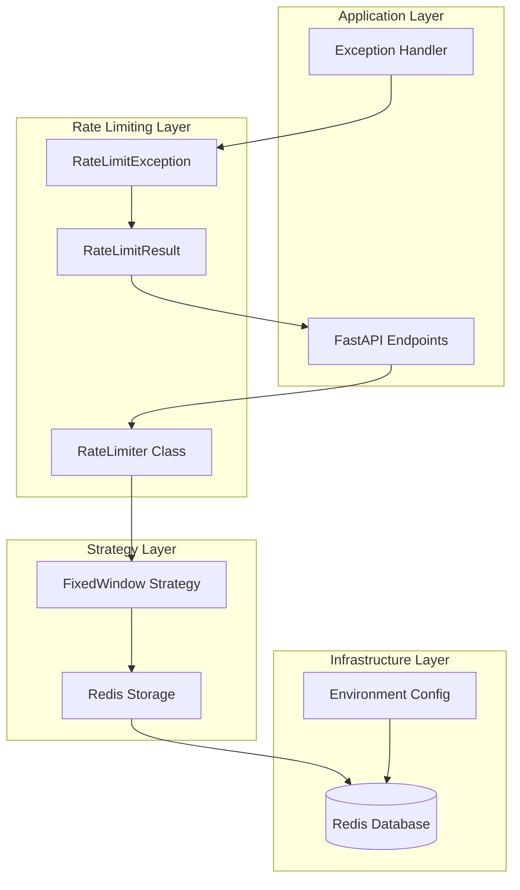
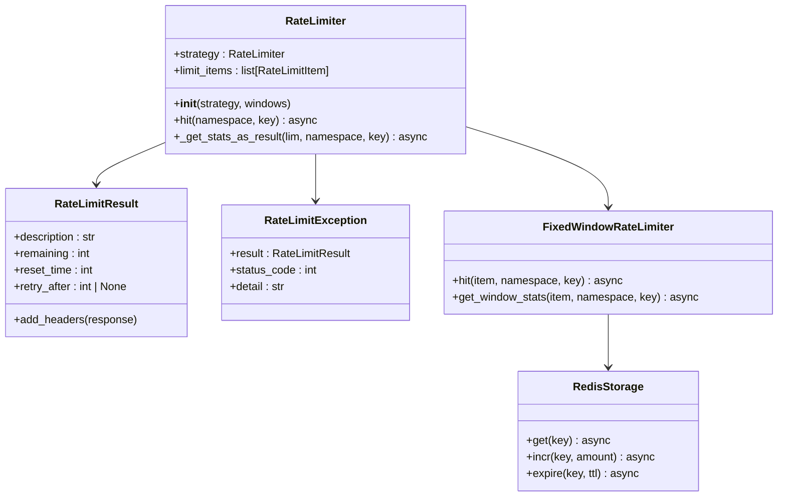
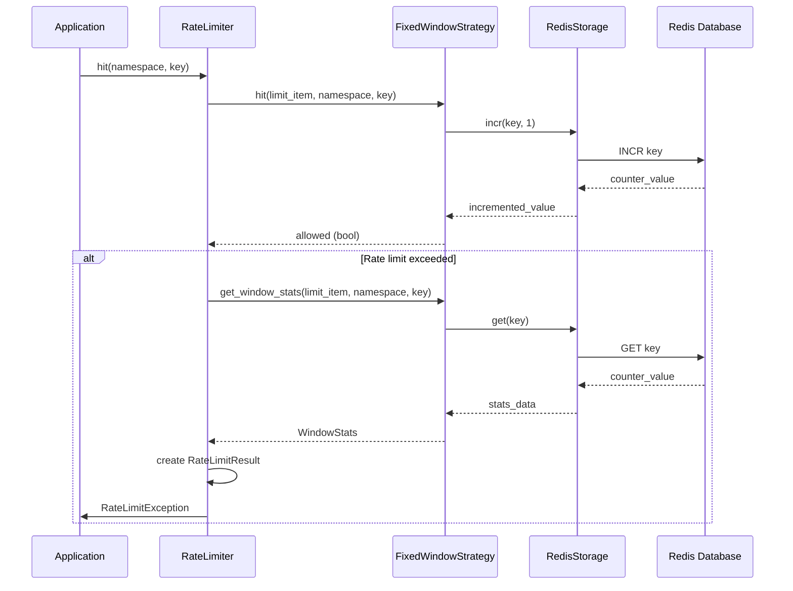
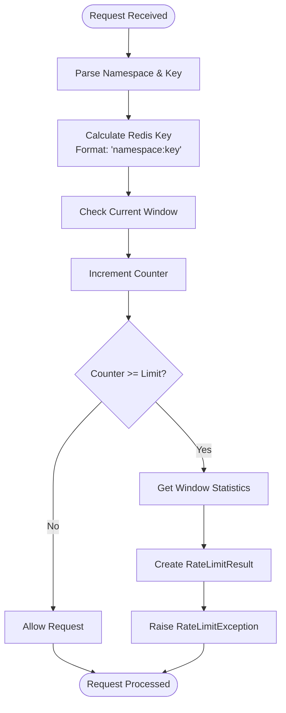
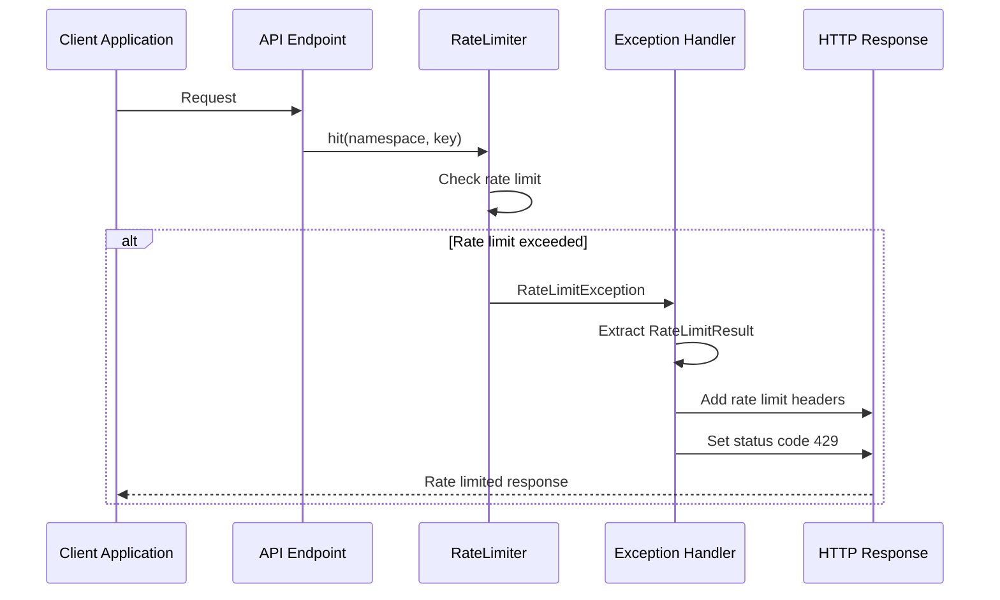
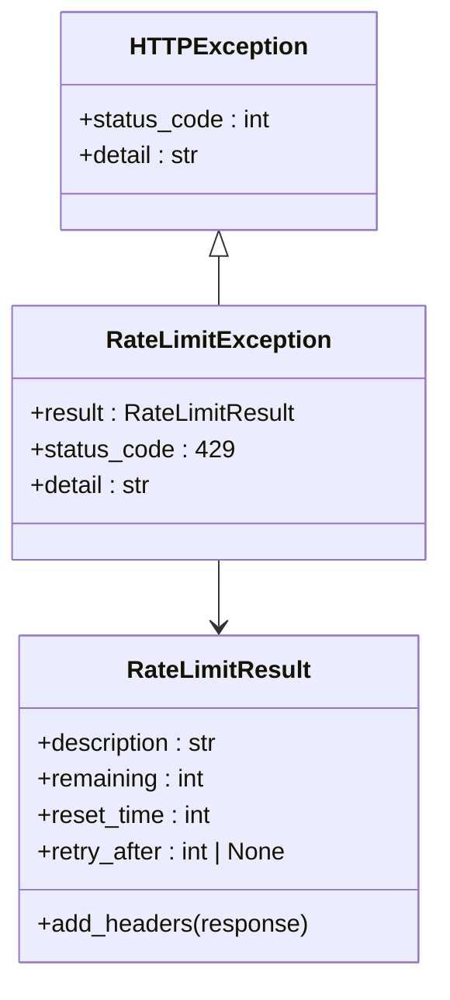

# Rate Limiting Implementation

<cite>
**Referenced Files in This Document**
- [rate_limit.py](file://enterprise/server/rate_limit.py)
- [redis.py](file://enterprise/storage/redis.py)
- [saas_user_auth.py](file://enterprise/server/auth/saas_user_auth.py)
- [middleware.py](file://enterprise/server/middleware.py)
- [test_rate_limit.py](file://enterprise/tests/unit/server/test_rate_limit.py)
</cite>

## Table of Contents
1. [Introduction](#introduction)
2. [Architecture Overview](#architecture-overview)
3. [RateLimiter Class Design](#ratelimiter-class-design)
4. [Redis Backend Implementation](#redis-backend-implementation)
5. [Fixed Window Strategy](#fixed-window-strategy)
6. [Windows Parameter Format](#windows-parameter-format)
7. [Rate Limit Headers](#rate-limit-headers)
8. [Exception Handling](#exception-handling)
9. [Integration Examples](#integration-examples)
10. [Configuration Guidelines](#configuration-guidelines)
11. [Common Issues and Solutions](#common-issues-and-solutions)
12. [Monitoring and Debugging](#monitoring-and-debugging)

## Introduction

The OpenHands rate limiting implementation provides a robust, distributed rate limiting solution using Redis as the backend storage. Built on top of the `limits` library, this system implements the Fixed Window strategy to enforce rate limits across API endpoints while maintaining consistency across distributed systems.

The implementation supports multiple concurrent rate limit windows (e.g., "10/second; 100/minute") and provides comprehensive HTTP headers for client-side rate limit awareness. It integrates seamlessly with FastAPI applications through exception handlers and middleware patterns.

## Architecture Overview

The rate limiting system follows a layered architecture that separates concerns between storage, strategy, and application logic:



**Diagram sources**
- [rate_limit.py](file://enterprise/server/rate_limit.py#L50-L137)
- [redis.py](file://enterprise/storage/redis.py#L12-L23)

**Section sources**
- [rate_limit.py](file://enterprise/server/rate_limit.py#L1-L137)

## RateLimiter Class Design

The `RateLimiter` class serves as the primary interface for rate limiting operations, encapsulating the strategy pattern implementation:



**Diagram sources**
- [rate_limit.py](file://enterprise/server/rate_limit.py#L50-L137)

### Core Methods

The `RateLimiter` class provides two primary methods:

- **`hit(namespace, key)`**: Asynchronously checks if the rate limit is exceeded and raises `RateLimitException` if violated
- **`_get_stats_as_result()`**: Retrieves window statistics and formats them into a `RateLimitResult` object

**Section sources**
- [rate_limit.py](file://enterprise/server/rate_limit.py#L58-L96)

## Redis Backend Implementation

The Redis backend provides persistent, distributed storage for rate limit counters with automatic expiration:



**Diagram sources**
- [rate_limit.py](file://enterprise/server/rate_limit.py#L99-L106)
- [redis.py](file://enterprise/storage/redis.py#L12-L23)

### Redis Configuration

The Redis client is configured with connection pooling and timeout handling:

| Configuration Parameter | Environment Variable | Default Value | Purpose |
|------------------------|---------------------|---------------|---------|
| Host | REDIS_HOST | localhost | Redis server hostname |
| Port | REDIS_PORT | 6379 | Redis server port |
| Password | REDIS_PASSWORD | "" | Authentication password |
| Database | REDIS_DB | 0 | Target database index |
| Socket Timeout | N/A | 2 seconds | Connection timeout |

**Section sources**
- [redis.py](file://enterprise/storage/redis.py#L1-L24)

## Fixed Window Strategy

The Fixed Window strategy divides time into discrete intervals (windows) and counts requests within each window. This approach provides predictable rate limiting behavior suitable for most API scenarios.

### Window Calculation Process



**Diagram sources**
- [rate_limit.py](file://enterprise/server/rate_limit.py#L58-L80)

### Multi-Window Evaluation

The system evaluates multiple rate limit windows concurrently, allowing for fine-grained control:

- **Primary Window**: Most restrictive limit takes precedence
- **Secondary Windows**: Additional constraints for different time periods
- **Failure Handling**: Graceful degradation when Redis is unavailable

**Section sources**
- [rate_limit.py](file://enterprise/server/rate_limit.py#L63-L78)

## Windows Parameter Format

The `windows` parameter accepts a semicolon-separated string defining multiple rate limit windows:

### Format Specification

```
"requests/period; requests/period; requests/period"
```

Where:
- `requests`: Number of allowed requests
- `period`: Time unit (`second`, `minute`, `hour`, `day`)
- Multiple windows separated by semicolons

### Common Patterns

| Pattern | Description | Use Case |
|---------|-------------|----------|
| `"10/second"` | 10 requests per second | High-frequency API endpoints |
| `"100/minute"` | 100 requests per minute | Moderate traffic endpoints |
| `"1000/hour"` | 1000 requests per hour | Resource-intensive operations |
| `"10/second; 100/minute"` | Combined limits | Comprehensive protection |
| `"500/day; 100/hour"` | Daily + hourly limits | Long-term usage control |

### Implementation Details

The `limits.parse_many()` function converts the string into individual `RateLimitItem` objects, enabling independent evaluation of each window constraint.

**Section sources**
- [rate_limit.py](file://enterprise/server/rate_limit.py#L56-L57)

## Rate Limit Headers

The system automatically includes comprehensive HTTP headers in rate-limited responses, enabling client-side rate limit awareness:

### Header Specifications

| Header Name | Format | Description |
|-------------|--------|-------------|
| `X-RateLimit-Limit` | `"requests per period"` | Maximum allowed requests |
| `X-RateLimit-Remaining` | `integer` | Remaining requests in current window |
| `X-RateLimit-Reset` | `timestamp` | Unix timestamp when window resets |
| `Retry-After` | `seconds` | Seconds until rate limit resets (when applicable) |

### Header Generation Process



**Diagram sources**
- [rate_limit.py](file://enterprise/server/rate_limit.py#L41-L48)
- [rate_limit.py](file://enterprise/server/rate_limit.py#L123-L137)

### Example Response Headers

```
HTTP/1.1 429 Too Many Requests
Content-Type: application/json

{
  "error": "Rate limit exceeded: 10 per 1 second"
}

Headers:
X-RateLimit-Limit: 10 per 1 second
X-RateLimit-Remaining: 0
X-RateLimit-Reset: 1640995200
Retry-After: 1
```

**Section sources**
- [rate_limit.py](file://enterprise/server/rate_limit.py#L41-L48)

## Exception Handling

The rate limiting system uses a custom exception hierarchy for precise error handling:



**Diagram sources**
- [rate_limit.py](file://enterprise/server/rate_limit.py#L109-L120)

### Exception Propagation

The `hit()` method raises `RateLimitException` when any configured window is exceeded. The exception contains:

- **Status Code**: 429 (Too Many Requests)
- **Detail Message**: Human-readable rate limit description
- **RateLimitResult**: Complete statistics for response headers

### Exception Handler Integration

The `_rate_limit_exceeded_handler` function provides standardized error responses:

```python
def setup_rate_limit_handler(app: Starlette):
    """Register the rate limit exception handler"""
    app.add_exception_handler(RateLimitException, _rate_limit_exceeded_handler)
```

**Section sources**
- [rate_limit.py](file://enterprise/server/rate_limit.py#L25-L30)
- [rate_limit.py](file://enterprise/server/rate_limit.py#L123-L137)

## Integration Examples

### Basic Rate Limiter Creation

```python
# Create a rate limiter with multiple windows
rate_limiter = create_redis_rate_limiter("10/second; 100/minute")

# Setup exception handler
setup_rate_limit_handler(app)
```

### API Endpoint Integration

```python
@app.post("/api/chat")
async def chat_endpoint(request: Request, user_id: str):
    # Check rate limit before processing
    await rate_limiter.hit('chat', user_id)
    
    # Process request
    return {"response": "Hello!"}
```

### Authentication Rate Limiting

The SaaS authentication system demonstrates advanced integration patterns:

```python
# Global rate limiter for authentication
rate_limiter: RateLimiter = create_redis_rate_limiter('10/second; 100/minute')

# Per-user rate limiting during authentication
@classmethod
async def get_instance(cls, request: Request) -> UserAuth:
    # Check rate limit for user
    user_id = await instance.get_user_id()
    if user_id:
        await rate_limiter.hit('auth_uid', user_id)
    return instance
```

**Section sources**
- [rate_limit.py](file://enterprise/server/rate_limit.py#L99-L106)
- [saas_user_auth.py](file://enterprise/server/auth/saas_user_auth.py#L39-L40)
- [saas_user_auth.py](file://enterprise/server/auth/saas_user_auth.py#L218-L224)

## Configuration Guidelines

### Choosing Appropriate Limits

Select rate limits based on endpoint characteristics and system capacity:

| Endpoint Type | Recommended Limits | Rationale |
|---------------|-------------------|-----------|
| Public APIs | `"100/minute; 1000/hour"` | Prevent abuse while allowing reasonable usage |
| Private APIs | `"1000/minute; 10000/hour"` | Higher tolerance for internal systems |
| Resource-intensive | `"10/minute; 100/hour"` | Limit expensive operations |
| Real-time features | `"100/second; 1000/minute"` | High-frequency operations |

### Environment-Specific Configuration

```python
# Development environment
development_limits = "10/second; 100/minute"

# Production environment  
production_limits = "100/second; 1000/minute"

# High-load environment
high_load_limits = "1000/second; 10000/minute"
```

### Dynamic Configuration

Consider implementing dynamic rate limit adjustment based on:

- **System Load**: Automatically adjust limits during high traffic
- **User Tier**: Different limits for free vs. premium users
- **Geographic Location**: Regional rate limit variations
- **API Version**: Different limits for different API versions

## Common Issues and Solutions

### Redis Connection Failures

**Problem**: Rate limit checks fail when Redis is unavailable.

**Solution**: The system gracefully handles Redis failures by logging and continuing operation:

```python
try:
    allowed = await self.strategy.hit(lim, namespace, key)
except Exception:
    logger.exception('Rate limit check could not complete, redis issue?')
```

**Best Practices**:
- Monitor Redis connectivity
- Implement circuit breaker patterns
- Provide fallback mechanisms
- Log Redis-related errors for alerting

### Clock Synchronization Across Distributed Systems

**Problem**: Time discrepancies between servers affect rate limit accuracy.

**Solution**: Redis handles time synchronization transparently through:

- **Atomic Operations**: All rate limit updates use Redis atomic commands
- **Timestamp Precision**: Uses Redis millisecond precision timestamps
- **Network Latency**: Minimal impact due to single-server operations

**Mitigation Strategies**:
- Use NTP for server time synchronization
- Monitor Redis latency
- Implement retry logic for transient failures

### Memory Usage Optimization

**Problem**: Large numbers of rate limit keys consume Redis memory.

**Solution**: Automatic key expiration prevents memory leaks:

```python
# Keys expire automatically when window resets
await self.strategy.hit(lim, namespace, key)
# Redis automatically expires keys when TTL reaches zero
```

**Optimization Tips**:
- Choose appropriate time windows
- Monitor Redis memory usage
- Implement key eviction policies
- Regular cleanup of unused keys

### Client-Side Rate Limit Handling

**Problem**: Clients don't handle rate limit responses effectively.

**Solution**: Provide comprehensive headers for client-side handling:

```python
# Client-side retry logic example
def handle_rate_limited_response(response):
    if response.status_code == 429:
        retry_after = int(response.headers.get('Retry-After', 1))
        time.sleep(retry_after)
        return make_request_with_retry()
```

**Section sources**
- [rate_limit.py](file://enterprise/server/rate_limit.py#L67-L76)
- [rate_limit.py](file://enterprise/server/rate_limit.py#L93-L95)

## Monitoring and Debugging

### Logging Configuration

The rate limiting system provides comprehensive logging for monitoring and debugging:

```python
# Rate limit hit logging
logger.info(f'Rate limit hit for {namespace}:{key}')

# Redis failure logging
logger.exception('Rate limit check could not complete, redis issue?')

# Window lookup failure logging
logger.exception('Rate limit exceeded but window lookup failed, swallowing')
```

### Metrics Collection

Monitor key metrics for rate limiting effectiveness:

| Metric | Description | Monitoring Method |
|--------|-------------|-------------------|
| Rate Limit Hits | Number of requests blocked | Application logs |
| Redis Connection Failures | Redis connectivity issues | Error logs |
| Average Response Time | Time spent on rate limit checks | Performance monitoring |
| Memory Usage | Redis memory consumption | Redis monitoring |

### Debugging Tools

```python
# Manual rate limit checking for debugging
async def debug_rate_limit(ratelimiter: RateLimiter, namespace: str, key: str):
    try:
        result = await ratelimiter._get_stats_as_result(
            ratelimiter.limit_items[0], namespace, key
        )
        print(f"Current state: {result}")
        return result
    except Exception as e:
        print(f"Debug failed: {e}")
```

### Testing Strategies

The test suite demonstrates comprehensive testing approaches:

```python
# Unit tests for rate limiter behavior
@pytest.mark.asyncio
async def test_rate_limiter_hit_exceeded(rate_limiter):
    await rate_limiter.hit('test', 'user123')  # First request succeeds
    with pytest.raises(RateLimitException):     # Second request fails
        await rate_limiter.hit('test', 'user123')
```

**Section sources**
- [rate_limit.py](file://enterprise/server/rate_limit.py#L69-L76)
- [test_rate_limit.py](file://enterprise/tests/unit/server/test_rate_limit.py#L62-L74)