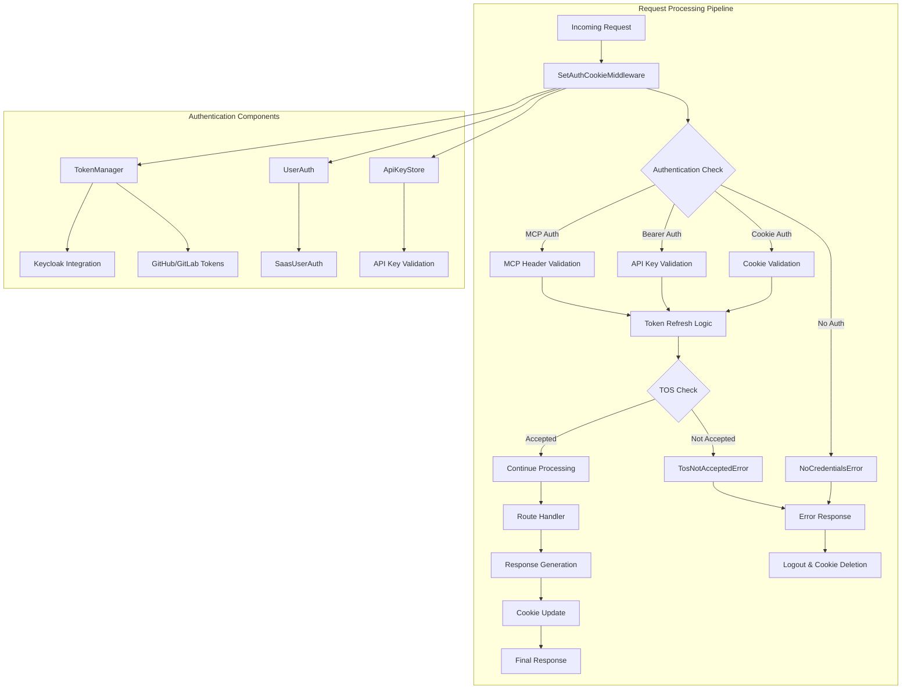
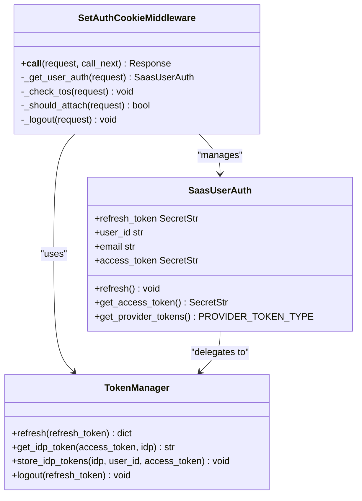
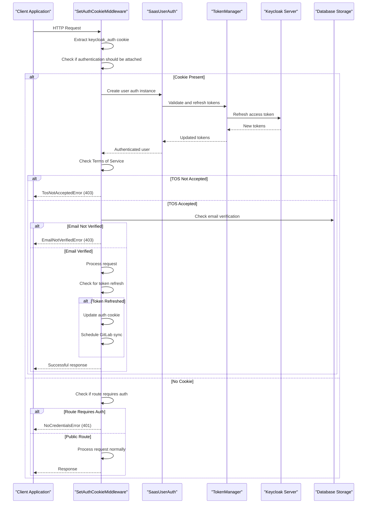
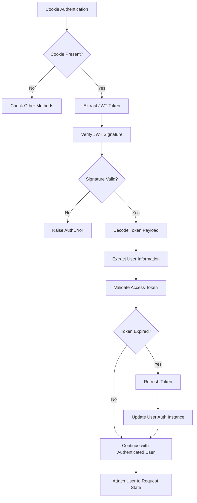
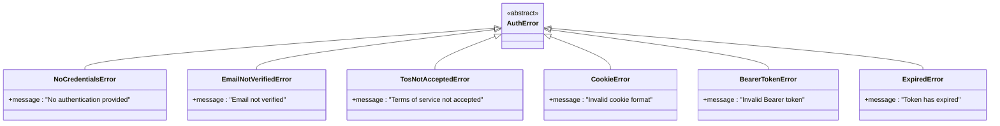
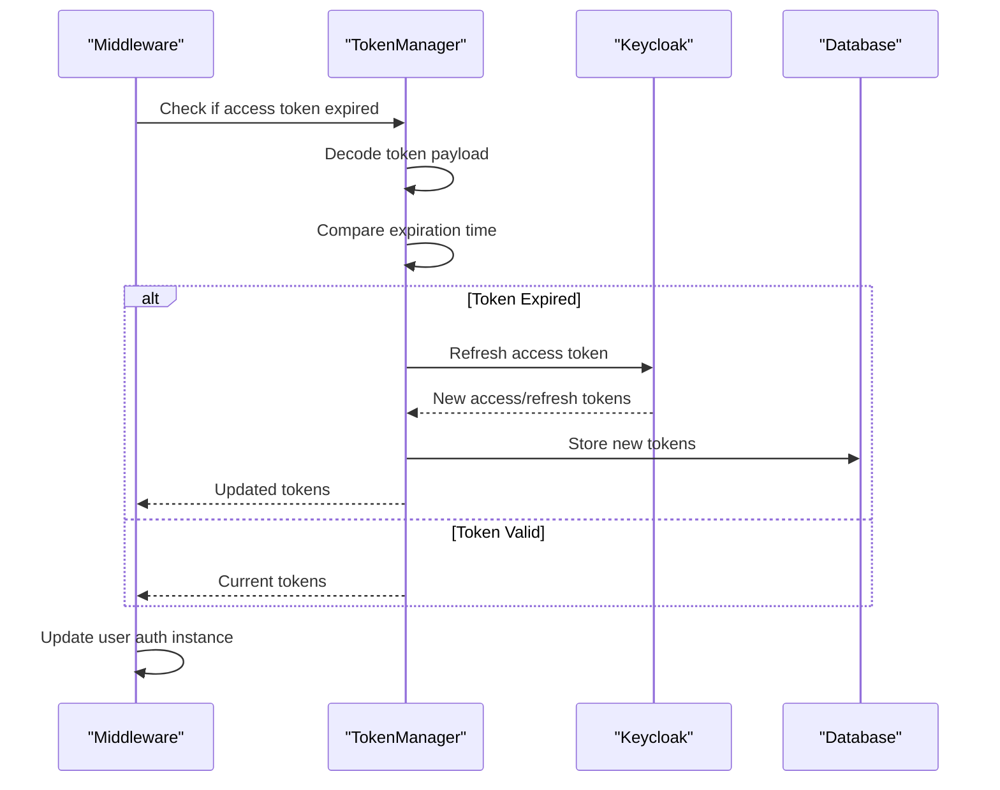

# Request Processing Pipeline

<cite>
**Referenced Files in This Document**
- [enterprise/server/middleware.py](file://enterprise/server/middleware.py)
- [enterprise/server/auth/auth_error.py](file://enterprise/server/auth/auth_error.py)
- [enterprise/server/auth/saas_user_auth.py](file://enterprise/server/auth/saas_user_auth.py)
- [enterprise/server/auth/token_manager.py](file://enterprise/server/auth/token_manager.py)
- [enterprise/server/auth/gitlab_sync.py](file://enterprise/server/auth/gitlab_sync.py)
- [enterprise/server/routes/auth.py](file://enterprise/server/routes/auth.py)
- [enterprise/storage/api_key_store.py](file://enterprise/storage/api_key_store.py)
- [enterprise/server/mcp/mcp_config.py](file://enterprise/server/mcp/mcp_config.py)
- [openhands/server/middleware.py](file://openhands/server/middleware.py)
- [openhands/server/user_auth/user_auth.py](file://openhands/server/user_auth/user_auth.py)
- [enterprise/tests/unit/test_auth_middleware.py](file://enterprise/tests/unit/test_auth_middleware.py)
</cite>

## Table of Contents
1. [Introduction](#introduction)
2. [Architecture Overview](#architecture-overview)
3. [SetAuthCookieMiddleware Core Components](#setauthcookiemiddleware-core-components)
4. [Request Processing Flow](#request-processing-flow)
5. [Authentication Methods](#authentication-methods)
6. [Error Handling and Recovery](#error-handling-and-recovery)
7. [Cookie Management and Security](#cookie-management-and-security)
8. [Integration with Authentication Systems](#integration-with-authentication-systems)
9. [Common Issues and Solutions](#common-issues-and-solutions)
10. [Testing and Validation](#testing-and-validation)

## Introduction

The request processing pipeline in the OpenHands middleware architecture serves as the central authentication and authorization hub for the entire application. At its core lies the `SetAuthCookieMiddleware`, which intercepts all incoming requests, validates authentication credentials, manages cookie state, and ensures proper authorization for both web and API endpoints.

This middleware implements a sophisticated multi-layered authentication system that supports multiple authentication methods including cookie-based authentication, Bearer token authentication, and Model Context Protocol (MCP) header authentication. It seamlessly integrates with Keycloak for identity management, handles token refresh cycles, and maintains secure cookie state across different environments.

## Architecture Overview

The middleware architecture follows a layered approach with clear separation of concerns:

**Diagram sources**
- [enterprise/server/middleware.py](file://enterprise/server/middleware.py#L26-L175)
- [enterprise/server/auth/saas_user_auth.py](file://enterprise/server/auth/saas_user_auth.py#L43-L324)
- [enterprise/server/auth/token_manager.py](file://enterprise/server/auth/token_manager.py#L77-L670)

## SetAuthCookieMiddleware Core Components

The `SetAuthCookieMiddleware` class serves as the primary authentication gateway, implementing several key methods that handle different aspects of the authentication process:

### Middleware Initialization and Configuration

The middleware is initialized with minimal overhead, focusing on efficient request processing:

**Diagram sources**
- [enterprise/server/middleware.py](file://enterprise/server/middleware.py#L26-L175)
- [enterprise/server/auth/saas_user_auth.py](file://enterprise/server/auth/saas_user_auth.py#L43-L324)
- [enterprise/server/auth/token_manager.py](file://enterprise/server/auth/token_manager.py#L77-L670)

### Request Validation Logic

The middleware implements comprehensive request validation through several key methods:

**Section sources**
- [enterprise/server/middleware.py](file://enterprise/server/middleware.py#L26-L175)

## Request Processing Flow

The request processing follows a structured flow that ensures security and proper authentication at each stage:

**Diagram sources**
- [enterprise/server/middleware.py](file://enterprise/server/middleware.py#L32-L98)
- [enterprise/server/auth/saas_user_auth.py](file://enterprise/server/auth/saas_user_auth.py#L207-L225)
- [enterprise/server/auth/token_manager.py](file://enterprise/server/auth/token_manager.py#L594-L609)

### Request Lifecycle Stages

1. **Initial Reception**: The middleware captures the incoming request and extracts the `keycloak_auth` cookie
2. **Authentication Decision**: Determines whether authentication should be applied based on the request path and method
3. **Credential Validation**: Validates authentication credentials using the appropriate method (cookie, Bearer, or MCP)
4. **Token Refresh**: Checks if access tokens need refreshing and performs the refresh operation
5. **Terms of Service Check**: Ensures users have accepted the current Terms of Service
6. **Email Verification**: Validates that user email addresses are verified
7. **Request Processing**: Passes the authenticated request to the next handler
8. **Response Generation**: Updates cookies if tokens were refreshed and generates the final response

**Section sources**
- [enterprise/server/middleware.py](file://enterprise/server/middleware.py#L32-L98)

## Authentication Methods

The middleware supports three primary authentication methods, each with specific use cases and validation logic:

### Cookie-Based Authentication

Cookie authentication is the primary method for web applications, using JWT-signed cookies for state management:

**Diagram sources**
- [enterprise/server/auth/saas_user_auth.py](file://enterprise/server/auth/saas_user_auth.py#L279-L311)
- [enterprise/server/middleware.py](file://enterprise/server/middleware.py#L102-L148)

### Bearer Token Authentication

Bearer token authentication supports API access through HTTP Authorization headers:

**Section sources**
- [enterprise/server/auth/saas_user_auth.py](file://enterprise/server/auth/saas_user_auth.py#L249-L267)
- [enterprise/storage/api_key_store.py](file://enterprise/storage/api_key_store.py#L49-L72)

### MCP Header Authentication

Model Context Protocol authentication uses the `X-Session-API-Key` header for MCP client connections:

**Section sources**
- [enterprise/server/middleware.py](file://enterprise/server/middleware.py#L104-L105)
- [enterprise/server/mcp/mcp_config.py](file://enterprise/server/mcp/mcp_config.py#L40-L54)

## Error Handling and Recovery

The middleware implements comprehensive error handling for various authentication scenarios:

### Authentication Error Types

**Diagram sources**
- [enterprise/server/auth/auth_error.py](file://enterprise/server/auth/auth_error.py#L1-L41)

### Error Response Patterns

The middleware handles different error types with appropriate HTTP status codes and response formats:

**Section sources**
- [enterprise/server/middleware.py](file://enterprise/server/middleware.py#L69-L98)
- [enterprise/tests/unit/test_auth_middleware.py](file://enterprise/tests/unit/test_auth_middleware.py#L136-L236)

## Cookie Management and Security

The middleware implements robust cookie management with security considerations for different environments:

### Cookie Configuration Strategy

| Environment | Secure Flag | SameSite Setting | Domain Configuration |
|-------------|-------------|------------------|---------------------|
| Development (localhost) | False | Lax | No domain restriction |
| Production | True | Strict | Specific domain |
| Staging | True | Lax | Staging subdomain |

**Section sources**
- [enterprise/server/routes/auth.py](file://enterprise/server/routes/auth.py#L42-L76)
- [enterprise/server/routes/auth.py](file://enterprise/server/routes/auth.py#L79-L95)

### Cookie Security Implementation

The middleware dynamically configures cookie security based on the environment:

**Section sources**
- [enterprise/server/routes/auth.py](file://enterprise/server/routes/auth.py#L42-L76)

## Integration with Authentication Systems

### Token Refresh Mechanism

The middleware seamlessly integrates with the token management system to handle automatic token refresh:

**Diagram sources**
- [enterprise/server/auth/saas_user_auth.py](file://enterprise/server/auth/saas_user_auth.py#L70-L78)
- [enterprise/server/auth/token_manager.py](file://enterprise/server/auth/token_manager.py#L594-L609)

### GitLab Repository Synchronization

Upon successful authentication, the middleware schedules background synchronization of GitLab repositories:

**Section sources**
- [enterprise/server/auth/gitlab_sync.py](file://enterprise/server/auth/gitlab_sync.py#L10-L32)
- [enterprise/server/middleware.py](file://enterprise/server/middleware.py#L55-L58)

## Common Issues and Solutions

### Cookie Domain Configuration Issues

**Problem**: Cookies not persisting across subdomains or failing in development environments.

**Solution**: The middleware automatically detects the environment and configures cookie domains accordingly. For development, cookies are set without domain restrictions, while production environments use specific domain configurations.

### SameSite Attribute Conflicts

**Problem**: Browser SameSite attribute conflicts causing authentication failures.

**Solution**: The middleware sets appropriate SameSite values based on the environment - 'lax' for development and staging, 'strict' for production.

### Secure Flag Handling

**Problem**: Mixed content warnings or authentication failures in HTTPS environments.

**Solution**: The middleware automatically enables secure flags in production environments while disabling them in development for local testing.

### Token Expiration Handling

**Problem**: Users experiencing frequent authentication timeouts.

**Solution**: The middleware implements automatic token refresh with exponential backoff and graceful degradation when refresh fails.

**Section sources**
- [enterprise/server/routes/auth.py](file://enterprise/server/routes/auth.py#L79-L95)

## Testing and Validation

The middleware includes comprehensive test coverage for various authentication scenarios:

### Test Coverage Areas

1. **Cookie Authentication Tests**: Validates cookie extraction, JWT decoding, and token refresh
2. **Bearer Token Tests**: Tests API key validation and Bearer token authentication
3. **Error Handling Tests**: Covers all authentication error scenarios
4. **MCP Authentication Tests**: Validates MCP header authentication
5. **Terms of Service Tests**: Tests TOS acceptance validation
6. **Email Verification Tests**: Validates email verification requirements

**Section sources**
- [enterprise/tests/unit/test_auth_middleware.py](file://enterprise/tests/unit/test_auth_middleware.py#L1-L236)

### Testing Patterns

The test suite demonstrates proper middleware testing patterns:

- **Async Testing**: Uses pytest's async capabilities for testing asynchronous middleware
- **Mock Integration**: Employs extensive mocking for external dependencies
- **Error Scenario Testing**: Covers all error paths with appropriate assertions
- **Environment Detection**: Tests cookie configuration across different environments

## Conclusion

The request processing pipeline in the OpenHands middleware architecture provides a robust, secure, and flexible authentication system that supports multiple authentication methods while maintaining high security standards. The `SetAuthCookieMiddleware` serves as the central hub for authentication decisions, seamlessly integrating with Keycloak, managing token lifecycles, and providing comprehensive error handling.

The architecture's strength lies in its modular design, allowing for easy extension and modification while maintaining backward compatibility. The comprehensive error handling ensures graceful degradation when authentication systems encounter issues, and the automated token refresh mechanism provides a seamless user experience.

Future enhancements could include additional authentication providers, enhanced audit logging, and expanded support for federated authentication scenarios. The current architecture provides a solid foundation for these extensions while maintaining the security and reliability that the system currently demonstrates.