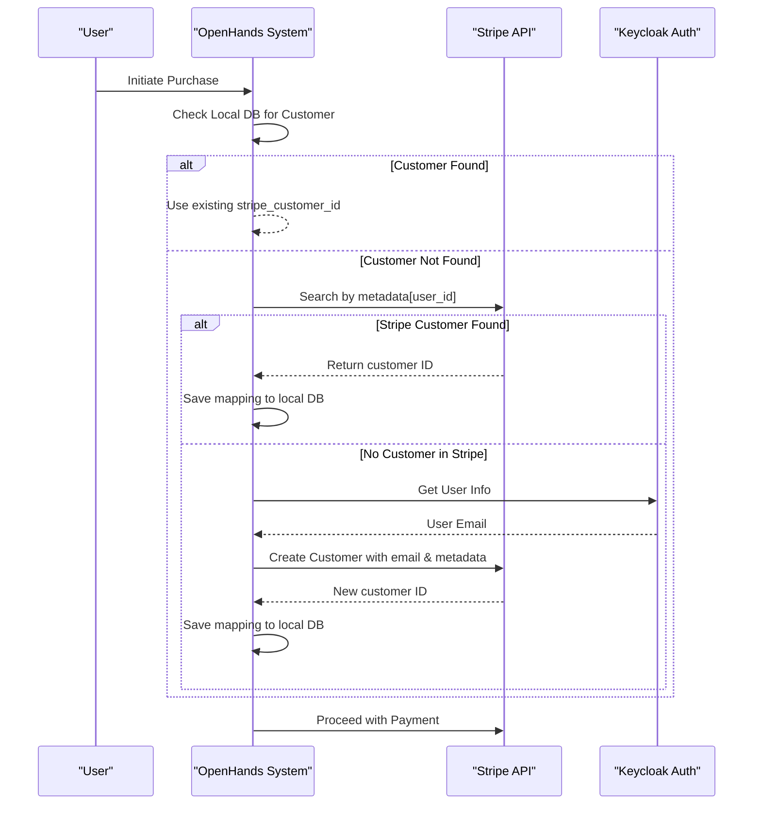
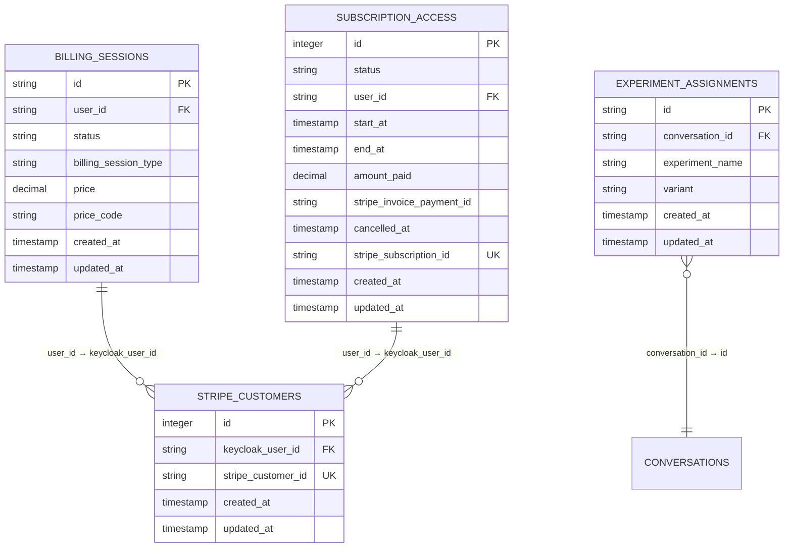

# Billing & Subscription Models

<cite>
**Referenced Files in This Document**   
- [billing_session.py](file://enterprise/storage/billing_session.py)
- [stripe_customer.py](file://enterprise/storage/stripe_customer.py)
- [subscription_access.py](file://enterprise/storage/subscription_access.py)
- [experiment_assignment.py](file://enterprise/storage/experiment_assignment.py)
- [stripe_service.py](file://enterprise/integrations/stripe_service.py)
- [004_create_billing_sessions_table.py](file://enterprise/migrations/versions/004_create_billing_sessions_table.py)
- [073_add_type_to_billing_sessions.py](file://enterprise/migrations/versions/073_add_type_to_billing_sessions.py)
- [017_add_stripe_customers_table.py](file://enterprise/migrations/versions/017_add_stripe_customers_table.py)
- [074_create_subscription_access_table.py](file://enterprise/migrations/versions/074_create_subscription_access_table.py)
- [075_add_cancellation_fields_to_subscription_access.py](file://enterprise/migrations/versions/075_add_cancellation_fields_to_subscription_access.py)
- [061_create_experiment_assignments_table.py](file://enterprise/migrations/versions/061_create_experiment_assignments_table.py)
</cite>

## Table of Contents
1. [Introduction](#introduction)
2. [Core Data Models](#core-data-models)
3. [Billing Session Management](#billing-session-management)
4. [Stripe Customer Integration](#stripe-customer-integration)
5. [Subscription Access Lifecycle](#subscription-access-lifecycle)
6. [Experiment Assignment Tracking](#experiment-assignment-tracking)
7. [Data Relationships and Architecture](#data-relationships-and-architecture)
8. [Common Queries and Analytics](#common-queries-and-analytics)
9. [Compliance and Data Accuracy](#compliance-and-data-accuracy)

## Introduction
This document provides comprehensive documentation for the billing and subscription models within the OpenHands enterprise application. It details the core data models—BillingSession, StripeCustomer, SubscriptionAccess, and ExperimentAssignment—along with their field definitions, data types, constraints, and relationships. The system integrates with Stripe for payment processing and customer management, ensuring accurate tracking of financial transactions and subscription status. Additionally, it supports A/B testing through experiment assignment tracking. This documentation covers model structures, lifecycle management, integration patterns, and compliance considerations essential for maintaining financial data integrity and supporting business operations.

## Core Data Models

### BillingSession Model
The `BillingSession` model represents a Stripe billing session used for credit purchases or subscription setup. It tracks the status of payment transactions and associated user information.

**Field Definitions:**
- `id`: String (Primary Key) - Unique identifier for the billing session
- `user_id`: String (Required) - Identifier of the user initiating the session
- `status`: Enum ['in_progress', 'completed', 'cancelled', 'error'] (Required) - Current state of the billing session
- `billing_session_type`: Enum ['DIRECT_PAYMENT', 'MONTHLY_SUBSCRIPTION'] (Required) - Classification of the billing session purpose
- `price`: DECIMAL(19,4) (Required) - Monetary amount associated with the session
- `price_code`: String (Required) - Identifier for the pricing plan or product
- `created_at`: DateTime (Timezone-aware) - Timestamp when the record was created
- `updated_at`: DateTime (Timezone-aware) - Timestamp when the record was last modified

**Constraints:**
- Primary key on `id`
- Status enum constraint named `billing_session_status_enum`
- Session type enum constraint named `billing_session_type_enum`
- Indexes on status and user_id for query optimization

**Section sources**
- [billing_session.py](file://enterprise/storage/billing_session.py#L7-L46)
- [004_create_billing_sessions_table.py](file://enterprise/migrations/versions/004_create_billing_sessions_table.py#L22-L42)
- [073_add_type_to_billing_sessions.py](file://enterprise/migrations/versions/073_add_type_to_billing_sessions.py)

### StripeCustomer Model
The `StripeCustomer` model maintains a local record of Stripe customer information, addressing consistency issues with Stripe's search API which may have up to an hour delay in data propagation.

**Field Definitions:**
- `id`: Integer (Primary Key, Auto-increment) - Internal database identifier
- `keycloak_user_id`: String (Required) - Reference to the user in the authentication system
- `stripe_customer_id`: String (Required) - Corresponding customer ID in Stripe
- `created_at`: DateTime - Timestamp when the record was created
- `updated_at`: DateTime - Timestamp when the record was last modified

**Constraints:**
- Primary key on `id`
- Unique constraints enforced through application logic
- Indexes on `keycloak_user_id` and `stripe_customer_id` for fast lookups

**Section sources**
- [stripe_customer.py](file://enterprise/storage/stripe_customer.py#L5-L26)
- [017_add_stripe_customers_table.py](file://enterprise/migrations/versions/017_add_stripe_customers_table.py#L23-L51)

### SubscriptionAccess Model
The `SubscriptionAccess` model tracks a user's subscription status, duration, payment details, and cancellation information.

**Field Definitions:**
- `id`: Integer (Primary Key, Auto-increment) - Internal identifier
- `status`: Enum ['ACTIVE', 'DISABLED'] (Required) - Current subscription status
- `user_id`: String (Required) - Identifier of the subscribed user
- `start_at`: DateTime (Timezone-aware, Nullable) - When the subscription became active
- `end_at`: DateTime (Timezone-aware, Nullable) - When the subscription expires
- `amount_paid`: DECIMAL(19,4) (Nullable) - Total amount paid for this subscription period
- `stripe_invoice_payment_id`: String (Required) - Reference to the Stripe invoice payment
- `cancelled_at`: DateTime (Timezone-aware, Nullable) - When the subscription was cancelled
- `stripe_subscription_id`: String (Nullable, Indexed) - Reference to the Stripe subscription object
- `created_at`: DateTime (Timezone-aware, Required) - Record creation timestamp
- `updated_at`: DateTime (Timezone-aware, Required) - Record modification timestamp

**Constraints:**
- Primary key on `id`
- Status enum constraint named `subscription_access_status_enum`
- Indexes on `status`, `user_id`, and `stripe_subscription_id`
- Unique constraints managed at application level

**Section sources**
- [subscription_access.py](file://enterprise/storage/subscription_access.py#L7-L46)
- [074_create_subscription_access_table.py](file://enterprise/migrations/versions/074_create_subscription_access_table.py#L28-L45)
- [075_add_cancellation_fields_to_subscription_access.py](file://enterprise/migrations/versions/075_add_cancellation_fields_to_subscription_access.py)

### ExperimentAssignment Model
The `ExperimentAssignment` model tracks which experiments a conversation is assigned to and the variant received from feature flags.

**Field Definitions:**
- `id`: String (Primary Key) - Unique identifier (UUID)
- `conversation_id`: String (Nullable, Indexed) - Identifier of the associated conversation
- `experiment_name`: String (Required) - Name of the experiment
- `variant`: String (Required) - Assigned variant (e.g., 'control', 'treatment')
- `created_at`: DateTime (Timezone-aware, Required) - Assignment creation timestamp
- `updated_at`: DateTime (Timezone-aware, Required) - Last modification timestamp

**Constraints:**
- Primary key on `id`
- Unique constraint on the combination of `conversation_id` and `experiment_name`
- Index on `conversation_id` for efficient querying

**Section sources**
- [experiment_assignment.py](file://enterprise/storage/experiment_assignment.py#L15-L42)
- [061_create_experiment_assignments_table.py](file://enterprise/migrations/versions/061_create_experiment_assignments_table.py#L24-L37)

## Billing Session Management

### Type Classification and Lifecycle
Billing sessions are classified into two types: `DIRECT_PAYMENT` for one-time credit purchases and `MONTHLY_SUBSCRIPTION` for recurring subscription setup. The system tracks the complete lifecycle of each session through four possible statuses:
- `in_progress`: Initial state when a session is created
- `completed`: Successful completion of payment processing
- `cancelled`: User or system-initiated cancellation
- `error`: Failure during payment processing

Each billing session is associated with a specific user and contains pricing information including the monetary amount and price code. The session records creation and update timestamps to track temporal aspects of the transaction.

### Cost Tracking and User Activity
The billing session serves as a bridge between user activities and financial transactions. When a user initiates a purchase (either direct credits or subscription), a billing session is created with their user ID. This establishes a direct link between user actions and payment events. The price and price_code fields capture the specific financial details of the transaction, enabling accurate cost tracking and reporting.

**Section sources**
- [billing_session.py](file://enterprise/storage/billing_session.py#L7-L46)
- [004_create_billing_sessions_table.py](file://enterprise/migrations/versions/004_create_billing_sessions_table.py#L22-L42)
- [073_add_type_to_billing_sessions.py](file://enterprise/migrations/versions/073_add_type_to_billing_sessions.py)

## Stripe Customer Integration

### Customer Management Workflow
The integration with Stripe follows a hybrid approach where customer records are maintained both locally and in Stripe. The `find_or_create_customer` function implements the following workflow:
1. First attempts to find an existing customer in the local database by user ID
2. If not found, searches Stripe's API using metadata filters
3. If still not found, creates a new customer in Stripe and saves the mapping locally

This approach ensures data consistency while working around Stripe's eventual consistency model for search operations.

### Payment Method Verification
The system can verify whether a user has a payment method on file through the `has_payment_method` function. This checks the associated Stripe customer for any stored payment methods, which is essential for determining if a user can make purchases or maintain an active subscription.

### Data Synchronization
Customer data synchronization occurs in both directions:
- Outbound: When a new customer is created in Stripe, the mapping is saved locally
- Inbound: User email and metadata are pulled from Keycloak when creating a Stripe customer

The local `StripeCustomer` table serves as the authoritative source for customer mappings, with Stripe serving as the source of truth for payment details.



**Diagram sources**
- [stripe_service.py](file://enterprise/integrations/stripe_service.py#L11-L74)
- [stripe_customer.py](file://enterprise/storage/stripe_customer.py#L5-L26)

**Section sources**
- [stripe_service.py](file://enterprise/integrations/stripe_service.py#L11-L74)
- [stripe_customer.py](file://enterprise/storage/stripe_customer.py#L5-L26)

## Subscription Access Lifecycle

### Status Management
Subscription access is tracked through two primary statuses:
- `ACTIVE`: User has full access to subscription benefits
- `DISABLED`: Subscription is inactive (due to cancellation, payment failure, etc.)

The status field is indexed for efficient querying of active subscriptions across the user base.

### Lifecycle Transitions
The subscription lifecycle follows a defined pattern:
1. **Creation**: When a user subscribes, a new `SubscriptionAccess` record is created with status `ACTIVE`
2. **Active Period**: The subscription remains active between `start_at` and `end_at` dates
3. **Cancellation**: When cancelled, `cancelled_at` is set and status may transition to `DISABLED`
4. **Expiration**: After `end_at`, the subscription becomes inactive

The system maintains references to Stripe entities (`stripe_subscription_id` and `stripe_invoice_payment_id`) to synchronize state with the payment provider.

### Duration and Payment Tracking
Each subscription record captures the temporal aspects of the subscription:
- `start_at` and `end_at` define the active period
- `amount_paid` records the financial value of the subscription
- `created_at` and `updated_at` track record lifecycle

This information enables accurate revenue recognition and subscription analytics.

**Section sources**
- [subscription_access.py](file://enterprise/storage/subscription_access.py#L7-L46)
- [074_create_subscription_access_table.py](file://enterprise/migrations/versions/074_create_subscription_access_table.py#L28-L45)
- [075_add_cancellation_fields_to_subscription_access.py](file://enterprise/migrations/versions/075_add_cancellation_fields_to_subscription_access.py)

## Experiment Assignment Tracking

### A/B Testing Framework
The experiment assignment system enables A/B testing and feature rollouts by tracking which variants users receive. Each assignment links a conversation to an experiment name and variant, allowing analysis of feature performance at the conversation level.

### Data Model Constraints
The model enforces data integrity through:
- A unique constraint on the combination of `conversation_id` and `experiment_name`, preventing duplicate assignments
- An index on `conversation_id` for efficient retrieval of all experiments for a given conversation
- UUID-based primary keys for global uniqueness

### Use Cases
This system supports:
- Feature flag rollouts with controlled variants
- A/B testing of different UI or behavior patterns
- Gradual feature releases to user segments
- Performance comparison between experimental variants

The temporal fields (`created_at`, `updated_at`) enable cohort analysis and time-based experimentation.

**Section sources**
- [experiment_assignment.py](file://enterprise/storage/experiment_assignment.py#L15-L42)
- [061_create_experiment_assignments_table.py](file://enterprise/migrations/versions/061_create_experiment_assignments_table.py#L24-L37)

## Data Relationships and Architecture



**Diagram sources**
- [billing_session.py](file://enterprise/storage/billing_session.py#L7-L46)
- [stripe_customer.py](file://enterprise/storage/stripe_customer.py#L5-L26)
- [subscription_access.py](file://enterprise/storage/subscription_access.py#L7-L46)
- [experiment_assignment.py](file://enterprise/storage/experiment_assignment.py#L15-L42)

**Section sources**
- [billing_session.py](file://enterprise/storage/billing_session.py#L7-L46)
- [stripe_customer.py](file://enterprise/storage/stripe_customer.py#L5-L26)
- [subscription_access.py](file://enterprise/storage/subscription_access.py#L7-L46)
- [experiment_assignment.py](file://enterprise/storage/experiment_assignment.py#L15-L42)

## Common Queries and Analytics

### Billing Analytics Queries
**Revenue by Period:**
```sql
SELECT 
    DATE_TRUNC('month', created_at) as month,
    SUM(price) as monthly_revenue
FROM billing_sessions 
WHERE status = 'completed'
GROUP BY month 
ORDER BY month;
```

**Active Subscriptions Count:**
```sql
SELECT COUNT(*) as active_subscriptions
FROM subscription_access 
WHERE status = 'ACTIVE' 
    AND end_at > NOW();
```

### Subscription Status Checks
**User Subscription Status:**
```sql
SELECT status, start_at, end_at, amount_paid
FROM subscription_access 
WHERE user_id = :user_id 
ORDER BY created_at DESC 
LIMIT 1;
```

**Recent Billing Sessions:**
```sql
SELECT id, status, price, price_code, created_at
FROM billing_sessions 
WHERE user_id = :user_id 
ORDER BY created_at DESC 
LIMIT 10;
```

### Experiment Analysis Queries
**Variant Distribution:**
```sql
SELECT experiment_name, variant, COUNT(*) as count
FROM experiment_assignments 
GROUP BY experiment_name, variant;
```

**Conversion Rates by Variant:**
```sql
SELECT 
    ea.variant,
    COUNT(*) as assignments,
    COUNT(sa.id) as subscriptions,
    COUNT(sa.id)::FLOAT / COUNT(*) as conversion_rate
FROM experiment_assignments ea
LEFT JOIN subscription_access sa ON ea.user_id = sa.user_id
WHERE ea.experiment_name = :experiment_name
GROUP BY ea.variant;
```

**Section sources**
- [billing_session.py](file://enterprise/storage/billing_session.py#L7-L46)
- [subscription_access.py](file://enterprise/storage/subscription_access.py#L7-L46)
- [experiment_assignment.py](file://enterprise/storage/experiment_assignment.py#L15-L42)

## Compliance and Data Accuracy

### Financial Data Integrity
The system ensures data accuracy for financial records through:
- Atomic database transactions for critical operations
- Redundant storage of Stripe identifiers to prevent data loss
- Timestamp tracking for audit trails
- Consistent use of DECIMAL type for monetary values to avoid floating-point errors

### Payment Data Security
Compliance considerations include:
- Minimal local storage of payment information (only customer and subscription IDs)
- Reliance on Stripe for sensitive payment data storage
- Local customer table serves only as a mapping between internal users and Stripe customers
- Regular synchronization to maintain consistency between systems

### Audit and Monitoring
The comprehensive timestamp fields (`created_at`, `updated_at`) across all models enable:
- Full audit trails for financial transactions
- Monitoring of subscription lifecycle events
- Detection of anomalies in billing patterns
- Support for financial reporting and reconciliation

**Section sources**
- [billing_session.py](file://enterprise/storage/billing_session.py#L7-L46)
- [stripe_customer.py](file://enterprise/storage/stripe_customer.py#L5-L26)
- [subscription_access.py](file://enterprise/storage/subscription_access.py#L7-L46)
- [stripe_service.py](file://enterprise/integrations/stripe_service.py#L11-L74)