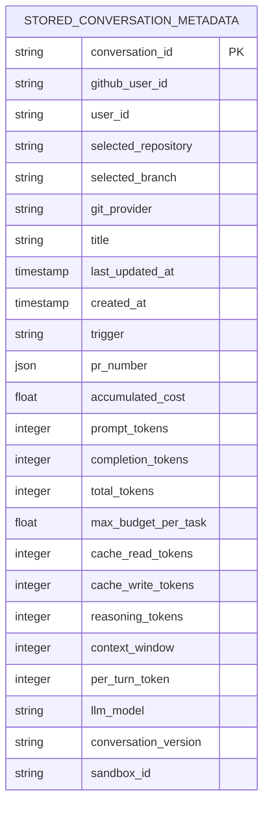
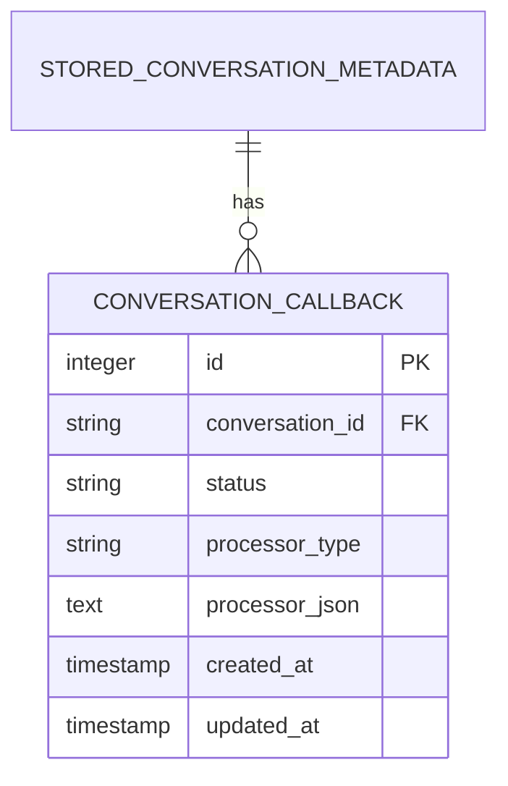
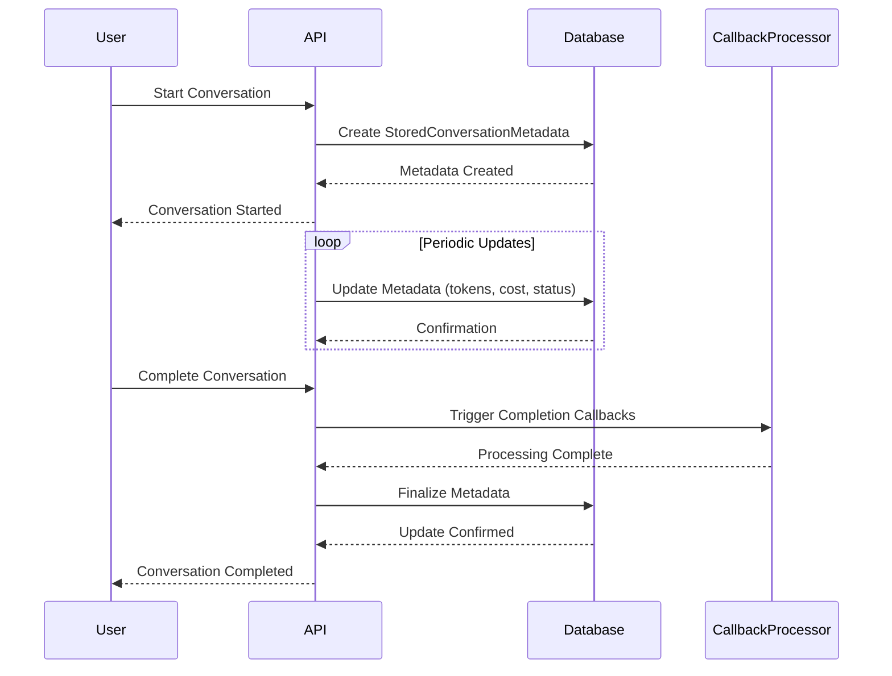
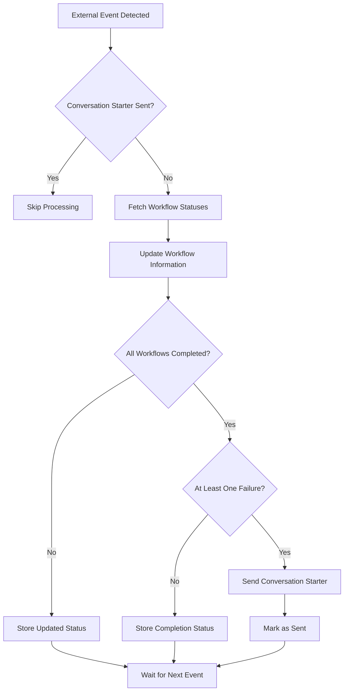
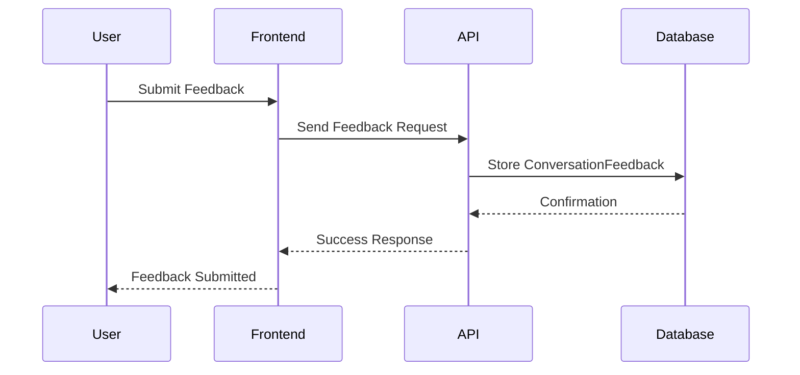
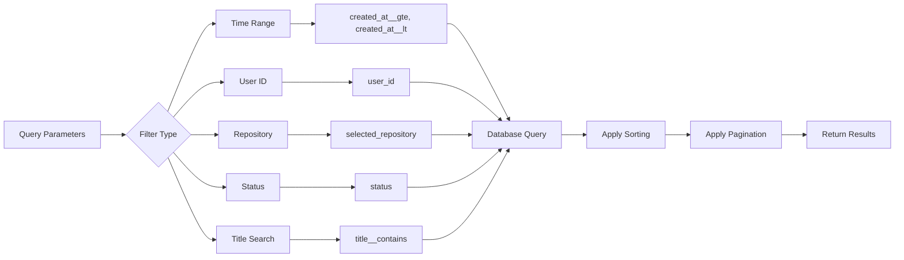
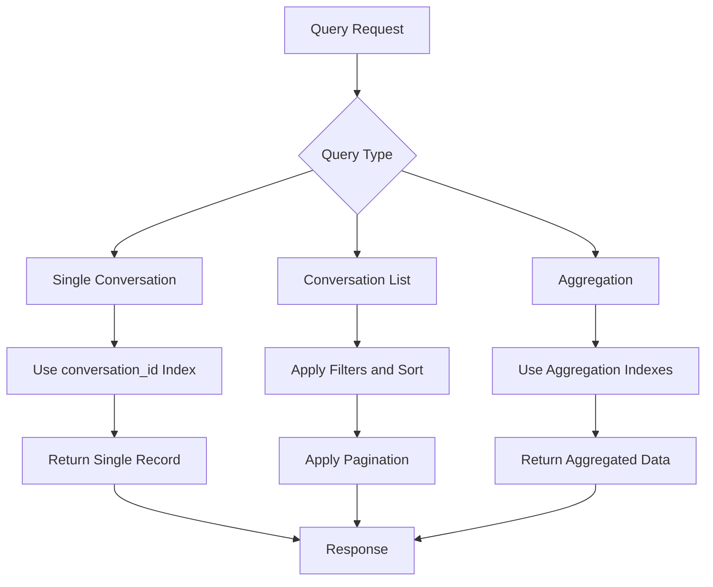
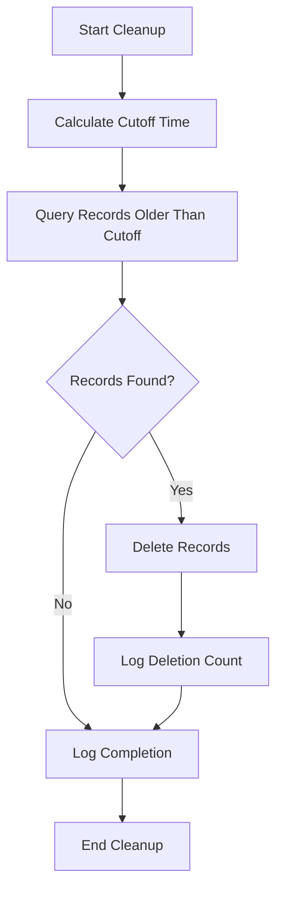

# Conversation & Session Models

<cite>
**Referenced Files in This Document**   
- [stored_conversation_metadata.py](file://enterprise/storage/stored_conversation_metadata.py)
- [conversation_callback.py](file://enterprise/storage/conversation_callback.py)
- [conversation_work.py](file://enterprise/storage/conversation_work.py)
- [feedback.py](file://enterprise/storage/feedback.py)
- [proactive_convos.py](file://enterprise/storage/proactive_convos.py)
- [proactive_conversation_store.py](file://enterprise/storage/proactive_conversation_store.py)
- [sql_app_conversation_info_service.py](file://openhands/app_server/app_conversation/sql_app_conversation_info_service.py)
</cite>

## Table of Contents
1. [Introduction](#introduction)
2. [Core Data Models](#core-data-models)
3. [Conversation Lifecycle](#conversation-lifecycle)
4. [Proactive Conversation Starters](#proactive-conversation-starters)
5. [Feedback System](#feedback-system)
6. [Data Access Patterns](#data-access-patterns)
7. [Performance Considerations](#performance-considerations)
8. [Data Retention Policies](#data-retention-policies)
9. [Analytics and Reporting](#analytics-and-reporting)

## Introduction
This document provides comprehensive documentation for the conversation and session management entities in the OpenHands system. It details the data models used to track conversations, callbacks, work metrics, and user feedback. The system is designed to manage the complete lifecycle of conversations from creation to completion, with robust tracking of metadata, processing callbacks, and performance metrics. The documentation covers the structure of key entities, their relationships, and the operational workflows that govern conversation management.

## Core Data Models

### StoredConversationMetadata
The StoredConversationMetadata model serves as the primary entity for tracking conversation metadata throughout its lifecycle. This model captures essential information about each conversation, including user context, repository details, and performance metrics.



**Diagram sources**
- [sql_app_conversation_info_service.py](file://openhands/app_server/app_conversation/sql_app_conversation_info_service.py#L54-L89)

**Section sources**
- [stored_conversation_metadata.py](file://enterprise/storage/stored_conversation_metadata.py)
- [sql_app_conversation_info_service.py](file://openhands/app_server/app_conversation/sql_app_conversation_info_service.py#L54-L89)

### ConversationCallback
The ConversationCallback model manages callback processing for conversations. It enables the system to trigger specific actions when events occur during a conversation's lifecycle, such as integration with external services or notification processing.



**Diagram sources**
- [conversation_callback.py](file://enterprise/storage/conversation_callback.py#L56-L85)

**Section sources**
- [conversation_callback.py](file://enterprise/storage/conversation_callback.py)

### ConversationWork
The ConversationWork model tracks the time and effort metrics associated with conversations. It provides a mechanism for measuring the duration and resource consumption of conversation processing.

```mermaid
erDiagram
CONVERSATION_WORK {
integer id PK
string conversation_id
string user_id
float seconds
string created_at
string updated_at
}
INDEX ix_conversation_work_user_conversation(user_id, conversation_id)
```

**Diagram sources**
- [conversation_work.py](file://enterprise/storage/conversation_work.py#L7-L27)

**Section sources**
- [conversation_work.py](file://enterprise/storage/conversation_work.py)

### Feedback
The Feedback model captures user feedback associated with specific conversations. It enables the system to collect and store user ratings, comments, and other feedback data for quality assessment and improvement.

```mermaid
erDiagram
CONVERSATION_FEEDBACK {
integer id PK
string conversation_id
integer event_id
integer rating
text reason
timestamp created_at
}
INDEX ix_conversation_feedback_conversation_id(conversation_id)
```

**Diagram sources**
- [feedback.py](file://enterprise/storage/feedback.py#L21-L29)

**Section sources**
- [feedback.py](file://enterprise/storage/feedback.py)

## Conversation Lifecycle

### Creation to Completion Workflow
The conversation lifecycle begins with creation and progresses through various stages until completion. The StoredConversationMetadata model is created when a conversation is initiated, capturing essential context such as the user ID, repository selection, and initial configuration.



**Diagram sources**
- [stored_conversation_metadata.py](file://enterprise/storage/stored_conversation_metadata.py)
- [conversation_callback.py](file://enterprise/storage/conversation_callback.py)

**Section sources**
- [stored_conversation_metadata.py](file://enterprise/storage/stored_conversation_metadata.py)
- [conversation_callback.py](file://enterprise/storage/conversation_callback.py)

### Metadata Tracking
The system tracks comprehensive metadata throughout the conversation lifecycle. Key metrics include token usage (prompt, completion, cache, reasoning), cost accumulation, and LLM model information. The metadata is updated in real-time as the conversation progresses, with timestamps for creation and last update to enable temporal analysis.

The trigger field in StoredConversationMetadata indicates what initiated the conversation, such as a user action, scheduled task, or external event. This information is crucial for understanding conversation patterns and optimizing user experience.

## Proactive Conversation Starters

### Storage and Management
Proactive conversation starters are managed through the ProactiveConversation model, which tracks information about potential conversations initiated based on external events such as pull requests or workflow runs.

```mermaid
erDiagram
PROACTIVE_CONVERSATION {
integer id PK
string repo_id
integer pr_number
json workflow_runs
string commit
boolean conversation_starter_sent
timestamp last_updated_at
}
INDEX ix_proactive_conversation_repo_pr(repo_id, pr_number)
```

**Diagram sources**
- [proactive_convos.py](file://enterprise/storage/proactive_convos.py#L7-L19)

**Section sources**
- [proactive_convos.py](file://enterprise/storage/proactive_convos.py)
- [proactive_conversation_store.py](file://enterprise/storage/proactive_conversation_store.py)

### Processing Workflow
The proactive conversation system follows a specific workflow for identifying and managing potential conversations:



**Diagram sources**
- [proactive_conversation_store.py](file://enterprise/storage/proactive_conversation_store.py#L28-L131)

**Section sources**
- [proactive_conversation_store.py](file://enterprise/storage/proactive_conversation_store.py)

## Feedback System

### Feedback Collection Architecture
The feedback system is designed to collect user input on conversation quality and performance. The ConversationFeedback model stores ratings (1-5 scale), optional reasons for the rating, and timestamps for analysis.



**Diagram sources**
- [feedback.py](file://enterprise/storage/feedback.py)
- [enterprise/server/routes/feedback.py](file://enterprise/server/routes/feedback.py#L66-L71)

**Section sources**
- [feedback.py](file://enterprise/storage/feedback.py)
- [enterprise/server/routes/feedback.py](file://enterprise/server/routes/feedback.py)

### Feedback Association
User feedback is directly associated with specific conversations through the conversation_id field. This enables detailed analysis of conversation quality and performance. The optional event_id field allows feedback to be linked to specific events within a conversation, providing granular insights into user experience.

## Data Access Patterns

### Conversation History Retrieval
The system supports efficient retrieval of conversation history through multiple access patterns:



**Diagram sources**
- [sql_app_conversation_info_service.py](file://openhands/app_server/app_conversation/sql_app_conversation_info_service.py#L103-L169)

**Section sources**
- [sql_app_conversation_info_service.py](file://openhands/app_server/app_conversation/sql_app_conversation_info_service.py)

### Query Optimization
The system implements several optimization techniques for efficient data retrieval:

- Indexing on frequently queried fields (conversation_id, user_id, created_at)
- Composite indexes for multi-field queries
- Pagination with cursor-based navigation
- Selective field retrieval to minimize data transfer
- Caching of frequently accessed conversation metadata

## Performance Considerations

### Large Data Volume Querying
When querying large volumes of conversation data, the system employs several performance optimization strategies:

- **Pagination**: Results are returned in pages with a default limit of 100 items, with the ability to specify page size and offset
- **Indexing**: Critical fields are indexed to accelerate query performance
- **Selective Loading**: Only required fields are retrieved based on the query context
- **Asynchronous Processing**: Database operations are performed asynchronously to prevent blocking

The system also implements query optimization for specific use cases:



**Section sources**
- [sql_app_conversation_info_service.py](file://openhands/app_server/app_conversation/sql_app_conversation_info_service.py)

## Data Retention Policies

### Conversation Records
Conversation records are retained according to the following policy:

- **Active Conversations**: Retained indefinitely while active
- **Completed Conversations**: Retained for a configurable period (default: 90 days)
- **Archived Conversations**: Moved to cold storage after 30 days of inactivity
- **Deleted Conversations**: Soft-deleted with metadata retained for audit purposes

### Feedback Data
Feedback data retention follows a separate policy:

- **User Feedback**: Retained for 180 days from submission
- **Aggregated Analytics**: Retained indefinitely for trend analysis
- **Raw Trajectories**: Retained for 30 days, then anonymized and aggregated

### Proactive Conversation Data
Proactive conversation data has a short retention period:

- **Workflow Information**: Retained for 30 minutes after last update
- **Sent Status**: Retained for 7 days to prevent duplicate notifications
- **Historical Patterns**: Aggregated and retained for 90 days

The system includes a cleanup process that automatically removes expired proactive conversation records:



**Diagram sources**
- [proactive_conversation_store.py](file://enterprise/storage/proactive_conversation_store.py#L133-L157)

**Section sources**
- [proactive_conversation_store.py](file://enterprise/storage/proactive_conversation_store.py)
- [clean_proactive_convo_table.py](file://enterprise/sync/clean_proactive_convo_table.py)

## Analytics and Reporting

### Common Query Examples
The system supports various analytics queries for monitoring and reporting:

**Conversation Volume by Day**
```sql
SELECT 
    DATE(created_at) as date,
    COUNT(*) as conversation_count,
    AVG(seconds) as avg_duration
FROM conversation_work 
WHERE created_at >= NOW() - INTERVAL '30 days'
GROUP BY DATE(created_at)
ORDER BY date;
```

**User Engagement Metrics**
```sql
SELECT 
    user_id,
    COUNT(*) as total_conversations,
    SUM(seconds) as total_time_spent,
    AVG(rating) as avg_feedback_rating
FROM conversation_work cw
LEFT JOIN conversation_feedback cf ON cw.conversation_id = cf.conversation_id
GROUP BY user_id
ORDER BY total_conversations DESC;
```

**Repository Activity Analysis**
```sql
SELECT 
    selected_repository,
    COUNT(*) as conversation_count,
    SUM(accumulated_cost) as total_cost,
    AVG(total_tokens) as avg_tokens
FROM stored_conversation_metadata
WHERE created_at >= NOW() - INTERVAL '7 days'
GROUP BY selected_repository
ORDER BY conversation_count DESC;
```

**LLM Model Performance**
```sql
SELECT 
    llm_model,
    COUNT(*) as usage_count,
    AVG(accumulated_cost) as avg_cost,
    AVG(total_tokens) as avg_tokens,
    AVG(prompt_tokens) as avg_prompt_tokens,
    AVG(completion_tokens) as avg_completion_tokens
FROM stored_conversation_metadata
WHERE llm_model IS NOT NULL
GROUP BY llm_model;
```

These queries enable comprehensive analysis of system usage, user engagement, and performance metrics, supporting data-driven decision making and optimization.

**Section sources**
- [stored_conversation_metadata.py](file://enterprise/storage/stored_conversation_metadata.py)
- [conversation_work.py](file://enterprise/storage/conversation_work.py)
- [feedback.py](file://enterprise/storage/feedback.py)