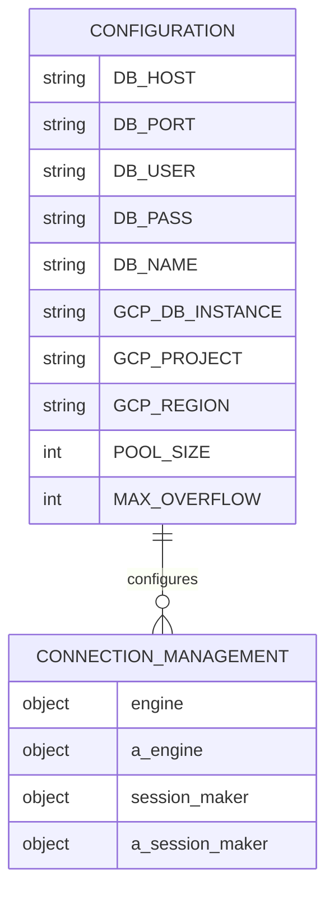
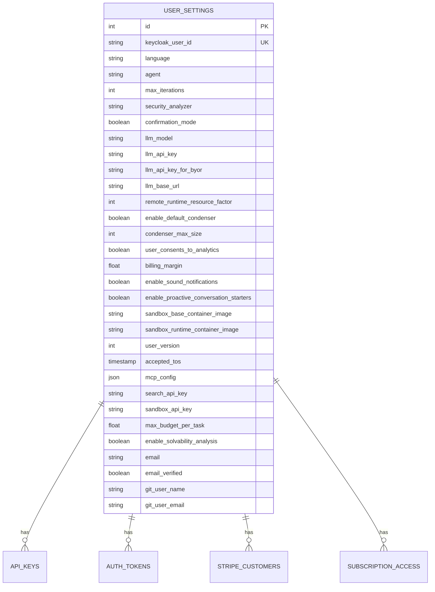
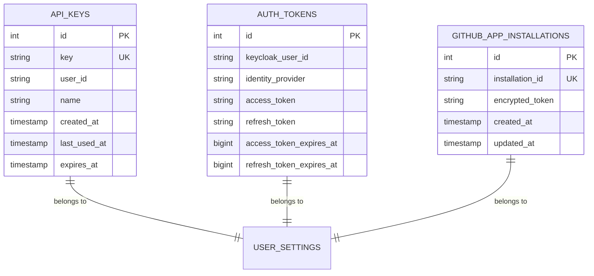
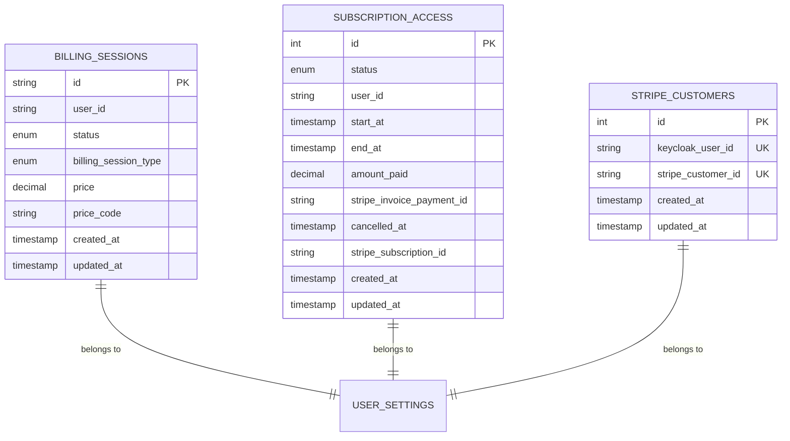
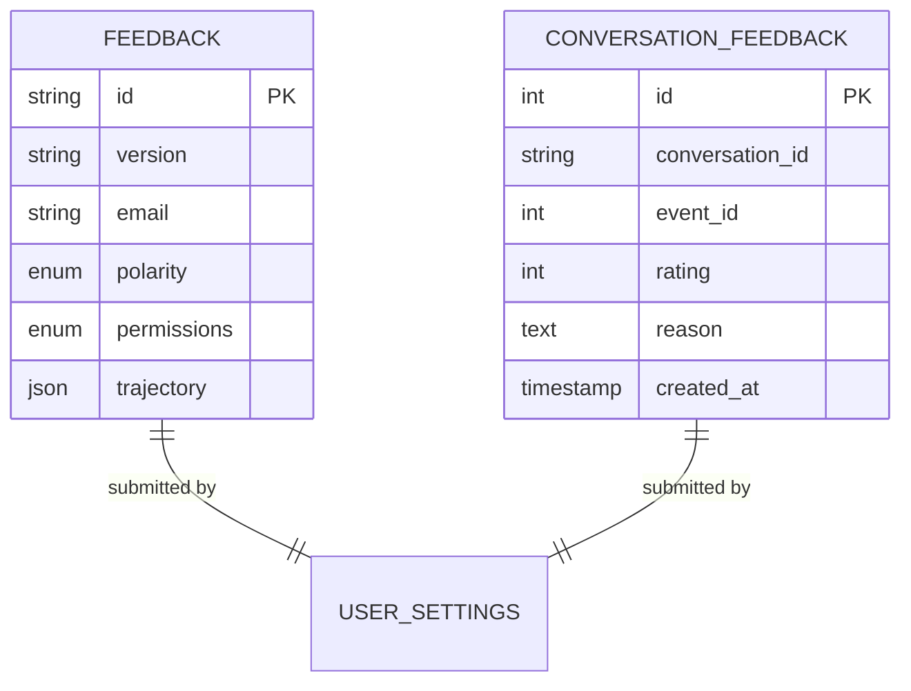
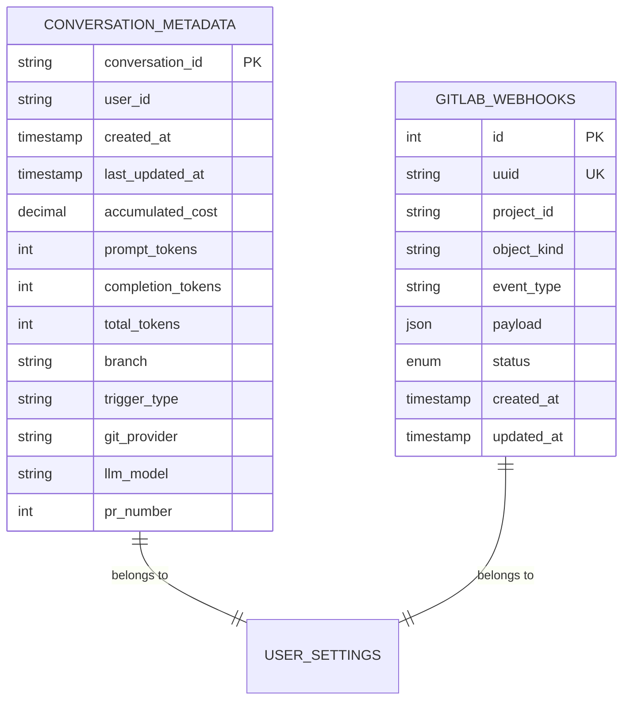
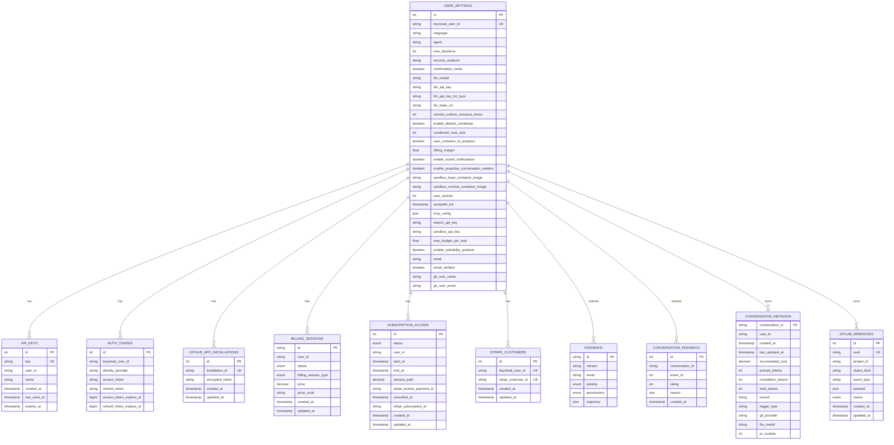
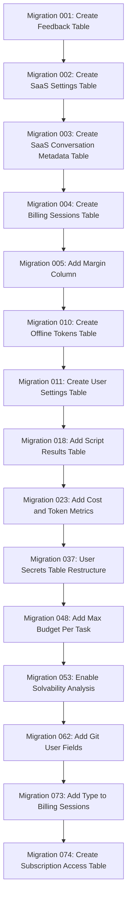

# Data Models & ORM Mapping

<cite>
**Referenced Files in This Document**   
- [api_key.py](file://enterprise/storage/api_key.py)
- [auth_tokens.py](file://enterprise/storage/auth_tokens.py)
- [billing_session.py](file://enterprise/storage/billing_session.py)
- [feedback.py](file://enterprise/storage/feedback.py)
- [github_app_installation.py](file://enterprise/storage/github_app_installation.py)
- [gitlab_webhook.py](file://enterprise/storage/gitlab_webhook.py)
- [stored_conversation_metadata.py](file://enterprise/storage/stored_conversation_metadata.py)
- [stored_settings.py](file://enterprise/storage/stored_settings.py)
- [stripe_customer.py](file://enterprise/storage/stripe_customer.py)
- [subscription_access.py](file://enterprise/storage/subscription_access.py)
- [user_settings.py](file://enterprise/storage/user_settings.py)
- [database.py](file://enterprise/storage/database.py)
- [base.py](file://enterprise/storage/base.py)
- [004_create_billing_sessions_table.py](file://enterprise/migrations/versions/004_create_billing_sessions_table.py)
- [018_add_script_results_table.py](file://enterprise/migrations/versions/018_add_script_results_table.py)
- [023_add_cost_and_token_metrics_columns.py](file://enterprise/migrations/versions/023_add_cost_and_token_metrics_columns.py)
- [037_make_user_secrets_table_one_row_per_secret.py](file://enterprise/migrations/versions/037_make_user_secrets_table_one_row_per_secret.py)
- [048_add_max_budget_per_task_to_user_settings.py](file://enterprise/migrations/versions/048_add_max_budget_per_task_to_user_settings.py)
- [053_add_enable_solvability_analysis_to_user_settings.py](file://enterprise/migrations/versions/053_add_enable_solvability_analysis_to_user_settings.py)
- [062_add_git_user_fields_to_user_settings.py](file://enterprise/migrations/versions/062_add_git_user_fields_to_user_settings.py)
- [073_add_type_to_billing_sessions.py](file://enterprise/migrations/versions/073_add_type_to_billing_sessions.py)
- [env.py](file://enterprise/migrations/env.py)
</cite>

## Table of Contents
1. [Introduction](#introduction)
2. [Database Configuration & Connection Management](#database-configuration--connection-management)
3. [Core Data Models](#core-data-models)
4. [Entity Relationship Diagram](#entity-relationship-diagram)
5. [Schema Evolution & Migration History](#schema-evolution--migration-history)
6. [Data Validation & Business Logic](#data-validation--business-logic)
7. [Data Access Patterns & Performance](#data-access-patterns--performance)
8. [Data Lifecycle & Security](#data-lifecycle--security)
9. [Conclusion](#conclusion)

## Introduction

This document provides comprehensive documentation for the backend storage layer of the OpenHands application, focusing on the SQLAlchemy ORM models, database schema, and related infrastructure. The system uses PostgreSQL as the primary database with support for Google Cloud SQL, and employs Alembic for schema migration management. The data model supports a SaaS application with user management, authentication, billing, feedback collection, and integration with various development platforms.

The storage layer is organized in the `enterprise/storage/` directory and follows a modular approach with separate files for each entity type. The models are built on SQLAlchemy's declarative base system and leverage custom type decorators for handling secrets, JSON data, and timezone-aware datetime values. The system supports both synchronous and asynchronous database operations through dedicated session factories.

**Section sources**
- [base.py](file://enterprise/storage/base.py)
- [database.py](file://enterprise/storage/database.py)

## Database Configuration & Connection Management

The database configuration is environment-driven, supporting both local PostgreSQL instances and Google Cloud SQL deployments. Connection parameters are injected through environment variables, allowing for flexible deployment configurations. The system uses connection pooling with configurable pool size and overflow settings to optimize database resource utilization.

For Google Cloud SQL environments, the system uses the Cloud SQL Python Connector to establish secure connections, while standard PostgreSQL connections are used for non-GCP deployments. The configuration supports both synchronous and asynchronous database engines, with the asynchronous engine using NullPool to avoid event loop issues in async contexts.

Database connections are managed through two session factories: a synchronous `session_maker` for traditional operations and an asynchronous `a_session_maker` for async/await patterns. The asynchronous session is configured with `expire_on_commit=False` and `future=True` to support modern SQLAlchemy patterns and prevent detached instance issues.

**Diagram sources**
- [database.py](file://enterprise/storage/database.py)

**Section sources**
- [database.py](file://enterprise/storage/database.py)
- [env.py](file://enterprise/migrations/env.py)

## Core Data Models

The data model consists of several key entities that support the application's functionality. Each entity is implemented as a SQLAlchemy model with appropriate field types, constraints, and indexes to ensure data integrity and query performance.

### User Settings & Preferences

The user settings system has evolved from a simple key-value store to a more structured approach with dedicated tables for different aspects of user configuration. The primary `UserSettings` table contains user preferences, agent configurations, and billing-related settings.

**Diagram sources**
- [user_settings.py](file://enterprise/storage/user_settings.py)
- [stored_settings.py](file://enterprise/storage/stored_settings.py)

**Section sources**
- [user_settings.py](file://enterprise/storage/user_settings.py)
- [stored_settings.py](file://enterprise/storage/stored_settings.py)

### Authentication & Security

The authentication system manages API keys, OAuth tokens, and third-party integration credentials. The `ApiKey` model stores API keys with creation and expiration timestamps, while the `AuthTokens` model handles OAuth access and refresh tokens from identity providers.

**Diagram sources**
- [api_key.py](file://enterprise/storage/api_key.py)
- [auth_tokens.py](file://enterprise/storage/auth_tokens.py)
- [github_app_installation.py](file://enterprise/storage/github_app_installations.py)

**Section sources**
- [api_key.py](file://enterprise/storage/api_key.py)
- [auth_tokens.py](file://enterprise/storage/auth_tokens.py)
- [github_app_installation.py](file://enterprise/storage/github_app_installation.py)

### Billing & Subscription Management

The billing system tracks payment sessions, subscription access, and customer information. The `BillingSession` model records payment transactions with status tracking, while the `SubscriptionAccess` model manages subscription lifecycle and access rights.

**Diagram sources**
- [billing_session.py](file://enterprise/storage/billing_session.py)
- [subscription_access.py](file://enterprise/storage/subscription_access.py)
- [stripe_customer.py](file://enterprise/storage/stripe_customer.py)

**Section sources**
- [billing_session.py](file://enterprise/storage/billing_session.py)
- [subscription_access.py](file://enterprise/storage/subscription_access.py)
- [stripe_customer.py](file://enterprise/storage/stripe_customer.py)

### Feedback & Analytics

The feedback system collects user feedback and conversation ratings to improve the application. The `Feedback` model stores general feedback submissions, while the `ConversationFeedback` model captures ratings for specific conversations.

**Diagram sources**
- [feedback.py](file://enterprise/storage/feedback.py)

**Section sources**
- [feedback.py](file://enterprise/storage/feedback.py)

### Conversation & Integration Metadata

The system tracks metadata for conversations and integrations with external platforms. The `StoredConversationMetadata` model stores cost and token usage metrics, while integration-specific models track webhook and installation data.

**Diagram sources**
- [stored_conversation_metadata.py](file://enterprise/storage/stored_conversation_metadata.py)
- [gitlab_webhook.py](file://enterprise/storage/gitlab_webhook.py)

**Section sources**
- [stored_conversation_metadata.py](file://enterprise/storage/stored_conversation_metadata.py)
- [gitlab_webhook.py](file://enterprise/storage/gitlab_webhook.py)

## Entity Relationship Diagram

**Diagram sources**
- [user_settings.py](file://enterprise/storage/user_settings.py)
- [api_key.py](file://enterprise/storage/api_key.py)
- [auth_tokens.py](file://enterprise/storage/auth_tokens.py)
- [github_app_installation.py](file://enterprise/storage/github_app_installation.py)
- [billing_session.py](file://enterprise/storage/billing_session.py)
- [subscription_access.py](file://enterprise/storage/subscription_access.py)
- [stripe_customer.py](file://enterprise/storage/stripe_customer.py)
- [feedback.py](file://enterprise/storage/feedback.py)
- [stored_conversation_metadata.py](file://enterprise/storage/stored_conversation_metadata.py)
- [gitlab_webhook.py](file://enterprise/storage/gitlab_webhook.py)

## Schema Evolution & Migration History

The database schema has evolved through a series of Alembic migrations, each adding new features and improving existing functionality. The migration system is managed through the `enterprise/migrations/` directory with versioned migration scripts.

Key schema evolution milestones include:

1. **Initial Setup (001-003)**: Creation of core tables for feedback, SaaS settings, and conversation metadata
2. **Billing System (004-005)**: Introduction of billing sessions and margin configuration
3. **Authentication Enhancements (010-015)**: Addition of offline tokens, GitHub user ID, and sandbox container images
4. **User Settings Expansion (011-030)**: Gradual expansion of user settings with new preferences and configuration options
5. **Integration Support (027-035)**: Addition of GitLab webhook and Slack user tables
6. **Conversation Metadata Enrichment (026, 038, 042, 044)**: Addition of trigger information, PR number, git provider, and LLM model to conversation metadata
7. **Security & Privacy (054-056)**: Addition of email fields and removal of Slack user token
8. **Subscription Management (074-075)**: Creation of subscription access table with cancellation fields

The migration system supports both online and offline modes, with the online mode using the application's database engine for migrations. This ensures that migrations use the same connection parameters and authentication methods as the application itself.

**Diagram sources**
- [004_create_billing_sessions_table.py](file://enterprise/migrations/versions/004_create_billing_sessions_table.py)
- [018_add_script_results_table.py](file://enterprise/migrations/versions/018_add_script_results_table.py)
- [023_add_cost_and_token_metrics_columns.py](file://enterprise/migrations/versions/023_add_cost_and_token_metrics_columns.py)
- [037_make_user_secrets_table_one_row_per_secret.py](file://enterprise/migrations/versions/037_make_user_secrets_table_one_row_per_secret.py)
- [048_add_max_budget_per_task_to_user_settings.py](file://enterprise/migrations/versions/048_add_max_budget_per_task_to_user_settings.py)
- [053_add_enable_solvability_analysis_to_user_settings.py](file://enterprise/migrations/versions/053_add_enable_solvability_analysis_to_user_settings.py)
- [062_add_git_user_fields_to_user_settings.py](file://enterprise/migrations/versions/062_add_git_user_fields_to_user_settings.py)
- [073_add_type_to_billing_sessions.py](file://enterprise/migrations/versions/073_add_type_to_billing_sessions.py)
- [074_create_subscription_access_table.py](file://enterprise/migrations/versions/074_create_subscription_access_table.py)

**Section sources**
- [004_create_billing_sessions_table.py](file://enterprise/migrations/versions/004_create_billing_sessions_table.py)
- [018_add_script_results_table.py](file://enterprise/migrations/versions/018_add_script_results_table.py)
- [023_add_cost_and_token_metrics_columns.py](file://enterprise/migrations/versions/023_add_cost_and_token_metrics_columns.py)
- [037_make_user_secrets_table_one_row_per_secret.py](file://enterprise/migrations/versions/037_make_user_secrets_table_one_row_per_secret.py)
- [048_add_max_budget_per_task_to_user_settings.py](file://enterprise/migrations/versions/048_add_max_budget_per_task_to_user_settings.py)
- [053_add_enable_solvability_analysis_to_user_settings.py](file://enterprise/migrations/versions/053_add_enable_solvability_analysis_to_user_settings.py)
- [062_add_git_user_fields_to_user_settings.py](file://enterprise/migrations/versions/062_add_git_user_fields_to_user_settings.py)
- [073_add_type_to_billing_sessions.py](file://enterprise/migrations/versions/073_add_type_to_billing_sessions.py)
- [074_create_subscription_access_table.py](file://enterprise/migrations/versions/074_create_subscription_access_table.py)

## Data Validation & Business Logic

The data models incorporate various validation rules and business logic to ensure data integrity and enforce application constraints. These validations are implemented through SQLAlchemy column constraints, default values, and custom type decorators.

### Field-Level Validation

- **API Keys**: Unique constraint on the key field ensures no duplicates; index on user_id for efficient lookups
- **Billing Sessions**: Enum constraints on status and type fields ensure valid values; decimal precision for price (19,4)
- **User Settings**: Boolean fields with default values for consistent behavior; unique index on keycloak_user_id
- **Timestamps**: All datetime fields use timezone-aware storage with UTC normalization
- **Secrets**: Custom `StoredSecretStr` type decorator encrypts sensitive values before storage

### Business Logic in Models

The models incorporate business logic through default values and computed fields:

- **Timestamps**: Created and updated timestamps are automatically managed with `server_default` and `onupdate` clauses
- **Status Management**: Billing sessions default to 'in_progress' status; subscription access defaults to 'ACTIVE'
- **Configuration Defaults**: User settings have sensible defaults for features like sound notifications and proactive conversation starters
- **Versioning**: User settings include a version field to support schema migrations and backward compatibility

### Custom Type Decorators

The system uses custom SQLAlchemy type decorators to handle specialized data types:

- **StoredSecretStr**: Encrypts secret strings using JWE tokens before storage
- **UtcDateTime**: Ensures all datetime values are stored in UTC timezone
- **EnumTypeDecorator**: Maps Python enum values to string database columns
- **JsonTypeDecorator**: Handles JSON serialization of complex objects and enums

These decorators provide a transparent layer between the application code and database storage, ensuring data is properly formatted and secured without requiring explicit handling in business logic.

**Section sources**
- [sql_utils.py](file://openhands/app_server/utils/sql_utils.py)
- [user_settings.py](file://enterprise/storage/user_settings.py)
- [billing_session.py](file://enterprise/storage/billing_session.py)
- [api_key.py](file://enterprise/storage/api_key.py)

## Data Access Patterns & Performance

The system employs several strategies to optimize database performance and ensure efficient data access patterns.

### Indexing Strategy

The database uses targeted indexing to optimize query performance for common access patterns:

- **User Lookups**: Indexes on `keycloak_user_id` in multiple tables for efficient user-based queries
- **Unique Constraints**: Unique indexes on API keys, installation IDs, and Stripe customer IDs to prevent duplicates
- **Status Filtering**: Index on subscription status for efficient filtering of active/inactive subscriptions
- **Timestamp Queries**: Indexes on created_at and updated_at fields for time-based queries
- **Composite Indexes**: Multi-column indexes for common query patterns, such as the unique constraint on auth_tokens (keycloak_user_id, identity_provider)

### Query Optimization

The data access patterns are designed to minimize database load and optimize performance:

- **Batch Operations**: Use of bulk operations for efficient insertion and updating of multiple records
- **Lazy Loading**: Strategic use of lazy loading for related entities to avoid unnecessary data retrieval
- **Connection Pooling**: Configurable connection pool with size and overflow settings to balance resource usage
- **Async Operations**: Support for asynchronous database operations to improve throughput in I/O-bound scenarios

### Caching Strategy

While the primary data store is the PostgreSQL database, the system incorporates caching at multiple levels:

- **SQLAlchemy Session Cache**: First-level cache within the SQLAlchemy session for recently accessed objects
- **Application-Level Caching**: External caching (not shown in models) for frequently accessed but infrequently changing data
- **Query Result Caching**: Potential for caching expensive queries, particularly for analytics and reporting

The combination of efficient indexing, optimized query patterns, and appropriate caching ensures the system can handle high loads while maintaining responsive performance.

**Section sources**
- [database.py](file://enterprise/storage/database.py)
- [user_settings.py](file://enterprise/storage/user_settings.py)
- [billing_session.py](file://enterprise/storage/billing_session.py)
- [feedback.py](file://enterprise/storage/feedback.py)

## Data Lifecycle & Security

The system implements comprehensive data lifecycle management and security controls to protect user data and ensure compliance with privacy regulations.

### Data Retention Policies

The data model includes mechanisms for managing data retention:

- **Expiration Tracking**: API keys and tokens include expiration timestamps for automatic cleanup
- **Audit Trails**: Created_at and updated_at timestamps on all entities for audit and debugging
- **Soft Deletion**: While not explicitly implemented in the models shown, the presence of status fields suggests potential for soft deletion patterns
- **Archival**: Large text fields (like feedback trajectory) are stored as JSON, allowing for potential compression and archival strategies

### Security Controls

The system incorporates multiple layers of security to protect sensitive data:

- **Encryption at Rest**: The `StoredSecretStr` type decorator encrypts sensitive values before storage
- **Access Control**: Foreign key relationships and user_id fields ensure data isolation between users
- **Input Validation**: Enum constraints and field validations prevent invalid data from being stored
- **Secure Authentication**: API keys and OAuth tokens are stored securely with appropriate hashing/encryption
- **Privacy Compliance**: Email fields include verification status to support GDPR and other privacy regulations

### Data Access Control

The data model enforces access control through several mechanisms:

- **User Isolation**: All user-specific data includes a user_id or keycloak_user_id field to ensure proper isolation
- **Role-Based Access**: While not explicitly modeled, the structure supports role-based access control through application logic
- **Audit Logging**: Timestamps and status changes provide an audit trail for security monitoring
- **Data Minimization**: The system collects only necessary data, with optional fields for non-essential information

These security and lifecycle controls ensure that user data is protected throughout its lifecycle, from creation to eventual archival or deletion.

**Section sources**
- [sql_utils.py](file://openhands/app_server/utils/sql_utils.py)
- [user_settings.py](file://enterprise/storage/user_settings.py)
- [api_key.py](file://enterprise/storage/api_key.py)
- [auth_tokens.py](file://enterprise/storage/auth_tokens.py)

## Conclusion

The OpenHands backend storage layer presents a well-structured, scalable data model that effectively supports the application's SaaS functionality. The system leverages SQLAlchemy's ORM capabilities to provide a clean, maintainable interface to the PostgreSQL database, with careful attention to data integrity, security, and performance.

Key strengths of the data model include:

1. **Modular Design**: Clear separation of concerns with dedicated models for different functional areas
2. **Evolutionary Schema**: Well-managed schema evolution through Alembic migrations with backward compatibility considerations
3. **Security Focus**: Comprehensive security controls including encryption of sensitive data and proper access isolation
4. **Performance Optimization**: Strategic indexing and connection management for efficient data access
5. **Flexibility**: Support for both synchronous and asynchronous operations, accommodating different application patterns

The model effectively balances normalization with practical considerations, avoiding over-normalization while maintaining data integrity through appropriate constraints and relationships. The use of custom type decorators provides a clean abstraction layer for handling specialized data types and security requirements.

Future considerations might include:
- Implementing explicit soft deletion patterns for better data lifecycle management
- Adding more comprehensive audit logging for security and compliance
- Exploring partitioning strategies for large tables like conversation metadata
- Enhancing the caching strategy for frequently accessed but infrequently changing data

Overall, the data model provides a solid foundation for the OpenHands application, supporting its current functionality while allowing for future growth and enhancement.

**Section sources**
- [user_settings.py](file://enterprise/storage/user_settings.py)
- [database.py](file://enterprise/storage/database.py)
- [base.py](file://enterprise/storage/base.py)