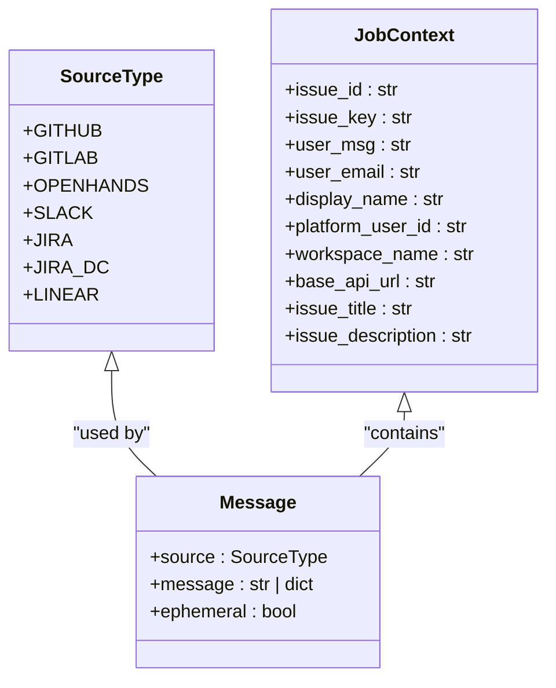
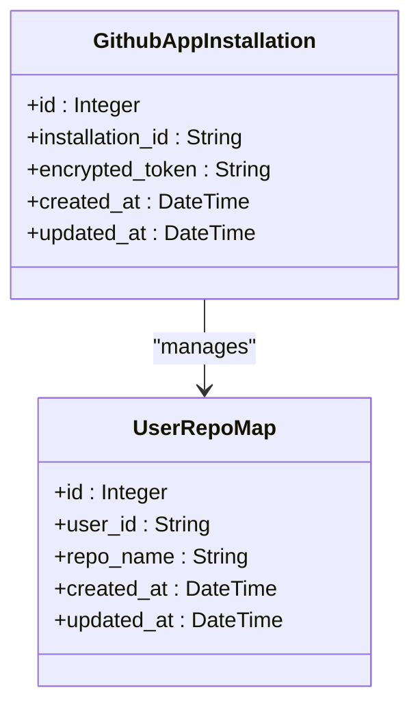
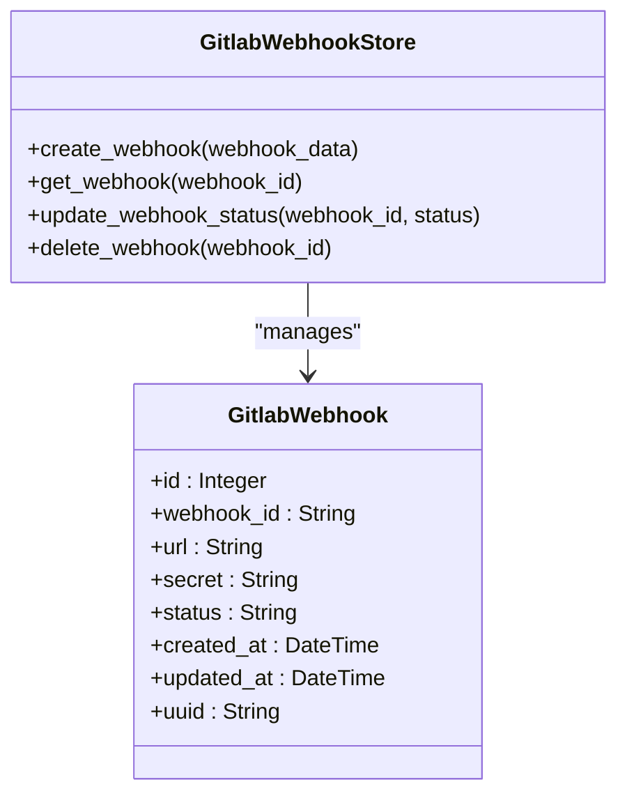
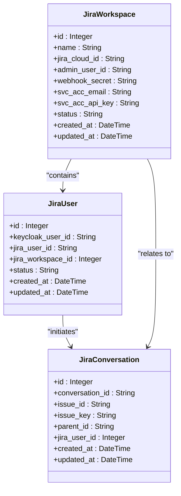
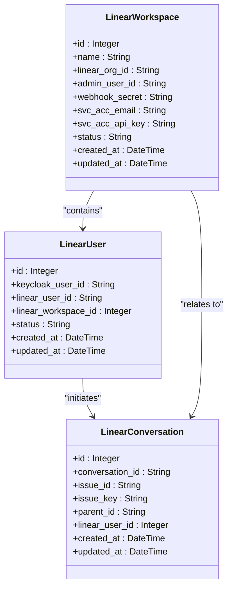
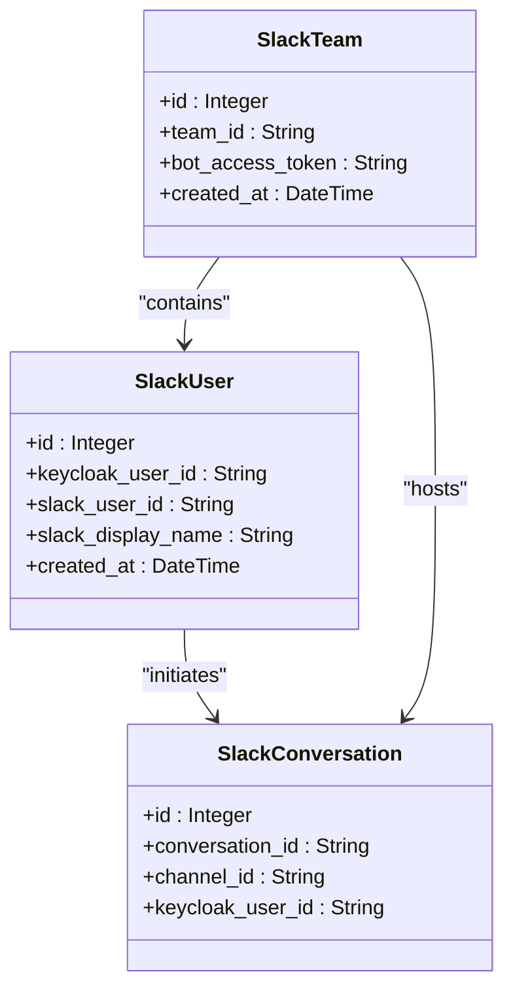
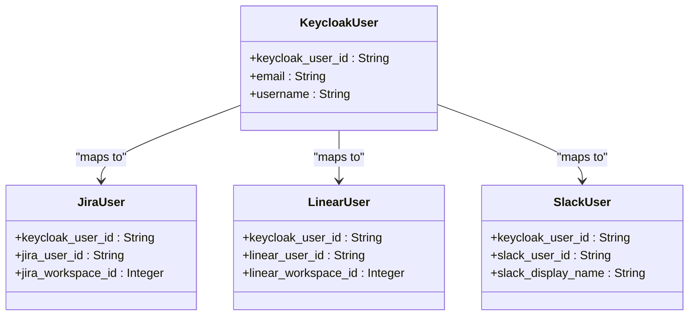
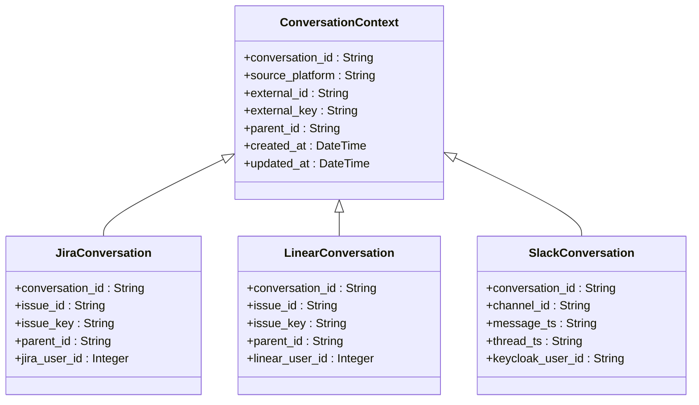
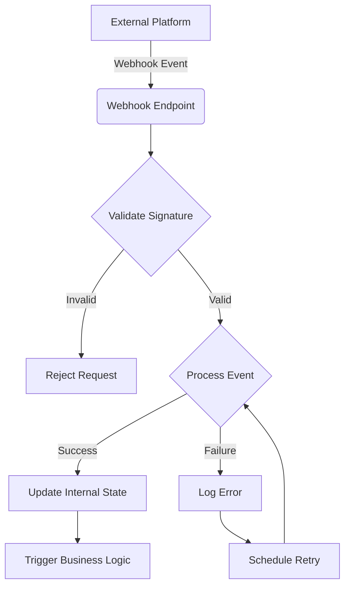
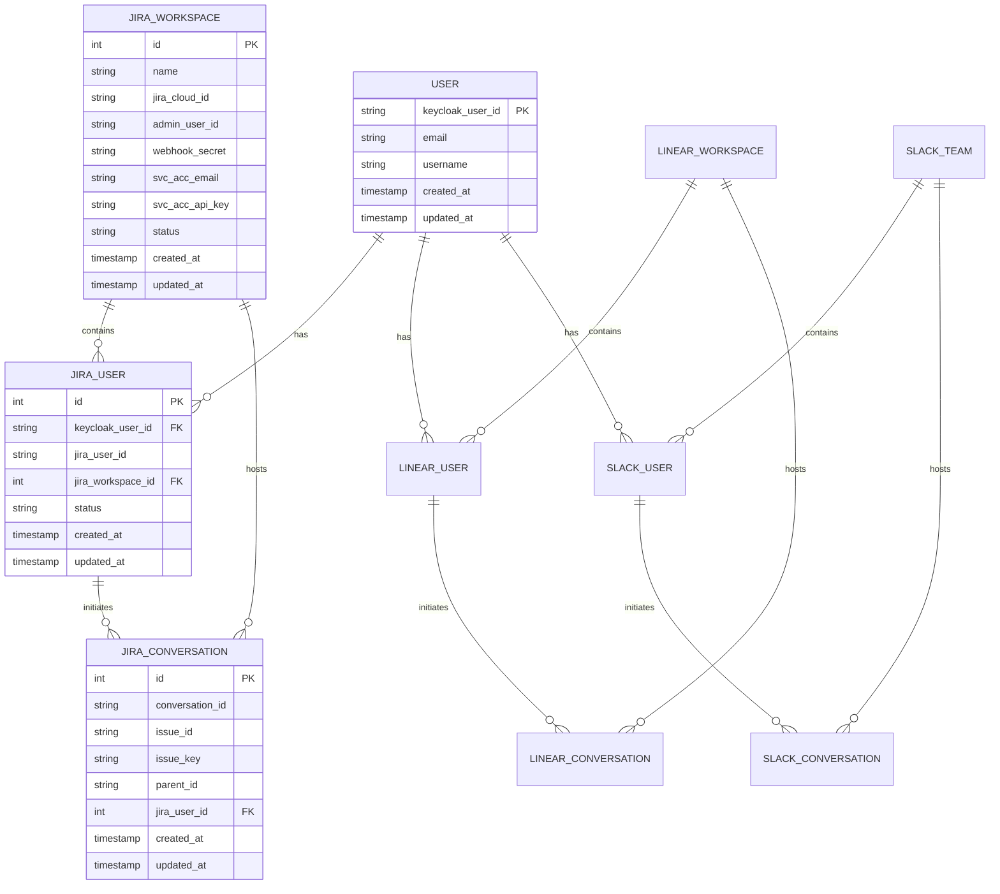

# Integration Models

<cite>
**Referenced Files in This Document**   
- [github_app_installation.py](file://enterprise/storage/github_app_installation.py)
- [jira_workspace.py](file://enterprise/storage/jira_workspace.py)
- [jira_user.py](file://enterprise/storage/jira_user.py)
- [jira_conversation.py](file://enterprise/storage/jira_conversation.py)
- [linear_workspace.py](file://enterprise/storage/linear_workspace.py)
- [linear_user.py](file://enterprise/storage/linear_user.py)
- [linear_conversation.py](file://enterprise/storage/linear_conversation.py)
- [slack_team.py](file://enterprise/storage/slack_team.py)
- [slack_user.py](file://enterprise/storage/slack_user.py)
- [slack_conversation.py](file://enterprise/storage/slack_conversation.py)
- [gitlab_webhook.py](file://enterprise/storage/gitlab_webhook.py)
- [models.py](file://enterprise/integrations/models.py)
- [types.py](file://enterprise/integrations/types.py)
</cite>

## Table of Contents
1. [Introduction](#introduction)
2. [Core Integration Data Models](#core-integration-data-models)
3. [GitHub Integration Model](#github-integration-model)
4. [GitLab Integration Model](#gitlab-integration-model)
5. [Jira Integration Model](#jira-integration-model)
6. [Linear Integration Model](#linear-integration-model)
7. [Slack Integration Model](#slack-integration-model)
8. [User Mapping and Identity Management](#user-mapping-and-identity-management)
9. [Conversation Context Preservation](#conversation-context-preservation)
10. [Webhook Management](#webhook-management)
11. [Common Integration Queries](#common-integration-queries)
12. [Data Consistency and Synchronization](#data-consistency-and-synchronization)

## Introduction
This document provides comprehensive documentation for the third-party integration entities in the OpenHands platform. It details the data models for GitHub, GitLab, Jira, Linear, and Slack integrations, focusing on installation records, webhook management, user mapping, and conversation context preservation. The documentation explains how internal users are mapped to external accounts across different platforms, how repository mappings are maintained, and how conversation context is preserved across integrated services. It also covers the data models for Jira and Linear workspaces and their relationship to user conversations, as well as how Slack team and user data is synchronized and maintained.

**Section sources**
- [models.py](file://enterprise/integrations/models.py#L8-L15)
- [types.py](file://enterprise/integrations/types.py#L8-L11)

## Core Integration Data Models

The OpenHands platform implements a comprehensive data model for managing third-party integrations. The core integration models are designed to support multiple platforms including GitHub, GitLab, Jira, Linear, and Slack. These models are built on a consistent pattern of workspace-level configuration, user-level mapping, and conversation-level context preservation.

The integration architecture follows a modular approach where each platform has its own set of models for workspaces, users, and conversations. The SourceType enum defines the supported integration platforms, providing a consistent way to reference different services throughout the system.

**Diagram sources**
- [models.py](file://enterprise/integrations/models.py#L8-L35)

**Section sources**
- [models.py](file://enterprise/integrations/models.py#L8-L35)
- [types.py](file://enterprise/integrations/types.py#L8-L11)

## GitHub Integration Model

The GitHub integration model is centered around the GithubAppInstallation entity, which stores installation records for GitHub applications. This model captures the essential information needed to authenticate and communicate with GitHub repositories on behalf of users.

The GithubAppInstallation table contains the installation ID and encrypted access token, enabling the platform to interact with GitHub repositories without requiring individual user credentials. This approach enhances security by using GitHub's app installation model, where the platform acts as a GitHub App with specific permissions granted by repository administrators.

**Diagram sources**
- [github_app_installation.py](file://enterprise/storage/github_app_installation.py#L5-L23)
- [user_repo_map.py](file://enterprise/storage/user_repo_map.py#L5-L25)

**Section sources**
- [github_app_installation.py](file://enterprise/storage/github_app_installation.py#L5-L23)
- [migrations/versions/013_create_github_app_installations_table.py](file://enterprise/migrations/versions/013_create_github_app_installations_table.py#L21-L54)

## GitLab Integration Model

The GitLab integration model includes webhook management capabilities, allowing the platform to receive real-time notifications from GitLab repositories. The gitlab_webhook table stores webhook configuration and status information for GitLab integrations.

Each webhook record contains the webhook ID, URL, secret, and status, enabling the platform to manage multiple webhook subscriptions across different GitLab projects. The model supports webhook lifecycle management, including creation, validation, and deletion, ensuring reliable event delivery from GitLab to the OpenHands platform.

**Diagram sources**
- [gitlab_webhook.py](file://enterprise/storage/gitlab_webhook.py#L5-L30)
- [gitlab_webhook_store.py](file://enterprise/storage/gitlab_webhook_store.py#L5-L45)

**Section sources**
- [gitlab_webhook.py](file://enterprise/storage/gitlab_webhook.py#L5-L30)
- [migrations/versions/027_create_gitlab_webhook_table.py](file://enterprise/migrations/versions/027_create_gitlab_webhook_table.py#L21-L54)

## Jira Integration Model

The Jira integration model consists of three main components: workspaces, users, and conversations. This hierarchical structure enables the platform to manage Jira integrations at multiple levels, from organization-wide configurations to individual user mappings and specific issue conversations.

The JiraWorkspace entity stores configuration for each connected Jira instance, including the workspace name, Jira cloud ID, admin user ID, webhook secret, service account credentials, and integration status. This information enables the platform to authenticate with Jira and manage webhook subscriptions for receiving issue updates.

**Diagram sources**
- [jira_workspace.py](file://enterprise/storage/jira_workspace.py#L5-L26)
- [jira_user.py](file://enterprise/storage/jira_user.py#L5-L23)
- [jira_conversation.py](file://enterprise/storage/jira_conversation.py#L5-L24)

**Section sources**
- [jira_workspace.py](file://enterprise/storage/jira_workspace.py#L5-L26)
- [jira_user.py](file://enterprise/storage/jira_user.py#L5-L23)
- [jira_conversation.py](file://enterprise/storage/jira_conversation.py#L5-L24)
- [migrations/versions/063_create_jira_workspaces_table.py](file://enterprise/migrations/versions/063_create_jira_workspaces_table.py#L21-L51)

## Linear Integration Model

The Linear integration model follows a similar pattern to the Jira integration, with workspace, user, and conversation entities. The LinearWorkspace entity stores configuration for each connected Linear organization, including the workspace name, Linear organization ID, admin user ID, webhook secret, service account credentials, and integration status.

The model enables the platform to manage Linear integrations at the organization level while maintaining individual user mappings and conversation contexts. This structure supports multi-tenant scenarios where multiple Linear organizations may be connected to the same OpenHands instance.

**Diagram sources**
- [linear_workspace.py](file://enterprise/storage/linear_workspace.py#L5-L26)
- [linear_user.py](file://enterprise/storage/linear_user.py#L5-L23)
- [linear_conversation.py](file://enterprise/storage/linear_conversation.py#L5-L24)

**Section sources**
- [linear_workspace.py](file://enterprise/storage/linear_workspace.py#L5-L26)
- [linear_user.py](file://enterprise/storage/linear_user.py#L5-L23)
- [linear_conversation.py](file://enterprise/storage/linear_conversation.py#L5-L24)
- [migrations/versions/069_create_linear_workspaces_table.py](file://enterprise/migrations/versions/069_create_linear_workspaces_table.py#L21-L51)

## Slack Integration Model

The Slack integration model includes team, user, and conversation entities to manage Slack workspace connections and user interactions. The SlackTeam entity stores information about connected Slack workspaces, including the team ID and bot access token, enabling the platform to authenticate and communicate with Slack.

The SlackUser entity maps internal Keycloak user IDs to Slack user IDs and display names, facilitating user identification and message routing. The SlackConversation entity links OpenHands conversations to specific Slack channels, preserving context across the integration.

**Diagram sources**
- [slack_team.py](file://enterprise/storage/slack_team.py#L5-L15)
- [slack_user.py](file://enterprise/storage/slack_user.py#L5-L16)
- [slack_conversation.py](file://enterprise/storage/slack_conversation.py#L5-L28)

**Section sources**
- [slack_team.py](file://enterprise/storage/slack_team.py#L5-L15)
- [slack_user.py](file://enterprise/storage/slack_user.py#L5-L16)
- [slack_conversation.py](file://enterprise/storage/slack_conversation.py#L5-L28)
- [migrations/versions/045_create_slack_team_table.py](file://enterprise/migrations/versions/045_create_slack_team_table.py#L21-L42)

## User Mapping and Identity Management

The platform implements a robust user mapping system that connects internal users with their external accounts across different platforms. This system uses Keycloak as the identity provider, with each internal user having a unique Keycloak user ID that serves as the primary key for user mapping.

For each integrated platform, the system maintains a mapping between the Keycloak user ID and the platform-specific user ID. This allows the platform to accurately identify users across different services and maintain consistent user experiences. The user mapping data is stored in platform-specific tables such as jira_users, linear_users, and slack_users.

The user mapping system supports both automatic and manual mapping scenarios. In automatic scenarios, the system can discover and link user accounts based on email addresses or other identifying information. In manual scenarios, users can explicitly link their accounts through the integration configuration process.

**Diagram sources**
- [jira_user.py](file://enterprise/storage/jira_user.py#L5-L23)
- [linear_user.py](file://enterprise/storage/linear_user.py#L5-L23)
- [slack_user.py](file://enterprise/storage/slack_user.py#L5-L16)

**Section sources**
- [jira_user.py](file://enterprise/storage/jira_user.py#L5-L23)
- [linear_user.py](file://enterprise/storage/linear_user.py#L5-L23)
- [slack_user.py](file://enterprise/storage/slack_user.py#L5-L16)
- [types.py](file://enterprise/integrations/types.py#L19-L23)

## Conversation Context Preservation

The platform preserves conversation context across integrated services through a comprehensive conversation mapping system. Each conversation in OpenHands is linked to the corresponding entity in the external platform, such as a Jira issue, Linear ticket, or Slack channel.

The conversation context model includes information about the source platform, conversation ID, issue ID, issue key, and parent conversation ID (for threaded conversations). This information enables the platform to maintain context across different interaction modes and platforms.

For issue-based platforms like Jira and Linear, the system stores both the issue ID and issue key, allowing for flexible lookups and references. For chat-based platforms like Slack, the system links conversations to specific channels and messages, preserving the discussion context.

**Diagram sources**
- [jira_conversation.py](file://enterprise/storage/jira_conversation.py#L5-L24)
- [linear_conversation.py](file://enterprise/storage/linear_conversation.py#L5-L24)
- [slack_conversation.py](file://enterprise/storage/slack_conversation.py#L5-L28)

**Section sources**
- [jira_conversation.py](file://enterprise/storage/jira_conversation.py#L5-L24)
- [linear_conversation.py](file://enterprise/storage/linear_conversation.py#L5-L24)
- [slack_conversation.py](file://enterprise/storage/slack_conversation.py#L5-L28)

## Webhook Management

The platform implements a comprehensive webhook management system to receive real-time notifications from integrated services. The webhook management model includes configuration storage, event processing, and error handling capabilities.

For GitLab, the system stores webhook configuration in the gitlab_webhook table, which includes the webhook ID, URL, secret, and status. This allows the platform to manage multiple webhook subscriptions and monitor their health.

For Jira and Linear, webhooks are configured at the workspace level, with each workspace having its own webhook secret for security. The platform validates incoming webhook requests using these secrets to ensure authenticity.

The webhook management system includes error handling and retry mechanisms to ensure reliable event delivery. Failed webhook deliveries are logged and can be retried according to configurable policies.

**Diagram sources**
- [gitlab_webhook.py](file://enterprise/storage/gitlab_webhook.py#L5-L30)
- [jira_workspace.py](file://enterprise/storage/jira_workspace.py#L5-L26)
- [linear_workspace.py](file://enterprise/storage/linear_workspace.py#L5-L26)

**Section sources**
- [gitlab_webhook.py](file://enterprise/storage/gitlab_webhook.py#L5-L30)
- [jira_workspace.py](file://enterprise/storage/jira_workspace.py#L5-L26)
- [linear_workspace.py](file://enterprise/storage/linear_workspace.py#L5-L26)

## Common Integration Queries

The platform supports various queries to check integration status and user connectivity across platforms. These queries enable administrators and users to monitor integration health and troubleshoot connectivity issues.

Common queries include checking the status of a specific integration, listing all connected workspaces for a user, finding conversations associated with a particular issue, and verifying user mappings across platforms.

**Diagram sources**
- [jira_workspace.py](file://enterprise/storage/jira_workspace.py#L5-L26)
- [jira_user.py](file://enterprise/storage/jira_user.py#L5-L23)
- [jira_conversation.py](file://enterprise/storage/jira_conversation.py#L5-L24)
- [linear_workspace.py](file://enterprise/storage/linear_workspace.py#L5-L26)
- [linear_user.py](file://enterprise/storage/linear_user.py#L5-L23)
- [linear_conversation.py](file://enterprise/storage/linear_conversation.py#L5-L24)
- [slack_team.py](file://enterprise/storage/slack_team.py#L5-L15)
- [slack_user.py](file://enterprise/storage/slack_user.py#L5-L16)
- [slack_conversation.py](file://enterprise/storage/slack_conversation.py#L5-L28)

**Section sources**
- [jira_workspace.py](file://enterprise/storage/jira_workspace.py#L5-L26)
- [jira_user.py](file://enterprise/storage/jira_user.py#L5-L23)
- [jira_conversation.py](file://enterprise/storage/jira_conversation.py#L5-L24)
- [linear_workspace.py](file://enterprise/storage/linear_workspace.py#L5-L26)
- [linear_user.py](file://enterprise/storage/linear_user.py#L5-L23)
- [linear_conversation.py](file://enterprise/storage/linear_conversation.py#L5-L24)
- [slack_team.py](file://enterprise/storage/slack_team.py#L5-L15)
- [slack_user.py](file://enterprise/storage/slack_user.py#L5-L16)
- [slack_conversation.py](file://enterprise/storage/slack_conversation.py#L5-L28)

## Data Consistency and Synchronization

The platform addresses data consistency challenges in multi-integration scenarios through a combination of transactional integrity, event-driven architecture, and periodic synchronization processes.

For critical operations, the platform uses database transactions to ensure atomicity and consistency. When integrating with external platforms, the system implements compensating transactions to handle failures and maintain data integrity.

The event-driven architecture ensures that changes in one system are propagated to related systems through event publication and subscription. This approach reduces tight coupling between components and enables eventual consistency across the platform.

Periodic synchronization processes run in the background to detect and resolve data inconsistencies between the platform and external services. These processes compare data across systems and apply corrective actions when discrepancies are found.

The platform also implements conflict resolution strategies for handling concurrent updates to the same data from different sources. These strategies include timestamp-based resolution, user preference-based resolution, and manual intervention workflows.

**Section sources**
- [storage/database.py](file://enterprise/storage/database.py#L1-L50)
- [server/saas_monitoring_listener.py](file://enterprise/server/saas_monitoring_listener.py#L1-L40)
- [sync/enrich_user_interaction_data.py](file://enterprise/sync/enrich_user_interaction_data.py#L1-L30)