# User & Authentication Models

<cite>
**Referenced Files in This Document**   
- [UserSettings](file://enterprise/storage/user_settings.py)
- [AuthTokens](file://enterprise/storage/auth_tokens.py)
- [OfflineTokens](file://enterprise/storage/stored_offline_token.py)
- [APIKey](file://enterprise/storage/api_key.py)
- [auth_token_store.py](file://enterprise/storage/auth_token_store.py)
- [api_key_store.py](file://enterprise/storage/api_key_store.py)
- [keycloak_manager.py](file://enterprise/server/auth/keycloak_manager.py)
- [auth_utils.py](file://enterprise/server/auth/auth_utils.py)
- [user_settings.py](file://enterprise/storage/user_settings.py)
- [stored_settings.py](file://enterprise/storage/stored_settings.py)
</cite>

## Table of Contents
1. [Introduction](#introduction)
2. [Core Data Models](#core-data-models)
3. [Authentication Token Management](#authentication-token-management)
4. [API Key Authentication](#api-key-authentication)
5. [User Settings and Preferences](#user-settings-and-preferences)
6. [Keycloak Integration](#keycloak-integration)
7. [Data Validation and Security](#data-validation-and-security)
8. [GDPR Compliance and Data Privacy](#gdpr-compliance-and-data-privacy)
9. [Common Authentication Queries](#common-authentication-queries)
10. [Conclusion](#conclusion)

## Introduction

This document provides comprehensive documentation for the user and authentication models in the OpenHands enterprise application. The system implements a robust authentication framework that supports multiple identity providers, API key authentication, and session persistence through various token mechanisms. The core models include UserSettings, AuthTokens, OfflineTokens, and APIKey, which work together to manage user preferences, authentication credentials, and access control.

The authentication system is built around Keycloak for OAuth flows, providing secure user authentication and authorization. User preferences and settings are persisted in the database and retrieved as needed throughout the application lifecycle. The system also implements strict data validation rules and security considerations for storing sensitive authentication data, ensuring compliance with data privacy requirements including GDPR.

**Section sources**
- [UserSettings](file://enterprise/storage/user_settings.py)
- [AuthTokens](file://enterprise/storage/auth_tokens.py)
- [OfflineTokens](file://enterprise/storage/stored_offline_token.py)
- [APIKey](file://enterprise/storage/api_key.py)

## Core Data Models

The authentication system is built on four primary data models that handle different aspects of user authentication and preferences.

### UserSettings Model

The UserSettings model stores user preferences and configuration options. This model contains various fields that define the user's environment and preferences:

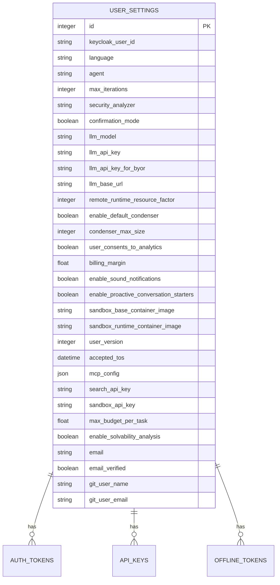

**Diagram sources**
- [user_settings.py](file://enterprise/storage/user_settings.py)

**Section sources**
- [user_settings.py](file://enterprise/storage/user_settings.py)

### AuthTokens Model

The AuthTokens model manages OAuth tokens for various identity providers. It stores access and refresh tokens along with their expiration times:

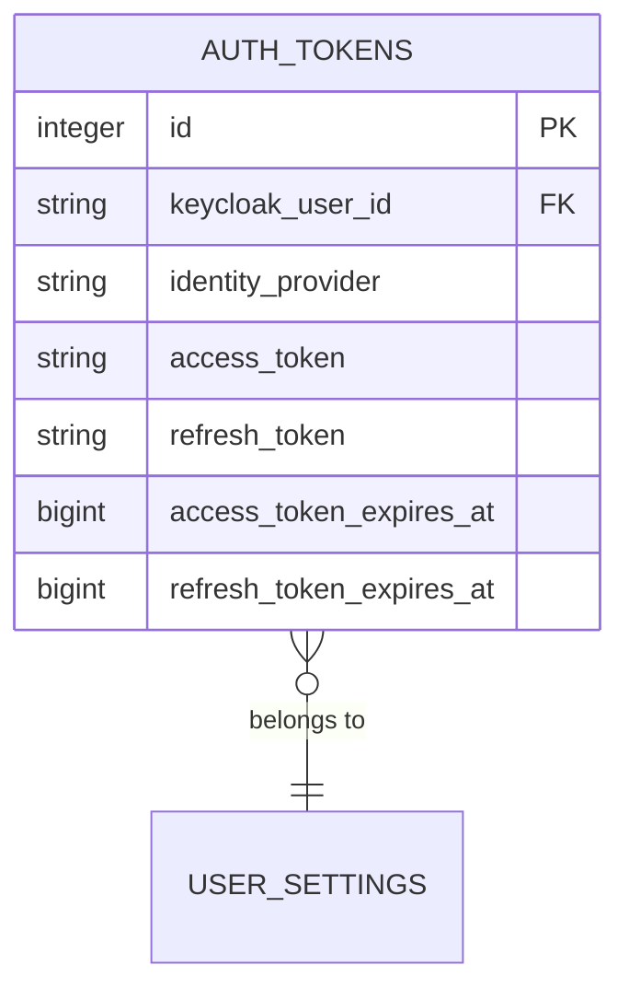

**Diagram sources**
- [auth_tokens.py](file://enterprise/storage/auth_tokens.py)

**Section sources**
- [auth_tokens.py](file://enterprise/storage/auth_tokens.py)

### OfflineTokens Model

The OfflineTokens model stores long-lived tokens that allow the system to maintain user sessions even when the user is not actively using the application:

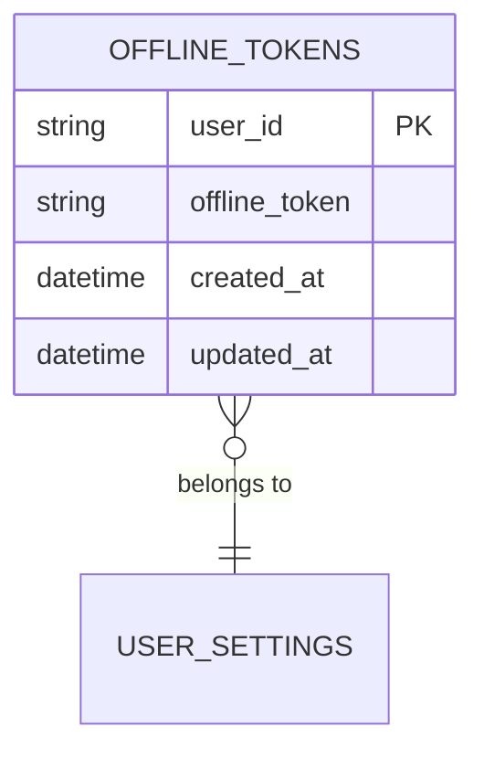

**Diagram sources**
- [stored_offline_token.py](file://enterprise/storage/stored_offline_token.py)

**Section sources**
- [stored_offline_token.py](file://enterprise/storage/stored_offline_token.py)

### APIKey Model

The APIKey model handles API key authentication for programmatic access to the system:

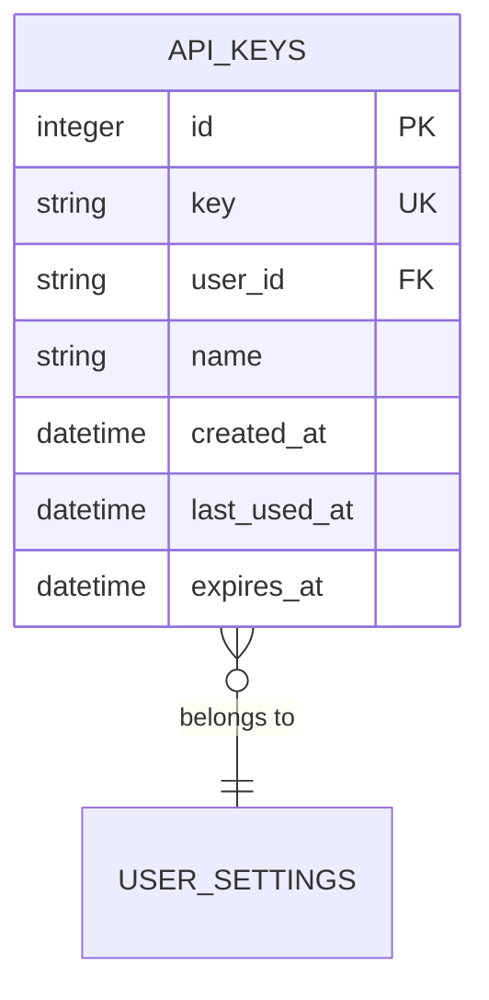

**Diagram sources**
- [api_key.py](file://enterprise/storage/api_key.py)

**Section sources**
- [api_key.py](file://enterprise/storage/api_key.py)

## Authentication Token Management

The authentication token management system handles the storage, retrieval, and refresh of OAuth tokens for various identity providers.

### Token Storage and Retrieval

The AuthTokenStore class provides methods for storing and retrieving authentication tokens. When a user authenticates with an identity provider, the access and refresh tokens are stored in the database with their expiration times.

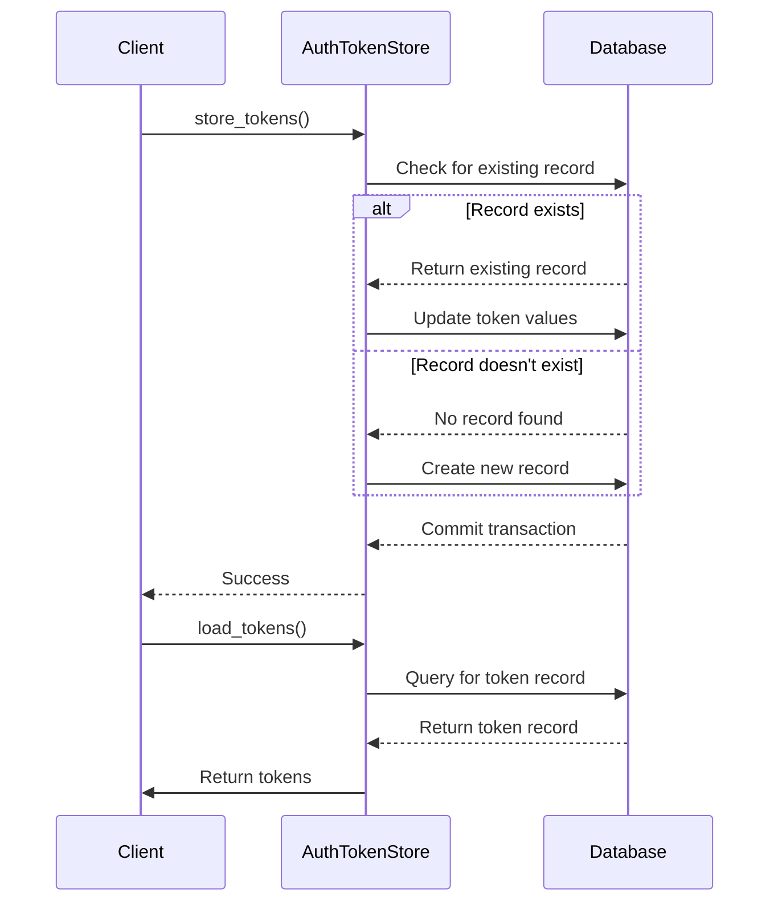

**Diagram sources**
- [auth_token_store.py](file://enterprise/storage/auth_token_store.py)

**Section sources**
- [auth_token_store.py](file://enterprise/storage/auth_token_store.py)

### Token Refresh Mechanism

The system implements a robust token refresh mechanism that ensures uninterrupted access for users. When tokens are loaded, the system checks their expiration and automatically refreshes them if necessary:

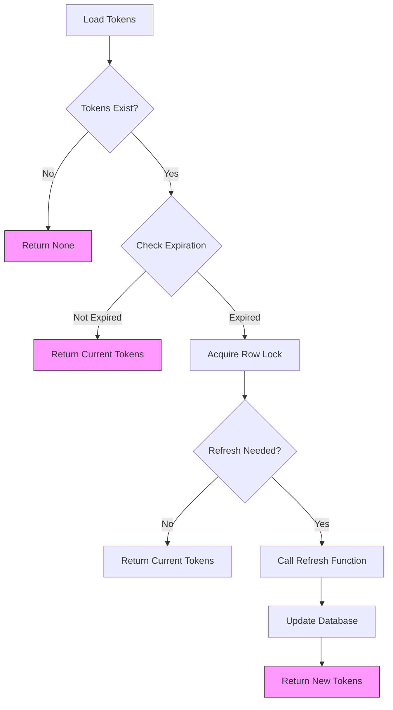

**Diagram sources**
- [auth_token_store.py](file://enterprise/storage/auth_token_store.py)

**Section sources**
- [auth_token_store.py](file://enterprise/storage/auth_token_store.py)

## API Key Authentication

The API key authentication system allows users to generate and manage API keys for programmatic access to the application.

### API Key Management

The ApiKeyStore class provides a complete API for managing API keys, including creation, validation, and deletion:

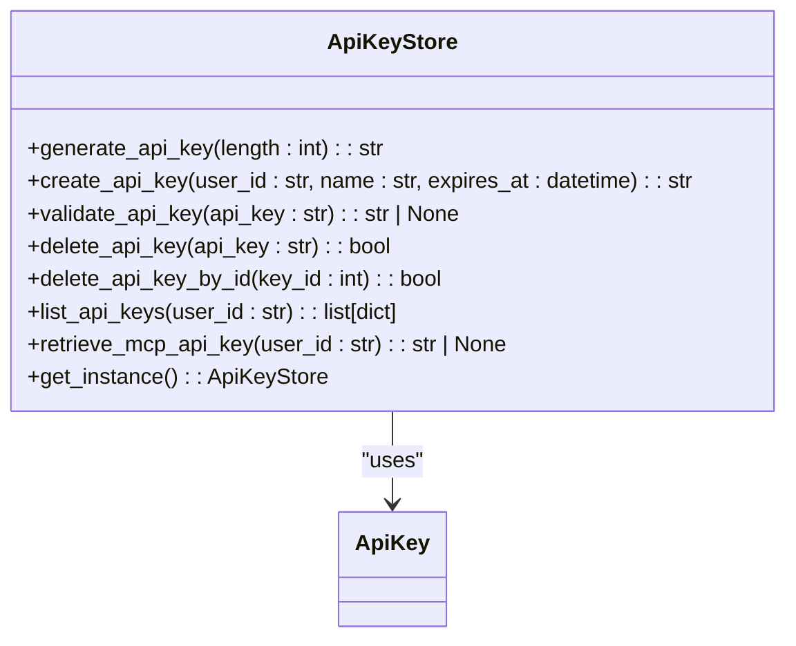

**Diagram sources**
- [api_key_store.py](file://enterprise/storage/api_key_store.py)

**Section sources**
- [api_key_store.py](file://enterprise/storage/api_key_store.py)

### API Key Lifecycle

The API key lifecycle includes creation, validation, usage tracking, and expiration:

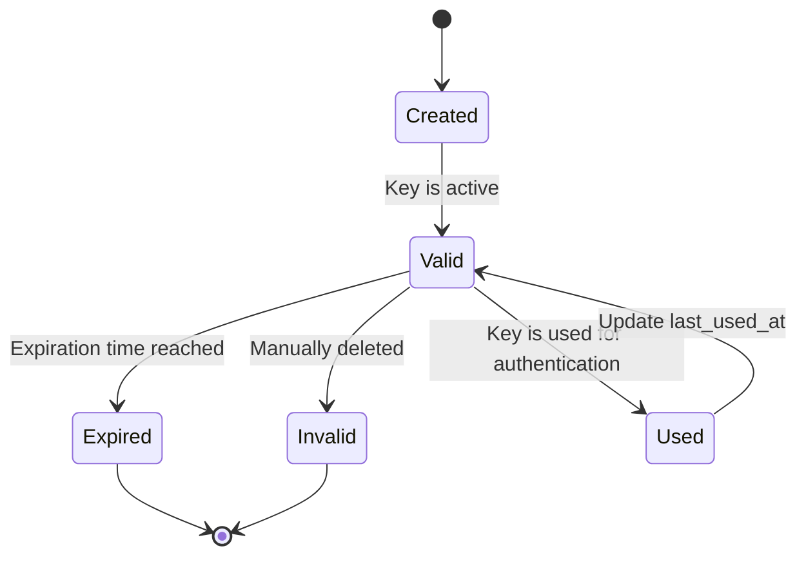

**Diagram sources**
- [api_key_store.py](file://enterprise/storage/api_key_store.py)

**Section sources**
- [api_key_store.py](file://enterprise/storage/api_key_store.py)

## User Settings and Preferences

The user settings system allows users to customize their experience and store preferences across sessions.

### Settings Persistence

User settings are persisted in the database and retrieved when needed. The system supports both current and legacy settings storage:

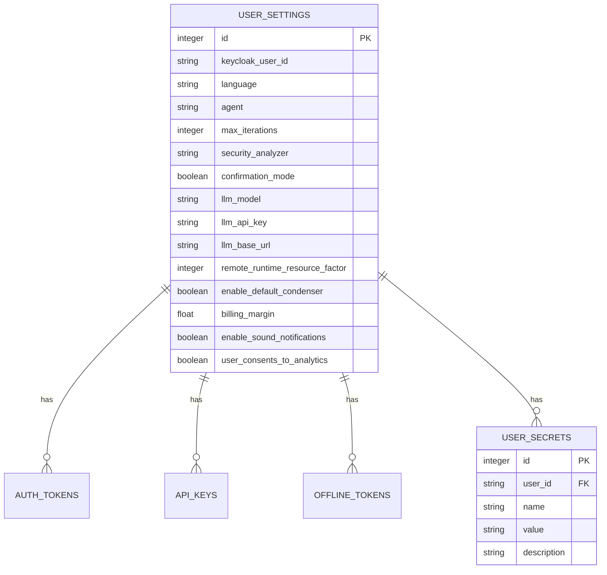

**Diagram sources**
- [user_settings.py](file://enterprise/storage/user_settings.py)
- [stored_settings.py](file://enterprise/storage/stored_settings.py)

**Section sources**
- [user_settings.py](file://enterprise/storage/user_settings.py)
- [stored_settings.py](file://enterprise/storage/stored_settings.py)

### Settings Retrieval Flow

The process of retrieving user settings involves checking both the current and legacy storage systems:

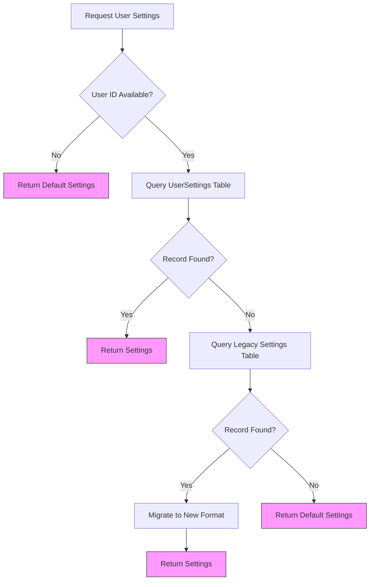

**Diagram sources**
- [user_settings.py](file://enterprise/storage/user_settings.py)
- [stored_settings.py](file://enterprise/storage/stored_settings.py)

**Section sources**
- [user_settings.py](file://enterprise/storage/user_settings.py)
- [stored_settings.py](file://enterprise/storage/stored_settings.py)

## Keycloak Integration

The system integrates with Keycloak for OAuth-based authentication and user management.

### Keycloak Authentication Flow

The Keycloak integration follows the standard OAuth authorization code flow:

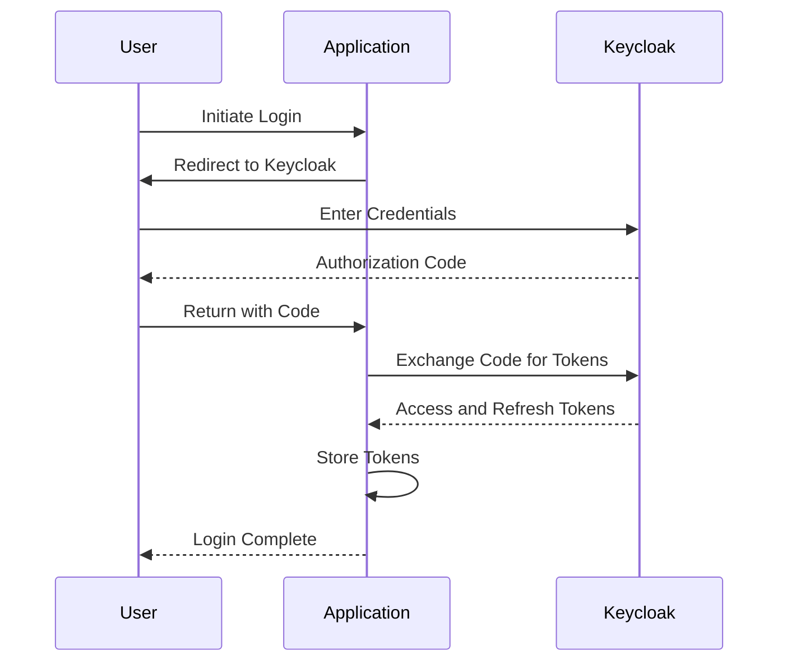

**Diagram sources**
- [keycloak_manager.py](file://enterprise/server/auth/keycloak_manager.py)

**Section sources**
- [keycloak_manager.py](file://enterprise/server/auth/keycloak_manager.py)

### Keycloak Manager Implementation

The Keycloak manager provides singleton instances for Keycloak administration and authentication:

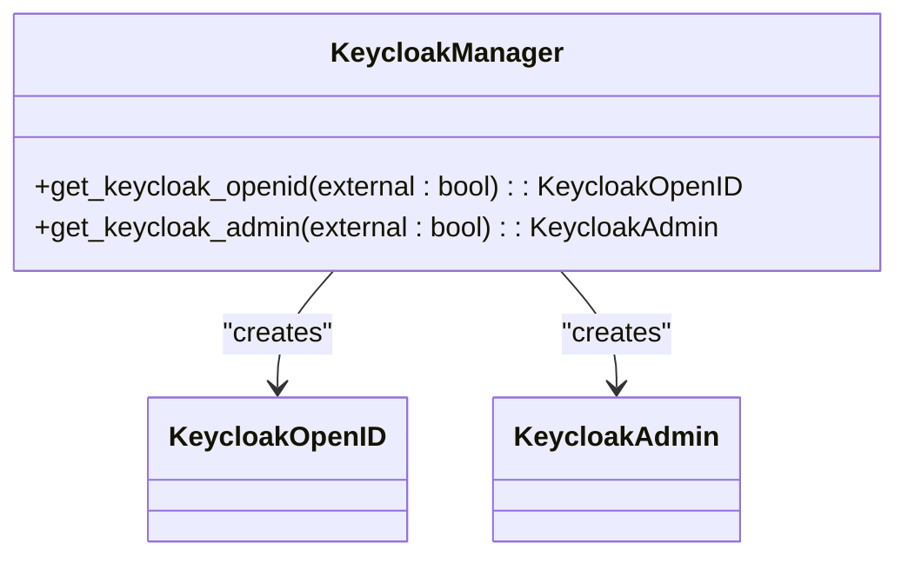

**Diagram sources**
- [keycloak_manager.py](file://enterprise/server/auth/keycloak_manager.py)

**Section sources**
- [keycloak_manager.py](file://enterprise/server/auth/keycloak_manager.py)

## Data Validation and Security

The system implements strict data validation and security measures to protect sensitive authentication data.

### Token Security

Authentication tokens are stored securely with proper expiration handling:

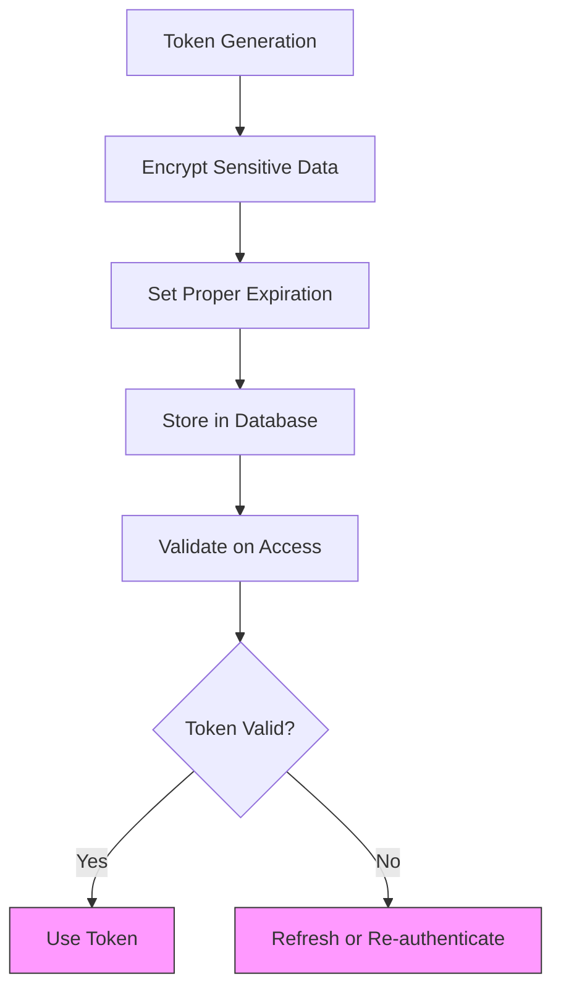

**Diagram sources**
- [auth_token_store.py](file://enterprise/storage/auth_token_store.py)

**Section sources**
- [auth_token_store.py](file://enterprise/storage/auth_token_store.py)

### API Key Security

API keys are generated with high entropy and stored securely:

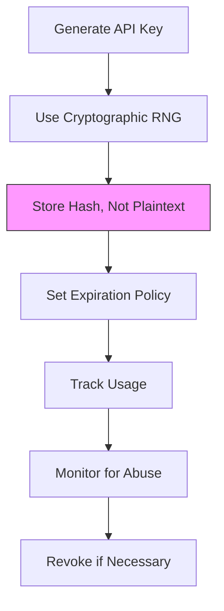

**Diagram sources**
- [api_key_store.py](file://enterprise/storage/api_key_store.py)

**Section sources**
- [api_key_store.py](file://enterprise/storage/api_key_store.py)

## GDPR Compliance and Data Privacy

The system implements features to ensure compliance with GDPR and other data privacy regulations.

### Data Minimization

The system follows data minimization principles by only storing necessary information:

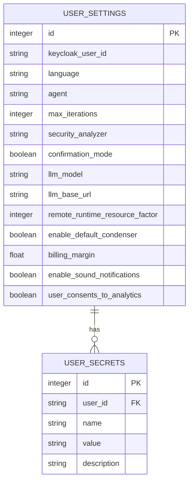

**Diagram sources**
- [user_settings.py](file://enterprise/storage/user_settings.py)

**Section sources**
- [user_settings.py](file://enterprise/storage/user_settings.py)

### User Consent Management

The system tracks user consent for data processing and analytics:

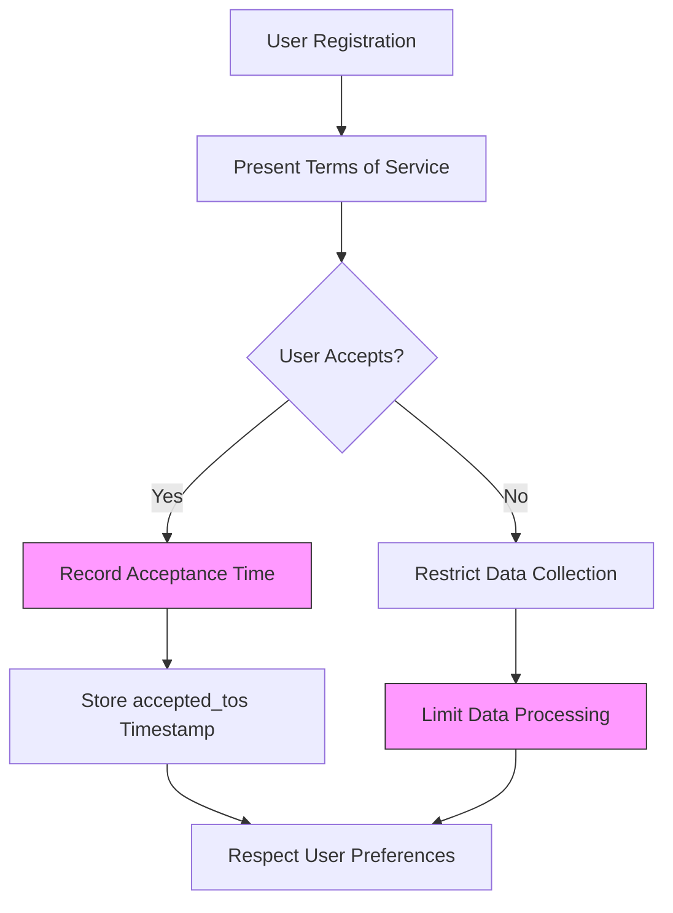

**Diagram sources**
- [user_settings.py](file://enterprise/storage/user_settings.py)

**Section sources**
- [user_settings.py](file://enterprise/storage/user_settings.py)

## Common Authentication Queries

This section provides examples of common database queries for user authentication and token validation.

### User Authentication Query

Query to retrieve a user's authentication tokens:

```sql
SELECT 
    access_token,
    refresh_token,
    access_token_expires_at,
    refresh_token_expires_at
FROM auth_tokens
WHERE keycloak_user_id = :user_id
    AND identity_provider = :identity_provider;
```

### Token Validation Query

Query to check if an access token is still valid:

```sql
SELECT 
    CASE 
        WHEN access_token_expires_at > EXTRACT(EPOCH FROM CURRENT_TIMESTAMP) + 30
        THEN TRUE 
        ELSE FALSE 
    END as is_valid
FROM auth_tokens
WHERE keycloak_user_id = :user_id
    AND identity_provider = :identity_provider;
```

### API Key Validation Query

Query to validate an API key and retrieve the associated user:

```sql
SELECT user_id
FROM api_keys
WHERE key = :api_key
    AND (expires_at IS NULL OR expires_at > CURRENT_TIMESTAMP)
LIMIT 1;
```

### User Settings Query

Query to retrieve a user's settings:

```sql
SELECT *
FROM user_settings
WHERE keycloak_user_id = :user_id;
```

**Section sources**
- [auth_tokens.py](file://enterprise/storage/auth_tokens.py)
- [api_key.py](file://enterprise/storage/api_key.py)
- [user_settings.py](file://enterprise/storage/user_settings.py)

## Conclusion

The OpenHands authentication system provides a comprehensive framework for managing user authentication, preferences, and access control. The system is built on four core models—UserSettings, AuthTokens, OfflineTokens, and APIKey—that work together to provide a secure and flexible authentication experience.

Key features of the system include:
- Integration with Keycloak for OAuth-based authentication
- Support for multiple identity providers
- API key authentication for programmatic access
- Secure token storage and refresh mechanisms
- Comprehensive user settings and preferences
- GDPR compliance and data privacy protections

The system implements robust security measures to protect sensitive authentication data, including proper token expiration handling, secure API key generation, and data minimization principles. The architecture supports both current and legacy settings storage, ensuring backward compatibility while moving toward a more modern data model.

Overall, the authentication system provides a solid foundation for secure user management and access control in the OpenHands enterprise application.