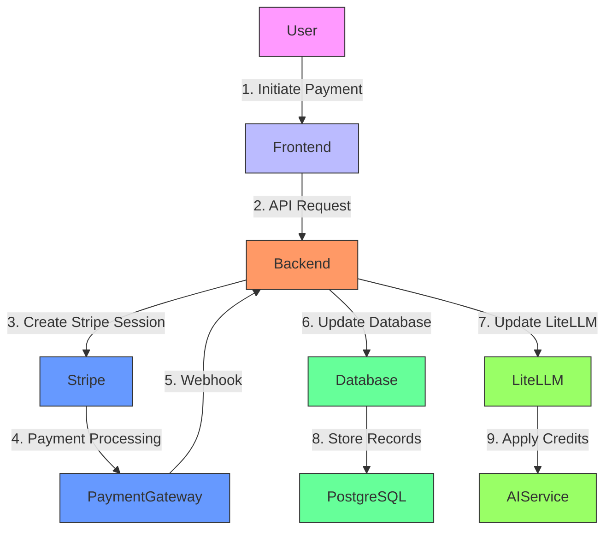
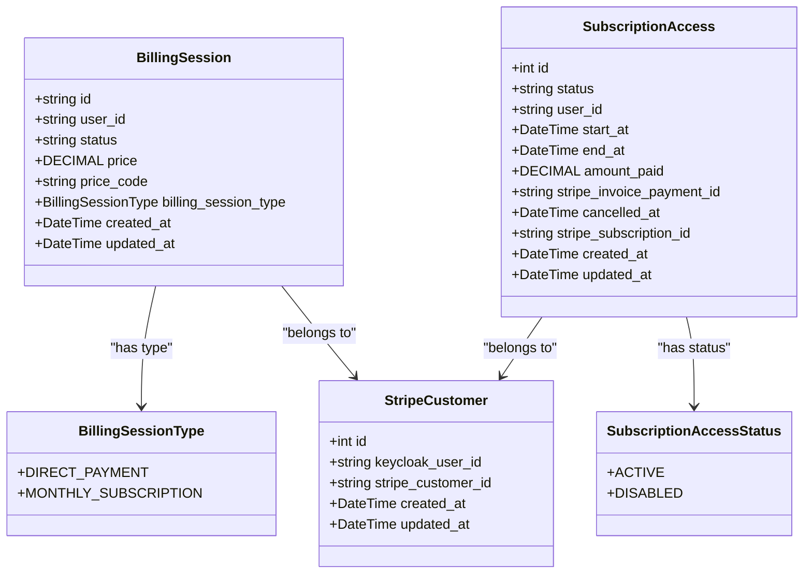
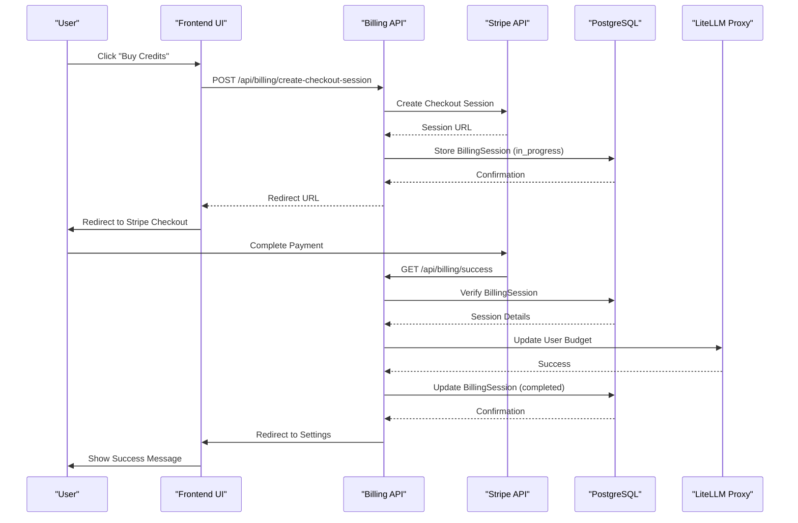
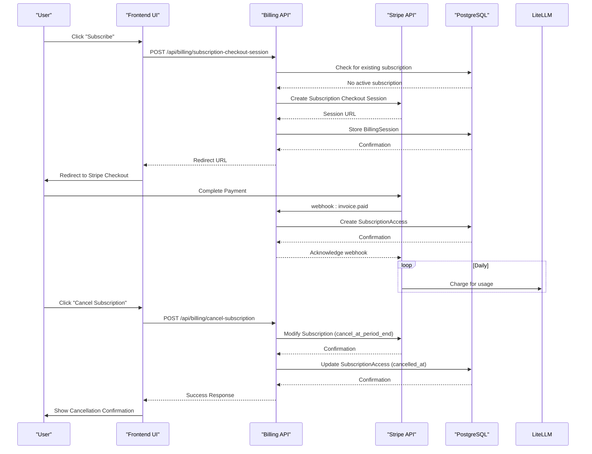
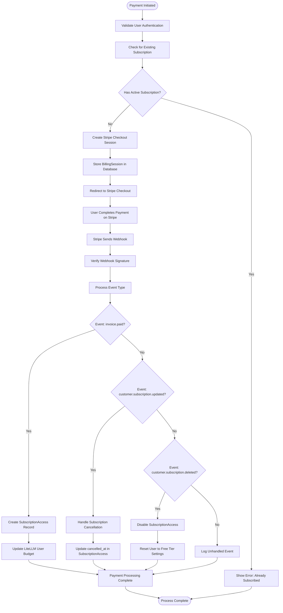
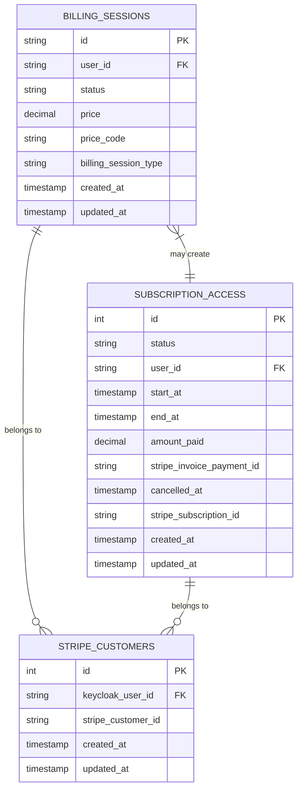
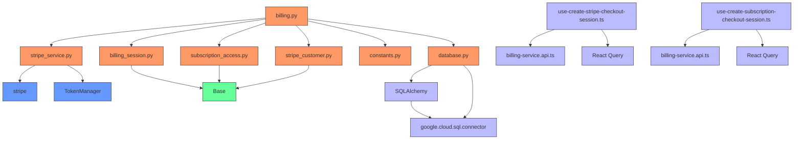

# Billing & Subscription Management

<cite>
**Referenced Files in This Document**   
- [billing.py](file://enterprise/server/routes/billing.py)
- [stripe_service.py](file://enterprise/integrations/stripe_service.py)
- [billing_session.py](file://enterprise/storage/billing_session.py)
- [subscription_access.py](file://enterprise/storage/subscription_access.py)
- [stripe_customer.py](file://enterprise/storage/stripe_customer.py)
- [constants.py](file://enterprise/server/constants.py)
- [database.py](file://enterprise/storage/database.py)
- [billing-service.api.ts](file://frontend/src/api/billing-service/billing-service.api.ts)
- [use-create-stripe-checkout-session.ts](file://frontend/src/hooks/mutation/stripe/use-create-stripe-checkout-session.ts)
- [use-create-subscription-checkout-session.ts](file://frontend/src/hooks/mutation/stripe/use-create-subscription-checkout-session.ts)
- [billing.types.ts](file://frontend/src/api/billing-service/billing.types.ts)
- [billing-handlers.ts](file://frontend/src/mocks/billing-handlers.ts)
- [004_create_billing_sessions_table.py](file://enterprise/migrations/versions/004_create_billing_sessions_table.py)
- [017_add_stripe_customers_table.py](file://enterprise/migrations/versions/017_add_stripe_customers_table.py)
- [074_create_subscription_access_table.py](file://enterprise/migrations/versions/074_create_subscription_access_table.py)
- [billing_session_type.py](file://enterprise/storage/billing_session_type.py)
- [subscription_access_status.py](file://enterprise/storage/subscription_access_status.py)
</cite>

## Table of Contents
1. [Introduction](#introduction)
2. [Project Structure](#project-structure)
3. [Core Components](#core-components)
4. [Architecture Overview](#architecture-overview)
5. [Detailed Component Analysis](#detailed-component-analysis)
6. [Dependency Analysis](#dependency-analysis)
7. [Performance Considerations](#performance-considerations)
8. [Troubleshooting Guide](#troubleshooting-guide)
9. [Conclusion](#conclusion)

## Introduction
The Billing & Subscription Management component in OpenHands provides a comprehensive system for handling credit-based billing and subscription management through Stripe integration. This system enables users to purchase credits for AI agent usage, subscribe to monthly plans, and manage their payment methods. The architecture follows a microservices pattern with clear separation between frontend interfaces, backend API routes, database models, and external payment processing via Stripe. The system is designed with security, scalability, and reliability in mind, incorporating webhook validation, database transactions, and proper error handling throughout the payment lifecycle.

## Project Structure
The billing system is organized across multiple directories in the enterprise module, following a clean separation of concerns. The backend implementation resides in the enterprise/server/routes directory for API endpoints, enterprise/storage for database models, and enterprise/integrations for external service connections. The frontend components are located in the frontend/src directory with dedicated billing service APIs and React hooks for state management. Database migrations are maintained in enterprise/migrations/versions to ensure schema consistency across environments.

```mermaid
graph TB
subgraph "Frontend"
BillingAPI[billing-service.api.ts]
BillingTypes[billing.types.ts]
Hooks[React Hooks]
UI[Payment UI Components]
end
subgraph "Backend"
Routes[billing.py]
Models[Database Models]
Integrations[stripe_service.py]
Migrations[Database Migrations]
end
subgraph "External Services"
Stripe[Stripe API]
LiteLLM[LiteLLM Proxy]
PostgreSQL[PostgreSQL Database]
end
Frontend --> Backend
Backend --> External Services
```

**Diagram sources**
- [billing.py](file://enterprise/server/routes/billing.py#L31-L647)
- [billing-service.api.ts](file://frontend/src/api/billing-service/billing-service.api.ts#L1-L84)
- [stripe_service.py](file://enterprise/integrations/stripe_service.py#L1-L74)

**Section sources**
- [billing.py](file://enterprise/server/routes/billing.py#L1-L647)
- [billing-service.api.ts](file://frontend/src/api/billing-service/billing-service.api.ts#L1-L84)

## Core Components
The billing system consists of several core components that work together to provide a seamless payment experience. The backend routes handle all billing-related operations including credit purchases, subscription management, and webhook processing. Database models track billing sessions, user subscriptions, and Stripe customer information. The Stripe integration service provides a wrapper around the Stripe API with additional business logic for customer management. Frontend components provide React hooks and API services to interact with the billing backend, while the database schema ensures data consistency and integrity through proper relationships and constraints.

**Section sources**
- [billing.py](file://enterprise/server/routes/billing.py#L31-L647)
- [billing_session.py](file://enterprise/storage/billing_session.py#L1-L46)
- [subscription_access.py](file://enterprise/storage/subscription_access.py#L1-L46)
- [stripe_customer.py](file://enterprise/storage/stripe_customer.py#L1-L26)

## Architecture Overview
The billing system follows a layered architecture with clear separation between presentation, application logic, data access, and external services. The frontend communicates with the backend via REST APIs, which in turn interact with the database and external payment gateway. The system uses Stripe Checkout for payment processing, with webhook integration to handle asynchronous events like subscription renewals and cancellations. Credit management is integrated with the LiteLLM proxy service, which tracks usage against allocated budgets. The architecture emphasizes idempotency, security, and fault tolerance, with proper error handling and logging throughout the payment workflow.



**Diagram sources**
- [billing.py](file://enterprise/server/routes/billing.py#L31-L647)
- [stripe_service.py](file://enterprise/integrations/stripe_service.py#L1-L74)
- [database.py](file://enterprise/storage/database.py#L1-L115)

## Detailed Component Analysis

### Billing System Components
The billing system comprises several interconnected components that handle different aspects of the payment and subscription workflow. These components work together to provide a seamless experience for users purchasing credits or subscribing to plans, while ensuring data consistency and security throughout the process.

#### Class Diagram for Billing Components


**Diagram sources**
- [billing_session.py](file://enterprise/storage/billing_session.py#L7-L46)
- [subscription_access.py](file://enterprise/storage/subscription_access.py#L7-L46)
- [stripe_customer.py](file://enterprise/storage/stripe_customer.py#L5-L26)
- [billing_session_type.py](file://enterprise/storage/billing_session_type.py#L4-L6)
- [subscription_access_status.py](file://enterprise/storage/subscription_access_status.py#L4-L7)

#### Sequence Diagram for Credit Purchase Workflow


**Diagram sources**
- [billing.py](file://enterprise/server/routes/billing.py#L210-L263)
- [billing-service.api.ts](file://frontend/src/api/billing-service/billing-service.api.ts#L16-L24)

#### Sequence Diagram for Subscription Management


**Diagram sources**
- [billing.py](file://enterprise/server/routes/billing.py#L265-L336)
- [billing.py](file://enterprise/server/routes/billing.py#L123-L192)
- [billing.py](file://enterprise/server/routes/billing.py#L467-L576)

#### Flowchart for Payment Processing Logic


**Diagram sources**
- [billing.py](file://enterprise/server/routes/billing.py#L467-L576)
- [billing.py](file://enterprise/server/routes/billing.py#L77-L84)
- [billing.py](file://enterprise/server/routes/billing.py#L579-L613)

**Section sources**
- [billing.py](file://enterprise/server/routes/billing.py#L1-L647)
- [stripe_service.py](file://enterprise/integrations/stripe_service.py#L1-L74)
- [billing-service.api.ts](file://frontend/src/api/billing-service/billing-service.api.ts#L1-L84)

### Database Schema Analysis
The billing system utilizes a well-designed database schema to track payment transactions, user subscriptions, and customer information. The schema includes three main tables: billing_sessions, subscription_access, and stripe_customers, each serving a specific purpose in the billing workflow.

#### Entity Relationship Diagram


**Diagram sources**
- [004_create_billing_sessions_table.py](file://enterprise/migrations/versions/004_create_billing_sessions_table.py#L21-L47)
- [074_create_subscription_access_table.py](file://enterprise/migrations/versions/074_create_subscription_access_table.py#L21-L66)
- [017_add_stripe_customers_table.py](file://enterprise/migrations/versions/017_add_stripe_customers_table.py#L21-L55)

**Section sources**
- [billing_session.py](file://enterprise/storage/billing_session.py#L1-L46)
- [subscription_access.py](file://enterprise/storage/subscription_access.py#L1-L46)
- [stripe_customer.py](file://enterprise/storage/stripe_customer.py#L1-L26)

## Dependency Analysis
The billing system has a well-defined dependency structure that ensures loose coupling between components while maintaining the necessary integration points for a cohesive system. The backend routes depend on the database models and Stripe integration service, while the frontend components depend on the API endpoints. The system also integrates with external services like LiteLLM for credit management and Keycloak for user authentication.



**Diagram sources**
- [billing.py](file://enterprise/server/routes/billing.py#L1-L647)
- [stripe_service.py](file://enterprise/integrations/stripe_service.py#L1-L74)
- [billing_session.py](file://enterprise/storage/billing_session.py#L1-L46)
- [subscription_access.py](file://enterprise/storage/subscription_access.py#L1-L46)
- [stripe_customer.py](file://enterprise/storage/stripe_customer.py#L1-L26)
- [constants.py](file://enterprise/server/constants.py#L1-L107)
- [database.py](file://enterprise/storage/database.py#L1-L115)

**Section sources**
- [billing.py](file://enterprise/server/routes/billing.py#L1-L647)
- [stripe_service.py](file://enterprise/integrations/stripe_service.py#L1-L74)
- [database.py](file://enterprise/storage/database.py#L1-L115)

## Performance Considerations
The billing system is designed with performance and scalability in mind. Database queries are optimized with appropriate indexes on frequently queried fields such as user_id and status. The system uses connection pooling for database access to minimize connection overhead. For high-traffic scenarios, the architecture supports horizontal scaling of the application servers. The Stripe webhook endpoint is designed to be idempotent and can handle duplicate events safely. The system also implements proper error handling and logging to facilitate monitoring and troubleshooting of performance issues.

**Section sources**
- [database.py](file://enterprise/storage/database.py#L20-L22)
- [017_add_stripe_customers_table.py](file://enterprise/migrations/versions/017_add_stripe_customers_table.py#L41-L51)
- [074_create_subscription_access_table.py](file://enterprise/migrations/versions/074_create_subscription_access_table.py#L47-L51)

## Troubleshooting Guide
When troubleshooting issues with the billing system, consider the following common scenarios and their solutions:

1. **Payment not reflecting in user account**: Verify that the Stripe webhook is being received and processed correctly. Check the server logs for webhook events and ensure the database transaction completes successfully.

2. **Subscription not activating**: Confirm that the user doesn't already have an active subscription. Check the subscription_access table for existing records and verify the webhook processing logic.

3. **Credit balance not updating**: Ensure the LiteLLM proxy integration is working correctly. Verify the API credentials and network connectivity between the billing service and LiteLLM.

4. **Stripe session creation failures**: Check that the Stripe API key is correctly configured in the environment variables. Verify that the customer record exists in both the local database and Stripe.

5. **Webhook signature verification failures**: Ensure the STRIPE_WEBHOOK_SECRET environment variable matches the secret configured in the Stripe dashboard.

**Section sources**
- [billing.py](file://enterprise/server/routes/billing.py#L467-L576)
- [constants.py](file://enterprise/server/constants.py#L54-L55)
- [stripe_service.py](file://enterprise/integrations/stripe_service.py#L1-L74)

## Conclusion
The Billing & Subscription Management component in OpenHands provides a robust and secure system for handling credit-based billing and subscription management. The architecture follows best practices with clear separation of concerns, proper error handling, and integration with external services like Stripe and LiteLLM. The system is designed to be scalable and maintainable, with comprehensive logging and monitoring capabilities. The frontend and backend components work together seamlessly to provide a smooth user experience for purchasing credits and managing subscriptions. With its well-defined API endpoints, database schema, and integration patterns, the billing system forms a critical part of the OpenHands platform's monetization strategy.