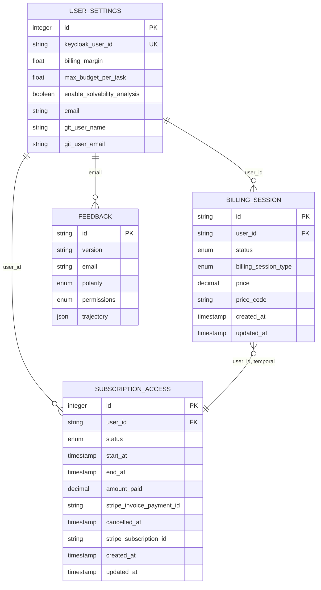
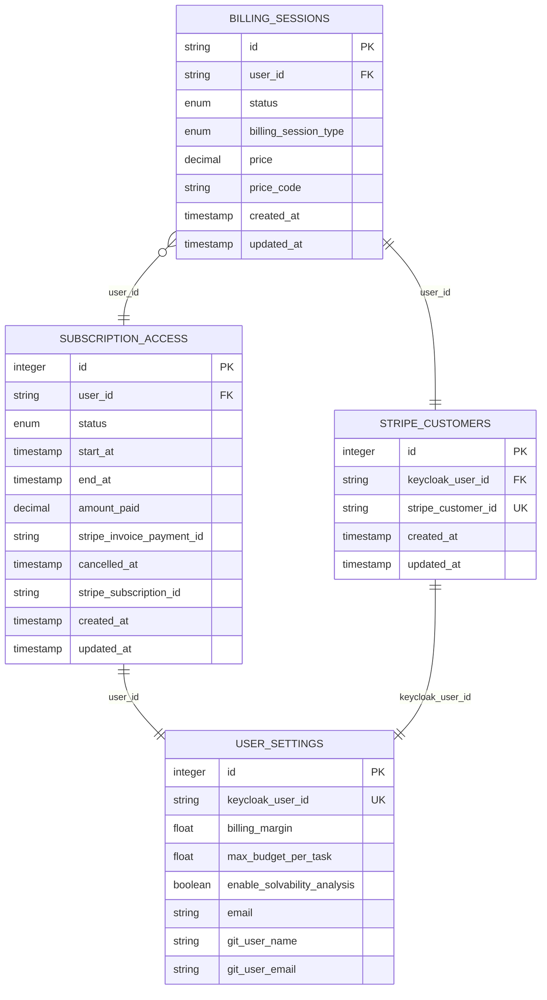

# Billing System Architecture

<cite>
**Referenced Files in This Document**   
- [billing_sessions.py](file://enterprise/storage/billing_session.py)
- [subscription_access.py](file://enterprise/storage/subscription_access.py)
- [user_settings.py](file://enterprise/storage/user_settings.py)
- [stripe_customer.py](file://enterprise/storage/stripe_customer.py)
- [004_create_billing_sessions_table.py](file://enterprise/migrations/versions/004_create_billing_sessions_table.py)
- [073_add_type_to_billing_sessions.py](file://enterprise/migrations/versions/073_add_type_to_billing_sessions.py)
- [074_create_subscription_access_table.py](file://enterprise/migrations/versions/074_create_subscription_access_table.py)
- [075_add_cancellation_fields_to_subscription_access.py](file://enterprise/migrations/versions/075_add_cancellation_fields_to_subscription_access.py)
- [001_create_feedback_table.py](file://enterprise/migrations/versions/001_create_feedback_table.py)
- [billing.types.ts](file://frontend/src/api/billing-service/billing.types.ts)
</cite>

## Table of Contents
1. [Introduction](#introduction)
2. [Data Model Overview](#data-model-overview)
3. [Entity Relationships](#entity-relationships)
4. [Field Definitions and Constraints](#field-definitions-and-constraints)
5. [Credit-Based Billing System](#credit-based-billing-system)
6. [Database Schema and Relationships](#database-schema-and-relationships)
7. [Data Access Patterns](#data-access-patterns)
8. [Data Lifecycle and Retention](#data-lifecycle-and-retention)
9. [Security and Compliance](#security-and-compliance)
10. [Conclusion](#conclusion)

## Introduction
The OpenHands billing system is designed to manage financial transactions, user subscriptions, and credit-based usage tracking for the SaaS platform. This document provides comprehensive documentation of the billing architecture, focusing on the core entities: BillingSession, SubscriptionAccess, UserSettings, and Feedback. The system integrates with Stripe for payment processing while maintaining local records for consistency and performance. The architecture supports both direct credit purchases and recurring monthly subscriptions, with robust data validation, security controls, and compliance measures for financial data handling.

## Data Model Overview
The billing system consists of four primary entities that work together to manage financial transactions and user access:

1. **BillingSession**: Tracks individual payment transactions initiated through Stripe
2. **SubscriptionAccess**: Manages user subscription status, duration, and payment information
3. **UserSettings**: Stores user-specific configuration including billing preferences and financial limits
4. **Feedback**: Captures user feedback that may include financial sentiment analysis

These entities are interconnected through the user_id field, creating a comprehensive financial profile for each user. The system is designed to handle high-volume billing events while maintaining data integrity and providing real-time balance information through caching mechanisms.

**Section sources**
- [billing_sessions.py](file://enterprise/storage/billing_session.py#L7-L45)
- [subscription_access.py](file://enterprise/storage/subscription_access.py#L7-L45)
- [user_settings.py](file://enterprise/storage/user_settings.py#L6-L40)

## Entity Relationships
The billing entities are related through a user-centric model where each user can have multiple billing sessions and at most one active subscription access record. The relationships are defined as follows:

- **User to BillingSession**: One-to-Many relationship - a user can initiate multiple billing sessions for credit purchases or subscription payments
- **User to SubscriptionAccess**: One-to-One relationship - a user can have only one subscription access record at a time, which tracks their current subscription status
- **User to UserSettings**: One-to-One relationship - each user has a single settings record that includes billing-related preferences and limits
- **BillingSession to SubscriptionAccess**: Indirect relationship - billing sessions of type MONTHLY_SUBSCRIPTION are associated with subscription access records through shared user_id and temporal correlation

The system uses the user_id as the primary foreign key across all billing-related tables, enabling efficient queries for user financial history and current status.

**Diagram sources**
- [billing_sessions.py](file://enterprise/storage/billing_session.py#L7-L45)
- [subscription_access.py](file://enterprise/storage/subscription_access.py#L7-L45)
- [user_settings.py](file://enterprise/storage/user_settings.py#L6-L40)
- [001_create_feedback_table.py](file://enterprise/migrations/versions/001_create_feedback_table.py#L23-L38)

## Field Definitions and Constraints
This section details the field definitions, data types, and constraints for the key fields in the billing system.

### BillingSession Fields
The BillingSession entity contains the following fields:

- **billing_session_id**: String, Primary Key - Unique identifier for the billing session, corresponds to Stripe session ID
- **user_id**: String, Not Null, Indexed - References the user who initiated the session
- **type**: Enum('DIRECT_PAYMENT', 'MONTHLY_SUBSCRIPTION'), Not Null, Default='DIRECT_PAYMENT' - Distinguishes between credit purchases and subscription payments
- **status**: Enum('in_progress', 'completed', 'cancelled', 'error'), Not Null, Default='in_progress' - Tracks the current state of the payment transaction
- **metrics**: Decimal(19,4), Not Null - Represents the monetary amount of the transaction in USD

**Section sources**
- [billing_sessions.py](file://enterprise/storage/billing_session.py#L15-L37)
- [004_create_billing_sessions_table.py](file://enterprise/migrations/versions/004_create_billing_sessions_table.py#L24-L41)

### SubscriptionAccess Fields
The SubscriptionAccess entity contains the following fields:

- **id**: Integer, Primary Key, Auto-increment - Unique database identifier
- **user_id**: String, Not Null, Indexed - References the subscribed user
- **status**: Enum('ACTIVE', 'DISABLED'), Not Null, Indexed - Current subscription status
- **start_at**: DateTime with timezone - Subscription start date and time
- **end_at**: DateTime with timezone - Subscription end date and time
- **cancelled_at**: DateTime with timezone - Timestamp when subscription was cancelled (nullable)
- **stripe_subscription_id**: String, Indexed - Reference to the Stripe subscription object

**Section sources**
- [subscription_access.py](file://enterprise/storage/subscription_access.py#L15-L31)
- [074_create_subscription_access_table.py](file://enterprise/migrations/versions/074_create_subscription_access_table.py#L31-L44)

### UserSettings Fields
The UserSettings entity contains billing-related fields:

- **billing_margin**: Float, Default=DEFAULT_BILLING_MARGIN - Percentage markup applied to usage costs
- **max_budget_per_task**: Float - Maximum spending limit for individual tasks
- **enable_solvability_analysis**: Boolean, Default=False - Controls whether solvability analysis is enabled
- **email**: String - User's email address for billing communications
- **git_user_name**: String - User's Git identity for repository operations

**Section sources**
- [user_settings.py](file://enterprise/storage/user_settings.py#L23-L40)

## Credit-Based Billing System
The credit-based billing system in OpenHands allows users to purchase credits that are consumed as they use platform resources. The system tracks usage and deducts from user balances through a well-defined process.

### Usage Tracking and Deduction
When a user performs operations that consume platform resources, the system calculates the cost based on predefined pricing models. The cost calculation considers:
- Compute time and resources used
- API calls and external service integrations
- Storage and data transfer costs
- Any applicable billing margin from user settings

The deduction process follows these steps:
1. Before executing a resource-intensive operation, the system checks the user's available balance
2. If sufficient funds are available, the estimated cost is reserved
3. After operation completion, the actual cost is calculated and deducted from the balance
4. The remaining balance is updated and cached for quick access

Direct payments through the BillingSession system allow users to add credits to their account, which are then available for deduction during usage.

### Business Logic
The business logic for credit-based billing includes:
- **Balance Validation**: All operations requiring payment are preceded by balance checks
- **Overdraft Prevention**: Users cannot perform operations that would exceed their available balance
- **Cost Estimation**: Users can request cost estimates before executing operations
- **Transaction Logging**: All deductions are logged with timestamps and operation details
- **Low Balance Alerts**: Users are notified when their balance falls below configurable thresholds

The system also supports subscription-based access, where users with active subscriptions (status='ACTIVE' and current date within start_at and end_at range) have unlimited access without per-operation charges.

**Section sources**
- [billing_sessions.py](file://enterprise/storage/billing_session.py#L7-L45)
- [subscription_access.py](file://enterprise/storage/subscription_access.py#L7-L45)
- [user_settings.py](file://enterprise/storage/user_settings.py#L23-L35)

## Database Schema and Relationships
The database schema for the billing system is designed for performance, data integrity, and ease of querying. The schema includes appropriate indexes, constraints, and data types to support the application's requirements.

**Diagram sources**
- [004_create_billing_sessions_table.py](file://enterprise/migrations/versions/004_create_billing_sessions_table.py#L23-L42)
- [074_create_subscription_access_table.py](file://enterprise/migrations/versions/074_create_subscription_access_table.py#L29-L45)
- [user_settings.py](file://enterprise/storage/user_settings.py#L6-L40)
- [stripe_customer.py](file://enterprise/storage/stripe_customer.py#L13-L25)

## Data Access Patterns
The billing system employs specific data access patterns optimized for performance and scalability.

### Billing Operations Access Patterns
- **Balance Checks**: Frequent read operations to retrieve current user balance, optimized with caching
- **Transaction Recording**: Write-heavy operations during billing sessions, batched when possible
- **Subscription Status Verification**: Real-time checks to determine user access level
- **Historical Queries**: Analytics and reporting queries that scan historical billing data

### Caching Strategies
The system implements caching strategies to handle frequent balance checks and improve performance:

- **Redis Caching**: User balances are cached in Redis with a configurable TTL
- **Cache Invalidation**: Cache entries are invalidated on successful transactions or balance updates
- **Fallback Mechanism**: When cache is unavailable, the system falls back to database queries
- **Preemptive Loading**: Commonly accessed user balances are pre-loaded during peak usage periods

The caching layer significantly reduces database load for balance queries, which are among the most frequent operations in the system.

### Performance Considerations
For high-volume billing events, the system incorporates several performance optimizations:

- **Database Indexing**: Critical fields like user_id, status, and timestamps are indexed
- **Connection Pooling**: Database connections are pooled to reduce connection overhead
- **Asynchronous Processing**: Non-critical operations are processed asynchronously
- **Batch Operations**: Related transactions are batched to reduce I/O operations
- **Query Optimization**: Complex queries are optimized with appropriate JOINs and filtering

The system is designed to handle spikes in billing activity, such as when multiple users initiate payments simultaneously.

**Section sources**
- [billing_sessions.py](file://enterprise/storage/billing_session.py)
- [subscription_access.py](file://enterprise/storage/subscription_access.py)
- [074_create_subscription_access_table.py](file://enterprise/migrations/versions/074_create_subscription_access_table.py#L48-L51)

## Data Lifecycle and Retention
The billing system implements data lifecycle policies to manage storage costs and comply with regulatory requirements.

### Retention Periods
- **Active Billing Sessions**: Retained for 7 years to comply with financial regulations
- **Completed Billing Sessions**: Moved to cold storage after 1 year, retained for 7 years total
- **Subscription Access Records**: Retained for 7 years from cancellation date
- **User Settings**: Retained for 1 year after account deletion
- **Feedback Records**: Retained for 3 years

### Archival Rules
The system follows these archival rules:

- **Automated Archival**: Records older than 1 year are automatically moved to archival storage
- **Access Patterns**: Archived data is accessible through a separate API with longer response times
- **Data Compression**: Archived records are compressed to reduce storage footprint
- **Integrity Checks**: Regular checksums verify the integrity of archived data

### Data Deletion
When records reach the end of their retention period:
- Personal information is anonymized
- Financial data is securely deleted using cryptographic erasure
- Audit logs of the deletion process are maintained
- Deletion is performed in batches during off-peak hours

The data lifecycle management ensures compliance with financial regulations while optimizing storage costs.

**Section sources**
- [billing_sessions.py](file://enterprise/storage/billing_session.py)
- [subscription_access.py](file://enterprise/storage/subscription_access.py)
- [user_settings.py](file://enterprise/storage/user_settings.py)

## Security and Compliance
The billing system implements robust security measures to protect financial information and ensure regulatory compliance.

### Data Security Requirements
- **Encryption at Rest**: All financial data is encrypted using AES-256
- **Encryption in Transit**: TLS 1.3 is required for all API communications
- **Field-Level Encryption**: Sensitive fields like payment identifiers are encrypted separately
- **Access Logging**: All access to billing data is logged with user context
- **Rate Limiting**: API endpoints are rate-limited to prevent abuse

### Privacy Compliance
The system complies with major privacy regulations:

- **GDPR Compliance**: 
  - Right to access and download billing data
  - Right to erasure with appropriate retention period exceptions
  - Data minimization principles applied
  - Privacy by design in all new features

- **CCPA Compliance**:
  - Right to know financial data collected
  - Right to opt-out of data sharing (where applicable)
  - Clear disclosure of financial data usage

### Access Control Mechanisms
The system implements multiple layers of access control:

- **Role-Based Access Control (RBAC)**: Different roles have different levels of access to billing data
- **Attribute-Based Access Control (ABAC)**: Access decisions consider user attributes and context
- **Multi-Factor Authentication**: Required for administrative access to billing systems
- **Audit Trails**: Comprehensive logs of all access and modifications to billing data
- **Separation of Duties**: Development and production environments are strictly separated

These security measures ensure that financial information is protected against unauthorized access and that the system meets industry standards for financial data handling.

**Section sources**
- [stripe_customer.py](file://enterprise/storage/stripe_customer.py#L7-L11)
- [user_settings.py](file://enterprise/storage/user_settings.py#L37-L40)
- [billing_sessions.py](file://enterprise/storage/billing_session.py)

## Conclusion
The OpenHands billing system architecture provides a robust foundation for managing financial transactions, user subscriptions, and credit-based usage tracking. The system's entity relationships between BillingSession, SubscriptionAccess, UserSettings, and Feedback create a comprehensive financial management solution that supports both direct payments and recurring subscriptions. With well-defined field constraints, clear business logic for credit-based billing, and optimized data access patterns, the system is designed for performance and scalability. The implementation of data lifecycle policies, retention periods, and archival rules ensures compliance with financial regulations, while comprehensive security measures protect sensitive financial information and ensure privacy compliance with GDPR and CCPA. The architecture balances functionality, performance, and security to provide a reliable billing solution for the OpenHands platform.