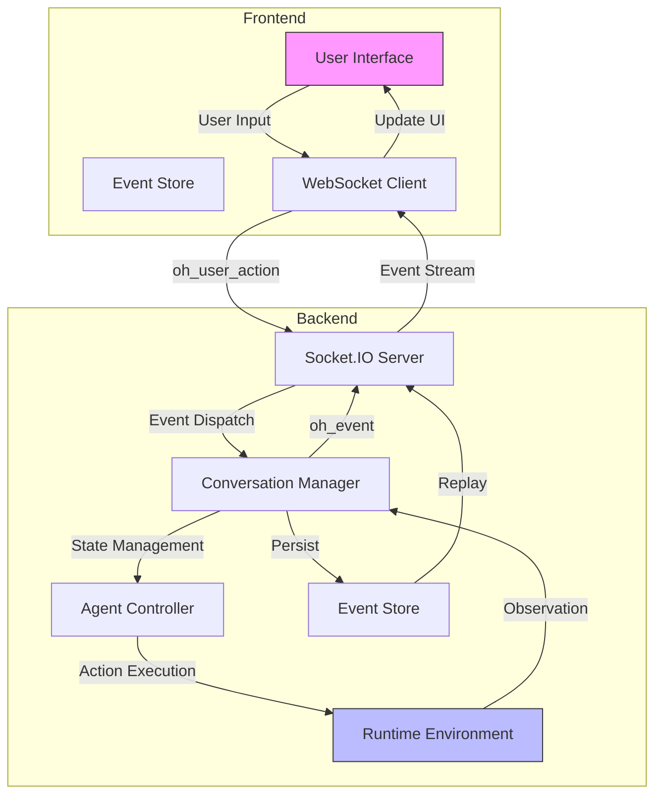
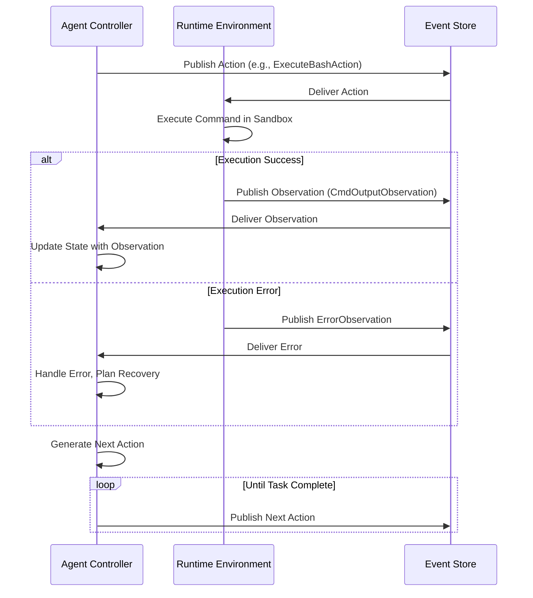
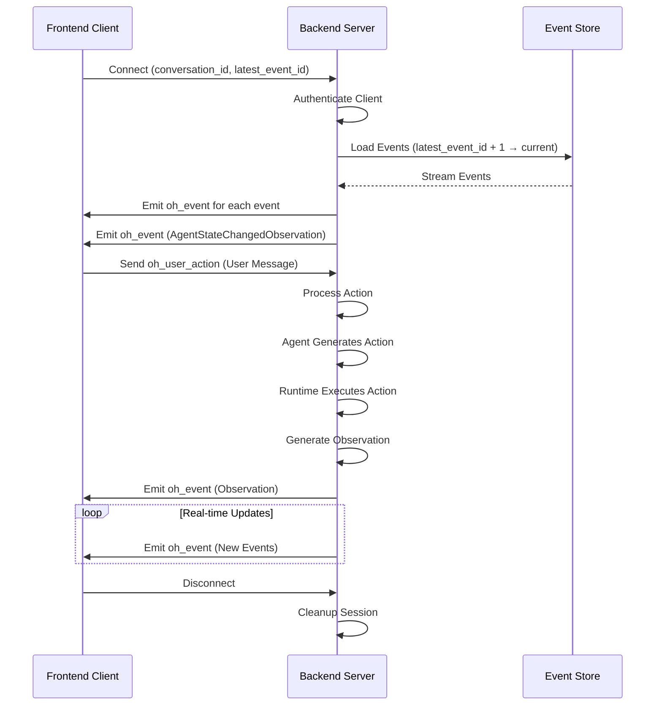
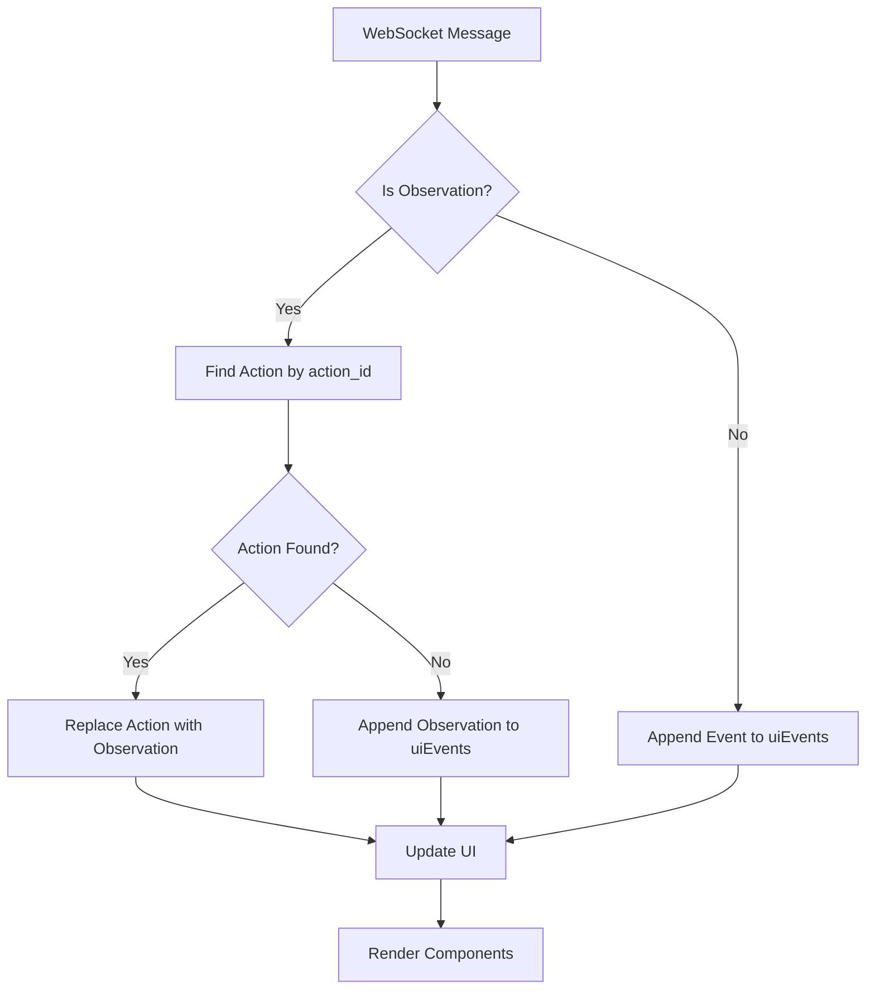

# Data Flow Between Layers

<cite>
**Referenced Files in This Document**   
- [event.py](file://openhands/events/event.py)
- [event_store.py](file://openhands/events/event_store.py)
- [listen_socket.py](file://openhands/server/listen_socket.py)
- [conversation_service.py](file://openhands/server/services/conversation_service.py)
- [v1_router.py](file://openhands/app_server/v1_router.py)
- [use-websocket.ts](file://frontend/src/hooks/use-websocket.ts)
- [use-event-store.ts](file://frontend/src/stores/use-event-store.ts)
- [handle-event-for-ui.ts](file://frontend/src/utils/handle-event-for-ui.ts)
- [agent.py](file://openhands/controller/agent.py)
- [loop.py](file://openhands/core/loop.py)
</cite>

## Table of Contents
1. [Introduction](#introduction)
2. [Event-Driven Architecture Overview](#event-driven-architecture-overview)
3. [Data Flow Lifecycle](#data-flow-lifecycle)
4. [Action-Observation Cycle](#action-observation-cycle)
5. [Event Store and Persistence](#event-store-and-persistence)
6. [WebSocket Communication](#websocket-communication)
7. [Frontend Event Processing](#frontend-event-processing)
8. [Error Handling and Propagation](#error-handling-and-propagation)
9. [Performance Optimization](#performance-optimization)
10. [Integration of Synchronous and Asynchronous Flows](#integration-of-synchronous-and-asynchronous-flows)

## Introduction

The OpenHands platform implements an event-driven architecture that facilitates real-time communication between clients and agents through a sophisticated data flow system. This document details the end-to-end data pathways from user input through frontend, backend, agent system, and back to the user interface. The architecture is built around an action-observation cycle that enables the agent to interact with its environment, receive feedback, and make decisions based on the observations.

The system manages multiple client sessions, each with its own agent instance, runtime environment, and security analyzer. This modular structure allows for easy extension and maintenance of different components while ensuring isolation between user sessions. The event-driven design facilitates real-time communication between clients and agents, enabling a responsive and interactive experience.

**Section sources**
- [README.md](file://openhands/README.md#L1-L24)
- [server/README.md](file://openhands/server/README.md#L182-L183)

## Event-Driven Architecture Overview

The OpenHands platform follows an event-driven architecture where components communicate through events rather than direct method calls. This decoupled approach enables scalability, fault tolerance, and real-time updates across the system. The core of this architecture is the EventStream, which serves as a central hub for all events, allowing any component to publish events or listen for events published by other components.

Events in the system are categorized into two main types: Actions and Observations. Actions represent requests to perform operations such as editing a file, running a command, or sending a message. Observations represent information collected from the environment, such as file contents or command output. This action-observation pattern creates a feedback loop that drives the agent's decision-making process.

The architecture supports both synchronous API calls for initial setup and configuration, and asynchronous event streams for real-time updates during agent execution. This hybrid approach ensures that the system can handle both immediate requests and ongoing, long-running processes efficiently.

**Diagram sources **
- [event.py](file://openhands/events/event.py#L1-L132)
- [listen_socket.py](file://openhands/server/listen_socket.py#L35-L169)

## Data Flow Lifecycle

The data flow lifecycle in OpenHands begins with user input from the frontend and progresses through multiple layers before returning results to the user interface. The lifecycle can be divided into several distinct phases: initialization, action processing, observation collection, and result presentation.

During initialization, when a user starts a new conversation, the frontend sends a request to create a conversation with initial parameters such as the selected repository, branch, and initial message. The backend processes this request, creates a new conversation session, and initializes the agent with the provided configuration. This phase involves synchronous API calls to establish the session state.

Once the session is established, the system transitions to the event-driven phase. The agent begins its execution loop, generating actions based on its current state and the task at hand. Each action is sent to the runtime environment for execution, which then produces observations that are fed back into the system. This action-observation cycle continues until the agent reaches a terminal state or completes its assigned task.

Throughout this lifecycle, events are persisted to disk through the EventStore, ensuring that the conversation history is maintained even if the connection is interrupted. When a client reconnects, it can request events from a specific point in time, allowing it to catch up on any events it missed during the disconnection.

**Section sources**
- [conversation_service.py](file://openhands/server/services/conversation_service.py#L34-L289)
- [v1_router.py](file://openhands/app_server/v1_router.py#L1-L19)

## Action-Observation Cycle

The action-observation cycle is the fundamental mechanism that drives agent behavior in the OpenHands platform. This cycle consists of the agent generating an action based on its current state, the action being executed in the runtime environment, and the resulting observation being processed to update the agent's state for the next iteration.

Actions in the system are represented by various action classes such as ExecuteBashAction, FileWriteAction, and AgentFinishAction. Each action contains the necessary information for the runtime to execute it, including parameters like the command to run or the file path and content for writing. When an agent decides on an action, it publishes this action to the event stream.

The runtime environment listens for action events and executes them in a sandboxed environment. After execution, the runtime generates an observation event containing the results. For example, executing a bash command produces a CmdOutputObservation with the command output and exit code, while writing a file generates a FileWriteObservation confirming the operation.

The agent controller processes these observations and adds them to the event history, which becomes part of the context for the next iteration of the agent's decision-making process. This creates a continuous feedback loop where the agent can adapt its strategy based on the outcomes of previous actions.

**Diagram sources **
- [agent.py](file://openhands/controller/agent.py#L1-L184)
- [event.py](file://openhands/events/event.py#L1-L132)

## Event Store and Persistence

The EventStore is a critical component of the OpenHands architecture, responsible for persisting all events in a conversation and providing access to the event history. It serves as the single source of truth for the state of a conversation, enabling features like session resumption, event replay, and audit logging.

The EventStore implementation uses a file-based storage system where each event is stored as a separate JSON file named with the event's ID. This approach allows for efficient sequential access to events while maintaining durability. The store maintains a cache of recently accessed events to improve performance for common access patterns, such as retrieving the latest events or iterating through the event stream.

When a client connects to a conversation, the EventStore is used to replay the event stream from a specified point in time. This allows the client to catch up on any events that occurred while it was disconnected. The replay process is optimized by loading events in pages, reducing the number of file system operations required to reconstruct the conversation state.

The EventStore also supports filtering and searching operations, enabling clients to retrieve specific subsets of events based on criteria such as event type, source, or timestamp. This functionality is used by the frontend to display different views of the conversation history, such as showing only user messages or filtering by action type.

**Section sources**
- [event_store.py](file://openhands/events/event_store.py#L1-L184)
- [conversation_service.py](file://openhands/server/services/conversation_service.py#L34-L289)

## WebSocket Communication

WebSocket communication is the primary mechanism for real-time updates between the OpenHands frontend and backend. The system uses Socket.IO, a library that provides a WebSocket-like interface with additional features like automatic reconnection and fallback mechanisms for environments where WebSockets are not available.

When a client connects to a conversation, it establishes a WebSocket connection to the server with query parameters including the conversation ID and the ID of the last event the client has processed. This allows the server to replay any missed events before streaming new ones, ensuring the client's state remains synchronized with the server.

The server handles several WebSocket events:
- connect: Triggered when a client connects, used to authenticate the client and replay missed events
- oh_user_action: Received from the client when the user performs an action, such as sending a message
- oh_action: Similar to oh_user_action but maintained for backward compatibility
- disconnect: Triggered when a client disconnects, used to clean up session resources

Each event in the system is broadcast to all connected clients for a conversation, enabling real-time collaboration features. The server also handles error conditions gracefully, disconnecting clients with appropriate error messages when authentication fails or other critical errors occur.

**Diagram sources **
- [listen_socket.py](file://openhands/server/listen_socket.py#L35-L169)
- [use-websocket.ts](file://frontend/src/hooks/use-websocket.ts#L1-L86)

## Frontend Event Processing

The frontend of the OpenHands platform implements a sophisticated event processing system that transforms raw events from the backend into a user-friendly interface. This processing occurs in multiple stages, from receiving events over the WebSocket connection to updating the UI components.

The core of the frontend event system is the useEventStore hook, which maintains two arrays of events: the raw events array and the uiEvents array. The raw events array contains all events received from the server in chronological order, while the uiEvents array contains events in the order and format suitable for display in the user interface.

A key aspect of event processing is handling the relationship between actions and observations. When an observation event is received, the system looks for the corresponding action in the uiEvents array and replaces it with the observation. This creates a seamless user experience where actions are automatically updated with their results, such as showing command output immediately after displaying the command.

The handleEventForUI function implements this logic, determining how each event should be incorporated into the uiEvents array. For non-observation events, the event is simply appended to the end of the array. For observation events, the function searches for the corresponding action by matching the action_id field and replaces it with the observation.

**Diagram sources **
- [use-event-store.ts](file://frontend/src/stores/use-event-store.ts#L1-L39)
- [handle-event-for-ui.ts](file://frontend/src/utils/handle-event-for-ui.ts#L1-L31)

## Error Handling and Propagation

Error handling in the OpenHands platform is designed to be comprehensive and user-friendly, with mechanisms for detecting, reporting, and recovering from errors at multiple levels of the system. Errors can originate from various sources, including the agent itself, the runtime environment, or external services.

When an error occurs in the runtime environment, such as a command failing with a non-zero exit code or a file operation encountering a permission error, the runtime generates an ErrorObservation event. This observation includes details about the error, such as the error message and type, which are then processed by the agent controller and added to the event history.

The agent itself can also generate errors, such as when it encounters a situation it cannot handle or when it detects a security risk in an action it was about to perform. In these cases, the agent may generate an AgentStateChangedObservation with a state of ERROR, which propagates through the system and is displayed to the user.

The frontend implements error handling at multiple levels. At the WebSocket level, connection errors and authentication failures are caught and displayed to the user. At the event processing level, error observations are rendered with appropriate visual indicators to draw the user's attention. The system also provides mechanisms for users to recover from errors, such as retrying failed actions or providing additional information to help the agent overcome obstacles.

**Section sources**
- [event.py](file://openhands/events/event.py#L1-L132)
- [listen_socket.py](file://openhands/server/listen_socket.py#L22-L38)
- [use-event-store.ts](file://frontend/src/stores/use-event-store.ts#L1-L39)

## Performance Optimization

The OpenHands platform implements several performance optimizations to ensure responsive user experiences even during complex, long-running tasks. These optimizations span multiple layers of the system, from data storage to network communication and UI rendering.

One key optimization is the use of event caching in the EventStore. By loading events in pages rather than individually, the system reduces the number of file system operations required to access the event history. The cache size is configurable, allowing administrators to balance memory usage with performance requirements.

Network efficiency is improved through the use of event filtering and selective event replay. When a client connects, it only receives events that occurred after its last known event, reducing bandwidth usage. The system also supports filtering events by type, allowing clients to subscribe only to the events they need for their current view.

On the frontend, performance is optimized through the use of React's state management and efficient event processing. The event store uses Zustand for state management, which provides efficient updates and subscriptions. The handleEventForUI function is designed to minimize unnecessary re-renders by creating new arrays only when needed and preserving unchanged events.

The agent execution loop also includes performance considerations, with mechanisms to prevent excessive resource usage and to handle long-running tasks efficiently. The system monitors the agent's progress and can intervene if it detects patterns that suggest the agent is stuck in a loop or making insufficient progress toward its goal.

**Section sources**
- [event_store.py](file://openhands/events/event_store.py#L1-L184)
- [loop.py](file://openhands/core/loop.py#L1-L46)
- [use-event-store.ts](file://frontend/src/stores/use-event-store.ts#L1-L39)

## Integration of Synchronous and Asynchronous Flows

The OpenHands platform seamlessly integrates synchronous API calls with asynchronous event streams to provide a responsive user experience while handling long-running agent tasks. This hybrid approach leverages the strengths of both communication patterns, using synchronous calls for immediate operations and asynchronous streams for ongoing processes.

Synchronous API calls are used for operations that have a well-defined beginning and end, such as creating a new conversation, retrieving conversation metadata, or listing available conversations. These operations typically complete quickly and return a definitive result to the client. The REST API endpoints in the app_conversation_router handle these synchronous operations, returning JSON responses to the client.

Asynchronous event streams are used for the core agent interaction, where the duration and outcome are uncertain. Once a conversation is established, the system switches to WebSocket-based communication for real-time updates. This allows the frontend to display incremental progress as the agent works, rather than making the user wait for the entire task to complete.

The integration between these two flows is managed through the conversation lifecycle. A synchronous API call initiates the conversation and returns a conversation ID, which is then used to establish an asynchronous WebSocket connection. This connection remains open for the duration of the conversation, streaming events as they occur. If the connection is interrupted, the client can use synchronous API calls to check the conversation status and then re-establish the WebSocket connection to continue receiving events.

This architecture provides the best of both worlds: the simplicity and reliability of synchronous operations for setup and management, combined with the responsiveness and real-time capabilities of asynchronous event streams for agent interaction.

**Section sources**
- [app_conversation_router.py](file://openhands/app_server/app_conversation/app_conversation_router.py#L1-L308)
- [v1_router.py](file://openhands/app_server/v1_router.py#L1-L19)
- [listen_socket.py](file://openhands/server/listen_socket.py#L35-L169)