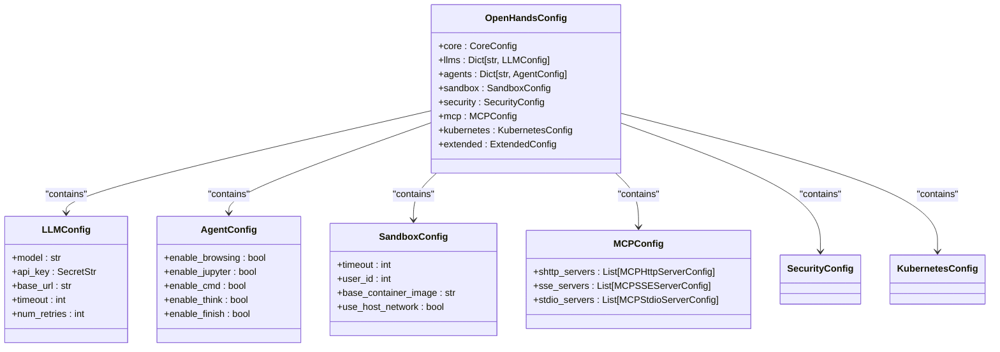
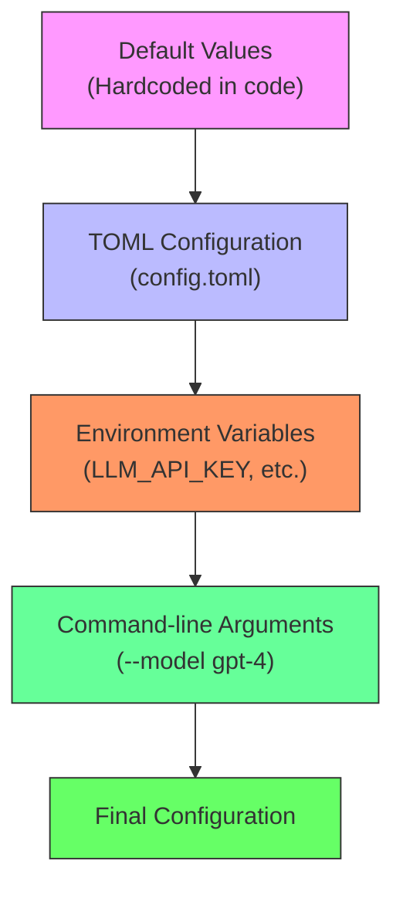
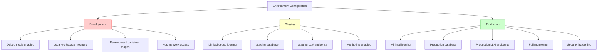
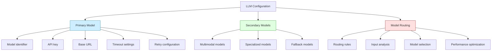
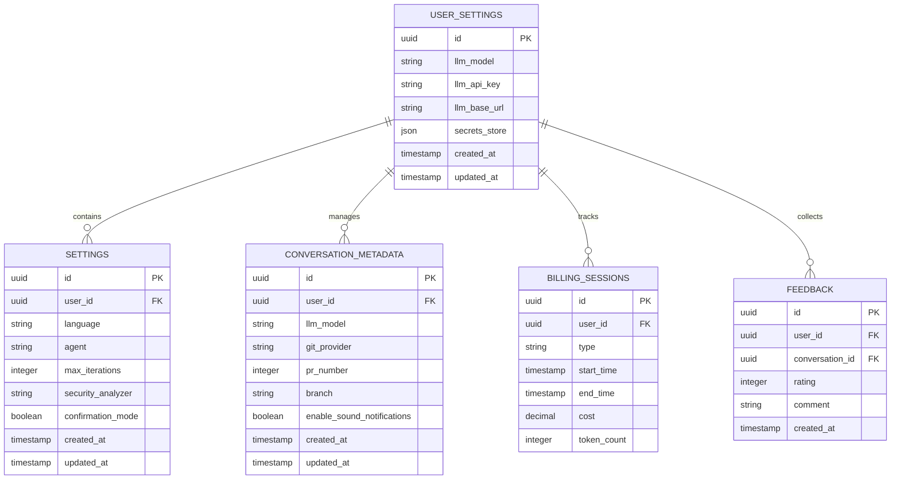
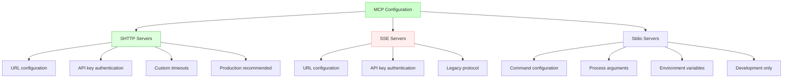
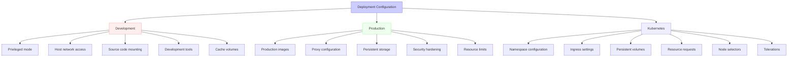
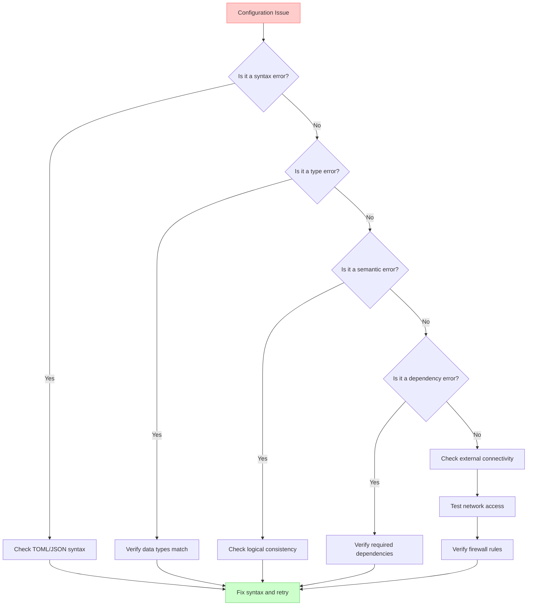

```mermaid
graph TD
A["Security Configuration"] --> B["Authentication"]
A --> C["Authorization"]
A --> D["Data Protection"]
A --> E["Network Security"]
A --> F["Feature Security"]
B --> B1["GitHub OAuth"]
B --> B2["GitLab OAuth"]
B --> B3["Bitbucket OAuth"]
B --> B4["Enterprise SSO"]
B --> B5["JIRA Integration"]
B --> B6["Linear Integration"]
C --> C1["Role-based access"]
C --> C2["Permission levels"]
C --> C3["Feature flags"]
D --> D1["SecretStr masking"]
D --> D2["JWT authentication"]
D --> D3["Secure storage"]
D --> D4["Data encryption"]
E --> E1["HTTPS enforcement"]
E --> E2["CORS policies"]
E --> E3["Network isolation"]
F --> F1["Confirmation mode"]
F --> F2["Security analyzer"]
F --> F3["Command restrictions"]
F --> F4["Sandboxing"]
style A fill:#ffcccc,stroke:#f66
style B fill:#ffeeee,stroke:#f88
style C fill:#ffeeee,stroke:#f88
style D fill:#ffeeee,stroke:#f88
style E fill:#ffeeee,stroke:#f88
style F fill:#ffeeee,stroke:#f88
```

# Environment Configuration

<cite>
**Referenced Files in This Document**   
- [config.toml](file://config.toml)
- [config.template.toml](file://config.template.toml)
- [enterprise/server/config.py](file://enterprise/server/config.py)
- [openhands/core/config/utils.py](file://openhands/core/config/utils.py)
- [openhands/server/config/server_config.py](file://openhands/server/config/server_config.py)
- [containers/dev/compose.yml](file://containers/dev/compose.yml)
- [docker-compose.yml](file://docker-compose.yml)
- [enterprise/server/auth/constants.py](file://enterprise/server/auth/constants.py)
- [openhands/storage/data_models/settings.py](file://openhands/storage/data_models/settings.py)
</cite>

## Table of Contents
1. [Introduction](#introduction)
2. [Configuration System Overview](#configuration-system-overview)
3. [Configuration Sources and Hierarchy](#configuration-sources-and-hierarchy)
4. [Environment-Specific Configuration](#environment-specific-configuration)
5. [LLM Configuration](#llm-configuration)
6. [Database and Storage Configuration](#database-and-storage-configuration)
7. [Security Configuration](#security-configuration)
8. [MCP Configuration](#mcp-configuration)
9. [Deployment Configuration](#deployment-configuration)
10. [Configuration Validation and Troubleshooting](#configuration-validation-and-troubleshooting)
11. [Best Practices](#best-practices)

## Introduction

The OpenHands platform provides a comprehensive configuration system that enables flexible deployment across different environments, from development to production. This document details the environment configuration options, configuration file structure, environment variables, and their hierarchical override system. It covers the setup and customization of the platform for various deployment scenarios, including LLM provider configuration, database connections, security settings, and integration with external services.

The configuration system is designed to be both powerful and user-friendly, supporting multiple configuration sources with a clear precedence hierarchy. This allows organizations to customize the platform according to their specific requirements while maintaining consistency across different deployment environments.

**Section sources**
- [config.toml](file://config.toml)
- [config.template.toml](file://config.template.toml)

## Configuration System Overview

OpenHands employs a multi-layered configuration system that combines TOML configuration files, environment variables, and command-line arguments. The core configuration is managed through the `OpenHandsConfig` class, which serves as the central repository for all configuration settings.

The configuration system is organized into several logical sections, each responsible for a specific aspect of the platform:

- **Core**: General application settings including workspace paths, debugging options, and file storage
- **LLM**: Language model configuration including model selection, API keys, and connection parameters
- **Agent**: Agent-specific settings such as enabled tools, browsing capabilities, and prompt extensions
- **Sandbox**: Sandbox environment configuration including container images, resource limits, and network settings
- **Security**: Security-related settings including confirmation mode and security analyzers
- **Condenser**: Conversation history management and compression settings
- **MCP**: Model Context Protocol server configuration for external tool integration
- **Kubernetes**: Kubernetes-specific settings for cluster deployment

The configuration system supports both simple key-value pairs and complex nested structures, allowing for sophisticated configuration scenarios. Sensitive data such as API keys are handled securely using `SecretStr` types that mask their values in logs and debugging output.



**Diagram sources**
- [openhands/core/config/utils.py](file://openhands/core/config/utils.py#L28)
- [openhands/core/config/llm_config.py](file://openhands/core/config/llm_config.py)
- [openhands/core/config/agent_config.py](file://openhands/core/config/agent_config.py)
- [openhands/core/config/sandbox_config.py](file://openhands/core/config/sandbox_config.py)
- [openhands/core/config/mcp_config.py](file://openhands/core/config/mcp_config.py)

**Section sources**
- [openhands/core/config/utils.py](file://openhands/core/config/utils.py#L28)
- [config.template.toml](file://config.template.toml)

## Configuration Sources and Hierarchy

The OpenHands configuration system supports multiple sources with a well-defined precedence hierarchy. Configuration values are loaded in the following order, with later sources overriding earlier ones:

1. **Default values**: Hardcoded defaults defined in the configuration classes
2. **TOML configuration files**: Settings from `config.toml` or a specified configuration file
3. **Environment variables**: Values from the environment following the naming convention
4. **Command-line arguments**: Parameters passed directly to the application

The primary configuration file is `config.toml`, which uses the TOML format for structured configuration. A template file `config.template.toml` is provided with comprehensive documentation of all available options. The configuration loading process is handled by the `load_app_config()` function, which orchestrates the loading from all sources and applies final validations.

Environment variables follow a specific naming convention: uppercase class prefix followed by the field name (e.g., `LLM_API_KEY`, `AGENT_MEMORY_ENABLED`). This convention enables automatic mapping of environment variables to configuration attributes. The system handles type conversion automatically, supporting strings, integers, booleans, and complex types like dictionaries and lists.

The configuration hierarchy allows for flexible deployment scenarios. For example, default settings can be defined in `config.toml` for a specific environment, while sensitive information like API keys can be provided through environment variables for security. Command-line arguments provide the highest precedence, allowing temporary overrides for testing or debugging.



**Diagram sources**
- [openhands/core/config/utils.py](file://openhands/core/config/utils.py#L39)
- [openhands/core/config/README.md](file://openhands/core/config/README.md)

**Section sources**
- [openhands/core/config/utils.py](file://openhands/core/config/utils.py#L39)
- [openhands/core/config/README.md](file://openhands/core/config/README.md)

## Environment-Specific Configuration

OpenHands supports different deployment environments through environment-specific configuration files and environment variables. The platform can be configured for development, staging, and production environments with appropriate settings for each.

For development environments, the `containers/dev/compose.yml` file provides a Docker Compose configuration that sets up the development environment with appropriate volume mounts and network settings. Key development configuration options include:

- Debug mode enabled for detailed logging
- Local workspace mounting for code editing
- Development container images
- Host network access for debugging

```yaml
services:
  dev:
    environment:
      - BACKEND_HOST=0.0.0.0
      - SANDBOX_API_HOSTNAME=host.docker.internal
      - DOCKER_HOST_ADDR=host.docker.internal
    volumes:
      - ${WORKSPACE_BASE:-$PWD/workspace}:/opt/workspace_base
      - ${OPENHANDS_WORKSPACE:-../../}:/app
```

For production environments, the `docker-compose.yml` file provides the production deployment configuration with security-focused settings:

```yaml
services:
  openhands:
    environment:
      - SANDBOX_RUNTIME_CONTAINER_IMAGE=openhands-runtime:local
      - WORKSPACE_MOUNT_PATH=${WORKSPACE_BASE:-$PWD/workspace}
      - http_proxy=${http_proxy:-}
      - https_proxy=${https_proxy:-}
      - no_proxy=${no_proxy:-localhost,127.0.0.1}
```

The server configuration also supports different modes through the `AppMode` enum, with `OSS` for open-source deployments and `SAAS` for enterprise SaaS deployments. The `SaaSServerConfig` class extends the base `ServerConfig` with additional enterprise features like billing, JIRA integration, and maintenance windows.

Environment-specific settings can also be managed through environment variables, allowing for configuration without modifying configuration files. This is particularly useful for sensitive information and settings that vary between deployment environments.



**Diagram sources**
- [containers/dev/compose.yml](file://containers/dev/compose.yml)
- [docker-compose.yml](file://docker-compose.yml)
- [enterprise/server/config.py](file://enterprise/server/config.py)

**Section sources**
- [containers/dev/compose.yml](file://containers/dev/compose.yml)
- [docker-compose.yml](file://docker-compose.yml)
- [enterprise/server/config.py](file://enterprise/server/config.py)

## LLM Configuration

The LLM (Large Language Model) configuration is a critical component of the OpenHands platform, as it determines the AI capabilities and performance characteristics. The configuration supports multiple LLM providers and allows for sophisticated routing between different models based on specific criteria.

The primary LLM configuration is defined in the `[llm]` section of the configuration file or through environment variables prefixed with `LLM_`. Key configuration options include:

- **model**: The model identifier (e.g., "gpt-4o", "gpt-3.5-turbo")
- **api_key**: The API key for authentication with the LLM provider
- **base_url**: The base URL for the LLM API endpoint
- **timeout**: Request timeout in seconds
- **num_retries**: Number of retry attempts on failure
- **temperature**: Sampling temperature for response generation
- **drop_params**: Whether to drop unsupported parameters without error

The platform supports configuration of multiple LLM profiles, allowing different agents or scenarios to use different models. Custom LLM configurations can be defined using named sections:

```toml
[llm.gpt4o-mini]
api_key = ""
model = "gpt-4o"

[llm.secondary_model]
model = "kimi-k2"
api_key = ""
for_routing = true
max_input_tokens = 128000
```

For enterprise deployments, additional LLM configuration options are available through environment variables:

```python
GITHUB_APP_CLIENT_ID = os.getenv('GITHUB_APP_CLIENT_ID', '').strip()
GITHUB_APP_CLIENT_SECRET = os.getenv('GITHUB_APP_CLIENT_SECRET', '').strip()
KEYCLOAK_SERVER_URL = os.getenv('KEYCLOAK_SERVER_URL', '').rstrip('/')
```

The configuration system also supports advanced LLM features such as:

- **Model routing**: Intelligent switching between different LLM models based on input characteristics
- **Prompt caching**: Utilizing LLM provider caching features when available
- **Safety settings**: Configurable safety thresholds for content moderation
- **Cost tracking**: Configuration of cost per token for budget management

The LLM configuration is validated during startup, and missing or invalid settings result in appropriate error messages to guide configuration correction.



**Diagram sources**
- [config.toml](file://config.toml)
- [config.template.toml](file://config.template.toml)
- [enterprise/server/auth/constants.py](file://enterprise/server/auth/constants.py)

**Section sources**
- [config.toml](file://config.toml)
- [config.template.toml](file://config.template.toml)
- [enterprise/server/auth/constants.py](file://enterprise/server/auth/constants.py)

## Database and Storage Configuration

The OpenHands platform uses a comprehensive storage system to manage user data, conversations, settings, and other persistent information. The configuration supports multiple storage backends and database integration for both open-source and enterprise deployments.

The storage configuration is primarily managed through the `Settings` class in the `openhands.storage.data_models.settings` module. This class defines the structure of user settings and their storage mechanism. Key aspects of the storage configuration include:

- **Settings storage**: User preferences, LLM configurations, and agent settings
- **Conversation storage**: Complete conversation histories and metadata
- **Secrets storage**: Secure storage of API keys and other sensitive information
- **File storage**: Workspace files and uploaded content

For enterprise deployments, the platform uses a database-backed storage system with specific configuration classes:

```python
class SaaSServerConfig(ServerConfig):
    settings_store_class: str = 'storage.saas_settings_store.SaasSettingsStore'
    secret_store_class: str = 'storage.saas_secrets_store.SaasSecretsStore'
    conversation_store_class: str = 'storage.saas_conversation_store.SaasConversationStore'
```

The database schema includes tables for various entities:

- **settings**: User preferences and configuration
- **user_settings**: User-specific settings with secrets storage
- **conversation_metadata**: Conversation tracking and metadata
- **feedback**: User feedback on agent performance
- **billing_sessions**: Billing and subscription information

The configuration system supports merging settings from different sources, with priority given to configuration file settings for MCP (Model Context Protocol) configurations:

```python
def merge_with_config_settings(self) -> 'Settings':
    """Merge config.toml settings with stored settings.
    
    Config.toml takes priority for MCP settings, but they are merged rather than replaced.
    """
    config_settings = Settings.from_config()
    if not config_settings or not config_settings.mcp_config:
        return self
        
    if not self.mcp_config:
        self.mcp_config = config_settings.mcp_config
        return self
        
    # Merge with config.toml taking priority
    merged_mcp = MCPConfig(
        sse_servers=list(config_settings.mcp_config.sse_servers) + list(self.mcp_config.sse_servers),
        stdio_servers=list(config_settings.mcp_config.stdio_servers) + list(self.mcp_config.stdio_servers),
        shttp_servers=list(config_settings.mcp_config.shttp_servers) + list(self.mcp_config.shttp_servers),
    )
    self.mcp_config = merged_mcp
    return self
```

Sensitive data such as API keys are handled securely using `SecretStr` types that mask their values in logs and debugging output:

```python
def test_settings_handles_sensitive_data():
    settings = Settings(
        llm_api_key='test-key',
    )
    assert str(settings.llm_api_key) == '**********'
    assert settings.llm_api_key.get_secret_value() == 'test-key'
```

The storage system also supports various file storage backends, including local storage, S3, and Google Cloud Storage, configurable through the `file_store` and `file_store_path` settings.



**Diagram sources**
- [openhands/storage/data_models/settings.py](file://openhands/storage/data_models/settings.py)
- [enterprise/migrations/versions/](file://enterprise/migrations/versions/)

**Section sources**
- [openhands/storage/data_models/settings.py](file://openhands/storage/data_models/settings.py)
- [enterprise/server/config.py](file://enterprise/server/config.py)

## Security Configuration

The OpenHands platform provides comprehensive security configuration options to protect user data, manage authentication, and control access to sensitive features. The security configuration system is designed to be flexible, supporting both simple deployments and enterprise-grade security requirements.

The security configuration is managed through multiple layers:

1. **Authentication**: User authentication and identity management
2. **Authorization**: Access control and permission management
3. **Data protection**: Encryption and secure storage of sensitive information
4. **Network security**: Secure communication and network isolation
5. **Feature security**: Control over potentially risky features

For authentication, the platform supports multiple identity providers through environment variables:

```python
GITHUB_APP_CLIENT_ID = os.getenv('GITHUB_APP_CLIENT_ID', '').strip()
GITHUB_APP_CLIENT_SECRET = os.getenv('GITHUB_APP_CLIENT_SECRET', '').strip()
GITLAB_APP_CLIENT_ID = os.getenv('GITLAB_APP_CLIENT_ID', '').strip()
GITLAB_APP_CLIENT_SECRET = os.getenv('GITLAB_APP_CLIENT_SECRET', '').strip()
BITBUCKET_APP_CLIENT_ID = os.getenv('BITBUCKET_APP_CLIENT_ID', '').strip()
BITBUCKET_APP_CLIENT_SECRET = os.getenv('BITBUCKET_APP_CLIENT_SECRET', '').strip()
```

Enterprise deployments can enable additional authentication methods:

```python
ENABLE_ENTERPRISE_SSO = os.getenv('ENABLE_ENTERPRISE_SSO', '').strip()
ENABLE_JIRA = os.environ.get('ENABLE_JIRA', 'false') == 'true'
ENABLE_JIRA_DC = os.environ.get('ENABLE_JIRA_DC', 'false') == 'true'
ENABLE_LINEAR = os.environ.get('ENABLE_LINEAR', 'false') == 'true'
```

The security configuration also includes options for security analysis and confirmation mode:

```toml
[security]
# Enable confirmation mode (For Headless / CLI only -  In Web this is overridden by Session Init)
confirmation_mode = false

# The security analyzer to use (For Headless / CLI only -  In Web this is overridden by Session Init)
# Available options: 'llm' (default), 'invariant'
security_analyzer = "llm"

# Whether to enable security analyzer
enable_security_analyzer = true
```

Sensitive data is protected using secure storage mechanisms and masked in logs:

```python
class Settings(BaseModel):
    llm_api_key: SecretStr | None = None
    search_api_key: SecretStr | None = None
    sandbox_api_key: SecretStr | None = None
    llm_api_key_for_byor: str | None = None
    
    def model_dump(self, *args, **kwargs) -> dict:
        d = super().model_dump(*args, **kwargs)
        # Ensure secrets are properly handled
        for k, v in d.items():
            if isinstance(v, SecretStr):
                d[k] = v.get_secret_value() if v else None
        return d
```

The platform also supports JWT-based authentication with automatically generated secrets:

```python
def get_or_create_jwt_secret(file_store: FileStore) -> str:
    try:
        jwt_secret = file_store.read(JWT_SECRET)
        return jwt_secret
    except FileNotFoundError:
        new_secret = uuid4().hex
        file_store.write(JWT_SECRET, new_secret)
        return new_secret
```

For enterprise deployments, additional security features are available:

```python
class SaaSServerConfig(ServerConfig):
    enable_jira = ENABLE_JIRA
    enable_jira_dc = ENABLE_JIRA_DC
    enable_linear = ENABLE_LINEAR
    maintenance_start_time: str = os.environ.get('MAINTENANCE_START_TIME', '')
```



**Diagram sources**
- [enterprise/server/auth/constants.py](file://enterprise/server/auth/constants.py)
- [openhands/storage/data_models/settings.py](file://openhands/storage/data_models/settings.py)
- [openhands/core/config/utils.py](file://openhands/core/config/utils.py)

**Section sources**
- [enterprise/server/auth/constants.py](file://enterprise/server/auth/constants.py)
- [openhands/storage/data_models/settings.py](file://openhands/storage/data_models/settings.py)

## MCP Configuration

The Model Context Protocol (MCP) configuration enables integration with external tool servers, extending the capabilities of the OpenHands platform. MCP allows the agent to communicate with various external services using different transport protocols.

The MCP configuration is defined in the `[mcp]` section of the configuration file and supports three transport protocols:

1. **SHTTP (Streamable HTTP)**: Recommended for production use
2. **SSE (Server-Sent Events)**: Legacy protocol
3. **Stdio**: Direct process communication for development

```toml
[mcp]
# SHTTP servers - Streamable HTTP transport (recommended)
shttp_servers = [
    # Basic SHTTP server with default 60s timeout
    "https://api.example.com/mcp/shttp",
    
    # SHTTP server with custom timeout for long-running tools
    {
        url = "https://api.example.com/mcp/shttp",
        api_key = "your-api-key",
        timeout = 180  # 3 minutes for processing-heavy tools (1-3600 seconds)
    }
]

# SSE servers - Server-Sent Events transport (legacy)
sse_servers = [
    # Basic SSE server with just a URL
    "http://localhost:8080/mcp/sse",
    
    # SSE server with authentication
    {url = "https://api.example.com/mcp/sse", api_key = "your-api-key"}
]

# Stdio servers - Direct process communication (development only)
stdio_servers = [
    # Basic stdio server
    {name = "filesystem", command = "npx", args = ["@modelcontextprotocol/server-filesystem", "/"]},
    
    # Stdio server with environment variables
    {
        name = "fetch",
        command = "uvx",
        args = ["mcp-server-fetch"],
        env = {DEBUG = "true"}
    }
]
```

The MCP configuration system supports merging settings from different sources, with configuration file settings taking priority:

```python
def merge_with_config_settings(self) -> 'Settings':
    """Merge config.toml settings with stored settings.
    
    Config.toml takes priority for MCP settings, but they are merged rather than replaced.
    """
    config_settings = Settings.from_config()
    if not config_settings or not config_settings.mcp_config:
        return self
        
    if not self.mcp_config:
        self.mcp_config = config_settings.mcp_config
        return self
        
    # Merge with config.toml taking priority
    merged_mcp = MCPConfig(
        sse_servers=list(config_settings.mcp_config.sse_servers) + list(self.mcp_config.sse_servers),
        stdio_servers=list(config_settings.mcp_config.stdio_servers) + list(self.mcp_config.stdio_servers),
        shttp_servers=list(config_settings.mcp_config.shttp_servers) + list(self.mcp_config.shttp_servers),
    )
    self.mcp_config = merged_mcp
    return self
```

The platform also supports dynamic addition of MCP servers at runtime:

```python
def test_get_mcp_config_with_extra_stdio_servers(self):
    """Test MCP config with extra stdio servers."""
    # Set up initial MCP config
    initial_stdio_server = MCPStdioServerConfig(name='initial', command='python')
    self.runtime.config.mcp = MCPConfig(stdio_servers=[initial_stdio_server])
    
    # Add extra stdio servers
    extra_servers = [
        MCPStdioServerConfig(name='extra1', command='node'),
        MCPStdioServerConfig(name='extra2', command='java'),
    ]
    
    result = self.runtime.get_mcp_config(extra_stdio_servers=extra_servers)
    
    # Should have all three servers
    assert len(result.stdio_servers) == 3
```

The MCP configuration is validated during startup, and invalid configurations result in appropriate error messages to guide correction.



**Diagram sources**
- [config.template.toml](file://config.template.toml)
- [openhands/storage/data_models/settings.py](file://openhands/storage/data_models/settings.py)
- [tests/unit/cli/test_cli_runtime_mcp.py](file://tests/unit/cli/test_cli_runtime_mcp.py)

**Section sources**
- [config.template.toml](file://config.template.toml)
- [openhands/storage/data_models/settings.py](file://openhands/storage/data_models/settings.py)

## Deployment Configuration

The OpenHands platform provides flexible deployment options through Docker and Docker Compose configurations. The deployment configuration supports both development and production environments with appropriate settings for each.

The primary deployment configuration files are:

- **containers/dev/compose.yml**: Development environment configuration
- **docker-compose.yml**: Production environment configuration
- **containers/app/Dockerfile**: Application container definition
- **containers/dev/Dockerfile**: Development container definition

The development environment configuration provides a comprehensive setup for local development:

```yaml
services:
  dev:
    privileged: true
    build:
      context: ${OPENHANDS_WORKSPACE:-../../}
      dockerfile: ./containers/dev/Dockerfile
    image: openhands:dev
    container_name: openhands-dev
    environment:
      - BACKEND_HOST=${BACKEND_HOST:-"0.0.0.0"}
      - SANDBOX_API_HOSTNAME=host.docker.internal
      - DOCKER_HOST_ADDR=host.docker.internal
      - SANDBOX_RUNTIME_CONTAINER_IMAGE=${SANDBOX_RUNTIME_CONTAINER_IMAGE:-ghcr.io/all-hands-ai/runtime:0.59-nikolaik}
      - SANDBOX_USER_ID=${SANDBOX_USER_ID:-1234}
      - WORKSPACE_MOUNT_PATH=${WORKSPACE_BASE:-$PWD/workspace}
    ports:
      - "3000:3000"
    extra_hosts:
      - "host.docker.internal:host-gateway"
    volumes:
      - /var/run/docker.sock:/var/run/docker.sock
      - ${WORKSPACE_BASE:-$PWD/workspace}:/opt/workspace_base
      - ${OPENHANDS_WORKSPACE:-../../}:/app
      - $HOME/.git-credentials:/root/.git-credentials:ro
      - $HOME/.gitconfig:/root/.gitconfig:ro
      - $HOME/.npmrc:/root/.npmrc:ro
      - cache-data:/root/.cache
    pull_policy: never
    stdin_open: true
    tty: true

volumes:
  cache-data:
```

The production environment configuration focuses on stability and security:

```yaml
services:
  openhands:
    build:
      context: ./
      dockerfile: ./containers/app/Dockerfile
      args:
        - http_proxy=${http_proxy}
        - https_proxy=${https_proxy}
        - no_proxy=${no_proxy}
    image: openhands:latest
    container_name: openhands-app-${DATE:-}
    environment:
      - SANDBOX_RUNTIME_CONTAINER_IMAGE=openhands-runtime:local
      - WORKSPACE_MOUNT_PATH=${WORKSPACE_BASE:-$PWD/workspace}
      - http_proxy=${http_proxy:-}
      - https_proxy=${https_proxy:-}
      - no_proxy=${no_proxy:-localhost,127.0.0.1}
      - HTTP_PROXY=${http_proxy:-}
      - HTTPS_PROXY=${https_proxy:-}
      - NO_PROXY=${no_proxy:-localhost,127.0.0.1}
      - SANDBOX_RUNTIME_STARTUP_ENV_VARS={'HTTP_PROXY':'${http_proxy:-}','HTTPS_PROXY':'${https_proxy:-}','NO_PROXY':'${no_proxy:-localhost,127.0.0.1}'}
    ports:
      - "3000:3000"
    extra_hosts:
      - "host.docker.internal:host-gateway"
    volumes:
      - /var/run/docker.sock:/var/run/docker.sock
      - ~/.openhands:/.openhands
      - ${WORKSPACE_BASE:-./workspace}:/opt/workspace_base
      - ./proxy-patch.py:/app/.venv/lib/python3.13/site-packages/sitecustomize.py:ro
    pull_policy: build
    stdin_open: true
    tty: true
```

Key deployment configuration options include:

- **Container images**: Base images for the application and sandbox environments
- **Network configuration**: Host network access and proxy settings
- **Volume mounts**: Persistent storage and workspace mounting
- **Environment variables**: Configuration parameters and secrets
- **Resource limits**: CPU, memory, and other resource constraints
- **Security settings**: Privileged mode, user IDs, and capability restrictions

The platform also supports Kubernetes deployment through configuration in the `[kubernetes]` section:

```toml
[kubernetes]
# The Kubernetes namespace to use for OpenHands resources
#namespace = "default"

# Domain for ingress resources
#ingress_domain = "localhost"

# Size of the persistent volume claim
#pvc_storage_size = "2Gi"

# CPU request for runtime pods
#resource_cpu_request = "1"

# Memory request for runtime pods
#resource_memory_request = "1Gi"
```



**Diagram sources**
- [containers/dev/compose.yml](file://containers/dev/compose.yml)
- [docker-compose.yml](file://docker-compose.yml)
- [config.template.toml](file://config.template.toml)

**Section sources**
- [containers/dev/compose.yml](file://containers/dev/compose.yml)
- [docker-compose.yml](file://docker-compose.yml)
- [config.template.toml](file://config.template.toml)

## Configuration Validation and Troubleshooting

The OpenHands platform includes comprehensive configuration validation and error handling to ensure reliable operation and assist with troubleshooting. The validation system checks configuration settings at startup and provides clear error messages for invalid configurations.

Configuration validation occurs at multiple levels:

1. **Syntax validation**: Checking the structure and syntax of configuration files
2. **Type validation**: Ensuring values match expected data types
3. **Semantic validation**: Verifying logical consistency of settings
4. **Dependency validation**: Checking for required dependencies between settings

The validation process is implemented in the configuration classes using Pydantic's validation features:

```python
def load_from_env(
    cfg: OpenHandsConfig, env_or_toml_dict: dict | MutableMapping[str, str]
) -> None:
    """Sets config attributes from environment variables or TOML dictionary.
    
    Args:
        cfg: The OpenHandsConfig object to set attributes on.
        env_or_toml_dict: The environment variables or a config.toml dict.
    """
    # ... validation logic ...
    
    try:
        # Attempt to cast the env var to type hinted in the dataclass
        if field_type is bool:
            cast_value = str(value).lower() in ['true', '1']
        elif (
            get_origin(field_type) is dict
            or get_origin(field_type) is list
            or field_type is dict
            or field_type is list
        ):
            cast_value = literal_eval(value)
        else:
            if field_type is not None:
                cast_value = field_type(value)
        setattr(sub_config, field_name, cast_value)
    except (ValueError, TypeError):
        logger.openhands_logger.error(
            f'Error setting env var {env_var_name}={value}: check that the value is of the right type'
        )
```

For server configuration, additional validation is performed:

```python
def verify_config(self):
    if not self.config_cls:
        raise ValueError('Config path not provided!')
        
    if not self.posthog_client_key:
        raise ValueError('Missing posthog client key in env')
        
    if GITHUB_APP_CLIENT_ID and not self.github_client_id:
        raise ValueError('Missing Github client id')
```

Common configuration issues and their solutions include:

- **Missing required settings**: Ensure all required environment variables are set
- **Type mismatches**: Verify that values match expected data types (e.g., boolean values as "true"/"false")
- **Invalid URLs**: Check that API endpoints and base URLs are correctly formatted
- **Authentication failures**: Verify API keys and authentication credentials
- **Network connectivity**: Ensure the platform can reach external services

The platform provides detailed logging to assist with troubleshooting:

```python
def test_settings_handles_sensitive_data():
    settings = Settings(
        llm_api_key='test-key',
    )
    assert str(settings.llm_api_key) == '**********'
    assert settings.llm_api_key.get_secret_value() == 'test-key'
```

For enterprise deployments, additional validation is performed on user settings:

```python
def store_llm_settings(settings, mock_store):
    """Test store_llm_settings with new settings."""
    result = await store_llm_settings(settings, mock_store)
    assert result.llm_model == 'gpt-4'
    assert result.llm_api_key.get_secret_value() == 'test-api-key'
    assert result.llm_base_url == 'https://api.example.com'
```

Best practices for configuration troubleshooting include:

1. **Check logs**: Review application logs for validation error messages
2. **Validate syntax**: Ensure configuration files have correct syntax
3. **Verify environment variables**: Confirm all required environment variables are set
4. **Test connectivity**: Verify network access to external services
5. **Use defaults**: Start with default configurations and modify incrementally
6. **Document changes**: Keep track of configuration changes for rollback if needed



**Diagram sources**
- [openhands/core/config/utils.py](file://openhands/core/config/utils.py)
- [enterprise/server/config.py](file://enterprise/server/config.py)
- [tests/unit/storage/data_models/test_settings.py](file://tests/unit/storage/data_models/test_settings.py)

**Section sources**
- [openhands/core/config/utils.py](file://openhands/core/config/utils.py)
- [enterprise/server/config.py](file://enterprise/server/config.py)

## Best Practices

Implementing effective configuration management for the OpenHands platform requires adherence to several best practices that ensure security, reliability, and maintainability across different deployment environments.

### Secure Configuration Management

1. **Environment variables for secrets**: Store sensitive information like API keys and authentication credentials in environment variables rather than configuration files
2. **Configuration file permissions**: Ensure configuration files have appropriate file permissions to prevent unauthorized access
3. **Secret rotation**: Implement regular rotation of API keys and other credentials
4. **Audit logging**: Enable logging of configuration changes for security auditing
5. **Principle of least privilege**: Configure services with minimal required permissions

### Environment-Specific Settings

1. **Separate configuration files**: Use different configuration files for development, staging, and production environments
2. **Environment variables for differences**: Use environment variables to manage settings that differ between environments
3. **Configuration templates**: Maintain configuration templates with documentation for all available options
4. **Version control**: Store non-sensitive configuration in version control while excluding sensitive information
5. **Configuration validation**: Implement automated validation of configuration settings before deployment

### LLM Provider Setup

1. **Multiple provider configuration**: Configure multiple LLM providers for redundancy and failover
2. **Rate limiting awareness**: Configure appropriate retry settings and timeouts based on provider rate limits
3. **Cost monitoring**: Enable cost tracking and set budget limits to prevent unexpected charges
4. **Model version pinning**: Pin to specific model versions to ensure consistent behavior
5. **Fallback strategies**: Implement fallback models for critical operations

### Database and Storage

1. **Regular backups**: Implement regular backups of database and storage systems
2. **Connection pooling**: Configure appropriate connection pool settings for database access
3. **Storage quotas**: Set appropriate storage limits to prevent resource exhaustion
4. **Data retention policies**: Implement policies for archiving and deleting old data
5. **Monitoring and alerts**: Set up monitoring for storage usage and performance

### Security Configuration

1. **Regular security reviews**: Conduct periodic reviews of security settings and access controls
2. **Multi-factor authentication**: Enable MFA for administrative access when available
3. **Security patching**: Keep all components up to date with security patches
4. **Network segmentation**: Isolate sensitive components in separate network segments
5. **Encryption at rest**: Ensure sensitive data is encrypted when stored

### Deployment Configuration

1. **Infrastructure as code**: Manage deployment configurations as code for reproducibility
2. **Blue-green deployments**: Use blue-green deployment patterns to minimize downtime
3. **Rollback procedures**: Implement clear rollback procedures for failed deployments
4. **Health checks**: Configure comprehensive health checks for all services
5. **Resource monitoring**: Monitor resource usage and set appropriate limits

### Configuration Validation and Troubleshooting

1. **Pre-deployment validation**: Validate configurations before deploying to production
2. **Comprehensive logging**: Implement detailed logging for troubleshooting
3. **Monitoring and alerting**: Set up monitoring for configuration-related issues
4. **Documentation**: Maintain up-to-date documentation of all configuration options
5. **Testing**: Test configuration changes in non-production environments first

Following these best practices will help ensure a secure, reliable, and maintainable OpenHands platform deployment that meets organizational requirements while minimizing risks and operational issues.

**Section sources**
- [config.template.toml](file://config.template.toml)
- [enterprise/server/config.py](file://enterprise/server/config.py)
- [openhands/core/config/utils.py](file://openhands/core/config/utils.py)