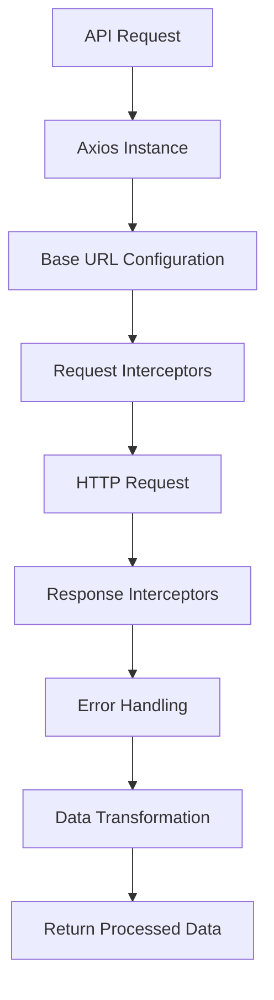
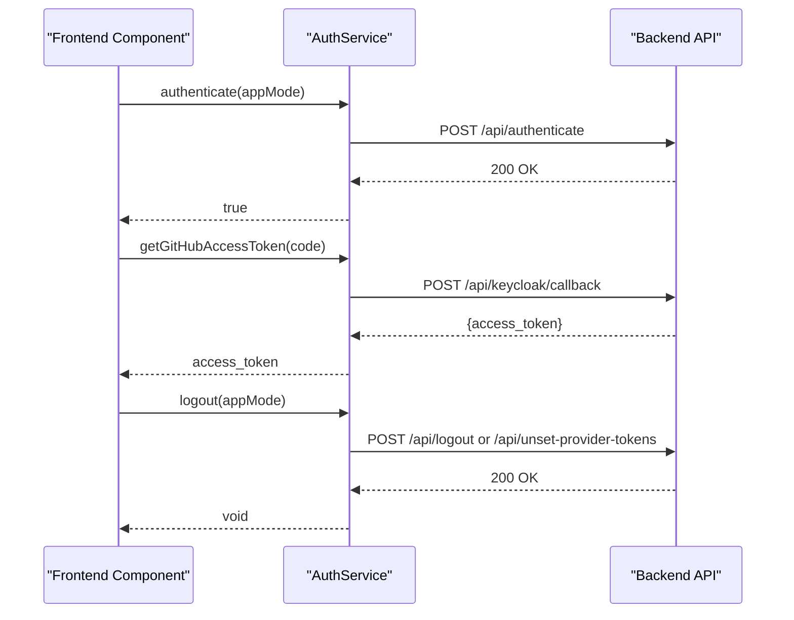
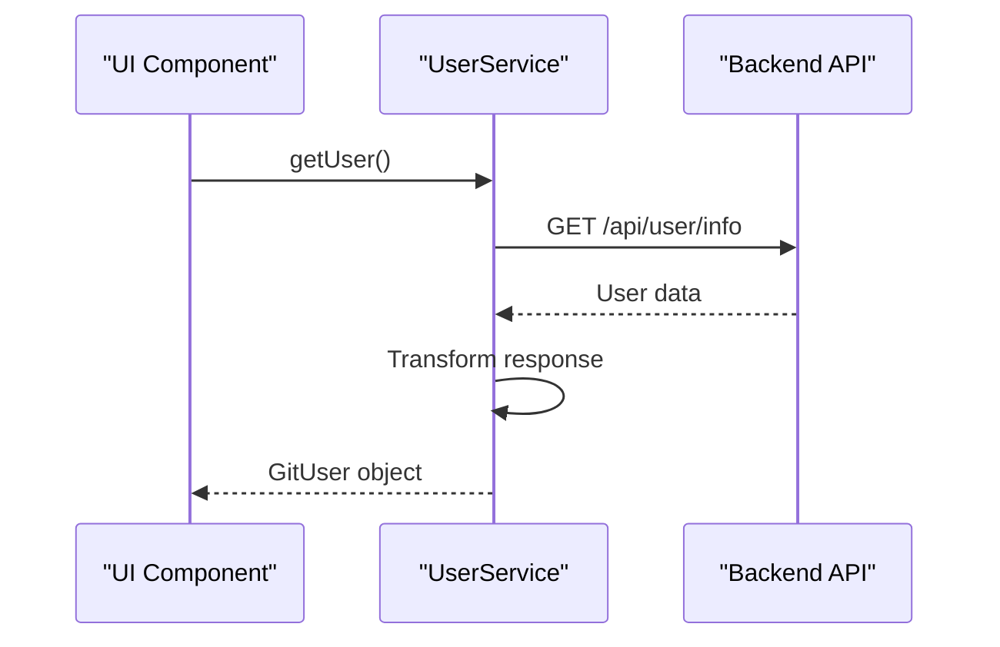
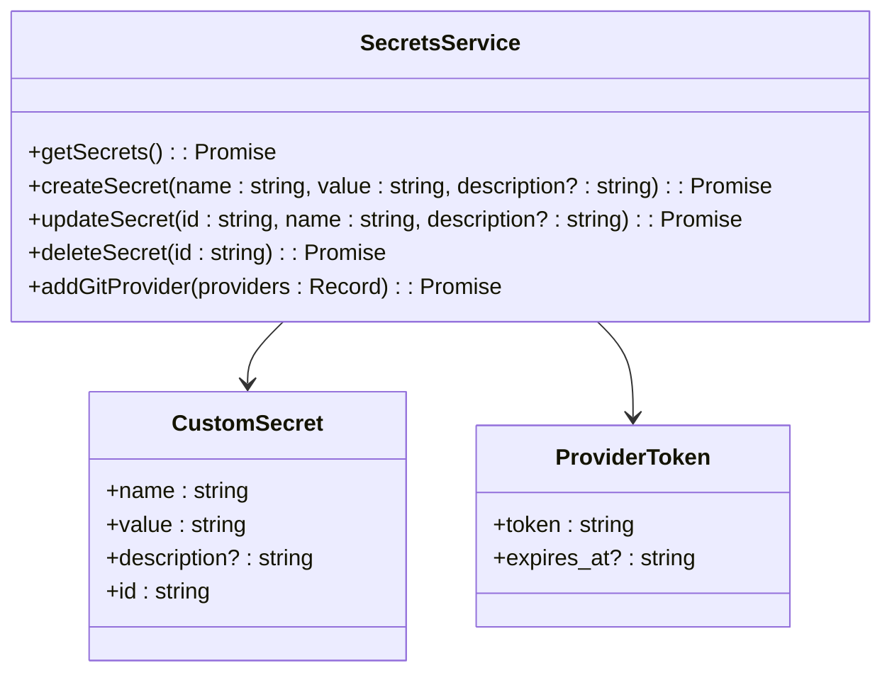
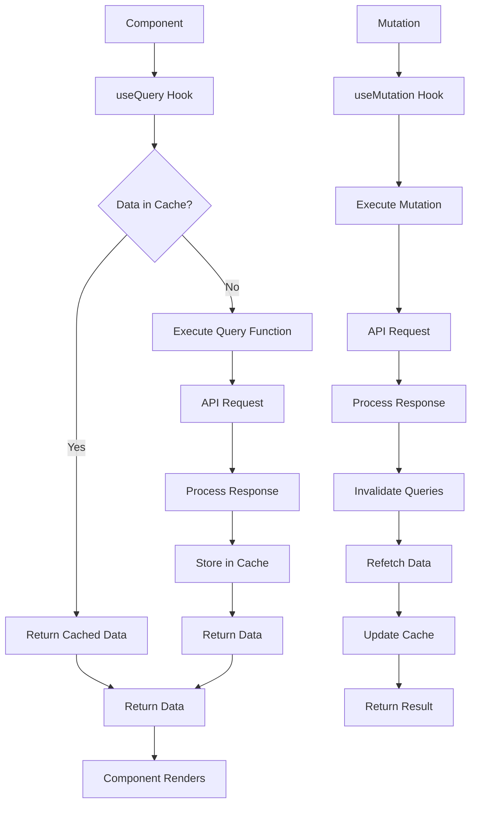
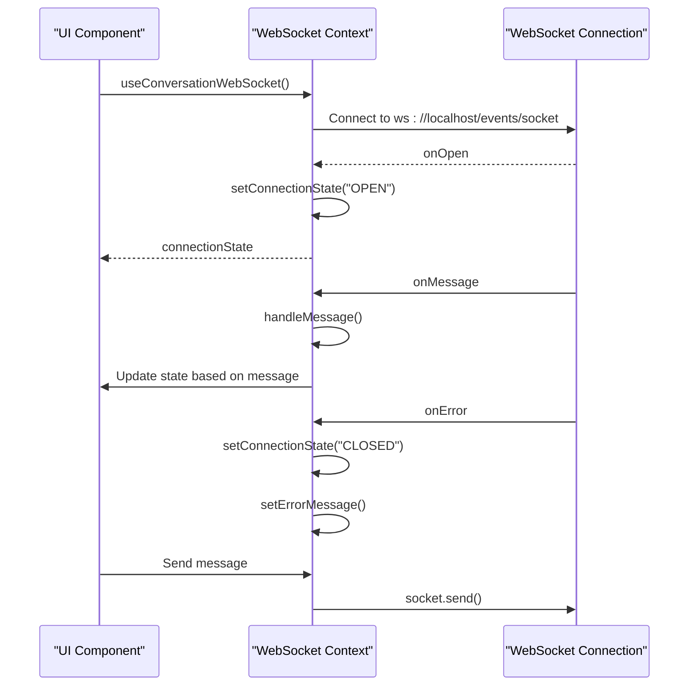
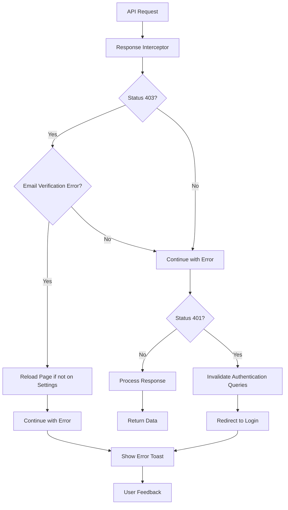

# API Integration Layer

<cite>
**Referenced Files in This Document**   
- [open-hands-axios.ts](file://frontend/src/api/open-hands-axios.ts)
- [auth-service.api.ts](file://frontend/src/api/auth-service/auth-service.api.ts)
- [billing-service.api.ts](file://frontend/src/api/billing-service/billing-service.api.ts)
- [user-service.api.ts](file://frontend/src/api/user-service/user-service.api.ts)
- [secrets-service.ts](file://frontend/src/api/secrets-service.ts)
- [git-service.api.ts](file://frontend/src/api/git-service/git-service.api.ts)
- [query-client-config.ts](file://frontend/src/query-client-config.ts)
- [cache-utils.ts](file://frontend/src/utils/cache-utils.ts)
- [use-api-keys.ts](file://frontend/src/hooks/query/use-api-keys.ts)
- [use-balance.ts](file://frontend/src/hooks/query/use-balance.ts)
- [use-paginated-conversations.ts](file://frontend/src/hooks/query/use-paginated-conversations.ts)
- [use-get-git-changes.ts](file://frontend/src/hooks/query/use-get-git-changes.ts)
- [use-handle-ws-events.ts](file://frontend/src/hooks/use-handle-ws-events.ts)
- [conversation-websocket-context.tsx](file://frontend/src/contexts/conversation-websocket-context.tsx)
- [use-effect-once.ts](file://frontend/src/hooks/use-effect-once.ts)
- [react-query.d.ts](file://frontend/src/types/react-query.d.ts)
</cite>

## Table of Contents
1. [Introduction](#introduction)
2. [API Client Configuration](#api-client-configuration)
3. [Authentication Service](#authentication-service)
4. [Billing Service](#billing-service)
5. [User Service](#user-service)
6. [Secrets Service](#secrets-service)
7. [Git Service](#git-service)
8. [React Query Integration](#react-query-integration)
9. [WebSocket Integration](#websocket-integration)
10. [Error Handling and Security](#error-handling-and-security)
11. [Conclusion](#conclusion)

## Introduction
The API Integration Layer in the OpenHands frontend provides a comprehensive interface for communicating with the backend services. This documentation details the implementation of RESTful API communication patterns using Axios, authentication mechanisms, request/response formats, and error handling strategies. The layer is organized into domain-specific service modules that encapsulate API calls for different functional areas including authentication, billing, user management, secrets management, and Git operations. The integration leverages React Query for efficient data fetching, caching, and state management, while WebSocket connections enable real-time event handling for interactive features.

## API Client Configuration

The API integration layer is built on Axios, with a centralized configuration that establishes the base URL and response interceptors for all API requests. The configuration dynamically determines the backend base URL based on the environment variables or window location, ensuring compatibility across different deployment scenarios.



**Diagram sources**
- [open-hands-axios.ts](file://frontend/src/api/open-hands-axios.ts#L3-L60)

**Section sources**
- [open-hands-axios.ts](file://frontend/src/api/open-hands-axios.ts#L1-L60)

## Authentication Service

The authentication service handles all authentication-related API calls, providing methods for user authentication, GitHub token retrieval, and logout functionality. The service implements conditional logic based on the application mode (SaaS or OSS), with different endpoints and behaviors for each mode.



**Diagram sources**
- [auth-service.api.ts](file://frontend/src/api/auth-service/auth-service.api.ts#L8-L52)

**Section sources**
- [auth-service.api.ts](file://frontend/src/api/auth-service/auth-service.api.ts#L1-L53)

## Billing Service

The billing service manages all billing-related operations, including credit purchases, subscription management, and balance inquiries. It provides a clean interface for interacting with the Stripe integration on the backend, handling checkout sessions, customer setup, and subscription lifecycle operations.

```mermaid
classDiagram
class BillingService {
+createCheckoutSession(amount : number) : Promise<string>
+createBillingSessionResponse() : Promise<string>
+getBalance() : Promise<string>
+getSubscriptionAccess() : Promise<SubscriptionAccess | null>
+createSubscriptionCheckoutSession() : Promise<{redirect_url? : string}>
+cancelSubscription() : Promise<CancelSubscriptionResponse>
}
class SubscriptionAccess {
+status : string
+plan : string
+current_period_end : string
}
class CancelSubscriptionResponse {
+success : boolean
+message : string
}
BillingService --> SubscriptionAccess
BillingService --> CancelSubscriptionResponse
```

**Diagram sources**
- [billing-service.api.ts](file://frontend/src/api/billing-service/billing-service.api.ts#L10-L84)

**Section sources**
- [billing-service.api.ts](file://frontend/src/api/billing-service/billing-service.api.ts#L1-L85)

## User Service

The user service provides functionality for retrieving user information from the backend. It specifically handles Git user data retrieval, transforming the API response into a standardized GitUser interface that can be consumed by various components throughout the application.



**Diagram sources**
- [user-service.api.ts](file://frontend/src/api/user-service/user-service.api.ts#L7-L30)

**Section sources**
- [user-service.api.ts](file://frontend/src/api/user-service/user-service.api.ts#L1-L31)

## Secrets Service

The secrets service manages user secrets and provider tokens, providing CRUD operations for custom secrets and integration with various Git providers. The service supports creating, updating, deleting, and retrieving secrets, as well as adding Git provider authentication tokens.



**Diagram sources**
- [secrets-service.ts](file://frontend/src/api/secrets-service.ts#L9-L51)

**Section sources**
- [secrets-service.ts](file://frontend/src/api/secrets-service.ts#L1-L52)

## Git Service

The git service provides comprehensive functionality for interacting with Git repositories across multiple providers. It supports repository search, retrieval of user repositories, branch management, microagent integration, and installation management. The service also handles git change tracking for conversations, enabling version control integration within the application.

```mermaid
classDiagram
class GitService {
+searchGitRepositories(query : string, per_page : number, selected_provider? : Provider) : Promise<GitRepository[]>
+retrieveUserGitRepositories(selected_provider : Provider, page : number, per_page : number) : Promise<{data : GitRepository[], nextPage : number | null}>
+retrieveInstallationRepositories(selected_provider : Provider, installationIndex : number, installations : string[], page : number, per_page : number) : Promise<{data : GitRepository[], nextPage : number | null, installationIndex : number | null}>
+getRepositoryBranches(repository : string, page : number, perPage : number) : Promise<PaginatedBranchesResponse>
+searchRepositoryBranches(repository : string, query : string, perPage : number, selectedProvider? : Provider) : Promise<Branch[]>
+getRepositoryMicroagents(owner : string, repo : string) : Promise<RepositoryMicroagent[]>
+getRepositoryMicroagentContent(owner : string, repo : string, filePath : string) : Promise<MicroagentContentResponse>
+getUserInstallationIds(provider : Provider) : Promise<string[]>
+getGitChanges(conversationId : string) : Promise<GitChange[]>
+getGitChangeDiff(conversationId : string, path : string) : Promise<GitChangeDiff>
}
class GitRepository {
+id : string
+name : string
+full_name : string
+owner : string
+html_url : string
+description : string
+created_at : string
+updated_at : string
+pushed_at : string
+clone_url : string
+link_header? : string
}
class Branch {
+name : string
+commit : Commit
+protected : boolean
}
class Commit {
+sha : string
+url : string
}
GitService --> GitRepository
GitService --> Branch
GitService --> Commit
```

**Diagram sources**
- [git-service.api.ts](file://frontend/src/api/git-service/git-service.api.ts#L16-L251)

**Section sources**
- [git-service.api.ts](file://frontend/src/api/git-service/git-service.api.ts#L1-L252)

## React Query Integration

The API integration layer leverages React Query for efficient data fetching, caching, and state management. The configuration includes global error handling, toast notifications, and cache invalidation strategies. Query hooks are implemented for various data types, with appropriate caching policies and dependency management.



**Diagram sources**
- [query-client-config.ts](file://frontend/src/query-client-config.ts#L1-L48)
- [use-api-keys.ts](file://frontend/src/hooks/query/use-api-keys.ts#L7-L20)
- [use-balance.ts](file://frontend/src/hooks/query/use-balance.ts#L6-L18)
- [use-paginated-conversations.ts](file://frontend/src/hooks/query/use-paginated-conversations.ts#L5-L16)

**Section sources**
- [query-client-config.ts](file://frontend/src/query-client-config.ts#L1-L48)
- [use-api-keys.ts](file://frontend/src/hooks/query/use-api-keys.ts#L1-L21)
- [use-balance.ts](file://frontend/src/hooks/query/use-balance.ts#L1-L19)
- [use-paginated-conversations.ts](file://frontend/src/hooks/query/use-paginated-conversations.ts#L1-L17)
- [cache-utils.ts](file://frontend/src/utils/cache-utils.ts#L17-L44)

## WebSocket Integration

The WebSocket integration enables real-time communication between the frontend and backend, facilitating immediate updates and event-driven interactions. The implementation includes connection state management, error handling, and message processing, with a context provider that makes the WebSocket connection available to components throughout the application.



**Diagram sources**
- [conversation-websocket-context.tsx](file://frontend/src/contexts/conversation-websocket-context.tsx#L82-L156)
- [use-handle-ws-events.ts](file://frontend/src/hooks/use-handle-ws-events.ts#L16-L48)
- [use-effect-once.ts](file://frontend/src/hooks/use-effect-once.ts#L7-L17)

**Section sources**
- [conversation-websocket-context.tsx](file://frontend/src/contexts/conversation-websocket-context.tsx#L1-L156)
- [use-handle-ws-events.ts](file://frontend/src/hooks/use-handle-ws-events.ts#L1-L49)
- [use-effect-once.ts](file://frontend/src/hooks/use-effect-once.ts#L1-L18)

## Error Handling and Security

The API integration layer implements comprehensive error handling and security measures to ensure robust and secure communication with the backend. This includes global response interceptors for handling authentication errors, email verification checks, and toast notifications for user feedback. The security model incorporates token management, request validation, and protection against common vulnerabilities.



**Diagram sources**
- [open-hands-axios.ts](file://frontend/src/api/open-hands-axios.ts#L43-L59)
- [query-client-config.ts](file://frontend/src/query-client-config.ts#L8-L36)
- [react-query.d.ts](file://frontend/src/types/react-query.d.ts#L1-L15)

**Section sources**
- [open-hands-axios.ts](file://frontend/src/api/open-hands-axios.ts#L1-L60)
- [query-client-config.ts](file://frontend/src/query-client-config.ts#L1-L48)
- [react-query.d.ts](file://frontend/src/types/react-query.d.ts#L1-L15)

## Conclusion

The API Integration Layer in OpenHands provides a robust and well-structured interface between the frontend and backend services. By organizing API calls into domain-specific service classes, the implementation promotes code reusability and maintainability. The integration with React Query enables efficient data management with built-in caching, background refetching, and automatic cache invalidation. WebSocket connectivity supports real-time features, while comprehensive error handling and security measures ensure a reliable user experience. The layer's design follows modern frontend architecture principles, making it scalable and adaptable to future requirements.