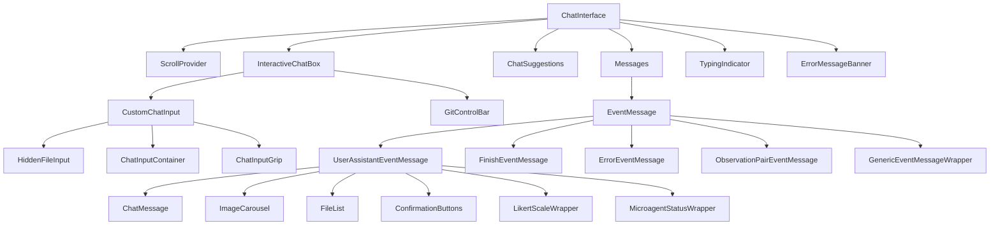
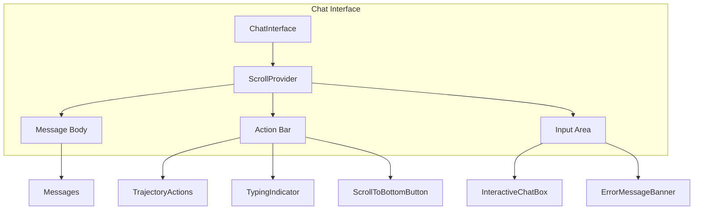
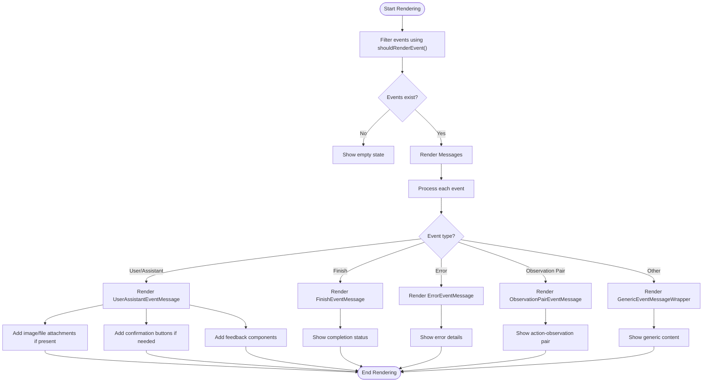
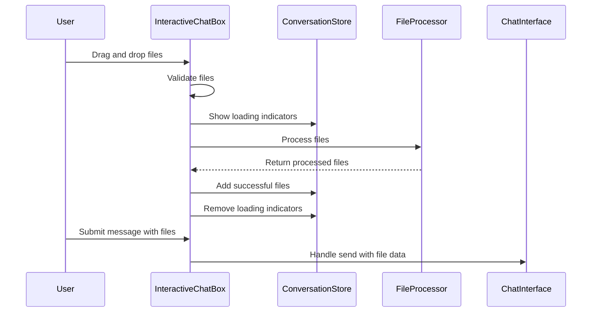
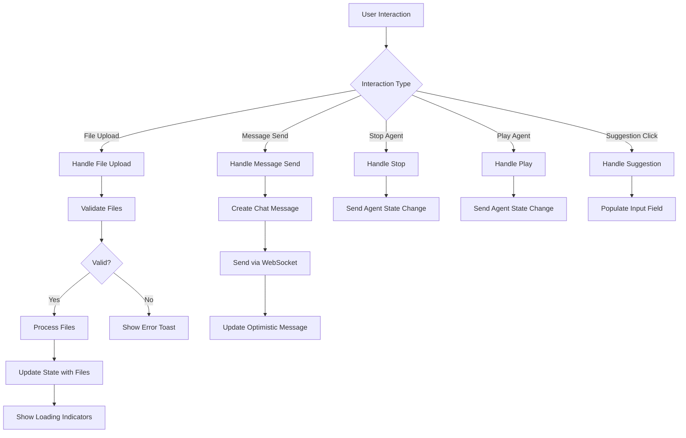
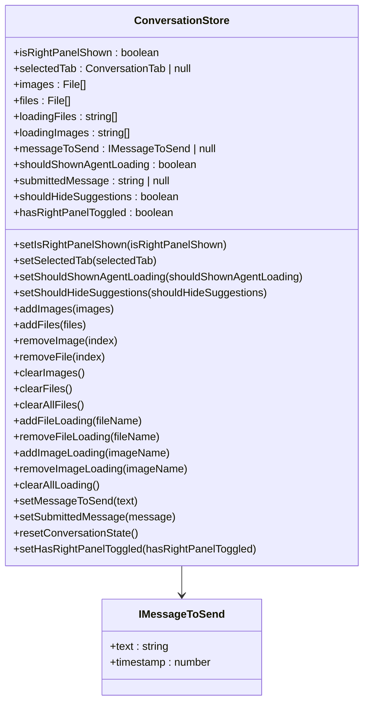
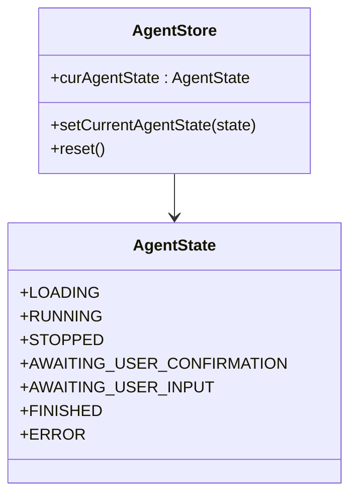
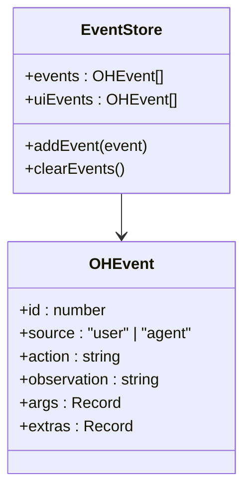
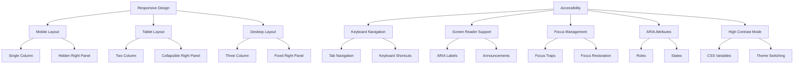

# Chat Interface Components

<cite>
**Referenced Files in This Document**   
- [chat-interface.tsx](file://frontend/src/components/features/chat/chat-interface.tsx)
- [interactive-chat-box.tsx](file://frontend/src/components/features/chat/interactive-chat-box.tsx)
- [messages.tsx](file://frontend/src/components/features/chat/messages.tsx)
- [event-message.tsx](file://frontend/src/components/features/chat/event-message.tsx)
- [custom-chat-input.tsx](file://frontend/src/components/features/chat/custom-chat-input.tsx)
- [chat-suggestions.tsx](file://frontend/src/components/features/chat/chat-suggestions.tsx)
- [conversation-store.ts](file://frontend/src/state/conversation-store.ts)
- [agent-store.ts](file://frontend/src/stores/agent-store.ts)
- [use-event-store.ts](file://frontend/src/stores/use-event-store.ts)
- [user-assistant-event-message.tsx](file://frontend/src/components/features/chat/event-message-components/user-assistant-event-message.tsx)
- [finish-event-message.tsx](file://frontend/src/components/features/chat/event-message-components/finish-event-message.tsx)
- [error-event-message.tsx](file://frontend/src/components/features/chat/event-message-components/error-event-message.tsx)
- [observation-pair-event-message.tsx](file://frontend/src/components/features/chat/event-message-components/observation-pair-event-message.tsx)
- [should-render-event.ts](file://frontend/src/components/features/chat/event-content-helpers/should-render-event.ts)
</cite>

## Table of Contents
1. [Introduction](#introduction)
2. [Component Hierarchy](#component-hierarchy)
3. [Chat Interface Architecture](#chat-interface-architecture)
4. [Message Rendering System](#message-rendering-system)
5. [Event Message Components](#event-message-components)
6. [Interactive Features](#interactive-features)
7. [State Management Integration](#state-management-integration)
8. [Responsive Design and Accessibility](#responsive-design-and-accessibility)

## Introduction
The Chat Interface Components form the core user interaction layer of the frontend application, providing a comprehensive interface for users to communicate with AI agents. This documentation details the architecture and implementation of the chat interface, focusing on the component hierarchy, message rendering system, interactive features, and state management integration. The components are designed to provide a seamless user experience with support for file uploads, command suggestions, action buttons, and responsive design considerations.

## Component Hierarchy
The chat interface follows a hierarchical component structure starting from the top-level `ChatInterface` component and descending through various specialized components that handle specific aspects of the chat functionality.



**Diagram sources**
- [chat-interface.tsx](file://frontend/src/components/features/chat/chat-interface.tsx)
- [interactive-chat-box.tsx](file://frontend/src/components/features/chat/interactive-chat-box.tsx)
- [messages.tsx](file://frontend/src/components/features/chat/messages.tsx)
- [event-message.tsx](file://frontend/src/components/features/chat/event-message.tsx)
- [custom-chat-input.tsx](file://frontend/src/components/features/chat/custom-chat-input.tsx)

**Section sources**
- [chat-interface.tsx](file://frontend/src/components/features/chat/chat-interface.tsx#L49-L255)
- [interactive-chat-box.tsx](file://frontend/src/components/features/chat/interactive-chat-box.tsx#L17-L158)
- [messages.tsx](file://frontend/src/components/features/chat/messages.tsx#L44-L290)

## Chat Interface Architecture
The chat interface is built around a central `ChatInterface` component that orchestrates the various sub-components and manages the overall layout and behavior. The architecture follows a container-component pattern where the `ChatInterface` acts as a container that manages state and passes down props to presentational components.

The interface is divided into three main sections:
1. **Message Display Area**: Shows the conversation history with AI agent interactions
2. **Action Bar**: Displays agent status indicators, feedback buttons, and scroll controls
3. **Input Area**: Contains the chat input field and associated controls for file uploads and git operations

The `ChatInterface` component integrates with multiple state stores to manage conversation data, agent state, and user input. It uses the `ScrollProvider` to manage scroll behavior and auto-scrolling functionality, ensuring that new messages are visible to the user.



**Diagram sources**
- [chat-interface.tsx](file://frontend/src/components/features/chat/chat-interface.tsx#L49-L255)
- [messages.tsx](file://frontend/src/components/features/chat/messages.tsx#L44-L290)
- [interactive-chat-box.tsx](file://frontend/src/components/features/chat/interactive-chat-box.tsx#L17-L158)

**Section sources**
- [chat-interface.tsx](file://frontend/src/components/features/chat/chat-interface.tsx#L49-L255)
- [scroll-context.tsx](file://frontend/src/context/scroll-context.tsx)
- [use-scroll-to-bottom.ts](file://frontend/src/hooks/use-scroll-to-bottom.ts)

## Message Rendering System
The message rendering system is responsible for displaying the conversation history between the user and the AI agent. It processes events from the event store and renders them according to their type and content.

The system uses a filtering mechanism to determine which events should be rendered in the chat interface. Events are filtered based on their type and source, with certain event types like "system" and "agent_state_changed" being excluded from display. The `shouldRenderEvent` helper function implements this filtering logic, ensuring that only relevant events are shown to the user.



**Diagram sources**
- [messages.tsx](file://frontend/src/components/features/chat/messages.tsx#L44-L290)
- [should-render-event.ts](file://frontend/src/components/features/chat/event-content-helpers/should-render-event.ts#L21-L47)
- [event-message.tsx](file://frontend/src/components/features/chat/event-message.tsx#L44-L146)

**Section sources**
- [messages.tsx](file://frontend/src/components/features/chat/messages.tsx#L44-L290)
- [should-render-event.ts](file://frontend/src/components/features/chat/event-content-helpers/should-render-event.ts#L21-L47)
- [parse-message-from-event.ts](file://frontend/src/components/features/chat/event-content-helpers/parse-message-from-event.ts)

## Event Message Components
The event message components are responsible for rendering different types of events in the chat interface. Each component is specialized for a specific event type or category, allowing for customized rendering based on the event content and context.

The system uses a component dispatch pattern in the `EventMessage` component, which determines which specific event message component to render based on the event type. This approach enables extensibility and maintainability by separating the rendering logic for different event types into dedicated components.

```mermaid
classDiagram
class EventMessage {
+event : OpenHandsAction | OpenHandsObservation
+hasObservationPair : boolean
+isAwaitingUserConfirmation : boolean
+isLastMessage : boolean
+microagentStatus? : MicroagentStatus
+microagentConversationId? : string
+microagentPRUrl? : string
+actions? : Array<{icon, onClick, tooltip}>
+isInLast10Actions : boolean
+render() : ReactNode
}
class UserAssistantEventMessage {
+event : OpenHandsAction
+shouldShowConfirmationButtons : boolean
+microagentStatus? : MicroagentStatus
+microagentConversationId? : string
+microagentPRUrl? : string
+actions? : Array<{icon, onClick, tooltip}>
+isLastMessage : boolean
+isInLast10Actions : boolean
+config? : {APP_MODE? : string}
+isCheckingFeedback : boolean
+feedbackData : {exists : boolean, rating? : number, reason? : string}
+render() : ReactNode
}
class FinishEventMessage {
+event : OpenHandsAction
+microagentStatus? : MicroagentStatus
+microagentConversationId? : string
+microagentPRUrl? : string
+actions? : Array<{icon, onClick, tooltip}>
+isLastMessage : boolean
+isInLast10Actions : boolean
+config? : {APP_MODE? : string}
+isCheckingFeedback : boolean
+feedbackData : {exists : boolean, rating? : number, reason? : string}
+render() : ReactNode
}
class ErrorEventMessage {
+event : OpenHandsObservation
+microagentStatus? : MicroagentStatus
+microagentConversationId? : string
+microagentPRUrl? : string
+actions? : Array<{icon, onClick, tooltip}>
+isLastMessage : boolean
+isInLast10Actions : boolean
+config? : {APP_MODE? : string}
+isCheckingFeedback : boolean
+feedbackData : {exists : boolean, rating? : number, reason? : string}
+render() : ReactNode
}
class ObservationPairEventMessage {
+event : OpenHandsAction
+microagentStatus? : MicroagentStatus
+microagentConversationId? : string
+microagentPRUrl? : string
+actions? : Array<{icon, onClick, tooltip}>
+render() : ReactNode
}
class GenericEventMessageWrapper {
+event : OpenHandsAction | OpenHandsObservation
+shouldShowConfirmationButtons : boolean
+render() : ReactNode
}
EventMessage --> UserAssistantEventMessage : "delegates to"
EventMessage --> FinishEventMessage : "delegates to"
EventMessage --> ErrorEventMessage : "delegates to"
EventMessage --> ObservationPairEventMessage : "delegates to"
EventMessage --> GenericEventMessageWrapper : "delegates to"
UserAssistantEventMessage --> ChatMessage : "contains"
UserAssistantEventMessage --> ImageCarousel : "contains"
UserAssistantEventMessage --> FileList : "contains"
UserAssistantEventMessage --> ConfirmationButtons : "contains"
UserAssistantEventMessage --> LikertScaleWrapper : "contains"
UserAssistantEventMessage --> MicroagentStatusWrapper : "contains"
```

**Diagram sources**
- [event-message.tsx](file://frontend/src/components/features/chat/event-message.tsx#L44-L146)
- [user-assistant-event-message.tsx](file://frontend/src/components/features/chat/event-message-components/user-assistant-event-message.tsx)
- [finish-event-message.tsx](file://frontend/src/components/features/chat/event-message-components/finish-event-message.tsx)
- [error-event-message.tsx](file://frontend/src/components/features/chat/event-message-components/error-event-message.tsx)
- [observation-pair-event-message.tsx](file://frontend/src/components/features/chat/event-message-components/observation-pair-event-message.tsx)
- [generic-event-message-wrapper.tsx](file://frontend/src/components/features/chat/event-message-components/generic-event-message-wrapper.tsx)

**Section sources**
- [event-message.tsx](file://frontend/src/components/features/chat/event-message.tsx#L44-L146)
- [user-assistant-event-message.tsx](file://frontend/src/components/features/chat/event-message-components/user-assistant-event-message.tsx)
- [finish-event-message.tsx](file://frontend/src/components/features/chat/event-message-components/finish-event-message.tsx)

## Interactive Features
The chat interface includes several interactive features that enhance the user experience and provide additional functionality beyond basic text messaging.

### File Uploads
The file upload system allows users to attach files and images to their messages. The `InteractiveChatBox` component manages the file upload process, handling both drag-and-drop and file selection through a file input. Files are validated for size and type before processing, and loading indicators are shown during the upload process.



### Command Suggestions
The chat interface provides command suggestions to help users get started with the system. The `ChatSuggestions` component displays a set of predefined suggestions that users can click to populate the input field. These suggestions are hidden when the user starts typing or when there are existing messages in the conversation.

### Action Buttons
The interface includes several action buttons that provide additional functionality:
- **Send Button**: Submits the current message
- **Stop Button**: Stops the agent's current task
- **Play Button**: Resumes a stopped agent
- **Add File Button**: Triggers file selection
- **Remove File Button**: Removes attached files
- **Confirmation Buttons**: Allows users to confirm or reject agent actions



**Diagram sources**
- [interactive-chat-box.tsx](file://frontend/src/components/features/chat/interactive-chat-box.tsx#L17-L158)
- [custom-chat-input.tsx](file://frontend/src/components/features/chat/custom-chat-input.tsx#L26-L162)
- [chat-suggestions.tsx](file://frontend/src/components/features/chat/chat-suggestions.tsx#L13-L48)
- [file-validation.ts](file://frontend/src/utils/file-validation.ts)
- [file-processing.ts](file://frontend/src/utils/file-processing.ts)

**Section sources**
- [interactive-chat-box.tsx](file://frontend/src/components/features/chat/interactive-chat-box.tsx#L17-L158)
- [custom-chat-input.tsx](file://frontend/src/components/features/chat/custom-chat-input.tsx#L26-L162)
- [chat-suggestions.tsx](file://frontend/src/components/features/chat/chat-suggestions.tsx#L13-L48)

## State Management Integration
The chat components integrate with several state management stores to maintain conversation data, agent state, and user input. The system uses Zustand for state management, with separate stores for different aspects of the application state.

### Conversation Store
The `conversation-store` manages the state related to the current conversation, including attached files, input messages, and UI state. It provides actions for adding and removing files, setting the message to send, and managing loading states.



### Agent Store
The `agent-store` manages the current state of the AI agent, including whether it is running, stopped, or awaiting user confirmation. This state is used to control the UI elements like the stop button and typing indicator.



### Event Store
The `use-event-store` manages the collection of events that make up the conversation history. It stores both raw events and processed UI events, providing a mechanism for adding new events and clearing the event history.



**Diagram sources**
- [conversation-store.ts](file://frontend/src/state/conversation-store.ts)
- [agent-store.ts](file://frontend/src/stores/agent-store.ts)
- [use-event-store.ts](file://frontend/src/stores/use-event-store.ts)

**Section sources**
- [conversation-store.ts](file://frontend/src/state/conversation-store.ts)
- [agent-store.ts](file://frontend/src/stores/agent-store.ts)
- [use-event-store.ts](file://frontend/src/stores/use-event-store.ts)
- [chat-interface.tsx](file://frontend/src/components/features/chat/chat-interface.tsx#L49-L255)

## Responsive Design and Accessibility
The chat interface components are designed with responsive design and accessibility in mind, ensuring a good user experience across different devices and for users with various needs.

### Responsive Design
The interface uses a mobile-first approach with responsive breakpoints to adapt to different screen sizes. The layout adjusts to show or hide the right panel based on screen width, and the input area resizes dynamically based on content.

### Accessibility Features
The components include several accessibility features:
- Proper ARIA labels and roles for interactive elements
- Keyboard navigation support for all interactive components
- Focus management for modal dialogs and input fields
- High contrast mode support
- Screen reader compatibility
- Semantic HTML structure

The chat input supports keyboard shortcuts for common actions like sending messages (Ctrl+Enter) and inserting line breaks (Shift+Enter). Error messages are announced to screen readers, and loading states are communicated through appropriate ARIA attributes.



**Diagram sources**
- [chat-interface.tsx](file://frontend/src/components/features/chat/chat-interface.tsx#L49-L255)
- [interactive-chat-box.tsx](file://frontend/src/components/features/chat/interactive-chat-box.tsx#L17-L158)
- [custom-chat-input.tsx](file://frontend/src/components/features/chat/custom-chat-input.tsx#L26-L162)
- [tailwind.config.js](file://frontend/tailwind.config.js)

**Section sources**
- [chat-interface.tsx](file://frontend/src/components/features/chat/chat-interface.tsx#L49-L255)
- [interactive-chat-box.tsx](file://frontend/src/components/features/chat/interactive-chat-box.tsx#L17-L158)
- [custom-chat-input.tsx](file://frontend/src/components/features/chat/custom-chat-input.tsx#L26-L162)
- [tailwind.config.js](file://frontend/tailwind.config.js)