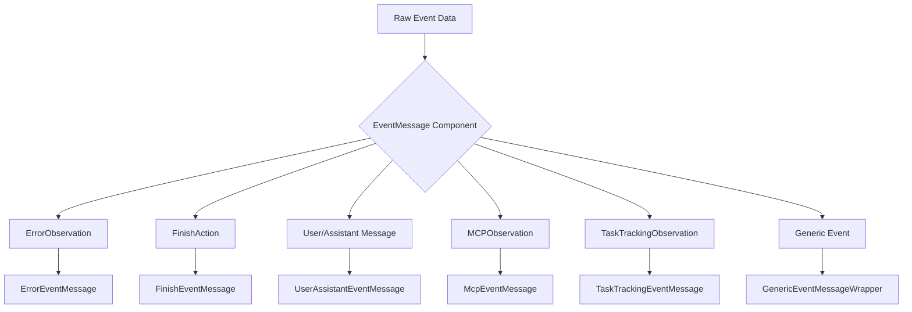
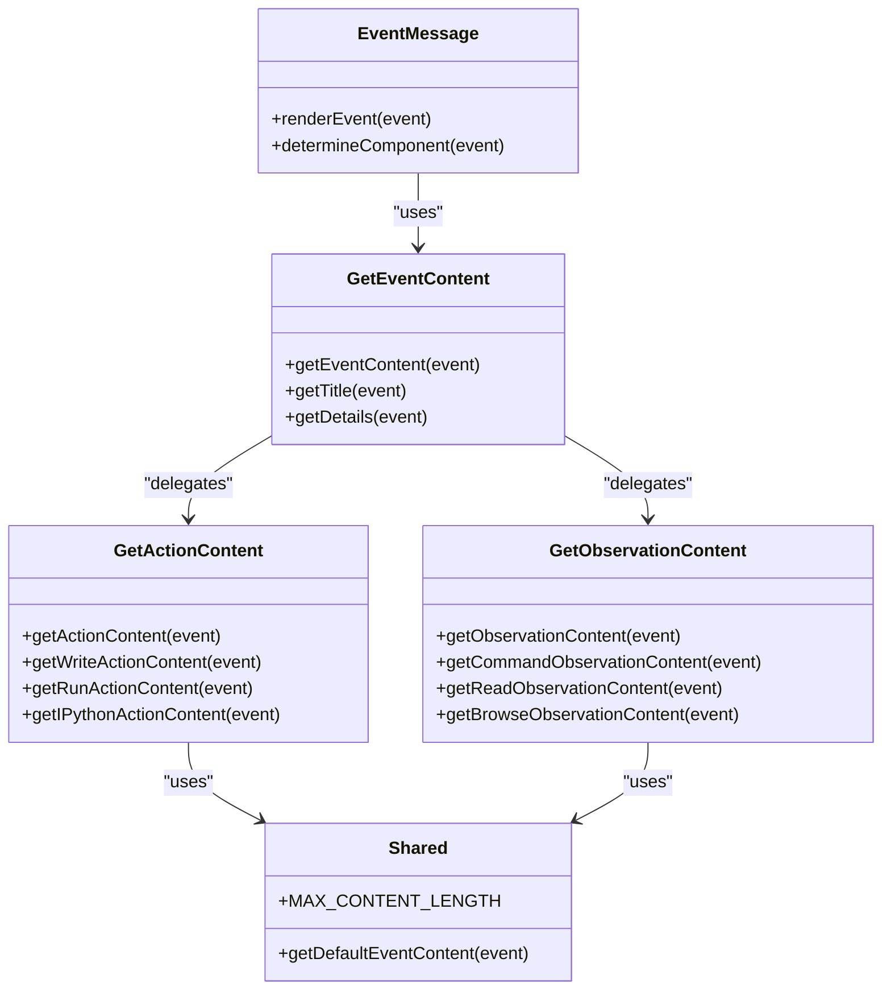
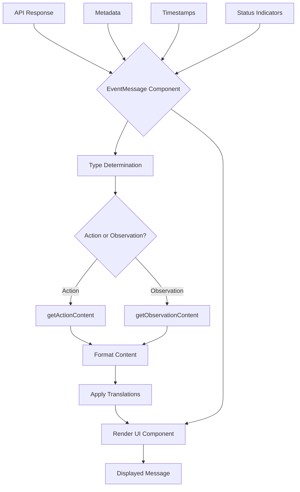
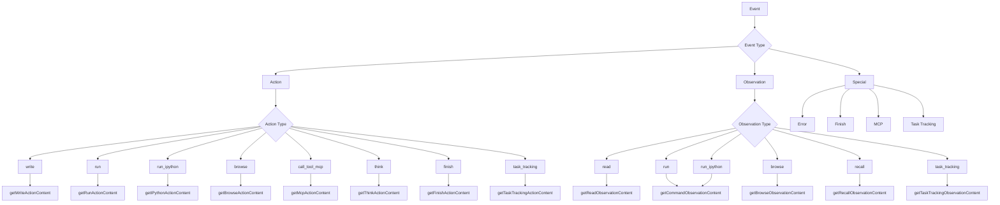
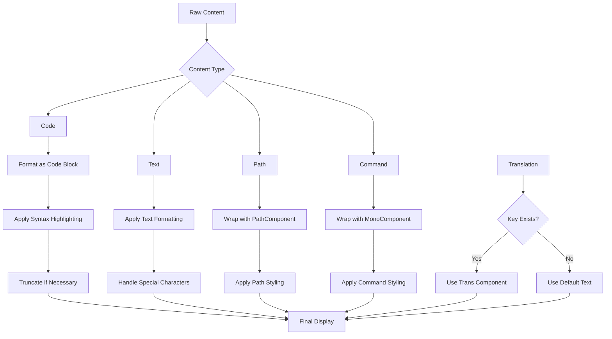
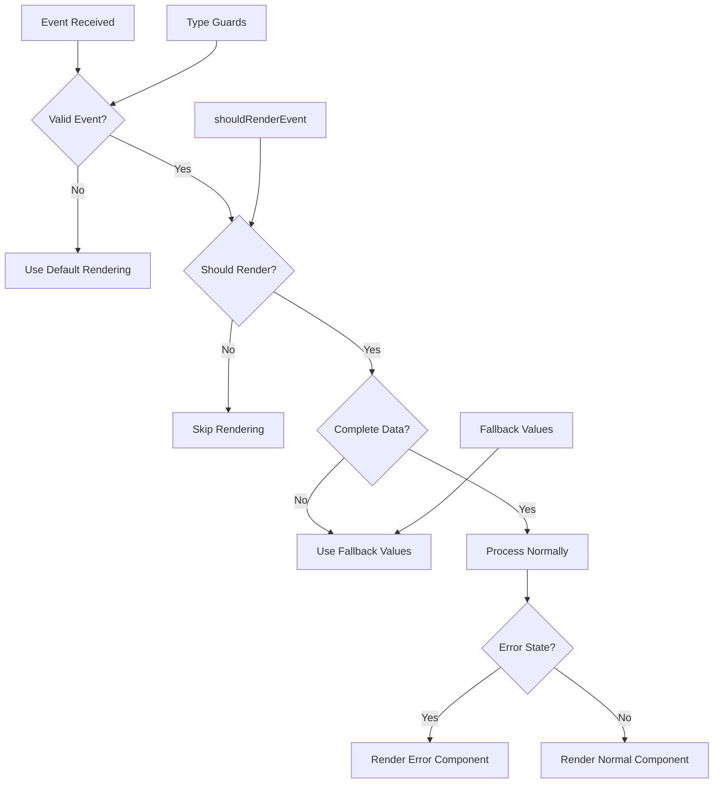
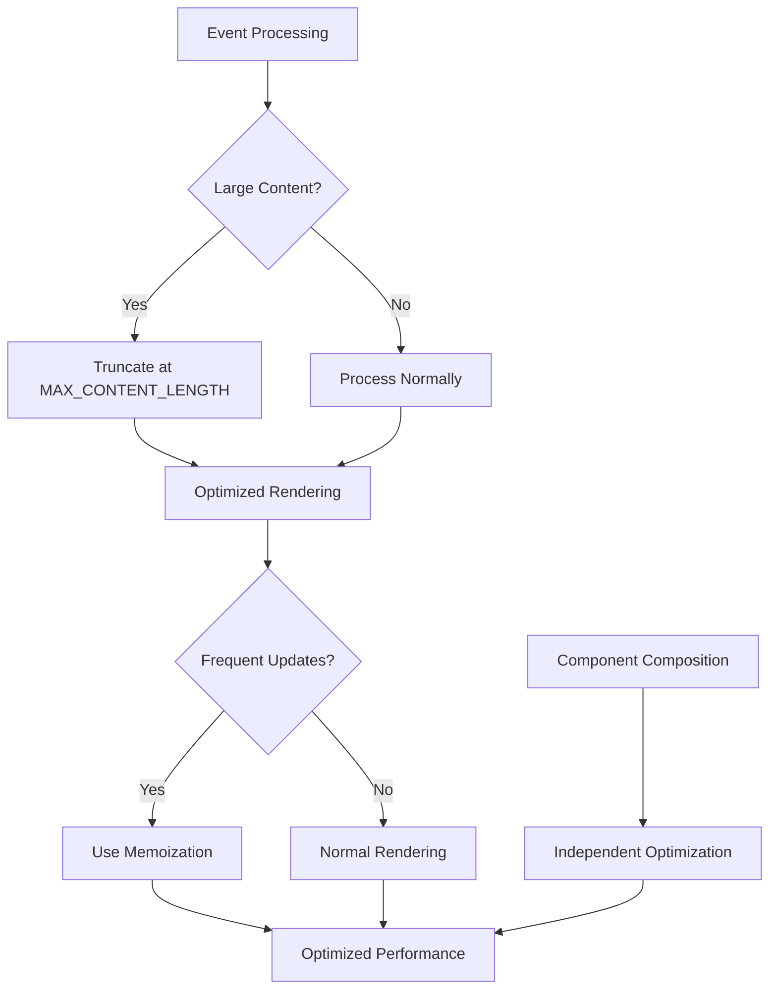

# Event Message Processing

<cite>
**Referenced Files in This Document**   
- [event-message.tsx](file://frontend/src/components/features/chat/event-message.tsx)
- [get-event-content.tsx](file://frontend/src/components/features/chat/event-content-helpers/get-event-content.tsx)
- [get-action-content.ts](file://frontend/src/components/features/chat/event-content-helpers/get-action-content.ts)
- [get-observation-content.ts](file://frontend/src/components/features/chat/event-content-helpers/get-observation-content.ts)
- [shared.ts](file://frontend/src/components/features/chat/event-content-helpers/shared.ts)
- [parse-message-from-event.ts](file://frontend/src/components/features/chat/event-content-helpers/parse-message-from-event.ts)
- [should-render-event.ts](file://frontend/src/components/features/chat/event-content-helpers/should-render-event.ts)
- [guards.ts](file://frontend/src/types/core/guards.ts)
- [openhands-event.ts](file://frontend/src/types/v1/core/openhands-event.ts)
- [microagent-status.ts](file://frontend/src/types/microagent-status.ts)
</cite>

## Table of Contents
1. [Introduction](#introduction)
2. [Event Message Processing Architecture](#event-message-processing-architecture)
3. [Core Components](#core-components)
4. [Data Transformation Pipeline](#data-transformation-pipeline)
5. [Event Type Processing](#event-type-processing)
6. [Content Formatting and Display](#content-formatting-and-display)
7. [Error Handling and Edge Cases](#error-handling-and-edge-cases)
8. [Performance Optimization](#performance-optimization)
9. [Conclusion](#conclusion)

## Introduction

The Event Message Processing system in OpenHands is responsible for transforming raw event data from the backend into user-friendly message displays in the chat interface. This system handles various event types including actions, observations, and special events, processing them through a series of helper functions to extract and format relevant information. The architecture is designed to provide a consistent and informative user experience while maintaining flexibility for different event types and their specific requirements.

**Section sources**
- [event-message.tsx](file://frontend/src/components/features/chat/event-message.tsx)
- [get-event-content.tsx](file://frontend/src/components/features/chat/event-content-helpers/get-event-content.tsx)

## Event Message Processing Architecture

The Event Message Processing system follows a modular architecture with a clear separation of concerns. At its core is the `event-message.tsx` component, which serves as the main event processor. This component receives raw event data and determines the appropriate rendering strategy based on the event type and context.

The architecture consists of several key components:
1. The main `EventMessage` component that routes events to appropriate sub-components
2. A collection of specialized content helpers in the `event-content-helpers` directory
3. Type guards that determine event categories and specific types
4. Configuration and state management hooks that provide context

The system uses a conditional rendering approach, where the `EventMessage` component evaluates the event type and renders the appropriate sub-component. This allows for specialized handling of different event categories while maintaining a consistent interface.

**Diagram sources**
- [event-message.tsx](file://frontend/src/components/features/chat/event-message.tsx)

**Section sources**
- [event-message.tsx](file://frontend/src/components/features/chat/event-message.tsx)
- [guards.ts](file://frontend/src/types/core/guards.ts)

## Core Components

The Event Message Processing system relies on several core components that work together to transform and display event data. The main processor is the `EventMessage` component, which acts as a router for different event types. It uses type guards from `guards.ts` to determine the event category and render the appropriate sub-component.

The system also includes a set of helper functions in the `event-content-helpers` directory that are responsible for extracting and formatting content from event objects. These helpers include:
- `get-action-content.ts` for processing action events
- `get-observation-content.ts` for processing observation events
- `get-event-content.tsx` for determining the overall event content
- `shared.ts` for common utilities and constants

Each of these components plays a specific role in the processing pipeline, ensuring that events are handled consistently and efficiently.

**Diagram sources**
- [event-message.tsx](file://frontend/src/components/features/chat/event-message.tsx)
- [get-event-content.tsx](file://frontend/src/components/features/chat/event-content-helpers/get-event-content.tsx)
- [get-action-content.ts](file://frontend/src/components/features/chat/event-content-helpers/get-action-content.ts)
- [get-observation-content.ts](file://frontend/src/components/features/chat/event-content-helpers/get-observation-content.ts)
- [shared.ts](file://frontend/src/components/features/chat/event-content-helpers/shared.ts)

**Section sources**
- [event-message.tsx](file://frontend/src/components/features/chat/event-message.tsx)
- [get-event-content.tsx](file://frontend/src/components/features/chat/event-content-helpers/get-event-content.tsx)
- [get-action-content.ts](file://frontend/src/components/features/chat/event-content-helpers/get-action-content.ts)
- [get-observation-content.ts](file://frontend/src/components/features/chat/event-content-helpers/get-observation-content.ts)
- [shared.ts](file://frontend/src/components/features/chat/event-content-helpers/shared.ts)

## Data Transformation Pipeline

The data transformation pipeline in the Event Message Processing system follows a structured flow from API response to rendered UI element. The process begins when an event is received from the backend and ends with the display of formatted content in the chat interface.

The pipeline consists of several stages:
1. Event reception and type determination
2. Content extraction using specialized helpers
3. Formatting and translation
4. Rendering with appropriate components

The `getEventContent` function serves as the entry point for content processing. It first determines whether the event is an action or observation using the type guards, then delegates to the appropriate helper function. For action events, it uses `getActionContent`, and for observation events, it uses `getObservationContent`.

Metadata, timestamps, and status indicators are handled through the component props and context. The `EventMessage` component receives additional information such as microagent status, feedback data, and configuration settings, which are passed down to the rendering components.

**Diagram sources**
- [event-message.tsx](file://frontend/src/components/features/chat/event-message.tsx)
- [get-event-content.tsx](file://frontend/src/components/features/chat/event-content-helpers/get-event-content.tsx)
- [get-action-content.ts](file://frontend/src/components/features/chat/event-content-helpers/get-action-content.ts)
- [get-observation-content.ts](file://frontend/src/components/features/chat/event-content-helpers/get-observation-content.ts)

**Section sources**
- [event-message.tsx](file://frontend/src/components/features/chat/event-message.tsx)
- [get-event-content.tsx](file://frontend/src/components/features/chat/event-content-helpers/get-event-content.tsx)
- [get-action-content.ts](file://frontend/src/components/features/chat/event-content-helpers/get-action-content.ts)
- [get-observation-content.ts](file://frontend/src/components/features/chat/event-content-helpers/get-observation-content.ts)

## Event Type Processing

The Event Message Processing system handles various event types through specialized content helpers. Each event type has its own processing logic to extract and format relevant information from the complex event objects.

For action events, the `getActionContent` function uses a switch statement to route to specific handlers based on the action type. Different actions such as "write", "run", "browse", and "call_tool_mcp" have their own formatting functions that extract the relevant data and present it in a user-friendly format.

Observation events are processed similarly through the `getObservationContent` function, which routes to specific handlers based on the observation type. Observations like "read", "run", "browse", and "recall" have their own formatting functions that handle the specific structure of their data.

The system also handles special event types like finish actions, error observations, and MCP observations through dedicated components that provide specialized rendering.

**Diagram sources**
- [get-action-content.ts](file://frontend/src/components/features/chat/event-content-helpers/get-action-content.ts)
- [get-observation-content.ts](file://frontend/src/components/features/chat/event-content-helpers/get-observation-content.ts)

**Section sources**
- [get-action-content.ts](file://frontend/src/components/features/chat/event-content-helpers/get-action-content.ts)
- [get-observation-content.ts](file://frontend/src/components/features/chat/event-content-helpers/get-observation-content.ts)

## Content Formatting and Display

The content formatting and display system in OpenHands ensures that event data is presented in a consistent and user-friendly manner. The system uses a combination of text formatting, code blocks, and specialized components to present different types of content.

For code-related events like "write" actions or "run" commands, the system uses code blocks with appropriate syntax highlighting. The content is truncated if it exceeds the maximum length defined in `shared.ts` to prevent performance issues and maintain readability.

The system also handles rich content such as file paths and commands by wrapping them in specialized components like `PathComponent` and `MonoComponent`. These components ensure consistent styling and handling of special characters.

Translation is handled through the i18n system, with translation keys defined for different event types. The system checks if a translation key exists and uses the `Trans` component to render localized content when available.

**Diagram sources**
- [get-action-content.ts](file://frontend/src/components/features/chat/event-content-helpers/get-action-content.ts)
- [get-observation-content.ts](file://frontend/src/components/features/chat/event-content-helpers/get-observation-content.ts)
- [get-event-content.tsx](file://frontend/src/components/features/chat/event-content-helpers/get-event-content.tsx)
- [shared.ts](file://frontend/src/components/features/chat/event-content-helpers/shared.ts)

**Section sources**
- [get-action-content.ts](file://frontend/src/components/features/chat/event-content-helpers/get-action-content.ts)
- [get-observation-content.ts](file://frontend/src/components/features/chat/event-content-helpers/get-observation-content.ts)
- [get-event-content.tsx](file://frontend/src/components/features/chat/event-content-helpers/get-event-content.tsx)
- [shared.ts](file://frontend/src/components/features/chat/event-content-helpers/shared.ts)

## Error Handling and Edge Cases

The Event Message Processing system includes comprehensive error handling and edge case management to ensure robust operation. The system handles incomplete data, error states, and unexpected event types through several mechanisms.

For incomplete data, the system uses optional chaining and default values to prevent runtime errors. When extracting properties from event objects, the system checks for their existence before accessing them, providing fallback values when necessary.

Error states are handled through dedicated components like `ErrorEventMessage` that provide informative error messages to users. The system also includes validation through type guards that ensure events conform to expected types before processing.

The `shouldRenderEvent` helper function determines whether an event should be displayed in the chat interface, filtering out system events and other events that are not meant for user consumption. This helps maintain a clean and focused user experience.

**Diagram sources**
- [event-message.tsx](file://frontend/src/components/features/chat/event-message.tsx)
- [should-render-event.ts](file://frontend/src/components/features/chat/event-content-helpers/should-render-event.ts)
- [guards.ts](file://frontend/src/types/core/guards.ts)

**Section sources**
- [event-message.tsx](file://frontend/src/components/features/chat/event-message.tsx)
- [should-render-event.ts](file://frontend/src/components/features/chat/event-content-helpers/should-render-event.ts)
- [guards.ts](file://frontend/src/types/core/guards.ts)

## Performance Optimization

The Event Message Processing system includes several performance optimizations to handle large numbers of events efficiently. The system uses memoization and selective re-rendering to minimize unnecessary updates.

The `Messages` component uses a custom comparison function to prevent re-renders when the message list length hasn't changed, reducing the performance impact of frequent updates. This optimization is particularly important in chat interfaces where new messages are added frequently.

Content truncation is another key optimization, with the `MAX_CONTENT_LENGTH` constant in `shared.ts` limiting the size of displayed content. This prevents performance issues when processing events with large payloads, such as file contents or command outputs.

The system also uses React's component composition pattern to separate concerns and enable independent optimization of different parts of the rendering pipeline. This allows for targeted performance improvements without affecting the entire system.

**Diagram sources**
- [messages.tsx](file://frontend/src/components/features/chat/messages.tsx)
- [shared.ts](file://frontend/src/components/features/chat/event-content-helpers/shared.ts)
- [event-message.tsx](file://frontend/src/components/features/chat/event-message.tsx)

**Section sources**
- [messages.tsx](file://frontend/src/components/features/chat/messages.tsx)
- [shared.ts](file://frontend/src/components/features/chat/event-content-helpers/shared.ts)
- [event-message.tsx](file://frontend/src/components/features/chat/event-message.tsx)

## Conclusion

The Event Message Processing system in OpenHands provides a robust and flexible framework for transforming raw event data into user-friendly message displays. By leveraging a modular architecture with specialized content helpers, the system can handle various event types while maintaining consistency and performance.

The system's design emphasizes separation of concerns, with clear responsibilities for each component and helper function. This modular approach enables easy extension and maintenance, allowing new event types to be added with minimal changes to the core processing logic.

Key strengths of the system include its comprehensive error handling, performance optimizations, and support for internationalization. The use of type guards, content truncation, and selective re-rendering ensures reliable operation even with large volumes of events.

Overall, the Event Message Processing system effectively bridges the gap between backend event data and frontend user experience, providing a clear and informative interface for users to understand and interact with the agent's activities.

**Section sources**
- [event-message.tsx](file://frontend/src/components/features/chat/event-message.tsx)
- [get-event-content.tsx](file://frontend/src/components/features/chat/event-content-helpers/get-event-content.tsx)
- [get-action-content.ts](file://frontend/src/components/features/chat/event-content-helpers/get-action-content.ts)
- [get-observation-content.ts](file://frontend/src/components/features/chat/event-content-helpers/get-observation-content.ts)
- [shared.ts](file://frontend/src/components/features/chat/event-content-helpers/shared.ts)